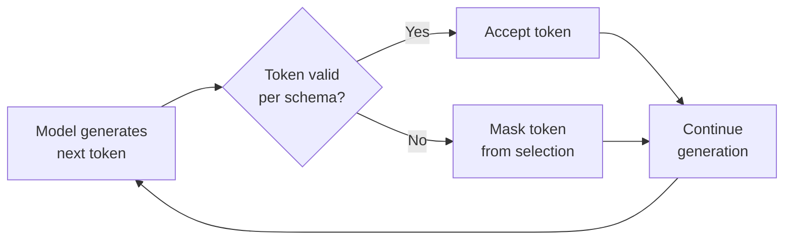

# What Is Strict Mode?

## Introduction

When a language model calls a function, it generates JSON arguments based on the schema you provided. But "based on" is not the same as "guaranteed to match." Without strict enforcement, models can hallucinate extra fields, produce wrong types, skip required parameters, or invent enum values that don't exist. In production, these silent failures cascade through your application — a missing `location` field crashes your weather API call, a string where an integer was expected breaks your database query.

**Strict mode** eliminates this entire category of bugs by constraining the model's token generation to only produce output that conforms to your JSON Schema. It's the difference between hoping the model follows your schema and *guaranteeing* it.

### What we'll cover

- How strict mode provides guaranteed schema adherence
- The constrained decoding mechanism behind it
- Key benefits: type safety, no hallucinated fields, no retries
- How it differs from best-effort schema following

### Prerequisites

- Familiarity with function calling flow ([Lesson 01](../../01-function-calling-fundamentals/00-function-calling-fundamentals.md))
- Understanding of JSON Schema basics ([Lesson 03](../../03-json-schema-for-functions/00-json-schema-for-functions.md))

---

## The problem: best-effort schema following

Without strict mode, the model treats your schema as a *suggestion*. It will try to match the schema most of the time, but there are no hard guarantees. We can see this in practice:

```python
# Your tool definition (without strict mode)
tools = [
    {
        "type": "function",
        "name": "create_order",
        "description": "Creates a new order in the system",
        "parameters": {
            "type": "object",
            "properties": {
                "product_id": {
                    "type": "integer",
                    "description": "The product ID"
                },
                "quantity": {
                    "type": "integer",
                    "description": "Number of items to order"
                },
                "priority": {
                    "type": "string",
                    "enum": ["low", "medium", "high"]
                }
            },
            "required": ["product_id", "quantity"]
        }
    }
]
```

Without strict mode, the model *might* return any of these problematic responses:

```json
// ❌ Wrong type: string instead of integer
{"product_id": "SKU-1234", "quantity": 2, "priority": "high"}

// ❌ Hallucinated field: "rush_delivery" doesn't exist in schema
{"product_id": 1234, "quantity": 2, "priority": "high", "rush_delivery": true}

// ❌ Invalid enum value: "urgent" is not in the enum list
{"product_id": 1234, "quantity": 2, "priority": "urgent"}

// ❌ Wrong type: string instead of integer for quantity
{"product_id": 1234, "quantity": "two", "priority": "high"}
```

Each of these will cause different failures when your code tries to process them — type errors, unexpected keys, validation failures. The traditional solution was defensive coding: validate every field, add retry logic, write extensive error handling. Strict mode makes all of that unnecessary.

---

## How strict mode works: constrained decoding

Strict mode uses a technique called **constrained decoding** (also called **guided generation**). Instead of letting the model freely generate any token sequence and then checking whether the result is valid JSON, constrained decoding restricts the model's token choices *during generation* so that only schema-valid outputs are possible.



Here's what happens step by step:

1. **Schema compilation**: Your JSON Schema is compiled into a grammar or finite-state automaton that defines all valid output sequences
2. **Token masking**: At each generation step, the model's token probabilities are filtered — tokens that would violate the schema are masked out (set to zero probability)
3. **Valid selection**: The model selects from only the remaining valid tokens
4. **Guaranteed output**: The final output is mathematically guaranteed to conform to your schema

> **🤖 AI Context:** This is the same technique used in other constrained generation systems. The key insight is that JSON Schema can be converted to a formal grammar, and formal grammars can constrain token-by-token generation without fundamentally changing how the model works.

### What constrained decoding guarantees

| Guarantee | Description |
|-----------|-------------|
| **Valid JSON syntax** | Output is always parseable JSON — no unclosed brackets, no trailing commas |
| **Correct types** | An `integer` field will always contain an integer, never a string |
| **Required fields present** | Every field in the `required` array will appear in the output |
| **No extra fields** | With `additionalProperties: false`, no hallucinated fields appear |
| **Valid enum values** | Enum fields only contain values from the defined set |
| **Correct nesting** | Nested objects and arrays follow their respective schemas |

---

## Key benefits of strict mode

### 1. No validation or retry logic needed

Without strict mode, production code requires defensive validation:

```python
# ❌ Without strict mode: defensive validation required
def handle_tool_call(arguments: str):
    try:
        args = json.loads(arguments)
    except json.JSONDecodeError:
        return retry_with_backoff()  # Invalid JSON
    
    if not isinstance(args.get("product_id"), int):
        return retry_with_backoff()  # Wrong type
    
    if args.get("priority") not in ["low", "medium", "high", None]:
        return retry_with_backoff()  # Invalid enum
    
    if "product_id" not in args or "quantity" not in args:
        return retry_with_backoff()  # Missing required field
    
    # Finally safe to use
    create_order(**args)
```

With strict mode, you can trust the output directly:

```python
# ✅ With strict mode: parse and use directly
def handle_tool_call(arguments: str):
    args = json.loads(arguments)
    create_order(**args)  # Guaranteed to match schema
```

### 2. Type safety across the boundary

Strict mode creates a reliable contract between the model and your code. When your function signature expects `product_id: int`, strict mode guarantees the model will provide an integer — not a string representation of a number, not a float, not `null`.

### 3. No hallucinated fields

Models sometimes add fields they think would be helpful — a `rush_delivery` flag that doesn't exist in your system, a `notes` field your database doesn't have. With `additionalProperties: false` enforced in strict mode, this cannot happen.

### 4. Predictable enum values

If your schema defines `"enum": ["low", "medium", "high"]`, the model cannot generate `"urgent"`, `"critical"`, or any other creative interpretation. This is critical for systems where enum values map to specific code paths.

---

## Strict mode across providers

All major AI providers now offer some form of strict schema enforcement, though they implement it differently:

| Provider | Feature name | Mechanism |
|----------|-------------|-----------|
| **OpenAI** | Structured Outputs (`strict: true`) | Constrained decoding via compiled grammar |
| **Anthropic** | Strict Tool Use (`strict: true`) | Constrained sampling with compiled grammar artifacts |
| **Google Gemini** | `VALIDATED` mode | Schema validation on function call outputs |

> **Note:** While all three enforce schema conformance, OpenAI and Anthropic use constrained *decoding* (preventing invalid tokens during generation), whereas Gemini's `VALIDATED` mode validates the output after generation. The practical result is similar — your code receives schema-valid arguments — but the underlying mechanisms differ.

---

## When strict mode matters most

Strict mode is especially valuable in these scenarios:

| Scenario | Why strict mode helps |
|----------|---------------------|
| **Agentic workflows** | Agents chain multiple tool calls — one malformed call breaks the entire chain |
| **Database operations** | Wrong types cause SQL errors or data corruption |
| **Financial systems** | A string `"100"` instead of integer `100` could mean incorrect calculations |
| **Multi-tool orchestration** | When the model chooses between many tools, strict mode ensures the right schema is followed for each |
| **User-facing applications** | No error pages from failed tool calls — the system works reliably every time |

---

## Limitations to understand

Strict mode is not a silver bullet. It guarantees *structural* correctness, not *semantic* correctness:

```json
// Structurally valid (passes strict mode) but semantically wrong
{
    "product_id": 99999999,     // ← Valid integer, but product doesn't exist
    "quantity": -5,             // ← Valid integer, but negative quantity is nonsensical
    "priority": "low"           // ← Valid enum, but should be "high" for this order
}
```

Strict mode ensures the JSON matches your schema. It does **not** ensure the *values* are correct for your business logic. You still need application-level validation for things like:

- Whether a referenced ID actually exists
- Whether numeric values are within reasonable ranges
- Whether the chosen function is appropriate for the user's request

> **Tip:** Use strict mode for structural validation and application code for business logic validation. Together, they cover both categories of errors.

---

## Best practices

| Practice | Why it matters |
|----------|---------------|
| ✅ Always enable strict mode in production | Eliminates an entire category of runtime errors |
| ✅ Design schemas with strict mode in mind | Follow the requirements from the start rather than retrofitting |
| ✅ Keep business logic validation separate | Strict mode handles structure; your code handles semantics |
| ✅ Test with strict mode during development | Catch schema issues early, not in production |

---

## Common pitfalls

| ❌ Mistake | ✅ Solution |
|-----------|-------------|
| Assuming strict mode validates *values* | It validates *structure* — add application-level checks for value correctness |
| Using strict mode without following schema requirements | Your request will be rejected — see [Schema Requirements](./03-schema-requirements.md) |
| Thinking strict mode works the same across all providers | Each provider has different requirements and supported features |
| Skipping strict mode for "simple" schemas | Even simple schemas can produce wrong types without enforcement |

---

## Hands-on exercise

### Your task

Compare the behavior of a function call with and without strict mode enabled to observe the difference in output reliability.

### Requirements

1. Define a `create_user` function schema with fields: `name` (string), `age` (integer), `role` (enum: "admin", "editor", "viewer")
2. Write the schema **without** strict mode requirements (missing `additionalProperties: false`, optional `required` array)
3. Rewrite the same schema **with** strict mode requirements
4. List three specific failure modes that strict mode prevents for this schema

### Expected result

Two schema versions (non-strict and strict) and a clear explanation of what strict mode guarantees for each field.

<details>
<summary>💡 Hints (click to expand)</summary>

- The non-strict version can omit fields from `required` and skip `additionalProperties`
- The strict version must have ALL fields in `required` and `additionalProperties: false`
- Think about what happens when `age` comes back as `"25"` instead of `25`

</details>

<details>
<summary>✅ Solution (click to expand)</summary>

**Non-strict schema:**
```json
{
    "type": "function",
    "name": "create_user",
    "description": "Creates a new user account",
    "parameters": {
        "type": "object",
        "properties": {
            "name": {
                "type": "string",
                "description": "The user's full name"
            },
            "age": {
                "type": "integer",
                "description": "The user's age"
            },
            "role": {
                "type": "string",
                "enum": ["admin", "editor", "viewer"],
                "description": "The user's role"
            }
        },
        "required": ["name"]
    }
}
```

**Strict-mode schema:**
```json
{
    "type": "function",
    "name": "create_user",
    "description": "Creates a new user account",
    "strict": true,
    "parameters": {
        "type": "object",
        "properties": {
            "name": {
                "type": "string",
                "description": "The user's full name"
            },
            "age": {
                "type": "integer",
                "description": "The user's age"
            },
            "role": {
                "type": "string",
                "enum": ["admin", "editor", "viewer"],
                "description": "The user's role"
            }
        },
        "required": ["name", "age", "role"],
        "additionalProperties": false
    }
}
```

**Three failure modes strict mode prevents:**

1. **Wrong type for `age`**: Without strict mode, the model might return `"25"` (string) instead of `25` (integer), causing a `TypeError` when your code does arithmetic on it
2. **Hallucinated fields**: The model might add `"email": "user@example.com"` which doesn't exist in your schema, potentially causing issues with `**kwargs` unpacking
3. **Invalid enum for `role`**: The model might generate `"superadmin"` or `"moderator"` instead of one of the three valid values, breaking role-based access control logic

</details>

### Bonus challenges

- [ ] Write a Python function that processes the strict-mode `create_user` call and demonstrate that no validation code is needed
- [ ] Research how your preferred provider documents the constrained decoding mechanism

---

## Summary

✅ **Strict mode** guarantees model outputs conform to your JSON Schema — eliminating hallucinated fields, wrong types, and missing parameters

✅ It works through **constrained decoding**, which masks invalid tokens during generation rather than validating after the fact

✅ All major providers (OpenAI, Anthropic, Gemini) offer strict schema enforcement, though implementation details differ

✅ Strict mode handles **structural** correctness — you still need application code for **semantic** validation (value ranges, ID existence, business rules)

✅ Always enable strict mode in production to eliminate an entire category of runtime errors

---

**Next:** [Enabling Strict Mode →](./02-enabling-strict-mode.md)

---

## Further reading

- [OpenAI Structured Outputs Guide](https://platform.openai.com/docs/guides/structured-outputs) — Comprehensive reference for strict mode implementation
- [Anthropic Structured Outputs](https://platform.claude.com/docs/en/build-with-claude/structured-outputs) — Strict tool use with constrained sampling
- [Gemini Function Calling Modes](https://ai.google.dev/gemini-api/docs/function-calling) — VALIDATED mode and schema enforcement

---

*[Back to Structured Outputs & Strict Mode Overview](./00-structured-outputs-strict-mode.md)*

<!-- 
Sources Consulted:
- OpenAI Structured Outputs Guide: https://platform.openai.com/docs/guides/structured-outputs
- OpenAI Function Calling Guide: https://platform.openai.com/docs/guides/function-calling
- Anthropic Structured Outputs: https://platform.claude.com/docs/en/build-with-claude/structured-outputs
- Anthropic Tool Use: https://platform.claude.com/docs/en/docs/build-with-claude/tool-use
- Google Gemini Function Calling: https://ai.google.dev/gemini-api/docs/function-calling
-->
