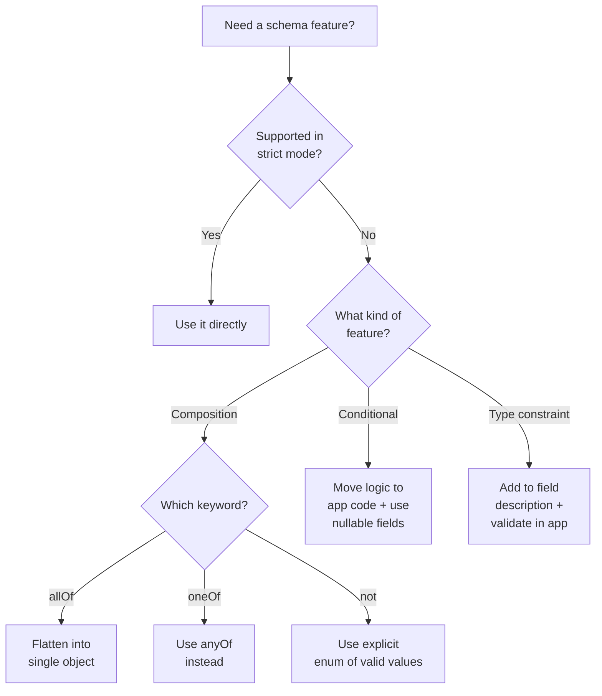

# Unsupported Schema Features

## Introduction

Strict mode supports a *subset* of JSON Schema — not the full specification. If you attempt to use an unsupported feature, the API will reject your request with an error. Knowing what's not supported upfront prevents frustrating trial-and-error cycles and helps you design schemas that work the first time.

This lesson catalogs every unsupported JSON Schema feature in strict mode, explains *why* each is unsupported, and provides practical workarounds for each.

### What we'll cover

- Unsupported composition keywords: `allOf`, `oneOf`, `not`
- Unsupported conditional keywords: `if`/`then`/`else`
- Unsupported validation keywords by type
- Format and pattern limitations
- Provider-specific differences in unsupported features
- Practical workarounds for each limitation

### Prerequisites

- Understanding of strict mode schema requirements ([Sub-lesson 03](./03-schema-requirements.md))
- Familiarity with JSON Schema composition keywords

---

## Unsupported composition keywords

JSON Schema provides several keywords for combining schemas. Strict mode supports only `anyOf` — the rest are unsupported:

| Keyword | Purpose | Supported? |
|---------|---------|------------|
| `anyOf` | Value matches *at least one* of the listed schemas | ✅ Yes |
| `allOf` | Value must match *all* of the listed schemas | ❌ No |
| `oneOf` | Value matches *exactly one* of the listed schemas | ❌ No |
| `not` | Value must *not* match the given schema | ❌ No |

### Why `allOf` is unsupported

`allOf` requires the value to satisfy multiple schemas simultaneously. This creates complex intersections that are difficult to express as a token-generation grammar:

```json
// ❌ Rejected: allOf not supported
{
    "type": "object",
    "allOf": [
        {
            "properties": {
                "name": {"type": "string"}
            },
            "required": ["name"]
        },
        {
            "properties": {
                "age": {"type": "integer"}
            },
            "required": ["age"]
        }
    ]
}
```

**Workaround:** Merge the schemas into a single object definition:

```json
// ✅ Workaround: flatten allOf into one object
{
    "type": "object",
    "properties": {
        "name": {"type": "string"},
        "age": {"type": "integer"}
    },
    "required": ["name", "age"],
    "additionalProperties": false
}
```

### Why `oneOf` is unsupported

`oneOf` requires matching *exactly one* schema, meaning the generator would need to track which schemas are satisfied and ensure no overlap — a complex constraint during token generation:

```json
// ❌ Rejected: oneOf not supported
{
    "result": {
        "oneOf": [
            {"type": "string"},
            {"type": "integer"}
        ]
    }
}
```

**Workaround:** Use `anyOf` instead. In most practical cases, if your sub-schemas are non-overlapping (a value can't be both a string and an integer), `anyOf` behaves identically to `oneOf`:

```json
// ✅ Workaround: use anyOf (works identically for non-overlapping types)
{
    "result": {
        "anyOf": [
            {"type": "string"},
            {"type": "integer"}
        ]
    }
}
```

### Why `not` is unsupported

`not` defines what a value *cannot* be, which is fundamentally at odds with constrained decoding. The generator needs to know what tokens *are valid*, not what tokens are *invalid* in an unbounded way:

```json
// ❌ Rejected: not is not supported
{
    "status": {
        "type": "string",
        "not": {"enum": ["deleted", "archived"]}
    }
}
```

**Workaround:** Define what values *are* valid using `enum`:

```json
// ✅ Workaround: explicitly list allowed values
{
    "status": {
        "type": "string",
        "enum": ["active", "pending", "suspended"]
    }
}
```

---

## Unsupported conditional keywords

JSON Schema's conditional validation keywords are not supported in strict mode:

| Keyword | Purpose | Supported? |
|---------|---------|------------|
| `if` | Condition to evaluate | ❌ No |
| `then` | Schema to apply when `if` is true | ❌ No |
| `else` | Schema to apply when `if` is false | ❌ No |
| `dependentRequired` | Fields required when another field is present | ❌ No |
| `dependentSchemas` | Schema applied when another field is present | ❌ No |

### Example: conditional validation

```json
// ❌ Rejected: if/then/else not supported
{
    "type": "object",
    "properties": {
        "payment_method": {"type": "string", "enum": ["card", "bank_transfer"]},
        "card_number": {"type": "string"},
        "bank_account": {"type": "string"}
    },
    "if": {
        "properties": {"payment_method": {"const": "card"}}
    },
    "then": {
        "required": ["card_number"]
    },
    "else": {
        "required": ["bank_account"]
    }
}
```

**Workaround:** Include all fields as required-but-nullable, and handle the conditional logic in your application code:

```json
// ✅ Workaround: all fields present, use nullable types
{
    "type": "object",
    "properties": {
        "payment_method": {
            "type": "string",
            "enum": ["card", "bank_transfer"]
        },
        "card_number": {
            "type": ["string", "null"],
            "description": "Required for card payments. Null for bank transfers."
        },
        "bank_account": {
            "type": ["string", "null"],
            "description": "Required for bank transfers. Null for card payments."
        }
    },
    "required": ["payment_method", "card_number", "bank_account"],
    "additionalProperties": false
}
```

```python
# Application-level conditional validation
def process_payment(args: dict):
    if args["payment_method"] == "card":
        if args["card_number"] is None:
            raise ValueError("Card number required for card payments")
        charge_card(args["card_number"])
    else:
        if args["bank_account"] is None:
            raise ValueError("Bank account required for bank transfers")
        process_transfer(args["bank_account"])
```

> **🤖 AI Context:** Moving conditional validation to application code is actually a good pattern in practice. The model fills in what it knows, and your code enforces business rules. This separation of concerns makes both the schema and the validation logic simpler.

---

## Unsupported validation keywords by type

Several type-specific validation keywords are also unsupported. The availability depends on whether you're using base models or fine-tuned models:

### For fine-tuned models (most restrictive)

| Type | Unsupported keywords |
|------|---------------------|
| **String** | `minLength`, `maxLength`, `pattern`, `format` |
| **Number** | `minimum`, `maximum`, `multipleOf` |
| **Object** | `patternProperties` |
| **Array** | `minItems`, `maxItems` |

### For base models (more permissive)

Base models on OpenAI support more constraints. The following *are* supported for base models:

| Type | Supported constraints |
|------|----------------------|
| **String** | `pattern`, `format` (specific formats only) |
| **Number** | `minimum`, `maximum`, `exclusiveMinimum`, `exclusiveMaximum`, `multipleOf` |
| **Array** | `minItems`, `maxItems` |

> **Note:** If you're using fine-tuned models, avoid all type-specific constraints. For base models, check your specific provider's documentation as support varies.

### Workaround: describe constraints in descriptions

When you can't use schema-level constraints, describe them in the field description:

```json
// ❌ May be rejected (especially for fine-tuned models)
{
    "username": {
        "type": "string",
        "minLength": 3,
        "maxLength": 20,
        "pattern": "^[a-zA-Z0-9_]+$"
    }
}

// ✅ Workaround: describe constraints in description
{
    "username": {
        "type": "string",
        "description": "Username: 3-20 characters, alphanumeric and underscores only (e.g., 'john_doe')"
    }
}
```

The model will *try* to follow description-based constraints, but they're not enforced at the grammar level. Validate in your application code:

```python
import re

def validate_username(username: str) -> bool:
    if not 3 <= len(username) <= 20:
        return False
    if not re.match(r'^[a-zA-Z0-9_]+$', username):
        return False
    return True
```

---

## `patternProperties` is not supported

`patternProperties` allows defining schemas for properties whose names match a pattern. This is useful for dynamic key names but isn't supported in strict mode:

```json
// ❌ Rejected: patternProperties not supported
{
    "type": "object",
    "patternProperties": {
        "^field_[0-9]+$": {"type": "string"}
    }
}
```

**Workaround:** Use an array of objects with name-value pairs:

```json
// ✅ Workaround: use array of name-value pairs
{
    "type": "object",
    "properties": {
        "fields": {
            "type": "array",
            "items": {
                "type": "object",
                "properties": {
                    "name": {"type": "string"},
                    "value": {"type": "string"}
                },
                "required": ["name", "value"],
                "additionalProperties": false
            }
        }
    },
    "required": ["fields"],
    "additionalProperties": false
}
```

---

## Provider-specific differences

Different providers have slightly different sets of unsupported features:

| Feature | OpenAI | Anthropic | Notes |
|---------|--------|-----------|-------|
| `allOf` | ❌ | ❌ | Flatten into single object |
| `oneOf` | ❌ | ❌ | Use `anyOf` instead |
| `not` | ❌ | ❌ | Use explicit `enum` for allowed values |
| `if/then/else` | ❌ | ❌ | Handle conditionally in app code |
| `patternProperties` | ❌ | ❌ | Use array of key-value objects |
| `dependentRequired` | ❌ | ❌ | Use nullable fields + app validation |
| `$ref` / `$defs` | ✅ | ✅ | Supported for schema reuse |
| `anyOf` | ✅ | ✅ | Supported (not at root level for OpenAI) |
| `string.pattern` | ✅ (base models) | ✅ | Limited regex support |
| `string.format` | ✅ (specific formats) | ✅ (specific formats) | Both support a subset |

> **Important:** Anthropic's SDK can automatically transform schemas with unsupported features. It removes unsupported constraints and adds the constraint information to field descriptions, then validates the response against the original schema. This gives you the best of both worlds, though it means validation happens after generation rather than during it.

---

## Workaround decision flowchart



---

## Best practices

| Practice | Why it matters |
|----------|---------------|
| ✅ Check supported features before designing schemas | Avoid rewriting schemas after API rejections |
| ✅ Use `anyOf` as the universal composition tool | It's the only supported composition keyword |
| ✅ Move conditional logic to application code | Cleaner separation of structural vs business validation |
| ✅ Describe constraints in descriptions as a fallback | The model will try to follow them even without grammar enforcement |
| ✅ Use SDK auto-transformation when available | Anthropic's SDK handles constraint removal and validation automatically |

---

## Common pitfalls

| ❌ Mistake | ✅ Solution |
|-----------|-------------|
| Using `oneOf` assuming it works like `anyOf` | Replace with `anyOf` — behavior is identical for non-overlapping types |
| Relying on `pattern` for critical validation | Use it as a hint, but always validate in application code |
| Trying to use `if/then/else` for dependent fields | Make all fields required + nullable, validate dependencies in code |
| Assuming format constraints are enforced by the grammar | Some formats are best-effort — validate important ones server-side |

---

## Hands-on exercise

### Your task

Refactor a schema that uses unsupported features into a strict-mode-compatible version.

### Requirements

Convert this schema (which uses `allOf`, `if/then/else`, and `minLength`) into strict-mode-compatible format:

```json
{
    "type": "object",
    "allOf": [
        {
            "properties": {
                "action": {"type": "string", "enum": ["create", "update", "delete"]}
            },
            "required": ["action"]
        },
        {
            "properties": {
                "resource_id": {"type": "string", "minLength": 1}
            }
        }
    ],
    "if": {
        "properties": {"action": {"const": "create"}}
    },
    "then": {
        "properties": {
            "name": {"type": "string"}
        },
        "required": ["name"]
    }
}
```

### Expected result

A strict-mode-compatible schema and application code that enforces the conditional validation.

<details>
<summary>💡 Hints (click to expand)</summary>

- Flatten `allOf` into a single object with all properties
- Replace conditional `name` requirement with nullable `name` field
- Describe `minLength` constraint in the description instead
- Handle the "create requires name" rule in Python code

</details>

<details>
<summary>✅ Solution (click to expand)</summary>

**Strict-mode schema:**
```json
{
    "type": "object",
    "properties": {
        "action": {
            "type": "string",
            "enum": ["create", "update", "delete"],
            "description": "The action to perform"
        },
        "resource_id": {
            "type": ["string", "null"],
            "description": "Resource identifier (non-empty string). Null for create actions."
        },
        "name": {
            "type": ["string", "null"],
            "description": "Resource name. Required for create actions. Null for update/delete."
        }
    },
    "required": ["action", "resource_id", "name"],
    "additionalProperties": false
}
```

**Application validation:**
```python
import json

def handle_resource_action(arguments: str):
    args = json.loads(arguments)
    
    action = args["action"]
    resource_id = args["resource_id"]
    name = args["name"]
    
    # Conditional validation (was if/then/else in schema)
    if action == "create":
        if name is None:
            raise ValueError("Name is required for create actions")
    elif action in ("update", "delete"):
        if resource_id is None:
            raise ValueError("Resource ID is required for update/delete")
        if resource_id == "":
            raise ValueError("Resource ID cannot be empty")
    
    # Proceed with the action
    if action == "create":
        return create_resource(name=name)
    elif action == "update":
        return update_resource(resource_id=resource_id, name=name)
    elif action == "delete":
        return delete_resource(resource_id=resource_id)
```
</details>

### Bonus challenges

- [ ] Add a `metadata` object field that is conditionally required for "create" and "update" but not "delete"
- [ ] Write unit tests for the validation logic covering all three action types

---

## Summary

✅ Strict mode supports only `anyOf` for schema composition — `allOf`, `oneOf`, and `not` are unsupported

✅ Conditional keywords (`if`/`then`/`else`, `dependentRequired`) are not available — move conditional logic to application code

✅ Type-specific constraints (`minLength`, `maxLength`, `minimum`, `maximum`) have limited support, especially for fine-tuned models

✅ Workaround patterns: flatten `allOf`, replace `oneOf` with `anyOf`, use explicit `enum` instead of `not`, and describe constraints in field descriptions

✅ Anthropic's SDK can auto-transform schemas with unsupported features, removing constraints and validating responses against the original schema

---

**Previous:** [Optional Parameters in Strict Mode ←](./04-optional-parameters.md)

**Next:** [Schema Caching and Latency →](./06-schema-caching-and-latency.md)

---

## Further reading

- [OpenAI Unsupported Keywords](https://platform.openai.com/docs/guides/structured-outputs#some-type-specific-keywords-are-not-yet-supported) — Full list of unsupported keywords
- [Anthropic JSON Schema Limitations](https://platform.claude.com/docs/en/build-with-claude/structured-outputs#json-schema-limitations) — Anthropic-specific limitations and SDK transformation
- [JSON Schema Composition](https://json-schema.org/understanding-json-schema/reference/composition) — Understanding allOf, oneOf, anyOf, and not

---

*[Back to Structured Outputs & Strict Mode Overview](./00-structured-outputs-strict-mode.md)*

<!-- 
Sources Consulted:
- OpenAI Structured Outputs — Supported Schemas: https://platform.openai.com/docs/guides/structured-outputs#supported-schemas
- OpenAI Structured Outputs — Unsupported Keywords: https://platform.openai.com/docs/guides/structured-outputs#some-type-specific-keywords-are-not-yet-supported
- Anthropic Structured Outputs: https://platform.claude.com/docs/en/build-with-claude/structured-outputs
- JSON Schema Composition: https://json-schema.org/understanding-json-schema/reference/composition
-->
