# Schema Caching and Latency

## Introduction

Strict mode doesn't come for free. The first time you use a new schema, the provider must compile it into a grammar or automaton that constrains token generation. This compilation step adds latency to your first request. Subsequent requests with the same schema benefit from caching, making them significantly faster.

Understanding this performance model helps you design schemas and systems that minimize latency impact in production.

### What we'll cover

- How schema compilation works on first request
- Cache behavior: duration, invalidation, and sharing
- Latency implications for variable schemas
- Data retention and privacy considerations
- Strategies for minimizing first-request latency
- Provider-specific caching differences

### Prerequisites

- Understanding of strict mode and schema requirements ([Sub-lessons 01–05](./01-what-is-strict-mode.md))
- Basic understanding of API latency and caching concepts

---

## First-request schema compilation

When you send a request with `strict: true` and a schema that the provider hasn't seen before, the following happens:

```mermaid
sequenceDiagram
    participant App as Your Application
    participant API as AI Provider API
    participant Cache as Schema Cache
    participant Model as Language Model

    App->>API: Request with strict schema
    API->>Cache: Check for compiled grammar
    Cache-->>API: Cache miss
    API->>API: Compile schema → grammar
    API->>Cache: Store compiled grammar
    API->>Model: Generate with grammar constraints
    Model-->>API: Schema-conforming output
    API-->>App: Response (higher latency)
    
    Note over App,API: Subsequent requests
    App->>API: Same schema again
    API->>Cache: Check for compiled grammar
    Cache-->>API: Cache hit ✅
    API->>Model: Generate with cached grammar
    Model-->>API: Schema-conforming output
    API-->>App: Response (normal latency)
```



### What happens during compilation

1. **Schema parsing**: The JSON Schema is parsed and validated
2. **Grammar generation**: The schema is converted into a context-free grammar or finite-state automaton
3. **Optimization**: The grammar is optimized for efficient token-by-token enforcement
4. **Storage**: The compiled artifact is stored in a cache

This process is computationally expensive — more complex schemas take longer to compile.

### Factors that affect compilation time

| Factor | Impact on compilation time |
|--------|---------------------------|
| **Total number of properties** | More properties = more grammar rules = longer compilation |
| **Nesting depth** | Deeper nesting creates more complex grammar states |
| **Number of enum values** | Large enums expand the grammar significantly |
| **Recursive schemas** | Self-referencing schemas require special handling |
| **Number of `anyOf` branches** | Each branch adds alternative grammar paths |
| **Schema size** | Larger schemas take longer to parse and compile |

---

## Cache behavior

### OpenAI caching

OpenAI caches compiled schemas automatically. Key behaviors:

- **Cache duration**: Schemas are cached for reuse across requests
- **Cache key**: Based on the full schema structure, not the tool name or description
- **Shared caching**: If multiple users send the same schema structure, they benefit from the same cached grammar
- **Invalidation**: Cache is invalidated when the schema structure changes

```python
# Request 1: Schema compiled (slower)
response1 = client.responses.create(
    model="gpt-4o",
    input=[{"role": "user", "content": "Get weather for London"}],
    tools=[weather_tool]     # Schema compiled here
)

# Request 2: Same schema, cache hit (faster)
response2 = client.responses.create(
    model="gpt-4o",
    input=[{"role": "user", "content": "Get weather for Paris"}],
    tools=[weather_tool]     # Uses cached grammar
)
```

> **Note:** Changing the `name` or `description` of a tool does *not* invalidate the cache (OpenAI). Only changes to the schema *structure* (properties, types, etc.) trigger recompilation.

### Anthropic caching

Anthropic's grammar compilation has specific caching characteristics:

| Aspect | Behavior |
|--------|----------|
| **Cache duration** | 24 hours from last use |
| **Automatic** | No manual configuration needed |
| **Invalidation triggers** | Changed JSON schema structure, changed set of tools (when using both structured outputs and tool use) |
| **Does NOT invalidate** | Changing only `name` or `description` fields |

```python
# First request: grammar compiled (additional latency)
response1 = client.messages.create(
    model="claude-sonnet-4-20250514",
    max_tokens=1024,
    messages=[{"role": "user", "content": "Search for laptops"}],
    tools=[search_tool]     # Grammar compiled here
)

# Within 24 hours, same schema: cache hit
response2 = client.messages.create(
    model="claude-sonnet-4-20250514",
    max_tokens=1024,
    messages=[{"role": "user", "content": "Search for phones"}],
    tools=[search_tool]     # Uses cached grammar
)
```

---

## Variable schemas and latency impact

If your application generates different schemas for different requests, each unique schema requires its own compilation. This is the most common source of unexpected latency with strict mode.

### The problem: dynamic schemas

```python
# ❌ Bad: generating unique schemas per request
def create_tool_for_user(user_preferences: dict):
    # Every user gets a slightly different schema
    properties = {}
    for pref in user_preferences:
        properties[pref["name"]] = {"type": pref["type"]}
    
    return {
        "type": "function",
        "name": "user_action",
        "strict": True,
        "parameters": {
            "type": "object",
            "properties": properties,
            "required": list(properties.keys()),
            "additionalProperties": False
        }
    }
```

Each user's unique schema triggers a new compilation, adding latency to every first interaction.

### The solution: stable schemas with runtime flexibility

```python
# ✅ Good: one stable schema, handle variability at runtime
tools = [
    {
        "type": "function",
        "name": "user_action",
        "strict": True,
        "parameters": {
            "type": "object",
            "properties": {
                "action_type": {
                    "type": "string",
                    "enum": ["update_profile", "change_settings", "send_message"]
                },
                "parameters": {
                    "type": "array",
                    "items": {
                        "type": "object",
                        "properties": {
                            "key": {"type": "string"},
                            "value": {"type": "string"}
                        },
                        "required": ["key", "value"],
                        "additionalProperties": False
                    }
                }
            },
            "required": ["action_type", "parameters"],
            "additionalProperties": False
        }
    }
]
```

This single schema works for all users. The flexibility is in the `parameters` array — different key-value pairs for different use cases, same compiled grammar.

---

## Data retention considerations

Schema caching has implications for data privacy and retention policies:

### OpenAI

For fine-tuned models specifically:

- Schemas are cached for performance
- Cached schemas are **not eligible** for [zero data retention (ZDR)](https://platform.openai.com/docs/models#how-we-use-your-data)
- If your organization has ZDR agreements, be aware that schemas (but not request/response content) are retained in the cache

> **Important:** This applies to the *schemas themselves*, not to the data in the requests or responses. The schema defines the *structure* (field names, types); the actual values are handled by your existing data retention policies.

### Anthropic

- Compiled grammars are cached for 24 hours from last use
- The cache stores the compiled grammar artifact, not the raw schema definition
- Changing the `output_config.format` parameter invalidates any prompt cache for that conversation thread

### Practical implications

| Concern | Recommendation |
|---------|---------------|
| Schema contains sensitive field names | Consider if field names in the schema reveal confidential information |
| Compliance with data retention policies | Check if schema caching aligns with your organization's data policies |
| Multi-tenant applications | Same schema structure across tenants shares the cache — this is usually beneficial |

---

## Strategies for minimizing latency

### Strategy 1: warm the cache on deployment

Make a dummy request with your schema on startup to trigger compilation before real users hit it:

```python
import asyncio

async def warm_schema_cache(tools: list):
    """Pre-compile schemas by making a lightweight request."""
    try:
        response = await client.responses.create(
            model="gpt-4o",
            input=[{"role": "user", "content": "test"}],
            tools=tools,
            max_output_tokens=1  # Minimize response generation
        )
    except Exception:
        pass  # We only care about schema compilation

# Run during application startup
asyncio.run(warm_schema_cache(my_tools))
```

### Strategy 2: minimize schema count

Fewer unique schemas = fewer compilations:

```python
# ❌ Bad: 10 separate tools with 10 separate schemas
tools = [tool_1, tool_2, tool_3, ..., tool_10]

# ✅ Better: consolidate related tools into fewer schemas
tools = [
    combined_search_tool,      # Handles search, filter, sort
    combined_mutation_tool,    # Handles create, update, delete
    notification_tool          # Handles all notification types
]
```

### Strategy 3: keep schemas stable across deployments

Version your schemas carefully. A minor change to the schema structure (adding a field, changing a type) invalidates the cache:

```python
# Version 1.0 - compiled and cached
schema_v1 = {
    "properties": {
        "query": {"type": "string"},
        "limit": {"type": "integer"}
    }
}

# Version 1.1 - adding a field invalidates the cache
schema_v1_1 = {
    "properties": {
        "query": {"type": "string"},
        "limit": {"type": "integer"},
        "offset": {"type": "integer"}  # ← New field = new compilation
    }
}
```

> **Tip:** Batch schema changes into versioned releases rather than making incremental changes. This minimizes the number of cache invalidations.

### Strategy 4: use prompt caching alongside schema caching

OpenAI and Anthropic both offer prompt caching that works alongside schema caching:

```python
# Anthropic: cache long system prompts + tools together
response = client.messages.create(
    model="claude-sonnet-4-20250514",
    max_tokens=1024,
    system=[
        {
            "type": "text",
            "text": "You are a helpful assistant...",
            "cache_control": {"type": "ephemeral"}  # Cache this system prompt
        }
    ],
    messages=[{"role": "user", "content": "Help me search for products"}],
    tools=[search_tool]  # Schema cache is separate from prompt cache
)
```

---

## Measuring compilation latency

Track first-request vs. subsequent-request latency to understand the cache impact:

```python
import time

def measure_latency(client, tools, prompt):
    start = time.time()
    response = client.responses.create(
        model="gpt-4o",
        input=[{"role": "user", "content": prompt}],
        tools=tools
    )
    elapsed = time.time() - start
    return elapsed

# First request (includes compilation)
latency_1 = measure_latency(client, tools, "Get weather for London")
print(f"First request:      {latency_1:.2f}s")

# Second request (cached grammar)
latency_2 = measure_latency(client, tools, "Get weather for Paris")
print(f"Subsequent request: {latency_2:.2f}s")

print(f"Compilation overhead: ~{latency_1 - latency_2:.2f}s")
```

**Example output:**
```
First request:      1.85s
Subsequent request: 0.92s
Compilation overhead: ~0.93s
```

> **Note:** Actual latency varies significantly based on schema complexity, server load, and model. The overhead is typically more noticeable for complex schemas with many properties and nesting levels.

---

## Best practices

| Practice | Why it matters |
|----------|---------------|
| ✅ Use stable, reusable schemas | Maximizes cache hits, minimizes compilation overhead |
| ✅ Warm the cache on deployment | Prevents first users from experiencing compilation latency |
| ✅ Monitor first-request latency | Identify when cache misses are affecting user experience |
| ✅ Batch schema changes into releases | Fewer cache invalidations over time |
| ✅ Consider data retention implications | Schema caching may not be compatible with ZDR policies |

---

## Common pitfalls

| ❌ Mistake | ✅ Solution |
|-----------|-------------|
| Generating unique schemas per request | Use stable schemas with runtime flexibility (key-value arrays, etc.) |
| Not warming the cache after deployment | Add a cache-warming step to your deployment pipeline |
| Making frequent small schema changes | Batch changes into versioned releases |
| Ignoring first-request latency in benchmarks | Always measure both cold (first) and warm (subsequent) request latency |
| Assuming schema caching is cross-model | Changing the model may require recompilation — verify with your provider |

---

## Hands-on exercise

### Your task

Design a caching-friendly tool system that avoids unnecessary schema recompilation.

### Requirements

1. You have three related search functions: `search_products`, `search_users`, `search_orders`
2. Each has similar parameters: `query` (string), `filters` (varying per type), `limit` (integer), `offset` (integer)
3. Design a single consolidated schema that handles all three search types without needing separate compilations
4. Write the application routing code that dispatches to the correct search handler

### Expected result

One stable schema that serves all three search types, plus routing code.

<details>
<summary>💡 Hints (click to expand)</summary>

- Use an `entity_type` enum to specify which type of search
- Use a generic `filters` array with key-value pairs instead of type-specific filter objects
- This trades some schema expressiveness for better caching behavior

</details>

<details>
<summary>✅ Solution (click to expand)</summary>

**Consolidated schema:**
```json
{
    "type": "function",
    "name": "search",
    "description": "Search across products, users, or orders",
    "strict": true,
    "parameters": {
        "type": "object",
        "properties": {
            "entity_type": {
                "type": "string",
                "enum": ["products", "users", "orders"],
                "description": "What type of entity to search for"
            },
            "query": {
                "type": "string",
                "description": "Search query text"
            },
            "filters": {
                "type": "array",
                "description": "Search filters as key-value pairs",
                "items": {
                    "type": "object",
                    "properties": {
                        "field": {"type": "string"},
                        "value": {"type": "string"}
                    },
                    "required": ["field", "value"],
                    "additionalProperties": false
                }
            },
            "limit": {
                "type": "integer",
                "description": "Maximum results to return"
            },
            "offset": {
                "type": "integer",
                "description": "Number of results to skip"
            }
        },
        "required": ["entity_type", "query", "filters", "limit", "offset"],
        "additionalProperties": false
    }
}
```

**Routing code:**
```python
import json

SEARCH_HANDLERS = {
    "products": search_products,
    "users": search_users,
    "orders": search_orders,
}

def handle_search(arguments: str):
    args = json.loads(arguments)
    
    entity_type = args["entity_type"]
    handler = SEARCH_HANDLERS[entity_type]
    
    # Convert filter array to dict
    filters = {f["field"]: f["value"] for f in args["filters"]}
    
    return handler(
        query=args["query"],
        filters=filters,
        limit=args["limit"],
        offset=args["offset"]
    )
```

**Why this is better for caching:** One schema gets compiled once and cached, serving all three search types. Three separate schemas would require three compilations.

</details>

### Bonus challenges

- [ ] Add a cache-warming script that pre-compiles the schema on application startup
- [ ] Measure the latency difference between first and subsequent requests with your consolidated schema

---

## Summary

✅ First requests with a new schema incur **compilation overhead** as the schema is converted to a constrained generation grammar

✅ Compiled grammars are **cached automatically** — Anthropic for 24 hours from last use, OpenAI duration varies

✅ Cache is keyed on **schema structure**, not tool name or description — changing names doesn't invalidate the cache

✅ **Variable schemas** (unique per request) are the main cause of unexpected latency — use stable schemas with runtime flexibility

✅ Schema caching may **not be eligible for zero data retention** policies — verify with your provider if compliance is critical

✅ **Warm the cache** on deployment and **batch schema changes** into releases to minimize production latency impact

---

**Previous:** [Unsupported Schema Features ←](./05-unsupported-schema-features.md)

**Next:** [Structured Outputs vs JSON Mode →](./07-structured-outputs-vs-json-mode.md)

---

## Further reading

- [OpenAI Function Calling — Strict Mode Limitations](https://platform.openai.com/docs/guides/function-calling#strict-mode) — Caching and data retention notes
- [Anthropic Grammar Compilation and Caching](https://platform.claude.com/docs/en/build-with-claude/structured-outputs#grammar-compilation-and-caching) — 24-hour cache behavior
- [OpenAI Prompt Caching](https://platform.openai.com/docs/guides/prompt-caching) — Complementary caching for system prompts

---

*[Back to Structured Outputs & Strict Mode Overview](./00-structured-outputs-strict-mode.md)*

<!-- 
Sources Consulted:
- OpenAI Function Calling — Strict Mode: https://platform.openai.com/docs/guides/function-calling#strict-mode
- OpenAI Structured Outputs Guide: https://platform.openai.com/docs/guides/structured-outputs
- Anthropic Structured Outputs — Grammar Compilation and Caching: https://platform.claude.com/docs/en/build-with-claude/structured-outputs#grammar-compilation-and-caching
- Anthropic Structured Outputs — Prompt Modification and Token Costs: https://platform.claude.com/docs/en/build-with-claude/structured-outputs#prompt-modification-and-token-costs
-->
