# Structured outputs vs JSON mode

## Introduction

Before structured outputs existed, JSON mode was the primary way to get JSON responses from language models. While both produce valid JSON, they differ fundamentally in what they guarantee. Understanding these differences helps you choose the right approach and migrate existing systems confidently.

### What we'll cover

- What JSON mode provides (and doesn't)
- How structured outputs go beyond JSON mode
- Side-by-side reliability comparison
- When each approach is appropriate
- Migration path from JSON mode to structured outputs

### Prerequisites

- Familiarity with strict mode concepts ([Sub-lesson 01](./01-what-is-strict-mode.md))
- Understanding of schema requirements ([Sub-lesson 03](./03-schema-requirements.md))
- Basic experience with API-based JSON responses

---

## JSON mode: valid JSON, no schema

JSON mode instructs the model to produce output that is *syntactically valid JSON*. That's the only guarantee.

### How JSON mode works


The model attempts to produce valid JSON, but it has no concept of *your* schema. It doesn't know what fields you expect, what types they should be, or what values are valid.

### Enabling JSON mode

**OpenAI:**

```python
response = client.chat.completions.create(
    model="gpt-4o",
    messages=[
        {
            "role": "system",
            "content": "Extract user info. Respond in JSON."  # Must mention "JSON"
        },
        {"role": "user", "content": "John Smith, age 30, email john@example.com"}
    ],
    response_format={"type": "json_object"}
)

result = json.loads(response.choices[0].message.content)
# Could be: {"name": "John Smith", "age": 30, "email": "john@example.com"}
# Could be: {"user": {"full_name": "John Smith", "years_old": 30, "contact": "john@example.com"}}
# Could be: {"data": [{"field": "name", "value": "John Smith"}, ...]}
# All valid JSON, but unpredictable structure
```

> **Warning:** OpenAI requires you to include the word "JSON" somewhere in the system or user message when using JSON mode. Without it, the API may return an error or ignore the format setting.

**Anthropic:**

Anthropic does not offer a separate "JSON mode." Instead, you get structured output through tool use with `strict: true` or via `output_config` with a schema — both of which are structured outputs, not JSON mode.

### The problems with JSON mode

JSON mode guarantees the output is valid JSON, but:

| Issue | Example |
|-------|---------|
| **Unpredictable field names** | `"name"` vs `"full_name"` vs `"user_name"` |
| **Missing fields** | Some responses omit fields you expect |
| **Extra fields** | Model adds fields you didn't ask for |
| **Wrong types** | `"age": "30"` (string) instead of `"age": 30` (integer) |
| **Inconsistent structure** | Flat object in one response, nested in the next |
| **Hallucinated keys** | Model invents plausible but incorrect field names |

```python
# JSON mode: you always need validation
def parse_user_response_json_mode(raw_json: str) -> dict:
    data = json.loads(raw_json)  # Valid JSON ✅
    
    # But is it the RIGHT JSON? Manual checking needed:
    if "name" not in data and "full_name" not in data:
        raise ValueError("No name field found")
    
    name = data.get("name") or data.get("full_name") or data.get("user_name")
    
    age = data.get("age")
    if isinstance(age, str):
        age = int(age)  # Model sometimes returns strings
    
    email = data.get("email") or data.get("contact_email") or data.get("e-mail")
    
    return {"name": name, "age": age, "email": email}
```

---

## Structured outputs: schema adherence

Structured outputs (with strict mode) guarantee that the output conforms to your *exact schema*. Every field name, every type, every constraint is enforced at the token generation level.

### How structured outputs work

```mermaid
flowchart LR
    A[Prompt + Schema] --> B[Compile schema → grammar]
    B --> C[Generate token]
    C --> D{Token valid per grammar?}
    D -->|Yes| E[Accept token]
    D -->|No| F[Mask token, select valid alternative]
    F --> E
    E --> G{Response complete?}
    G -->|No| C
    G -->|Yes| H[Return schema-conforming response]
```



The schema is compiled into a grammar *before* generation starts. Every token is validated against this grammar in real time. The output is guaranteed to match your schema.

### Enabling structured outputs

**OpenAI (responses API):**

```python
from pydantic import BaseModel

class UserInfo(BaseModel):
    name: str
    age: int
    email: str

response = client.responses.parse(
    model="gpt-4o",
    input=[
        {"role": "user", "content": "John Smith, age 30, email john@example.com"}
    ],
    text_format=UserInfo
)

user = response.output_parsed
# Always: UserInfo(name="John Smith", age=30, email="john@example.com")
# Guaranteed: correct field names, correct types, no extra fields
```

**No validation code needed.** The schema guarantees the structure.

---

## Side-by-side comparison

| Feature | JSON mode | Structured outputs (strict) |
|---------|-----------|----------------------------|
| **Output is valid JSON** | ✅ Yes | ✅ Yes |
| **Output matches your schema** | ❌ No guarantee | ✅ Guaranteed |
| **Correct field names** | ❌ May vary | ✅ Exact match |
| **Correct types** | ❌ May vary | ✅ Enforced |
| **No extra fields** | ❌ Model may add fields | ✅ `additionalProperties: false` |
| **No missing fields** | ❌ Model may omit fields | ✅ All fields in `required` |
| **Enum values respected** | ❌ Model may hallucinate values | ✅ Constrained to enum list |
| **Requires "JSON" in prompt** | ✅ Yes (OpenAI) | ❌ No |
| **First-request latency** | None | Higher (schema compilation) |
| **Schema restrictions** | None | Yes ([Sub-lesson 05](./05-unsupported-schema-features.md)) |
| **Available models** | Broader availability | Newer models only |

### Reliability in practice

Consider extracting a product from free-text input with this target schema:

```json
{
    "name": "string",
    "price": "number", 
    "category": "electronics | clothing | food",
    "in_stock": "boolean"
}
```

**JSON mode results** (hypothetical across 100 requests):

| Issue | Frequency |
|-------|-----------|
| Correct schema | ~70-85% |
| Wrong field name (`product_name` instead of `name`) | ~5-10% |
| Wrong type (`"price": "29.99"` as string) | ~3-8% |
| Extra fields added (`"description"`, `"id"`) | ~5-15% |
| Missing fields | ~2-5% |
| Invalid enum value (`"category": "tech"`) | ~3-7% |

**Structured outputs results** (across 100 requests):

| Issue | Frequency |
|-------|-----------|
| Correct schema | 100% |
| Wrong field name | 0% |
| Wrong type | 0% |
| Extra fields | 0% |
| Missing fields | 0% |
| Invalid enum value | 0% |

> **🔑 Key concept:** Structured outputs eliminate an entire category of bugs — schema conformance errors. The remaining concern is *semantic correctness*: the model might extract the wrong *value* (e.g., misreading a price), but the *structure* is always correct.

---

## When to use each approach

### Use structured outputs when

- **Building production systems** that need reliable parsing
- **Type-safe pipelines** where downstream code depends on exact schema
- **Critical applications** (financial, medical, legal data extraction)
- **Multi-step tool chains** where one tool's output feeds another
- **Eliminating retry logic** for schema validation failures

### Use JSON mode when

- **Exploratory prototyping** where schema isn't finalized yet
- **Free-form JSON** where you genuinely don't know the structure in advance
- **Older model compatibility** when structured outputs aren't available
- **Minimal latency** when you can't tolerate any first-request compilation overhead
- **Schema features** you need aren't supported in strict mode (e.g., `oneOf`, `patternProperties`)

### Decision flowchart

```mermaid
flowchart TD
    A[Need JSON output from LLM] --> B{Know the exact schema?}
    B -->|Yes| C{Model supports strict mode?}
    B -->|No| D[Use JSON mode]
    C -->|Yes| E{Schema uses only supported features?}
    C -->|No| D
    E -->|Yes| F[Use structured outputs ✅]
    E -->|No| G{Can refactor schema?}
    G -->|Yes| H[Refactor then use structured outputs]
    G -->|No| I{Acceptable to validate manually?}
    I -->|Yes| D
    I -->|No| H
```



---

## Migrating from JSON mode to structured outputs

If you have an existing system using JSON mode, here's how to migrate:

### Step 1: define your implicit schema explicitly

You likely already have validation code that reveals your expected schema:

```python
# Before: JSON mode with manual validation
def parse_product(raw_json: str) -> dict:
    data = json.loads(raw_json)
    return {
        "name": str(data.get("name", "")),
        "price": float(data.get("price", 0)),
        "category": data.get("category", "unknown"),
        "in_stock": bool(data.get("in_stock", False))
    }

# The implicit schema IS:
# name: string, price: number, category: string, in_stock: boolean
```

### Step 2: create the formal schema

```python
from pydantic import BaseModel

class Product(BaseModel):
    name: str
    price: float
    category: str
    in_stock: bool
```

### Step 3: switch to structured outputs

```python
# After: structured outputs, no validation needed
response = client.responses.parse(
    model="gpt-4o",
    input=[
        {"role": "user", "content": product_description}
    ],
    text_format=Product
)

product = response.output_parsed
# product.name, product.price, product.category, product.in_stock
# All guaranteed to be present and correctly typed
```

### Step 4: remove validation code

The biggest benefit of migration — you can delete all the defensive parsing, type coercion, and field-name normalization code:

```python
# DELETE all of this:
#   - json.loads() try/except blocks for malformed JSON
#   - Field name fallback chains (name or full_name or product_name)
#   - Type coercion (str to int, str to float)
#   - Missing field defaults
#   - Extra field filtering
#   - Retry-on-schema-error loops

# KEEP:
#   - Semantic validation (is the price reasonable? is the name real?)
#   - Business logic validation (is this category allowed for this store?)
```

### Migration checklist

- [ ] Identify all JSON mode usages in your codebase
- [ ] Extract implicit schemas from validation code
- [ ] Create Pydantic models or JSON Schema definitions
- [ ] Check for unsupported schema features ([Sub-lesson 05](./05-unsupported-schema-features.md))
- [ ] Refactor unsupported features using workarounds
- [ ] Switch API calls to structured output format
- [ ] Test with real prompts to verify semantic accuracy
- [ ] Remove obsolete validation/retry code
- [ ] Monitor first-request latency ([Sub-lesson 06](./06-schema-caching-and-latency.md))
- [ ] Warm schema cache in deployment pipeline

---

## Best practices

| Practice | Why it matters |
|----------|---------------|
| ✅ Default to structured outputs for new features | Eliminates an entire class of bugs from day one |
| ✅ Migrate JSON mode incrementally | Start with highest-value schemas (most validation code) |
| ✅ Delete validation code after migration | Dead code creates confusion; trust the schema guarantees |
| ✅ Keep semantic validation | Structured outputs guarantee structure, not correctness of values |
| ✅ Test with real-world prompts during migration | Schema match ≠ semantic accuracy; verify the model still extracts correct values |

---

## Common pitfalls

| ❌ Mistake | ✅ Solution |
|-----------|-------------|
| Keeping validation code after migrating to structured outputs | Remove schema validation; keep only business logic validation |
| Assuming JSON mode is "good enough" for production | Measure actual schema conformance rate — it's often lower than expected |
| Migrating without checking for unsupported schema features | Audit schemas against the [supported features list](./05-unsupported-schema-features.md) first |
| Removing all validation after migration | Keep *semantic* validation — structured outputs don't guarantee correct *values* |
| Not testing with edge-case prompts after migration | Run your full test suite; model behavior may differ with schema constraints |

---

## Hands-on exercise

### Your task

Migrate a JSON mode implementation to structured outputs.

### Starting code (JSON mode)

```python
import json

def extract_contact(raw_json: str) -> dict:
    """Parse a contact from JSON mode response with defensive coding."""
    data = json.loads(raw_json)
    
    # Field name normalization
    name = (data.get("name") or data.get("full_name") 
            or data.get("contact_name") or "Unknown")
    
    # Type coercion
    phone = str(data.get("phone") or data.get("phone_number") or "")
    
    # Enum validation
    contact_type = data.get("type") or data.get("contact_type") or "personal"
    if contact_type not in ("personal", "business", "emergency"):
        contact_type = "personal"
    
    # Optional field handling
    notes = data.get("notes") or data.get("additional_notes")
    
    return {
        "name": name,
        "phone": phone,
        "type": contact_type,
        "notes": notes  # May be None
    }
```

### Requirements

1. Create a Pydantic model (or JSON Schema) that captures the implicit schema
2. Handle the `notes` field as optional using the nullable pattern from [Sub-lesson 04](./04-optional-parameters.md)
3. Use `contact_type` as an enum with values `personal`, `business`, `emergency`
4. Write the structured outputs API call to replace the JSON mode call
5. Show how much validation code can be deleted

### Expected result

A clean, minimal implementation with no defensive parsing code.

<details>
<summary>💡 Hints (click to expand)</summary>

- The `notes` field should use `Optional[str] = None` in Pydantic
- Use `Literal["personal", "business", "emergency"]` for the enum
- The entire `extract_contact` function can be replaced by Pydantic's parsing

</details>

<details>
<summary>✅ Solution (click to expand)</summary>

**Pydantic model:**
```python
from pydantic import BaseModel
from typing import Optional, Literal

class Contact(BaseModel):
    name: str
    phone: str
    contact_type: Literal["personal", "business", "emergency"]
    notes: Optional[str] = None
```

**Structured outputs call:**
```python
from openai import OpenAI

client = OpenAI()

response = client.responses.parse(
    model="gpt-4o",
    input=[
        {
            "role": "system",
            "content": "Extract contact information from the user's message."
        },
        {
            "role": "user",
            "content": "Add John Smith, business contact, phone 555-0123, no notes"
        }
    ],
    text_format=Contact
)

contact = response.output_parsed
print(contact.name)          # "John Smith"
print(contact.phone)         # "555-0123"
print(contact.contact_type)  # "business"
print(contact.notes)         # None
```

**What we deleted:**
```python
# ALL of this is gone:
# - json.loads() call
# - Field name normalization (name/full_name/contact_name fallback)
# - Type coercion (str() wrapping)
# - Enum validation (if/not in check)
# - Optional field fallback chains
# - Default value assignments
# - The entire extract_contact() function (27 lines → 0 lines)
```

**Lines of parsing code: 27 → 0**

</details>

### Bonus challenges

- [ ] Write the equivalent JSON Schema (not Pydantic) for the same `Contact` structure
- [ ] Migrate a second, more complex JSON mode parser from your own codebase
- [ ] Measure the reliability improvement by running both approaches against 20 varied prompts

---

## Summary

✅ **JSON mode** guarantees valid JSON syntax but provides no schema guarantees — field names, types, and structure can vary unpredictably

✅ **Structured outputs** guarantee both valid JSON *and* exact schema conformance through constrained token generation

✅ Structured outputs achieve **100% schema reliability** compared to JSON mode's ~70-85% in typical use cases

✅ **Migration** involves formalizing implicit schemas, switching API calls, and deleting validation/retry code

✅ Keep **semantic validation** after migrating — structured outputs guarantee structure, not the correctness of extracted values

✅ Default to **structured outputs for all new features**; use JSON mode only when schema is truly unknown or unsupported features are required

---

**Previous:** [Schema Caching and Latency ←](./06-schema-caching-and-latency.md)

**Next:** [Lesson 15: Built-in Platform Tools →](../15-built-in-platform-tools/00-built-in-platform-tools.md)

---

## Further reading

- [OpenAI Structured Outputs Guide](https://platform.openai.com/docs/guides/structured-outputs) — Full documentation including JSON mode comparison
- [Anthropic Structured Outputs](https://platform.claude.com/docs/en/build-with-claude/structured-outputs) — Strict tool use and JSON outputs
- [OpenAI JSON Mode vs Structured Outputs](https://platform.openai.com/docs/guides/structured-outputs#structured-outputs-vs-json-mode) — Official comparison table

---

*[Back to Structured Outputs & Strict Mode Overview](./00-structured-outputs-strict-mode.md)*

<!-- 
Sources Consulted:
- OpenAI Structured Outputs Guide — JSON mode comparison: https://platform.openai.com/docs/guides/structured-outputs#structured-outputs-vs-json-mode
- OpenAI Structured Outputs Guide — supported schemas: https://platform.openai.com/docs/guides/structured-outputs#supported-schemas
- Anthropic Structured Outputs: https://platform.claude.com/docs/en/build-with-claude/structured-outputs
- OpenAI JSON mode documentation: https://platform.openai.com/docs/guides/structured-outputs#json-mode
-->
