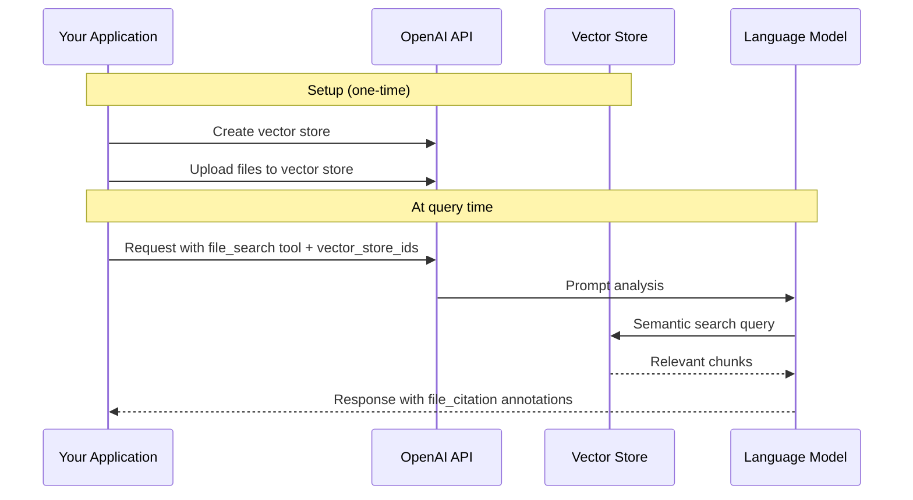
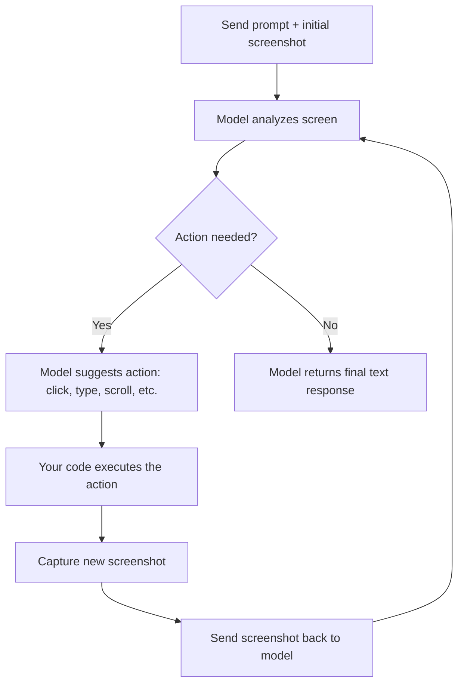

# OpenAI Built-in Tools

## Introduction

OpenAI provides a suite of managed tools that extend what models can do beyond text generation. Instead of defining a function, executing it yourself, and sending results back, built-in tools handle everything server-side — the model decides to use them, OpenAI executes them, and you receive the final response with results already incorporated.

This sub-lesson covers four OpenAI built-in tools: web search for real-time information, code interpreter for running Python in a sandbox, file search for querying your uploaded documents, and computer use for automating browser interactions.

### What we'll cover

- Web search: configuration, domain filtering, user location, citations
- Code interpreter: containers, memory tiers, file handling
- File search: vector stores, metadata filtering, retrieval customization
- Computer use: the CUA loop, safety checks, and limitations

### Prerequisites

- OpenAI API access and SDK setup
- Understanding of function calling basics ([Lesson 01](../01-function-calling-concepts/00-function-calling-concepts.md))
- Familiarity with the Responses API format

---

## Web search

Web search allows models to access up-to-date information from the internet and provide answers with sourced citations. Unlike function calling where you'd build your own search integration, this tool is fully managed — the model searches, retrieves, and synthesizes results automatically.

### Enabling web search

```python
from openai import OpenAI

client = OpenAI()

response = client.responses.create(
    model="gpt-4o",
    tools=[
        {"type": "web_search"}
    ],
    input="What was a positive news story from today?"
)

print(response.output_text)
```

**Output:**
```
Today, scientists announced a breakthrough in carbon capture technology...
[Citations included automatically]
```

> **Note:** Web search works with both reasoning and non-reasoning models. With reasoning models like o3, the model can perform agentic search — planning multiple searches, analyzing results, and deciding whether to keep searching.

### Three types of web search

| Type | How it works | Best for |
|------|-------------|----------|
| **Non-reasoning search** | Model sends query → gets results → responds | Quick lookups, simple factual questions |
| **Agentic search** (reasoning models) | Model plans searches, analyzes results, searches more if needed | Complex research, multi-faceted questions |
| **Deep research** | Extended investigation using hundreds of sources, runs for minutes | In-depth reports, comprehensive analysis |

### Domain filtering

Restrict search results to specific domains using an allow-list of up to 100 URLs:

```python
response = client.responses.create(
    model="gpt-4o",
    tools=[{
        "type": "web_search",
        "filters": {
            "allowed_domains": [
                "pubmed.ncbi.nlm.nih.gov",
                "clinicaltrials.gov",
                "www.who.int"
            ]
        }
    }],
    input="What are the latest findings on semaglutide for diabetes treatment?"
)
```

> **Tip:** Omit the `https://` prefix when specifying domains. Use `openai.com` not `https://openai.com/`. Subdomains are included automatically.

### User location

Refine search results based on geography:

```python
response = client.responses.create(
    model="gpt-4o",
    tools=[{
        "type": "web_search",
        "user_location": {
            "type": "approximate",
            "country": "GB",
            "city": "London",
            "region": "London"
        }
    }],
    input="What are the best restaurants near me?"
)
```

The `country` field uses [ISO 3166-1](https://en.wikipedia.org/wiki/ISO_3166-1) two-letter codes. The `timezone` field uses [IANA timezone](https://timeapi.io/documentation/iana-timezones) format like `America/Chicago`.

### Output and citations

Web search responses include two output items:

1. **`web_search_call`** — the search call with action details and optional source list
2. **`message`** — the response text with `url_citation` annotations

```json
{
    "type": "url_citation",
    "start_index": 2606,
    "end_index": 2758,
    "url": "https://example.com/article",
    "title": "Article Title"
}
```

> **Important:** When displaying web results to end users, inline citations must be clearly visible and clickable in your UI. This is a requirement of the OpenAI usage policy.

### Live internet access control

Control whether the tool fetches live content or uses cached/indexed results:

```python
response = client.responses.create(
    model="gpt-4o",
    tools=[
        {"type": "web_search", "external_web_access": False}  # Cache-only mode
    ],
    input="What is the capital of France?"
)
```

---

## Code interpreter

Code interpreter allows models to write and run Python code in a sandboxed environment. The model iteratively writes code, executes it, observes results, and refines — solving problems in data analysis, math, coding, and file processing.

### Use cases

- Processing files with diverse data and formatting
- Generating charts, graphs, and data visualizations
- Writing and debugging code iteratively
- Solving complex mathematical equations
- Boosting visual intelligence (crop, zoom, rotate images with reasoning models)

### Enabling code interpreter

```python
from openai import OpenAI

client = OpenAI()

response = client.responses.create(
    model="gpt-4.1",
    tools=[{
        "type": "code_interpreter",
        "container": {"type": "auto", "memory_limit": "4g"}
    }],
    instructions="You are a personal math tutor. When asked a math question, write and run code to answer it.",
    input="I need to solve the equation 3x + 11 = 14. Can you help me?"
)

print(response.output_text)
```

**Output:**
```
The solution to the equation 3x + 11 = 14 is x = 1.

Here's how I solved it:
3x + 11 = 14
3x = 3
x = 1
```

> **Note:** While OpenAI calls this "code interpreter," the model knows it as the "python tool." The most explicit way to invoke it is to ask for "the python tool" in your prompts.

### Containers

Code interpreter runs in sandboxed containers with configurable memory:

| Memory tier | Use case |
|------------|----------|
| `1g` (default) | Simple calculations, small data processing |
| `4g` | Medium datasets, basic data analysis |
| `16g` | Large datasets, complex computations |
| `64g` | Very large datasets, heavy processing |

**Two ways to create containers:**

```python
# Auto mode: container created automatically
response = client.responses.create(
    model="gpt-4.1",
    tools=[{
        "type": "code_interpreter",
        "container": {"type": "auto", "memory_limit": "4g"}
    }],
    input="Analyze this data..."
)

# Explicit mode: create container first, reuse across requests
container = client.containers.create(name="my-analysis", memory_limit="4g")

response = client.responses.create(
    model="gpt-4.1",
    tools=[{
        "type": "code_interpreter",
        "container": container.id
    }],
    input="Analyze this data..."
)
```

> **Warning:** Containers expire after 20 minutes of inactivity. All data is discarded and unrecoverable. Download any files you need while the container is active.

### Working with files

Files in the model input are automatically uploaded to the container. The model can also create files (charts, CSVs, etc.) that are returned as `container_file_citation` annotations:

```json
{
    "type": "container_file_citation",
    "container_id": "cntr_682d...",
    "file_id": "cfile_682d...",
    "filename": "chart.png"
}
```

Download generated files using the container files API endpoint.

**Supported file types include:** `.csv`, `.pdf`, `.json`, `.py`, `.xlsx`, `.png`, `.jpg`, `.txt`, `.md`, `.html`, `.zip`, and many more.

---

## File search

File search enables models to retrieve information from your uploaded documents through semantic and keyword search. It's a managed RAG (Retrieval-Augmented Generation) solution — you upload files to vector stores, and the model searches them automatically.

### How it works



### Basic usage

```python
from openai import OpenAI

client = OpenAI()

response = client.responses.create(
    model="gpt-4.1",
    input="What is deep research by OpenAI?",
    tools=[{
        "type": "file_search",
        "vector_store_ids": ["vs_abc123"]
    }]
)

print(response.output_text)
```

The response includes `file_citation` annotations with the source file ID and filename.

### Retrieval customization

**Limit results** to reduce token usage and latency:

```python
response = client.responses.create(
    model="gpt-4.1",
    input="What is deep research?",
    tools=[{
        "type": "file_search",
        "vector_store_ids": ["vs_abc123"],
        "max_num_results": 2
    }]
)
```

**Include raw search results** for debugging or custom processing:

```python
response = client.responses.create(
    model="gpt-4.1",
    input="What is deep research?",
    tools=[{
        "type": "file_search",
        "vector_store_ids": ["vs_abc123"]
    }],
    include=["file_search_call.results"]
)
```

**Metadata filtering** to search specific subsets of your files:

```python
response = client.responses.create(
    model="gpt-4.1",
    input="What is deep research?",
    tools=[{
        "type": "file_search",
        "vector_store_ids": ["vs_abc123"],
        "filters": {
            "type": "in",
            "key": "category",
            "value": ["blog", "announcement"]
        }
    }]
)
```

> **🤖 AI Context:** File search is essentially OpenAI's managed RAG solution. Instead of building your own embedding pipeline, vector database, and retrieval logic, you upload files and the platform handles chunking, embedding, indexing, and retrieval. See [Unit 09: RAG](../../09-rag-retrieval-augmented-generation/) for building your own RAG system with more control.

---

## Computer use (preview)

Computer use enables models to automate tasks by viewing screenshots and generating mouse/keyboard actions. It's fundamentally different from other tools — instead of returning structured data, the model operates in a continuous loop of observe → act → observe.

### The CUA loop



### Basic setup

```python
from openai import OpenAI

client = OpenAI()

response = client.responses.create(
    model="computer-use-preview",
    tools=[{
        "type": "computer_use_preview",
        "display_width": 1024,
        "display_height": 768,
        "environment": "browser"  # Also: "mac", "windows", "ubuntu"
    }],
    input=[{
        "role": "user",
        "content": [
            {"type": "input_text", "text": "Check the latest OpenAI news on bing.com."}
        ]
    }],
    reasoning={"summary": "concise"},
    truncation="auto"  # Required for computer use
)
```

The model responds with `computer_call` items containing actions like `click`, `type`, `scroll`, `keypress`, or `wait`.

### Safety checks

Computer use includes built-in safety mechanisms:

| Safety check | What it detects |
|-------------|-----------------|
| **Malicious instruction detection** | Adversarial content in screenshots that could manipulate the model |
| **Irrelevant domain detection** | Model navigating to domains unrelated to the task |
| **Sensitive domain detection** | Model on domains that require extra caution |

When a safety check fires, the response includes a `pending_safety_checks` array. You must present these to the end user for confirmation before proceeding.

> **Warning:** Computer use is in preview. The model can make mistakes, especially in non-browser environments. Do not use it for high-stakes tasks, in fully authenticated environments, or where errors cannot be easily corrected. Always keep a human in the loop.

### Key limitations

- Available only through the Responses API (not Chat Completions)
- Best suited for browser-based tasks
- OSWorld benchmark performance is ~38.1% — not yet highly reliable
- Requires a sandboxed execution environment for safety
- Must set `truncation="auto"` on all requests

---

## OpenAI tools summary

| Tool | Execution | Key parameter | Primary use case |
|------|-----------|--------------|-----------------|
| **Web search** | Server-side | `{"type": "web_search"}` | Real-time information, citations |
| **Code interpreter** | Sandboxed container | `{"type": "code_interpreter", "container": {...}}` | Data analysis, math, file processing |
| **File search** | Server-side | `{"type": "file_search", "vector_store_ids": [...]}` | RAG over uploaded documents |
| **Computer use** | Client-side (you execute actions) | `{"type": "computer_use_preview", ...}` | Browser automation, UI interaction |

> **Note:** OpenAI also offers additional tools like image generation, local shell, apply patch, and remote MCP servers. We focus on the four most relevant to function calling workflows in this lesson.

---

## Best practices

| Practice | Why it matters |
|----------|---------------|
| ✅ Use domain filtering for web search in production | Prevents the model from citing unreliable sources |
| ✅ Set appropriate container memory for code interpreter | Avoid out-of-memory errors on large datasets |
| ✅ Download container files promptly | Containers expire after 20 minutes of inactivity |
| ✅ Use `max_num_results` for file search | Reduces token usage and latency without sacrificing too much quality |
| ✅ Always sandbox computer use environments | Prevents unintended actions on your actual system |

---

## Common pitfalls

| ❌ Mistake | ✅ Solution |
|-----------|-------------|
| Not displaying web search citations in the UI | Citations are required by OpenAI's usage policy — make them visible and clickable |
| Using `1g` container for large dataset analysis | Scale up to `4g` or `16g` to avoid memory errors |
| Forgetting `truncation="auto"` with computer use | This parameter is required — requests will fail without it |
| Treating computer use as reliable for production automation | It's in preview at ~38.1% reliability; always have a human in the loop |
| Not including reasoning items when continuing CUA conversations | The model needs its reasoning context — include all output items in subsequent inputs |

---

## Hands-on exercise

### Your task

Build a simple research assistant that uses web search with domain filtering and formatted citations.

### Requirements

1. Create a function that takes a research question and a list of trusted domains
2. Enable web search with the provided domain filter
3. Extract the `url_citation` annotations from the response
4. Format the response with numbered footnote-style citations
5. Print both the answer text and the citation list

### Expected result

A formatted answer with numbered citations pointing to the filtered domains.

<details>
<summary>💡 Hints (click to expand)</summary>

- Use `response.output` to iterate over output items
- Look for items with `type == "message"` to get the text and annotations
- Annotations have `url`, `title`, `start_index`, and `end_index` fields
- Use Python string operations to insert footnote markers at citation positions

</details>

<details>
<summary>✅ Solution (click to expand)</summary>

```python
from openai import OpenAI

client = OpenAI()

def research_with_citations(question: str, trusted_domains: list[str]) -> str:
    """Research a question using web search limited to trusted domains."""
    response = client.responses.create(
        model="gpt-4o",
        tools=[{
            "type": "web_search",
            "filters": {
                "allowed_domains": trusted_domains
            }
        }],
        input=question
    )

    # Extract message output
    for item in response.output:
        if item.type == "message":
            text = item.content[0].text
            annotations = item.content[0].annotations

            # Collect unique citations
            citations = {}
            for ann in annotations:
                if ann.type == "url_citation" and ann.url not in citations:
                    citations[ann.url] = {
                        "title": ann.title,
                        "number": len(citations) + 1
                    }

            # Format citation list
            citation_list = "\n".join(
                f"[{info['number']}] {info['title']}: {url}"
                for url, info in citations.items()
            )

            return f"{text}\n\n---\nSources:\n{citation_list}"

    return "No results found."


# Usage
result = research_with_citations(
    question="What are the latest guidelines for treating type 2 diabetes?",
    trusted_domains=[
        "www.who.int",
        "www.cdc.gov",
        "pubmed.ncbi.nlm.nih.gov"
    ]
)
print(result)
```

</details>

### Bonus challenges

- [ ] Add user location to the web search for geographically relevant results
- [ ] Combine web search with code interpreter to search for data and then analyze it
- [ ] Implement a basic CUA loop using Playwright to navigate a website

---

## Summary

✅ OpenAI's **web search** tool provides real-time information with automatic citations, domain filtering, and user location support

✅ **Code interpreter** runs Python in sandboxed containers with configurable memory (1g–64g) and supports file input/output

✅ **File search** provides managed RAG over uploaded documents in vector stores, with metadata filtering and result customization

✅ **Computer use** (preview) enables browser automation through a screenshot → action → screenshot loop, but requires careful safety handling

✅ Built-in tools are **server-managed** (except computer use actions) — no execution code needed on your side

---

**Previous:** [Built-in Platform Tools Overview ←](./00-built-in-platform-tools.md)

**Next:** [Gemini Built-in Tools →](./02-gemini-built-in-tools.md)

---

## Further reading

- [OpenAI Tools Overview](https://platform.openai.com/docs/guides/tools) — Complete tools documentation
- [OpenAI Web Search Guide](https://platform.openai.com/docs/guides/tools-web-search) — Configuration and citation handling
- [OpenAI Code Interpreter Guide](https://platform.openai.com/docs/guides/tools-code-interpreter) — Containers and file processing
- [OpenAI File Search Guide](https://platform.openai.com/docs/guides/tools-file-search) — Vector stores and retrieval
- [OpenAI Computer Use Guide](https://platform.openai.com/docs/guides/tools-computer-use) — CUA loop and safety

---

*[Back to Built-in Platform Tools Overview](./00-built-in-platform-tools.md)*

<!-- 
Sources Consulted:
- OpenAI Using Tools: https://platform.openai.com/docs/guides/tools
- OpenAI Web Search: https://platform.openai.com/docs/guides/tools-web-search
- OpenAI Code Interpreter: https://platform.openai.com/docs/guides/tools-code-interpreter
- OpenAI File Search: https://platform.openai.com/docs/guides/tools-file-search
- OpenAI Computer Use: https://platform.openai.com/docs/guides/tools-computer-use
-->
