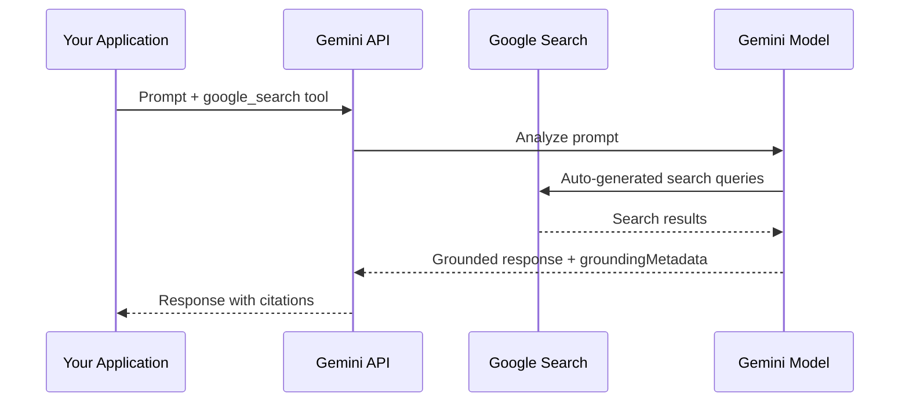

# Gemini Built-in Tools

## Introduction

Google's Gemini API provides a rich set of built-in tools that are fully managed on Google's infrastructure. When you enable a Gemini built-in tool, the entire execution happens within a single API call — the model decides it needs the tool, Google's servers execute it, and you receive the final grounded response. No client-side execution code is needed (except for computer use).

This sub-lesson covers Gemini's built-in tools: Google Search grounding, Google Maps grounding, code execution, URL context fetching, computer use, and file search.

### What we'll cover

- Google Search grounding: real-time web information with citation metadata
- Google Maps grounding: location-aware responses
- Code execution: Python execution in a managed sandbox
- URL context: analyzing content from specific web pages
- Computer use: browser automation (preview)
- File search: RAG over uploaded documents

### Prerequisites

- Google Gemini API access and Gen AI SDK setup
- Understanding of function calling basics ([Lesson 01](../01-function-calling-concepts/00-function-calling-concepts.md))
- Familiarity with the `GenerateContentConfig` format

---

## Google Search grounding

Google Search grounding connects Gemini models to real-time web content, enabling factual answers with verifiable citations. When enabled, the model automatically generates search queries, processes results, and provides a grounded response.

### Enabling Google Search

```python
from google import genai
from google.genai import types

client = genai.Client()

response = client.models.generate_content(
    model="gemini-2.5-flash",
    contents="Who won the Euro 2024?",
    config=types.GenerateContentConfig(
        tools=[types.Tool(google_search=types.GoogleSearch())]
    )
)

print(response.text)
```

**Output:**
```
Spain won Euro 2024, defeating England 2-1 in the final. This victory
marks Spain's record fourth European Championship title.
```

### How grounding works



### Understanding the grounding response

When a response is grounded, it includes a `groundingMetadata` object with structured citation data:

```python
metadata = response.candidates[0].grounding_metadata

# Search queries the model generated
print(metadata.web_search_queries)
# ["UEFA Euro 2024 winner", "who won euro 2024"]

# Source chunks with URLs and titles
for chunk in metadata.grounding_chunks:
    print(f"Source: {chunk.web.title} — {chunk.web.uri}")

# Grounding supports: links text segments to source chunks
for support in metadata.grounding_supports:
    print(f"Text: '{support.segment.text}'")
    print(f"  Backed by chunks: {support.grounding_chunk_indices}")
```

The response also contains a `searchEntryPoint` with HTML/CSS for rendering required Search Suggestions per Google's terms of service.

### Building inline citations

Use `groundingSupports` and `groundingChunks` to create clickable citations:

```python
def add_citations(response):
    text = response.text
    supports = response.candidates[0].grounding_metadata.grounding_supports
    chunks = response.candidates[0].grounding_metadata.grounding_chunks

    # Sort by end_index descending to avoid shifting when inserting
    sorted_supports = sorted(
        supports, key=lambda s: s.segment.end_index, reverse=True
    )

    for support in sorted_supports:
        end_index = support.segment.end_index
        if support.grounding_chunk_indices:
            citation_links = []
            for i in support.grounding_chunk_indices:
                if i < len(chunks):
                    uri = chunks[i].web.uri
                    citation_links.append(f"[{i + 1}]({uri})")
            citation_string = ", ".join(citation_links)
            text = text[:end_index] + citation_string + text[end_index:]

    return text

print(add_citations(response))
```

**Output:**
```
Spain won Euro 2024, defeating England 2-1 in the final.[1](https://...), [2](https://...)
```

### Pricing

With Gemini 3 models, billing is per search query executed (not per prompt). If the model executes two search queries within one API call, that counts as two billable uses. For Gemini 2.5 and older models, billing is per prompt.

---

## Google Maps grounding

Google Maps grounding enables location-aware responses with rich local context. The model can find places, get directions, and provide detailed information about locations.

### Enabling Google Maps

```python
from google import genai
from google.genai import types

client = genai.Client()

response = client.models.generate_content(
    model="gemini-2.5-flash",
    contents="Find the best-rated Italian restaurants in downtown San Francisco",
    config=types.GenerateContentConfig(
        tools=[types.Tool(google_maps=types.GoogleMaps())]
    )
)

print(response.text)
```

### Use cases

| Use case | Example prompt |
|----------|---------------|
| **Travel planning** | "Plan a 3-day itinerary in Tokyo with walking distances between stops" |
| **Local search** | "Find coffee shops open right now near Union Square" |
| **Directions** | "What's the fastest route from JFK Airport to Times Square?" |
| **Business info** | "Show me bakeries in my area with 4+ star ratings" |

---

## Code execution

Gemini's code execution tool lets the model generate and run Python code in a managed sandbox. Like OpenAI's code interpreter, the model can iteratively write, execute, observe results, and refine code.

### Enabling code execution

```python
from google import genai
from google.genai import types

client = genai.Client()

response = client.models.generate_content(
    model="gemini-2.5-flash",
    contents="What is the sum of the first 50 prime numbers? "
             "Generate and run code for the calculation.",
    config=types.GenerateContentConfig(
        tools=[types.Tool(code_execution=types.ToolCodeExecution)]
    )
)

# Iterate over response parts
for part in response.candidates[0].content.parts:
    if part.text is not None:
        print(part.text)
    if part.executable_code is not None:
        print(f"Code:\n{part.executable_code.code}")
    if part.code_execution_result is not None:
        print(f"Result: {part.code_execution_result.output}")
```

**Output:**
```
I'll calculate the sum of the first 50 prime numbers.

Code:
def is_prime(n):
    if n <= 1: return False
    if n <= 3: return True
    if n % 2 == 0 or n % 3 == 0: return False
    i = 5
    while i * i <= n:
        if n % i == 0 or n % (i + 2) == 0: return False
        i += 6
    return True

primes = []
num = 2
while len(primes) < 50:
    if is_prime(num): primes.append(num)
    num += 1

print(f"Sum: {sum(primes)}")

Result: Sum: 5117

The sum of the first 50 prime numbers is 5117.
```

### Response structure

Code execution responses contain three types of parts:

| Part type | Contains | Description |
|-----------|----------|-------------|
| `text` | Natural language | Model's explanation and reasoning |
| `executable_code` | Python code | Code the model generated and ran |
| `code_execution_result` | Execution output | `stdout` from the code execution |

### Code execution with images (Gemini 3)

Gemini 3 Flash supports code execution that manipulates images:

```python
response = client.models.generate_content(
    model="gemini-3-flash-preview",
    contents=[image, "Zoom into the expression pedals and count them"],
    config=types.GenerateContentConfig(
        tools=[types.Tool(code_execution=types.ToolCodeExecution)]
    )
)
```

The model can:
- **Zoom and inspect** — crop and re-examine areas at higher resolution
- **Visual math** — run calculations on visual data (e.g., sum receipt line items)
- **Image annotation** — draw arrows, boxes, or labels on images

### Available libraries

The sandbox includes a curated set of libraries:

| Category | Libraries |
|----------|----------|
| **Data science** | numpy, pandas, scipy, scikit-learn |
| **Visualization** | matplotlib, seaborn |
| **Image processing** | Pillow, opencv-python, imageio |
| **Document handling** | PyPDF2, python-docx, python-pptx, openpyxl, reportlab |
| **Math/Science** | sympy, mpmath |
| **ML** | tensorflow |
| **Other** | lxml, jinja2, jsonschema, tabulate, chess |

> **Important:** You cannot install custom libraries. Only the pre-installed set is available. Use `matplotlib` for graph rendering — it's the only supported plotting library in the execution environment.

### Limitations

- Maximum runtime: 30 seconds per execution
- If the code errors, the model may retry up to 5 times
- Code execution works best with text and CSV files
- Can be combined with Google Search grounding but not with function calling

---

## URL context

The URL context tool lets you point the model at specific web pages or documents, and it retrieves and analyzes their content. Unlike Google Search (which finds pages), URL context reads pages you specify.

### Enabling URL context

```python
from google import genai
from google.genai import types

client = genai.Client()

response = client.models.generate_content(
    model="gemini-2.5-flash",
    contents="Compare the ingredients and cooking times from the recipes at "
             "https://example.com/recipe1 and https://example.com/recipe2",
    config=types.GenerateContentConfig(
        tools=[types.Tool(url_context=types.UrlContext())]
    )
)

print(response.text)

# Check which URLs were retrieved
print(response.candidates[0].url_context_metadata)
```

### How it works

The tool uses a two-step retrieval process:

1. **Index cache check** — first attempts to fetch from an internal cache (fast, optimized)
2. **Live fetch fallback** — if not cached, fetches the URL directly in real-time

### Retrieval status

The response includes status for each URL:

```python
for url_meta in response.candidates[0].url_context_metadata.url_metadata:
    print(f"{url_meta.retrieved_url}: {url_meta.url_retrieval_status}")
```

| Status | Meaning |
|--------|---------|
| `URL_RETRIEVAL_STATUS_SUCCESS` | Content retrieved successfully |
| `URL_RETRIEVAL_STATUS_UNSAFE` | URL failed content moderation |
| `URL_RETRIEVAL_STATUS_ERROR` | Retrieval failed (timeout, access denied, etc.) |

### Combining with Google Search

URL context and Google Search work powerfully together — the model searches the web for relevant pages, then deep-dives into specific URLs:

```python
response = client.models.generate_content(
    model="gemini-2.5-flash",
    contents="Research the latest AI safety developments and "
             "analyze the key findings from https://example.com/ai-safety-report",
    config=types.GenerateContentConfig(
        tools=[
            types.Tool(url_context=types.UrlContext()),
            types.Tool(google_search=types.GoogleSearch())
        ]
    )
)
```

### Limitations

| Constraint | Details |
|-----------|---------|
| **Max URLs per request** | 20 |
| **Max content size per URL** | 34MB |
| **Accessibility** | URLs must be publicly accessible (no localhost, no private networks) |
| **Unsupported content** | Paywalled content, YouTube videos, Google Workspace files, video/audio |
| **Supported content types** | HTML, JSON, plain text, XML, CSS, JavaScript, CSV, RTF, images (PNG/JPEG/BMP/WebP), PDF |
| **Function calling** | URL context cannot be combined with function calling currently |

---

## Computer use (preview)

Gemini's computer use tool enables browser automation through screenshot analysis and UI action generation. Like OpenAI's computer use, it operates in a loop: send a screenshot → model suggests actions → your code executes them → capture new screenshot → repeat.

### How it differs from built-in tools

Unlike Google Search or code execution (which are fully server-side), computer use requires **client-side execution** — your code must capture screenshots, execute click/type actions, and manage the loop.

### Basic setup

```python
from google import genai
from google.genai import types

client = genai.Client()

config = types.GenerateContentConfig(
    tools=[
        types.Tool(
            computer_use=types.ComputerUse(
                environment=types.Environment.ENVIRONMENT_BROWSER,
                excluded_predefined_functions=["drag_and_drop"]  # Optional
            )
        )
    ]
)

response = client.models.generate_content(
    model="gemini-2.5-computer-use-preview-10-2025",
    contents=[
        types.Content(role="user", parts=[
            types.Part(text="Search for smart fridges on Google Shopping"),
        ])
    ],
    config=config
)
```

### Supported UI actions

| Action | Description | Key parameters |
|--------|-------------|----------------|
| `open_web_browser` | Opens the browser | None |
| `click_at` | Click at coordinates | `x`, `y` (0–999 normalized grid) |
| `type_text_at` | Type text at coordinates | `x`, `y`, `text`, `press_enter` |
| `scroll_document` | Scroll the page | `direction` (up/down/left/right) |
| `scroll_at` | Scroll at specific location | `x`, `y`, `direction`, `magnitude` |
| `key_combination` | Press keyboard keys | `keys` (e.g., "Control+C") |
| `hover_at` | Hover at coordinates | `x`, `y` |
| `navigate` | Go to a URL | `url` |
| `drag_and_drop` | Drag from one point to another | `x`, `y`, `destination_x`, `destination_y` |
| `wait_5_seconds` | Pause for loading | None |
| `go_back` / `go_forward` | Browser navigation | None |

> **Note:** Coordinates use a normalized 0–999 grid regardless of actual screen resolution. Your code must convert these to pixel values: `actual_x = int(normalized_x / 1000 * screen_width)`.

### Safety decisions

Gemini's computer use includes a safety system that classifies proposed actions:

| Decision | Meaning | Your action |
|----------|---------|-------------|
| **Regular / allowed** | Safe to proceed | Execute the action |
| **Requires confirmation** | Potentially risky | Must ask user for confirmation before executing |

```python
# When safety_decision requires confirmation
if "safety_decision" in function_call.args:
    decision = function_call.args["safety_decision"]
    if decision["decision"] == "require_confirmation":
        # Must prompt user — cannot bypass per terms of service
        user_confirmed = prompt_user(decision["explanation"])
        if user_confirmed:
            # Include safety_acknowledgement in FunctionResponse
            execute_action(function_call)
```

### Supported models

- `gemini-2.5-computer-use-preview-10-2025`
- `gemini-3-pro-preview`
- `gemini-3-flash-preview`

---

## File search

Gemini also offers a file search tool for indexing and searching your own documents, enabling RAG over proprietary data.

```python
from google import genai
from google.genai import types

client = genai.Client()

# Create a file search config pointing to your uploaded files
response = client.models.generate_content(
    model="gemini-2.5-flash",
    contents="What are the key findings in the Q3 report?",
    config=types.GenerateContentConfig(
        tools=[types.Tool(file_search=types.FileSearch())]
    )
)
```

> **🤖 AI Context:** Gemini's file search, like OpenAI's, provides managed RAG. It handles document chunking, embedding, indexing, and retrieval. For production systems requiring custom embeddings, hybrid search, or specialized vector databases, see [Unit 09: RAG](../../09-rag-retrieval-augmented-generation/).

---

## Gemini tools comparison

| Tool | Execution | Configuration | Key limitation |
|------|-----------|--------------|----------------|
| **Google Search** | Fully server-side | `google_search=GoogleSearch()` | Billing per query (Gemini 3) |
| **Google Maps** | Fully server-side | `google_maps=GoogleMaps()` | Limited to location-based queries |
| **Code execution** | Server-side sandbox | `code_execution=ToolCodeExecution` | 30s runtime, no custom libraries |
| **URL context** | Server-side | `url_context=UrlContext()` | Max 20 URLs, can't combine with function calling |
| **Computer use** | Client-side (you execute) | `computer_use=ComputerUse(...)` | Preview, requires sandboxed environment |
| **File search** | Server-side | `file_search=FileSearch()` | Depends on uploaded files |

---

## Best practices

| Practice | Why it matters |
|----------|---------------|
| ✅ Render Search Suggestions when using Google Search grounding | Required by Google's terms of service |
| ✅ Process all three part types in code execution responses | Text, executable_code, and code_execution_result each serve different purposes |
| ✅ Verify URL retrieval status before relying on URL context results | Silently failed retrievals can lead to incomplete answers |
| ✅ Use normalized-to-pixel coordinate conversion for computer use | Model outputs 0–999 grid coordinates, not actual pixels |
| ✅ Check `url_retrieval_status` for each URL in the response | Detect safety blocks or retrieval failures early |

---

## Common pitfalls

| ❌ Mistake | ✅ Solution |
|-----------|-------------|
| Ignoring `groundingMetadata` in Google Search responses | Always process and display citations to build user trust |
| Assuming code execution has pip/install capabilities | Only pre-installed libraries are available — check the supported list |
| Combining URL context with function calling | Not supported currently — use them in separate requests |
| Not converting normalized coordinates in computer use | Always convert: `actual = int(normalized / 1000 * screen_dimension)` |
| Using Google Search grounding without checking billing model | Gemini 3 bills per query, not per prompt — multiple queries multiply costs |

---

## Hands-on exercise

### Your task

Build a fact-checking helper that uses Google Search grounding to verify a claim and presents the results with inline citations.

### Requirements

1. Accept a claim to verify (e.g., "The Eiffel Tower is 330 meters tall")
2. Use Google Search grounding to check the claim
3. Extract `groundingChunks` and `groundingSupports` from the response
4. Format the response showing:
   - The model's verdict on the claim
   - Which parts of the response are backed by which sources
5. List all sources at the bottom

### Expected result

A formatted fact-check with clear source attribution.

<details>
<summary>💡 Hints (click to expand)</summary>

- Access grounding metadata via `response.candidates[0].grounding_metadata`
- `grounding_supports` links text segments to source indices
- `grounding_chunks` contains the source URLs and titles
- Sort supports by `end_index` descending before inserting citations into text

</details>

<details>
<summary>✅ Solution (click to expand)</summary>

```python
from google import genai
from google.genai import types

client = genai.Client()

def fact_check(claim: str) -> str:
    """Verify a claim using Google Search grounding."""
    response = client.models.generate_content(
        model="gemini-2.5-flash",
        contents=f"Fact-check this claim: {claim}. "
                 f"Provide a clear verdict and cite your sources.",
        config=types.GenerateContentConfig(
            tools=[types.Tool(google_search=types.GoogleSearch())]
        )
    )

    verdict = response.text
    metadata = response.candidates[0].grounding_metadata

    # Build source list
    sources = []
    if metadata and metadata.grounding_chunks:
        for i, chunk in enumerate(metadata.grounding_chunks):
            sources.append(f"[{i + 1}] {chunk.web.title}: {chunk.web.uri}")

    # Build support mapping
    supports_info = []
    if metadata and metadata.grounding_supports:
        for support in metadata.grounding_supports:
            text_segment = support.segment.text
            source_nums = [str(i + 1) for i in support.grounding_chunk_indices]
            supports_info.append(
                f'  "{text_segment}" — Sources: {", ".join(source_nums)}'
            )

    # Format output
    output = f"Claim: {claim}\n\n"
    output += f"Verdict:\n{verdict}\n\n"
    if supports_info:
        output += "Evidence mapping:\n" + "\n".join(supports_info) + "\n\n"
    if sources:
        output += "Sources:\n" + "\n".join(sources)

    return output


result = fact_check("The Eiffel Tower is 330 meters tall")
print(result)
```

</details>

### Bonus challenges

- [ ] Add code execution to calculate statistical confidence based on source agreement
- [ ] Use URL context to deep-dive into the most-cited source for additional details
- [ ] Compare the grounding results against a local knowledge base using file search

---

## Summary

✅ **Google Search grounding** provides real-time web information with structured `groundingMetadata` including search queries, source chunks, and text-to-source mappings

✅ **Google Maps grounding** enables location-aware responses for travel planning, local search, and directions

✅ **Code execution** runs Python in a managed sandbox with 40+ pre-installed libraries, 30-second runtime limit, and support for image manipulation in Gemini 3

✅ **URL context** fetches and analyzes content from up to 20 specified URLs, and can combine with Google Search for broad-then-deep research workflows

✅ **Computer use** (preview) automates browser interactions through a screenshot → action loop using normalized 0–999 grid coordinates

✅ Gemini's built-in tools are **fully server-side** (except computer use), executing within a single API call with no client-side handling needed

---

**Previous:** [OpenAI Built-in Tools ←](./01-openai-built-in-tools.md)

**Next:** [Combining Built-in with Custom Tools →](./03-combining-built-in-with-custom-tools.md)

---

## Further reading

- [Gemini Tools & Agents Overview](https://ai.google.dev/gemini-api/docs/tools) — Complete tools documentation
- [Google Search Grounding](https://ai.google.dev/gemini-api/docs/google-search) — Citations and pricing details
- [Google Maps Grounding](https://ai.google.dev/gemini-api/docs/maps-grounding) — Location-aware responses
- [Code Execution](https://ai.google.dev/gemini-api/docs/code-execution) — Sandbox details and supported libraries
- [URL Context](https://ai.google.dev/gemini-api/docs/url-context) — Fetching and analyzing web pages
- [Computer Use](https://ai.google.dev/gemini-api/docs/computer-use) — Browser automation with Gemini

---

*[Back to Built-in Platform Tools Overview](./00-built-in-platform-tools.md)*

<!-- 
Sources Consulted:
- Gemini Tools & Agents Overview: https://ai.google.dev/gemini-api/docs/tools
- Google Search Grounding: https://ai.google.dev/gemini-api/docs/google-search
- Google Maps Grounding: https://ai.google.dev/gemini-api/docs/maps-grounding
- Code Execution: https://ai.google.dev/gemini-api/docs/code-execution
- URL Context: https://ai.google.dev/gemini-api/docs/url-context
- Computer Use: https://ai.google.dev/gemini-api/docs/computer-use
-->
