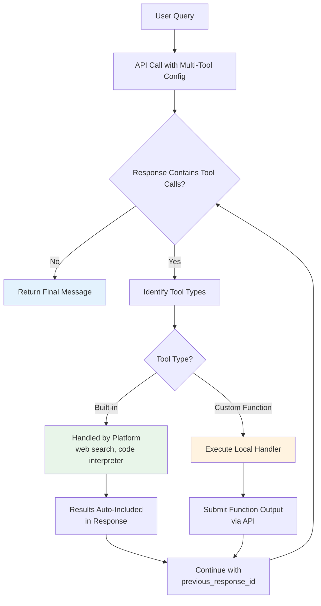

# Combining built-in with custom tools

## Introduction

Real-world AI applications rarely rely on a single tool. A customer support agent might search the web for product information, execute code to calculate shipping costs, and call your internal API to check order status — all within a single conversation turn. Both OpenAI and Gemini let you mix built-in and custom tools in the same request, creating powerful multi-tool workflows.

In this lesson, we explore how to configure multi-tool setups, coordinate tool selection, and build effective combinations across both platforms.

### What we'll cover

- Multi-tool configuration syntax for OpenAI and Gemini
- Live API multi-tool support for real-time interactions
- Tool selection coordination with `tool_choice`
- Practical use case combinations with working code

### Prerequisites

- Familiarity with OpenAI built-in tools ([Lesson 15.01](./01-openai-built-in-tools.md))
- Familiarity with Gemini built-in tools ([Lesson 15.02](./02-gemini-built-in-tools.md))
- Understanding of custom function definitions ([Lesson 02: Defining Functions for AI](../02-openai-function-calling/00-openai-function-calling.md))
- Experience with tool execution loops ([Lesson 09: Parallel & Sequential Tool Calls](../09-parallel-sequential-tool-calls/00-parallel-sequential-tool-calls.md))

---

## Multi-tool configurations

Both OpenAI and Gemini accept arrays of tools, allowing you to combine built-in capabilities with your own custom functions in a single API call.

### OpenAI multi-tool setup

OpenAI's `tools` parameter accepts an array where each element can be a different tool type — `function`, `web_search`, `file_search`, `code_interpreter`, or `computer_use_preview`. The model decides which tool(s) to invoke based on the user's query:

```python
from openai import OpenAI

client = OpenAI()

# Define a custom function alongside built-in tools
tools = [
    # Built-in: web search with domain filtering
    {
        "type": "web_search",
        "search_context_size": "medium",
        "user_location": {
            "type": "approximate",
            "country": "US"
        }
    },
    # Built-in: code interpreter for calculations
    {
        "type": "code_interpreter",
        "container": {"type": "auto"}
    },
    # Custom: your internal API
    {
        "type": "function",
        "function": {
            "name": "get_product_inventory",
            "description": "Check current inventory levels for a product by SKU",
            "parameters": {
                "type": "object",
                "properties": {
                    "sku": {
                        "type": "string",
                        "description": "The product SKU code"
                    }
                },
                "required": ["sku"]
            }
        }
    }
]

response = client.responses.create(
    model="gpt-4.1",
    tools=tools,
    input="Check if product SKU-7842 is in stock, then search "
          "the web for its current market price and calculate "
          "a 15% discount."
)

# The model may invoke multiple tools in sequence
for item in response.output:
    print(f"Type: {item.type}")
```

**Output:**
```
Type: function_call        # get_product_inventory("SKU-7842")
Type: web_search_call      # Searches for market price
Type: code_interpreter     # Calculates 15% discount
Type: message              # Final answer combining all results
```

> **Note:** The model determines the execution order based on data dependencies. It calls `get_product_inventory` first because subsequent steps may depend on knowing whether the product exists.

### Gemini multi-tool setup

Gemini uses the `tools` parameter in `GenerateContentConfig`, where each `Tool` object can contain one or more capabilities:

```python
from google import genai
from google.genai import types

client = genai.Client()

# Define a custom function
get_order_status = types.FunctionDeclaration(
    name="get_order_status",
    description="Look up the current status of a customer order",
    parameters=types.Schema(
        type=types.Type.OBJECT,
        properties={
            "order_id": types.Schema(
                type=types.Type.STRING,
                description="The order ID to look up"
            )
        },
        required=["order_id"]
    )
)

# Combine Google Search grounding with custom functions
response = client.models.generate_content(
    model="gemini-2.5-flash",
    contents="What's the status of order ORD-9931? Also, "
             "what's the current delivery estimate for "
             "packages shipped from New York to London?",
    config=types.GenerateContentConfig(
        tools=[
            # Built-in: Google Search for real-time info
            types.Tool(google_search=types.GoogleSearch()),
            # Custom: your order lookup function
            types.Tool(function_declarations=[get_order_status])
        ]
    )
)
```

> **Warning:** Gemini has specific combination restrictions. URL Context **cannot** be combined with function calling (`function_declarations`). Code Execution **cannot** be combined with function calling either. Always check the compatibility matrix before building multi-tool configs.

### Gemini tool combination compatibility

Not all Gemini tools work together. This matrix shows which combinations are supported:

| Tool A | Tool B | Compatible? | Notes |
|--------|--------|:-----------:|-------|
| Google Search | Function Calling | ✅ | Most common combination |
| Google Search | Code Execution | ✅ | Search data + compute |
| Google Search | URL Context | ✅ | Search + deep page reading |
| Code Execution | Google Search | ✅ | Compute + live data |
| URL Context | Google Search | ✅ | Page content + broader search |
| URL Context | Function Calling | ❌ | Not supported |
| Code Execution | Function Calling | ❌ | Not supported |
| Google Maps | Function Calling | ✅ | Location + custom logic |
| Computer Use | Function Calling | ✅ | As custom user-defined functions |

> **🤖 AI Context:** These restrictions exist because certain built-in tools take over the response generation flow. Code Execution and URL Context both require the model to process intermediate results before generating output, which conflicts with function calling's external execution pattern.

---

## Live API multi-tool support

Both platforms support multi-tool configurations in their real-time streaming APIs, enabling voice assistants and interactive agents to access multiple capabilities simultaneously.

### OpenAI Realtime API

The OpenAI Realtime API supports combining function tools with built-in tools in WebSocket sessions:

```python
import asyncio
import websockets
import json

async def create_realtime_session():
    url = "wss://api.openai.com/v1/realtime?model=gpt-4o-realtime-preview"
    
    headers = {
        "Authorization": f"Bearer {api_key}",
        "OpenAI-Beta": "realtime=v1"
    }
    
    async with websockets.connect(url, extra_headers=headers) as ws:
        # Configure session with multiple tools
        session_config = {
            "type": "session.update",
            "session": {
                "tools": [
                    # Custom function for the voice assistant
                    {
                        "type": "function",
                        "name": "set_thermostat",
                        "description": "Set home thermostat temperature",
                        "parameters": {
                            "type": "object",
                            "properties": {
                                "temperature": {"type": "number"},
                                "unit": {
                                    "type": "string",
                                    "enum": ["fahrenheit", "celsius"]
                                }
                            },
                            "required": ["temperature"]
                        }
                    },
                    {
                        "type": "function",
                        "name": "get_weather",
                        "description": "Get current weather for a location",
                        "parameters": {
                            "type": "object",
                            "properties": {
                                "location": {"type": "string"}
                            },
                            "required": ["location"]
                        }
                    }
                ],
                "tool_choice": "auto"
            }
        }
        
        await ws.send(json.dumps(session_config))
        print("Session configured with multiple tools")
```

### Gemini Live API

Gemini's Live API supports built-in tools alongside function declarations for real-time multimodal interactions:

```python
from google import genai
from google.genai import types

client = genai.Client()

# Multi-tool Live API configuration
config = types.LiveConnectConfig(
    tools=[
        types.Tool(google_search=types.GoogleSearch()),
        types.Tool(function_declarations=[
            types.FunctionDeclaration(
                name="control_lights",
                description="Control smart home lights",
                parameters=types.Schema(
                    type=types.Type.OBJECT,
                    properties={
                        "room": types.Schema(type=types.Type.STRING),
                        "brightness": types.Schema(type=types.Type.INTEGER)
                    }
                )
            )
        ])
    ],
    response_modalities=["AUDIO"]
)

async with client.aio.live.connect(
    model="gemini-2.0-flash-live-001",
    config=config
) as session:
    # The model can search the web AND call your functions
    await session.send_client_content(
        turns=types.Content(
            role="user",
            parts=[types.Part(text="What's the sunset time today? "
                              "And dim the living room lights to 30%.")]
        )
    )
```

> **Tip:** In Live API sessions, tool calls happen with minimal latency. The model can interleave tool calls with speech generation, creating a natural conversational flow where the assistant talks while waiting for tool results.

---

## Tool selection coordination

When multiple tools are available, you need ways to guide which tools the model uses. Both platforms provide `tool_choice` parameters for this purpose.

### OpenAI tool_choice

OpenAI's `tool_choice` parameter controls tool selection behavior:

```python
from openai import OpenAI

client = OpenAI()

tools = [
    {"type": "web_search"},
    {"type": "code_interpreter", "container": {"type": "auto"}},
    {
        "type": "function",
        "function": {
            "name": "lookup_customer",
            "description": "Look up customer by email",
            "parameters": {
                "type": "object",
                "properties": {
                    "email": {"type": "string"}
                },
                "required": ["email"]
            }
        }
    }
]

# Option 1: Let the model decide (default)
response = client.responses.create(
    model="gpt-4.1",
    tools=tools,
    tool_choice="auto",  # Model picks the best tool(s)
    input="Find information about customer john@example.com"
)

# Option 2: Require a specific tool
response = client.responses.create(
    model="gpt-4.1",
    tools=tools,
    tool_choice="required",  # Must use at least one tool
    input="Tell me about the weather"
)

# Option 3: Force a specific function
response = client.responses.create(
    model="gpt-4.1",
    tools=tools,
    tool_choice={
        "type": "function",
        "function": {"name": "lookup_customer"}
    },
    input="Find information about john@example.com"
)

# Option 4: Disable all tools
response = client.responses.create(
    model="gpt-4.1",
    tools=tools,
    tool_choice="none",  # Respond without using tools
    input="What can you help me with?"
)
```

| `tool_choice` Value | Behavior |
|---------------------|----------|
| `"auto"` | Model decides whether to use tools (default) |
| `"required"` | Model must call at least one tool |
| `{"type": "function", "function": {"name": "..."}}` | Force a specific function |
| `"none"` | No tools used, text-only response |

### Gemini tool_config

Gemini uses `tool_config` with a `function_calling_config` to control tool selection:

```python
from google import genai
from google.genai import types

client = genai.Client()

tools = [
    types.Tool(google_search=types.GoogleSearch()),
    types.Tool(function_declarations=[
        types.FunctionDeclaration(
            name="check_inventory",
            description="Check product inventory",
            parameters=types.Schema(
                type=types.Type.OBJECT,
                properties={
                    "product_id": types.Schema(type=types.Type.STRING)
                }
            )
        )
    ])
]

# Option 1: Auto mode (default)
response = client.models.generate_content(
    model="gemini-2.5-flash",
    contents="Is product P-100 in stock?",
    config=types.GenerateContentConfig(
        tools=tools,
        tool_config=types.ToolConfig(
            function_calling_config=types.FunctionCallingConfig(
                mode="AUTO"  # Model decides
            )
        )
    )
)

# Option 2: Force function calling only
response = client.models.generate_content(
    model="gemini-2.5-flash",
    contents="Check product P-100",
    config=types.GenerateContentConfig(
        tools=tools,
        tool_config=types.ToolConfig(
            function_calling_config=types.FunctionCallingConfig(
                mode="ANY"  # Must call a function
            )
        )
    )
)

# Option 3: Force a specific function
response = client.models.generate_content(
    model="gemini-2.5-flash",
    contents="Check product P-100",
    config=types.GenerateContentConfig(
        tools=tools,
        tool_config=types.ToolConfig(
            function_calling_config=types.FunctionCallingConfig(
                mode="ANY",
                allowed_function_names=["check_inventory"]
            )
        )
    )
)

# Option 4: No function calling
response = client.models.generate_content(
    model="gemini-2.5-flash",
    contents="What can you do?",
    config=types.GenerateContentConfig(
        tools=tools,
        tool_config=types.ToolConfig(
            function_calling_config=types.FunctionCallingConfig(
                mode="NONE"
            )
        )
    )
)
```

| Gemini Mode | OpenAI Equivalent | Behavior |
|-------------|-------------------|----------|
| `AUTO` | `"auto"` | Model decides |
| `ANY` | `"required"` | Must call a function |
| `ANY` + `allowed_function_names` | `{"type": "function", ...}` | Specific function(s) |
| `NONE` | `"none"` | No function calls |

> **Note:** Gemini's `tool_config` only controls **function calling** behavior. Built-in tools like Google Search grounding are always available when included in the `tools` list — the model decides when to use them based on the query.

---

## Use case combinations

Certain tool combinations appear frequently in production applications. Here are the most effective patterns with complete working code.

### Pattern 1: research assistant (web search + code interpreter)

Combine live data retrieval with computational analysis:

```python
from openai import OpenAI

client = OpenAI()

tools = [
    {
        "type": "web_search",
        "search_context_size": "high"
    },
    {
        "type": "code_interpreter",
        "container": {"type": "auto"}
    }
]

response = client.responses.create(
    model="gpt-4.1",
    tools=tools,
    input="Find the current stock prices of AAPL, MSFT, and GOOGL. "
          "Then create a bar chart comparing them and calculate "
          "which has the best price-to-earnings ratio."
)

# Process response — may contain multiple tool calls
for item in response.output:
    if item.type == "web_search_call":
        print(f"🔍 Searched: {item.id}")
    elif item.type == "code_interpreter_call":
        print(f"💻 Code executed")
        # Check for generated files (charts)
        for result in item.results:
            if hasattr(result, "files"):
                for f in result.files:
                    print(f"  📊 Generated: {f.name}")
    elif item.type == "message":
        print(f"\n📝 Answer: {item.content[0].text}")
```

### Pattern 2: grounded Q&A with custom data (Gemini)

Combine Google Search for public knowledge with custom functions for private data:

```python
from google import genai
from google.genai import types

client = genai.Client()

# Custom function for internal knowledge base
search_kb = types.FunctionDeclaration(
    name="search_knowledge_base",
    description="Search the company's internal knowledge base "
                "for policies, procedures, and product documentation",
    parameters=types.Schema(
        type=types.Type.OBJECT,
        properties={
            "query": types.Schema(
                type=types.Type.STRING,
                description="Search query for the knowledge base"
            ),
            "category": types.Schema(
                type=types.Type.STRING,
                enum=["policy", "product", "procedure", "faq"]
            )
        },
        required=["query"]
    )
)

response = client.models.generate_content(
    model="gemini-2.5-flash",
    contents="What's our company's return policy, and how does it "
             "compare to industry standards?",
    config=types.GenerateContentConfig(
        tools=[
            types.Tool(google_search=types.GoogleSearch()),
            types.Tool(function_declarations=[search_kb])
        ]
    )
)

# The model calls search_knowledge_base for internal policy
# and Google Search for industry comparison
for part in response.candidates[0].content.parts:
    if hasattr(part, "function_call"):
        print(f"🔧 Called: {part.function_call.name}")
        print(f"   Args: {part.function_call.args}")
    elif hasattr(part, "text"):
        print(f"\n📝 {part.text}")
```

### Pattern 3: data pipeline (file search + code interpreter)

Use OpenAI's file search to find relevant documents, then process the data with code interpreter:

```python
from openai import OpenAI

client = OpenAI()

# Assume vector store already created with uploaded files
vector_store_id = "vs_abc123"

tools = [
    {
        "type": "file_search",
        "vector_store_ids": [vector_store_id],
        "max_num_results": 10
    },
    {
        "type": "code_interpreter",
        "container": {"type": "auto"}
    }
]

response = client.responses.create(
    model="gpt-4.1",
    tools=tools,
    input="Find all quarterly revenue figures from our financial "
          "reports, then create a trend analysis with a line chart "
          "showing year-over-year growth."
)

# The model:
# 1. Searches files for revenue data (file_search)
# 2. Extracts and processes the numbers (code_interpreter)
# 3. Generates a chart (code_interpreter)
# 4. Provides analysis (message)
```

### Pattern 4: multi-tool execution loop

When building agents, you need a loop that handles any combination of tool calls:

```python
from openai import OpenAI
import json

client = OpenAI()

# Registry of custom function handlers
function_handlers = {
    "get_user_profile": lambda args: {
        "name": "Alice", "plan": "premium", "balance": 142.50
    },
    "update_user_balance": lambda args: {
        "success": True, "new_balance": args.get("amount", 0)
    },
    "send_notification": lambda args: {
        "sent": True, "channel": args.get("channel", "email")
    }
}

tools = [
    {"type": "web_search"},
    {"type": "code_interpreter", "container": {"type": "auto"}},
    # Add all custom functions
    *[
        {
            "type": "function",
            "function": {
                "name": name,
                "description": f"Handle {name} operations",
                "parameters": {
                    "type": "object",
                    "properties": {}
                }
            }
        }
        for name in function_handlers
    ]
]

def run_multi_tool_agent(user_input: str) -> str:
    """Execute a multi-tool agent loop."""
    response = client.responses.create(
        model="gpt-4.1",
        tools=tools,
        input=user_input
    )
    
    # Keep looping while the model wants to call tools
    while True:
        tool_calls = [
            item for item in response.output
            if item.type == "function_call"
        ]
        
        if not tool_calls:
            break  # No more function calls — done
        
        # Execute each function call
        tool_results = []
        for call in tool_calls:
            handler = function_handlers.get(call.name)
            if handler:
                args = json.loads(call.arguments)
                result = handler(args)
                tool_results.append({
                    "type": "function_call_output",
                    "call_id": call.call_id,
                    "output": json.dumps(result)
                })
        
        # Continue the conversation with results
        response = client.responses.create(
            model="gpt-4.1",
            tools=tools,
            input=tool_results,
            previous_response_id=response.id
        )
    
    # Extract final message
    messages = [
        item for item in response.output
        if item.type == "message"
    ]
    return messages[0].content[0].text if messages else "No response"

# Usage
answer = run_multi_tool_agent(
    "Look up Alice's account, search for current premium plan "
    "pricing, and calculate if she should upgrade."
)
print(answer)
```

### Multi-tool execution flow



> **🔑 Key concept:** Built-in tools (web search, code interpreter) are executed server-side by the platform — their results appear directly in the response. Custom function calls require you to execute them locally and submit results back. Your execution loop must handle both patterns.

---

## Best practices

| Practice | Why it matters |
|----------|---------------|
| Start with fewer tools, add as needed | Too many tools increases latency and may confuse the model |
| Use descriptive function names and descriptions | The model uses these to decide which tool to call |
| Set `tool_choice` when you know the intent | Reduces unnecessary tool calls and speeds up responses |
| Handle built-in and custom tools differently in loops | Built-in results are auto-included; custom results need manual submission |
| Check Gemini's compatibility matrix before combining | Some tool pairs silently fail or produce unexpected results |
| Use `previous_response_id` (OpenAI) for multi-turn | Avoids resending the entire conversation history |
| Set appropriate `search_context_size` for web search | `"low"` for simple facts, `"high"` for complex research |
| Log all tool calls for debugging | Multi-tool flows are hard to debug without visibility into each step |

---

## Common pitfalls

| ❌ Mistake | ✅ Solution |
|-----------|------------|
| Combining URL Context with function calling in Gemini | Use Google Search grounding instead — it's compatible with functions |
| Combining Code Execution with function calling in Gemini | Separate into two sequential API calls |
| Not handling `pending_safety_checks` in OpenAI CUA multi-tool | Always check for and acknowledge safety checks before continuing |
| Passing too many tools (10+) in a single request | Group related tools and use separate specialized agents |
| Ignoring tool call order dependencies | Let the model determine order — it understands data dependencies |
| Forgetting to include `previous_response_id` in loops | Without it, the model loses context of prior tool results |
| Hardcoding `tool_choice` to a specific function | Use `"auto"` unless you have a clear reason to constrain |
| Not showing built-in tool results to users | Surface web search citations and code outputs for transparency |

---

## Hands-on exercise

### Your task

Build a **product research agent** that combines web search with a custom product database function. Given a product name, the agent should:

1. Search the web for current reviews and pricing
2. Look up the product in your internal database for inventory and specifications
3. Provide a combined report with citations

### Requirements

1. Define a `get_product_details` custom function that returns product specs and inventory
2. Configure both `web_search` and the custom function as tools
3. Implement the execution loop that handles both tool types
4. Format the final response with web citations and internal data
5. Add domain filtering to restrict web search to trusted review sites

### Expected result

A function that takes a product name and returns a structured report combining web-sourced reviews/pricing with internal product data.

<details>
<summary>💡 Hints (click to expand)</summary>

- Use `web_search` with `filters.allowed_domains` to restrict to sites like `amazon.com`, `wirecutter.com`, `rtings.com`
- Your `get_product_details` function should return a dictionary with keys like `sku`, `price`, `inventory_count`, `specs`
- Check `item.type` in the response to distinguish between `web_search_call`, `function_call`, and `message`
- Use `previous_response_id` to maintain context across the tool execution loop
- Parse `url_citation` annotations from the final message for web source attribution

</details>

<details>
<summary>✅ Solution (click to expand)</summary>

```python
from openai import OpenAI
import json

client = OpenAI()

# Simulated product database
PRODUCT_DB = {
    "noise-canceling-headphones": {
        "sku": "NCH-2024-PRO",
        "name": "ProSound NC Pro 2024",
        "price": 299.99,
        "inventory_count": 142,
        "specs": {
            "driver_size": "40mm",
            "battery_life": "30 hours",
            "weight": "250g",
            "connectivity": "Bluetooth 5.3, USB-C",
            "anc_levels": 3
        }
    }
}

def get_product_details(product_name: str) -> dict:
    """Look up product in internal database."""
    # Normalize and search
    key = product_name.lower().replace(" ", "-")
    for db_key, product in PRODUCT_DB.items():
        if key in db_key or db_key in key:
            return product
    return {"error": f"Product '{product_name}' not found"}


def research_product(product_query: str) -> str:
    """Research a product using web search + internal database."""
    tools = [
        {
            "type": "web_search",
            "search_context_size": "medium",
            "user_location": {
                "type": "approximate",
                "country": "US"
            }
        },
        {
            "type": "function",
            "function": {
                "name": "get_product_details",
                "description": "Look up product details from the "
                               "internal product database including "
                               "SKU, price, inventory, and specifications",
                "parameters": {
                    "type": "object",
                    "properties": {
                        "product_name": {
                            "type": "string",
                            "description": "Name or category of the product"
                        }
                    },
                    "required": ["product_name"]
                }
            }
        }
    ]

    response = client.responses.create(
        model="gpt-4.1",
        tools=tools,
        instructions="You are a product research assistant. "
                     "Always check the internal database first, "
                     "then search the web for reviews and pricing. "
                     "Provide a comprehensive report with citations.",
        input=f"Research this product: {product_query}"
    )

    # Tool execution loop
    while True:
        function_calls = [
            item for item in response.output
            if item.type == "function_call"
        ]

        if not function_calls:
            break

        results = []
        for call in function_calls:
            if call.name == "get_product_details":
                args = json.loads(call.arguments)
                result = get_product_details(args["product_name"])
                results.append({
                    "type": "function_call_output",
                    "call_id": call.call_id,
                    "output": json.dumps(result)
                })

        response = client.responses.create(
            model="gpt-4.1",
            tools=tools,
            input=results,
            previous_response_id=response.id
        )

    # Extract final message with citations
    for item in response.output:
        if item.type == "message":
            text = item.content[0].text
            annotations = getattr(item.content[0], "annotations", [])

            if annotations:
                print("\n📚 Sources:")
                for ann in annotations:
                    if ann.type == "url_citation":
                        print(f"  - {ann.title}: {ann.url}")

            return text

    return "No response generated"


# Run the research
report = research_product("noise canceling headphones")
print(report)
```

</details>

### Bonus challenges

- [ ] Add a `code_interpreter` tool to generate a comparison chart
- [ ] Implement the same agent using Gemini with Google Search + custom function
- [ ] Add error handling for when the product isn't found in the internal database
- [ ] Extend the agent to compare multiple products side by side

---

## Summary

✅ Both OpenAI and Gemini accept **arrays of mixed tool types** — combine built-in and custom tools freely (with Gemini compatibility constraints)

✅ Use **`tool_choice`** (OpenAI) or **`tool_config`** (Gemini) to control which tools the model invokes — `"auto"` for flexibility, `"required"` when tools must run

✅ Built-in tools execute **server-side** (results appear automatically), while custom functions require a **local execution loop** with result submission

✅ Check the **Gemini compatibility matrix** — URL Context and Code Execution cannot combine with function calling

✅ Multi-tool agents need a **loop pattern** that handles both built-in results and custom function outputs, using `previous_response_id` to maintain conversation context

**Next:** [When to Use Built-in vs Custom Tools →](./04-when-to-use-built-in-vs-custom.md)

---

## Further reading

- [OpenAI Tools Guide](https://platform.openai.com/docs/guides/tools) — Complete built-in tools reference
- [Gemini Tools & Agents](https://ai.google.dev/gemini-api/docs/tools) — Gemini tool configuration
- [OpenAI Realtime API](https://platform.openai.com/docs/guides/realtime) — Multi-tool in real-time sessions
- [Gemini Live API](https://ai.google.dev/gemini-api/docs/live) — Real-time multi-tool support

*[Back to Built-in Platform Tools overview](./00-built-in-platform-tools.md)*

<!-- 
Sources Consulted:
- OpenAI Tools Guide: https://platform.openai.com/docs/guides/tools
- OpenAI Web Search: https://platform.openai.com/docs/guides/tools-web-search
- OpenAI Code Interpreter: https://platform.openai.com/docs/guides/tools-code-interpreter
- OpenAI File Search: https://platform.openai.com/docs/guides/tools-file-search
- Gemini Tools Overview: https://ai.google.dev/gemini-api/docs/tools
- Google Search Grounding: https://ai.google.dev/gemini-api/docs/google-search
- Gemini Code Execution: https://ai.google.dev/gemini-api/docs/code-execution
- Gemini URL Context: https://ai.google.dev/gemini-api/docs/url-context
-->
