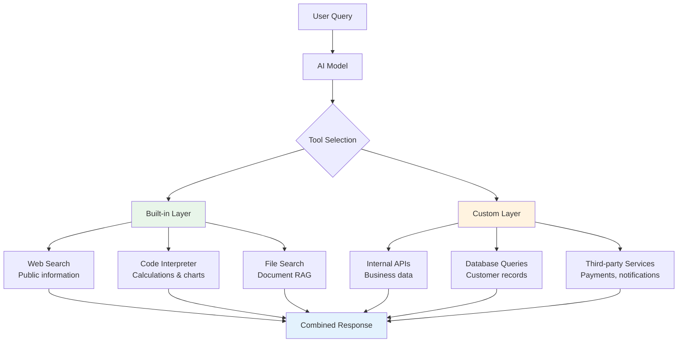
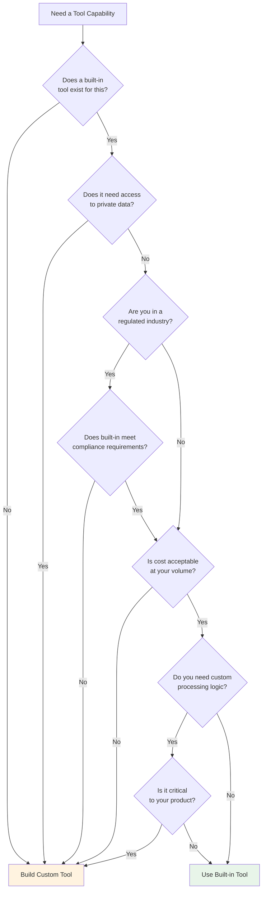

# When to use built-in vs custom tools

## Introduction

Every tool you add to an AI application involves trade-offs — development time, latency, cost, control, and reliability. Built-in platform tools let you add powerful capabilities with a single line of configuration, but they come with usage limits and reduced customization. Custom tools give you full control over every aspect of execution, but require more code, infrastructure, and maintenance.

This lesson provides a decision framework for choosing between built-in and custom tools, explores hybrid approaches, and examines the cost implications that should drive your architecture decisions.

### What we'll cover

- Advantages of built-in tools and when they shine
- Advantages of custom tools and when they're necessary
- Hybrid approaches that combine both effectively
- Cost analysis and pricing considerations

### Prerequisites

- Familiarity with OpenAI built-in tools ([Lesson 15.01](./01-openai-built-in-tools.md))
- Familiarity with Gemini built-in tools ([Lesson 15.02](./02-gemini-built-in-tools.md))
- Understanding of multi-tool configurations ([Lesson 15.03](./03-combining-built-in-with-custom-tools.md))
- Experience building custom function tools ([Lesson 02: Defining Functions for AI](../02-openai-function-calling/00-openai-function-calling.md))

---

## Built-in tool advantages

Built-in tools are managed entirely by the platform. You don't write execution code, manage infrastructure, or handle error recovery — the provider does all of that.

### Zero infrastructure overhead

With built-in tools, there's no server to maintain, no API keys to manage (beyond the AI platform itself), and no scaling concerns:

```python
# Built-in web search — ONE line of configuration
tools = [{"type": "web_search"}]

# Custom web search — requires ALL of this:
# 1. Choose a search API (Google, Bing, Tavily, SerpAPI)
# 2. Get API keys and manage quotas
# 3. Write the search function
# 4. Parse and format results
# 5. Handle rate limits and errors
# 6. Deploy and maintain the search service
# 7. Monitor uptime and performance
```

### Optimized for the model

Built-in tools are designed and tuned specifically for the models they serve. The platform optimizes how results are formatted, how much context to inject, and how to handle edge cases:

```python
# Built-in file search — the platform handles:
# - Chunking documents optimally for the model's context window
# - Generating embeddings with the best model for the task
# - Ranking results by relevance
# - Formatting citations the model understands
tools = [{
    "type": "file_search",
    "vector_store_ids": ["vs_abc123"],
    "max_num_results": 20
}]

# Custom file search — you must decide:
# - Chunk size and overlap strategy
# - Which embedding model to use
# - Similarity threshold for results
# - How to format results for the LLM prompt
# - How to handle when no results match
```

### Automatic updates

When the platform improves a built-in tool — better search quality, faster code execution, new file format support — you get those improvements without changing any code:

| Aspect | Built-in Tools | Custom Tools |
|--------|---------------|--------------|
| Setup time | Minutes | Hours to days |
| Infrastructure | None (platform-managed) | Your responsibility |
| Maintenance | Automatic updates | Manual updates |
| Scaling | Handled by platform | Your architecture |
| Error handling | Built into the platform | You implement it |
| Monitoring | Platform dashboard | Your observability stack |

### When built-in tools shine

Built-in tools are the best choice when:

1. **The task matches a built-in capability exactly** — web search, code execution, file search all have excellent built-in implementations
2. **You're prototyping or building an MVP** — get to market faster with minimal code
3. **You don't need custom data processing** — the default behavior is sufficient
4. **You want managed reliability** — platform handles retries, failover, and scaling
5. **Your team is small** — fewer services to operate and monitor

---

## Custom tool advantages

Custom tools give you complete control over what happens when the model decides to use them. Every aspect — the data sources, processing logic, error handling, and response format — is yours to define.

### Full control over data and logic

Custom tools can access any data source and apply any business logic:

```python
# Custom tool: access to YOUR systems
def process_refund(order_id: str, reason: str) -> dict:
    """Process a customer refund with business rules."""
    # Access internal database
    order = db.orders.find_one({"id": order_id})
    
    if not order:
        return {"error": "Order not found"}
    
    # Apply business rules
    days_since_purchase = (datetime.now() - order["date"]).days
    
    if days_since_purchase > 90:
        return {
            "status": "denied",
            "reason": "Outside 90-day return window"
        }
    
    if order["total"] > 500:
        return {
            "status": "pending_approval",
            "reason": "High-value orders require manager approval",
            "escalated_to": "manager@company.com"
        }
    
    # Process the refund
    refund = payment_gateway.refund(
        charge_id=order["charge_id"],
        amount=order["total"],
        reason=reason
    )
    
    return {
        "status": "completed",
        "refund_id": refund.id,
        "amount": order["total"]
    }
```

No built-in tool can interact with your specific database, apply your business rules, or integrate with your payment gateway.

### Privacy and data residency

Custom tools keep sensitive data within your infrastructure:

```python
# Custom tool: data stays in YOUR environment
def search_patient_records(patient_id: str, query: str) -> dict:
    """Search medical records — data never leaves your servers."""
    # Query your HIPAA-compliant database
    records = hipaa_db.search(
        patient_id=patient_id,
        query=query,
        fields=["diagnosis", "treatment", "medications"]
    )
    
    # Sanitize before sending to the model
    return {
        "results": [
            sanitize_phi(record)  # Remove Protected Health Info
            for record in records
        ],
        "count": len(records)
    }
```

> **🔒 Security:** With built-in file search, your documents are uploaded to the platform's servers. For regulated industries (healthcare, finance, government), custom tools that keep data on-premise may be required for compliance.

### Predictable costs

Custom tools have costs you control directly — your compute, your API calls, your storage:

```python
# Custom web search: you control the cost
def search_web(query: str) -> dict:
    """Web search using Tavily — $0.001 per search."""
    results = tavily_client.search(
        query=query,
        max_results=5,
        search_depth="basic"  # Cheaper tier
    )
    return {
        "results": [
            {"title": r["title"], "url": r["url"], "snippet": r["content"]}
            for r in results["results"]
        ]
    }

# vs. built-in web search: pricing set by platform,
# may change, harder to predict monthly costs
```

### When custom tools are necessary

Custom tools are the right choice when:

1. **You need access to internal systems** — databases, APIs, microservices
2. **Business logic determines the response** — rules, workflows, approvals
3. **Data privacy is critical** — regulated industries, sensitive information
4. **You need fine-grained cost control** — specific API tier, caching strategy
5. **The built-in tool doesn't fit** — unsupported formats, custom processing
6. **You need specific error handling** — retry logic, fallback strategies, circuit breakers

---

## Hybrid approaches

The most effective AI applications combine both tool types. Built-in tools handle general capabilities while custom tools manage domain-specific logic.

### Architecture pattern: layered tools



### Example: customer support agent

A production customer support agent typically uses both types:

```python
from openai import OpenAI
import json

client = OpenAI()

def build_support_agent_tools():
    """Configure a hybrid tool set for customer support."""
    return [
        # --- Built-in tools (zero infrastructure) ---
        
        # Web search: find product docs, shipping info, etc.
        {
            "type": "web_search",
            "search_context_size": "medium",
            "user_location": {
                "type": "approximate",
                "country": "US"
            }
        },
        
        # Code interpreter: calculate shipping, generate reports
        {
            "type": "code_interpreter",
            "container": {"type": "auto"}
        },
        
        # --- Custom tools (your business logic) ---
        
        {
            "type": "function",
            "function": {
                "name": "get_customer",
                "description": "Retrieve customer profile by email or ID",
                "parameters": {
                    "type": "object",
                    "properties": {
                        "identifier": {
                            "type": "string",
                            "description": "Customer email or ID"
                        }
                    },
                    "required": ["identifier"]
                }
            }
        },
        {
            "type": "function",
            "function": {
                "name": "get_order_history",
                "description": "Get recent orders for a customer",
                "parameters": {
                    "type": "object",
                    "properties": {
                        "customer_id": {"type": "string"},
                        "limit": {
                            "type": "integer",
                            "description": "Number of orders to return"
                        }
                    },
                    "required": ["customer_id"]
                }
            }
        },
        {
            "type": "function",
            "function": {
                "name": "create_support_ticket",
                "description": "Create a support ticket for escalation",
                "parameters": {
                    "type": "object",
                    "properties": {
                        "customer_id": {"type": "string"},
                        "category": {
                            "type": "string",
                            "enum": ["billing", "shipping",
                                     "product", "technical"]
                        },
                        "priority": {
                            "type": "string",
                            "enum": ["low", "medium", "high", "urgent"]
                        },
                        "description": {"type": "string"}
                    },
                    "required": ["customer_id", "category",
                                 "description"]
                }
            }
        }
    ]
```

In this setup:
- **Web search** handles questions about return policies, shipping carriers, product information — anything publicly available
- **Code interpreter** calculates shipping costs, generates order summaries, creates comparison tables
- **Custom functions** access customer data, order history, and ticket systems that are private to your business

### Migration strategy: built-in first, custom later

A practical approach for new projects:

| Phase | Strategy | Example |
|-------|----------|---------|
| **Phase 1: Prototype** | All built-in tools | Web search + code interpreter |
| **Phase 2: Customize** | Replace one built-in with custom | Replace web search with Tavily + domain-specific crawling |
| **Phase 3: Extend** | Add custom tools for business logic | Customer lookup, order management |
| **Phase 4: Optimize** | Fine-tune the mix based on metrics | Keep code interpreter built-in, custom search for cost savings |

```python
# Phase 1: Quick prototype — all built-in
tools_v1 = [
    {"type": "web_search"},
    {"type": "code_interpreter", "container": {"type": "auto"}}
]

# Phase 4: Optimized hybrid
tools_v4 = [
    # Keep code interpreter — hard to replicate
    {"type": "code_interpreter", "container": {"type": "auto"}},
    # Custom search — better control, lower cost
    {"type": "function", "function": {
        "name": "search",
        "description": "Search product catalog and knowledge base",
        "parameters": {
            "type": "object",
            "properties": {
                "query": {"type": "string"},
                "sources": {
                    "type": "array",
                    "items": {"type": "string",
                              "enum": ["catalog", "docs", "faq"]}
                }
            },
            "required": ["query"]
        }
    }},
    # Custom business tools
    {"type": "function", "function": {
        "name": "process_order",
        "description": "Create, update, or cancel an order",
        "parameters": {
            "type": "object",
            "properties": {
                "action": {"type": "string",
                           "enum": ["create", "update", "cancel"]},
                "order_id": {"type": "string"}
            },
            "required": ["action"]
        }
    }}
]
```

---

## Cost considerations

Cost is often the deciding factor between built-in and custom tools. Here's how to evaluate the financial impact.

### Built-in tool pricing

Built-in tools have platform-defined pricing that varies by tool type:

| Tool | OpenAI Pricing Model | Gemini Pricing Model |
|------|---------------------|---------------------|
| **Web Search** | Per-search fee + tokens | Per-query fee (Gemini 3) or per-prompt (older) |
| **Code Interpreter** | Per-session fee + compute time | Billed as generated tokens |
| **File Search** | Vector storage + per-search fee | — |
| **Computer Use** | Per-action + tokens | Per-action + tokens |

> **Warning:** Built-in tool pricing can change. Check the platform's current pricing page before making architectural decisions based on cost.

### Custom tool pricing

Custom tools shift costs to your infrastructure:

| Component | Typical Cost | You Control? |
|-----------|-------------|:------------:|
| Compute (Lambda, Cloud Run) | $0.0000002 per invocation | ✅ |
| Database queries | Varies by provider | ✅ |
| Third-party APIs (Tavily, SerpAPI) | $0.001–$0.01 per call | ✅ |
| Vector database (Pinecone, Weaviate) | $0.01–$0.10 per 1K queries | ✅ |
| Storage | Minimal | ✅ |
| Development time | Hours to days per tool | ✅ |

### Cost comparison example

Consider a web search scenario with 10,000 searches per month:

```
Built-in (OpenAI web_search):
  Per-search fee × 10,000 = Platform-defined cost
  + Additional input/output tokens
  Total: Check current pricing at platform.openai.com/pricing

Custom (Tavily API):
  $0.001/search × 10,000 = $10/month
  + Lambda invocations ≈ $0.02/month
  + Development time: ~8 hours initial setup
  + Maintenance: ~2 hours/month
  Total: ~$10/month + engineering time
```

### Decision matrix

Use this framework to evaluate each tool decision:

| Factor | Favors Built-in | Favors Custom |
|--------|:--------------:|:-------------:|
| **Time to market** | ✅ Fast | ⬜ Slower |
| **Development cost** | ✅ None | ⬜ Engineering hours |
| **Running cost at low volume** | ✅ Pay per use | ⬜ Fixed overhead |
| **Running cost at high volume** | ⬜ Can get expensive | ✅ Optimizable |
| **Customization** | ⬜ Limited | ✅ Unlimited |
| **Data privacy** | ⬜ Data on platform | ✅ Data stays local |
| **Reliability** | ✅ Platform SLA | ⬜ Your responsibility |
| **Vendor lock-in** | ⬜ Platform-specific | ✅ Portable |
| **Compliance** | ⬜ May not meet requirements | ✅ Full control |
| **Model optimization** | ✅ Tuned for models | ⬜ Generic formatting |

### Decision flowchart



---

## Best practices

| Practice | Why it matters |
|----------|---------------|
| Start with built-in tools for prototypes | Validate the concept before investing in custom infrastructure |
| Track per-tool costs from day one | Prevents surprise bills as usage scales |
| Abstract tool configuration behind a factory | Makes swapping built-in for custom (or vice versa) painless |
| Use built-in tools for commoditized tasks | Web search and code execution are well-solved — don't reinvent |
| Build custom for competitive differentiators | Your unique data and logic are your moat |
| Monitor built-in tool quality over time | Platform changes can degrade your UX without code changes |
| Document your tool choice rationale | Future team members will ask "why didn't we use built-in?" |
| Plan for hybrid from the start | Design your tool interface to accept both types |

---

## Common pitfalls

| ❌ Mistake | ✅ Solution |
|-----------|------------|
| Building custom search when built-in is sufficient | Use built-in for MVP; only switch to custom when you have specific requirements |
| Ignoring built-in tool costs at scale | Calculate projected costs at 10x and 100x current volume before committing |
| Choosing custom tools for everything to avoid vendor lock-in | The AI model itself is vendor-specific — tools are a smaller concern |
| Not abstracting tool configuration | Create a tool registry that makes swapping implementations easy |
| Assuming built-in tools will always behave the same | Pin model versions and test tool behavior regularly |
| Using built-in file search for sensitive documents | Evaluate data residency requirements before uploading documents to the platform |
| Over-engineering custom tools for low-volume use cases | If you're making fewer than 1,000 calls/month, built-in is almost always cheaper |
| Not measuring latency differences | Built-in tools can be faster (server-side) or slower (shared resources) — measure, don't assume |

---

## Hands-on exercise

### Your task

Create a **tool selection guide** for a fictional e-commerce AI assistant. The assistant needs the following capabilities:

1. Search for product reviews online
2. Look up customer order history
3. Calculate shipping costs and delivery estimates
4. Check current inventory levels
5. Answer questions about return policies

For each capability, decide whether to use a built-in tool, a custom tool, or both, and justify your choice.

### Requirements

1. Create a decision table with all five capabilities
2. For each, specify: tool type (built-in/custom/hybrid), which tool, and justification
3. Write the `tools` configuration array for your chosen setup
4. Calculate an estimated monthly cost at 5,000 interactions per day
5. Identify which tools you'd migrate from built-in to custom as you scale

### Expected result

A complete tool architecture document with configuration code and cost analysis.

<details>
<summary>💡 Hints (click to expand)</summary>

- Product reviews → web search (public data, no internal system needed)
- Customer order history → custom function (requires internal database access)
- Shipping costs → could go either way (code interpreter for calculations vs. custom API call to shipping provider)
- Inventory → custom function (requires internal system access)
- Return policies → could use web search (if policies are published) or file search (if you have policy documents)

</details>

<details>
<summary>✅ Solution (click to expand)</summary>

**Decision Table:**

| Capability | Tool Type | Tool | Justification |
|-----------|-----------|------|---------------|
| Product reviews | Built-in | `web_search` | Public data, no custom logic needed |
| Order history | Custom | `get_order_history` | Requires internal database access |
| Shipping costs | Hybrid | `code_interpreter` + `get_shipping_rates` | Built-in for math, custom for carrier API |
| Inventory | Custom | `check_inventory` | Real-time internal system |
| Return policies | Built-in | `file_search` | Upload policy docs to vector store |

**Configuration:**

```python
tools = [
    # Built-in: product reviews
    {
        "type": "web_search",
        "search_context_size": "medium"
    },
    # Built-in: return policy docs
    {
        "type": "file_search",
        "vector_store_ids": ["vs_policies_123"],
        "max_num_results": 5
    },
    # Built-in: calculations
    {
        "type": "code_interpreter",
        "container": {"type": "auto"}
    },
    # Custom: order history
    {
        "type": "function",
        "function": {
            "name": "get_order_history",
            "description": "Get order history for a customer",
            "parameters": {
                "type": "object",
                "properties": {
                    "customer_id": {"type": "string"},
                    "limit": {"type": "integer"}
                },
                "required": ["customer_id"]
            }
        }
    },
    # Custom: shipping rates
    {
        "type": "function",
        "function": {
            "name": "get_shipping_rates",
            "description": "Get shipping rates from carriers",
            "parameters": {
                "type": "object",
                "properties": {
                    "origin_zip": {"type": "string"},
                    "dest_zip": {"type": "string"},
                    "weight_lbs": {"type": "number"}
                },
                "required": ["origin_zip", "dest_zip",
                             "weight_lbs"]
            }
        }
    },
    # Custom: inventory check
    {
        "type": "function",
        "function": {
            "name": "check_inventory",
            "description": "Check inventory for a product SKU",
            "parameters": {
                "type": "object",
                "properties": {
                    "sku": {"type": "string"}
                },
                "required": ["sku"]
            }
        }
    }
]
```

**Cost Estimate (5,000 interactions/day = ~150,000/month):**

| Tool | Est. Uses/Month | Est. Cost |
|------|----------------|-----------|
| Web search | ~50,000 | Check platform pricing |
| File search | ~30,000 | Vector storage + search fees |
| Code interpreter | ~20,000 | Per-session fees |
| Custom functions | ~80,000 | ~$5–15 (Lambda + DB) |
| **Total custom infra** | — | **~$5–15/month** |

**Scale migration plan:**

At 50,000+ interactions/day, migrate web search to custom (Tavily/SerpAPI) and file search to custom RAG (Pinecone + own embeddings) for cost savings.

</details>

### Bonus challenges

- [ ] Add a fallback strategy: if the built-in web search fails, fall back to a custom search implementation
- [ ] Implement a cost tracking wrapper that logs the cost of each tool call
- [ ] Build a tool registry class that lets you swap built-in and custom implementations via configuration
- [ ] Design an A/B test comparing built-in vs custom web search quality

---

## Summary

✅ **Built-in tools** excel at rapid prototyping, commoditized tasks (search, code execution), and managed reliability — use them when you don't need custom logic

✅ **Custom tools** are necessary for internal data access, business logic, compliance requirements, and cost optimization at scale — build them for your competitive differentiators

✅ **Hybrid approaches** combine both — use built-in for general capabilities and custom for domain-specific logic, starting with built-in and migrating to custom as you scale

✅ **Cost analysis** should consider volume projections — built-in is cheaper at low volume, custom becomes cost-effective at high volume

✅ Use the **decision flowchart**: if it needs private data → custom; if it's regulated → check compliance; if volume is high → evaluate custom; otherwise → built-in

**Previous:** [Combining Built-in with Custom Tools](./03-combining-built-in-with-custom-tools.md) | **Next:** [Lesson 16: Thinking Models & Tool Use →](../16-thinking-models-tool-use/00-thinking-models-tool-use.md)

---

## Further reading

- [OpenAI Pricing](https://openai.com/api/pricing/) — Current built-in tool pricing
- [Google AI Pricing](https://ai.google.dev/pricing) — Gemini tool pricing
- [Tavily Search API](https://tavily.com/) — Popular custom search alternative
- [Pinecone](https://www.pinecone.io/) — Vector database for custom file search

*[Back to Built-in Platform Tools overview](./00-built-in-platform-tools.md)*

<!-- 
Sources Consulted:
- OpenAI Tools Guide: https://platform.openai.com/docs/guides/tools
- OpenAI Pricing: https://platform.openai.com/pricing
- Gemini Tools Overview: https://ai.google.dev/gemini-api/docs/tools
- Google AI Pricing: https://ai.google.dev/pricing
- Gemini Code Execution: https://ai.google.dev/gemini-api/docs/code-execution
- Gemini URL Context: https://ai.google.dev/gemini-api/docs/url-context
-->
