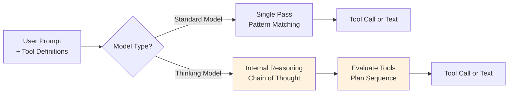

# How thinking models differ

## Introduction

Standard language models process a prompt and immediately generate output — selecting tools, filling arguments, and producing text in a single forward pass. Thinking models add an intermediate step: they reason internally before acting. This reasoning phase lets the model analyze complex requests, evaluate trade-offs between different tools, and plan multi-step execution sequences before committing to any action.

For tool use, this distinction is profound. A standard model might call the wrong function or fill arguments incorrectly for ambiguous requests. A thinking model reasons through the ambiguity first, leading to better tool selection and more accurate parameter extraction.

### What we'll cover

- How internal reasoning changes tool calling behavior
- Why thinking models produce better parameter selection
- The current landscape of thinking models across providers
- When to use thinking models vs standard models for tool use

### Prerequisites

- Understanding of function calling basics ([Lesson 01](../01-function-calling-concepts/00-function-calling-concepts.md))
- Experience calling tools across providers ([Lessons 02-06](../02-defining-functions/00-defining-functions.md))

---

## Internal reasoning before tool calls

When a standard model receives a prompt with tools defined, it processes the input and generates a response in a single pass. It may call the right tool, but it's essentially pattern-matching based on the prompt and tool descriptions.

Thinking models work differently. Before generating any visible output, they produce internal **reasoning tokens** — a chain of thought that analyzes the request, evaluates the available tools, considers edge cases, and plans the response:



Consider this example where a user asks: *"What was the revenue growth rate between Q3 and Q4 last year?"*

**Standard model** might:
1. Call `get_revenue(quarter="Q4")` — only fetching one quarter
2. Realize it needs Q3 too, requiring another turn

**Thinking model** reasons internally:
> "The user wants a growth rate, which requires revenue from both Q3 and Q4. I need to call `get_revenue` twice — once for Q3 and once for Q4 — then the calculation can happen."

Then it calls both functions in parallel on the first turn.

### What reasoning looks like

You can't see the full reasoning tokens (they're not exposed via the API), but providers offer summaries. Here's what OpenAI's reasoning summary looks like for a tool call:

```python
from openai import OpenAI

client = OpenAI()

response = client.responses.create(
    model="gpt-5",
    reasoning={"effort": "medium", "summary": "auto"},
    tools=[{
        "type": "function",
        "name": "search_products",
        "description": "Search product catalog by name, category, or attributes",
        "parameters": {
            "type": "object",
            "properties": {
                "query": {"type": "string"},
                "category": {"type": "string", "enum": ["electronics", "clothing", "home"]},
                "max_price": {"type": "number"}
            },
            "required": ["query"]
        }
    }],
    input="Find me a good pair of wireless headphones under $200"
)

# Check for reasoning items in the output
for item in response.output:
    if item.type == "reasoning":
        for summary in item.summary:
            print(f"Model reasoning: {summary.text}")
    elif item.type == "function_call":
        print(f"Tool call: {item.name}({item.arguments})")
```

**Output:**
```
Model reasoning: The user wants wireless headphones under $200.
I should search in the electronics category with a price filter.
The query should focus on "wireless headphones" specifically.

Tool call: search_products({"query": "wireless headphones", "category": "electronics", "max_price": 200})
```

The model correctly inferred the category (`electronics`) and set the price filter — both of which a standard model might miss if the function description isn't perfectly clear.

---

## Better parameter selection

Thinking models significantly outperform standard models at extracting the right parameter values from ambiguous or complex requests. The internal reasoning phase allows them to:

1. **Resolve ambiguity** — determine which interpretation of a request is most likely
2. **Infer implicit values** — extract information that isn't explicitly stated
3. **Validate constraints** — check that parameters make sense together
4. **Handle unit conversions** — automatically convert between formats

### Ambiguity resolution

```python
# User says: "Book a meeting room for tomorrow afternoon"
# Standard model might generate:
{"room": "any", "date": "2026-02-09", "time": "12:00"}  # Guesses noon

# Thinking model reasons:
# "Tomorrow is February 9, 2026. 'Afternoon' typically means
#  1 PM to 5 PM. The most common meeting start time in the
#  afternoon is 2 PM. I should pick 14:00 as the start time
#  and use a standard 1-hour duration."
{"room": "any", "date": "2026-02-09", "time": "14:00", "duration_hours": 1}
```

### Implicit value extraction

```python
# User: "Send the quarterly report to the finance team"
# The model reasons about what "finance team" means
# and what "quarterly report" refers to based on context

# Standard model:
{"to": "finance team", "document": "quarterly report"}  # Too vague

# Thinking model:
{"to": "finance-team@company.com",
 "document_type": "quarterly_report",
 "quarter": "Q4",     # Infers current quarter
 "year": 2025,        # Infers current year
 "format": "pdf"}     # Infers standard format for reports
```

---

## Improved function choice

When multiple tools are available, thinking models are substantially better at choosing the right one — or the right combination — for a given request:

| Scenario | Standard Model | Thinking Model |
|----------|---------------|----------------|
| "What's the weather?" (1 tool available) | ✅ Correct | ✅ Correct |
| "What's the weather?" (10 tools available) | ⚠️ Usually correct | ✅ Always correct |
| "Compare weather in NYC and London" | ⚠️ May call once | ✅ Calls twice (parallel) |
| "If it's raining, book indoor venue" | ❌ Often calls both | ✅ Calls weather first, then decides |
| Complex multi-step with dependencies | ❌ Struggles with ordering | ✅ Plans execution sequence |

### Multi-step planning

Thinking models excel at **planning tool sequences** where later calls depend on earlier results:

```python
# User: "Check if our top customer has any overdue invoices,
#         and if so, send them a reminder email"

# Standard model might call both functions simultaneously:
# - get_top_customer()
# - send_reminder_email(customer_id=???)  <-- Can't fill this yet!

# Thinking model plans the sequence:
# Step 1: Call get_top_customer() to get the customer_id
# Step 2: Call get_overdue_invoices(customer_id=result) to check
# Step 3: Only if overdue invoices exist, call send_reminder_email()
```

The model's internal reasoning prevents premature tool calls that would fail due to missing dependencies.

---

## The thinking model landscape

As of early 2026, all three major AI providers offer thinking capabilities, though they implement them differently:

### OpenAI

| Model | Type | Thinking | Context | Best For |
|-------|------|----------|---------|----------|
| **GPT-5** | Flagship reasoning | Built-in, configurable effort | 1M tokens | Complex agentic tasks |
| **GPT-5 mini** | Faster reasoning | Built-in, configurable effort | 1M tokens | Well-defined tasks, cost-efficient |
| **GPT-5 nano** | Fastest reasoning | Built-in, configurable effort | 1M tokens | High throughput, lowest cost |
| **o3** | Dedicated reasoning | Deep reasoning | 200K tokens | Complex problem-solving |
| **o4-mini** | Fast reasoning | Fast reasoning | 200K tokens | Cost-efficient reasoning |
| **o3-pro** | Extended reasoning | Maximum compute | 200K tokens | Hardest problems |
| **GPT-4.1** | Standard (no thinking) | None | 1M tokens | Fast, non-reasoning tasks |

> **🔑 Key concept:** GPT-5 unifies reasoning and standard capabilities. It replaces the need for separate o-series models in most use cases, with configurable `reasoning.effort` levels (`low`, `medium`, `high`) to balance speed and thinking depth.

### Google (Gemini)

| Model | Thinking | Control | Best For |
|-------|----------|---------|----------|
| **Gemini 3 Pro** | Always on, cannot disable | `thinkingLevel`: low, high (default) | Complex reasoning, analysis |
| **Gemini 3 Flash** | On by default, `minimal` available | `thinkingLevel`: minimal, low, medium, high (default) | Balanced speed and reasoning |
| **Gemini 2.5 Pro** | Dynamic by default | `thinkingBudget`: 128-32768 tokens | Previous gen, still capable |
| **Gemini 2.5 Flash** | Dynamic by default | `thinkingBudget`: 0-24576 tokens | Previous gen, can disable |

> **Note:** Gemini 3 models use `thinkingLevel` (not `thinkingBudget`). While `thinkingBudget` is accepted for backward compatibility, using it with Gemini 3 Pro may produce suboptimal results.

### Anthropic (Claude)

| Model | Thinking | Control | Best For |
|-------|----------|---------|----------|
| **Claude Opus 4.6** | Adaptive thinking (recommended) | `type: "adaptive"` + effort param | Latest, most capable |
| **Claude Opus 4.5** | Extended thinking | `budget_tokens`: 1024+ | Previous flagship |
| **Claude Opus 4 / 4.1** | Extended thinking | `budget_tokens`: 1024+ | Capable reasoning |
| **Claude Sonnet 4 / 4.5** | Extended thinking | `budget_tokens`: 1024+ | Balanced cost/capability |
| **Claude Haiku 4.5** | Extended thinking | `budget_tokens`: 1024+ | Fast, affordable |

> **Warning:** Claude's extended thinking has a critical limitation for tool use: it only supports `tool_choice: "auto"` or `"none"`. You cannot use `tool_choice: "any"` or force a specific tool when thinking is enabled.

---

## When to use thinking models for tool use

Thinking models add latency and cost (reasoning tokens are billed as output tokens). Not every tool call benefits from deep reasoning:

| Task Type | Use Thinking? | Why |
|-----------|:------------:|-----|
| Simple single-tool calls | ❌ No | Standard models handle these well |
| Multi-tool with dependencies | ✅ Yes | Planning prevents premature calls |
| Ambiguous user requests | ✅ Yes | Reasoning resolves ambiguity |
| 10+ tools available | ✅ Yes | Better selection accuracy |
| Real-time/low-latency needed | ❌ No | Thinking adds latency |
| Cost-sensitive high-volume | ⚠️ Use low effort | Minimize reasoning tokens |
| Complex data extraction | ✅ Yes | Better parameter accuracy |
| Safety-critical tool calls | ✅ Yes | Reasoning catches edge cases |

### Quick decision rule

```
If the task involves >3 tools OR multi-step dependencies OR ambiguous input:
  → Use a thinking model with medium effort

If the task is simple, single-tool, unambiguous:
  → Use a standard model (GPT-4.1, Gemini Flash with minimal thinking)
```

---

## Best practices

| Practice | Why it matters |
|----------|---------------|
| Start with `medium` reasoning effort and adjust | Balances quality and cost |
| Use thinking models for complex orchestration | They plan multi-step tool sequences better |
| Use standard models for simple, single-tool tasks | Faster and cheaper with same accuracy |
| Monitor reasoning token usage in production | Thinking tokens are billed as output tokens |
| Provide clear tool descriptions regardless of model type | Even thinking models benefit from good descriptions |
| Don't over-constrain `tool_choice` with thinking models | Let the model reason about which tool to use |

---

## Common pitfalls

| ❌ Mistake | ✅ Solution |
|-----------|------------|
| Using thinking models for every tool call | Reserve for complex, multi-tool, or ambiguous scenarios |
| Setting `reasoning.effort` to `"high"` for simple tasks | Use `"low"` or `"medium"` — high effort adds significant latency |
| Ignoring reasoning tokens in cost estimates | Include reasoning tokens when calculating per-request costs |
| Forcing specific tools with Claude thinking enabled | Use `tool_choice: "auto"` — forced tool use is incompatible with thinking |
| Using `thinkingBudget` with Gemini 3 models | Use `thinkingLevel` instead for Gemini 3; `thinkingBudget` is for 2.5 series |
| Expecting identical reasoning across providers | Each provider implements thinking differently — test on each one |

---

## Summary

✅ Thinking models add an **internal reasoning phase** before tool calls, producing better tool selection, parameter accuracy, and multi-step planning

✅ All three providers offer thinking: **OpenAI** (GPT-5 with configurable effort), **Gemini** (3 and 2.5 series with thinking levels/budgets), **Anthropic** (Claude 4 family with extended thinking)

✅ Thinking models excel at **complex orchestration** — multi-tool sequences, ambiguous requests, and scenarios with many available tools

✅ Use standard models for **simple, single-tool calls** where thinking adds unnecessary latency and cost

✅ Each provider has **unique requirements** for preserving reasoning context during tool use loops (covered in the next three lessons)

**Next:** [OpenAI Reasoning Models →](./02-openai-reasoning-models.md)

---

## Further reading

- [OpenAI Reasoning Models Guide](https://platform.openai.com/docs/guides/reasoning) — Official reasoning model documentation
- [Gemini Thinking Guide](https://ai.google.dev/gemini-api/docs/thinking) — Thinking configuration and best practices
- [Anthropic Extended Thinking](https://platform.claude.com/docs/en/docs/build-with-claude/extended-thinking) — Claude thinking documentation
- [OpenAI Reasoning Best Practices](https://platform.openai.com/docs/guides/reasoning-best-practices) — Prompting tips for reasoning models

*[Back to Thinking Models & Tool Use overview](./00-thinking-models-tool-use.md)*

<!-- 
Sources Consulted:
- OpenAI Reasoning Models Guide: https://platform.openai.com/docs/guides/reasoning
- OpenAI Models Page: https://platform.openai.com/docs/models
- Gemini Thinking Guide: https://ai.google.dev/gemini-api/docs/thinking
- Anthropic Extended Thinking: https://platform.claude.com/docs/en/docs/build-with-claude/extended-thinking
- OpenAI Function Calling Guide: https://platform.openai.com/docs/guides/function-calling
-->
