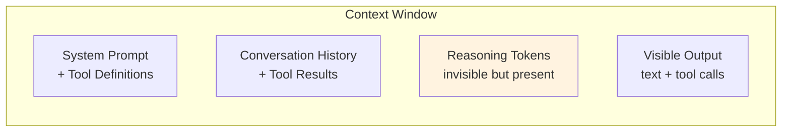

# OpenAI reasoning models

## Introduction

OpenAI's reasoning model lineup has evolved rapidly. GPT-5 now serves as the flagship model with built-in thinking capabilities and configurable reasoning effort, while the o-series models (o3, o4-mini, o3-pro) remain available for specialized deep reasoning tasks. All of these models use the Responses API, which provides better performance and intelligence than the older Chat Completions API for reasoning workloads.

This lesson covers how to use OpenAI's reasoning models for tool calling, including configuring reasoning effort, reading reasoning summaries, and managing the context window to ensure reliable results.

### What we'll cover

- The GPT-5 family and o-series model capabilities
- Configuring reasoning effort for tool use
- Reading reasoning summaries during tool calls
- Managing context windows with reasoning tokens
- Controlling costs with `max_output_tokens`

### Prerequisites

- OpenAI API basics ([Lesson 02: Defining Functions](../02-defining-functions/00-defining-functions.md))
- Understanding of thinking model differences ([Lesson 16.01](./01-how-thinking-models-differ.md))

---

## The GPT-5 family

GPT-5 is OpenAI's flagship reasoning model. Unlike the earlier separation between "standard" models (GPT-4, GPT-4.1) and "reasoning" models (o1, o3), GPT-5 integrates thinking directly into the model with a configurable effort level:

```python
from openai import OpenAI

client = OpenAI()

# GPT-5 with reasoning — the default for complex tasks
response = client.responses.create(
    model="gpt-5",
    reasoning={"effort": "medium"},
    tools=[{
        "type": "function",
        "name": "get_stock_price",
        "description": "Get the current stock price for a ticker symbol",
        "parameters": {
            "type": "object",
            "properties": {
                "ticker": {
                    "type": "string",
                    "description": "Stock ticker symbol, e.g. AAPL"
                }
            },
            "required": ["ticker"]
        }
    }],
    input="What's Apple's current stock price?"
)

for item in response.output:
    print(f"{item.type}: {getattr(item, 'name', getattr(item, 'content', [''])[0].text if item.type == 'message' else ''))}")
```

**Output:**
```
reasoning: [internal reasoning summary]
function_call: get_stock_price
```

### GPT-5 variants

| Model | Speed | Cost | Reasoning | Best For |
|-------|-------|------|-----------|----------|
| `gpt-5` | Standard | Higher | Full reasoning | Complex agentic tasks, multi-tool orchestration |
| `gpt-5-mini` | Faster | Medium | Full reasoning | Well-defined tasks, production workloads |
| `gpt-5-nano` | Fastest | Lowest | Full reasoning | High throughput, cost-sensitive applications |
| `gpt-5-pro` | Slower | Highest | Maximum compute | Hardest problems requiring deep analysis |

All GPT-5 variants support the same `reasoning.effort` parameter and tool calling capabilities. The difference is in model size, speed, and depth of reasoning.

### The o-series (still available)

The o-series models remain available and are useful for specific scenarios:

| Model | Status | Use Case |
|-------|--------|----------|
| `o3` | Available, succeeded by GPT-5 | Deep reasoning, complex problem-solving |
| `o4-mini` | Available, succeeded by GPT-5 mini | Fast, cost-efficient reasoning |
| `o3-pro` | Available | Extended thinking for hardest problems |

> **Tip:** For most new projects, start with GPT-5 (or GPT-5 mini for cost efficiency). Use o-series models only if you need backward compatibility or have specific benchmarked workflows.

---

## Configuring reasoning effort

The `reasoning.effort` parameter controls how many reasoning tokens the model generates before responding. This directly affects the quality of tool selection, latency, and cost:

```python
from openai import OpenAI

client = OpenAI()

tools = [{
    "type": "function",
    "name": "analyze_data",
    "description": "Run statistical analysis on a dataset",
    "parameters": {
        "type": "object",
        "properties": {
            "dataset_id": {"type": "string"},
            "analysis_type": {
                "type": "string",
                "enum": ["mean", "median", "regression", "correlation",
                         "anova", "chi_square", "t_test"]
            },
            "confidence_level": {"type": "number"}
        },
        "required": ["dataset_id", "analysis_type"]
    }
}]

# Low effort — fast, minimal reasoning
response_fast = client.responses.create(
    model="gpt-5",
    reasoning={"effort": "low"},
    tools=tools,
    input="Run a quick mean calculation on dataset DS-001"
)

# Medium effort — balanced (default)
response_balanced = client.responses.create(
    model="gpt-5",
    reasoning={"effort": "medium"},
    tools=tools,
    input="Analyze dataset DS-001 to determine if there's a "
          "statistically significant correlation between variables A and B"
)

# High effort — thorough reasoning
response_thorough = client.responses.create(
    model="gpt-5",
    reasoning={"effort": "high"},
    tools=tools,
    input="Given dataset DS-001, determine the best statistical test "
          "to compare group outcomes, considering sample size, "
          "distribution normality, and the number of groups"
)
```

### Effort level comparison

| Effort | Reasoning Tokens | Latency | Tool Selection Quality | When to Use |
|--------|:----------------:|:-------:|:---------------------:|-------------|
| `low` | Few hundred | Fast | Good for simple calls | Single tool, unambiguous request |
| `medium` | ~1,000-5,000 | Moderate | Strong for most tasks | Default — multi-tool, moderate complexity |
| `high` | ~5,000-25,000+ | Slower | Best for complex planning | Many tools, ambiguous input, multi-step deps |

> **🔑 Key concept:** The default effort is `medium`. You rarely need `high` for tool calling — it's most useful when the model must plan a complex multi-step sequence across many available tools.

---

## Reasoning summaries

While the actual reasoning tokens are not exposed, you can request summaries that show the model's thought process. This is invaluable for debugging tool selection:

```python
from openai import OpenAI

client = OpenAI()

tools = [
    {
        "type": "function",
        "name": "search_orders",
        "description": "Search customer orders by various criteria",
        "parameters": {
            "type": "object",
            "properties": {
                "customer_id": {"type": "string"},
                "status": {
                    "type": "string",
                    "enum": ["pending", "shipped", "delivered", "returned"]
                },
                "date_range": {
                    "type": "object",
                    "properties": {
                        "start": {"type": "string", "description": "ISO date"},
                        "end": {"type": "string", "description": "ISO date"}
                    }
                }
            },
            "required": ["customer_id"]
        }
    },
    {
        "type": "function",
        "name": "get_customer_profile",
        "description": "Get customer profile information",
        "parameters": {
            "type": "object",
            "properties": {
                "customer_id": {"type": "string"}
            },
            "required": ["customer_id"]
        }
    }
]

response = client.responses.create(
    model="gpt-5",
    reasoning={
        "effort": "medium",
        "summary": "auto"   # Request reasoning summary
    },
    tools=tools,
    input="Customer C-1234 is asking about their recent returns. "
          "Look up their profile and any returned orders."
)

# Parse the response to see reasoning + tool calls
for item in response.output:
    if item.type == "reasoning":
        print("🧠 Model reasoning:")
        for summary_item in item.summary:
            print(f"   {summary_item.text}")
        print()
    elif item.type == "function_call":
        print(f"🔧 Tool call: {item.name}({item.arguments})")
```

**Output:**
```
🧠 Model reasoning:
   The customer is asking about returns. I need two pieces of
   information: their profile (to address them properly) and their
   returned orders. I'll call both functions in parallel since
   they're independent — get_customer_profile for their info and
   search_orders filtered to "returned" status.

🔧 Tool call: get_customer_profile({"customer_id": "C-1234"})
🔧 Tool call: search_orders({"customer_id": "C-1234", "status": "returned"})
```

### Summary types

| Summary Value | Detail Level | Supported Models |
|---------------|:------------|-----------------|
| `"auto"` | Most detailed available for the model | All reasoning models |
| `"concise"` | Brief overview | Computer use model |
| `"detailed"` | Thorough reasoning walkthrough | o4-mini, GPT-5 family |

> **Note:** Before using summaries with the latest reasoning models, you may need to complete organization verification on the [platform settings page](https://platform.openai.com/settings/organization/general).

---

## Managing the context window

Reasoning tokens occupy space in the model's context window, even though they're not visible in the API response. This is critical for tool use because tool definitions, function results, and reasoning tokens all compete for the same space:



### Token usage tracking

The `usage` object in every response shows exactly how many reasoning tokens were consumed:

```python
response = client.responses.create(
    model="gpt-5",
    reasoning={"effort": "medium"},
    tools=tools,
    input="Analyze the customer's situation"
)

# Check token usage
usage = response.usage
print(f"Input tokens:     {usage.input_tokens}")
print(f"Output tokens:    {usage.output_tokens}")
print(f"  Reasoning:      {usage.output_tokens_details.reasoning_tokens}")
print(f"  Visible output: {usage.output_tokens - usage.output_tokens_details.reasoning_tokens}")
print(f"Total tokens:     {usage.total_tokens}")
```

**Output:**
```
Input tokens:     450
Output tokens:    1186
  Reasoning:      1024
  Visible output: 162
Total tokens:     1636
```

> **Warning:** Reasoning tokens are billed as output tokens. In this example, 86% of the output tokens are reasoning — invisible but still billed.

### Handling incomplete responses

If reasoning tokens exhaust the context window or `max_output_tokens` limit, you get an incomplete response — potentially with no visible output at all:

```python
response = client.responses.create(
    model="gpt-5",
    reasoning={"effort": "medium"},
    tools=tools,
    input="Complex multi-step analysis request...",
    max_output_tokens=300  # Too low — reasoning may consume all of it
)

if response.status == "incomplete":
    reason = response.incomplete_details.reason
    if reason == "max_output_tokens":
        print("Ran out of tokens!")
        if response.output_text:
            print(f"Partial output: {response.output_text}")
        else:
            print("All tokens used for reasoning — no visible output")
            # Solution: increase max_output_tokens or lower effort
```

### Recommended token reservation

OpenAI recommends reserving at least **25,000 tokens** for reasoning and outputs when experimenting:

```python
# Safe approach — generous token budget
response = client.responses.create(
    model="gpt-5",
    reasoning={"effort": "medium"},
    tools=tools,
    input=user_input,
    max_output_tokens=25000  # Plenty of room for reasoning + output
)
```

As you learn how many reasoning tokens your specific prompts need, adjust the buffer accordingly.

---

## Controlling costs

Reasoning tokens add significant cost. Here are strategies to manage it:

### Strategy 1: match effort to complexity

```python
def get_reasoning_effort(num_tools: int, query_complexity: str) -> str:
    """Choose reasoning effort based on task complexity."""
    if num_tools <= 2 and query_complexity == "simple":
        return "low"
    elif num_tools <= 5 or query_complexity == "moderate":
        return "medium"
    else:
        return "high"

effort = get_reasoning_effort(
    num_tools=len(tools),
    query_complexity=classify_query(user_input)
)

response = client.responses.create(
    model="gpt-5",
    reasoning={"effort": effort},
    tools=tools,
    input=user_input
)
```

### Strategy 2: use the right model tier

```python
# High-volume, simple tool calls → GPT-5 nano
response = client.responses.create(
    model="gpt-5-nano",
    reasoning={"effort": "low"},
    tools=simple_tools,
    input=user_input
)

# Complex multi-tool orchestration → GPT-5
response = client.responses.create(
    model="gpt-5",
    reasoning={"effort": "medium"},
    tools=complex_tools,
    input=user_input
)
```

### Strategy 3: use `max_output_tokens` as a cost cap

```python
# Cap total output (reasoning + visible) to control costs
response = client.responses.create(
    model="gpt-5",
    reasoning={"effort": "medium"},
    tools=tools,
    input=user_input,
    max_output_tokens=5000  # Hard cap on total output tokens
)
```

---

## Best practices

| Practice | Why it matters |
|----------|---------------|
| Use the Responses API, not Chat Completions | Better intelligence and performance for reasoning models |
| Start with `"medium"` effort and adjust based on metrics | Balances quality and cost by default |
| Monitor `output_tokens_details.reasoning_tokens` | Know how much you're spending on invisible reasoning |
| Reserve ≥25,000 tokens for reasoning + output initially | Prevents incomplete responses during development |
| Use GPT-5 nano for simple, high-volume tool calls | Same reasoning capability at lowest cost |
| Request `"summary": "auto"` during development | Helps debug tool selection and parameter issues |
| Disable summaries in production | Saves tokens when you don't need debugging info |

---

## Common pitfalls

| ❌ Mistake | ✅ Solution |
|-----------|------------|
| Setting `max_output_tokens` too low for reasoning models | Start with 25,000+ and reduce once you know your token needs |
| Using Chat Completions API with GPT-5 | Use the Responses API — it's designed for reasoning models |
| Not checking `response.status == "incomplete"` | Always handle incomplete responses in production code |
| Using `"high"` effort for every request | Reserve for truly complex tasks; `"medium"` suffices for most tool use |
| Ignoring reasoning token costs | Reasoning tokens are ~86% of output in typical tool call scenarios |
| Expecting summaries without requesting them | Set `reasoning.summary` to `"auto"` explicitly |

---

## Hands-on exercise

### Your task

Build a tool-calling application that dynamically selects reasoning effort based on query complexity. The system should:

1. Classify incoming queries as simple, moderate, or complex
2. Select the appropriate reasoning effort level
3. Make the API call and log reasoning token usage
4. Compare cost and quality across effort levels

### Requirements

1. Define 3-5 tools for a customer support scenario
2. Create a `classify_query` function that returns a complexity level
3. Map complexity to reasoning effort (`low`, `medium`, `high`)
4. Log token usage (input, reasoning, visible output) for each request
5. Run the same query at all three effort levels and compare

### Expected result

A table showing effort level, reasoning tokens, latency, and whether the correct tool(s) were selected.

<details>
<summary>💡 Hints (click to expand)</summary>

- Simple queries: single keyword, one obvious tool ("check my balance")
- Moderate queries: require one or two tools, some inference ("find my recent purchases over $50")
- Complex queries: multi-step, conditional, many tools ("check if any orders are delayed, refund them, and notify the customer")
- Use `time.time()` to measure latency
- Compare `usage.output_tokens_details.reasoning_tokens` across effort levels

</details>

<details>
<summary>✅ Solution (click to expand)</summary>

```python
from openai import OpenAI
import json
import time

client = OpenAI()

# Define customer support tools
tools = [
    {
        "type": "function",
        "name": "get_customer",
        "description": "Retrieve customer profile by ID or email",
        "parameters": {
            "type": "object",
            "properties": {
                "identifier": {"type": "string"}
            },
            "required": ["identifier"]
        }
    },
    {
        "type": "function",
        "name": "search_orders",
        "description": "Search orders by customer ID, status, or date range",
        "parameters": {
            "type": "object",
            "properties": {
                "customer_id": {"type": "string"},
                "status": {
                    "type": "string",
                    "enum": ["pending", "shipped", "delivered",
                             "returned", "delayed"]
                },
                "min_amount": {"type": "number"}
            },
            "required": ["customer_id"]
        }
    },
    {
        "type": "function",
        "name": "process_refund",
        "description": "Process a refund for an order",
        "parameters": {
            "type": "object",
            "properties": {
                "order_id": {"type": "string"},
                "reason": {"type": "string"}
            },
            "required": ["order_id", "reason"]
        }
    },
    {
        "type": "function",
        "name": "send_notification",
        "description": "Send email or SMS notification to customer",
        "parameters": {
            "type": "object",
            "properties": {
                "customer_id": {"type": "string"},
                "channel": {
                    "type": "string",
                    "enum": ["email", "sms"]
                },
                "message": {"type": "string"}
            },
            "required": ["customer_id", "channel", "message"]
        }
    }
]


def classify_query(query: str) -> str:
    """Classify query complexity based on heuristics."""
    # Count action verbs and conditional words
    complex_indicators = ["if", "then", "and also", "after that",
                          "check and", "refund", "notify"]
    moderate_indicators = ["find", "search", "filter", "over",
                           "under", "recent", "last"]

    query_lower = query.lower()
    complex_count = sum(1 for w in complex_indicators
                        if w in query_lower)
    moderate_count = sum(1 for w in moderate_indicators
                         if w in query_lower)

    if complex_count >= 2:
        return "complex"
    elif moderate_count >= 1 or complex_count == 1:
        return "moderate"
    return "simple"


def effort_from_complexity(complexity: str) -> str:
    """Map complexity to reasoning effort."""
    return {
        "simple": "low",
        "moderate": "medium",
        "complex": "high"
    }[complexity]


def run_with_effort(query: str, effort: str) -> dict:
    """Run a query at a specific effort level and measure results."""
    start = time.time()

    response = client.responses.create(
        model="gpt-5",
        reasoning={
            "effort": effort,
            "summary": "auto"
        },
        tools=tools,
        input=query,
        max_output_tokens=25000
    )

    elapsed = time.time() - start

    # Extract tool calls
    tool_calls = [
        item.name for item in response.output
        if item.type == "function_call"
    ]

    return {
        "effort": effort,
        "latency_s": round(elapsed, 2),
        "input_tokens": response.usage.input_tokens,
        "reasoning_tokens": response.usage.output_tokens_details.reasoning_tokens,
        "output_tokens": response.usage.output_tokens,
        "tools_called": tool_calls,
        "status": response.status
    }


# Test query
query = ("Customer C-5678 has delayed orders. Check for delayed "
         "orders, refund any over $100, and notify them via email.")

# Compare across all effort levels
print(f"Query: {query}\n")
print(f"{'Effort':<10} {'Latency':>8} {'Reasoning':>10} "
      f"{'Total Out':>10} {'Tools Called'}")
print("-" * 70)

for effort in ["low", "medium", "high"]:
    result = run_with_effort(query, effort)
    tools_str = ", ".join(result["tools_called"]) or "none"
    print(f"{result['effort']:<10} {result['latency_s']:>7}s "
          f"{result['reasoning_tokens']:>10} "
          f"{result['output_tokens']:>10} {tools_str}")
```

</details>

### Bonus challenges

- [ ] Add a cost calculation using current OpenAI pricing
- [ ] Implement automatic retry with higher effort if the first attempt selects wrong tools
- [ ] Build a dashboard that visualizes reasoning token usage over time
- [ ] Compare GPT-5 nano vs GPT-5 for the same queries

---

## Summary

✅ **GPT-5** is the flagship reasoning model — use it with `reasoning.effort` set to `"low"`, `"medium"`, or `"high"` based on task complexity

✅ **Reasoning summaries** (`reasoning.summary: "auto"`) reveal the model's tool selection logic — essential for debugging during development

✅ **Reasoning tokens** are invisible but occupy context window space and are billed as output tokens — monitor `output_tokens_details.reasoning_tokens`

✅ Reserve at least **25,000 tokens** for reasoning + output initially, and handle `response.status == "incomplete"` in production

✅ Match **model tier to workload**: GPT-5 nano for simple high-volume calls, GPT-5 for complex orchestration, GPT-5 pro for the hardest problems

**Previous:** [How Thinking Models Differ](./01-how-thinking-models-differ.md) | **Next:** [Reasoning Items (OpenAI) →](./03-reasoning-items-openai.md)

---

## Further reading

- [OpenAI Reasoning Models Guide](https://platform.openai.com/docs/guides/reasoning) — Complete reasoning documentation
- [OpenAI Models Page](https://platform.openai.com/docs/models) — Current model list and capabilities
- [OpenAI Reasoning Best Practices](https://platform.openai.com/docs/guides/reasoning-best-practices) — Prompting tips
- [OpenAI Pricing](https://platform.openai.com/docs/pricing) — Current token pricing

*[Back to Thinking Models & Tool Use overview](./00-thinking-models-tool-use.md)*

<!-- 
Sources Consulted:
- OpenAI Reasoning Models Guide: https://platform.openai.com/docs/guides/reasoning
- OpenAI Models Page: https://platform.openai.com/docs/models
- OpenAI Function Calling Guide: https://platform.openai.com/docs/guides/function-calling
-->
