# Reasoning items (OpenAI)

## Introduction

When a reasoning model makes a tool call, it produces **reasoning items** — internal thought tokens that guided the model's decision. These reasoning items are critical for multi-step tool use because passing them back in subsequent turns allows the model to maintain its chain of thought across the entire interaction.

Failing to pass reasoning items back is the single most common cause of degraded multi-turn tool calling performance with OpenAI reasoning models. This lesson explains what reasoning items are, why they matter, and exactly how to manage them.

### What we'll cover

- What reasoning items are and where they appear
- Why passing reasoning items back is essential for tool use
- How to use `previous_response_id` for automatic management
- Manual reasoning item management with the `input` array
- Encrypted reasoning items for stateless and zero-data-retention modes

### Prerequisites

- OpenAI Responses API basics ([Lesson 16.02](./02-openai-reasoning-models.md))
- Multi-turn tool calling patterns ([Lesson 09: Tool Calling Patterns](../09-tool-calling-patterns/00-tool-calling-patterns.md))

---

## What are reasoning items?

When a reasoning model processes a request, the response `output` array contains several item types. Reasoning items appear alongside function calls and messages:

```python
from openai import OpenAI

client = OpenAI()

tools = [{
    "type": "function",
    "name": "get_weather",
    "description": "Get current weather for a location",
    "parameters": {
        "type": "object",
        "properties": {
            "location": {"type": "string"},
            "units": {
                "type": "string",
                "enum": ["celsius", "fahrenheit"]
            }
        },
        "required": ["location"]
    }
}]

response = client.responses.create(
    model="gpt-5",
    reasoning={"effort": "medium", "summary": "auto"},
    tools=tools,
    input="What's the weather in Tokyo?"
)

# Examine every item in the output
for item in response.output:
    print(f"Type: {item.type}")
    if item.type == "reasoning":
        print(f"  ID: {item.id}")
        print(f"  Summary: {item.summary[0].text if item.summary else 'none'}")
    elif item.type == "function_call":
        print(f"  Name: {item.name}")
        print(f"  Args: {item.arguments}")
        print(f"  Call ID: {item.call_id}")
```

**Output:**
```
Type: reasoning
  ID: rs_abc123
  Summary: The user wants weather for Tokyo. I'll call get_weather 
           with location "Tokyo".
Type: function_call
  Name: get_weather
  Args: {"location": "Tokyo", "units": "celsius"}
  Call ID: call_xyz789
```

The reasoning item contains the model's internal thought process. Its `id` uniquely identifies it, and the optional `summary` shows a human-readable version of the reasoning.

---

## Why reasoning items matter for tool use

Without reasoning items, the model "forgets" why it made previous tool calls. This is especially problematic in multi-step scenarios:

```mermaid
sequenceDiagram
    participant User
    participant Model
    participant Tool1 as get_weather
    participant Tool2 as get_forecast

    User->>Model: "Compare today's weather<br/>with tomorrow's forecast<br/>in Paris"
    
    Note over Model: Reasoning: I need both<br/>current weather AND forecast.<br/>Let me start with today.
    
    Model->>Tool1: get_weather("Paris")
    Tool1-->>Model: {"temp": 22, "condition": "sunny"}
    
    Note over Model: With reasoning items:<br/>I remember I still need<br/>tomorrow's forecast
    
    Model->>Tool2: get_forecast("Paris", "tomorrow")
    Tool2-->>Model: {"temp": 18, "condition": "cloudy"}
    
    Model->>User: "Today: 22°C sunny.<br/>Tomorrow: 18°C cloudy.<br/>4°C cooler tomorrow."
```



Without the reasoning items from the first turn, the model might not recall that a second call was needed — or might repeat the same call instead of progressing to the next step.

> **🔑 Key concept:** It is **highly recommended** to pass reasoning items back to the model between tool calls. OpenAI explicitly states this in their documentation.

---

## Automatic management with `previous_response_id`

The simplest way to handle reasoning items is to let the API manage them automatically using `previous_response_id`:

```python
from openai import OpenAI

client = OpenAI()

tools = [
    {
        "type": "function",
        "name": "get_customer",
        "description": "Get customer profile",
        "parameters": {
            "type": "object",
            "properties": {
                "customer_id": {"type": "string"}
            },
            "required": ["customer_id"]
        }
    },
    {
        "type": "function",
        "name": "get_orders",
        "description": "Get customer orders",
        "parameters": {
            "type": "object",
            "properties": {
                "customer_id": {"type": "string"},
                "status": {"type": "string"}
            },
            "required": ["customer_id"]
        }
    }
]

# Step 1: Initial request
response = client.responses.create(
    model="gpt-5",
    reasoning={"effort": "medium"},
    tools=tools,
    input="Look up customer C-100 and their pending orders"
)

# Step 2: Process tool calls and continue using previous_response_id
while response.output and any(
    item.type == "function_call" for item in response.output
):
    tool_results = []
    for item in response.output:
        if item.type == "function_call":
            # Execute the tool (simulated here)
            result = execute_tool(item.name, item.arguments)
            tool_results.append({
                "type": "function_call_output",
                "call_id": item.call_id,
                "output": str(result)
            })

    # Use previous_response_id — API handles reasoning items
    response = client.responses.create(
        model="gpt-5",
        reasoning={"effort": "medium"},
        tools=tools,
        previous_response_id=response.id,  # ← Key line
        input=tool_results
    )

# Final answer includes full reasoning context
print(response.output_text)
```

**Output:**
```
Customer C-100 (Alice Johnson) has 2 pending orders:
- Order #1234: Widget Pro ($49.99) — pending since Jan 15
- Order #5678: Gadget Plus ($29.99) — pending since Jan 18
```

> **Tip:** `previous_response_id` is the recommended approach for most applications. The API automatically includes all reasoning items from the previous response, so the model maintains its full chain of thought.

---

## Manual reasoning item management

When `previous_response_id` isn't suitable — for example, when you need to modify the conversation history or run in a stateless environment — you must manually pass reasoning items back.

### The critical rule

You must include **all output items** from between the last user message (or function call output) and the current function call results. This includes reasoning items, function calls, and any messages:

```python
from openai import OpenAI
import json

client = OpenAI()

tools = [
    {
        "type": "function",
        "name": "search_inventory",
        "description": "Search product inventory",
        "parameters": {
            "type": "object",
            "properties": {
                "query": {"type": "string"},
                "category": {"type": "string"}
            },
            "required": ["query"]
        }
    },
    {
        "type": "function",
        "name": "check_price",
        "description": "Get current price for a product",
        "parameters": {
            "type": "object",
            "properties": {
                "product_id": {"type": "string"}
            },
            "required": ["product_id"]
        }
    }
]

# Step 1: Initial request
response = client.responses.create(
    model="gpt-5",
    reasoning={"effort": "medium"},
    tools=tools,
    input="Find wireless headphones under $50"
)

# Step 2: Build the input array for the next turn
# Include ALL output items — reasoning, function calls, everything
next_input = []

# Start with the original user message
next_input.append({
    "type": "message",
    "role": "user",
    "content": "Find wireless headphones under $50"
})

# Add ALL items from the response output
for item in response.output:
    if item.type == "reasoning":
        # Pass the reasoning item back by its ID
        next_input.append({
            "type": "reasoning",
            "id": item.id
        })
    elif item.type == "function_call":
        next_input.append({
            "type": "function_call",
            "id": item.id,
            "call_id": item.call_id,
            "name": item.name,
            "arguments": item.arguments
        })

# Add function results
for item in response.output:
    if item.type == "function_call":
        result = execute_tool(item.name, item.arguments)
        next_input.append({
            "type": "function_call_output",
            "call_id": item.call_id,
            "output": json.dumps(result)
        })

# Step 3: Continue with full context
response = client.responses.create(
    model="gpt-5",
    reasoning={"effort": "medium"},
    tools=tools,
    input=next_input  # Contains reasoning + calls + results
)
```

### What happens if you omit reasoning items

```python
# ❌ WRONG — Only sending function results without reasoning items
next_input_broken = [
    {
        "type": "function_call_output",
        "call_id": "call_abc",
        "output": '{"products": [...]}'
    }
]

# The model may:
# - Repeat the same tool call
# - Forget the original query intent
# - Miss the second step in a multi-step plan
# - Generate lower-quality parameter values
```

> **Warning:** Omitting reasoning items doesn't cause an API error — the call succeeds, but the model's performance degrades silently. This makes the issue hard to debug.

---

## Encrypted reasoning items

For applications using **zero-data-retention (ZDR)** or running in **stateless mode**, reasoning items are encrypted. OpenAI doesn't store the data, so you must carry the encrypted content yourself.

### Requesting encrypted content

To receive encrypted reasoning items, include `reasoning.encrypted_content` in the `include` parameter:

```python
from openai import OpenAI

client = OpenAI()

response = client.responses.create(
    model="gpt-5",
    reasoning={"effort": "medium"},
    tools=tools,
    input="Analyze customer data",
    include=["reasoning.encrypted_content"]  # Request encrypted items
)

# Reasoning items now include an encrypted_content field
for item in response.output:
    if item.type == "reasoning":
        print(f"Reasoning ID: {item.id}")
        print(f"Has encrypted content: "
              f"{item.encrypted_content is not None}")
        # encrypted_content is an opaque string — don't parse it
```

**Output:**
```
Reasoning ID: rs_def456
Has encrypted content: True
```

### Passing encrypted items back

When building the input array for the next turn, include the `encrypted_content` field on reasoning items:

```python
# Build next turn with encrypted reasoning
next_input = []

for item in response.output:
    if item.type == "reasoning":
        reasoning_item = {
            "type": "reasoning",
            "id": item.id,
        }
        # Include encrypted content if present
        if item.encrypted_content:
            reasoning_item["encrypted_content"] = item.encrypted_content
        next_input.append(reasoning_item)
    elif item.type == "function_call":
        next_input.append({
            "type": "function_call",
            "id": item.id,
            "call_id": item.call_id,
            "name": item.name,
            "arguments": item.arguments
        })

# Add function results
for item in response.output:
    if item.type == "function_call":
        result = execute_tool(item.name, item.arguments)
        next_input.append({
            "type": "function_call_output",
            "call_id": item.call_id,
            "output": json.dumps(result)
        })

# Continue with encrypted context preserved
response = client.responses.create(
    model="gpt-5",
    reasoning={"effort": "medium"},
    tools=tools,
    input=next_input
)
```

### When to use encrypted content

| Scenario | Use `previous_response_id` | Use Encrypted Content |
|----------|:--------------------------:|:---------------------:|
| Standard API usage | ✅ Recommended | Not needed |
| Zero-data-retention (ZDR) | Not available | ✅ Required |
| Stateless deployments | Not available | ✅ Required |
| Custom conversation management | Optional | ✅ Recommended |
| Debugging during development | ✅ Simplest | Works if needed |

> **Note:** The model handles irrelevant reasoning items gracefully. If you include reasoning items from a much earlier turn that no longer apply, the model simply ignores them without error.

---

## Best practices

| Practice | Why it matters |
|----------|---------------|
| Use `previous_response_id` when possible | Automatic, error-free reasoning item management |
| Include ALL output items when building input manually | Missing items degrade performance silently |
| Request `reasoning.encrypted_content` for ZDR/stateless | Required to maintain chain of thought without server storage |
| Don't parse or modify reasoning items | They're opaque — treat them as pass-through tokens |
| Keep reasoning items from the most recent exchange | Older items are ignored but add to token count |
| Test with and without reasoning items | Measure the quality difference to justify the token cost |

---

## Common pitfalls

| ❌ Mistake | ✅ Solution |
|-----------|------------|
| Sending only `function_call_output` without reasoning items | Include reasoning items and function call items between user message and tool output |
| Not noticing degraded quality (no error, just worse results) | A/B test with and without reasoning items to validate |
| Forgetting `encrypted_content` in ZDR mode | Always include `reasoning.encrypted_content` in the `include` parameter |
| Accumulating old reasoning items across many turns | Keep only items from the most recent assistant turn |
| Using `previous_response_id` in environments that don't support it | Fall back to manual management with encrypted content |
| Trying to decode or inspect encrypted content | Encrypted content is opaque — pass it through unchanged |

---

## Hands-on exercise

### Your task

Build a multi-step tool calling loop that properly handles reasoning items in both automatic (`previous_response_id`) and manual modes. Compare the quality of results.

### Requirements

1. Define 3+ tools for an e-commerce assistant
2. Implement the tool calling loop using `previous_response_id`
3. Implement the same loop using manual reasoning item management
4. Send a query that requires 2+ sequential tool calls
5. Compare the final answers from both approaches

### Expected result

Both approaches should produce identical (or nearly identical) final answers, confirming that manual management correctly preserves the chain of thought.

<details>
<summary>💡 Hints (click to expand)</summary>

- A good multi-step query: "Find the cheapest laptop, check if it's in stock, and add it to cart for customer C-100"
- For manual mode, iterate over `response.output` and include every item type
- Use `json.dumps(result)` for function call output values
- Track the number of turns needed — both approaches should take the same number

</details>

<details>
<summary>✅ Solution (click to expand)</summary>

```python
from openai import OpenAI
import json

client = OpenAI()

tools = [
    {
        "type": "function",
        "name": "search_products",
        "description": "Search products by name, category, or price range",
        "parameters": {
            "type": "object",
            "properties": {
                "query": {"type": "string"},
                "max_price": {"type": "number"},
                "sort_by": {
                    "type": "string",
                    "enum": ["price_asc", "price_desc", "rating"]
                }
            },
            "required": ["query"]
        }
    },
    {
        "type": "function",
        "name": "check_stock",
        "description": "Check inventory status for a product",
        "parameters": {
            "type": "object",
            "properties": {
                "product_id": {"type": "string"}
            },
            "required": ["product_id"]
        }
    },
    {
        "type": "function",
        "name": "add_to_cart",
        "description": "Add a product to a customer's cart",
        "parameters": {
            "type": "object",
            "properties": {
                "customer_id": {"type": "string"},
                "product_id": {"type": "string"},
                "quantity": {"type": "integer"}
            },
            "required": ["customer_id", "product_id"]
        }
    }
]


def mock_tool(name: str, args: str) -> dict:
    """Simulate tool execution."""
    args = json.loads(args)
    if name == "search_products":
        return {"products": [
            {"id": "LAP-001", "name": "Budget Laptop",
             "price": 399.99},
            {"id": "LAP-002", "name": "Pro Laptop",
             "price": 899.99}
        ]}
    elif name == "check_stock":
        return {"product_id": args["product_id"],
                "in_stock": True, "quantity": 15}
    elif name == "add_to_cart":
        return {"success": True,
                "cart_id": "CART-789",
                "item_count": 1}
    return {}


query = ("Find the cheapest laptop, check if it's in stock, "
         "and add it to cart for customer C-100")


# === Approach 1: previous_response_id ===
print("=== Approach 1: previous_response_id ===\n")
resp = client.responses.create(
    model="gpt-5",
    reasoning={"effort": "medium"},
    tools=tools,
    input=query
)

turns = 0
while any(i.type == "function_call" for i in resp.output):
    turns += 1
    results = []
    for item in resp.output:
        if item.type == "function_call":
            result = mock_tool(item.name, item.arguments)
            print(f"  Turn {turns}: {item.name}({item.arguments})")
            results.append({
                "type": "function_call_output",
                "call_id": item.call_id,
                "output": json.dumps(result)
            })

    resp = client.responses.create(
        model="gpt-5",
        reasoning={"effort": "medium"},
        tools=tools,
        previous_response_id=resp.id,
        input=results
    )

print(f"\nResult ({turns} turns): {resp.output_text}\n")


# === Approach 2: Manual reasoning items ===
print("=== Approach 2: Manual reasoning items ===\n")
conversation = [{"type": "message", "role": "user", "content": query}]

resp = client.responses.create(
    model="gpt-5",
    reasoning={"effort": "medium"},
    tools=tools,
    input=query
)

turns = 0
while any(i.type == "function_call" for i in resp.output):
    turns += 1

    # Add ALL output items to conversation
    for item in resp.output:
        if item.type == "reasoning":
            conversation.append({
                "type": "reasoning",
                "id": item.id
            })
        elif item.type == "function_call":
            conversation.append({
                "type": "function_call",
                "id": item.id,
                "call_id": item.call_id,
                "name": item.name,
                "arguments": item.arguments
            })

    # Add function results
    for item in resp.output:
        if item.type == "function_call":
            result = mock_tool(item.name, item.arguments)
            print(f"  Turn {turns}: {item.name}({item.arguments})")
            conversation.append({
                "type": "function_call_output",
                "call_id": item.call_id,
                "output": json.dumps(result)
            })

    resp = client.responses.create(
        model="gpt-5",
        reasoning={"effort": "medium"},
        tools=tools,
        input=conversation
    )

print(f"\nResult ({turns} turns): {resp.output_text}")
```

</details>

### Bonus challenges

- [ ] Add encrypted content support for the manual approach
- [ ] Measure token usage differences between automatic and manual modes
- [ ] Implement a helper class that abstracts reasoning item management
- [ ] Handle edge cases: what if the model returns reasoning but no function call?

---

## Summary

✅ **Reasoning items** are internal thought tokens that the model generates before making tool calls — they must be passed back for multi-turn consistency

✅ Use **`previous_response_id`** for automatic reasoning item management — it's the simplest and most reliable approach

✅ For **manual management**, include ALL output items (reasoning + function calls) between the last user message and the new function results

✅ In **ZDR/stateless** environments, request `reasoning.encrypted_content` and pass the opaque `encrypted_content` field back unchanged

✅ **Omitting reasoning items** doesn't cause errors — it silently degrades quality, making it hard to detect without explicit testing

**Previous:** [OpenAI Reasoning Models](./02-openai-reasoning-models.md) | **Next:** [Thought Signatures (Gemini) →](./04-thought-signatures-gemini.md)

---

## Further reading

- [OpenAI Reasoning Guide — Reasoning Items](https://platform.openai.com/docs/guides/reasoning#reasoning-items) — Official documentation
- [OpenAI Responses API Reference](https://platform.openai.com/docs/api-reference/responses) — Full API reference
- [Lesson 09: Tool Calling Patterns](../09-tool-calling-patterns/00-tool-calling-patterns.md) — Multi-turn loop patterns

*[Back to Thinking Models & Tool Use overview](./00-thinking-models-tool-use.md)*

<!-- 
Sources Consulted:
- OpenAI Reasoning Guide: https://platform.openai.com/docs/guides/reasoning
- OpenAI Function Calling Guide: https://platform.openai.com/docs/guides/function-calling
- OpenAI Models Page: https://platform.openai.com/docs/models
-->
