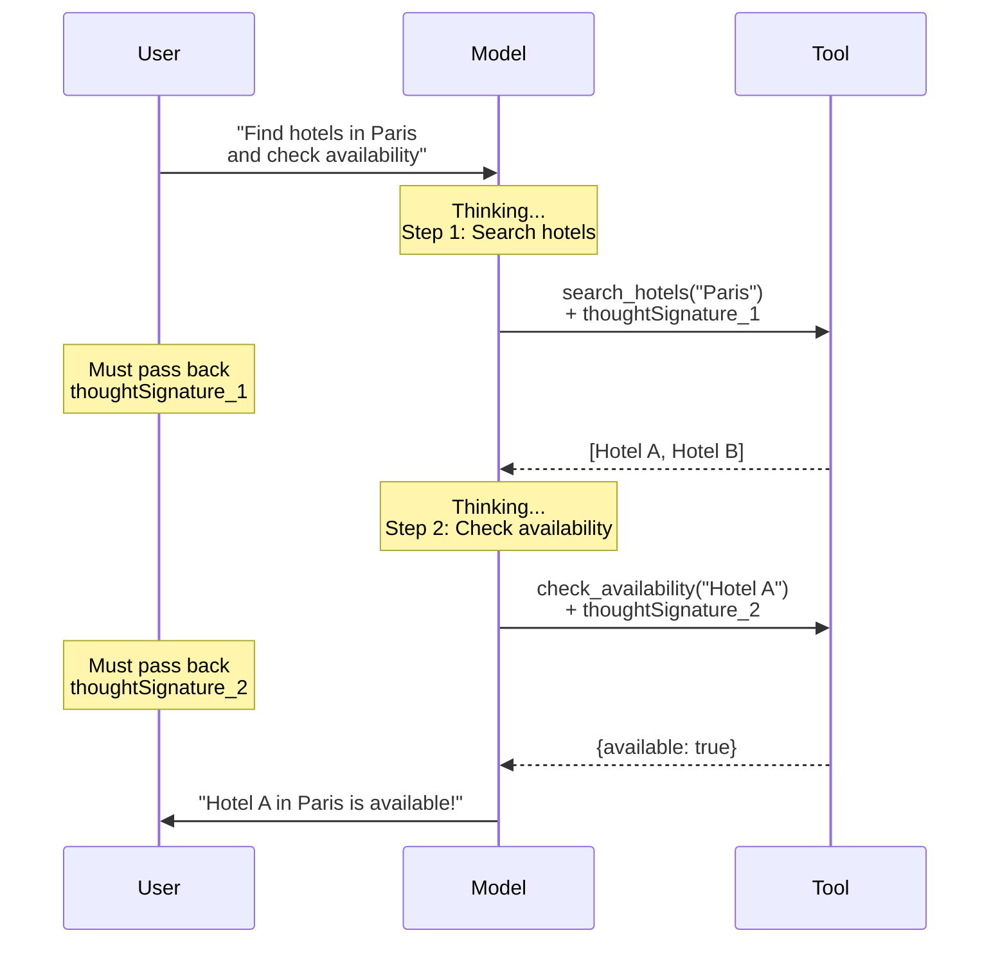

# Thought signatures (Gemini)

## Introduction

Google's Gemini 3 models introduce **thought signatures** — cryptographic tokens attached to the model's internal reasoning that must be passed back during multi-step function calling. Unlike OpenAI's reasoning items (which are recommended but optional), Gemini 3 thought signatures are **mandatory** for function calling. Omitting them produces a `400` error.

This lesson covers how thought signatures work, the exact rules for sequential and parallel function calls, and how to handle them across Gemini 3 and Gemini 2.5 models.

### What we'll cover

- What thought signatures are and why Gemini requires them
- Sequential function calling with signatures
- Parallel function calling signature rules
- Gemini 3 vs Gemini 2.5 differences
- SDK auto-handling and manual management
- Dummy signatures for development and testing

### Prerequisites

- Gemini function calling basics ([Lesson 02: Defining Functions](../02-defining-functions/00-defining-functions.md))
- How thinking models differ ([Lesson 16.01](./01-how-thinking-models-differ.md))

---

## What are thought signatures?

A thought signature is a `thoughtSignature` string that appears on content parts in the model's response. It represents an encrypted snapshot of the model's reasoning at that point. Gemini uses it to verify that the conversation history hasn't been tampered with between turns:

```python
from google import genai

client = genai.Client()

# Define a tool
get_weather = {
    "name": "get_weather",
    "description": "Get weather for a city",
    "parameters": {
        "type": "object",
        "properties": {
            "city": {"type": "string"}
        },
        "required": ["city"]
    }
}

response = client.models.generate_content(
    model="gemini-3-flash",
    contents="What's the weather in London?",
    config={
        "tools": [{"function_declarations": [get_weather]}],
        "thinking_config": {"include_thoughts": True}
    }
)

# Examine the response parts
for part in response.candidates[0].content.parts:
    print(f"Part type: ", end="")
    if part.function_call:
        print(f"function_call — {part.function_call.name}")
        print(f"  Args: {dict(part.function_call.args)}")
    elif part.thought:
        print(f"thought — {part.text[:60]}...")
    else:
        print(f"text — {part.text}")

    # Check for thought signature
    if part.thought_signature:
        print(f"  ✅ Has thought_signature "
              f"({len(part.thought_signature)} chars)")
```

**Output:**
```
Part type: thought — I need to get the weather for London. Let me call...
Part type: function_call — get_weather
  Args: {'city': 'London'}
  ✅ Has thought_signature (128 chars)
```

> **🔑 Key concept:** The `thoughtSignature` is attached to the **first function call part** in Gemini 3 models. It must be passed back unchanged when providing function results.

---

## Sequential function calling

In sequential (multi-step) function calling, the model makes one function call at a time, waits for the result, and then decides the next step. Each step produces its own thought signature:



### Implementation

```python
from google import genai
from google.genai import types

client = genai.Client()

tools_config = {
    "function_declarations": [
        {
            "name": "search_hotels",
            "description": "Search for hotels in a city",
            "parameters": {
                "type": "object",
                "properties": {
                    "city": {"type": "string"},
                    "check_in": {"type": "string"},
                    "guests": {"type": "integer"}
                },
                "required": ["city"]
            }
        },
        {
            "name": "check_availability",
            "description": "Check room availability for a hotel",
            "parameters": {
                "type": "object",
                "properties": {
                    "hotel_id": {"type": "string"},
                    "date": {"type": "string"}
                },
                "required": ["hotel_id"]
            }
        }
    ]
}

# Step 1: Initial request
response = client.models.generate_content(
    model="gemini-3-flash",
    contents="Find hotels in Paris for next Friday",
    config={"tools": [tools_config]}
)

# Extract the function call and its signature
fc_part = next(
    p for p in response.candidates[0].content.parts
    if p.function_call
)
signature = fc_part.thought_signature

print(f"Step 1: {fc_part.function_call.name}")
print(f"Signature present: {signature is not None}")

# Simulate tool execution
search_result = {
    "hotels": [
        {"id": "H-001", "name": "Le Petit Hotel", "price": 150},
        {"id": "H-002", "name": "Grand Palace", "price": 320}
    ]
}

# Step 2: Send result back — include ALL parts with signatures
# Build the history with the model's response parts intact
history = [
    types.Content(
        role="user",
        parts=[types.Part(text="Find hotels in Paris for next Friday")]
    ),
    # Model's response — preserve parts with signatures
    response.candidates[0].content,
    # Function result
    types.Content(
        role="user",
        parts=[types.Part(
            function_response=types.FunctionResponse(
                name="search_hotels",
                response=search_result
            )
        )]
    )
]

response_2 = client.models.generate_content(
    model="gemini-3-flash",
    contents=history,
    config={"tools": [tools_config]}
)
```

The critical detail: when you pass the model's previous response back as history, you must include the complete content parts with their `thoughtSignature` values unchanged.

---

## Parallel function calling

When the model calls multiple functions simultaneously, only the **first function call part** carries the thought signature:

```python
from google import genai

client = genai.Client()

tools_config = {
    "function_declarations": [
        {
            "name": "get_weather",
            "description": "Get current weather",
            "parameters": {
                "type": "object",
                "properties": {"city": {"type": "string"}},
                "required": ["city"]
            }
        },
        {
            "name": "get_events",
            "description": "Get local events",
            "parameters": {
                "type": "object",
                "properties": {"city": {"type": "string"}},
                "required": ["city"]
            }
        }
    ]
}

response = client.models.generate_content(
    model="gemini-3-flash",
    contents="What's the weather and events in Tokyo?",
    config={"tools": [tools_config]}
)

# Check which parts have signatures
for i, part in enumerate(response.candidates[0].content.parts):
    if part.function_call:
        has_sig = part.thought_signature is not None
        print(f"Part {i}: {part.function_call.name} "
              f"— signature: {'✅' if has_sig else '❌'}")
```

**Output:**
```
Part 0: get_weather — signature: ✅
Part 1: get_events — signature: ❌
```

### Parallel call rules

| Scenario | Signature Location |
|----------|-------------------|
| Single function call | On the function call part |
| Parallel function calls | On the **first** function call part only |
| Non-function-call response | On the **last** text/thought part |

> **Warning:** For parallel function calls, the **ordering of parts matters**. When passing the model's response back in the conversation history, you must preserve the original part order. Reordering parts invalidates the signature.

---

## Gemini 3 vs Gemini 2.5 differences

The placement of thought signatures differs between model generations:

| Behavior | Gemini 3 | Gemini 2.5 |
|----------|:--------:|:----------:|
| Signature on function calls | ✅ Always on first FC part | ✅ On first part (may be text) |
| Signature validation | Mandatory (400 error) | Optional (recommended) |
| Thinking mode | Always-on (3 Pro) or configurable (3 Flash) | Configurable via `thinkingBudget` |
| SDK auto-handling | ✅ Full support | ✅ Full support |

### Gemini 3 behavior

In Gemini 3, the thought signature always appears on the **first function call part**:

```
Response parts:
  [thought]    ← thinking content (optional, if include_thoughts=True)
  [FC: tool_1] ← thoughtSignature HERE ✅
  [FC: tool_2] ← no signature
```

### Gemini 2.5 behavior

In Gemini 2.5, the signature appears on the **first part regardless of type**:

```
Response parts:
  [text: "Let me check..."] ← thoughtSignature HERE ✅
  [FC: tool_1]              ← no signature
  [FC: tool_2]              ← no signature
```

This distinction matters when writing code that handles both model versions.

---

## SDK auto-handling

The Gemini SDK's `chat` feature automatically manages thought signatures for you. This is the recommended approach for most applications:

```python
from google import genai
from google.genai import types

client = genai.Client()

tools_config = {
    "function_declarations": [
        {
            "name": "get_stock_price",
            "description": "Get stock price by ticker",
            "parameters": {
                "type": "object",
                "properties": {
                    "ticker": {"type": "string"}
                },
                "required": ["ticker"]
            }
        }
    ]
}

# Using chat — signatures handled automatically
chat = client.chats.create(
    model="gemini-3-flash",
    config={"tools": [tools_config]}
)

# Step 1: Send user message
response = chat.send_message("What's Apple's stock price?")

# Step 2: Process function calls (SDK preserves signatures)
for part in response.candidates[0].content.parts:
    if part.function_call:
        # Execute the tool
        result = {"price": 198.50, "change": "+1.2%"}

        # Send function result — SDK auto-includes signatures
        response = chat.send_message(
            types.Part(
                function_response=types.FunctionResponse(
                    name=part.function_call.name,
                    response=result
                )
            )
        )

# Final text response
print(response.text)
```

**Output:**
```
Apple's (AAPL) current stock price is $198.50, up 1.2% today.
```

> **Tip:** The `chat` feature handles signature management, conversation history, and part ordering automatically. Use it unless you have a specific reason for manual management.

---

## Dummy signatures for testing

During development, you may want to skip signature validation. Gemini supports dummy signature values for this purpose:

```python
# For testing ONLY — skip signature validation
dummy_signatures = [
    "context_engineering_is_the_way_to_go",
    "skip_thought_signature_validator"
]

# Example: Constructing a test conversation without real signatures
test_parts = [
    types.Part(
        function_call=types.FunctionCall(
            name="get_weather",
            args={"city": "Paris"}
        ),
        thought_signature=dummy_signatures[0]  # Bypasses validation
    )
]
```

> **Warning:** Dummy signatures are for development and testing **only**. Using them in production means the model cannot verify conversation integrity, which may lead to degraded reasoning quality.

### OpenAI compatibility format

If you're using Gemini through an OpenAI-compatible endpoint, thought signatures appear in a different location:

```python
# OpenAI-compatible format
# Signature appears in extra_content instead of thought_signature
{
    "role": "assistant",
    "tool_calls": [{
        "function": {
            "name": "get_weather",
            "arguments": '{"city": "Paris"}'
        }
    }],
    "extra_content": {
        "google": {
            "thought_signature": "abc123..."
        }
    }
}
```

---

## Non-function-call responses

For turns where the model responds with text only (no function calls), the signature appears on the **last part**:

```python
response = client.models.generate_content(
    model="gemini-3-flash",
    contents="What is 2 + 2?",
    config={
        "tools": [tools_config],
        "thinking_config": {"include_thoughts": True}
    }
)

for i, part in enumerate(response.candidates[0].content.parts):
    part_type = "thought" if part.thought else "text"
    has_sig = part.thought_signature is not None
    preview = part.text[:50] if part.text else ""
    print(f"Part {i} [{part_type}]: {preview}... "
          f"{'(signature ✅)' if has_sig else ''}")
```

**Output:**
```
Part 0 [thought]: This is a simple arithmetic question...
Part 1 [text]: 2 + 2 equals 4.... (signature ✅)
```

The signature on non-function-call responses is **optional** — passing it back is recommended but not validated by the API. This differs from function call signatures, which are strictly required.

---

## Best practices

| Practice | Why it matters |
|----------|---------------|
| Use the SDK `chat` feature for automatic signature management | Eliminates manual tracking of signatures across turns |
| Preserve the original part order in conversation history | Reordering invalidates signatures |
| Include ALL parts from the model's response, not just function calls | Signatures may be on text or thought parts |
| Test with Gemini 3 and 2.5 separately if supporting both | Signature placement differs between generations |
| Use dummy signatures only during development | Production should always use real signatures for quality |
| Don't attempt to parse or generate signatures | They're cryptographic tokens — treat as opaque strings |

---

## Common pitfalls

| ❌ Mistake | ✅ Solution |
|-----------|------------|
| Omitting `thoughtSignature` when sending function results to Gemini 3 | Always pass the model's response back with all parts intact — the SDK does this automatically |
| Reordering function call parts in parallel calls | Preserve the exact order from the model's response |
| Assuming signatures work the same in Gemini 3 and 2.5 | Check which generation you're targeting — signature placement differs |
| Using dummy signatures in production | Switch to real signatures — dummy values bypass validation and may degrade quality |
| Only passing function call parts and dropping text/thought parts | Include all parts — signatures may be on non-function-call parts |
| Manually building response history without signatures | Use SDK `chat` or carefully preserve `thought_signature` on each part |

---

## Hands-on exercise

### Your task

Build a multi-step function calling application with Gemini 3 that properly handles thought signatures across sequential turns.

### Requirements

1. Define 3 tools for a travel planning assistant (search flights, search hotels, book reservation)
2. Use the SDK `chat` feature to handle a multi-turn conversation
3. Log the thought signature presence on each part in every response
4. Handle both sequential and parallel function calls
5. Compare behavior with `include_thoughts: True` vs `False`

### Expected result

The travel planner completes a multi-step booking flow with signatures properly managed, and your logs show where signatures appear on each turn.

<details>
<summary>💡 Hints (click to expand)</summary>

- Start with "Find flights and hotels in Barcelona for March 15-20"
- This should trigger parallel calls (flights + hotels simultaneously)
- Follow up with "Book the cheapest option" — this requires sequential calls
- Check `part.thought_signature is not None` on every part
- Use `include_thoughts=True` to see the model's reasoning

</details>

<details>
<summary>✅ Solution (click to expand)</summary>

```python
from google import genai
from google.genai import types

client = genai.Client()

tools_config = {
    "function_declarations": [
        {
            "name": "search_flights",
            "description": "Search for flights to a destination",
            "parameters": {
                "type": "object",
                "properties": {
                    "destination": {"type": "string"},
                    "departure_date": {"type": "string"},
                    "return_date": {"type": "string"}
                },
                "required": ["destination", "departure_date"]
            }
        },
        {
            "name": "search_hotels",
            "description": "Search for hotels in a city",
            "parameters": {
                "type": "object",
                "properties": {
                    "city": {"type": "string"},
                    "check_in": {"type": "string"},
                    "check_out": {"type": "string"}
                },
                "required": ["city", "check_in"]
            }
        },
        {
            "name": "book_reservation",
            "description": "Book a flight or hotel reservation",
            "parameters": {
                "type": "object",
                "properties": {
                    "type": {
                        "type": "string",
                        "enum": ["flight", "hotel"]
                    },
                    "item_id": {"type": "string"},
                    "passenger_name": {"type": "string"}
                },
                "required": ["type", "item_id", "passenger_name"]
            }
        }
    ]
}


def mock_tool(name: str, args: dict) -> dict:
    """Simulate tool execution."""
    if name == "search_flights":
        return {"flights": [
            {"id": "FL-100", "airline": "Air France",
             "price": 450, "duration": "2h30m"},
            {"id": "FL-101", "airline": "Iberia",
             "price": 380, "duration": "3h"}
        ]}
    elif name == "search_hotels":
        return {"hotels": [
            {"id": "HT-200", "name": "Barcelona Inn",
             "price_per_night": 95},
            {"id": "HT-201", "name": "Gothic Quarter Hotel",
             "price_per_night": 160}
        ]}
    elif name == "book_reservation":
        return {"confirmation": f"CONF-{args['item_id']}",
                "status": "confirmed"}
    return {}


def log_parts(response, step: str):
    """Log signature info for all parts."""
    print(f"\n📋 {step} — Response parts:")
    for i, part in enumerate(response.candidates[0].content.parts):
        part_type = "FC" if part.function_call else (
            "thought" if part.thought else "text")
        name = (part.function_call.name
                if part.function_call else "")
        sig = "✅ sig" if part.thought_signature else "❌ no sig"
        print(f"  Part {i} [{part_type}] {name} — {sig}")


# Start chat with thinking enabled
chat = client.chats.create(
    model="gemini-3-flash",
    config={
        "tools": [tools_config],
        "thinking_config": {"include_thoughts": True}
    }
)

# Turn 1: Search (expect parallel calls)
response = chat.send_message(
    "Find flights and hotels in Barcelona for March 15-20"
)
log_parts(response, "Turn 1: Search")

# Process all function calls
function_responses = []
for part in response.candidates[0].content.parts:
    if part.function_call:
        result = mock_tool(
            part.function_call.name,
            dict(part.function_call.args)
        )
        function_responses.append(
            types.Part(
                function_response=types.FunctionResponse(
                    name=part.function_call.name,
                    response=result
                )
            )
        )

# Send results back (SDK handles signatures)
response = chat.send_message(function_responses)
log_parts(response, "Turn 1: Results processed")

# Turn 2: Book cheapest (expect sequential calls)
response = chat.send_message("Book the cheapest flight and hotel")
log_parts(response, "Turn 2: Book request")

while any(p.function_call
          for p in response.candidates[0].content.parts):
    function_responses = []
    for part in response.candidates[0].content.parts:
        if part.function_call:
            result = mock_tool(
                part.function_call.name,
                dict(part.function_call.args)
            )
            function_responses.append(
                types.Part(
                    function_response=types.FunctionResponse(
                        name=part.function_call.name,
                        response=result
                    )
                )
            )

    response = chat.send_message(function_responses)
    log_parts(response, "Turn 2: Booking step")

print(f"\n🎉 Final answer:\n{response.text}")
```

</details>

### Bonus challenges

- [ ] Test with a Gemini 2.5 model and compare signature placement
- [ ] Implement manual signature management without the SDK `chat` feature
- [ ] Add error handling for `400` errors from missing signatures
- [ ] Try using dummy signatures and observe any quality differences

---

## Summary

✅ **Thought signatures** are cryptographic tokens Gemini attaches to response parts — **mandatory** for Gemini 3 function calling (400 error if missing)

✅ In **parallel** function calls, only the **first function call part** carries the signature — part ordering must be preserved

✅ Gemini 3 places signatures on the **first FC part**; Gemini 2.5 places them on the **first part regardless of type** — handle both if supporting multiple generations

✅ The SDK **`chat` feature auto-manages** signatures — use it as the default approach

✅ **Dummy signatures** (`"skip_thought_signature_validator"`) exist for testing but should never be used in production

**Previous:** [Reasoning Items (OpenAI)](./03-reasoning-items-openai.md) | **Next:** [Extended Thinking (Anthropic) →](./05-extended-thinking-anthropic.md)

---

## Further reading

- [Gemini Thought Signatures](https://ai.google.dev/gemini-api/docs/thought-signatures) — Official documentation
- [Gemini Thinking Guide](https://ai.google.dev/gemini-api/docs/thinking) — Thinking configuration
- [Gemini Function Calling](https://ai.google.dev/gemini-api/docs/function-calling) — Function calling basics

*[Back to Thinking Models & Tool Use overview](./00-thinking-models-tool-use.md)*

<!-- 
Sources Consulted:
- Gemini Thought Signatures: https://ai.google.dev/gemini-api/docs/thought-signatures
- Gemini Thinking Guide: https://ai.google.dev/gemini-api/docs/thinking
- Gemini API Function Calling: https://ai.google.dev/gemini-api/docs/function-calling
-->
