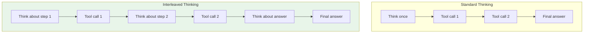

# Extended thinking (Anthropic)

## Introduction

Anthropic's Claude models support **extended thinking** — a mode where the model generates internal reasoning (thinking blocks) before responding. For tool use, extended thinking significantly improves the model's ability to select the right tools, extract parameters, and plan multi-step workflows. However, it comes with specific constraints around `tool_choice`, thinking block preservation, and budget management that differ substantially from OpenAI and Gemini.

This lesson covers how to enable and configure extended thinking for tool use with Claude, including the critical limitations you must know to avoid API errors.

### What we'll cover

- Enabling extended thinking with tool use
- The `budget_tokens` parameter and adaptive thinking
- The `tool_choice` limitation (only `auto` or `none`)
- Preserving thinking blocks across turns
- Interleaved thinking for Claude 4 models
- Redacted and summarized thinking blocks

### Prerequisites

- Anthropic API basics ([Lesson 02: Defining Functions](../02-defining-functions/00-defining-functions.md))
- How thinking models differ ([Lesson 16.01](./01-how-thinking-models-differ.md))

---

## Enabling extended thinking

Extended thinking is enabled by adding the `thinking` parameter to your API request. When combined with tools, the model reasons about which tools to call and what parameters to use before making any function calls:

```python
import anthropic

client = anthropic.Anthropic()

response = client.messages.create(
    model="claude-sonnet-4-20250514",
    max_tokens=16000,
    thinking={
        "type": "enabled",
        "budget_tokens": 5000  # Max tokens for thinking
    },
    tools=[{
        "name": "get_stock_info",
        "description": "Get stock price and financial data",
        "input_schema": {
            "type": "object",
            "properties": {
                "ticker": {
                    "type": "string",
                    "description": "Stock ticker symbol"
                },
                "metrics": {
                    "type": "array",
                    "items": {"type": "string"},
                    "description": "Financial metrics to retrieve"
                }
            },
            "required": ["ticker"]
        }
    }],
    messages=[{
        "role": "user",
        "content": "How is NVIDIA doing financially?"
    }]
)

# Response contains thinking blocks + tool calls
for block in response.content:
    if block.type == "thinking":
        print(f"🧠 Thinking ({len(block.thinking)} chars):")
        print(f"   {block.thinking[:150]}...")
        print(f"   Signature: {block.signature[:30]}...")
    elif block.type == "tool_use":
        print(f"\n🔧 Tool call: {block.name}")
        print(f"   Input: {block.input}")
```

**Output:**
```
🧠 Thinking (342 chars):
   The user is asking about NVIDIA's financial performance. I should
   retrieve key financial metrics like price, P/E ratio, revenue
   growth, and market cap to give a comprehensive answer...
   Signature: zK4bV9xmPqR3nJ7wLs2...

🔧 Tool call: get_stock_info
   Input: {'ticker': 'NVDA', 'metrics': ['price', 'pe_ratio',
           'revenue_growth', 'market_cap']}
```

Notice how the thinking block includes a `signature` field. Like Gemini's thought signatures, this signature must be preserved when passing conversation history back to the API.

---

## Budget tokens and adaptive thinking

The `budget_tokens` parameter controls the maximum number of tokens the model can use for thinking. Different Claude models handle this differently:

### Claude Opus 4.6 — adaptive thinking (recommended)

Claude Opus 4.6 is the newest model and supports **adaptive thinking**, where the model automatically decides how much thinking is needed:

```python
# Opus 4.6 — use adaptive thinking (recommended)
response = client.messages.create(
    model="claude-opus-4-20250918",
    max_tokens=16000,
    thinking={
        "type": "enabled",
        "budget_tokens": 10000  # Deprecated on Opus 4.6 but accepted
    },
    tools=tools,
    messages=[{"role": "user", "content": user_query}]
)
```

> **Note:** On Claude Opus 4.6, `budget_tokens` is deprecated. The model adaptively allocates thinking budget based on task complexity. You can still pass the parameter (it's accepted but ignored), making migration from earlier models seamless.

### Claude 4 models — explicit budget

Earlier Claude 4 models (Sonnet 4, Opus 4, Opus 4.5) require an explicit `budget_tokens`:

```python
# Claude Sonnet 4 — explicit budget required
response = client.messages.create(
    model="claude-sonnet-4-20250514",
    max_tokens=16000,
    thinking={
        "type": "enabled",
        "budget_tokens": 5000  # Minimum 1024
    },
    tools=tools,
    messages=[{"role": "user", "content": user_query}]
)
```

### Budget guidelines for tool use

| Task Complexity | Suggested Budget | Example |
|----------------|:----------------:|---------|
| Simple, single tool | 1,024-2,000 | "What's the weather?" |
| Multi-tool, clear intent | 3,000-5,000 | "Get user profile and orders" |
| Ambiguous, multi-step | 5,000-10,000 | "Analyze this data and suggest improvements" |
| Complex planning | 10,000+ | "Research, compare, and recommend" |

> **Important:** `budget_tokens` must be less than `max_tokens`. The minimum is 1,024 tokens.

---

## The `tool_choice` limitation

This is the most important constraint for tool use with extended thinking. When thinking is enabled, `tool_choice` supports only two values:

| `tool_choice` Value | With Thinking | Without Thinking |
|:-------------------:|:-------------:|:----------------:|
| `auto` | ✅ Allowed | ✅ Allowed |
| `none` | ✅ Allowed | ✅ Allowed |
| `any` | ❌ **Error** | ✅ Allowed |
| `{"type": "tool", "name": "..."}` | ❌ **Error** | ✅ Allowed |

```python
# ✅ WORKS — tool_choice auto with thinking
response = client.messages.create(
    model="claude-sonnet-4-20250514",
    max_tokens=16000,
    thinking={"type": "enabled", "budget_tokens": 5000},
    tools=tools,
    tool_choice={"type": "auto"},  # ✅ OK
    messages=[{"role": "user", "content": "Check inventory"}]
)

# ❌ FAILS — tool_choice any with thinking
try:
    response = client.messages.create(
        model="claude-sonnet-4-20250514",
        max_tokens=16000,
        thinking={"type": "enabled", "budget_tokens": 5000},
        tools=tools,
        tool_choice={"type": "any"},  # ❌ Error!
        messages=[{"role": "user", "content": "Check inventory"}]
    )
except anthropic.BadRequestError as e:
    print(f"Error: {e}")
```

**Output:**
```
Error: tool_choice must be "auto" or "none" when thinking is enabled
```

### Workaround for forced tool use

If you need to force the model to use a specific tool, you have two options:

```python
# Option 1: Disable thinking for forced tool calls
response = client.messages.create(
    model="claude-sonnet-4-20250514",
    max_tokens=4096,
    # No thinking parameter
    tools=tools,
    tool_choice={"type": "tool", "name": "search_inventory"},
    messages=[{"role": "user", "content": "Check inventory"}]
)

# Option 2: Use strong prompting with thinking + auto
response = client.messages.create(
    model="claude-sonnet-4-20250514",
    max_tokens=16000,
    thinking={"type": "enabled", "budget_tokens": 3000},
    tools=tools,
    tool_choice={"type": "auto"},  # auto, but prompt guides it
    system="You MUST use the search_inventory tool for every "
           "inventory-related question. Do not respond without "
           "calling the tool first.",
    messages=[{"role": "user", "content": "Check inventory"}]
)
```

> **Tip:** Option 2 is usually sufficient. With extended thinking, the model is more likely to follow system prompt instructions about tool usage than a standard model.

---

## Preserving thinking blocks

When building multi-turn conversations with tool results, you must pass thinking blocks back unchanged. Each thinking block contains a `signature` that validates its authenticity:

```python
import anthropic
import json

client = anthropic.Anthropic()

tools = [
    {
        "name": "search_products",
        "description": "Search product catalog",
        "input_schema": {
            "type": "object",
            "properties": {
                "query": {"type": "string"},
                "category": {"type": "string"}
            },
            "required": ["query"]
        }
    },
    {
        "name": "get_reviews",
        "description": "Get product reviews",
        "input_schema": {
            "type": "object",
            "properties": {
                "product_id": {"type": "string"}
            },
            "required": ["product_id"]
        }
    }
]

# Step 1: Initial request
response = client.messages.create(
    model="claude-sonnet-4-20250514",
    max_tokens=16000,
    thinking={"type": "enabled", "budget_tokens": 5000},
    tools=tools,
    messages=[{
        "role": "user",
        "content": "Find the best-reviewed wireless mouse"
    }]
)

# Step 2: Build the assistant message with ALL content blocks
# CRITICAL: Include thinking blocks with their signatures
assistant_content = []
tool_use_blocks = []

for block in response.content:
    if block.type == "thinking":
        # Preserve thinking block with signature
        assistant_content.append({
            "type": "thinking",
            "thinking": block.thinking,
            "signature": block.signature  # Must be preserved!
        })
    elif block.type == "tool_use":
        assistant_content.append({
            "type": "tool_use",
            "id": block.id,
            "name": block.name,
            "input": block.input
        })
        tool_use_blocks.append(block)
    elif block.type == "text":
        assistant_content.append({
            "type": "text",
            "text": block.text
        })

# Step 3: Execute tools and build the tool result message
tool_results = []
for block in tool_use_blocks:
    result = execute_tool(block.name, block.input)
    tool_results.append({
        "type": "tool_result",
        "tool_use_id": block.id,
        "content": json.dumps(result)
    })

# Step 4: Continue conversation with preserved thinking
response_2 = client.messages.create(
    model="claude-sonnet-4-20250514",
    max_tokens=16000,
    thinking={"type": "enabled", "budget_tokens": 5000},
    tools=tools,
    messages=[
        {"role": "user", "content": "Find the best-reviewed wireless mouse"},
        {"role": "assistant", "content": assistant_content},  # With thinking!
        {"role": "user", "content": tool_results}
    ]
)
```

### What to preserve

| Content Block Type | Must Preserve? | Notes |
|-------------------|:--------------:|-------|
| `thinking` | ✅ Yes (last assistant turn) | Include `thinking` text + `signature` |
| `redacted_thinking` | ✅ Yes | Include `data` field (encrypted) |
| `tool_use` | ✅ Yes | Include `id`, `name`, `input` |
| `text` | ✅ Yes | Include `text` content |

> **Warning:** You only need to preserve thinking blocks for the **most recent** assistant turn. The API automatically strips thinking blocks from earlier turns (except in Claude Opus 4.5+ which preserves them by default).

---

## Interleaved thinking

Claude 4 models support **interleaved thinking** — the model can think between tool calls and tool results within a single turn, not just at the beginning. This is especially powerful for multi-step tool use:

```python
import anthropic

client = anthropic.Anthropic()

# Enable interleaved thinking with the beta header
response = client.messages.create(
    model="claude-sonnet-4-20250514",
    max_tokens=16000,
    thinking={"type": "enabled", "budget_tokens": 8000},
    tools=tools,
    messages=[{"role": "user", "content": user_query}],
    betas=["interleaved-thinking-2025-05-14"]  # Required header
)

# Response may contain interleaved thinking + tool calls:
# [thinking] → [tool_use] → [thinking] → [tool_use] → [thinking] → [text]
for block in response.content:
    if block.type == "thinking":
        print(f"🧠 Thinking: {block.thinking[:80]}...")
    elif block.type == "tool_use":
        print(f"🔧 Tool: {block.name}({block.input})")
    elif block.type == "text":
        print(f"💬 Text: {block.text[:80]}...")
```

**Output:**
```
🧠 Thinking: I need to find the customer first, then check their orders...
🔧 Tool: get_customer({"email": "alice@example.com"})
🧠 Thinking: Got the customer ID. Now I should check for pending orders...
🔧 Tool: search_orders({"customer_id": "C-100", "status": "pending"})
🧠 Thinking: Two pending orders found. Let me format a helpful response...
💬 Text: Alice, you have 2 pending orders...
```

### Interleaved thinking vs standard thinking



> **Note:** With interleaved thinking, `budget_tokens` can exceed `max_tokens`. The budget applies to the total thinking allocation across all interleaved thinking blocks.

---

## Redacted thinking blocks

In some cases, Claude may redact its thinking content for safety reasons. Redacted blocks appear as `redacted_thinking` type with encrypted `data` instead of plain text:

```python
for block in response.content:
    if block.type == "thinking":
        print(f"🧠 Thinking: {block.thinking[:50]}...")
    elif block.type == "redacted_thinking":
        print(f"🔒 Redacted thinking (encrypted data)")
        print(f"   Data length: {len(block.data)} chars")
    elif block.type == "tool_use":
        print(f"🔧 Tool: {block.name}")
```

**Output:**
```
🧠 Thinking: Let me analyze the customer's request...
🔒 Redacted thinking (encrypted data)
   Data length: 256 chars
🔧 Tool: process_refund
```

Redacted thinking blocks must be passed back in the conversation history, just like regular thinking blocks. The API decrypts them when needed:

```python
# When preserving redacted thinking blocks
assistant_content = []
for block in response.content:
    if block.type == "redacted_thinking":
        assistant_content.append({
            "type": "redacted_thinking",
            "data": block.data  # Pass encrypted data back unchanged
        })
    # ... handle other block types
```

---

## Summarized thinking

Claude 4 models provide **summarized thinking** by default — the `thinking` field contains a summary rather than the full chain of thought. This reduces token usage in the response while preserving reasoning quality:

```python
response = client.messages.create(
    model="claude-sonnet-4-20250514",
    max_tokens=16000,
    thinking={"type": "enabled", "budget_tokens": 10000},
    tools=tools,
    messages=[{"role": "user", "content": complex_query}]
)

for block in response.content:
    if block.type == "thinking":
        print(f"Thinking summary ({len(block.thinking)} chars)")
        # The full thinking may have been 5000+ tokens,
        # but the summary is much shorter
```

> **Important:** You are charged for the **full thinking tokens**, not just the summary. The summary is a convenience for logging and debugging, but billing reflects the actual compute used.

---

## Supported models

| Model | Thinking Support | Interleaved | Budget | Notes |
|-------|:----------------:|:-----------:|:------:|-------|
| Claude Opus 4.6 | ✅ Adaptive | ✅ | Deprecated (adaptive) | Latest, recommended |
| Claude Opus 4.5 | ✅ | ✅ | Required (min 1024) | Preserves thinking blocks |
| Claude Opus 4 | ✅ | ✅ | Required (min 1024) | Summarized thinking |
| Claude Sonnet 4.5 | ✅ | ✅ | Required (min 1024) | Good balance |
| Claude Sonnet 4 | ✅ | ✅ | Required (min 1024) | Cost-effective |
| Claude Haiku 4.5 | ✅ | ❌ | Required (min 1024) | Fastest, cheapest |

---

## Best practices

| Practice | Why it matters |
|----------|---------------|
| Use `tool_choice: auto` with thinking (never `any` or forced) | `any` and forced tool cause API errors with thinking enabled |
| Preserve thinking blocks including `signature` for the last assistant turn | Required for conversation continuity |
| Start with `budget_tokens: 5000` for typical tool use | Good balance of quality and cost for most scenarios |
| Use Opus 4.6 adaptive thinking when possible | Automatically allocates optimal thinking budget |
| Enable interleaved thinking for multi-step tool use | Allows reasoning between each tool call |
| Log thinking summaries during development | Invaluable for debugging tool selection issues |

---

## Common pitfalls

| ❌ Mistake | ✅ Solution |
|-----------|------------|
| Using `tool_choice: any` with thinking enabled | Switch to `tool_choice: auto` and use strong system prompts to guide tool selection |
| Setting `budget_tokens` below 1024 | Minimum is 1024 — use at least 3000 for tool use scenarios |
| Omitting the `signature` field when passing thinking blocks back | Always include `signature` — the API validates it |
| Toggling thinking on/off mid-conversation | Keep thinking enabled consistently within a tool use loop (a tool calling loop is a single turn) |
| Ignoring redacted thinking blocks | Pass them back as `redacted_thinking` with the encrypted `data` field |
| Assuming summarized thinking = less compute cost | You're charged for full thinking tokens, not the summary |

---

## Hands-on exercise

### Your task

Build a multi-turn tool calling application with Claude that uses extended thinking and handles all block types correctly.

### Requirements

1. Define 3+ tools for a data analysis assistant
2. Enable extended thinking with a 5,000 token budget
3. Implement a tool calling loop that preserves thinking blocks
4. Log all content block types (thinking, tool_use, text)
5. Handle `stop_reason == "tool_use"` to continue the loop

### Expected result

A working multi-turn conversation where thinking blocks are properly preserved, and the assistant uses reasoning to plan and execute a multi-step data analysis.

<details>
<summary>💡 Hints (click to expand)</summary>

- Use `response.stop_reason == "tool_use"` to detect when tool calls are needed
- The assistant message must contain ALL content blocks — thinking, text, and tool_use
- Tool results go in a `user` role message with `tool_result` content blocks
- Use `tool_use_id` from the `tool_use` block to match results to calls
- For Sonnet 4, set `budget_tokens: 5000` and `max_tokens: 16000`

</details>

<details>
<summary>✅ Solution (click to expand)</summary>

```python
import anthropic
import json

client = anthropic.Anthropic()

tools = [
    {
        "name": "query_database",
        "description": "Run a SQL query on the analytics database",
        "input_schema": {
            "type": "object",
            "properties": {
                "sql": {
                    "type": "string",
                    "description": "SQL query to execute"
                },
                "database": {
                    "type": "string",
                    "enum": ["sales", "users", "products"]
                }
            },
            "required": ["sql", "database"]
        }
    },
    {
        "name": "create_chart",
        "description": "Create a chart from data",
        "input_schema": {
            "type": "object",
            "properties": {
                "chart_type": {
                    "type": "string",
                    "enum": ["bar", "line", "pie", "scatter"]
                },
                "data": {
                    "type": "object",
                    "description": "Chart data with labels and values"
                },
                "title": {"type": "string"}
            },
            "required": ["chart_type", "data", "title"]
        }
    },
    {
        "name": "send_report",
        "description": "Email a report to stakeholders",
        "input_schema": {
            "type": "object",
            "properties": {
                "recipients": {
                    "type": "array",
                    "items": {"type": "string"}
                },
                "subject": {"type": "string"},
                "body": {"type": "string"}
            },
            "required": ["recipients", "subject", "body"]
        }
    }
]


def mock_tool(name: str, input_data: dict) -> dict:
    """Simulate tool execution."""
    if name == "query_database":
        return {"rows": [
            {"month": "Jan", "revenue": 50000},
            {"month": "Feb", "revenue": 62000},
            {"month": "Mar", "revenue": 71000}
        ], "row_count": 3}
    elif name == "create_chart":
        return {"chart_url": "https://charts.example.com/abc123",
                "format": "png"}
    elif name == "send_report":
        return {"sent": True,
                "recipients_count": len(input_data["recipients"])}
    return {}


def run_tool_loop(user_query: str):
    """Run a complete tool calling loop with thinking."""
    messages = [{"role": "user", "content": user_query}]

    while True:
        response = client.messages.create(
            model="claude-sonnet-4-20250514",
            max_tokens=16000,
            thinking={
                "type": "enabled",
                "budget_tokens": 5000
            },
            tools=tools,
            messages=messages
        )

        # Log all content blocks
        print(f"\n--- Response (stop_reason: {response.stop_reason}) ---")
        for block in response.content:
            if block.type == "thinking":
                preview = block.thinking[:100].replace("\n", " ")
                print(f"  🧠 Thinking: {preview}...")
            elif block.type == "redacted_thinking":
                print(f"  🔒 Redacted thinking")
            elif block.type == "tool_use":
                print(f"  🔧 Tool: {block.name}({json.dumps(block.input)[:80]})")
            elif block.type == "text":
                print(f"  💬 Text: {block.text[:100]}...")

        # Check if we're done
        if response.stop_reason != "tool_use":
            print(f"\n✅ Final answer: {response.content[-1].text}")
            return response

        # Build assistant message preserving ALL blocks
        assistant_content = []
        tool_blocks = []
        for block in response.content:
            if block.type == "thinking":
                assistant_content.append({
                    "type": "thinking",
                    "thinking": block.thinking,
                    "signature": block.signature
                })
            elif block.type == "redacted_thinking":
                assistant_content.append({
                    "type": "redacted_thinking",
                    "data": block.data
                })
            elif block.type == "tool_use":
                assistant_content.append({
                    "type": "tool_use",
                    "id": block.id,
                    "name": block.name,
                    "input": block.input
                })
                tool_blocks.append(block)
            elif block.type == "text":
                assistant_content.append({
                    "type": "text",
                    "text": block.text
                })

        messages.append({
            "role": "assistant",
            "content": assistant_content
        })

        # Execute tools and add results
        tool_results = []
        for block in tool_blocks:
            result = mock_tool(block.name, block.input)
            print(f"  📤 Result for {block.name}: "
                  f"{json.dumps(result)[:80]}")
            tool_results.append({
                "type": "tool_result",
                "tool_use_id": block.id,
                "content": json.dumps(result)
            })

        messages.append({
            "role": "user",
            "content": tool_results
        })


# Run the analysis
run_tool_loop(
    "Analyze Q1 revenue trends from the sales database, "
    "create a line chart, and email the report to "
    "team@company.com with a summary."
)
```

</details>

### Bonus challenges

- [ ] Enable interleaved thinking with the `interleaved-thinking-2025-05-14` beta header
- [ ] Compare results with and without thinking for the same query
- [ ] Implement adaptive thinking budget — start low, increase on retry if the model's tool selection is poor
- [ ] Handle the case where thinking is redacted and log it differently

---

## Summary

✅ Extended thinking is enabled with `thinking: {"type": "enabled", "budget_tokens": N}` — minimum 1,024 tokens, or use adaptive thinking on Opus 4.6

✅ **`tool_choice` is limited** to `auto` or `none` with thinking — using `any` or forced tool causes a `400` error

✅ **Preserve thinking blocks** (including `signature`) for the last assistant turn when building multi-turn conversations

✅ **Interleaved thinking** (Claude 4, beta header) allows reasoning between each tool call — superior for complex multi-step workflows

✅ **Summarized thinking** reduces visible token count but you're still **charged for full thinking tokens**

**Previous:** [Thought Signatures (Gemini)](./04-thought-signatures-gemini.md) | **Next:** [Best Practices for Thinking Models →](./06-best-practices-thinking-models.md)

---

## Further reading

- [Anthropic Extended Thinking](https://docs.anthropic.com/en/docs/build-with-claude/extended-thinking) — Official documentation
- [Anthropic Tool Use Overview](https://docs.anthropic.com/en/docs/build-with-claude/tool-use/overview) — Tool use basics
- [Anthropic API Reference](https://docs.anthropic.com/en/api/messages) — Messages API reference

*[Back to Thinking Models & Tool Use overview](./00-thinking-models-tool-use.md)*

<!-- 
Sources Consulted:
- Anthropic Extended Thinking: https://platform.claude.com/docs/en/docs/build-with-claude/extended-thinking
- Anthropic Tool Use Overview: https://platform.claude.com/docs/en/docs/build-with-claude/tool-use/overview
- Anthropic API Reference: https://docs.anthropic.com/en/api/messages
-->
