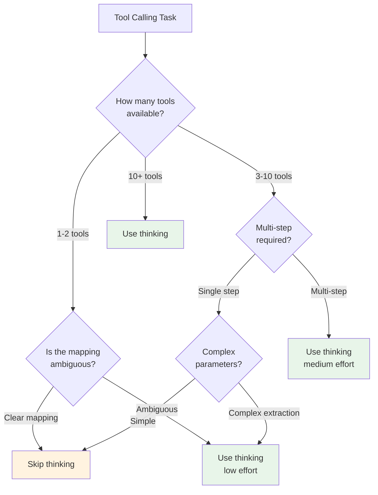

# Best practices for thinking models with tool use

## Introduction

Each provider implements thinking models differently — OpenAI uses reasoning items and effort levels, Gemini uses thought signatures, and Anthropic uses thinking blocks with budget tokens. Despite these implementation differences, the core patterns for getting the best results from thinking models with tool use are remarkably consistent across providers.

This lesson brings together everything we've learned into a practical cross-provider guide. We cover when to use thinking, how to manage costs, prompt design differences, debugging strategies, and a provider comparison cheat sheet.

### What we'll cover

- When to enable thinking for tool use
- Cross-provider comparison cheat sheet
- Cost management strategies
- Prompt design for thinking models
- Debugging with reasoning output
- Temperature and sampling constraints

### Prerequisites

- OpenAI reasoning models ([Lesson 16.02](./02-openai-reasoning-models.md))
- Reasoning items ([Lesson 16.03](./03-reasoning-items-openai.md))
- Thought signatures ([Lesson 16.04](./04-thought-signatures-gemini.md))
- Extended thinking ([Lesson 16.05](./05-extended-thinking-anthropic.md))

---

## When to enable thinking

Not every tool calling task benefits from thinking. The added latency and cost are worth it only when the task requires real reasoning. Here's a decision framework:



### Task complexity guide

| Task Type | Thinking Needed? | Effort Level | Example |
|-----------|:----------------:|:------------:|---------|
| Direct mapping (1 tool, clear input) | ❌ No | — | "Get weather in Paris" → `get_weather("Paris")` |
| Ambiguous input, few tools | ✅ Low | Low / 1024 tokens | "Check on John's stuff" → which John? which data? |
| Multiple independent tools | ✅ Medium | Medium / 3000 tokens | "Get profile AND orders for C-100" |
| Sequential multi-step workflow | ✅ Medium | Medium / 5000 tokens | "Find cheapest, check stock, add to cart" |
| Complex planning with dependencies | ✅ High | High / 8000+ tokens | "Analyze data, choose best visualization, generate report" |
| Large tool set (10+) with selection needed | ✅ High | High / 10000+ tokens | Agent with 20 tools, ambiguous query |

---

## Cross-provider comparison

This cheat sheet captures the key differences and equivalences across all three providers:

### Configuration

| Feature | OpenAI | Gemini | Anthropic |
|---------|--------|--------|-----------|
| **Enable thinking** | `reasoning={"effort": "medium"}` | Always-on (Gemini 3 Pro) or `thinking_config` | `thinking={"type": "enabled", "budget_tokens": 5000}` |
| **Effort control** | `reasoning.effort`: `low` / `medium` / `high` | `thinkingLevel`: `minimal` / `low` / `medium` / `high` (Gemini 3) | `budget_tokens`: 1024–100000+ |
| **View reasoning** | `reasoning.summary`: `auto` / `detailed` | `include_thoughts: True` | Thinking block text (summarized in Claude 4) |
| **Disable thinking** | `reasoning.effort: "none"` (if supported) or use GPT-4.1 | `thinkingBudget: 0` (Gemini 2.5) or `thinkingLevel: "minimal"` | Omit `thinking` parameter |

### State preservation for tool use

| Feature | OpenAI | Gemini | Anthropic |
|---------|--------|--------|-----------|
| **What to preserve** | Reasoning items (all output items) | Thought signatures (on content parts) | Thinking blocks (with `signature`) |
| **Automatic mode** | `previous_response_id` | SDK `chat` feature | N/A (manual always) |
| **Manual mode** | Include all items in `input` array | Preserve parts with `thoughtSignature` | Include thinking blocks in `assistant` content |
| **Validation** | Recommended (no error if omitted) | **Mandatory** for Gemini 3 FC (400 error) | Signature validated on last assistant turn |
| **Encrypted/ZDR** | `reasoning.encrypted_content` in `include` | N/A | Redacted thinking blocks (automatic) |

### Tool use constraints

| Constraint | OpenAI | Gemini | Anthropic |
|------------|--------|--------|-----------|
| **tool_choice** | All options supported | All options supported | ⚠️ Only `auto` or `none` with thinking |
| **Parallel calls** | ✅ Supported | ✅ Supported (signature on first FC) | ✅ Supported |
| **Streaming** | ✅ Supported | ✅ Supported | ✅ Supported (thinking_delta events) |
| **Temperature** | Fixed at 1 for reasoning models | Configurable | ⚠️ No `temperature` / `top_k` with thinking |

---

## Cost management strategies

Thinking tokens are billed as output tokens across all providers, making them significantly more expensive than input tokens. Here are cross-provider strategies for managing costs:

### Strategy 1: tiered model selection

```python
# OpenAI: Choose model tier by task complexity
def select_openai_model(complexity: str) -> tuple[str, str]:
    """Returns (model, effort)."""
    if complexity == "simple":
        return "gpt-4.1-nano", "none"     # No reasoning needed
    elif complexity == "moderate":
        return "gpt-5-nano", "low"         # Cheap reasoning
    elif complexity == "complex":
        return "gpt-5-mini", "medium"      # Balanced
    else:
        return "gpt-5", "high"             # Full reasoning


# Gemini: Match thinkingLevel to task
def select_gemini_config(complexity: str) -> dict:
    if complexity == "simple":
        return {"thinkingLevel": "minimal"}
    elif complexity == "moderate":
        return {"thinkingLevel": "low"}
    else:
        return {"thinkingLevel": "high"}


# Anthropic: Scale budget_tokens
def select_anthropic_budget(complexity: str) -> int:
    budgets = {
        "simple": 1024,
        "moderate": 3000,
        "complex": 8000,
        "very_complex": 15000
    }
    return budgets.get(complexity, 5000)
```

### Strategy 2: monitor and alert on reasoning costs

```python
def log_reasoning_cost(provider: str, response) -> dict:
    """Extract and log reasoning token usage across providers."""
    if provider == "openai":
        usage = response.usage
        reasoning = usage.output_tokens_details.reasoning_tokens
        total_output = usage.output_tokens
    elif provider == "gemini":
        metadata = response.usage_metadata
        reasoning = getattr(metadata, "thoughts_token_count", 0)
        total_output = metadata.candidates_token_count
    elif provider == "anthropic":
        usage = response.usage
        # Claude reports cache_creation + cache_read for thinking
        reasoning = getattr(usage, "thinking_tokens", 0)
        total_output = usage.output_tokens

    ratio = reasoning / total_output if total_output > 0 else 0

    stats = {
        "provider": provider,
        "reasoning_tokens": reasoning,
        "total_output_tokens": total_output,
        "reasoning_ratio": f"{ratio:.0%}",
    }

    # Alert if reasoning > 80% of output
    if ratio > 0.8:
        print(f"⚠️ High reasoning ratio ({ratio:.0%}) — "
              f"consider lowering effort/budget")

    return stats
```

### Strategy 3: cache tool definitions

All three providers charge for tool definitions as input tokens on every request. Keep tool lists lean:

```python
# ❌ Sending all 20 tools on every request
response = client.responses.create(
    model="gpt-5",
    tools=all_twenty_tools,  # Wasteful for simple queries
    input="What's the weather?"
)

# ✅ Pre-filter tools based on query category
relevant_tools = select_tools_for_category(
    query=user_query,
    all_tools=all_twenty_tools,
    max_tools=5
)

response = client.responses.create(
    model="gpt-5",
    tools=relevant_tools,  # Only 3-5 relevant tools
    input=user_query
)
```

---

## Prompt design for thinking models

Thinking models behave differently than standard models. The key insight: **treat them like a senior colleague**, not a junior one. Give high-level goals, not step-by-step instructions:

### Standard model prompting vs thinking model prompting

```python
# ❌ Over-specified prompt (wastes thinking on following instructions)
system_over_specified = """
When the user asks about a customer:
1. First call get_customer with the customer ID
2. Then call get_orders with the customer ID
3. Filter orders by status
4. Format the response as a bulleted list
5. Include the total order count
"""

# ✅ Goal-oriented prompt (lets thinking model plan its own approach)
system_goal_oriented = """
You are a customer support assistant with access to customer
and order data. Provide comprehensive, accurate answers about
customer accounts and order status. Prioritize the most relevant
information for each query.
"""
```

### Why goal-oriented prompts work better

```mermaid
flowchart LR
    subgraph Over-Specified
        A1[Model reads<br/>detailed steps] --> B1[Thinking:<br/>"Follow steps<br/>1, 2, 3..."]
        B1 --> C1[Rigid execution<br/>even when<br/>suboptimal]
    end

    subgraph Goal-Oriented
        A2[Model reads<br/>high-level goal] --> B2[Thinking:<br/>"What does the<br/>user really need?"]
        B2 --> C2[Adaptive plan<br/>based on<br/>actual query]
    end

    style Goal-Oriented fill:#e8f5e9
```

### Provider-specific prompt tips

| Provider | Tip | Example |
|----------|-----|---------|
| OpenAI | Use `developer` role for system instructions | `{"role": "developer", "content": "..."}` |
| Gemini | Provide tool usage examples in system instruction | "Example: for weather queries, call get_weather" |
| Anthropic | Use system prompts to guide tool selection (since `tool_choice` is limited) | "Always check inventory before recommending" |

---

## Debugging with reasoning output

All three providers offer ways to see the model's reasoning. Use these during development to diagnose tool selection issues:

### Cross-provider debugging setup

```python
# OpenAI — request reasoning summary
response = client.responses.create(
    model="gpt-5",
    reasoning={"effort": "medium", "summary": "auto"},
    tools=tools,
    input=user_query
)
for item in response.output:
    if item.type == "reasoning":
        for s in item.summary:
            print(f"[OpenAI reasoning] {s.text}")


# Gemini — enable thought inclusion
response = client.models.generate_content(
    model="gemini-3-flash",
    contents=user_query,
    config={
        "tools": [tools_config],
        "thinking_config": {"include_thoughts": True}
    }
)
for part in response.candidates[0].content.parts:
    if part.thought:
        print(f"[Gemini thought] {part.text}")


# Anthropic — thinking blocks are always included
response = client.messages.create(
    model="claude-sonnet-4-20250514",
    max_tokens=16000,
    thinking={"type": "enabled", "budget_tokens": 5000},
    tools=tools,
    messages=[{"role": "user", "content": user_query}]
)
for block in response.content:
    if block.type == "thinking":
        print(f"[Claude thinking] {block.thinking}")
```

### Common issues and reasoning clues

| Symptom | What to look for in reasoning | Fix |
|---------|------------------------------|-----|
| Wrong tool selected | "I see tools X and Y, choosing X because..." | Improve tool descriptions to be more distinct |
| Missing parameters | "The user didn't specify..." | Add parameter examples in tool descriptions |
| Unnecessary tool call | "Let me call this just in case..." | Tighten tool descriptions; reduce effort level |
| Repeated same call | "I need to check again..." | Ensure reasoning items/signatures are passed back |
| No tool call when expected | "I can answer this without tools..." | Use system prompt to enforce tool usage |

---

## Temperature and sampling constraints

Thinking models have strict constraints on sampling parameters:

| Parameter | OpenAI | Gemini | Anthropic |
|-----------|:------:|:------:|:---------:|
| `temperature` | Fixed at 1 (ignored if set) | Configurable | ❌ Not allowed with thinking |
| `top_p` | Supported (1 default) | Supported | Only 0.95–1.0 with thinking |
| `top_k` | N/A | Supported | ❌ Not allowed with thinking |

```python
# Anthropic — these will error with thinking enabled
try:
    response = client.messages.create(
        model="claude-sonnet-4-20250514",
        max_tokens=16000,
        thinking={"type": "enabled", "budget_tokens": 5000},
        temperature=0.5,  # ❌ Not allowed
        tools=tools,
        messages=[{"role": "user", "content": query}]
    )
except anthropic.BadRequestError as e:
    print(f"Error: {e}")
    # Fix: Remove temperature parameter when using thinking
```

> **Note:** The temperature constraint exists because thinking models use their internal reasoning to regulate output quality. External temperature control would conflict with the model's internal reasoning process.

---

## Best practices

| Practice | Why it matters |
|----------|---------------|
| Match thinking effort to task complexity | Prevents overspending on simple tasks and underperforming on complex ones |
| Use goal-oriented prompts, not step-by-step instructions | Thinking models plan better when given freedom |
| Monitor reasoning token usage per request | Reasoning tokens are typically 60-90% of output — track them |
| Pre-filter tools to reduce context size | Fewer tools = less input cost and better tool selection |
| Always preserve reasoning state (items/signatures/blocks) | Required for multi-turn quality; mandatory for Gemini 3 |
| Use provider-appropriate debugging during development | Reasoning summaries/thoughts/blocks reveal selection logic |
| Disable reasoning visibility in production | Saves tokens when you don't need debugging info |
| Respect sampling constraints per provider | Temperature and top_k cause errors on some providers |

---

## Common pitfalls

| ❌ Mistake | ✅ Solution |
|-----------|------------|
| Using thinking for every tool call regardless of complexity | Apply the decision framework — skip thinking for simple, direct tool calls |
| Writing detailed step-by-step system prompts | Give high-level goals and let the thinking model plan |
| Sending all tools to every request | Pre-filter to 3-5 relevant tools per query |
| Not comparing costs with and without thinking | Benchmark both to ensure thinking is worth the added cost |
| Ignoring provider-specific constraints (tool_choice, temperature) | Test each provider independently; Claude has the strictest constraints |
| Using reasoning summaries/thoughts in production responses | They're for debugging — disable or hide in production |

---

## Hands-on exercise

### Your task

Build a provider-agnostic tool calling wrapper that handles thinking across OpenAI, Gemini, and Anthropic with a unified interface.

### Requirements

1. Create a `ThinkingToolCaller` class that accepts a provider name
2. Implement `call_with_thinking(query, tools, effort)` that maps effort to provider-specific parameters
3. Implement `get_reasoning_output()` that returns the reasoning text regardless of provider
4. Log token usage in a consistent format across providers
5. Handle provider-specific constraints automatically (e.g., no temperature on Claude)

### Expected result

A single interface that works identically across providers, with automatic constraint handling and consistent logging.

<details>
<summary>💡 Hints (click to expand)</summary>

- Map effort levels: "low"/"medium"/"high" → provider-specific values
- OpenAI: effort → `reasoning.effort`
- Gemini: effort → `thinkingLevel` or `thinkingBudget`
- Anthropic: effort → `budget_tokens` (1024/5000/10000)
- Wrap provider-specific exceptions in a common error type
- Use a dataclass for the unified response format

</details>

<details>
<summary>✅ Solution (click to expand)</summary>

```python
from dataclasses import dataclass
from typing import Optional
import json


@dataclass
class ThinkingResponse:
    """Unified response across providers."""
    provider: str
    tool_calls: list[dict]
    reasoning_text: Optional[str]
    reasoning_tokens: int
    total_output_tokens: int
    text: Optional[str]
    raw_response: object


class ThinkingToolCaller:
    """Provider-agnostic thinking tool caller."""

    EFFORT_MAP = {
        "openai": {
            "low": {"effort": "low"},
            "medium": {"effort": "medium"},
            "high": {"effort": "high"}
        },
        "gemini": {
            "low": {"thinkingLevel": "low"},
            "medium": {"thinkingLevel": "medium"},
            "high": {"thinkingLevel": "high"}
        },
        "anthropic": {
            "low": 1024,
            "medium": 5000,
            "high": 10000
        }
    }

    def __init__(self, provider: str):
        self.provider = provider
        if provider == "openai":
            from openai import OpenAI
            self.client = OpenAI()
        elif provider == "gemini":
            from google import genai
            self.client = genai.Client()
        elif provider == "anthropic":
            import anthropic
            self.client = anthropic.Anthropic()

    def call_with_thinking(
        self,
        query: str,
        tools: list[dict],
        effort: str = "medium"
    ) -> ThinkingResponse:
        """Make a thinking tool call with unified interface."""
        if self.provider == "openai":
            return self._call_openai(query, tools, effort)
        elif self.provider == "gemini":
            return self._call_gemini(query, tools, effort)
        elif self.provider == "anthropic":
            return self._call_anthropic(query, tools, effort)

    def _call_openai(self, query, tools, effort):
        config = self.EFFORT_MAP["openai"][effort]
        response = self.client.responses.create(
            model="gpt-5",
            reasoning={**config, "summary": "auto"},
            tools=[{"type": "function", **t} for t in tools],
            input=query,
            max_output_tokens=25000
        )

        tool_calls = []
        reasoning_text = None
        for item in response.output:
            if item.type == "reasoning" and item.summary:
                reasoning_text = " ".join(
                    s.text for s in item.summary
                )
            elif item.type == "function_call":
                tool_calls.append({
                    "name": item.name,
                    "arguments": json.loads(item.arguments)
                })

        return ThinkingResponse(
            provider="openai",
            tool_calls=tool_calls,
            reasoning_text=reasoning_text,
            reasoning_tokens=(
                response.usage.output_tokens_details
                .reasoning_tokens
            ),
            total_output_tokens=response.usage.output_tokens,
            text=response.output_text or None,
            raw_response=response
        )

    def _call_gemini(self, query, tools, effort):
        config = self.EFFORT_MAP["gemini"][effort]
        tools_config = {
            "function_declarations": [
                {
                    "name": t["name"],
                    "description": t["description"],
                    "parameters": t["parameters"]
                }
                for t in tools
            ]
        }

        response = self.client.models.generate_content(
            model="gemini-3-flash",
            contents=query,
            config={
                "tools": [tools_config],
                "thinking_config": {
                    "include_thoughts": True,
                    **config
                }
            }
        )

        tool_calls = []
        reasoning_text = None
        for part in response.candidates[0].content.parts:
            if part.thought and part.text:
                reasoning_text = part.text
            elif part.function_call:
                tool_calls.append({
                    "name": part.function_call.name,
                    "arguments": dict(part.function_call.args)
                })

        metadata = response.usage_metadata
        return ThinkingResponse(
            provider="gemini",
            tool_calls=tool_calls,
            reasoning_text=reasoning_text,
            reasoning_tokens=getattr(
                metadata, "thoughts_token_count", 0
            ),
            total_output_tokens=(
                metadata.candidates_token_count
            ),
            text=None,
            raw_response=response
        )

    def _call_anthropic(self, query, tools, effort):
        budget = self.EFFORT_MAP["anthropic"][effort]
        anthropic_tools = [
            {
                "name": t["name"],
                "description": t["description"],
                "input_schema": t["parameters"]
            }
            for t in tools
        ]

        # No temperature with thinking
        response = self.client.messages.create(
            model="claude-sonnet-4-20250514",
            max_tokens=16000,
            thinking={
                "type": "enabled",
                "budget_tokens": budget
            },
            tools=anthropic_tools,
            tool_choice={"type": "auto"},  # Only auto/none
            messages=[{
                "role": "user", "content": query
            }]
        )

        tool_calls = []
        reasoning_text = None
        text = None
        for block in response.content:
            if block.type == "thinking":
                reasoning_text = block.thinking
            elif block.type == "tool_use":
                tool_calls.append({
                    "name": block.name,
                    "arguments": block.input
                })
            elif block.type == "text":
                text = block.text

        return ThinkingResponse(
            provider="anthropic",
            tool_calls=tool_calls,
            reasoning_text=reasoning_text,
            reasoning_tokens=0,  # Estimate from budget
            total_output_tokens=response.usage.output_tokens,
            text=text,
            raw_response=response
        )


# Usage — same interface for all providers
tools = [{
    "name": "search_products",
    "description": "Search product catalog",
    "parameters": {
        "type": "object",
        "properties": {
            "query": {"type": "string"},
            "max_price": {"type": "number"}
        },
        "required": ["query"]
    }
}]

for provider in ["openai", "gemini", "anthropic"]:
    caller = ThinkingToolCaller(provider)
    result = caller.call_with_thinking(
        query="Find wireless headphones under $100",
        tools=tools,
        effort="medium"
    )

    print(f"\n{'='*40}")
    print(f"Provider: {result.provider}")
    print(f"Tool calls: {result.tool_calls}")
    print(f"Reasoning: {result.reasoning_text[:80]}..."
          if result.reasoning_text else "Reasoning: N/A")
    print(f"Reasoning tokens: {result.reasoning_tokens}")
    print(f"Total output tokens: {result.total_output_tokens}")
```

</details>

### Bonus challenges

- [ ] Add automatic retry with increased effort if no tool is called
- [ ] Implement multi-turn support with proper state preservation per provider
- [ ] Add cost estimation using current pricing for each provider
- [ ] Build a benchmark that runs the same 10 queries across all providers and compares tool selection accuracy

---

## Summary

✅ **Enable thinking selectively** — use the decision framework to determine when reasoning adds value vs unnecessary cost

✅ **Preserve reasoning state** differently per provider: OpenAI reasoning items (recommended), Gemini thought signatures (mandatory), Anthropic thinking blocks (required for last turn)

✅ **Use goal-oriented prompts** instead of step-by-step instructions — thinking models plan better with high-level guidance

✅ **Monitor reasoning costs** — reasoning tokens are typically 60-90% of output tokens across all providers

✅ **Respect provider constraints**: Anthropic limits `tool_choice` to `auto`/`none` and forbids `temperature` with thinking; OpenAI fixes temperature at 1; Gemini requires thought signatures for function calling

**Previous:** [Extended Thinking (Anthropic)](./05-extended-thinking-anthropic.md) | **Next:** [Lesson 17: Multimodal Tool Use →](../17-multimodal-tool-use/00-multimodal-tool-use.md)

---

## Further reading

- [OpenAI Reasoning Best Practices](https://platform.openai.com/docs/guides/reasoning-best-practices) — Prompting tips for reasoning models
- [Gemini Thinking Guide](https://ai.google.dev/gemini-api/docs/thinking) — Thinking configuration and best practices
- [Anthropic Extended Thinking](https://docs.anthropic.com/en/docs/build-with-claude/extended-thinking) — Extended thinking documentation
- [Anthropic Tool Use Pricing](https://docs.anthropic.com/en/docs/build-with-claude/tool-use/overview#pricing) — Tool use token costs

*[Back to Thinking Models & Tool Use overview](./00-thinking-models-tool-use.md)*

<!-- 
Sources Consulted:
- OpenAI Reasoning Guide: https://platform.openai.com/docs/guides/reasoning
- OpenAI Function Calling Guide: https://platform.openai.com/docs/guides/function-calling
- Gemini Thinking Guide: https://ai.google.dev/gemini-api/docs/thinking
- Gemini Thought Signatures: https://ai.google.dev/gemini-api/docs/thought-signatures
- Anthropic Extended Thinking: https://platform.claude.com/docs/en/docs/build-with-claude/extended-thinking
- Anthropic Tool Use Overview: https://platform.claude.com/docs/en/docs/build-with-claude/tool-use/overview
-->
