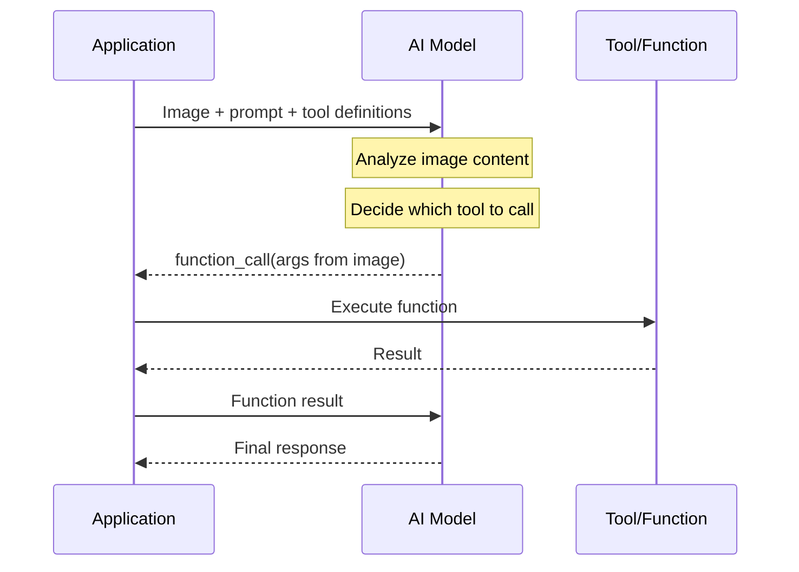

# Vision with function calling

## Introduction

Standard function calling works with text — the model reads a prompt, decides to call a tool, and processes the text result. But what happens when the model needs to *see* something before making a decision? Vision with function calling combines image understanding with tool definitions, letting the model analyze visual content and then invoke the right function based on what it sees.

This pattern unlocks use cases like automated receipt processing (analyze an image, then call an expense-tracking function), visual quality inspection (examine a product photo, then call a defect-reporting function), and document understanding (read a PDF, then call a data-extraction function).

### What we'll cover

- Combining image inputs with tool definitions
- The analyze-then-call pattern across providers
- Screenshot analysis with function calling
- Document understanding workflows
- Cross-provider implementation comparison

### Prerequisites

- Function calling fundamentals ([Lesson 03](../03-core-function-calling-flow/00-core-function-calling-flow.md))
- Vision API basics from [Unit 13](../../13-image-multimodal-ai/)
- Provider-specific function calling ([Lessons 07–09](../07-openai-function-calling/00-openai-function-calling.md))

---

## How vision + function calling works

The flow combines two capabilities that the model already supports independently — processing images and calling functions. When both are active in the same request, the model can use visual understanding to inform its tool selection and argument generation.



The key insight is that the model extracts structured data from visual content and passes it directly as function arguments — no separate OCR or image-processing step required.

---

## OpenAI: vision + tools

OpenAI's Responses API supports sending images alongside tool definitions using the `input_image` content type. The model can analyze images provided via URL, base64 encoding, or File ID.

### Basic pattern

```python
from openai import OpenAI

client = OpenAI()

# Define a tool for logging expenses
tools = [
    {
        "type": "function",
        "name": "log_expense",
        "description": "Log an expense from a receipt",
        "parameters": {
            "type": "object",
            "properties": {
                "vendor": {
                    "type": "string",
                    "description": "The store or vendor name"
                },
                "total": {
                    "type": "number",
                    "description": "Total amount in dollars"
                },
                "date": {
                    "type": "string",
                    "description": "Date on the receipt (YYYY-MM-DD)"
                },
                "items": {
                    "type": "array",
                    "items": {"type": "string"},
                    "description": "List of purchased items"
                }
            },
            "required": ["vendor", "total", "date"]
        }
    }
]

# Send image + tool definitions
response = client.responses.create(
    model="gpt-4.1",
    tools=tools,
    input=[
        {
            "role": "user",
            "content": [
                {
                    "type": "input_image",
                    "image_url": "https://example.com/receipt.jpg"
                },
                {
                    "type": "input_text",
                    "text": "Extract the expense details from this receipt and log it."
                }
            ]
        }
    ]
)

# The model analyzes the receipt image and calls log_expense
# with extracted vendor, total, date, and items
print(response.output)
```

**Expected behavior:**

The model examines the receipt image, extracts structured data (vendor name, total amount, date, line items), and calls `log_expense` with those values as arguments — all in a single turn.

### Image input methods

OpenAI supports three ways to provide images:

| Method | Format | Best For |
|--------|--------|----------|
| URL | `"image_url": "https://..."` | Publicly accessible images |
| Base64 | `"image_url": "data:image/png;base64,..."` | Local files, generated images |
| File ID | `"file_id": "file_abc123"` | Previously uploaded files |

### The detail parameter

OpenAI provides a `detail` parameter that controls how the model processes images, directly affecting token cost and accuracy:

```python
{
    "type": "input_image",
    "image_url": "https://example.com/chart.png",
    "detail": "high"  # "low", "high", or "auto"
}
```

| Detail Level | Resolution | Tokens | Use Case |
|-------------|-----------|--------|----------|
| `low` | 512×512 fixed | 85 tokens | Quick classification, simple scenes |
| `high` | Up to 2048px, tiled at 512px | Varies (hundreds) | OCR, detailed analysis, small text |
| `auto` | Model decides | Varies | General purpose (default) |

> **Tip:** For receipt and document processing where text accuracy matters, always use `detail: "high"`. For simple classification tasks (e.g., "Is this a photo of food?"), `detail: "low"` saves significant tokens.

---

## Anthropic: vision + tools

Anthropic's Messages API uses `image` content blocks alongside tool definitions. Claude supports base64 encoding, URL references, and the Files API for image input.

### Basic pattern

```python
import anthropic

client = anthropic.Anthropic()

# Define the same expense-logging tool
tools = [
    {
        "name": "log_expense",
        "description": "Log an expense from a receipt",
        "input_schema": {
            "type": "object",
            "properties": {
                "vendor": {
                    "type": "string",
                    "description": "The store or vendor name"
                },
                "total": {
                    "type": "number",
                    "description": "Total amount in dollars"
                },
                "date": {
                    "type": "string",
                    "description": "Date on the receipt (YYYY-MM-DD)"
                },
                "items": {
                    "type": "array",
                    "items": {"type": "string"},
                    "description": "List of purchased items"
                }
            },
            "required": ["vendor", "total", "date"]
        }
    }
]

response = client.messages.create(
    model="claude-sonnet-4-5-20250514",
    max_tokens=1024,
    tools=tools,
    messages=[
        {
            "role": "user",
            "content": [
                {
                    "type": "image",
                    "source": {
                        "type": "url",
                        "url": "https://example.com/receipt.jpg"
                    }
                },
                {
                    "type": "text",
                    "text": "Extract the expense details from this receipt and log it."
                }
            ]
        }
    ]
)

# Check for tool_use in the response
for block in response.content:
    if block.type == "tool_use":
        print(f"Tool: {block.name}")
        print(f"Args: {block.input}")
```

**Expected behavior:**

Claude analyzes the receipt, extracts structured data, and returns a `tool_use` content block with `log_expense` and the extracted arguments.

### Image input methods

| Method | Source Type | Example |
|--------|-----------|---------|
| Base64 | `"type": "base64"` | `"media_type": "image/jpeg", "data": "<base64>"` |
| URL | `"type": "url"` | `"url": "https://example.com/photo.jpg"` |
| Files API | `"type": "file"` | `"file_id": "file_abc123"` |

> **Note:** Claude works best when images come *before* text in the content array. This image-then-text ordering produces more accurate results.

---

## Google Gemini: vision + tools

Gemini handles multimodal input by including image parts directly in the content alongside function declarations.

### Basic pattern

```python
from google import genai
from google.genai import types
import base64

client = genai.Client()

# Define the expense-logging tool
log_expense_func = types.FunctionDeclaration(
    name="log_expense",
    description="Log an expense from a receipt",
    parameters=types.Schema(
        type="OBJECT",
        properties={
            "vendor": types.Schema(
                type="STRING",
                description="The store or vendor name"
            ),
            "total": types.Schema(
                type="NUMBER",
                description="Total amount in dollars"
            ),
            "date": types.Schema(
                type="STRING",
                description="Date on the receipt (YYYY-MM-DD)"
            ),
            "items": types.Schema(
                type="ARRAY",
                items=types.Schema(type="STRING"),
                description="List of purchased items"
            )
        },
        required=["vendor", "total", "date"]
    )
)

# Read image as base64
with open("receipt.jpg", "rb") as f:
    image_data = f.read()

response = client.models.generate_content(
    model="gemini-2.5-flash",
    contents=[
        types.Content(
            role="user",
            parts=[
                types.Part.from_bytes(
                    data=image_data,
                    mime_type="image/jpeg"
                ),
                types.Part(text="Extract the expense details from this receipt and log it.")
            ]
        )
    ],
    config=types.GenerateContentConfig(
        tools=[types.Tool(function_declarations=[log_expense_func])]
    )
)

# Check for function calls
for part in response.candidates[0].content.parts:
    if part.function_call:
        print(f"Function: {part.function_call.name}")
        print(f"Args: {part.function_call.args}")
```

**Expected behavior:**

Gemini processes the receipt image alongside the function declaration, extracts structured data, and returns a `function_call` part with the tool name and arguments.

---

## The analyze-then-call pattern

The most common multimodal tool use pattern follows a predictable flow: the model first analyzes visual content, then decides which tool to call and with what arguments. We call this the **analyze-then-call** pattern.

### Multiple tools with visual routing

When you provide several tools, the model uses image content to decide which tool is most appropriate:

```python
# OpenAI example with multiple tools
tools = [
    {
        "type": "function",
        "name": "log_expense",
        "description": "Log a business expense from a receipt",
        "parameters": {
            "type": "object",
            "properties": {
                "vendor": {"type": "string"},
                "total": {"type": "number"},
                "category": {
                    "type": "string",
                    "enum": ["meals", "travel", "supplies", "equipment"]
                }
            },
            "required": ["vendor", "total", "category"]
        }
    },
    {
        "type": "function",
        "name": "scan_business_card",
        "description": "Extract contact info from a business card",
        "parameters": {
            "type": "object",
            "properties": {
                "name": {"type": "string"},
                "email": {"type": "string"},
                "phone": {"type": "string"},
                "company": {"type": "string"}
            },
            "required": ["name"]
        }
    },
    {
        "type": "function",
        "name": "analyze_chart",
        "description": "Extract data points from a chart or graph",
        "parameters": {
            "type": "object",
            "properties": {
                "chart_type": {
                    "type": "string",
                    "enum": ["bar", "line", "pie", "scatter"]
                },
                "title": {"type": "string"},
                "data_points": {
                    "type": "array",
                    "items": {
                        "type": "object",
                        "properties": {
                            "label": {"type": "string"},
                            "value": {"type": "number"}
                        }
                    }
                }
            },
            "required": ["chart_type"]
        }
    }
]

# The model routes to the correct tool based on image content
response = client.responses.create(
    model="gpt-4.1",
    tools=tools,
    input=[
        {
            "role": "user",
            "content": [
                {
                    "type": "input_image",
                    "image_url": "https://example.com/some-document.jpg"
                },
                {
                    "type": "input_text",
                    "text": "Process this image and extract the relevant data."
                }
            ]
        }
    ]
)
```

**How it works:**

- If the image shows a receipt → the model calls `log_expense`
- If the image shows a business card → the model calls `scan_business_card`
- If the image shows a chart → the model calls `analyze_chart`

The model performs visual classification and data extraction in a single step.

---

## Screenshot analysis with function calling

A powerful application of vision + tools is analyzing application screenshots to trigger actions. This bridges the gap between visual UI state and programmatic responses.

```python
# Anthropic example: screenshot-based support agent
tools = [
    {
        "name": "file_bug_report",
        "description": "File a bug report based on a screenshot showing an error",
        "input_schema": {
            "type": "object",
            "properties": {
                "error_type": {
                    "type": "string",
                    "enum": ["ui_glitch", "crash", "data_error", "performance"]
                },
                "description": {"type": "string"},
                "severity": {
                    "type": "string",
                    "enum": ["low", "medium", "high", "critical"]
                },
                "affected_component": {"type": "string"}
            },
            "required": ["error_type", "description", "severity"]
        }
    },
    {
        "name": "suggest_fix",
        "description": "Suggest a resolution for a visible UI issue",
        "input_schema": {
            "type": "object",
            "properties": {
                "issue": {"type": "string"},
                "suggested_action": {"type": "string"},
                "requires_restart": {"type": "boolean"}
            },
            "required": ["issue", "suggested_action"]
        }
    }
]

response = client.messages.create(
    model="claude-sonnet-4-5-20250514",
    max_tokens=1024,
    tools=tools,
    messages=[
        {
            "role": "user",
            "content": [
                {
                    "type": "image",
                    "source": {
                        "type": "base64",
                        "media_type": "image/png",
                        "data": screenshot_base64
                    }
                },
                {
                    "type": "text",
                    "text": "A user submitted this screenshot showing a problem in our app. Analyze it and take appropriate action."
                }
            ]
        }
    ]
)
```

**Expected behavior:**

Claude examines the screenshot, identifies the error type and severity, and calls either `file_bug_report` (for new issues) or `suggest_fix` (for known patterns) with details extracted from the visual content.

---

## Document understanding workflows

Vision with function calling extends naturally to document processing. Models can analyze photos of documents, PDF renderings, or scanned forms and extract structured data via tools.

```python
# Gemini example: invoice processing
process_invoice = types.FunctionDeclaration(
    name="process_invoice",
    description="Process an invoice and create a payment record",
    parameters=types.Schema(
        type="OBJECT",
        properties={
            "invoice_number": types.Schema(type="STRING"),
            "vendor_name": types.Schema(type="STRING"),
            "amount_due": types.Schema(type="NUMBER"),
            "due_date": types.Schema(type="STRING"),
            "line_items": types.Schema(
                type="ARRAY",
                items=types.Schema(
                    type="OBJECT",
                    properties={
                        "description": types.Schema(type="STRING"),
                        "quantity": types.Schema(type="INTEGER"),
                        "unit_price": types.Schema(type="NUMBER")
                    }
                )
            )
        },
        required=["invoice_number", "vendor_name", "amount_due"]
    )
)

# Send a photo of an invoice
with open("invoice_scan.png", "rb") as f:
    invoice_bytes = f.read()

response = client.models.generate_content(
    model="gemini-2.5-flash",
    contents=[
        types.Content(
            role="user",
            parts=[
                types.Part.from_bytes(
                    data=invoice_bytes,
                    mime_type="image/png"
                ),
                types.Part(text="Process this invoice and create a payment record.")
            ]
        )
    ],
    config=types.GenerateContentConfig(
        tools=[types.Tool(function_declarations=[process_invoice])]
    )
)
```

> **🤖 AI Context:** Document understanding with tool use eliminates the traditional pipeline of OCR → text parsing → entity extraction → API call. The model handles all of these steps internally, producing structured function arguments directly from visual input.

---

## Best practices

| Practice | Why It Matters |
|----------|---------------|
| Place images before text in content arrays | Models process content sequentially; image-first gives better context for tool selection |
| Use `detail: "high"` (OpenAI) for text-heavy images | Low detail mode may miss small text on receipts and documents |
| Provide specific tool descriptions | "Extract data from a receipt" is better than "process image" for routing accuracy |
| Include enum constraints in tool parameters | Restricts extracted values to valid categories, reducing hallucination |
| Test with edge cases (blurry, rotated, partial) | Models may struggle with low-quality images; know your failure modes |

---

## Common pitfalls

| ❌ Mistake | ✅ Solution |
|-----------|------------|
| Sending very large images without resizing | Resize to provider limits before sending (saves tokens and latency) |
| Using `detail: "low"` for OCR tasks | Use `detail: "high"` when text extraction accuracy matters |
| Not handling the case where no tool is called | The model may respond with text instead of a tool call if the image is unclear |
| Assuming the model will always extract data correctly | Always validate extracted values — especially numbers and dates |
| Mixing vision and tool-use in unsupported models | Not all models support both; verify model capabilities (e.g., GPT-4.1, Claude Sonnet 4.5, Gemini 2.5) |

---

## Hands-on exercise

### Your task

Build a multi-tool visual assistant that accepts an image and automatically routes to the correct processing function.

### Requirements

1. Define at least 3 tools: `log_expense` (receipts), `extract_contact` (business cards), and `describe_scene` (general photos)
2. Send an image to the model with all three tools available
3. Handle the function call response — print the tool name and extracted arguments
4. Add a fallback for when no tool is called (the model responds with text)

### Expected result

When you send a receipt image, the assistant calls `log_expense` with extracted vendor, total, and date. When you send a business card, it calls `extract_contact` with name, email, and phone.

<details>
<summary>💡 Hints (click to expand)</summary>

- Use any provider's SDK (OpenAI, Anthropic, or Gemini)
- For testing without real images, use a publicly available sample image URL
- Check `response.output` (OpenAI), `response.content` (Anthropic), or `response.candidates[0].content.parts` (Gemini) for tool calls
- Use `json.loads()` on function call arguments if they come as strings

</details>

<details>
<summary>✅ Solution (click to expand)</summary>

```python
import json
from openai import OpenAI

client = OpenAI()

tools = [
    {
        "type": "function",
        "name": "log_expense",
        "description": "Log a business expense from a receipt image",
        "parameters": {
            "type": "object",
            "properties": {
                "vendor": {"type": "string", "description": "Store or vendor name"},
                "total": {"type": "number", "description": "Total amount in dollars"},
                "date": {"type": "string", "description": "Receipt date (YYYY-MM-DD)"},
                "category": {
                    "type": "string",
                    "enum": ["meals", "travel", "supplies", "equipment", "other"]
                }
            },
            "required": ["vendor", "total"]
        }
    },
    {
        "type": "function",
        "name": "extract_contact",
        "description": "Extract contact information from a business card image",
        "parameters": {
            "type": "object",
            "properties": {
                "name": {"type": "string"},
                "email": {"type": "string"},
                "phone": {"type": "string"},
                "company": {"type": "string"},
                "title": {"type": "string"}
            },
            "required": ["name"]
        }
    },
    {
        "type": "function",
        "name": "describe_scene",
        "description": "Describe the contents of a general photograph",
        "parameters": {
            "type": "object",
            "properties": {
                "description": {"type": "string"},
                "objects": {
                    "type": "array",
                    "items": {"type": "string"}
                },
                "setting": {
                    "type": "string",
                    "enum": ["indoor", "outdoor", "studio", "unknown"]
                }
            },
            "required": ["description"]
        }
    }
]

def process_image(image_url: str) -> None:
    """Send an image to the model and handle the tool call response."""
    response = client.responses.create(
        model="gpt-4.1",
        tools=tools,
        input=[
            {
                "role": "user",
                "content": [
                    {
                        "type": "input_image",
                        "image_url": image_url,
                        "detail": "high"
                    },
                    {
                        "type": "input_text",
                        "text": "Analyze this image and process it with the appropriate tool."
                    }
                ]
            }
        ]
    )

    # Handle response
    for item in response.output:
        if item.type == "function_call":
            print(f"Tool called: {item.name}")
            args = json.loads(item.arguments)
            print(f"Arguments: {json.dumps(args, indent=2)}")
        elif item.type == "message":
            # Fallback: model responded with text
            print(f"Text response: {item.content[0].text}")

# Test with different image types
process_image("https://example.com/receipt.jpg")
process_image("https://example.com/business-card.png")
```

**Output (example):**
```
Tool called: log_expense
Arguments: {
  "vendor": "Whole Foods Market",
  "total": 47.83,
  "date": "2025-01-15",
  "category": "meals"
}
```
</details>

### Bonus challenges

- [ ] Implement the same solution with a second provider (Anthropic or Gemini)
- [ ] Add a multi-image flow where the model processes 2+ images and calls different tools for each
- [ ] Add error handling for unsupported image formats

---

## Summary

✅ Vision + function calling lets models analyze images and call tools in a single request — no separate OCR pipeline needed

✅ All three providers (OpenAI, Anthropic, Gemini) support sending images alongside tool definitions, with slightly different content block formats

✅ The analyze-then-call pattern enables visual routing — the model examines an image and selects the appropriate tool automatically

✅ OpenAI's `detail` parameter controls the quality/cost tradeoff for image analysis; always use `"high"` for text-heavy documents

✅ Image placement matters — put images before text in content arrays for best results (especially with Anthropic)

---

**Previous:** [Multimodal Tool Use Overview](./00-multimodal-tool-use.md) | **Next:** [Multimodal Function Responses →](./02-multimodal-function-responses.md)

---

*[← Back to Multimodal Tool Use Overview](./00-multimodal-tool-use.md)*

---

## Further reading

- [OpenAI Vision Guide](https://platform.openai.com/docs/guides/vision) — Image input methods and detail parameter
- [Anthropic Vision Guide](https://platform.claude.com/docs/en/docs/build-with-claude/vision) — Image content blocks and best practices
- [Gemini Function Calling](https://ai.google.dev/gemini-api/docs/function-calling) — Multimodal inputs with function declarations
- [OpenAI Function Calling Guide](https://platform.openai.com/docs/guides/function-calling) — Tools configuration and usage

<!--
Sources Consulted:
- OpenAI Vision: https://platform.openai.com/docs/guides/vision
- Anthropic Vision: https://platform.claude.com/docs/en/docs/build-with-claude/vision
- Gemini Function Calling: https://ai.google.dev/gemini-api/docs/function-calling
- OpenAI Tools: https://platform.openai.com/docs/guides/tools
-->
