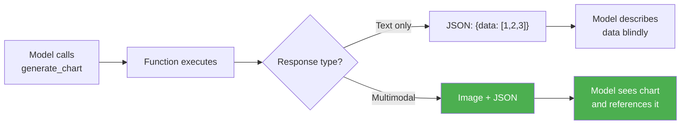

# Multimodal function responses

## Introduction

Standard function calling is a one-way visual street: you can send images *to* the model alongside tool definitions, but the functions themselves return only text (JSON). What if a function needs to return an image, a chart, or a PDF document back to the model for further analysis?

Google's Gemini 3 introduced **multimodal function responses** — the ability for functions to return images, documents, and other media types directly in the `functionResponse` part. The model can then reference and reason about this visual content in its final answer. This is a significant leap beyond text-only tool outputs.

### What we'll cover

- Why multimodal function responses matter
- Gemini 3's `FunctionResponsePart` with `inline_data`
- The `FunctionResponseBlob` structure (mime_type, display_name, data)
- Using `displayName` and `$ref` in structured responses
- Supported MIME types for function responses
- Cross-provider comparison

### Prerequisites

- Function calling fundamentals ([Lesson 03](../03-core-function-calling-flow/00-core-function-calling-flow.md))
- Vision with function calling ([Sub-lesson 01](./01-vision-with-function-calling.md))
- Gemini function calling ([Lesson 09](../09-gemini-function-calling/00-gemini-function-calling.md))

---

## Why multimodal responses matter

Consider a function that generates a chart from sales data. In traditional function calling, the function would return a text description or raw data points. The model would then try to describe the chart without ever seeing it. With multimodal function responses, the function returns the actual chart image — the model can see it, describe specific visual elements, and reference it naturally in its answer.



### Real-world use cases

| Use Case | Function Returns | Model Then... |
|----------|-----------------|---------------|
| Chart generation | Chart image + data summary | Describes trends and anomalies it can *see* |
| Map lookup | Map screenshot + coordinates | Provides visual directions with landmarks |
| Document retrieval | PDF page render | Summarizes specific visible content |
| Product search | Product photos + metadata | Describes visual appearance and comparisons |
| Medical imaging | Annotated scan + findings | Discusses visible features in context |

---

## Gemini 3: `FunctionResponsePart` with `inline_data`

Gemini 3 (Pro and Flash) introduced the ability to include binary data — images and documents — in function responses. This uses the `FunctionResponsePart` structure with an `inline_data` field containing a `FunctionResponseBlob`.

> **Important:** Multimodal function responses are a Gemini 3 feature. Earlier Gemini models (2.5, 2.0) support only text/JSON function responses.

### The `FunctionResponseBlob` structure

```python
types.FunctionResponseBlob(
    mime_type="image/png",       # MIME type of the binary data
    display_name="sales_chart",  # Name for referencing in model output
    data=image_bytes             # Raw bytes of the image/document
)
```

| Field | Type | Description |
|-------|------|-------------|
| `mime_type` | string | MIME type (e.g., `image/png`, `application/pdf`) |
| `display_name` | string | Unique name the model uses to reference this content |
| `data` | bytes | Raw binary content of the image or document |

### Basic example: returning an image from a function

```python
from google import genai
from google.genai import types
import io
import matplotlib.pyplot as plt

client = genai.Client()

# Step 1: Define a function that generates charts
generate_chart_func = types.FunctionDeclaration(
    name="generate_sales_chart",
    description="Generate a bar chart of sales data for the specified quarter",
    parameters=types.Schema(
        type="OBJECT",
        properties={
            "quarter": types.Schema(
                type="STRING",
                description="Quarter to chart (e.g., 'Q1 2025')"
            ),
            "metric": types.Schema(
                type="STRING",
                enum=["revenue", "units", "customers"],
                description="Which metric to chart"
            )
        },
        required=["quarter", "metric"]
    )
)

# Step 2: Send initial request — model decides to call the function
response = client.models.generate_content(
    model="gemini-3-flash-preview",
    contents=[
        types.Content(
            role="user",
            parts=[types.Part(text="Show me a chart of Q1 2025 revenue by region.")]
        )
    ],
    config=types.GenerateContentConfig(
        tools=[types.Tool(function_declarations=[generate_chart_func])]
    )
)

# Step 3: Extract the function call
function_call = response.candidates[0].content.parts[0].function_call
print(f"Model wants to call: {function_call.name}")
print(f"With args: {function_call.args}")
```

**Output:**
```
Model wants to call: generate_sales_chart
With args: {'quarter': 'Q1 2025', 'metric': 'revenue'}
```

### Step 4: Execute the function and return the image

```python
# Simulate generating a chart
def generate_sales_chart(quarter: str, metric: str) -> tuple[bytes, dict]:
    """Generate a chart and return image bytes + data summary."""
    # Sample data
    regions = ["North", "South", "East", "West"]
    values = [45000, 32000, 58000, 41000]
    
    fig, ax = plt.subplots(figsize=(8, 5))
    ax.bar(regions, values, color=["#4285F4", "#EA4335", "#FBBC04", "#34A853"])
    ax.set_title(f"{metric.title()} by Region — {quarter}")
    ax.set_ylabel(f"{metric.title()} ($)")
    
    # Save to bytes
    buf = io.BytesIO()
    fig.savefig(buf, format="png", dpi=100, bbox_inches="tight")
    plt.close(fig)
    buf.seek(0)
    
    return buf.read(), {
        "total": sum(values),
        "highest_region": regions[values.index(max(values))],
        "lowest_region": regions[values.index(min(values))]
    }

# Execute the function
chart_bytes, summary = generate_sales_chart(
    function_call.args["quarter"],
    function_call.args["metric"]
)

# Step 5: Return the multimodal function response
follow_up = client.models.generate_content(
    model="gemini-3-flash-preview",
    contents=[
        # Original user message
        types.Content(
            role="user",
            parts=[types.Part(text="Show me a chart of Q1 2025 revenue by region.")]
        ),
        # Model's function call
        response.candidates[0].content,
        # Function response with image
        types.Content(
            role="user",
            parts=[
                types.Part(
                    function_response=types.FunctionResponse(
                        name="generate_sales_chart",
                        response=summary,  # Text/JSON part
                        parts=[
                            types.FunctionResponsePart(
                                inline_data=types.FunctionResponseBlob(
                                    mime_type="image/png",
                                    display_name="sales_chart",
                                    data=chart_bytes
                                )
                            )
                        ]
                    )
                )
            ]
        )
    ],
    config=types.GenerateContentConfig(
        tools=[types.Tool(function_declarations=[generate_chart_func])]
    )
)

print(follow_up.text)
```

**Output:**
```
Here's the Q1 2025 revenue chart by region. The East region leads with $58,000 
in revenue, while the South region had the lowest at $32,000. Total revenue 
across all regions was $176,000. The chart shows a clear opportunity to focus 
growth efforts in the South and West regions.
```

The model *sees* the chart it references and can describe specific visual elements like bar heights, colors, and relative comparisons.

---

## The `displayName` and `$ref` mechanism

When a multimodal function response includes a `display_name`, the model can reference that content in structured output using the `$ref` syntax. This is particularly useful when combining structured responses with visual content.

### How `$ref` works

```python
# The function response includes an image with displayName
types.FunctionResponseBlob(
    mime_type="image/png",
    display_name="product_photo",  # ← This name is used for $ref
    data=image_bytes
)

# In the model's structured response, it can reference the image:
# {"image": {"$ref": "product_photo"}}
```

### Rules for `displayName` references

| Rule | Details |
|------|---------|
| Uniqueness | Each `display_name` must be unique within the function response |
| Single reference | Each `displayName` can only be referenced once via `$ref` in the structured response |
| Case sensitivity | `display_name` is case-sensitive |
| Format | Use descriptive, snake_case names (e.g., `sales_chart`, `product_photo_front`) |

### Example: structured response with image references

```python
# Define a tool that returns product information with images
search_product = types.FunctionDeclaration(
    name="search_product",
    description="Search for a product and return details with photos",
    parameters=types.Schema(
        type="OBJECT",
        properties={
            "query": types.Schema(type="STRING", description="Product search query")
        },
        required=["query"]
    )
)

# When returning the function response, include multiple images
function_response = types.FunctionResponse(
    name="search_product",
    response={
        "product_name": "Wireless Noise-Cancelling Headphones",
        "price": 249.99,
        "rating": 4.7
    },
    parts=[
        types.FunctionResponsePart(
            inline_data=types.FunctionResponseBlob(
                mime_type="image/jpeg",
                display_name="product_front",
                data=front_image_bytes
            )
        ),
        types.FunctionResponsePart(
            inline_data=types.FunctionResponseBlob(
                mime_type="image/jpeg",
                display_name="product_side",
                data=side_image_bytes
            )
        )
    ]
)
```

The model can then describe both images and reference them by their display names in its response.

---

## Returning documents in function responses

Beyond images, Gemini 3 supports returning document formats like PDFs and plain text files in function responses.

```python
# Example: function that retrieves a PDF report
def get_quarterly_report(quarter: str) -> bytes:
    """Fetch a PDF report for the given quarter."""
    with open(f"reports/{quarter}_report.pdf", "rb") as f:
        return f.read()

# Return the PDF in the function response
report_bytes = get_quarterly_report("Q1_2025")

function_response = types.FunctionResponse(
    name="get_report",
    response={"quarter": "Q1 2025", "pages": 12},
    parts=[
        types.FunctionResponsePart(
            inline_data=types.FunctionResponseBlob(
                mime_type="application/pdf",
                display_name="quarterly_report",
                data=report_bytes
            )
        )
    ]
)
```

The model can then read and summarize the PDF content, answer questions about specific sections, or reference particular pages — all from the binary document returned by the function.

---

## Cross-provider comparison

As of 2025, multimodal function responses are primarily a Gemini 3 feature. Here's how the providers compare:

| Feature | Gemini 3 | OpenAI | Anthropic |
|---------|----------|--------|-----------|
| Text/JSON function responses | ✅ | ✅ | ✅ |
| Image in function response | ✅ (`inline_data`) | ❌ | ❌ |
| Document in function response | ✅ (PDF, text) | ❌ | ❌ |
| `displayName` references | ✅ (`$ref`) | — | — |
| Max inline data size | Provider-defined | — | — |

### Workarounds for OpenAI and Anthropic

Since OpenAI and Anthropic don't support returning images in function responses, you can use these alternatives:

```python
# OpenAI workaround: return a URL or base64 in the function output,
# then include it as an image in a follow-up user message

# Step 1: Function returns image URL in text response
function_result = json.dumps({
    "chart_url": "https://your-server.com/charts/abc123.png",
    "summary": "Chart generated successfully"
})

# Step 2: In a follow-up turn, include the image directly
follow_up_response = client.responses.create(
    model="gpt-4.1",
    input=[
        # ... previous conversation history ...
        {
            "role": "user",
            "content": [
                {
                    "type": "input_image",
                    "image_url": "https://your-server.com/charts/abc123.png"
                },
                {
                    "type": "input_text",
                    "text": "Here's the chart that was generated. Please describe it."
                }
            ]
        }
    ]
)
```

> **Note:** This workaround requires an extra API turn and the image must be hosted at a publicly accessible URL (or encoded as base64). Gemini 3's native `inline_data` approach is more efficient.

---

## Best practices

| Practice | Why It Matters |
|----------|---------------|
| Use descriptive `display_name` values | Helps the model reference the right content; `"q1_revenue_chart"` is better than `"image1"` |
| Keep inline data under size limits | Large images increase latency; resize before encoding in the response |
| Include text summaries alongside images | Give the model both visual and textual context for richer responses |
| Use unique `display_name` for each blob | Duplicate names cause ambiguous `$ref` references |
| Prefer Gemini 3 for image-heavy workflows | Only Gemini 3 supports true multimodal function responses natively |

---

## Common pitfalls

| ❌ Mistake | ✅ Solution |
|-----------|------------|
| Trying multimodal responses with Gemini 2.5 | Only Gemini 3 Pro/Flash support `inline_data` in function responses |
| Referencing a `displayName` more than once | Each `$ref` can only reference a `displayName` once — plan accordingly |
| Returning huge images (10MB+) in responses | Resize images before including them; aim for reasonable file sizes |
| Forgetting the `mime_type` field | Always specify the correct MIME type for the binary data |
| Not providing a text `response` alongside `parts` | Include a JSON summary in `response` so the model has both text and visual context |

---

## Hands-on exercise

### Your task

Build a weather dashboard function that returns a weather map image alongside structured data using Gemini 3's multimodal function responses.

### Requirements

1. Define a `get_weather_map` function declaration with parameters for `location` and `map_type` (temperature, precipitation, wind)
2. Simulate the function execution by generating a simple matplotlib chart (or use a placeholder image)
3. Return the image via `FunctionResponseBlob` with an appropriate `display_name`
4. Send the multimodal function response to Gemini 3 and print the model's description of the weather data

### Expected result

The model should describe both the numerical data and visual elements of the weather map, referencing the chart by its display name.

<details>
<summary>💡 Hints (click to expand)</summary>

- Use `matplotlib` to generate a simple heatmap or contour plot as the "weather map"
- Set `mime_type` to `"image/png"` for matplotlib output
- Include summary statistics (high, low, average) in the `response` dict alongside the image in `parts`
- Use `display_name="weather_map"` so the model can reference it

</details>

<details>
<summary>✅ Solution (click to expand)</summary>

```python
from google import genai
from google.genai import types
import numpy as np
import matplotlib.pyplot as plt
import io

client = genai.Client()

# Define the function
get_weather_map = types.FunctionDeclaration(
    name="get_weather_map",
    description="Get a weather map showing temperature, precipitation, or wind data",
    parameters=types.Schema(
        type="OBJECT",
        properties={
            "location": types.Schema(type="STRING", description="City or region"),
            "map_type": types.Schema(
                type="STRING",
                enum=["temperature", "precipitation", "wind"],
                description="Type of weather map"
            )
        },
        required=["location", "map_type"]
    )
)

def generate_weather_map(location: str, map_type: str) -> tuple[bytes, dict]:
    """Generate a simulated weather map."""
    # Create a simple heatmap
    np.random.seed(42)
    data = np.random.randn(10, 10) * 5 + 20  # Temps around 20°C
    
    fig, ax = plt.subplots(figsize=(8, 6))
    im = ax.imshow(data, cmap="RdYlBu_r", interpolation="bilinear")
    ax.set_title(f"{map_type.title()} Map — {location}")
    fig.colorbar(im, ax=ax, label="°C" if map_type == "temperature" else "")
    ax.set_xlabel("Longitude")
    ax.set_ylabel("Latitude")
    
    buf = io.BytesIO()
    fig.savefig(buf, format="png", dpi=100, bbox_inches="tight")
    plt.close(fig)
    buf.seek(0)
    
    summary = {
        "location": location,
        "map_type": map_type,
        "high": round(data.max(), 1),
        "low": round(data.min(), 1),
        "average": round(data.mean(), 1)
    }
    return buf.read(), summary

# Simulate the full flow
# 1. Model calls get_weather_map (we skip the first API call for brevity)
map_bytes, summary = generate_weather_map("San Francisco Bay Area", "temperature")

# 2. Send multimodal function response
response = client.models.generate_content(
    model="gemini-3-flash-preview",
    contents=[
        types.Content(role="user", parts=[
            types.Part(text="Show me a temperature map for San Francisco.")
        ]),
        # Simulated model function call (in practice, this comes from step 1)
        types.Content(role="model", parts=[
            types.Part(function_call=types.FunctionCall(
                name="get_weather_map",
                args={"location": "San Francisco Bay Area", "map_type": "temperature"}
            ))
        ]),
        # Multimodal function response
        types.Content(role="user", parts=[
            types.Part(
                function_response=types.FunctionResponse(
                    name="get_weather_map",
                    response=summary,
                    parts=[
                        types.FunctionResponsePart(
                            inline_data=types.FunctionResponseBlob(
                                mime_type="image/png",
                                display_name="temperature_map",
                                data=map_bytes
                            )
                        )
                    ]
                )
            )
        ])
    ],
    config=types.GenerateContentConfig(
        tools=[types.Tool(function_declarations=[get_weather_map])]
    )
)

print(response.text)
```

**Output (example):**
```
Here's the temperature map for the San Francisco Bay Area. The map shows 
temperatures ranging from 11.5°C to 28.5°C, with an average of 20.1°C. The 
warmest areas appear in the southeast portion of the map (shown in red), while 
cooler areas are concentrated in the northwest (shown in blue).
```
</details>

### Bonus challenges

- [ ] Return multiple images (e.g., temperature *and* precipitation maps) with different `display_name` values
- [ ] Add a structured response schema that uses `$ref` to reference the weather map
- [ ] Implement the workaround pattern for OpenAI — generate the chart, host it, and pass the URL in a follow-up turn

---

## Summary

✅ Multimodal function responses let functions return images and documents — not just text — back to the model (Gemini 3 only)

✅ The `FunctionResponseBlob` structure uses `mime_type`, `display_name`, and `data` to package binary content in function responses

✅ Each `display_name` must be unique and can be referenced via `$ref` in structured model output

✅ Supported return types include `image/png`, `image/jpeg`, `image/webp`, `application/pdf`, and `text/plain`

✅ OpenAI and Anthropic don't yet support multimodal function responses natively — use URL-based or base64 workarounds instead

---

**Previous:** [Vision with Function Calling](./01-vision-with-function-calling.md) | **Next:** [Supported MIME Types and Limits →](./03-supported-mime-types.md)

---

*[← Back to Multimodal Tool Use Overview](./00-multimodal-tool-use.md)*

---

## Further reading

- [Gemini Function Calling — Multimodal Responses](https://ai.google.dev/gemini-api/docs/function-calling) — Official docs on `FunctionResponsePart` and `inline_data`
- [Gemini 3 Model Overview](https://ai.google.dev/gemini-api/docs/gemini-3) — Features and capabilities of Gemini 3 Pro and Flash
- [OpenAI Vision Guide](https://platform.openai.com/docs/guides/vision) — Image handling for workaround patterns

<!--
Sources Consulted:
- Gemini Function Calling (multimodal function responses section): https://ai.google.dev/gemini-api/docs/function-calling
- OpenAI Vision Guide: https://platform.openai.com/docs/guides/vision
- Anthropic Vision Guide: https://platform.claude.com/docs/en/docs/build-with-claude/vision
-->
