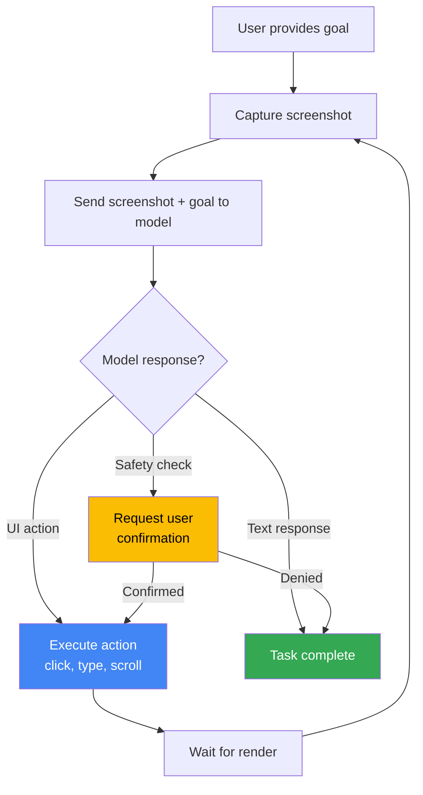

# Computer use capabilities

## Introduction

Computer use represents the most ambitious application of multimodal tool use — instead of analyzing a single image, the model continuously observes a screen, decides what to click or type, executes actions, and evaluates the results through screenshots. It combines vision, reasoning, and tool calling into a fully autonomous agent loop.

All three major providers now offer computer use capabilities: Anthropic pioneered the concept with their `computer_use` tool, OpenAI introduced the `computer-use-preview` model (CUA), and Google launched Computer Use with Gemini. Each takes a different architectural approach, but the core pattern is the same: screenshot → analyze → act → repeat.

### What we'll cover

- How computer use agent loops work
- Anthropic's computer use tool (`computer_20251124`)
- OpenAI's Computer-Using Agent (CUA) model
- Gemini's Computer Use with browser environments
- Supported UI actions across providers
- Safety checks and sandboxing requirements
- Cross-provider comparison

### Prerequisites

- Vision with function calling ([Sub-lesson 01](./01-vision-with-function-calling.md))
- Multi-turn tool use ([Lesson 05](../05-multi-turn-tool-use/00-multi-turn-tool-use.md))
- Basic understanding of browser automation concepts (Playwright, Selenium)

---

## How computer use works

Computer use follows an agent loop pattern. Unlike single-turn function calling where the model makes one tool call and stops, computer use involves many iterations — the model keeps interacting with the environment until the task is complete.



### The core loop

Every computer use implementation follows this pattern:

1. **Capture** — Take a screenshot of the current environment state
2. **Send** — Send the screenshot and task goal to the model
3. **Receive** — Get back a UI action (click, type, scroll) or a text response (task done)
4. **Execute** — Perform the action in the environment (via Playwright, pyautogui, etc.)
5. **Repeat** — Capture a new screenshot and loop back to step 2

The loop continues until the model determines the task is complete, an error occurs, or a safety check blocks further action.

---

## Anthropic: computer use tool

Anthropic pioneered computer use with Claude. Their implementation uses a special tool type (`computer_20251124`) that provides screenshot capture, mouse control, and keyboard input.

### Setup

```python
import anthropic

client = anthropic.Anthropic()

response = client.beta.messages.create(
    model="claude-sonnet-4-5-20250514",
    max_tokens=1024,
    tools=[
        {
            "type": "computer_20250124",  # Tool version for Claude 4 models
            "name": "computer",
            "display_width_px": 1024,
            "display_height_px": 768,
            "display_number": 1
        },
        {
            "type": "text_editor_20250728",
            "name": "str_replace_based_edit_tool"
        },
        {
            "type": "bash_20250124",
            "name": "bash"
        }
    ],
    messages=[
        {
            "role": "user",
            "content": "Open Firefox and search for 'best Python libraries 2025'."
        }
    ],
    betas=["computer-use-2025-01-24"]  # Beta header required
)
```

> **Note:** Computer use requires a beta header. Use `"computer-use-2025-11-24"` for Claude Opus 4.6/4.5, and `"computer-use-2025-01-24"` for other Claude 4 models and Claude Sonnet 3.7.

### Available actions

Anthropic's computer use tool supports a comprehensive set of UI interactions:

| Category | Actions |
|----------|---------|
| **Mouse** | `left_click`, `right_click`, `middle_click`, `double_click`, `triple_click` |
| **Mouse (advanced)** | `left_click_drag`, `left_mouse_down`, `left_mouse_up`, `mouse_move` |
| **Keyboard** | `type` (text), `key` (key combo like `"ctrl+s"`) |
| **Navigation** | `screenshot`, `scroll`, `wait`, `hold_key` |
| **Inspection** | `zoom` (Claude Opus 4.6/4.5 only — inspect a screen region at full resolution) |

### Agent loop implementation

```python
import anthropic
import base64

client = anthropic.Anthropic()

def computer_use_loop(
    task: str,
    model: str = "claude-sonnet-4-5-20250514",
    max_iterations: int = 10
):
    """Run a computer use agent loop."""
    
    tools = [
        {
            "type": "computer_20250124",
            "name": "computer",
            "display_width_px": 1024,
            "display_height_px": 768
        }
    ]
    
    messages = [{"role": "user", "content": task}]
    
    for i in range(max_iterations):
        print(f"\n--- Turn {i + 1} ---")
        
        response = client.beta.messages.create(
            model=model,
            max_tokens=4096,
            tools=tools,
            messages=messages,
            betas=["computer-use-2025-01-24"]
        )
        
        # Add model response to conversation
        messages.append({
            "role": "assistant",
            "content": response.content
        })
        
        # Check if model used any tools
        tool_results = []
        for block in response.content:
            if block.type == "tool_use":
                print(f"  Action: {block.input.get('action', 'unknown')}")
                
                # Execute the action in your environment
                # result = execute_action(block.name, block.input)
                result = {"result": "Action executed"}
                
                # Capture new screenshot
                # screenshot_bytes = capture_screenshot()
                screenshot_bytes = b"..."  # Placeholder
                
                tool_results.append({
                    "type": "tool_result",
                    "tool_use_id": block.id,
                    "content": [
                        {"type": "text", "text": str(result)},
                        {
                            "type": "image",
                            "source": {
                                "type": "base64",
                                "media_type": "image/png",
                                "data": base64.b64encode(
                                    screenshot_bytes
                                ).decode()
                            }
                        }
                    ]
                })
        
        if not tool_results:
            # No tools used — task is complete
            final_text = " ".join(
                b.text for b in response.content if hasattr(b, "text")
            )
            print(f"  Done: {final_text}")
            return messages
        
        # Add tool results and continue
        messages.append({"role": "user", "content": tool_results})
    
    print("Max iterations reached")
    return messages
```

### Coordinate handling

Anthropic uses actual pixel coordinates based on the `display_width_px` and `display_height_px` you specify. If your actual screen resolution differs, you must scale coordinates:

```python
import math

def get_scale_factor(screen_width: int, screen_height: int) -> float:
    """Calculate scale factor for API constraints."""
    long_edge = max(screen_width, screen_height)
    total_pixels = screen_width * screen_height
    
    long_edge_scale = 1568 / long_edge
    total_pixels_scale = math.sqrt(1_150_000 / total_pixels)
    
    return min(1.0, long_edge_scale, total_pixels_scale)

# Scale screenshot down for API
scale = get_scale_factor(1920, 1080)
api_width = int(1920 * scale)   # ~1366
api_height = int(1080 * scale)  # ~766

# Scale Claude's coordinates back up for execution
def execute_click(api_x: int, api_y: int) -> None:
    screen_x = int(api_x / scale)
    screen_y = int(api_y / scale)
    # perform_click(screen_x, screen_y)
```

---

## OpenAI: Computer-Using Agent (CUA)

OpenAI's approach uses a dedicated `computer-use-preview` model with a `computer_use_preview` tool type. It operates through the Responses API.

### Setup

```python
from openai import OpenAI

client = OpenAI()

response = client.responses.create(
    model="computer-use-preview",
    tools=[{
        "type": "computer_use_preview",
        "display_width": 1024,
        "display_height": 768,
        "environment": "browser"  # "browser", "mac", "windows", "ubuntu"
    }],
    input=[
        {
            "role": "user",
            "content": [
                {
                    "type": "input_text",
                    "text": "Go to bing.com and search for 'OpenAI news'."
                }
            ]
        }
    ],
    reasoning={"summary": "concise"},
    truncation="auto"  # Required for computer use
)
```

> **Important:** The `truncation` parameter must be set to `"auto"` for computer use, and you must use the dedicated `computer-use-preview` model.

### Available actions

| Action | Description | Parameters |
|--------|-------------|-----------|
| `click` | Click at coordinates | `x`, `y`, `button` (left/right) |
| `double_click` | Double-click at coordinates | `x`, `y` |
| `scroll` | Scroll at position | `x`, `y`, `scroll_x`, `scroll_y` |
| `keypress` | Press keyboard keys | `keys` (array of key names) |
| `type` | Type text | `text` |
| `wait` | Pause execution | — |
| `screenshot` | Request a screenshot | — |

### Agent loop implementation

```python
import time
import base64
from openai import OpenAI

client = OpenAI()

def cua_loop(page, initial_prompt: str, max_turns: int = 10):
    """Run an OpenAI CUA loop with a Playwright page."""
    
    # Initial request
    response = client.responses.create(
        model="computer-use-preview",
        tools=[{
            "type": "computer_use_preview",
            "display_width": 1024,
            "display_height": 768,
            "environment": "browser"
        }],
        input=[{
            "role": "user",
            "content": [{"type": "input_text", "text": initial_prompt}]
        }],
        reasoning={"summary": "concise"},
        truncation="auto"
    )
    
    for turn in range(max_turns):
        # Find computer_call items
        computer_calls = [
            item for item in response.output 
            if item.type == "computer_call"
        ]
        
        if not computer_calls:
            # No more actions — task complete
            for item in response.output:
                if hasattr(item, "text"):
                    print(f"Done: {item.text}")
            break
        
        computer_call = computer_calls[0]
        action = computer_call.action
        print(f"Turn {turn + 1}: {action.type}")
        
        # Execute the action
        handle_action(page, action)
        time.sleep(1)
        
        # Capture screenshot
        screenshot_bytes = page.screenshot()
        screenshot_b64 = base64.b64encode(screenshot_bytes).decode()
        
        # Send back to model
        response = client.responses.create(
            model="computer-use-preview",
            previous_response_id=response.id,
            tools=[{
                "type": "computer_use_preview",
                "display_width": 1024,
                "display_height": 768,
                "environment": "browser"
            }],
            input=[{
                "call_id": computer_call.call_id,
                "type": "computer_call_output",
                "output": {
                    "type": "input_image",
                    "image_url": f"data:image/png;base64,{screenshot_b64}"
                }
            }],
            truncation="auto"
        )
    
    return response

def handle_action(page, action):
    """Execute a CUA action on a Playwright page."""
    match action.type:
        case "click":
            page.mouse.click(action.x, action.y, button=action.button)
        case "type":
            page.keyboard.type(action.text)
        case "scroll":
            page.mouse.move(action.x, action.y)
            page.evaluate(
                f"window.scrollBy({action.scroll_x}, {action.scroll_y})"
            )
        case "keypress":
            for key in action.keys:
                page.keyboard.press(key)
        case "wait":
            time.sleep(2)
        case _:
            print(f"Unhandled action: {action.type}")
```

### Conversation history with `previous_response_id`

OpenAI simplifies history management with `previous_response_id`. Instead of manually tracking the full conversation, each response links to the previous one:

```python
# First request
response1 = client.responses.create(
    model="computer-use-preview",
    tools=[...],
    input=[{"role": "user", "content": [...]}],
    truncation="auto"
)

# Follow-up request — links back to response1
response2 = client.responses.create(
    model="computer-use-preview",
    previous_response_id=response1.id,  # Automatic history
    tools=[...],
    input=[{
        "call_id": call_id,
        "type": "computer_call_output",
        "output": {...}
    }],
    truncation="auto"
)
```

---

## Gemini: Computer Use

Google's Gemini Computer Use takes a different approach — instead of the model using actual pixel coordinates, it uses **normalized coordinates** (0–999) that map to any screen resolution.

### Setup

```python
from google import genai
from google.genai import types

client = genai.Client()

config = types.GenerateContentConfig(
    tools=[
        types.Tool(
            computer_use=types.ComputerUse(
                environment=types.Environment.ENVIRONMENT_BROWSER,
                # Optional: exclude specific actions
                excluded_predefined_functions=["drag_and_drop"]
            )
        )
    ]
)

# Supported models for computer use
# - gemini-2.5-computer-use-preview-10-2025
# - gemini-3-pro-preview
# - gemini-3-flash-preview
```

### Normalized coordinates (0–999)

Unlike Anthropic and OpenAI, Gemini uses a normalized 0–999 coordinate system. Your application must convert these to actual pixel coordinates:

```python
def denormalize_x(x: int, screen_width: int) -> int:
    """Convert normalized x (0-999) to actual pixel coordinate."""
    return int(x / 1000 * screen_width)

def denormalize_y(y: int, screen_height: int) -> int:
    """Convert normalized y (0-999) to actual pixel coordinate."""
    return int(y / 1000 * screen_height)

# Example: model says click at (500, 300) on a 1440x900 screen
actual_x = denormalize_x(500, 1440)  # → 720
actual_y = denormalize_y(300, 900)   # → 270
```

### Available actions

| Action | Description | Parameters |
|--------|-------------|-----------|
| `open_web_browser` | Open browser | — |
| `navigate` | Go to URL | `url` |
| `click_at` | Click at normalized coordinates | `x`, `y` (0–999) |
| `type_text_at` | Type text at coordinates | `x`, `y`, `text`, `press_enter`, `clear_before_typing` |
| `hover_at` | Hover at coordinates | `x`, `y` |
| `scroll_document` | Scroll entire page | `direction` (up/down/left/right) |
| `scroll_at` | Scroll at specific point | `x`, `y`, `direction`, `magnitude` |
| `key_combination` | Press keys | `keys` (e.g., "Control+C") |
| `drag_and_drop` | Drag between points | `x`, `y`, `destination_x`, `destination_y` |
| `go_back` / `go_forward` | Browser navigation | — |
| `search` | Open search engine | — |
| `wait_5_seconds` | Pause | — |

### Agent loop with safety decisions

Gemini includes a built-in safety system that flags potentially risky actions:

```python
from google import genai
from google.genai import types
from google.genai.types import Content, Part

client = genai.Client()

SCREEN_WIDTH, SCREEN_HEIGHT = 1440, 900

def gemini_computer_use_loop(page, goal: str, max_turns: int = 10):
    """Run a Gemini computer use agent loop."""
    
    config = types.GenerateContentConfig(
        tools=[types.Tool(
            computer_use=types.ComputerUse(
                environment=types.Environment.ENVIRONMENT_BROWSER
            )
        )]
    )
    
    # Initial screenshot
    screenshot = page.screenshot(type="png")
    
    contents = [
        Content(role="user", parts=[
            Part(text=goal),
            Part.from_bytes(data=screenshot, mime_type="image/png")
        ])
    ]
    
    for turn in range(max_turns):
        print(f"\n--- Turn {turn + 1} ---")
        
        response = client.models.generate_content(
            model="gemini-2.5-computer-use-preview-10-2025",
            contents=contents,
            config=config
        )
        
        candidate = response.candidates[0]
        contents.append(candidate.content)
        
        # Check for function calls (UI actions)
        function_calls = [
            part for part in candidate.content.parts
            if part.function_call
        ]
        
        if not function_calls:
            text = " ".join(
                p.text for p in candidate.content.parts if p.text
            )
            print(f"Done: {text}")
            break
        
        # Execute each action
        results = []
        for fc in function_calls:
            name = fc.function_call.name
            args = fc.function_call.args
            
            # Check for safety decision
            if "safety_decision" in args:
                decision = args["safety_decision"]
                if decision.get("decision") == "require_confirmation":
                    print(f"  ⚠️ Safety check: {decision['explanation']}")
                    # In production: prompt user for confirmation
                    # For this example, we proceed
            
            print(f"  Action: {name}")
            execute_gemini_action(page, name, args)
        
        # Capture new state
        screenshot = page.screenshot(type="png")
        current_url = page.url
        
        # Build function responses
        function_responses = []
        for fc in function_calls:
            function_responses.append(
                types.FunctionResponse(
                    name=fc.function_call.name,
                    response={"url": current_url},
                    parts=[
                        types.FunctionResponsePart(
                            inline_data=types.FunctionResponseBlob(
                                mime_type="image/png",
                                data=screenshot
                            )
                        )
                    ]
                )
            )
        
        contents.append(
            Content(role="user", parts=[
                Part(function_response=fr) for fr in function_responses
            ])
        )

def execute_gemini_action(page, name: str, args: dict):
    """Execute a Gemini computer use action."""
    if name == "click_at":
        x = denormalize_x(args["x"], SCREEN_WIDTH)
        y = denormalize_y(args["y"], SCREEN_HEIGHT)
        page.mouse.click(x, y)
    elif name == "type_text_at":
        x = denormalize_x(args["x"], SCREEN_WIDTH)
        y = denormalize_y(args["y"], SCREEN_HEIGHT)
        page.mouse.click(x, y)
        if args.get("clear_before_typing", True):
            page.keyboard.press("Meta+A")
            page.keyboard.press("Backspace")
        page.keyboard.type(args["text"])
        if args.get("press_enter", True):
            page.keyboard.press("Enter")
    elif name == "scroll_document":
        direction = args["direction"]
        scroll_map = {
            "down": "window.scrollBy(0, 500)",
            "up": "window.scrollBy(0, -500)",
            "right": "window.scrollBy(500, 0)",
            "left": "window.scrollBy(-500, 0)"
        }
        page.evaluate(scroll_map.get(direction, ""))
    elif name == "navigate":
        page.goto(args["url"])
    elif name == "key_combination":
        page.keyboard.press(args["keys"])
```

---

## Safety considerations

Computer use is inherently risky — the model controls a real computing environment where mistakes can have real consequences. All providers include safety mechanisms.

### Safety comparison

| Safety Feature | Anthropic | OpenAI | Gemini |
|---------------|-----------|--------|--------|
| **Safety classifications** | Prompt injection classifiers (auto) | `pending_safety_checks` in response | `safety_decision` in function args |
| **Confirmation required** | Classifier-triggered user prompts | `malicious_instructions`, `irrelevant_domain`, `sensitive_domain` | `require_confirmation` decision |
| **Sandboxing** | Docker container recommended | Browser sandbox or VM | Browser environment |
| **Action blocking** | Blocks social media account creation | Blocks based on safety checks | Blocks per safety rules |
| **Coordinate system** | Actual pixels (scaled) | Actual pixels | Normalized 0–999 |

### Essential safety practices

```python
# 1. Always use a sandboxed environment
# Docker example for Anthropic
# docker run -it --rm -p 8501:8501 anthropic-computer-use

# 2. Implement iteration limits
MAX_ITERATIONS = 15  # Prevent runaway loops and costs

# 3. Log all actions for audit
import logging

logger = logging.getLogger("computer_use")

def log_action(provider: str, action: str, params: dict):
    """Log every computer use action for debugging and auditing."""
    logger.info(f"[{provider}] {action}: {params}")

# 4. Implement allowlists for URLs
ALLOWED_DOMAINS = ["google.com", "bing.com", "example.com"]

def check_url_allowed(url: str) -> bool:
    """Only allow navigation to approved domains."""
    from urllib.parse import urlparse
    domain = urlparse(url).netloc
    return any(domain.endswith(d) for d in ALLOWED_DOMAINS)

# 5. Never provide real credentials
# Use dedicated test accounts or mock environments
```

> **Warning:** Computer use is a beta feature across all providers. Models may make mistakes, click wrong buttons, or navigate to unintended sites. Always supervise computer use agents and run them in isolated environments.

---

## Cross-provider comparison

| Feature | Anthropic | OpenAI | Gemini |
|---------|-----------|--------|--------|
| **Model** | Claude Sonnet 4.5, Opus 4.6, etc. | `computer-use-preview` (dedicated) | `gemini-2.5-computer-use-preview`, Gemini 3 |
| **API** | Messages (beta) | Responses API | Generate Content |
| **Tool type** | `computer_20250124`/`20251124` | `computer_use_preview` | `ComputerUse` with `Environment` |
| **Coordinates** | Actual pixels | Actual pixels | Normalized 0–999 |
| **History** | Manual message array | `previous_response_id` | Manual contents array |
| **Extra tools** | `bash`, `text_editor` | — | Custom user-defined functions |
| **Parallel actions** | One at a time | One at a time | Multiple per turn |
| **Thinking support** | ✅ (budget_tokens) | ✅ (reasoning summary) | ✅ (thinking_config) |
| **Environments** | Any desktop (Docker) | Browser, Mac, Windows, Ubuntu | Browser, Android (custom) |
| **Recommended resolution** | 1024×768 (API-optimal) | 1024×768 | 1440×900 |
| **Status** | Beta | Beta/Preview | Preview |

---

## Best practices

| Practice | Why It Matters |
|----------|---------------|
| Use sandboxed environments (Docker, VMs) | Prevents accidental damage from model mistakes |
| Set iteration limits (10–20 turns) | Prevents runaway loops and unexpected API costs |
| Log all actions with timestamps | Essential for debugging and auditing agent behavior |
| Implement URL allowlists | Restricts navigation to approved domains |
| Start with simple, well-defined tasks | Complex multi-step tasks have lower reliability |
| Use thinking/reasoning output | Helps understand the model's decision-making process |
| Handle safety checks with human confirmation | Never auto-acknowledge risky actions in production |

---

## Common pitfalls

| ❌ Mistake | ✅ Solution |
|-----------|------------|
| Running computer use on a personal desktop | Always use sandboxed environments (Docker, VM, dedicated browser profile) |
| No iteration limit in the agent loop | Set `max_iterations` to prevent infinite loops and runaway costs |
| Ignoring safety checks / auto-acknowledging | Implement proper human-in-the-loop confirmation for flagged actions |
| Providing real credentials to the model | Use test accounts, mock environments, or API keys with minimal permissions |
| Expecting perfect reliability | Computer use is beta — models miss clicks, misread UI, and take wrong paths |
| Not scaling coordinates (Gemini) | Gemini uses 0–999 normalized coordinates; convert to actual pixels before executing |

---

## Hands-on exercise

### Your task

Design (but don't execute) a computer use agent that automates a web search workflow. Write the code structure for any one provider.

### Requirements

1. Choose one provider (Anthropic, OpenAI, or Gemini)
2. Write the agent loop function with proper iteration limits
3. Implement action handling for at least 3 action types (click, type, scroll)
4. Add safety check handling (log and prompt for confirmation)
5. Include proper logging for all actions

### Expected result

A complete, well-structured agent loop function that could be connected to a real browser environment (Playwright) to perform web searches.

<details>
<summary>💡 Hints (click to expand)</summary>

- Use Playwright for browser automation (`pip install playwright`)
- Start with the simplest provider for your experience level (OpenAI for `previous_response_id`, Anthropic for most comprehensive actions)
- Keep the action handler as a match/case (Python 3.10+) or if/elif chain
- Use `time.sleep(1)` after each action to allow the page to render
- Log actions before executing them, not after

</details>

<details>
<summary>✅ Solution (click to expand)</summary>

```python
"""
Computer Use Agent — OpenAI CUA Implementation
Automates web search tasks using Playwright + OpenAI's CUA model.
"""

import time
import base64
import logging
from openai import OpenAI
from playwright.sync_api import sync_playwright

# Setup logging
logging.basicConfig(level=logging.INFO)
logger = logging.getLogger("cua_agent")

client = OpenAI()

# Safety constants
MAX_ITERATIONS = 15
ALLOWED_DOMAINS = [
    "google.com", "bing.com", "duckduckgo.com",
    "wikipedia.org", "github.com"
]

def check_domain_allowed(url: str) -> bool:
    """Verify URL is in the allowed domains list."""
    from urllib.parse import urlparse
    domain = urlparse(url).netloc
    return any(domain.endswith(d) for d in ALLOWED_DOMAINS)

def handle_action(page, action) -> None:
    """Execute a CUA action on the Playwright page."""
    action_type = action.type
    logger.info(f"Executing: {action_type}")
    
    match action_type:
        case "click":
            logger.info(f"  Click at ({action.x}, {action.y}), button={action.button}")
            button = action.button if action.button in ("left", "right") else "left"
            page.mouse.click(action.x, action.y, button=button)
        
        case "type":
            logger.info(f"  Type: '{action.text[:50]}...'")
            page.keyboard.type(action.text)
        
        case "scroll":
            logger.info(f"  Scroll at ({action.x}, {action.y}): "
                       f"dx={action.scroll_x}, dy={action.scroll_y}")
            page.mouse.move(action.x, action.y)
            page.evaluate(
                f"window.scrollBy({action.scroll_x}, {action.scroll_y})"
            )
        
        case "keypress":
            for key in action.keys:
                logger.info(f"  Keypress: {key}")
                key_map = {"enter": "Enter", "space": " ", "tab": "Tab"}
                page.keyboard.press(key_map.get(key.lower(), key))
        
        case "wait":
            logger.info("  Waiting 2 seconds...")
            time.sleep(2)
        
        case "screenshot":
            logger.info("  Screenshot requested (captured automatically)")
        
        case _:
            logger.warning(f"  Unhandled action: {action_type}")

def handle_safety_checks(computer_call) -> bool:
    """Handle pending safety checks. Returns True if safe to proceed."""
    checks = computer_call.pending_safety_checks
    if not checks:
        return True
    
    for check in checks:
        logger.warning(f"Safety check [{check.code}]: {check.message}")
        # In production: prompt user for confirmation
        # For demo: log and proceed with caution
        print(f"\n⚠️  SAFETY CHECK: {check.message}")
        confirm = input("Proceed? (y/n): ").strip().lower()
        if confirm != "y":
            logger.info("User denied action — stopping agent")
            return False
    
    return True

def run_search_agent(query: str) -> None:
    """Run a web search agent using OpenAI CUA."""
    logger.info(f"Starting search agent for: '{query}'")
    
    with sync_playwright() as p:
        browser = p.chromium.launch(headless=False)
        context = browser.new_context(
            viewport={"width": 1024, "height": 768}
        )
        page = context.new_page()
        page.goto("https://www.google.com")
        time.sleep(2)
        
        # Initial screenshot
        screenshot = page.screenshot()
        screenshot_b64 = base64.b64encode(screenshot).decode()
        
        # First request
        response = client.responses.create(
            model="computer-use-preview",
            tools=[{
                "type": "computer_use_preview",
                "display_width": 1024,
                "display_height": 768,
                "environment": "browser"
            }],
            input=[{
                "role": "user",
                "content": [
                    {"type": "input_text", "text": f"Search for: {query}"},
                    {
                        "type": "input_image",
                        "image_url": f"data:image/png;base64,{screenshot_b64}"
                    }
                ]
            }],
            reasoning={"summary": "concise"},
            truncation="auto"
        )
        
        # Agent loop
        for i in range(MAX_ITERATIONS):
            computer_calls = [
                item for item in response.output
                if item.type == "computer_call"
            ]
            
            if not computer_calls:
                logger.info("Task complete!")
                for item in response.output:
                    if hasattr(item, "text"):
                        print(f"\nResult: {item.text}")
                break
            
            call = computer_calls[0]
            
            # Safety check
            if not handle_safety_checks(call):
                break
            
            # Execute action
            handle_action(page, call.action)
            time.sleep(1)
            
            # Capture new state
            screenshot = page.screenshot()
            screenshot_b64 = base64.b64encode(screenshot).decode()
            
            # Build acknowledged safety checks
            ack_checks = [
                {"id": c.id, "code": c.code, "message": c.message}
                for c in (call.pending_safety_checks or [])
            ]
            
            # Continue loop
            response = client.responses.create(
                model="computer-use-preview",
                previous_response_id=response.id,
                tools=[{
                    "type": "computer_use_preview",
                    "display_width": 1024,
                    "display_height": 768,
                    "environment": "browser"
                }],
                input=[{
                    "call_id": call.call_id,
                    "type": "computer_call_output",
                    "acknowledged_safety_checks": ack_checks,
                    "output": {
                        "type": "input_image",
                        "image_url": f"data:image/png;base64,{screenshot_b64}"
                    },
                    "current_url": page.url
                }],
                truncation="auto"
            )
        
        browser.close()

# Usage
# run_search_agent("best Python AI libraries 2025")
```
</details>

### Bonus challenges

- [ ] Implement the same agent with a second provider (Anthropic or Gemini)
- [ ] Add a domain allowlist check before executing `navigate` actions
- [ ] Implement action replay — save all actions and screenshots to a log file for later review

---

## Summary

✅ Computer use combines vision, reasoning, and tool calling into autonomous agent loops that control desktop and browser environments

✅ Anthropic uses `computer_20250124`/`20251124` tools with pixel coordinates, OpenAI uses a dedicated `computer-use-preview` model, and Gemini uses normalized 0–999 coordinates

✅ All providers are in beta/preview — always use sandboxed environments (Docker, VMs) with iteration limits and action logging

✅ Safety checks are built into all three providers: Anthropic's prompt injection classifiers, OpenAI's `pending_safety_checks`, and Gemini's `safety_decision` with `require_confirmation`

✅ Computer use is best suited for well-defined, supervised tasks in isolated environments — not for unattended automation with real credentials or sensitive data

---

**Previous:** [Supported MIME Types and Limits](./03-supported-mime-types.md) | **Next:** [Lesson 18: Real-Time Voice Tool Use →](../18-realtime-voice-tool-use/00-realtime-voice-tool-use.md)

---

*[← Back to Multimodal Tool Use Overview](./00-multimodal-tool-use.md)*

---

## Further reading

- [Anthropic Computer Use](https://platform.claude.com/docs/en/docs/build-with-claude/computer-use) — Official docs and reference implementation
- [OpenAI Computer Use (CUA)](https://platform.openai.com/docs/guides/tools-computer-use) — CUA integration guide and sample app
- [Gemini Computer Use](https://ai.google.dev/gemini-api/docs/computer-use) — Browser automation with Gemini models
- [Anthropic Reference Implementation](https://github.com/anthropics/anthropic-quickstarts/tree/main/computer-use-demo) — Docker-based demo environment
- [OpenAI CUA Sample App](https://github.com/openai/openai-cua-sample-app) — Example integrations for different environments

<!--
Sources Consulted:
- Anthropic Computer Use: https://platform.claude.com/docs/en/docs/build-with-claude/computer-use
- OpenAI Computer Use (CUA): https://platform.openai.com/docs/guides/tools-computer-use
- Gemini Computer Use: https://ai.google.dev/gemini-api/docs/computer-use
- OpenAI Tools Overview: https://platform.openai.com/docs/guides/tools
-->
