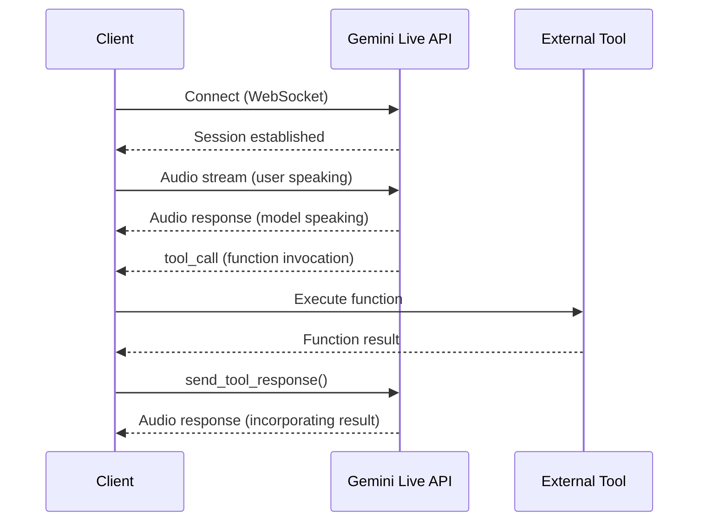

# Live API function calling (Gemini)

## Introduction

Google's Live API enables real-time, bidirectional communication with Gemini models over WebSocket connections. Function calling works within these sessions, allowing the model to invoke tools while processing audio input and generating audio output — all without breaking the conversational flow.

Unlike standard `generateContent` requests where function calling follows a synchronous request-response pattern, the Live API maintains a **continuous session** where audio, text, and tool calls flow as interleaved messages over a single WebSocket.

### What we'll cover

- How the WebSocket-based architecture handles tool calls alongside audio streams
- Configuring and handling function calls in live sessions
- Using asynchronous `NON_BLOCKING` mode with scheduling control
- Combining function calling with other tools like Google Search

### Prerequisites

- Familiarity with [Gemini function calling basics](../01-function-calling-fundamentals/00-function-calling-fundamentals.md)
- Python async/await knowledge
- A Google Gemini API key

---

## WebSocket-based real-time architecture

The Live API uses a persistent WebSocket connection where audio, text, and tool calls flow as structured messages. The client connects once, then sends and receives data continuously throughout the session:



The key difference from REST-based function calling: tool responses must be handled **manually** in your client code. The Live API does not support automatic tool response handling.

### Supported tools

The Live API supports a specific set of tools depending on the model:

| Tool | `gemini-2.5-flash-native-audio-preview` |
|:-----|:----------------------------------------|
| Function calling | ✅ Yes |
| Google Search | ✅ Yes |
| Google Maps | ❌ No |
| Code execution | ❌ No |
| URL context | ❌ No |

### Implementation approaches

When integrating with the Live API, we choose one of two approaches:

| Approach | How It Works | Best For |
|:---------|:-------------|:---------|
| **Server-to-server** | Backend connects to Live API via WebSocket, proxies client audio | Production apps needing server-side logic |
| **Client-to-server** | Frontend connects directly to Live API via WebSocket | Lower latency, simpler setup (use [ephemeral tokens](https://ai.google.dev/gemini-api/docs/ephemeral-tokens) for security) |

---

## Configuring tools in a live session

We define function declarations as part of the session configuration, then handle tool calls in the receive loop:

```python
import asyncio
from google import genai
from google.genai import types

client = genai.Client()

model = "gemini-2.5-flash-native-audio-preview-12-2025"

# Define tool functions
get_weather = {
    "name": "get_weather",
    "description": "Get the current weather for a given city.",
    "parameters": {
        "type": "object",
        "properties": {
            "city": {
                "type": "string",
                "description": "The city name, e.g. 'San Francisco'"
            }
        },
        "required": ["city"]
    }
}

set_thermostat = {
    "name": "set_thermostat",
    "description": "Set the thermostat to a specific temperature.",
    "parameters": {
        "type": "object",
        "properties": {
            "temperature": {
                "type": "number",
                "description": "Temperature in Fahrenheit"
            }
        },
        "required": ["temperature"]
    }
}

# Configure session with tools and audio output
tools = [{"function_declarations": [get_weather, set_thermostat]}]
config = {"response_modalities": ["AUDIO"], "tools": tools}

async def main():
    async with client.aio.live.connect(model=model, config=config) as session:
        prompt = "What's the weather in Chicago? And set my thermostat to 72."
        await session.send_client_content(
            turns={"parts": [{"text": prompt}]}
        )

        async for response in session.receive():
            if response.tool_call:
                # Handle each function call in the response
                function_responses = []
                for fc in response.tool_call.function_calls:
                    # Execute your actual function logic here
                    if fc.name == "get_weather":
                        result = {"temperature": "45°F", "condition": "cloudy"}
                    elif fc.name == "set_thermostat":
                        result = {"status": "set", "temperature": 72}
                    else:
                        result = {"error": "Unknown function"}

                    function_responses.append(
                        types.FunctionResponse(
                            id=fc.id,
                            name=fc.name,
                            response={"result": result}
                        )
                    )

                # Send all function results back to the model
                await session.send_tool_response(
                    function_responses=function_responses
                )
            elif response.data is not None:
                # Handle audio output (write to file or play)
                print(f"Received {len(response.data)} bytes of audio")

if __name__ == "__main__":
    asyncio.run(main())
```

**Output:**
```
The tool was called: get_weather
The tool was called: set_thermostat
Received 48000 bytes of audio
```

> **🔑 Key concept:** The model can generate multiple function calls from a single prompt. The code above iterates over `response.tool_call.function_calls` to handle each one, then sends all results back in a single `send_tool_response()` call.

### The tool call flow in detail

The flow follows these steps:

1. **Session connects** — client opens a WebSocket and sends tool configuration
2. **User input arrives** — audio or text is sent via `send_client_content()` or `send_realtime_input()`
3. **Model decides to call a tool** — a `tool_call` message arrives in the receive loop containing one or more `function_calls`
4. **Client executes functions** — your code runs the actual logic and collects results
5. **Client sends results** — `send_tool_response()` returns all `FunctionResponse` objects
6. **Model generates final response** — using the tool results, the model produces audio/text output

> **Note:** Unlike the `generateContent` API, you cannot rely on automatic tool response handling. Every tool call must be manually processed and responded to in your client code.

---

## Asynchronous function calling

By default, function calling in the Live API is **synchronous** — the conversation pauses until all function results are returned. For tools that take time (API calls, database queries), this creates awkward silence. Asynchronous function calling solves this by letting the model continue the conversation while tools execute.

### Marking functions as non-blocking

Add the `behavior` property to function definitions:

```python
# Mark a function as non-blocking
get_weather = {
    "name": "get_weather",
    "description": "Get weather for a city.",
    "behavior": "NON_BLOCKING"  # Function runs asynchronously
}

set_thermostat = {
    "name": "set_thermostat",
    "description": "Set the thermostat temperature."
    # No behavior set = synchronous (blocks conversation)
}

tools = [{"function_declarations": [get_weather, set_thermostat]}]
```

With `NON_BLOCKING`, the model can keep speaking while `get_weather` executes. The `set_thermostat` function still blocks because it has no `behavior` set.

### Controlling result delivery with scheduling

When sending the response back for a non-blocking function, we control **how the model reacts** to the result using the `scheduling` parameter:

```python
function_response = types.FunctionResponse(
    id=fc.id,
    name=fc.name,
    response={
        "result": {"temperature": "45°F", "condition": "cloudy"},
        "scheduling": "INTERRUPT"  # Tell model immediately
    }
)
```

| Scheduling Mode | Behavior | Best For |
|:----------------|:---------|:---------|
| `INTERRUPT` | Model stops speaking and reports the result immediately | Urgent results the user is waiting for |
| `WHEN_IDLE` | Model finishes current speech, then reports the result | Non-urgent updates |
| `SILENT` | Model absorbs the result silently for later use | Background data enrichment |

> **Tip:** Use `SILENT` for enrichment tools — like fetching user preferences or loading context data that the model should know about but does not need to announce.

---

## Combining multiple tools

The Live API supports combining function calling with other tools like Google Search in a single session. This allows the model to choose the most appropriate tool for each part of a request:

```python
tools = [
    {"google_search": {}},
    {"function_declarations": [get_weather, set_thermostat]},
]

config = {"response_modalities": ["AUDIO"], "tools": tools}
```

With this configuration, a prompt like *"What was the biggest earthquake in California last week? Also set my thermostat to 68"* would cause the model to:

1. Use **Google Search** for the earthquake question (real-time factual data)
2. Call `set_thermostat` for the thermostat action (custom function)

Both tools execute within the same live session without requiring separate requests.

> **Warning:** Not all tool combinations are supported. Check the [supported tools table](#supported-tools) for your specific model version before combining tools.

---

## Best practices

| Practice | Why It Matters |
|:---------|:---------------|
| Use `NON_BLOCKING` for any tool that calls external APIs | Prevents awkward silence during slow operations |
| Choose scheduling mode based on urgency | `INTERRUPT` for results users are waiting for, `SILENT` for background enrichment |
| Handle unknown function names gracefully | The model may generate unexpected function names — return a clear error |
| Iterate over all `function_calls` in a tool call | A single response can contain multiple function calls |
| Use `send_tool_response()` for all results at once | Sending results one at a time may cause unexpected behavior |

---

## Common pitfalls

| ❌ Mistake | ✅ Solution |
|:-----------|:------------|
| Assuming automatic tool response handling works | Always handle tool responses manually — Live API does not auto-process them |
| Using synchronous mode for slow external API calls | Mark with `behavior: "NON_BLOCKING"` to prevent conversation pauses |
| Forgetting to include `id` in `FunctionResponse` | Every response must include the `fc.id` matching the original call |
| Not handling the audio output alongside tool calls | Check for both `response.tool_call` and `response.data` in the receive loop |
| Mixing unsupported tool types | Verify your model version supports the tool combination you need |

---

## Summary

✅ The Gemini Live API uses persistent WebSocket connections where function calls flow alongside audio streams

✅ Tool declarations are configured at session creation and handled manually via `send_tool_response()`

✅ `NON_BLOCKING` behavior with `INTERRUPT` / `WHEN_IDLE` / `SILENT` scheduling gives fine-grained control over how results are delivered

✅ Multiple tool types (function calling + Google Search) can be combined in a single live session

**Next:** [Realtime API Function Calling (OpenAI)](./02-realtime-api-function-calling.md)

---

## Further reading

- [Gemini Live API — Tool Use](https://ai.google.dev/gemini-api/docs/live-tools) — Official guide for function calling in live sessions
- [Gemini Live API — Get Started](https://ai.google.dev/gemini-api/docs/live) — Connection setup and audio streaming basics
- [Gemini Live API — Capabilities](https://ai.google.dev/gemini-api/docs/live-guide) — VAD, native audio features, and full configuration reference
- [Gemini Live API — Session Management](https://ai.google.dev/gemini-api/docs/live-session) — Managing long-running conversations
- [Tool Use Cookbook](https://colab.research.google.com/github/google-gemini/cookbook/blob/main/quickstarts/Get_started_LiveAPI_tools.ipynb) — Interactive examples of Live API tools

---

*[← Back to Real-time & Voice Tool Use Overview](./00-realtime-voice-tool-use.md)*

<!-- 
Sources Consulted:
- Gemini Live API Tools: https://ai.google.dev/gemini-api/docs/live-tools
- Gemini Live API Get Started: https://ai.google.dev/gemini-api/docs/live
-->
