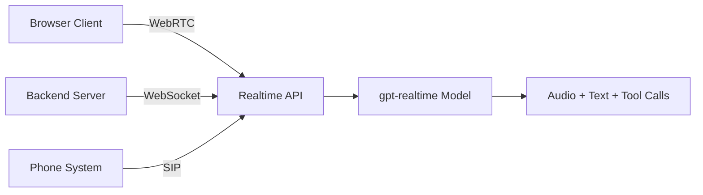
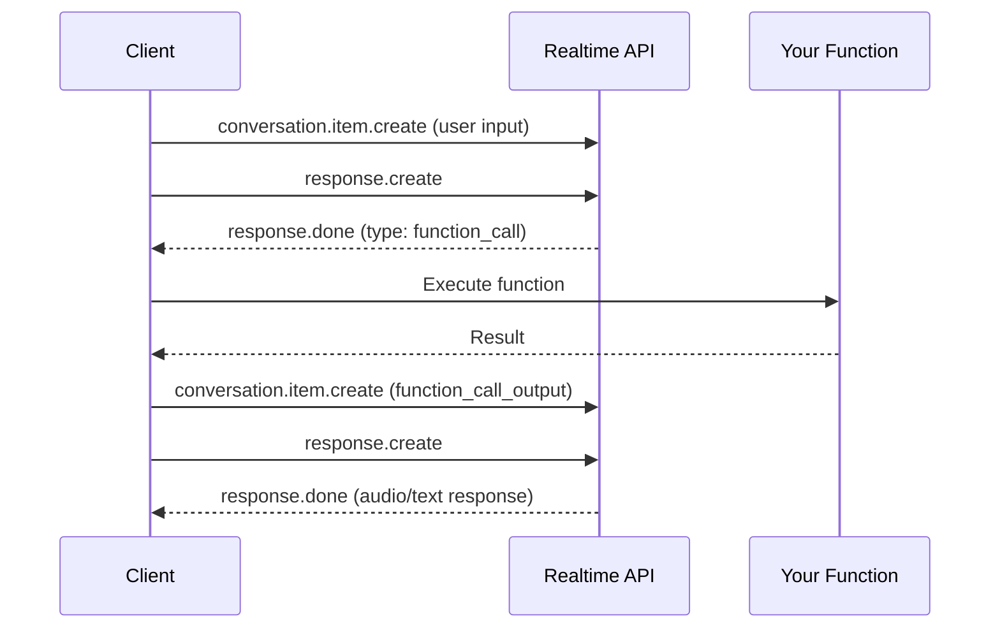
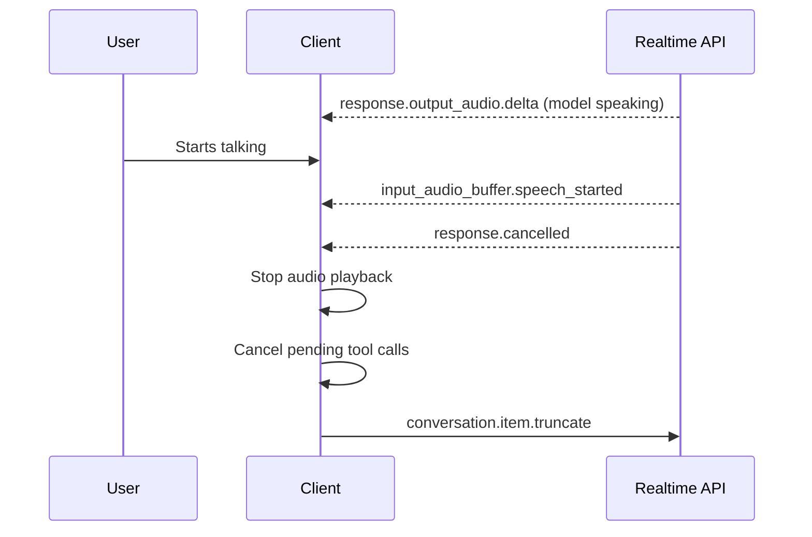

# Realtime API function calling (OpenAI)

## Introduction

OpenAI's Realtime API enables speech-to-speech interactions with `gpt-realtime` models. Function calling integrates directly into the session lifecycle, letting voice agents execute tools while maintaining a natural conversation. Unlike traditional REST-based function calling, the Realtime API uses an **event-driven model** where client events and server events flow over a persistent connection.

This lesson covers how to configure tools, handle function calls in the event loop, manage response streaming, and handle user interruptions during tool execution.

### What we'll cover

- Realtime API architecture and connection methods (WebRTC, WebSocket, SIP)
- Configuring function tools via `session.update`
- Detecting and handling function calls through server events
- Managing interruptions and audio truncation during tool execution

### Prerequisites

- Familiarity with [function calling fundamentals](../01-function-calling-fundamentals/00-function-calling-fundamentals.md)
- JavaScript/Node.js async programming knowledge
- An OpenAI API key

---

## Architecture and connection methods

The Realtime API provides three transport methods, each suited to different deployment scenarios:

| Transport | Best For | Audio Handling |
|:----------|:---------|:---------------|
| **WebRTC** | Browser-based clients | Automatic via peer connection |
| **WebSocket** | Server-to-server applications | Manual Base64 encoding/decoding |
| **SIP** | VoIP telephony connections | Standard telephony protocols |



### Choosing a transport

- **WebRTC** handles media streams automatically — audio input from the microphone and output to speakers are managed through standard browser APIs. Best for client-side applications.
- **WebSocket** gives you full control over audio encoding and decoding — you manually send Base64-encoded audio chunks and receive them the same way. Best for server-to-server integrations (e.g., phone call agents via Twilio).
- **SIP** connects directly to telephony infrastructure for VoIP use cases.

> **Tip:** If you are using the [OpenAI Agents SDK for TypeScript](https://openai.github.io/openai-agents-js/), it automatically selects WebRTC in the browser and WebSocket on the server.

### Session lifecycle

A Realtime session has three key components:

| Component | Purpose |
|:----------|:--------|
| **Session** | Controls parameters: model, voice, tools, turn detection |
| **Conversation** | Contains user input items and model output items |
| **Responses** | Model-generated audio or text items added to the conversation |

The maximum duration of a Realtime session is **60 minutes**. The session begins with a `session.created` server event and can be configured at any time with a `session.update` client event.

---

## Configuring function calling in a session

Functions are defined during session configuration via the `session.update` client event. Here we connect via WebSocket and configure an order status tool:

```javascript
import WebSocket from "ws";

const url = "wss://api.openai.com/v1/realtime?model=gpt-realtime";
const ws = new WebSocket(url, {
  headers: {
    Authorization: "Bearer " + process.env.OPENAI_API_KEY,
  },
});

ws.on("open", () => {
  console.log("Connected to Realtime API.");

  // Configure session with tools
  ws.send(JSON.stringify({
    type: "session.update",
    session: {
      type: "realtime",
      output_modalities: ["audio"],
      audio: {
        input: {
          format: { type: "audio/pcm", rate: 24000 },
          turn_detection: { type: "semantic_vad" }
        },
        output: {
          format: { type: "audio/pcm" },
          voice: "marin"
        }
      },
      tools: [
        {
          type: "function",
          name: "get_order_status",
          description: "Look up the status of a customer order by order ID.",
          parameters: {
            type: "object",
            properties: {
              order_id: {
                type: "string",
                description: "The order ID, e.g. ORD-12345"
              }
            },
            required: ["order_id"]
          }
        }
      ],
      tool_choice: "auto"
    }
  }));
});
```

**Output:**
```
Connected to Realtime API.
```

### Key configuration options

| Property | Purpose | Values |
|:---------|:--------|:-------|
| `output_modalities` | What the model produces | `["audio"]`, `["text"]`, `["audio", "text"]` |
| `audio.output.voice` | Voice for audio output | `alloy`, `ash`, `ballad`, `coral`, `echo`, `sage`, `shimmer`, `verse`, `marin`, `cedar` |
| `audio.input.turn_detection` | VAD configuration | `{ type: "semantic_vad" }` or `null` (disabled) |
| `tools` | Available functions | Array of function tool definitions |
| `tool_choice` | When to call tools | `"auto"`, `"none"`, or `{ type: "function", name: "..." }` |

> **Note:** Once the model has produced audio output in a session, the `voice` cannot be changed for that session.

---

## Handling function calls in the event loop

The Realtime API uses an event-driven model. When the model decides to call a function, it emits a `response.done` event with `function_call` output items. The complete flow involves three steps:



### Implementing the event handler

```javascript
ws.on("message", (message) => {
  const event = JSON.parse(message.toString());

  switch (event.type) {
    case "session.updated":
      console.log("Session configured with tools.");
      break;

    case "response.done":
      // Check if the model wants to call a function
      for (const item of event.response.output) {
        if (item.type === "function_call") {
          handleFunctionCall(item);
        }
      }
      break;

    case "response.function_call_arguments.delta":
      // Stream function arguments as they arrive
      process.stdout.write(event.delta);
      break;

    case "error":
      console.error("Error:", event.error.message);
      break;
  }
});

async function handleFunctionCall(item) {
  console.log(`\nFunction called: ${item.name}`);
  const args = JSON.parse(item.arguments);

  // Execute the actual function
  let result;
  if (item.name === "get_order_status") {
    result = await lookupOrder(args.order_id);
  }

  // Step 1: Send function result back as a conversation item
  ws.send(JSON.stringify({
    type: "conversation.item.create",
    item: {
      type: "function_call_output",
      call_id: item.call_id,
      output: JSON.stringify(result)
    }
  }));

  // Step 2: Trigger the model to generate a response using the result
  ws.send(JSON.stringify({ type: "response.create" }));
}

async function lookupOrder(orderId) {
  // Simulated database lookup
  return {
    order_id: orderId,
    status: "shipped",
    estimated_delivery: "2025-07-15"
  };
}
```

**Output:**
```
Session configured with tools.
Function called: get_order_status
```

> **Warning:** After sending the `function_call_output`, you **must** send a `response.create` event to trigger the model to generate a spoken response incorporating the tool result. Forgetting this step leaves the conversation hanging silently.

### The three-step function call cycle

| Step | Client Event | Purpose |
|:-----|:-------------|:--------|
| 1 | Receive `response.done` | Detect `function_call` items with `name`, `arguments`, and `call_id` |
| 2 | Send `conversation.item.create` | Provide `function_call_output` with matching `call_id` |
| 3 | Send `response.create` | Tell the model to generate a response using the tool result |

### Server events during function calling

During the function call lifecycle, the server emits events in this order:

| Event | Description |
|:------|:------------|
| `response.created` | A new response is being generated |
| `response.output_item.added` | A function call item is being added |
| `response.function_call_arguments.delta` | Streaming function arguments |
| `response.function_call_arguments.done` | Function arguments complete |
| `response.output_item.done` | The function call item is finalized |
| `response.done` | Full response complete — contains all output items |

---

## Interruption handling during tool execution

When the user interrupts while the model is speaking (or waiting for a tool result), the Realtime API handles this through voice activity detection (VAD). The server emits `input_audio_buffer.speech_started`, automatically cancels the in-progress response, and emits `response.cancelled`.

### How interruptions work



### Implementation

```javascript
ws.on("message", (message) => {
  const event = JSON.parse(message.toString());

  if (event.type === "input_audio_buffer.speech_started") {
    console.log("User started speaking — interruption detected");
    // Stop any audio playback immediately
    stopAudioPlayback();
  }

  if (event.type === "response.cancelled") {
    console.log("Previous response cancelled due to interruption");
    // Clean up any pending tool calls
    cancelPendingTools();
  }
});

function stopAudioPlayback() {
  // Clear audio buffer, stop speaker output
  audioBuffer = [];
}

function cancelPendingTools() {
  // Cancel any in-flight API requests
  pendingRequests.forEach(req => req.abort());
  pendingRequests.clear();
}
```

### Truncation for WebSocket connections

For WebSocket connections, the client must also truncate the unplayed audio to keep the conversation state consistent. This tells the API how much audio was actually played before the interruption:

```javascript
// After stopping playback, tell the API how much audio was played
ws.send(JSON.stringify({
  type: "conversation.item.truncate",
  item_id: lastModelResponseId,
  content_index: 0,
  audio_end_ms: playedDurationMs  // Milliseconds of audio actually played
}));
```

> **Note:** WebRTC and SIP connections handle truncation automatically — the server manages an output audio buffer and knows how much audio has been played. With WebSocket, you must track this yourself.

### VAD configuration options

| Configuration | Behavior | Use Case |
|:--------------|:---------|:---------|
| `semantic_vad` (default) | API detects speech start/stop, responds automatically | Standard conversational agents |
| `null` (VAD disabled) | Client manually commits audio and triggers responses | Push-to-talk interfaces |
| VAD with `create_response: false` | VAD detects speech but does not auto-respond | Moderation, RAG, or input validation before responding |

---

## Best practices

| Practice | Why It Matters |
|:---------|:---------------|
| Always send `response.create` after `function_call_output` | Without it, the model never speaks the tool result |
| Use `event_id` on client events for error tracing | Correlates error server events back to the client event that caused them |
| Track `call_id` for every in-flight function call | Needed to match results to the correct function call |
| Use `semantic_vad` for conversational agents | Better speech detection than manual thresholds |
| Handle `response.cancelled` to clean up tool state | Prevents stale tool results from corrupting conversation |
| Choose WebRTC for browser, WebSocket for server | Each transport is optimized for its deployment context |

---

## Common pitfalls

| ❌ Mistake | ✅ Solution |
|:-----------|:------------|
| Forgetting `response.create` after `function_call_output` | Always send it — this is the most common bug in Realtime integrations |
| Not handling truncation on WebSocket interruptions | Send `conversation.item.truncate` with the actual played duration |
| Ignoring `response.function_call_arguments.delta` events | Use these for streaming UI updates while arguments arrive |
| Treating the session as stateless | The conversation persists — previous tool results affect future responses |
| Not setting `tool_choice` | Defaults to `"auto"`, but explicitly setting it makes intent clear |
| Changing voice after first audio output | Voice is locked after the model first speaks — configure it early |

---

## Summary

✅ The OpenAI Realtime API supports function calling through an event-driven pattern over WebRTC, WebSocket, or SIP connections

✅ The three-step cycle — receive `response.done` → send `function_call_output` → send `response.create` — is the core of tool use in real-time sessions

✅ Interruption handling requires stopping audio playback, canceling pending tools, and truncating unplayed audio (WebSocket only)

✅ VAD configuration controls whether the model responds automatically, waits for manual triggers, or allows moderation before responding

**Previous:** [Live API Function Calling (Gemini)](./01-live-api-function-calling.md) | **Next:** [Voice Agent Tool Patterns](./03-voice-agent-tool-patterns.md)

---

## Further reading

- [OpenAI Realtime API — Conversations](https://platform.openai.com/docs/guides/realtime-conversations) — Session lifecycle, function calling, and interruption handling
- [OpenAI Voice Agents Guide](https://platform.openai.com/docs/guides/voice-agents) — Architecture choices, prompting, and agent handoff
- [OpenAI Realtime API — WebSocket](https://platform.openai.com/docs/guides/realtime-websocket) — Server-to-server WebSocket connection guide
- [OpenAI Realtime API — WebRTC](https://platform.openai.com/docs/guides/realtime-webrtc) — Browser-based WebRTC connection guide
- [OpenAI Agents SDK for TypeScript](https://openai.github.io/openai-agents-js/guides/voice-agents/) — High-level voice agent framework
- [Realtime API Reference](https://platform.openai.com/docs/api-reference/realtime) — Complete client and server event reference

---

*[← Back to Real-time & Voice Tool Use Overview](./00-realtime-voice-tool-use.md)*

<!-- 
Sources Consulted:
- OpenAI Realtime API Overview: https://platform.openai.com/docs/guides/realtime
- OpenAI Realtime Conversations: https://platform.openai.com/docs/guides/realtime-conversations
- OpenAI Voice Agents: https://platform.openai.com/docs/guides/voice-agents
- OpenAI Realtime WebSocket: https://platform.openai.com/docs/guides/realtime-websocket
-->
