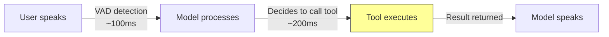

# Voice agent tool patterns

## Introduction

Building effective voice agents with tools requires patterns that account for the unique constraints of spoken conversation. Users cannot "see" a loading spinner, silence feels like a failure, and errors need graceful verbal recovery. The patterns in this lesson apply regardless of whether you are using Gemini's Live API or OpenAI's Realtime API.

We will explore three critical patterns: keeping tools fast enough for conversation, handling slow tools without awkward silence, and recovering from errors in a way that feels natural when spoken aloud.

### What we'll cover

- Designing quick-response tools that stay under perceptible latency thresholds
- Background processing patterns with verbal user feedback
- Error recovery strategies for voice interactions
- Agent handoff and multi-agent patterns for voice

### Prerequisites

- Understanding of [Live API Function Calling (Gemini)](./01-live-api-function-calling.md)
- Understanding of [Realtime API Function Calling (OpenAI)](./02-realtime-api-function-calling.md)

---

## Quick-response tools

Some tools must return results fast enough that the user does not perceive a delay. In voice conversations, **200–500ms** is the threshold before silence becomes noticeable. Design quick-response tools to complete well within this window.

### Latency budget



The tool execution step (highlighted) is the part you control. Every millisecond spent here is time the user waits in silence.

### Strategies for fast tools

```python
# Quick-response tool: in-memory lookup
async def get_account_balance(account_id: str) -> dict:
    """Completes in <100ms — reads from cache."""
    balance = await cache.get(f"balance:{account_id}")
    if balance is None:
        # Fall back to database only if cache misses
        balance = await db.get_balance(account_id)
        await cache.set(f"balance:{account_id}", balance, ttl=60)
    return {"balance": balance, "currency": "USD"}
```

**Output:**
```
{"balance": 1250.00, "currency": "USD"}
```

| Tool Type | Target Latency | Strategy |
|:----------|:---------------|:---------|
| Cache lookup | < 100ms | In-memory cache (Redis, Memcached) |
| Simple calculation | < 50ms | Local computation, no I/O |
| Database read | < 300ms | Indexed queries, connection pooling |
| External API | 500ms–2s | **Too slow** — use background processing pattern |

### Pre-warming strategies

For tools that users are likely to invoke, pre-load data before the conversation reaches that point:

```python
async def on_session_start(user_id: str):
    """Pre-warm cache with data the agent is likely to need."""
    # Load user profile into cache
    profile = await db.get_user_profile(user_id)
    await cache.set(f"profile:{user_id}", profile, ttl=300)

    # Load recent orders
    orders = await db.get_recent_orders(user_id, limit=5)
    await cache.set(f"orders:{user_id}", orders, ttl=120)

    # Load account balance
    balance = await db.get_balance(user_id)
    await cache.set(f"balance:{user_id}", balance, ttl=60)
```

> **🔑 Key concept:** Pre-warming turns slow database queries into fast cache hits. Do this at session start, not at tool invocation time.

---

## Background processing with user feedback

For tools that take longer than 500ms (external APIs, complex database operations, multi-step workflows), the model should **acknowledge the request verbally** and continue the conversation while the tool executes.

### Gemini pattern: NON_BLOCKING with scheduling

Gemini's Live API provides native support for background tools through the `NON_BLOCKING` behavior and `scheduling` parameter:

```python
from google.genai import types

# Define the tool as non-blocking
check_inventory = {
    "name": "check_inventory",
    "description": "Check product inventory levels across all warehouses.",
    "behavior": "NON_BLOCKING"  # Model keeps talking while this runs
}

# When handling the tool call:
async def handle_inventory_check(fc, session):
    # Slow operation: queries multiple warehouses
    result = await query_all_warehouses(fc.args["product_id"])

    # Use WHEN_IDLE — model finishes current speech, then shares result
    function_response = types.FunctionResponse(
        id=fc.id,
        name=fc.name,
        response={
            "result": {"product": "Widget A", "in_stock": 142},
            "scheduling": "WHEN_IDLE"
        }
    )
    await session.send_tool_response(
        function_responses=[function_response]
    )
```

| Scheduling | User Experience |
|:-----------|:----------------|
| `INTERRUPT` | *"Oh! I just got the results — you have 142 in stock."* |
| `WHEN_IDLE` | Model finishes current thought, then naturally mentions: *"By the way, I checked and there are 142 units available."* |
| `SILENT` | Model absorbs the data silently, uses it only if relevant later |

### OpenAI pattern: placeholder response + follow-up

OpenAI's Realtime API does not have a built-in non-blocking mode, but we can simulate it with a placeholder result followed by a conversation injection:

```javascript
async function handleSlowToolCall(item, ws) {
  const args = JSON.parse(item.arguments);

  // Step 1: Immediately send a placeholder result so the model can speak
  ws.send(JSON.stringify({
    type: "conversation.item.create",
    item: {
      type: "function_call_output",
      call_id: item.call_id,
      output: JSON.stringify({
        status: "processing",
        message: "Looking that up for you now..."
      })
    }
  }));
  ws.send(JSON.stringify({ type: "response.create" }));
  // Model says something like: "Let me look that up for you..."

  // Step 2: Execute the slow operation in the background
  const result = await callExternalApi(args);

  // Step 3: Inject the actual result as a new conversation item
  ws.send(JSON.stringify({
    type: "conversation.item.create",
    item: {
      type: "message",
      role: "user",
      content: [{
        type: "input_text",
        text: `[System: The result of the earlier lookup is: ${JSON.stringify(result)}. Please share this with the user naturally.]`
      }]
    }
  }));
  ws.send(JSON.stringify({ type: "response.create" }));
}
```

**Expected user experience:**
```
User: "Can you check if Widget A is in stock?"
Agent: "Let me look that up for you..."
       (2 seconds pass while API call executes)
Agent: "Great news — Widget A is in stock with 142 units available."
```

> **Warning:** The placeholder approach works well but adds an extra round trip. For latency-critical applications, consider pre-warming the data or using Gemini's native `NON_BLOCKING` mode instead.

---

## Error recovery in voice

Errors in voice interactions need fundamentally different handling than in text-based apps. Users cannot read error codes, stack traces, or JSON responses. The model must explain the problem **conversationally** — and ideally offer an alternative.

### Structured error responses

Return errors with fields the model can use to craft a natural spoken response:

```javascript
async function handleFunctionCallWithRecovery(item, ws) {
  const args = JSON.parse(item.arguments);
  let result;

  try {
    result = await executeFunction(item.name, args);
  } catch (error) {
    // Provide a user-friendly error the model can speak
    result = {
      error: true,
      user_message: getFriendlyError(error),
      can_retry: isRetryable(error),
      suggestion: getSuggestion(error)
    };
  }

  ws.send(JSON.stringify({
    type: "conversation.item.create",
    item: {
      type: "function_call_output",
      call_id: item.call_id,
      output: JSON.stringify(result)
    }
  }));
  ws.send(JSON.stringify({ type: "response.create" }));
}

function getFriendlyError(error) {
  const errorMap = {
    "ECONNREFUSED": "The service is temporarily unavailable",
    "TIMEOUT": "The request took too long to complete",
    "AUTH_FAILED": "There was an authentication issue",
    "NOT_FOUND": "I couldn't find that information",
    "RATE_LIMIT": "We've made too many requests, please wait a moment",
  };
  return errorMap[error.code] || "Something went wrong with that request";
}

function isRetryable(error) {
  return ["ECONNREFUSED", "TIMEOUT", "RATE_LIMIT"].includes(error.code);
}

function getSuggestion(error) {
  const suggestions = {
    "NOT_FOUND": "Could you double-check the spelling or try a different search?",
    "TIMEOUT": "I can try again in a moment",
    "RATE_LIMIT": "Let's wait about 30 seconds and try again",
  };
  return suggestions[error.code] || "Would you like me to try something else?";
}
```

**Expected voice interaction:**
```
User: "What's the status of order XYZ-999?"
Agent: "I'm sorry, I couldn't find that order. Could you double-check 
        the order number or try a different one?"
```

> **🤖 AI Context:** The model uses the `user_message` and `suggestion` fields to craft a natural spoken apology and offer alternatives — far better than silence or a generic "an error occurred."

### Error response structure

| Field | Purpose | Example |
|:------|:--------|:--------|
| `error` | Boolean flag for error detection | `true` |
| `user_message` | Human-readable explanation | `"The service is temporarily unavailable"` |
| `can_retry` | Whether the operation can be retried | `true` |
| `suggestion` | What to suggest to the user | `"I can try again in a moment"` |

---

## Agent handoff for voice

Complex voice applications often use multiple specialized agents. When the current agent cannot handle a request, it hands off to a specialist — maintaining conversation continuity.

### OpenAI agent handoff pattern

```javascript
// Define a handoff tool
const transferTool = {
  type: "function",
  name: "transfer_to_agent",
  description: `Transfer the user to a more specialized agent.
Available agents:
- returns_agent: Handles return and refund requests
- product_specialist: Answers detailed product questions
- billing_agent: Handles payment and billing issues`,
  parameters: {
    type: "object",
    properties: {
      destination_agent: {
        type: "string",
        enum: ["returns_agent", "product_specialist", "billing_agent"],
        description: "The agent to transfer to"
      },
      context: {
        type: "string",
        description: "Summary of the conversation so far"
      }
    },
    required: ["destination_agent", "context"]
  }
};

// When the model calls transferAgents:
async function handleTransfer(item, ws) {
  const args = JSON.parse(item.arguments);

  // Update session with new agent's instructions and tools
  const agentConfig = getAgentConfig(args.destination_agent);

  ws.send(JSON.stringify({
    type: "session.update",
    session: {
      instructions: agentConfig.instructions,
      tools: agentConfig.tools,
    }
  }));

  // Acknowledge the transfer
  ws.send(JSON.stringify({
    type: "conversation.item.create",
    item: {
      type: "function_call_output",
      call_id: item.call_id,
      output: JSON.stringify({
        status: "transferred",
        message: `Connected to ${args.destination_agent}`
      })
    }
  }));
  ws.send(JSON.stringify({ type: "response.create" }));
}
```

> **Tip:** With the [OpenAI Agents SDK for TypeScript](https://openai.github.io/openai-agents-js/), you can define agents as `RealtimeAgent` objects and pass them as tools — the SDK handles handoff automatically.

---

## Best practices

| Practice | Why It Matters |
|:---------|:---------------|
| Keep tool execution under 500ms when possible | Silence during voice conversations feels like a failure |
| Use `NON_BLOCKING` (Gemini) or placeholder responses (OpenAI) for slow tools | Lets the model keep talking while tools execute |
| Return structured errors with `user_message` fields | Model can explain problems conversationally |
| Cancel pending tool calls on user interruption | Prevents stale results from arriving after context has changed |
| Limit tools per session to 5–10 | Too many tools slow down model decision-making and increase latency |
| Test with real audio, not just text simulation | Audio latency and VAD behavior differ significantly from text |
| Pre-warm caches at session start | Turns slow first lookups into fast cache hits |
| Design escape hatches (handoff to human) | Not every problem can be solved by an AI agent |

---

## Common pitfalls

| ❌ Mistake | ✅ Solution |
|:-----------|:------------|
| Returning raw error objects or stack traces as tool output | Return `user_message` the model can speak naturally |
| No fallback when a tool times out | Implement a timeout wrapper that returns a friendly error after a deadline |
| Using synchronous tools for external API calls | Mark slow tools as `NON_BLOCKING` (Gemini) or use the placeholder pattern (OpenAI) |
| Not testing with real audio latency | Voice-to-voice adds 100–300ms that text testing does not reveal |
| Ignoring the user's ability to interrupt | Always handle `speech_started` to cancel in-flight operations |
| Overloading a single agent with too many tools | Split into focused agents with handoff capabilities |

---

## Hands-on exercise

### Your task

Build a voice-enabled weather assistant using either the Gemini Live API or OpenAI Realtime API. The agent should accept spoken city names, call a weather function, and respond with spoken weather information.

### Requirements

1. Set up a WebSocket connection to either API
2. Define a `get_weather` tool that accepts a city name and returns temperature and conditions
3. Handle the tool call in your event loop and return mock weather data
4. Implement basic error handling for invalid city names (return a structured error with `user_message`)
5. (Bonus) Add a second tool (`set_reminder`) and test multi-tool calling

### Expected result

When the user says "What's the weather in Tokyo?", the agent should:
1. Detect the function call request
2. Execute `get_weather` with `city: "Tokyo"`
3. Return the result to the model
4. Speak a natural response like "It's currently 72°F and sunny in Tokyo"

<details>
<summary>💡 Hints (click to expand)</summary>

- Start with text input before adding audio — it is easier to debug
- Use `session.send_client_content()` (Gemini) or `conversation.item.create` (OpenAI) to send text prompts
- The model may call the function with slightly different city names than what the user says (e.g., "NYC" → "New York City") — handle this with case-insensitive lookup
- For OpenAI, remember the three-step flow: receive `response.done` → send `function_call_output` → send `response.create`
- Wrap your function execution in try/catch and return `{ error: true, user_message: "..." }` for unknown cities

</details>

<details>
<summary>✅ Solution (click to expand)</summary>

**Gemini Live API solution (Python):**

```python
import asyncio
from google import genai
from google.genai import types

client = genai.Client()
model = "gemini-2.5-flash-native-audio-preview-12-2025"

get_weather = {
    "name": "get_weather",
    "description": "Get current weather for a city.",
    "parameters": {
        "type": "object",
        "properties": {
            "city": {"type": "string", "description": "City name"}
        },
        "required": ["city"]
    }
}

# Mock weather database
WEATHER_DATA = {
    "tokyo": {"temp": "72°F", "condition": "sunny"},
    "london": {"temp": "55°F", "condition": "rainy"},
    "new york": {"temp": "68°F", "condition": "partly cloudy"},
}

tools = [{"function_declarations": [get_weather]}]
config = {"response_modalities": ["AUDIO"], "tools": tools}

async def main():
    async with client.aio.live.connect(
        model=model, config=config
    ) as session:
        await session.send_client_content(
            turns={"parts": [{"text": "What's the weather in Tokyo?"}]}
        )

        async for response in session.receive():
            if response.tool_call:
                function_responses = []
                for fc in response.tool_call.function_calls:
                    city = fc.args.get("city", "").lower()
                    weather = WEATHER_DATA.get(city)
                    if weather:
                        result = weather
                    else:
                        result = {
                            "error": True,
                            "user_message": f"No weather data for {city}",
                            "suggestion": "Try Tokyo, London, or New York"
                        }
                    function_responses.append(
                        types.FunctionResponse(
                            id=fc.id,
                            name=fc.name,
                            response={"result": result}
                        )
                    )
                await session.send_tool_response(
                    function_responses=function_responses
                )
            elif response.data is not None:
                print(f"Audio response: {len(response.data)} bytes")

asyncio.run(main())
```

**OpenAI Realtime API solution (Node.js):**

```javascript
import WebSocket from "ws";

const ws = new WebSocket(
  "wss://api.openai.com/v1/realtime?model=gpt-realtime",
  { headers: { Authorization: `Bearer ${process.env.OPENAI_API_KEY}` } }
);

const WEATHER_DATA = {
  tokyo: { temp: "72°F", condition: "sunny" },
  london: { temp: "55°F", condition: "rainy" },
  "new york": { temp: "68°F", condition: "partly cloudy" },
};

ws.on("open", () => {
  ws.send(JSON.stringify({
    type: "session.update",
    session: {
      type: "realtime",
      output_modalities: ["text"],
      tools: [{
        type: "function",
        name: "get_weather",
        description: "Get current weather for a city.",
        parameters: {
          type: "object",
          properties: {
            city: { type: "string", description: "City name" }
          },
          required: ["city"]
        }
      }],
      tool_choice: "auto"
    }
  }));
});

ws.on("message", (msg) => {
  const event = JSON.parse(msg.toString());

  if (event.type === "session.updated") {
    ws.send(JSON.stringify({
      type: "conversation.item.create",
      item: {
        type: "message", role: "user",
        content: [{ type: "input_text", text: "What's the weather in Tokyo?" }]
      }
    }));
    ws.send(JSON.stringify({ type: "response.create" }));
  }

  if (event.type === "response.done") {
    for (const item of event.response.output) {
      if (item.type === "function_call") {
        const args = JSON.parse(item.arguments);
        const city = args.city.toLowerCase();
        const weather = WEATHER_DATA[city];

        const result = weather || {
          error: true,
          user_message: `No data for ${city}`,
          suggestion: "Try Tokyo, London, or New York"
        };

        ws.send(JSON.stringify({
          type: "conversation.item.create",
          item: {
            type: "function_call_output",
            call_id: item.call_id,
            output: JSON.stringify(result)
          }
        }));
        ws.send(JSON.stringify({ type: "response.create" }));
      } else if (item.type === "message") {
        console.log("Response:",
          item.content.map(c => c.text).join(""));
      }
    }
  }
});
```
</details>

### Bonus challenges

- [ ] Add `NON_BLOCKING` behavior (Gemini) so the model acknowledges the request before the tool completes
- [ ] Implement interruption handling that cancels pending weather lookups
- [ ] Build a multi-turn conversation where the model remembers previously queried cities
- [ ] Add a `transfer_to_agent` tool that hands off to a weather specialist for detailed forecasts

---

## Summary

✅ Quick-response tools must complete within **200–500ms** to avoid perceptible silence — use caching and pre-warming to stay within this budget

✅ Background processing patterns let the model **acknowledge requests verbally** while slow tools execute — using Gemini's `NON_BLOCKING` mode or OpenAI's placeholder response technique

✅ Error recovery in voice requires structured error responses with `user_message` and `suggestion` fields the model can speak naturally

✅ Agent handoff patterns enable specialized agents to handle different domains while maintaining conversation continuity

✅ Always cancel pending tool calls on user interruption to prevent stale results from corrupting the conversation

**Previous:** [Realtime API Function Calling (OpenAI)](./02-realtime-api-function-calling.md)

---

## Further reading

- [OpenAI Voice Agents Guide](https://platform.openai.com/docs/guides/voice-agents) — Architecture choices, prompting, and agent handoff
- [OpenAI Realtime Agents Demo](https://github.com/openai/openai-realtime-agents) — Example speech-to-speech voice agents with handoffs
- [Voice Agent Metaprompter](https://github.com/openai/openai-realtime-agents/blob/main/src/app/agentConfigs/voiceAgentMetaprompt.txt) — Template for crafting voice agent prompts
- [Gemini Live API — Tool Use](https://ai.google.dev/gemini-api/docs/live-tools) — Official guide for function calling in live sessions
- [Gemini Live API — Session Management](https://ai.google.dev/gemini-api/docs/live-session) — Managing long-running conversations

---

*[← Back to Real-time & Voice Tool Use Overview](./00-realtime-voice-tool-use.md)*

<!-- 
Sources Consulted:
- OpenAI Voice Agents: https://platform.openai.com/docs/guides/voice-agents
- OpenAI Realtime Conversations: https://platform.openai.com/docs/guides/realtime-conversations
- Gemini Live API Tools: https://ai.google.dev/gemini-api/docs/live-tools
- Gemini Live API Get Started: https://ai.google.dev/gemini-api/docs/live
-->
