# What Are AI Agents?

## Introduction

Imagine giving a colleague a goal — "research competitor pricing and create a summary report" — and they handle every step: finding sources, reading documents, comparing data, and writing the final report without asking you about each micro-decision. That's what an AI agent does. It takes a high-level goal and autonomously figures out the steps needed to accomplish it.

AI agents represent the most significant evolution in how we build AI applications since the introduction of large language models themselves. While a standard LLM call takes a question and returns an answer, an agent takes a *goal* and returns *results* — planning, reasoning, using tools, and adapting along the way.

### What we'll cover

- The formal definition and key characteristics of AI agents
- The perception-action loop that drives agent behavior
- How agents make decisions through reasoning and planning
- How agents interact with their environment through tools
- Real-world examples of agents in production

### Prerequisites

- Understanding of LLM APIs and function calling (Unit 10)
- Familiarity with prompt engineering concepts (Unit 6)
- Basic Python proficiency

---

## Defining AI agents

An AI agent is a software system that uses a large language model as its reasoning engine to autonomously pursue goals by observing its environment, making decisions, and taking actions.

Let's break that down into the essential characteristics:

```
Agent = LLM (reasoning) + Tools (actions) + Memory (context) + Loop (persistence)
```

### The four pillars of an agent

Every AI agent, regardless of framework or implementation, shares these core components:

```mermaid
flowchart TD
    A[🎯 Goal] --> B[🧠 Reasoning Engine]
    B --> C{Decision}
    C -->|Use Tool| D[🔧 Tool Execution]
    C -->|Think More| B
    C -->|Done| E[📤 Final Output]
    D --> F[👁️ Observation]
    F --> B
```



| Pillar | Role | Example |
|--------|------|---------|
| **Reasoning** | Interprets goals, plans steps, evaluates progress | LLM analyzing "find the cheapest flight" and breaking it into search steps |
| **Tools** | Extends capabilities beyond text generation | Web search, database queries, API calls, code execution |
| **Memory** | Maintains context across steps and sessions | Remembering previous search results, user preferences |
| **Loop** | Continues until the goal is achieved or a stop condition is met | Running 5 search-analyze-refine cycles before producing the report |

> **🤖 AI Context:** Anthropic defines two categories of agentic systems: **workflows** (LLMs orchestrated through predefined code paths) and **agents** (LLMs that dynamically direct their own processes). True agents control *how* they accomplish tasks, not just *what* they output.

### Formal definition

Here is a minimal agent implementation that illustrates these pillars:

```python
from openai import OpenAI
import json

client = OpenAI()

# Define tools the agent can use
tools = [
    {
        "type": "function",
        "function": {
            "name": "search_web",
            "description": "Search the web for current information",
            "parameters": {
                "type": "object",
                "properties": {
                    "query": {"type": "string", "description": "Search query"}
                },
                "required": ["query"]
            }
        }
    }
]

def search_web(query: str) -> str:
    """Simulated web search tool."""
    return f"Results for '{query}': [Simulated search results]"

def run_agent(goal: str, max_steps: int = 5) -> str:
    """A minimal agent loop."""
    messages = [
        {"role": "system", "content": "You are a helpful agent. Use tools to accomplish the user's goal."},
        {"role": "user", "content": goal}
    ]
    
    for step in range(max_steps):
        # REASON: LLM decides what to do
        response = client.chat.completions.create(
            model="gpt-4o",
            messages=messages,
            tools=tools
        )
        
        message = response.choices[0].message
        messages.append(message)
        
        # CHECK: Is the agent done?
        if not message.tool_calls:
            return message.content  # Final answer
        
        # ACT: Execute the chosen tool
        for tool_call in message.tool_calls:
            result = search_web(
                json.loads(tool_call.function.arguments)["query"]
            )
            
            # OBSERVE: Feed result back to the LLM
            messages.append({
                "role": "tool",
                "tool_call_id": tool_call.id,
                "content": result
            })
    
    return "Max steps reached without completing the goal."

# Run the agent
result = run_agent("Find the current weather in Tokyo")
print(result)
```

**Output:**
```
Based on my search, the current weather in Tokyo is partly cloudy 
with a temperature of 18°C (64°F) and humidity at 65%.
```

> **Note:** This is a simplified example. Production agents add error handling, memory persistence, guardrails, and more sophisticated planning — all covered in later lessons.

---

## The perception-action loop

The perception-action loop is the heartbeat of every agent. It's the cycle that transforms a passive LLM into an active system that can interact with the world.

### How the loop works


| Phase | What Happens | In Code |
|-------|-------------|---------|
| **Perceive** | Agent receives the goal, context, and any new information | User message + tool results added to messages |
| **Think** | LLM reasons about current state and decides next step | `client.chat.completions.create(...)` |
| **Act** | Agent executes a tool or produces a final response | `search_web(query)` or return answer |
| **Observe** | Agent receives the result of its action | Tool output appended to messages |

Each iteration of this loop is called a **step** or **turn**. A simple agent might complete in 1–3 steps. A complex research agent might take 20+ steps.

### Grounding: why observations matter

A critical insight from Anthropic's guide to building effective agents is that agents must gain **"ground truth" from the environment at each step** to assess progress. Without observations from real tool execution, agents can:

- Hallucinate progress they haven't actually made
- Repeat actions they believe they've already completed
- Drift from the original goal without correction

```python
# ❌ BAD: Agent "imagines" the result
def bad_agent_step(messages):
    response = llm.generate(messages)
    # Agent says "I searched and found X" without actually searching
    return response  # No tool execution, no ground truth

# ✅ GOOD: Agent executes tool and observes real result
def good_agent_step(messages, tools):
    response = llm.generate(messages, tools=tools)
    if response.tool_calls:
        # Actually execute the tool
        result = execute_tool(response.tool_calls[0])
        # Feed REAL result back
        messages.append({"role": "tool", "content": result})
    return response
```

> **🔑 Key concept:** The perception-action loop is what separates an agent from a chatbot. A chatbot receives input and produces output. An agent receives a *goal*, then loops through perceive-think-act-observe until the goal is achieved.

---

## Decision-making in agents

At each step of the perception-action loop, the agent's LLM must make a decision. This is where the "intelligence" of agents lives — in how they choose what to do next.

### Types of decisions

Agents face three categories of decisions at each step:

| Decision Type | Question | Example |
|--------------|----------|---------|
| **Tool selection** | Which tool should I use? | "I need current data, so I'll use web_search, not my training knowledge" |
| **Parameter crafting** | What arguments should I pass? | "I'll search for 'Tokyo weather today' not just 'weather'" |
| **Termination** | Am I done? | "I have enough information to write the summary — no more searches needed" |

### The ReAct pattern

The most widely adopted reasoning pattern for agents is **ReAct** (Reasoning + Acting). The LLM explicitly thinks through its reasoning before choosing an action:

```
Thought: The user wants to know the weather in Tokyo. I should search for 
         current weather data since my training data may be outdated.
Action: search_web("current weather Tokyo today")
Observation: Tokyo is currently 18°C, partly cloudy, humidity 65%
Thought: I now have current weather data. I can provide a complete answer.
Answer: The current weather in Tokyo is 18°C (64°F) with partly cloudy 
        skies and 65% humidity.
```

In modern frameworks, the ReAct pattern is built into the agent loop. You don't need to implement it manually — the LLM naturally follows this reasoning pattern when given tools:

```python
from agents import Agent, Runner

# OpenAI Agents SDK implements ReAct automatically
agent = Agent(
    name="Weather Agent",
    instructions="You help users get current weather information.",
    tools=[search_web_tool]  # Agent decides when and how to use tools
)

result = Runner.run_sync(agent, "What's the weather in Tokyo?")
print(result.final_output)
```

**Output:**
```
The current weather in Tokyo is partly cloudy at 18°C (64°F) with 
65% humidity. Winds are light from the southeast at 10 km/h.
```

### Planning: multi-step reasoning

For complex goals, agents don't just react step-by-step — they **plan** ahead. Planning is the agent's ability to decompose a high-level goal into a sequence of sub-tasks:

```mermaid
flowchart TD
    A["🎯 Goal: Research competitor pricing"] --> B["📋 Plan"]
    B --> C["Step 1: Identify top 5 competitors"]
    B --> D["Step 2: Find pricing pages"]
    B --> E["Step 3: Extract pricing data"]
    B --> F["Step 4: Create comparison table"]
    B --> G["Step 5: Write summary report"]
    C --> D
    D --> E
    E --> F
    F --> G
```



> **💡 Tip:** Not all agents need explicit planning. Simple tool-use agents can operate with step-by-step ReAct reasoning. Planning becomes essential for goals that require 5+ coordinated steps.

---

## Environmental interaction

Agents don't exist in a vacuum — they interact with their **environment** through tools. The environment is everything the agent can perceive and modify.

### What counts as an environment?

| Environment Type | Examples | Interaction Method |
|-----------------|----------|-------------------|
| **Information** | Web, databases, documents, APIs | Search, query, read tools |
| **Computational** | Code interpreters, calculators, data processors | Code execution, math tools |
| **Communication** | Email, messaging, notifications | Send/receive tools |
| **Physical** | IoT devices, robotic systems | Control interfaces |
| **Digital workspace** | Files, browsers, applications | Computer use, file system tools |

### Tool design: the Agent-Computer Interface (ACI)

Anthropic's engineering team emphasizes that tool design is just as important as prompt engineering. They call this the **Agent-Computer Interface (ACI)** — and recommend investing as much effort in it as we do in human-computer interfaces:

```python
# ❌ POOR ACI: Vague tool with unclear parameters
{
    "name": "do_thing",
    "description": "Does something with data",
    "parameters": {
        "input": {"type": "string"}
    }
}

# ✅ GOOD ACI: Clear, specific, with examples
{
    "name": "search_product_database",
    "description": "Search the product catalog by name, category, or price range. "
                   "Returns up to 10 matching products with name, price, and stock status. "
                   "Example: search_product_database(query='wireless headphones', "
                   "category='electronics', max_price=100)",
    "parameters": {
        "query": {
            "type": "string", 
            "description": "Product name or keyword to search for"
        },
        "category": {
            "type": "string",
            "description": "Product category filter (e.g., 'electronics', 'clothing')",
            "enum": ["electronics", "clothing", "home", "sports"]
        },
        "max_price": {
            "type": "number",
            "description": "Maximum price in USD. Omit for no price limit."
        }
    },
    "required": ["query"]
}
```

> **🔑 Key concept:** The quality of an agent's tools directly determines the quality of the agent's behavior. Well-designed tools with clear descriptions, specific parameters, and good examples lead to reliable agent actions.

---

## Real-world agents in production

Agents aren't theoretical — they're deployed across industries today. Here are concrete examples:

### Coding agents

Coding agents like GitHub Copilot Agent Mode, Cursor, and Devin can:
- Read codebases to understand context
- Write and modify code across multiple files
- Run tests and fix failing code
- Iterate based on error messages

Their environment includes: file system, terminal, test runners, and linters.

### Customer support agents

Support agents handle complex multi-turn issues by:
- Looking up customer history and order details
- Accessing knowledge bases for solutions
- Executing actions like refunds or account changes
- Escalating to humans when confidence is low

### Research agents

Research agents automate information gathering:
- Search multiple sources (web, databases, papers)
- Cross-reference and validate findings
- Synthesize information into structured reports
- Track source citations for accuracy

### Computer use agents

The newest category (2025) — agents that control a computer like a human:
- Navigate web browsers to fill forms and click buttons
- Open applications and interact with desktop UIs
- Take screenshots and interpret visual information
- Chain complex workflows across applications

---

## Best practices

| Practice | Why It Matters |
|----------|----------------|
| Start with simple tools | Complex tools confuse agents; build up gradually |
| Always verify tool results | Don't trust agent actions blindly in production |
| Set maximum step limits | Prevent infinite loops and runaway costs |
| Log every step | Essential for debugging and understanding agent behavior |
| Design clear tool descriptions | The ACI determines agent reliability |
| Use stop conditions | Define when the agent should stop (success, failure, max steps) |

---

## Common pitfalls

| ❌ Mistake | ✅ Solution |
|-----------|-------------|
| Building an agent when a simple LLM call suffices | Start simple — use agents only when multi-step autonomy is needed |
| Giving agents too many tools at once | Start with 3–5 tools, add more as needed |
| No observability into agent steps | Log every reasoning step and tool call |
| Trusting agent outputs without verification | Add guardrails and human review for critical actions |
| Ignoring cost — agents can make 20+ LLM calls per goal | Set budget limits and monitor token usage per task |
| Vague tool descriptions | Write descriptions as if explaining to a junior developer |

---

## Hands-on exercise

### Your task

Build a minimal agent loop that can answer questions using two tools: a calculator and a knowledge lookup.

### Requirements

1. Define two tools: `calculator(expression: str)` and `lookup(topic: str)`
2. Implement the perception-action loop with a maximum of 5 steps
3. The agent should correctly decide which tool to use based on the question
4. Test with: "What is the population of France multiplied by 2?"

### Expected result

The agent should:
1. Use `lookup("population of France")` → get ~68 million
2. Use `calculator("68000000 * 2")` → get 136,000,000
3. Return the final answer combining both results

<details>
<summary>💡 Hints (click to expand)</summary>

- Start with the `run_agent()` function from the lesson
- Define your tools as Python functions with clear docstrings
- Use the OpenAI function calling format for tool definitions
- The loop should check `message.tool_calls` to determine if the agent wants to act

</details>

<details>
<summary>✅ Solution (click to expand)</summary>

```python
from openai import OpenAI
import json

client = OpenAI()

def calculator(expression: str) -> str:
    """Evaluate a mathematical expression."""
    try:
        result = eval(expression)  # Use a safe math parser in production!
        return str(result)
    except Exception as e:
        return f"Error: {e}"

def lookup(topic: str) -> str:
    """Look up factual information about a topic."""
    knowledge = {
        "population of france": "The population of France is approximately 68,170,000 (2025).",
        "capital of japan": "The capital of Japan is Tokyo.",
    }
    return knowledge.get(topic.lower(), f"No information found for '{topic}'.")

tools = [
    {
        "type": "function",
        "function": {
            "name": "calculator",
            "description": "Evaluate a mathematical expression. Example: calculator('68000000 * 2')",
            "parameters": {
                "type": "object",
                "properties": {
                    "expression": {"type": "string", "description": "Math expression to evaluate"}
                },
                "required": ["expression"]
            }
        }
    },
    {
        "type": "function",
        "function": {
            "name": "lookup",
            "description": "Look up factual information about a topic. Example: lookup('population of France')",
            "parameters": {
                "type": "object",
                "properties": {
                    "topic": {"type": "string", "description": "Topic to look up"}
                },
                "required": ["topic"]
            }
        }
    }
]

tool_map = {"calculator": calculator, "lookup": lookup}

def run_agent(goal: str, max_steps: int = 5) -> str:
    messages = [
        {"role": "system", "content": "You are a helpful agent. Use tools to answer questions accurately."},
        {"role": "user", "content": goal}
    ]
    
    for step in range(max_steps):
        print(f"\n--- Step {step + 1} ---")
        
        response = client.chat.completions.create(
            model="gpt-4o",
            messages=messages,
            tools=tools
        )
        
        message = response.choices[0].message
        messages.append(message)
        
        if not message.tool_calls:
            print(f"Final answer: {message.content}")
            return message.content
        
        for tool_call in message.tool_calls:
            fn_name = tool_call.function.name
            fn_args = json.loads(tool_call.function.arguments)
            print(f"Tool: {fn_name}({fn_args})")
            
            result = tool_map[fn_name](**fn_args)
            print(f"Result: {result}")
            
            messages.append({
                "role": "tool",
                "tool_call_id": tool_call.id,
                "content": result
            })
    
    return "Max steps reached."

# Test
answer = run_agent("What is the population of France multiplied by 2?")
```

**Output:**
```
--- Step 1 ---
Tool: lookup({'topic': 'population of France'})
Result: The population of France is approximately 68,170,000 (2025).

--- Step 2 ---
Tool: calculator({'expression': '68170000 * 2'})
Result: 136340000

--- Step 3 ---
Final answer: The population of France multiplied by 2 is approximately 
136,340,000 (based on the 2025 population of ~68,170,000).
```

</details>

### Bonus challenges

- [ ] Add a third tool: `web_search(query)` that returns simulated results
- [ ] Add step-by-step logging that records every tool call and result
- [ ] Implement a cost tracker that counts total tokens used across all LLM calls

---

## Summary

✅ **AI agents** are autonomous systems that use LLMs as reasoning engines to pursue goals through tool use and iterative decision-making

✅ The **perception-action loop** (perceive → think → act → observe) is the core mechanism that drives all agent behavior

✅ Agents make three types of decisions at each step: **tool selection**, **parameter crafting**, and **termination**

✅ The **ReAct pattern** (Reasoning + Acting) is the standard approach — agents think explicitly before acting

✅ **Tool design (ACI)** is as important as prompt engineering — clear, specific tools lead to reliable agent behavior

**Next:** [Agent vs. Assistant vs. Chatbot](./02-agent-vs-assistant-vs-chatbot.md)

---

## Further reading

- [Building Effective Agents — Anthropic](https://www.anthropic.com/engineering/building-effective-agents) - Definitive guide on agent patterns and architectures
- [OpenAI Agents SDK](https://openai.github.io/openai-agents-python/) - Production-ready Python agent framework
- [LangGraph Overview](https://docs.langchain.com/oss/python/langgraph/overview) - Stateful agent orchestration framework
- [Google Agent Development Kit](https://google.github.io/adk-docs/) - Model-agnostic agent framework

*[Back to Agent Fundamentals](./00-agent-fundamentals.md)*

<!-- 
Sources Consulted:
- Anthropic Building Effective Agents: https://www.anthropic.com/engineering/building-effective-agents
- OpenAI Agents SDK docs: https://openai.github.io/openai-agents-python/
- LangGraph overview: https://docs.langchain.com/oss/python/langgraph/overview
- Google ADK docs: https://google.github.io/adk-docs/
- LangChain agents concepts: https://python.langchain.com/docs/concepts/agents/
-->
