# Agent vs. Assistant vs. Chatbot

## Introduction

When someone says "we built an AI chatbot," they might mean anything from a simple FAQ lookup to a fully autonomous system that researches, plans, and executes multi-step tasks. The terms chatbot, assistant, and agent are often used interchangeably, but they represent fundamentally different architectures with distinct capabilities.

Understanding where each sits on the capability spectrum helps you choose the right architecture for your use case — and avoid over-engineering simple problems or under-engineering complex ones.

### What we'll cover

- The defining characteristics of chatbots, assistants, and agents
- How each handles conversation, context, tools, and autonomy
- The capability spectrum from reactive to autonomous
- When to use each architecture
- How modern products blur the boundaries

### Prerequisites

- Understanding of LLM API basics (Unit 3)
- Familiarity with function calling (Unit 10)
- [What Are AI Agents?](./01-what-are-ai-agents.md) from this section

---

## Chatbots: the single-response pattern

A chatbot is the simplest form of conversational AI. It receives a message and produces a response — one input, one output, no persistent state beyond the immediate conversation.

### Characteristics

| Feature | Chatbot Behavior |
|---------|-----------------|
| **Conversation** | Responds to individual messages |
| **Context** | Limited to current conversation window |
| **Tools** | None or minimal (static FAQ lookup) |
| **Autonomy** | Zero — purely reactive |
| **Decision-making** | Pattern matching or single LLM call |
| **State** | Stateless or session-only |

### Architecture


The flow is linear: input → process → output. There's no loop, no tool use, no planning.

### Example: a basic chatbot

```python
from openai import OpenAI

client = OpenAI()

def chatbot(user_message: str) -> str:
    """A simple chatbot — one message in, one message out."""
    response = client.chat.completions.create(
        model="gpt-4o-mini",
        messages=[
            {"role": "system", "content": "You are a friendly customer service bot."},
            {"role": "user", "content": user_message}
        ]
    )
    return response.choices[0].message.content

# Each call is independent — no memory of previous interactions
print(chatbot("What are your business hours?"))
print(chatbot("Do you offer refunds?"))
```

**Output:**
```
Our business hours are Monday through Friday, 9 AM to 5 PM EST.
Yes, we offer full refunds within 30 days of purchase.
```

> **Note:** Each call to `chatbot()` is completely independent. The second call has no knowledge that the first call happened.

### When chatbots are the right choice

- FAQ responses with well-known answers
- Simple information retrieval (store hours, prices, policies)
- Greeting and routing interactions
- High-volume, low-complexity queries where cost matters

---

## Assistants: the multi-turn conversation

An assistant builds on the chatbot by maintaining context across multiple turns of conversation. It remembers what was said earlier and can have coherent, extended dialogues. Modern assistants also have access to tools like search or code execution.

### Characteristics

| Feature | Assistant Behavior |
|---------|-------------------|
| **Conversation** | Multi-turn with context retention |
| **Context** | Maintains conversation history |
| **Tools** | Yes — search, code execution, retrieval |
| **Autonomy** | Low — user drives the conversation |
| **Decision-making** | Responds to each user message with optional tool use |
| **State** | Session-based with conversation memory |

### Architecture


The key difference from a chatbot: the assistant maintains conversation history and can use tools, but it still **waits for the user** to drive each interaction forward.

### Example: a multi-turn assistant

```python
from openai import OpenAI

client = OpenAI()

class Assistant:
    """A multi-turn assistant that maintains conversation history."""
    
    def __init__(self, system_prompt: str):
        self.messages = [
            {"role": "system", "content": system_prompt}
        ]
    
    def chat(self, user_message: str) -> str:
        self.messages.append({"role": "user", "content": user_message})
        
        response = client.chat.completions.create(
            model="gpt-4o",
            messages=self.messages
        )
        
        assistant_reply = response.choices[0].message.content
        self.messages.append({"role": "assistant", "content": assistant_reply})
        
        return assistant_reply

# The assistant remembers context across turns
assistant = Assistant("You are a helpful coding assistant.")

print(assistant.chat("What is a Python decorator?"))
print(assistant.chat("Can you show me an example?"))
print(assistant.chat("How would I use that with a Flask route?"))
```

**Output:**
```
A Python decorator is a function that takes another function and extends 
its behavior without explicitly modifying it. Decorators use the @syntax...

Sure! Here's a simple example of a decorator:
@my_decorator
def say_hello():
    ...

In Flask, routes are defined using decorators:
@app.route('/hello')
def hello():
    return 'Hello, World!'
```

> **🔑 Key concept:** The assistant remembers that we were discussing decorators. Each response builds on the previous context. But the user must ask each question — the assistant never takes initiative.

### When assistants are the right choice

- Interactive coding help (ChatGPT, GitHub Copilot Chat)
- Customer support with context (remembering order details)
- Research assistance where the user guides the exploration
- Educational tutoring with follow-up questions
- Any scenario where the user wants to stay in control

---

## Agents: the autonomous multi-step system

An agent takes a fundamentally different approach. Instead of waiting for user messages, it receives a **goal** and then autonomously plans and executes multiple steps to achieve it. The user steps back; the agent takes over.

### Characteristics

| Feature | Agent Behavior |
|---------|---------------|
| **Conversation** | Goal-oriented, not conversational |
| **Context** | Working memory + long-term memory |
| **Tools** | Extensive — uses tools autonomously |
| **Autonomy** | High — plans and acts independently |
| **Decision-making** | Self-directed reasoning and planning loop |
| **State** | Persistent across steps and potentially sessions |

### Architecture



```mermaid
flowchart TD
    A[🎯 User Goal] --> B[📋 Plan Steps]
    B --> C[🧠 Reason]
    C --> D{Action?}
    D -->|Use Tool| E[🔧 Execute Tool]
    D -->|Done| F[📤 Return Result]
    E --> G[👁️ Observe Result]
    G --> H{Goal Met?}
    H -->|No| C
    H -->|Yes| F
```

The critical difference: **the loop is internal**. The agent doesn't wait for user input between steps — it drives its own execution.

### Example: an autonomous agent

```python
from agents import Agent, Runner, function_tool

@function_tool
def search_documentation(query: str) -> str:
    """Search technical documentation for information."""
    return f"Documentation results for '{query}': [Simulated results about {query}]"

@function_tool
def write_file(filename: str, content: str) -> str:
    """Write content to a file."""
    # In production, this would write to disk
    return f"Successfully wrote {len(content)} characters to {filename}"

@function_tool
def run_tests(test_file: str) -> str:
    """Run unit tests from a test file."""
    return f"All 5 tests in {test_file} passed."

# The agent receives a GOAL, not a question
coding_agent = Agent(
    name="Code Writer",
    instructions="""You are a coding agent. When given a task:
    1. Research the topic in documentation
    2. Write the code to a file
    3. Run tests to verify
    Complete all steps autonomously.""",
    tools=[search_documentation, write_file, run_tests]
)

# User gives a goal and steps back
result = Runner.run_sync(
    coding_agent, 
    "Create a Python function that validates email addresses, "
    "write it to validator.py, and test it."
)
print(result.final_output)
```

**Output:**
```
I've completed the task:
1. Researched email validation best practices in documentation
2. Created validator.py with a validate_email() function using regex
3. Ran all 5 tests — they all passed

The function handles standard email formats, rejects invalid patterns, 
and supports international domains.
```

> **🤖 AI Context:** Notice that the agent executed 3+ tool calls autonomously. The user didn't say "first search, then write, then test" — the agent planned and executed those steps on its own.

---

## The capability spectrum

Rather than three rigid categories, think of chatbots, assistants, and agents as points on a continuous spectrum:

```mermaid
flowchart LR
    A["🤖 Chatbot<br/>Reactive<br/>No tools<br/>No memory"] --> B["💬 Assistant<br/>Interactive<br/>Some tools<br/>Session memory"]
    B --> C["🔄 Copilot<br/>Collaborative<br/>Many tools<br/>Persistent context"]
    C --> D["🤖 Agent<br/>Autonomous<br/>Extensive tools<br/>Self-directed"]
```



### Comparison matrix

| Capability | Chatbot | Assistant | Copilot | Agent |
|-----------|---------|-----------|---------|-------|
| Conversation turns | Single | Multi-turn | Multi-turn + proactive | Goal-oriented |
| Memory | None | Session | Session + workspace | Working + long-term |
| Tool use | None | On request | Integrated | Autonomous |
| Initiative | None | None | Suggests actions | Plans + executes |
| Autonomy level | 0% | 10% | 40% | 80–100% |
| User involvement | Every step | Every turn | Supervision | Goal + review |
| Error recovery | None | Ask user | Suggest fix | Self-correct |
| **Typical cost/query** | Low | Medium | Medium-High | High |

### Where modern products sit

| Product | Category | Why |
|---------|----------|-----|
| Basic FAQ bot | Chatbot | Single responses, no context |
| ChatGPT (standard) | Assistant | Multi-turn, some tools, user-driven |
| GitHub Copilot (inline) | Copilot | Proactive suggestions, workspace-aware |
| GitHub Copilot Agent Mode | Agent | Autonomous code changes across files |
| Devin | Agent | Plans, codes, tests, deploys autonomously |
| Cursor Composer | Copilot/Agent | Multi-file edits with user oversight |
| Customer support bots | Assistant → Agent | Ranges from scripted to fully autonomous |

> **Warning:** Many products marketed as "agents" are actually sophisticated assistants. The key test: **Does the system take autonomous multi-step action, or does it wait for user input at each step?**

---

## Choosing the right architecture

Use this decision framework to select the appropriate level of complexity:

```mermaid
flowchart TD
    A["What does the user need?"] --> B{"Multi-step<br/>autonomous<br/>execution?"}
    B -->|Yes| C{"High stakes?<br/>Needs oversight?"}
    B -->|No| D{"Multi-turn<br/>context needed?"}
    C -->|Yes| E["🔄 Copilot<br/>Agent + human-in-loop"]
    C -->|No| F["🤖 Agent<br/>Full autonomy"]
    D -->|Yes| G{"Tool use<br/>needed?"}
    D -->|No| H["🤖 Chatbot"]
    G -->|Yes| I["💬 Assistant"]
    G -->|No| J["💬 Simple Assistant"]
```



> **💡 Tip:** Anthropic's core guidance is: "Find the simplest solution possible, and only increase complexity when needed." Start as a chatbot. Upgrade to assistant if you need multi-turn or tools. Graduate to agent only when autonomous multi-step execution is genuinely required.

---

## Best practices

| Practice | Why It Matters |
|----------|----------------|
| Start with the simplest architecture | Agents cost 10–50x more per query than chatbots |
| Match autonomy to risk level | Low-risk tasks → more autonomy; high-risk → more oversight |
| Design clear escalation paths | Agents should know when to ask for human help |
| Measure success by outcome, not complexity | A chatbot that solves the problem is better than an agent that doesn't |
| Consider latency requirements | Agents take seconds to minutes; chatbots respond in milliseconds |
| Plan for failure modes | Each level of complexity introduces new failure modes |

---

## Common pitfalls

| ❌ Mistake | ✅ Solution |
|-----------|-------------|
| Using an agent for simple Q&A | Use a chatbot — it's faster, cheaper, and more reliable |
| Building a chatbot for complex research tasks | Use an agent — chatbots can't plan and execute multi-step workflows |
| Calling everything an "AI agent" in marketing | Be precise — users set expectations based on terminology |
| Ignoring the cost differential | Budget for agent costs: 20+ LLM calls vs. 1 for a chatbot |
| No fallback when agents fail | Always have a path to human support or simpler system |
| Over-automating high-stakes decisions | Keep humans in the loop for consequential actions |

---

## Hands-on exercise

### Your task

Build three versions of the same feature — a travel recommendation system — at chatbot, assistant, and agent levels to experience the differences first-hand.

### Requirements

1. **Chatbot version**: Takes a destination and returns a one-shot recommendation
2. **Assistant version**: Maintains conversation context, answers follow-ups about the destination
3. **Agent version**: Given "Plan a 3-day trip to Tokyo," autonomously searches for hotels, restaurants, and activities, then produces a complete itinerary

### Expected result

Each version should handle the same user goal ("help me with a Tokyo trip") differently:
- Chatbot: one generic paragraph
- Assistant: interactive Q&A building up to a plan
- Agent: a complete itinerary produced autonomously

<details>
<summary>💡 Hints (click to expand)</summary>

- Reuse the chatbot and assistant patterns from the lesson examples
- For the agent version, define three tools: `search_hotels()`, `search_restaurants()`, `search_activities()`
- The agent should call all three tools automatically, then synthesize the results
- Compare the user experience and output quality across all three

</details>

<details>
<summary>✅ Solution (click to expand)</summary>

```python
from openai import OpenAI
import json

client = OpenAI()

# --- VERSION 1: CHATBOT ---
def travel_chatbot(destination: str) -> str:
    """One-shot travel recommendation."""
    response = client.chat.completions.create(
        model="gpt-4o-mini",
        messages=[
            {"role": "system", "content": "Give a brief travel recommendation."},
            {"role": "user", "content": f"Recommend things to do in {destination}"}
        ]
    )
    return response.choices[0].message.content

# --- VERSION 2: ASSISTANT ---
class TravelAssistant:
    """Multi-turn travel planning assistant."""
    
    def __init__(self):
        self.messages = [
            {"role": "system", "content": "You are a travel planning assistant. "
             "Help users plan trips through conversation."}
        ]
    
    def chat(self, message: str) -> str:
        self.messages.append({"role": "user", "content": message})
        response = client.chat.completions.create(
            model="gpt-4o",
            messages=self.messages
        )
        reply = response.choices[0].message.content
        self.messages.append({"role": "assistant", "content": reply})
        return reply

# --- VERSION 3: AGENT ---
def search_hotels(destination: str, budget: str = "mid-range") -> str:
    return f"Top {budget} hotels in {destination}: Hotel Sakura ($150/night), Tokyo Bay Inn ($120/night)"

def search_restaurants(destination: str, cuisine: str = "local") -> str:
    return f"Best {cuisine} restaurants in {destination}: Sushi Dai, Ramen Street, Tsukiji Outer Market"

def search_activities(destination: str, days: int = 3) -> str:
    return f"Top activities for {days} days in {destination}: Senso-ji Temple, Shibuya Crossing, Akihabara, Meiji Shrine, TeamLab"

tools = [
    {"type": "function", "function": {
        "name": "search_hotels",
        "description": "Find hotels at a destination",
        "parameters": {"type": "object", "properties": {
            "destination": {"type": "string"},
            "budget": {"type": "string", "enum": ["budget", "mid-range", "luxury"]}
        }, "required": ["destination"]}
    }},
    {"type": "function", "function": {
        "name": "search_restaurants",
        "description": "Find restaurants at a destination",
        "parameters": {"type": "object", "properties": {
            "destination": {"type": "string"},
            "cuisine": {"type": "string"}
        }, "required": ["destination"]}
    }},
    {"type": "function", "function": {
        "name": "search_activities",
        "description": "Find activities and attractions",
        "parameters": {"type": "object", "properties": {
            "destination": {"type": "string"},
            "days": {"type": "integer"}
        }, "required": ["destination"]}
    }}
]

tool_map = {
    "search_hotels": search_hotels,
    "search_restaurants": search_restaurants,
    "search_activities": search_activities
}

def travel_agent(goal: str, max_steps: int = 5) -> str:
    """Autonomous travel planning agent."""
    messages = [
        {"role": "system", "content": "You are a travel planning agent. "
         "Use ALL available tools to create a complete itinerary."},
        {"role": "user", "content": goal}
    ]
    
    for step in range(max_steps):
        response = client.chat.completions.create(
            model="gpt-4o", messages=messages, tools=tools
        )
        message = response.choices[0].message
        messages.append(message)
        
        if not message.tool_calls:
            return message.content
        
        for tc in message.tool_calls:
            args = json.loads(tc.function.arguments)
            result = tool_map[tc.function.name](**args)
            messages.append({"role": "tool", "tool_call_id": tc.id, "content": result})
    
    return "Max steps reached."

# Compare all three
print("=== CHATBOT ===")
print(travel_chatbot("Tokyo"))

print("\n=== ASSISTANT ===")
ta = TravelAssistant()
print(ta.chat("I want to visit Tokyo"))
print(ta.chat("What about food recommendations?"))

print("\n=== AGENT ===")
print(travel_agent("Plan a 3-day trip to Tokyo with mid-range budget"))
```

</details>

### Bonus challenges

- [ ] Add cost tracking to measure token usage for each version
- [ ] Implement a "copilot" version that proactively suggests next steps
- [ ] Add error handling that gracefully falls back from agent to assistant level

---

## Summary

✅ **Chatbots** are reactive single-response systems — simplest, cheapest, fastest, but limited in capability

✅ **Assistants** add multi-turn context and tool use — the user stays in control and drives the conversation

✅ **Agents** are autonomous goal-directed systems — they plan, act, observe, and loop until the goal is achieved

✅ The **capability spectrum** is continuous — modern products often blend categories (copilots sit between assistants and agents)

✅ **Start simple**: Anthropic recommends beginning with the simplest architecture and adding complexity only when it demonstrably improves outcomes

**Next:** [Autonomous vs. Semi-Autonomous Agents](./03-autonomous-vs-semi-autonomous.md)

---

## Further reading

- [Building Effective Agents — Anthropic](https://www.anthropic.com/engineering/building-effective-agents) - Workflows vs. agents architecture guide
- [OpenAI Agents SDK](https://openai.github.io/openai-agents-python/) - Agent primitives: agents, tools, handoffs, guardrails
- [LangChain Agents Overview](https://docs.langchain.com/oss/python/langchain/agents) - Pre-built agent architectures
- [Google ADK Agent Types](https://google.github.io/adk-docs/agents/) - LLM agents vs. workflow agents

*[Back to Agent Fundamentals](./00-agent-fundamentals.md)*

<!-- 
Sources Consulted:
- Anthropic Building Effective Agents: https://www.anthropic.com/engineering/building-effective-agents
- OpenAI Agents SDK docs: https://openai.github.io/openai-agents-python/
- LangChain agents overview: https://docs.langchain.com/oss/python/langchain/overview
- Google ADK agents: https://google.github.io/adk-docs/agents/
-->
