# Autonomous vs. Semi-Autonomous Agents

## Introduction

Giving an AI agent full autonomy is like handing someone the keys to your house and saying "redecorate however you want." Sometimes that's exactly what you need. Other times, you'd prefer to approve each change before the walls get repainted.

The spectrum between full autonomy and full human control is the most critical design decision in agent architecture. Get it wrong, and you either waste human time on trivial approvals or let an unsupervised agent make costly mistakes.

### What we'll cover

- Characteristics of fully autonomous agents
- Levels of human oversight and when to apply them
- Hybrid approaches that blend autonomy with control
- Trust calibration and the trade-offs involved
- Design patterns for controlling agent autonomy

### Prerequisites

- [What Are AI Agents?](./01-what-are-ai-agents.md)
- [Agent vs. Assistant vs. Chatbot](./02-agent-vs-assistant-vs-chatbot.md)
- Understanding of function calling (Unit 10)

---

## Full autonomy characteristics

A fully autonomous agent operates end-to-end without human intervention. It receives a goal, plans its approach, executes actions, handles errors, and delivers results — all independently.

### What makes an agent "fully autonomous"

| Characteristic | Description | Example |
|---------------|-------------|---------|
| **Self-directed planning** | Decomposes goals into steps without guidance | "Deploy the fix" → identify bug, write code, test, create PR, deploy |
| **Independent tool use** | Selects and executes tools without approval | Choosing to search the web vs. query a database |
| **Error self-recovery** | Detects failures and tries alternative approaches | API call fails → retry with different parameters → try backup API |
| **Termination judgment** | Decides when the goal is achieved | "I've gathered enough data to write the report" |
| **No human checkpoints** | Runs from start to finish without pausing | Complete workflow executes in background |

### When full autonomy works

Full autonomy is appropriate when three conditions are met:

```mermaid
flowchart TD
    A["Is the task<br/>low-risk?"] -->|Yes| B["Are outcomes<br/>easily verifiable?"]
    B -->|Yes| C["Is the environment<br/>sandboxed?"]
    C -->|Yes| D["✅ Full autonomy<br/>is appropriate"]
    A -->|No| E["⚠️ Add human<br/>oversight"]
    B -->|No| E
    C -->|No| E
```



**Real-world examples of appropriate full autonomy:**

- **Code formatting**: Auto-fix linting issues across a codebase (low risk, easily verifiable)
- **Data collection**: Scrape and structure public data (low risk, sandboxed)
- **Report generation**: Gather metrics and produce weekly summary (verifiable output)
- **Test execution**: Run test suites and report results (sandboxed, deterministic)

```python
from agents import Agent, Runner, function_tool

@function_tool
def run_linter(file_path: str) -> str:
    """Run linter on a file and return issues found."""
    return f"Found 3 issues in {file_path}: trailing whitespace (L12), unused import (L3), missing docstring (L1)"

@function_tool
def apply_fix(file_path: str, fix_type: str) -> str:
    """Apply an automatic fix to a file."""
    return f"Applied {fix_type} fix to {file_path}"

# Fully autonomous — no human intervention needed
lint_agent = Agent(
    name="Lint Fixer",
    instructions="Find and fix all linting issues. Apply fixes automatically.",
    tools=[run_linter, apply_fix]
)

# Runs completely on its own
result = Runner.run_sync(lint_agent, "Fix all linting issues in src/utils.py")
print(result.final_output)
```

**Output:**
```
Fixed 3 issues in src/utils.py:
1. Removed trailing whitespace on line 12
2. Removed unused import on line 3  
3. Added module docstring on line 1
```

### The risks of full autonomy

Even in appropriate scenarios, fully autonomous agents carry risks:

| Risk | Description | Mitigation |
|------|-------------|------------|
| **Compounding errors** | One wrong step leads to cascading failures | Maximum step limits, rollback mechanisms |
| **Unexpected actions** | Agent takes a logically valid but unintended path | Guardrails, action allowlists |
| **Resource consumption** | Unbounded loops consuming tokens and API calls | Budget limits, timeout enforcement |
| **Irreversible actions** | Deleting data, sending emails, making payments | Action classification (read-only vs. write) |

> **Warning:** Anthropic's guide emphasizes: "The autonomous nature of agents means higher costs, and the potential for compounding errors. We recommend extensive testing in sandboxed environments, along with the appropriate guardrails."

---

## Human oversight levels

Between full autonomy and full human control lie several levels of oversight, each appropriate for different risk profiles.

### The five levels of human oversight


| Level | Name | Agent Does | Human Does | Example |
|-------|------|-----------|------------|---------|
| **0** | Full autonomy | Everything | Review results (optional) | Code formatting bot |
| **1** | Notification | Everything + notify | Monitor notifications | Deploy bot that pings Slack |
| **2** | Approval gates | Plan + pause at gates | Approve/reject at checkpoints | PR review agent pauses before merge |
| **3** | Supervised | Propose actions | Approve each action | Financial trading agent |
| **4** | Manual | Suggest | Execute all actions | Medical diagnosis assistant |

### Implementing approval gates (Level 2)

The most common production pattern is **Level 2: Approval Gates**, where the agent runs autonomously but pauses at critical decision points for human approval:

```python
from agents import Agent, Runner, function_tool

@function_tool
def search_candidates(role: str) -> str:
    """Search for candidates matching a job role."""
    return f"Found 15 candidates for {role}: [candidate list]"

@function_tool
def draft_email(candidate: str, message: str) -> str:
    """Draft an outreach email to a candidate."""
    return f"Draft email to {candidate}: {message[:50]}..."

@function_tool
def send_email(candidate: str, email_content: str) -> str:
    """Send an email to a candidate. REQUIRES HUMAN APPROVAL."""
    return f"Email sent to {candidate}"

# Agent with human-in-the-loop for sending emails
recruiter_agent = Agent(
    name="Recruiter",
    instructions="""You are a recruiting agent. 
    You can search and draft emails freely.
    ALWAYS ask for human approval before sending any email.""",
    tools=[search_candidates, draft_email, send_email]
)
```

The OpenAI Agents SDK provides built-in human-in-the-loop support:

```python
from agents import Agent, Runner

# Built-in approval mechanism
result = Runner.run_sync(
    recruiter_agent,
    "Find and contact top Python developers for our senior role",
    # Human approval callback for sensitive actions
)

# The agent pauses and presents actions for approval
# Human can approve, reject, or modify before the agent continues
```

> **🔑 Key concept:** Approval gates should be placed at **irreversible** actions — sending emails, deploying code, making payments, deleting data. Read-only actions (search, analyze, draft) can usually run without approval.

---

## Hybrid approaches

Most production agents use hybrid architectures that blend autonomy with control. These aren't compromises — they're optimal designs for real-world constraints.

### Pattern 1: autonomous planning, supervised execution

The agent plans freely but requires approval for each action:


```python
class PlanThenExecuteAgent:
    """Agent that plans autonomously but gets plan approval before executing."""
    
    def __init__(self, agent, tools):
        self.agent = agent
        self.tools = tools
    
    def run(self, goal: str) -> str:
        # Phase 1: Autonomous planning (no approval needed)
        plan = self.agent.plan(goal)
        print(f"Proposed plan:\n{plan}")
        
        # Phase 2: Human approval gate
        approval = input("Approve plan? (yes/modify/reject): ")
        
        if approval == "reject":
            return "Plan rejected by human."
        elif approval == "modify":
            modifications = input("Enter modifications: ")
            plan = self.agent.revise_plan(plan, modifications)
        
        # Phase 3: Autonomous execution of approved plan
        result = self.agent.execute(plan)
        return result
```

### Pattern 2: tiered autonomy by action type

Different actions get different levels of oversight based on their risk:

```python
# Classify actions by risk level
ACTION_TIERS = {
    # Tier 1: Full autonomy — read-only, reversible
    "search_web": {"autonomy": "full", "risk": "low"},
    "read_file": {"autonomy": "full", "risk": "low"},
    "analyze_data": {"autonomy": "full", "risk": "low"},
    
    # Tier 2: Notify — write actions, easily reversible
    "create_file": {"autonomy": "notify", "risk": "medium"},
    "update_record": {"autonomy": "notify", "risk": "medium"},
    "create_draft": {"autonomy": "notify", "risk": "medium"},
    
    # Tier 3: Approval required — irreversible or high-impact
    "send_email": {"autonomy": "approve", "risk": "high"},
    "delete_data": {"autonomy": "approve", "risk": "high"},
    "deploy_code": {"autonomy": "approve", "risk": "high"},
    "make_payment": {"autonomy": "approve", "risk": "critical"},
}

def execute_with_oversight(action: str, params: dict) -> str:
    """Execute an action with appropriate oversight level."""
    tier = ACTION_TIERS.get(action, {"autonomy": "approve"})
    
    if tier["autonomy"] == "full":
        return execute_action(action, params)
    
    elif tier["autonomy"] == "notify":
        result = execute_action(action, params)
        notify_human(f"Executed: {action}({params}) → {result}")
        return result
    
    elif tier["autonomy"] == "approve":
        approved = request_approval(
            f"Agent wants to: {action}({params})"
        )
        if approved:
            return execute_action(action, params)
        return "Action rejected by human."
```

### Pattern 3: escalation on uncertainty

The agent operates autonomously but escalates to a human when its confidence drops below a threshold:

```python
class ConfidenceBasedAgent:
    """Agent that escalates to human when uncertain."""
    
    def __init__(self, confidence_threshold: float = 0.7):
        self.threshold = confidence_threshold
    
    def decide_and_act(self, state: dict) -> str:
        # Agent assesses its confidence
        decision = self.reason(state)
        
        if decision.confidence >= self.threshold:
            # High confidence → act autonomously
            return self.execute(decision.action)
        else:
            # Low confidence → escalate to human
            print(f"Agent is {decision.confidence:.0%} confident.")
            print(f"Proposed action: {decision.action}")
            print(f"Reasoning: {decision.reasoning}")
            
            human_decision = input("Override? (approve/reject/custom): ")
            if human_decision == "approve":
                return self.execute(decision.action)
            elif human_decision == "custom":
                custom_action = input("Enter action: ")
                return self.execute(custom_action)
            return "Action rejected."
```

> **💡 Tip:** In production, confidence assessment is often based on the LLM's own uncertainty signals, the complexity of the action, or the number of retries needed.

---

## Trust and control trade-offs

Designing agent autonomy requires balancing competing concerns. More autonomy means faster execution but less predictability. More control means safer outcomes but higher human overhead.

### The autonomy trade-off matrix

| Factor | More Autonomy | More Control |
|--------|--------------|--------------|
| **Speed** | ✅ Faster — no waiting for humans | ❌ Slower — approval delays |
| **Cost** | ✅ Less human labor | ❌ More human attention needed |
| **Safety** | ❌ Higher risk of errors | ✅ Human catches mistakes |
| **Scale** | ✅ Handles thousands of tasks | ❌ Limited by human bandwidth |
| **Predictability** | ❌ Agent may take unexpected paths | ✅ Human ensures expected behavior |
| **Learning** | ✅ Agent explores novel solutions | ❌ Constrained to known approaches |

### Trust calibration over time

A practical pattern is to **start with high oversight and gradually increase autonomy** as the agent proves reliable:


```python
class AdaptiveOversight:
    """Autonomy level adjusts based on agent track record."""
    
    def __init__(self):
        self.success_count = 0
        self.failure_count = 0
    
    @property
    def success_rate(self) -> float:
        total = self.success_count + self.failure_count
        return self.success_count / total if total > 0 else 0.0
    
    @property
    def oversight_level(self) -> str:
        total = self.success_count + self.failure_count
        
        if total < 10:
            return "supervised"      # Not enough data
        elif self.success_rate < 0.8:
            return "approval_gates"  # Too many failures
        elif self.success_rate < 0.95:
            return "notify"          # Mostly reliable
        else:
            return "autonomous"      # Proven track record
    
    def record_outcome(self, success: bool):
        if success:
            self.success_count += 1
        else:
            self.failure_count += 1
            # Failures increase oversight
            if self.failure_count > 3:
                self.success_count = max(0, self.success_count - 5)
```

### Guardrails: programmatic trust boundaries

Guardrails enforce hard boundaries that no amount of autonomy can override:

```python
from agents import Agent, GuardrailFunctionOutput, input_guardrail

@input_guardrail
async def no_financial_actions(ctx, agent, input_text):
    """Block any requests involving financial transactions."""
    keywords = ["payment", "transfer", "purchase", "buy", "charge"]
    if any(kw in input_text.lower() for kw in keywords):
        return GuardrailFunctionOutput(
            output_info={"blocked": True},
            tripwire_triggered=True  # Immediately stop the agent
        )
    return GuardrailFunctionOutput(
        output_info={"blocked": False},
        tripwire_triggered=False
    )

agent = Agent(
    name="Support Agent",
    instructions="Help customers with their questions.",
    input_guardrails=[no_financial_actions]  # Hard boundary
)
```

> **🔑 Key concept:** Guardrails are non-negotiable boundaries (safety, compliance, cost limits). Oversight levels are adjustable preferences (how much human review). Use both together.

---

## Best practices

| Practice | Why It Matters |
|----------|----------------|
| Default to more oversight, not less | It's easier to relax controls than to recover from autonomous mistakes |
| Classify all tools by risk level | Know which actions are reversible vs. irreversible |
| Implement budget limits | Cap tokens, API calls, and cost per agent run |
| Log every decision point | Essential for post-incident review and trust calibration |
| Build rollback mechanisms | Every write action should have an undo path |
| Test in sandboxed environments | Never give untested agents access to production systems |

---

## Common pitfalls

| ❌ Mistake | ✅ Solution |
|-----------|-------------|
| Giving agents full autonomy on day one | Start supervised and earn trust through consistent performance |
| Same oversight level for all actions | Tier actions by risk — read-only vs. write vs. irreversible |
| No maximum step limits | Always set `max_steps` to prevent infinite loops |
| Trusting agent confidence blindly | Validate confidence with independent checks |
| No emergency stop mechanism | Implement kill switches for all autonomous agents |
| Binary thinking (full autonomy OR full control) | Use hybrid patterns that match oversight to risk |

---

## Hands-on exercise

### Your task

Implement a tiered autonomy system where an agent classifies its own actions and applies appropriate oversight.

### Requirements

1. Define 5 tools with different risk levels (2 low, 2 medium, 1 high)
2. Implement an `execute_with_oversight()` function that applies the correct oversight
3. Low-risk tools execute automatically, medium-risk tools log + notify, high-risk tools require approval
4. Test with a goal that triggers all three oversight levels

### Expected result

```
[AUTO] Executing search_web("AI agent frameworks")...
[AUTO] Executing read_document("report.pdf")...
[NOTIFY] Executing create_file("summary.md", "...")  — logged
[NOTIFY] Executing update_config("timeout", "30s")  — logged
[APPROVE] Agent wants to: deploy_service("production")
  → Awaiting human approval...
```

<details>
<summary>💡 Hints (click to expand)</summary>

- Use a dictionary to map tool names to oversight levels
- The `execute_with_oversight()` function should check the tier before executing
- For the approval gate, use `input()` to simulate human approval
- Log all actions to a list for audit trail

</details>

<details>
<summary>✅ Solution (click to expand)</summary>

```python
from datetime import datetime

# Action registry with risk tiers
TOOL_REGISTRY = {
    "search_web":      {"risk": "low",    "autonomy": "auto"},
    "read_document":   {"risk": "low",    "autonomy": "auto"},
    "create_file":     {"risk": "medium", "autonomy": "notify"},
    "update_config":   {"risk": "medium", "autonomy": "notify"},
    "deploy_service":  {"risk": "high",   "autonomy": "approve"},
}

audit_log = []

def log_action(level: str, action: str, params: dict, result: str):
    entry = {
        "timestamp": datetime.now().isoformat(),
        "level": level,
        "action": action,
        "params": params,
        "result": result
    }
    audit_log.append(entry)

def execute_action(action: str, params: dict) -> str:
    """Simulate tool execution."""
    return f"Success: {action}({params})"

def execute_with_oversight(action: str, params: dict) -> str:
    """Execute with appropriate oversight based on risk tier."""
    tier = TOOL_REGISTRY.get(action, {"autonomy": "approve"})
    
    if tier["autonomy"] == "auto":
        result = execute_action(action, params)
        print(f"[AUTO] {result}")
        log_action("AUTO", action, params, result)
        return result
    
    elif tier["autonomy"] == "notify":
        result = execute_action(action, params)
        print(f"[NOTIFY] {result} — logged")
        log_action("NOTIFY", action, params, result)
        return result
    
    elif tier["autonomy"] == "approve":
        print(f"[APPROVE] Agent wants to: {action}({params})")
        approval = input("  → Approve? (yes/no): ")
        if approval.lower() == "yes":
            result = execute_action(action, params)
            log_action("APPROVED", action, params, result)
            return result
        else:
            log_action("REJECTED", action, params, "Human rejected")
            return "Action rejected by human."

# Test all tiers
execute_with_oversight("search_web", {"query": "AI agent frameworks"})
execute_with_oversight("read_document", {"path": "report.pdf"})
execute_with_oversight("create_file", {"name": "summary.md"})
execute_with_oversight("update_config", {"key": "timeout", "value": "30s"})
execute_with_oversight("deploy_service", {"env": "production"})

# Review audit trail
print(f"\nAudit log: {len(audit_log)} entries recorded")
```

</details>

### Bonus challenges

- [ ] Add an adaptive oversight system that increases autonomy after 10 consecutive successes
- [ ] Implement a cost budget that automatically switches to approval mode when 80% is consumed
- [ ] Build a rollback mechanism that can undo the last N write actions

---

## Summary

✅ **Fully autonomous agents** operate end-to-end without human intervention — appropriate for low-risk, verifiable, sandboxed tasks

✅ **Five levels of oversight** range from full autonomy (Level 0) to fully manual (Level 4) — choose based on risk profile

✅ **Hybrid approaches** are the production standard — combining autonomous planning with supervised execution, tiered action risk, or confidence-based escalation

✅ **Trust is earned gradually** — start with high oversight and relax controls as the agent proves reliable over time

✅ **Guardrails** enforce hard boundaries that no level of autonomy can override — essential for safety and compliance

**Next:** [Capabilities and Limitations](./04-capabilities-and-limitations.md)

---

## Further reading

- [Building Effective Agents — Anthropic](https://www.anthropic.com/engineering/building-effective-agents) - When and when not to use agents
- [OpenAI Agents SDK — Guardrails](https://openai.github.io/openai-agents-python/guardrails/) - Input/output validation for agents
- [OpenAI Agents SDK — Human-in-the-Loop](https://openai.github.io/openai-agents-python/human_in_the_loop/) - Built-in approval mechanisms
- [LangGraph Interrupts](https://docs.langchain.com/oss/python/langgraph/overview) - Human-in-the-loop for stateful agents

*[Back to Agent Fundamentals](./00-agent-fundamentals.md)*

<!-- 
Sources Consulted:
- Anthropic Building Effective Agents: https://www.anthropic.com/engineering/building-effective-agents
- OpenAI Agents SDK guardrails: https://openai.github.io/openai-agents-python/guardrails/
- OpenAI Agents SDK human-in-the-loop: https://openai.github.io/openai-agents-python/human_in_the_loop/
- LangGraph human-in-the-loop: https://docs.langchain.com/oss/python/langgraph/overview
- Google ADK callbacks: https://google.github.io/adk-docs/callbacks/
-->
