# Agent Capabilities and Limitations

## Introduction

Understanding what AI agents can and can't do is the difference between building something that works in production and building something that fails spectacularly in front of customers. Agent capabilities have expanded dramatically through 2025–2026, but significant limitations remain — and knowing those boundaries is essential for setting appropriate expectations.

This lesson provides an honest, grounded assessment: what agents do well, where they struggle, how they fail, and what we should expect in the near term.

### What we'll cover

- Current agent capabilities across different domains
- Known limitations and hard boundaries
- Common failure modes and how to detect them
- Setting appropriate expectations for agent performance
- Practical guidelines for scoping agent projects

### Prerequisites

- [What Are AI Agents?](./01-what-are-ai-agents.md)
- [Agent vs. Assistant vs. Chatbot](./02-agent-vs-assistant-vs-chatbot.md)
- [Autonomous vs. Semi-Autonomous Agents](./03-autonomous-vs-semi-autonomous.md)

---

## Current agent capabilities

Agent capabilities have matured significantly. Here's what agents can reliably do today, organized by domain.

### Code generation and software engineering

This is the most mature agent domain, with products like GitHub Copilot Agent Mode, Cursor, and Claude Code in daily production use.

| Capability | Maturity | Notes |
|-----------|----------|-------|
| Write code from descriptions | ✅ High | Works well for well-specified tasks |
| Multi-file code changes | ✅ High | Agents navigate codebases effectively |
| Fix bugs from error messages | ✅ High | Strong at interpreting stack traces |
| Write and run tests | ✅ High | Test-driven development loops are reliable |
| Refactor existing code | ✅ Medium-High | Works within established patterns |
| Architect new systems | ⚠️ Medium | Needs human guidance for novel architectures |
| Optimize performance | ⚠️ Medium | Can apply known patterns but misses subtle issues |

```python
# What agents CAN do well: multi-step coding tasks
# This represents a typical coding agent workflow

agent_steps = [
    "1. Read error traceback: 'TypeError: cannot unpack non-iterable NoneType'",
    "2. Identify the failing function in src/parser.py line 42",
    "3. Analyze the root cause: function returns None when input is empty",
    "4. Write a fix: add None check before unpacking",
    "5. Write a test for the edge case",
    "6. Run tests to verify the fix",
    "7. Confirm all tests pass"
]

for step in agent_steps:
    print(step)
```

**Output:**
```
1. Read error traceback: 'TypeError: cannot unpack non-iterable NoneType'
2. Identify the failing function in src/parser.py line 42
3. Analyze the root cause: function returns None when input is empty
4. Write a fix: add None check before unpacking
5. Write a test for the edge case
6. Run tests to verify the fix
7. Confirm all tests pass
```

### Research and information synthesis

Agents excel at gathering information from multiple sources and synthesizing it into structured outputs.

| Capability | Maturity | Notes |
|-----------|----------|-------|
| Multi-source research | ✅ High | Search, read, synthesize from 10+ sources |
| Fact extraction | ✅ High | Structured data from unstructured documents |
| Comparison analysis | ✅ High | Side-by-side evaluation of options |
| Citation tracking | ✅ Medium-High | Maintains source attribution |
| Trend identification | ⚠️ Medium | Can miss subtle patterns |
| Original insight | ❌ Low | Combines existing knowledge, doesn't create new knowledge |

### Customer support and communication

Agent-powered customer support is one of the earliest and most successful production deployments.

| Capability | Maturity | Notes |
|-----------|----------|-------|
| FAQ answering | ✅ High | Reliable with good knowledge bases |
| Order lookup and status | ✅ High | Straightforward tool integration |
| Issue triage and routing | ✅ High | Classification is an LLM strength |
| Simple actions (refunds, updates) | ✅ Medium-High | Works with proper guardrails |
| Complex multi-step resolution | ⚠️ Medium | Can lose context in long interactions |
| Empathetic tone in difficult situations | ⚠️ Medium | Inconsistent in emotionally charged scenarios |

### Computer and browser use

The newest capability domain (2025) — agents that control software like a human would.

| Capability | Maturity | Notes |
|-----------|----------|-------|
| Form filling | ✅ Medium-High | Structured tasks on familiar sites |
| Web navigation | ⚠️ Medium | Struggles with dynamic SPAs |
| Screenshot interpretation | ⚠️ Medium | Improving rapidly but still error-prone |
| Multi-app workflows | ⚠️ Low-Medium | Coordination across apps is fragile |
| Complex UI interaction | ❌ Low | Drag-and-drop, canvas tools, custom widgets |

---

## Known limitations

Despite impressive capabilities, agents have hard boundaries that we must design around.

### Limitation 1: no true understanding

Agents manipulate symbols and patterns — they don't "understand" what they're doing in the way humans do.

```python
# An agent can generate this code correctly:
def calculate_compound_interest(principal, rate, years):
    return principal * (1 + rate) ** years

# But it doesn't "understand" compound interest.
# It recognizes the pattern from training data.
# Implication: Novel problems without training examples are unreliable.
```

**Practical impact:** Agents work best on well-trodden problems. For truly novel challenges, they need more human guidance.

### Limitation 2: context window constraints

Every agent operates within a finite context window. As conversations and tool results accumulate, the agent loses access to earlier information.

```python
# Context window math for a typical agent run
context_budget = {
    "model": "gpt-4o",
    "total_context": 128_000,  # tokens
    "system_prompt": 500,
    "tool_definitions": 2_000,  # 10 tools × ~200 tokens each
    "conversation_history": 0,  # Grows each step
    "available_for_reasoning": 125_500  # Shrinks each step
}

# After 20 steps with tool results:
tokens_per_step = 1_500  # Average: response + tool result
after_20_steps = 20 * tokens_per_step  # 30,000 tokens consumed
context_budget["available_for_reasoning"] -= after_20_steps

print(f"After 20 steps: {context_budget['available_for_reasoning']:,} tokens remaining")
print(f"Context used: {after_20_steps / 128_000:.0%}")
```

**Output:**
```
After 20 steps: 95,500 tokens remaining
Context used: 23%
```

> **Warning:** Complex agents can exhaust their context window in 30–50 steps. When this happens, the agent "forgets" early steps and may repeat actions or lose track of its goal.

### Limitation 3: planning horizon

Agents can plan 5–10 steps ahead with reasonable accuracy, but struggle with plans requiring 20+ coordinated steps.

| Planning Depth | Reliability | Example |
|---------------|-------------|---------|
| 1–3 steps | ✅ Very high | Look up data → calculate → respond |
| 4–7 steps | ✅ High | Research → analyze → draft → review → refine |
| 8–15 steps | ⚠️ Medium | Multi-phase project with dependencies |
| 15+ steps | ❌ Low | Complex workflows with branching logic |

**Mitigation:** Break complex goals into sub-goals, each achievable in 5–10 steps. Use orchestrator agents that delegate sub-tasks to specialist agents.

### Limitation 4: consistency and reliability

Agents are non-deterministic. The same goal can produce different results on different runs.

```python
# Same prompt, three runs — three different approaches
run_results = [
    "Run 1: Agent searched 3 sources, wrote 500-word report",
    "Run 2: Agent searched 7 sources, wrote 1200-word report",
    "Run 3: Agent searched 2 sources, wrote 300-word report with table",
]

for result in run_results:
    print(result)

# All three might be "correct" but inconsistency
# makes testing and quality assurance difficult.
```

**Output:**
```
Run 1: Agent searched 3 sources, wrote 500-word report
Run 2: Agent searched 7 sources, wrote 1200-word report
Run 3: Agent searched 2 sources, wrote 300-word report with table
```

### Limitation 5: cost and latency

Agents are fundamentally more expensive and slower than simple LLM calls.

| Architecture | Typical LLM Calls | Latency | Cost per Task |
|-------------|-------------------|---------|---------------|
| Chatbot | 1 | < 2 seconds | $0.001–$0.01 |
| Assistant | 1–3 | 2–10 seconds | $0.01–$0.05 |
| Simple agent | 5–10 | 10–60 seconds | $0.05–$0.50 |
| Complex agent | 20–50+ | 1–10 minutes | $0.50–$5.00+ |

---

## Common failure modes

Understanding how agents fail helps us build detection and recovery mechanisms.

### Failure mode 1: infinite loops

The agent repeats the same actions without making progress.

```python
# Detection pattern
def detect_loop(action_history: list, window: int = 3) -> bool:
    """Detect if the agent is stuck in a loop."""
    if len(action_history) < window * 2:
        return False
    
    recent = action_history[-window:]
    previous = action_history[-window * 2:-window]
    
    return recent == previous  # Same sequence repeated

# Example
actions = [
    "search('weather')", "search('weather API')", "search('weather data')",
    "search('weather')", "search('weather API')", "search('weather data')",
]
print(f"Loop detected: {detect_loop(actions)}")
```

**Output:**
```
Loop detected: True
```

### Failure mode 2: goal drift

The agent gradually moves away from the original objective, pursuing tangentially related but ultimately unhelpful paths.

```
Goal: "Find the cheapest flight from NYC to London"

Step 1: ✅ Search flights NYC → London         (on track)
Step 2: ✅ Compare prices across airlines       (on track)
Step 3: ⚠️ Research London hotel options        (drifting)
Step 4: ❌ Look up London restaurant reviews    (off track)
Step 5: ❌ Research London public transit       (completely lost)
```

**Detection:** Compare each step's action against the original goal. If 3+ consecutive steps don't relate to the core objective, intervene.

### Failure mode 3: hallucinated tool use

The agent claims to have used a tool but actually generated a plausible-sounding result without executing anything.

```python
# ❌ DANGEROUS: Agent says "I searched and found..." but never called search_web()
# This happens when tools are poorly defined or the model decides to skip them

# ✅ SAFE: Verify tool execution in the response
def verify_tool_execution(response, expected_tools: list) -> bool:
    """Check that the agent actually called tools rather than hallucinating results."""
    if not response.tool_calls:
        # Agent returned a final answer — check if it SHOULD have used tools
        return len(expected_tools) == 0
    
    called_tools = [tc.function.name for tc in response.tool_calls]
    return all(tool in called_tools for tool in expected_tools)
```

### Failure mode 4: error cascade

One error leads to a chain of subsequent errors, each building on incorrect assumptions.

```mermaid
flowchart TD
    A["Step 1: Search API<br/>❌ Returns wrong data"] --> B["Step 2: Analyze<br/>❌ Analysis of wrong data"]
    B --> C["Step 3: Draft report<br/>❌ Report based on wrong analysis"]
    C --> D["Step 4: Send report<br/>❌ Wrong report sent to stakeholders"]
    style A fill:#ff6b6b
    style B fill:#ff6b6b
    style C fill:#ff6b6b
    style D fill:#ff6b6b
```



**Mitigation:** Validate intermediate results. If a tool returns unexpected data, the agent should verify before proceeding.

### Failure mode 5: unsafe actions

The agent takes actions that are technically valid but inappropriate — deleting files it shouldn't, accessing unauthorized resources, or exposing sensitive data.

| Unsafe Action | Why It Happens | Prevention |
|--------------|---------------|------------|
| Deleting production data | Tool available, agent reasons deletion is needed | Guardrails blocking destructive actions |
| Exposing PII in logs | Agent includes user data in reasoning traces | Output sanitization |
| Excessive API calls | Agent retries aggressively without backoff | Rate limiting and budget caps |
| Accessing restricted endpoints | Broad tool permissions | Principle of least privilege |

---

## Setting appropriate expectations

### The 80/20 rule for agents

Agents handle ~80% of cases well and ~20% poorly. Production success depends on detecting and handling that 20%.

```python
# Realistic agent performance expectations
agent_performance = {
    "straightforward_tasks": {
        "success_rate": "90-95%",
        "example": "Look up order status and respond"
    },
    "moderate_complexity": {
        "success_rate": "70-85%",
        "example": "Research topic across 5 sources and write summary"
    },
    "high_complexity": {
        "success_rate": "50-70%",
        "example": "Debug a multi-file issue with no clear error message"
    },
    "novel_problems": {
        "success_rate": "30-50%",
        "example": "Architect a new system with unusual requirements"
    }
}

for task_type, data in agent_performance.items():
    print(f"{task_type}: {data['success_rate']}")
    print(f"  Example: {data['example']}\n")
```

**Output:**
```
straightforward_tasks: 90-95%
  Example: Look up order status and respond

moderate_complexity: 70-85%
  Example: Research topic across 5 sources and write summary

high_complexity: 50-70%
  Example: Debug a multi-file issue with no clear error message

novel_problems: 30-50%
  Example: Architect a new system with unusual requirements
```

### What to tell stakeholders

| Claim | Reality |
|-------|---------|
| "Agents can do anything a human can" | Agents handle structured, well-defined tasks well. Unstructured, creative, or politically sensitive tasks still need humans. |
| "Agents will replace all customer support" | Agents handle 60–80% of Tier 1 support. Complex or emotional issues need humans. |
| "We'll save 90% on labor costs" | Realistic savings: 30–50% with proper implementation. Agent infrastructure has its own costs. |
| "It'll work perfectly from day one" | Plan for 2–4 months of tuning, monitoring, and iteration. |
| "No humans needed" | Human oversight is required — the question is *how much*, not *whether*. |

---

## Best practices

| Practice | Why It Matters |
|----------|----------------|
| Define success criteria before building | "What does 'good enough' look like?" prevents scope creep |
| Measure agent performance continuously | Success rates, cost per task, failure frequency |
| Build fallback paths for every failure mode | Graceful degradation > hard failure |
| Start with narrow, well-defined tasks | Expand scope only after proving reliability |
| Set hard limits on steps, time, and cost | Prevent runaway agents |
| Invest in observability from day one | You can't fix what you can't see |

---

## Common pitfalls

| ❌ Mistake | ✅ Solution |
|-----------|-------------|
| Expecting human-level judgment | Design for the 80% case, handle the 20% with fallbacks |
| No monitoring in production | Track every agent run: steps, cost, outcome, duration |
| Ignoring failure modes | Implement detection for loops, drift, and cascading errors |
| Over-promising to stakeholders | Set realistic expectations with data from testing |
| Testing only happy paths | Deliberately test edge cases, ambiguous goals, and error conditions |
| No cost controls | Set per-run and daily budget limits |

---

## Hands-on exercise

### Your task

Build a failure detection system that monitors an agent's execution and flags potential problems.

### Requirements

1. Implement `detect_loop()` — flags when the last N actions repeat
2. Implement `detect_goal_drift()` — flags when actions diverge from the original goal
3. Implement `detect_budget_overrun()` — flags when token usage exceeds a threshold
4. Run a simulated agent execution and trigger all three detectors

### Expected result

```
Step 1: search("weather Tokyo") — ✅ OK
Step 2: search("Tokyo forecast") — ✅ OK
Step 3: search("Tokyo restaurants") — ⚠️ Goal drift detected
Step 4: search("weather Tokyo") — ⚠️ Loop pattern detected (repeat of Step 1)
Step 5: [budget check] — ⚠️ 85% of token budget consumed
```

<details>
<summary>💡 Hints (click to expand)</summary>

- For loop detection, compare the last N actions with the N actions before them
- For goal drift, use keyword overlap between the action and the original goal
- For budget tracking, maintain a running total of simulated token counts
- Use a simple scoring system: 3+ warnings = halt the agent

</details>

<details>
<summary>✅ Solution (click to expand)</summary>

```python
from typing import NamedTuple

class AgentAction(NamedTuple):
    tool: str
    args: dict
    tokens_used: int

class FailureDetector:
    """Monitors agent execution for common failure patterns."""
    
    def __init__(self, goal: str, token_budget: int = 10_000):
        self.goal = goal.lower()
        self.goal_keywords = set(self.goal.split())
        self.actions: list[AgentAction] = []
        self.token_budget = token_budget
        self.tokens_used = 0
        self.warnings: list[str] = []
    
    def check(self, action: AgentAction) -> list[str]:
        """Run all detectors on a new action. Returns list of warnings."""
        self.actions.append(action)
        self.tokens_used += action.tokens_used
        
        warnings = []
        
        # Check for loops
        if self._detect_loop():
            warnings.append("Loop pattern detected")
        
        # Check for goal drift
        if self._detect_goal_drift(action):
            warnings.append("Goal drift detected")
        
        # Check budget
        budget_pct = self.tokens_used / self.token_budget
        if budget_pct > 0.8:
            warnings.append(f"{budget_pct:.0%} of token budget consumed")
        
        self.warnings.extend(warnings)
        return warnings
    
    def _detect_loop(self, window: int = 2) -> bool:
        if len(self.actions) < window * 2:
            return False
        recent = [(a.tool, str(a.args)) for a in self.actions[-window:]]
        previous = [(a.tool, str(a.args)) for a in self.actions[-window*2:-window]]
        return recent == previous
    
    def _detect_goal_drift(self, action: AgentAction) -> bool:
        action_text = f"{action.tool} {action.args}".lower()
        action_words = set(action_text.split())
        overlap = action_words & self.goal_keywords
        return len(overlap) == 0
    
    @property 
    def should_halt(self) -> bool:
        return len(self.warnings) >= 3

# Test the detector
detector = FailureDetector("Find weather in Tokyo", token_budget=5000)

test_actions = [
    AgentAction("search", {"query": "weather Tokyo"}, 800),
    AgentAction("search", {"query": "Tokyo forecast"}, 900),
    AgentAction("search", {"query": "Tokyo restaurants"}, 850),
    AgentAction("search", {"query": "weather Tokyo"}, 800),
    AgentAction("search", {"query": "Tokyo forecast"}, 900),
]

for i, action in enumerate(test_actions, 1):
    warnings = detector.check(action)
    status = " — ⚠️ " + "; ".join(warnings) if warnings else " — ✅ OK"
    print(f"Step {i}: {action.tool}(\"{action.args.get('query', '')}\"){status}")

print(f"\nShould halt: {detector.should_halt}")
print(f"Total warnings: {len(detector.warnings)}")
```

**Output:**
```
Step 1: search("weather Tokyo") — ✅ OK
Step 2: search("Tokyo forecast") — ✅ OK
Step 3: search("Tokyo restaurants") — ⚠️ Goal drift detected
Step 4: search("weather Tokyo") — ✅ OK
Step 5: search("Tokyo forecast") — ⚠️ Loop pattern detected; 87% of token budget consumed
Should halt: True
Total warnings: 3
```

</details>

### Bonus challenges

- [ ] Add a `detect_error_cascade()` that flags 3+ consecutive tool failures
- [ ] Implement a confidence scorer that estimates task completion percentage
- [ ] Build a dashboard that visualizes agent health in real-time using token usage, step count, and warning history

---

## Summary

✅ Agents excel at **code generation, research synthesis, and customer support** — with coding being the most mature domain

✅ Key limitations include **context window constraints, planning horizon (~10 steps), non-determinism**, and **cost** (10–50x more than simple LLM calls)

✅ Five common failure modes: **infinite loops, goal drift, hallucinated tool use, error cascades**, and **unsafe actions**

✅ The **80/20 rule** applies — agents handle 80% of cases well; success depends on detecting and managing the remaining 20%

✅ Set **realistic expectations**: agents aren't magic, they're tools — start narrow, measure everything, expand gradually

**Next:** [Current State of Agent Technology](./05-current-state-of-technology.md)

---

## Further reading

- [Building Effective Agents — Anthropic](https://www.anthropic.com/engineering/building-effective-agents) - When agents work and when they don't
- [OpenAI Agents SDK — Guardrails](https://openai.github.io/openai-agents-python/guardrails/) - Preventing unsafe agent actions
- [LangSmith](https://smith.langchain.com/) - Agent observability and debugging platform
- [Langfuse](https://langfuse.com/) - Open-source agent tracing and evaluation

*[Back to Agent Fundamentals](./00-agent-fundamentals.md)*

<!-- 
Sources Consulted:
- Anthropic Building Effective Agents: https://www.anthropic.com/engineering/building-effective-agents
- OpenAI Agents SDK docs: https://openai.github.io/openai-agents-python/
- LangGraph overview: https://docs.langchain.com/oss/python/langgraph/overview
- Google ADK docs: https://google.github.io/adk-docs/
-->
