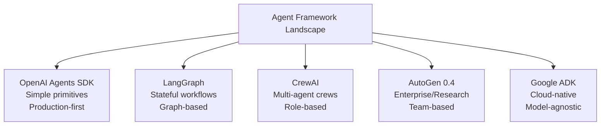

# Current State of Agent Technology

## Introduction

The AI agent landscape is evolving faster than any other area of software development. In 2023, agents were experimental toys. By early 2025, every major AI company shipped a production agent framework. Now in 2026, agents are standard components in enterprise software — but the landscape is fragmented, rapidly shifting, and still maturing.

This lesson maps the current state: what frameworks exist, who's using agents in production, what researchers are working on, and where the technology is heading.

### What we'll cover

- The current framework landscape and how it evolved
- Industry adoption patterns and production readiness
- Active research frontiers pushing agent capabilities
- The trajectory for 2026 and beyond
- How to position yourself in this rapidly moving field

### Prerequisites

- [What Are AI Agents?](./01-what-are-ai-agents.md)
- [Agent vs. Assistant vs. Chatbot](./02-agent-vs-assistant-vs-chatbot.md)
- [Autonomous vs. Semi-Autonomous Agents](./03-autonomous-vs-semi-autonomous.md)
- [Capabilities and Limitations](./04-capabilities-and-limitations.md)

---

## The framework landscape (2025–2026)

The agent framework ecosystem crystallized around five major players, each with a distinct philosophy. Understanding their differences is essential for choosing the right foundation for your projects.

### The big five



| Framework | Philosophy | Key Differentiator | Best For |
|-----------|-----------|-------------------|----------|
| **OpenAI Agents SDK** | "Few primitives, Python-first" | Handoffs, guardrails, built-in tracing | Production agents with OpenAI models |
| **LangGraph** | "Low-level orchestration" | Durable execution, graph-based state machines | Complex stateful workflows |
| **CrewAI** | "Multi-agent collaboration" | Flows, role-based agents, crew management | Team-of-agents architectures |
| **AutoGen 0.4** | "Enterprise research platform" | Teams, GraphFlow, Magentic-One | Enterprise and research applications |
| **Google ADK** | "Software development feel" | Vertex AI integration, A2A protocol | Google Cloud-native deployments |

### Framework maturity comparison

| Feature | OpenAI SDK | LangGraph | CrewAI | AutoGen | Google ADK |
|---------|-----------|-----------|--------|---------|------------|
| Ease of getting started | ✅ Simple | ⚠️ Steep | ✅ Simple | ⚠️ Moderate | ✅ Simple |
| Production readiness | ✅ High | ✅ High | ⚠️ Medium | ⚠️ Medium | ✅ High |
| Multi-agent support | ✅ Handoffs | ✅ Sub-graphs | ✅ Crews | ✅ Teams | ✅ Hierarchy |
| Human-in-the-loop | ✅ Built-in | ✅ Interrupts | ⚠️ Manual | ✅ Built-in | ✅ Callbacks |
| MCP integration | ✅ Native | ✅ Via LangChain | ✅ Native | ⚠️ Manual | ✅ Native |
| Observability | ✅ Built-in tracing | ✅ LangSmith | ⚠️ Basic | ⚠️ Basic | ✅ Cloud Logging |
| Model flexibility | ⚠️ OpenAI + LiteLLM | ✅ Any model | ✅ Any model | ✅ Any model | ✅ Any model |

### Code comparison: the same agent in each framework

**The task:** Build an agent that searches the web and answers questions.

**OpenAI Agents SDK:**
```python
from agents import Agent, Runner, function_tool

@function_tool
def search_web(query: str) -> str:
    """Search the web for information."""
    return f"Results for: {query}"

agent = Agent(
    name="Research Assistant",
    instructions="Search the web to answer questions accurately.",
    tools=[search_web]
)

result = Runner.run_sync(agent, "What is the population of Tokyo?")
print(result.final_output)
```

**LangGraph:**
```python
from langgraph.graph import StateGraph, MessagesState, START, END
from langchain_openai import ChatOpenAI
from langchain_core.tools import tool

@tool
def search_web(query: str) -> str:
    """Search the web for information."""
    return f"Results for: {query}"

model = ChatOpenAI(model="gpt-4o").bind_tools([search_web])

def agent_node(state: MessagesState):
    return {"messages": [model.invoke(state["messages"])]}

def tool_node(state: MessagesState):
    # Execute tool calls from the last message
    results = []
    for tc in state["messages"][-1].tool_calls:
        result = search_web.invoke(tc["args"])
        results.append({"role": "tool", "content": result, "tool_call_id": tc["id"]})
    return {"messages": results}

graph = StateGraph(MessagesState)
graph.add_node("agent", agent_node)
graph.add_node("tools", tool_node)
graph.add_edge(START, "agent")
graph.add_conditional_edges("agent", lambda s: "tools" if s["messages"][-1].tool_calls else END)
graph.add_edge("tools", "agent")

app = graph.compile()
result = app.invoke({"messages": [{"role": "user", "content": "What is the population of Tokyo?"}]})
```

**Google ADK:**
```python
from google.adk.agents import LlmAgent
from google.adk.tools import FunctionTool

def search_web(query: str) -> str:
    """Search the web for information."""
    return f"Results for: {query}"

agent = LlmAgent(
    name="research_assistant",
    model="gemini-2.0-flash",
    instruction="Search the web to answer questions accurately.",
    tools=[search_web]
)
```

> **💡 Tip:** OpenAI Agents SDK is the easiest to start with. LangGraph offers the most control. Choose based on your complexity needs, not framework popularity.

---

## Industry adoption

### Who's using agents in production

Agent adoption has accelerated dramatically through 2025–2026:

| Sector | Adoption Level | Primary Use Cases |
|--------|---------------|-------------------|
| **Software Development** | ✅ Widespread | Code generation, testing, code review, debugging |
| **Customer Support** | ✅ Widespread | Tier 1 automation, ticket routing, knowledge base search |
| **Financial Services** | ✅ Growing | Report generation, compliance checking, data analysis |
| **Healthcare** | ⚠️ Cautious | Research synthesis, documentation, not direct patient care |
| **Legal** | ⚠️ Cautious | Document review, contract analysis, research |
| **E-commerce** | ✅ Growing | Product recommendations, order management, returns |
| **DevOps** | ✅ Growing | Incident response, deployment automation, monitoring |

### Adoption statistics (2025–2026)

```python
adoption_stats = {
    "enterprise_projects_with_agents": "85%+",
    "framework_adoption_growth_2024_2025": "340%",
    "average_tools_per_production_agent": "12+",
    "multi_agent_systems_complex_workflows": "60%",
    "companies_with_dedicated_agent_teams": "45%",
    "average_roi_customer_support_agents": "35-50%",
}

for stat, value in adoption_stats.items():
    print(f"{stat.replace('_', ' ').title()}: {value}")
```

**Output:**
```
Enterprise Projects With Agents: 85%+
Framework Adoption Growth 2024 2025: 340%
Average Tools Per Production Agent: 12+
Multi Agent Systems Complex Workflows: 60%
Companies With Dedicated Agent Teams: 45%
Average Roi Customer Support Agents: 35-50%
```

### Production readiness checklist

Before taking an agent to production, organizations typically validate:

| Requirement | Description |
|------------|-------------|
| **Observability** | Full tracing of every agent step, tool call, and decision |
| **Guardrails** | Input/output validation, action allowlists, budget limits |
| **Fallback paths** | Graceful degradation when the agent fails |
| **Human escalation** | Clear path to human review for edge cases |
| **Cost controls** | Per-run and daily budget caps |
| **Testing** | Evaluation suites covering happy paths, edge cases, and adversarial inputs |
| **Security** | Sandboxed execution, least-privilege tool access |
| **Monitoring** | Real-time dashboards for success rates, latency, and cost |

---

## Research frontiers

Several active research areas will shape the next generation of agents.

### 1. Agent-to-Agent communication (A2A)

Google's A2A protocol (2025) enables agents from different frameworks and organizations to discover, communicate with, and delegate tasks to each other.

```python
# A2A concept: agents discover and delegate to each other
a2a_flow = {
    "step_1": "Agent A receives complex task",
    "step_2": "Agent A discovers Agent B specializes in data analysis",
    "step_3": "Agent A delegates sub-task to Agent B via A2A protocol",
    "step_4": "Agent B completes analysis and returns results",
    "step_5": "Agent A integrates results into final output"
}

for step, description in a2a_flow.items():
    print(f"{step}: {description}")
```

**Output:**
```
step_1: Agent A receives complex task
step_2: Agent A discovers Agent B specializes in data analysis
step_3: Agent A delegates sub-task to Agent B via A2A protocol
step_4: Agent B completes analysis and returns results
step_5: Agent A integrates results into final output
```

### 2. Long-horizon planning

Current agents plan 5–10 steps ahead reliably. Research is pushing toward agents that can plan and execute 100+ step workflows with hierarchical sub-goals.

| Approach | Description | Status |
|----------|-------------|--------|
| **Hierarchical planning** | Decompose into sub-goals, each a mini-agent run | ⚠️ Active research |
| **Monte Carlo tree search** | Explore multiple action paths, select the best | ⚠️ Experimental |
| **Learning from execution traces** | Fine-tune planning from successful past runs | ⚠️ Early results |
| **External memory and retrieval** | Store and retrieve plans from previous similar tasks | ✅ Being adopted |

### 3. Self-improvement and learning

Agents that learn from their mistakes and improve over time:

| Technique | How It Works | Maturity |
|-----------|-------------|----------|
| **Reflection** | Agent reviews its own output and self-corrects | ✅ Production-ready |
| **Experience replay** | Store successful traces, retrieve for similar tasks | ⚠️ Emerging |
| **Fine-tuning from traces** | Distill successful agent runs into model weights | ⚠️ Active research |
| **Reinforcement learning from execution** | Reward signals from successful task completion | ❌ Early research |

### 4. Multimodal agents

Agents that perceive and act across text, image, audio, and video:

- **Vision agents**: Read screenshots, understand charts, navigate UIs
- **Audio agents**: Process speech, participate in conversations, transcribe and analyze
- **Video agents**: Analyze video content, generate visual reports
- **Cross-modal reasoning**: "Look at this chart and explain the trend in audio"

### 5. MCP as universal tool protocol

The Model Context Protocol (MCP) is becoming the standard for how agents connect to tools, replacing custom integrations:

```python
# Before MCP: Every framework had its own tool integration
openai_tool = {"type": "function", "function": {...}}    # OpenAI format
langchain_tool = @tool def my_func(): ...                 # LangChain format
crewai_tool = class MyTool(BaseTool): ...                 # CrewAI format

# After MCP: One standard, every framework supports it
# Agent connects to MCP server → gets tools automatically
# Works across OpenAI SDK, LangGraph, CrewAI, ADK
```

---

## Future trajectory (2026 and beyond)

### Near-term predictions (2026)

| Trend | Likelihood | Impact |
|-------|-----------|--------|
| MCP becomes industry standard | ✅ Very high | Universal tool interoperability |
| Multi-agent systems go mainstream | ✅ High | Complex workflows split across specialist agents |
| Agent evaluation and testing mature | ✅ High | Standardized benchmarks and evaluation frameworks |
| Computer use agents become practical | ⚠️ Medium | Browser automation replaces many RPA workflows |
| A2A protocol gains adoption | ⚠️ Medium | Cross-organization agent collaboration |
| Agents handle 50%+ of Tier 1 support | ✅ High | Major shift in support operations |

### Career implications

The agent ecosystem creates several new career paths:

| Role | Focus | Demand |
|------|-------|--------|
| **Agent Developer** | Build and deploy production agents | 🔥 Very High |
| **Agent Architect** | Design multi-agent systems and workflows | 🔥 High |
| **AI/Agent Platform Engineer** | Build infrastructure for running agents at scale | 🔥 High |
| **Agent QA/Evaluation Engineer** | Test and evaluate agent reliability | 📈 Growing |
| **Prompt Engineer (Agent-focused)** | Craft system prompts and tool descriptions for agents | 📈 Growing |

> **🤖 AI Context:** According to our job market research, agent development skills command premium salaries of $150K–$300K+ (US) and ₹15–40 LPA (India), with demand growing 340% year-over-year.

---

## Positioning yourself

### Essential skills for 2026

```python
skills_priority = {
    "must_have": [
        "At least one agent framework (OpenAI SDK or LangGraph)",
        "MCP server and client implementation",
        "Agent observability and debugging",
        "Human-in-the-loop patterns",
        "Tool design and prompt engineering for agents",
    ],
    "high_value": [
        "Multi-agent orchestration",
        "Agent evaluation and testing",
        "Production deployment (containerization, scaling)",
        "Multiple frameworks (flexibility across projects)",
    ],
    "emerging": [
        "A2A protocol implementation",
        "Agent fine-tuning and distillation",
        "Computer use and browser automation agents",
        "Voice agent development",
    ]
}

for category, skills in skills_priority.items():
    print(f"\n{category.upper().replace('_', ' ')}:")
    for skill in skills:
        print(f"  • {skill}")
```

**Output:**
```
MUST HAVE:
  • At least one agent framework (OpenAI SDK or LangGraph)
  • MCP server and client implementation
  • Agent observability and debugging
  • Human-in-the-loop patterns
  • Tool design and prompt engineering for agents

HIGH VALUE:
  • Multi-agent orchestration
  • Agent evaluation and testing
  • Production deployment (containerization, scaling)
  • Multiple frameworks (flexibility across projects)

EMERGING:
  • A2A protocol implementation
  • Agent fine-tuning and distillation
  • Computer use and browser automation agents
  • Voice agent development
```

### What this course covers

The remaining lessons in Unit 11 are designed to build these skills systematically:

| Lessons | Skills Built |
|---------|-------------|
| 02–09 | Core agent architecture, memory, tools, execution, error handling |
| 10–16 | All five major frameworks + MCP integration |
| 17–25 | Production patterns: deployment, observability, testing, security |

---

## Best practices

| Practice | Why It Matters |
|----------|----------------|
| Learn one framework deeply, then explore others | Depth before breadth — agent concepts transfer across frameworks |
| Follow framework changelogs weekly | The landscape changes fast — stay current |
| Build real projects, not just tutorials | Production agent development reveals challenges tutorials skip |
| Join framework communities | Discord servers and forums are where best practices emerge first |
| Invest in observability skills | Debugging agents is harder than building them |
| Practice tool design | The quality of your tools determines the quality of your agents |

---

## Common pitfalls

| ❌ Mistake | ✅ Solution |
|-----------|-------------|
| Trying to learn all 5 frameworks at once | Master one (OpenAI SDK or LangGraph), then expand |
| Chasing the newest framework | Evaluate based on production needs, not hype |
| Ignoring framework fundamentals for advanced features | Understand the agent loop before multi-agent systems |
| Building without observability | Add tracing from the first line of code |
| Assuming frameworks handle everything | Understand the underlying LLM calls — frameworks are thin wrappers |
| Not reading the official docs | Community tutorials lag behind — official docs are the source of truth |

---

## Hands-on exercise

### Your task

Create a framework comparison document by building the same simple agent in two different frameworks.

### Requirements

1. Choose two frameworks from: OpenAI Agents SDK, LangGraph, Google ADK
2. Build an agent in each that uses a `calculate` tool and a `lookup` tool
3. Compare: lines of code, ease of setup, debugging experience, output quality
4. Write a short comparison summary (5–10 sentences)

### Expected result

A document comparing the two frameworks across:
- Setup complexity (pip installs, configuration)
- Code volume (lines to achieve the same result)
- Developer experience (debugging, error messages, documentation)
- Your recommendation for when to use each

<details>
<summary>💡 Hints (click to expand)</summary>

- Start with the code examples from this lesson
- OpenAI SDK needs: `pip install openai-agents`
- LangGraph needs: `pip install langgraph langchain-openai`
- Google ADK needs: `pip install google-adk`
- Focus on the developer experience, not just getting it to work

</details>

<details>
<summary>✅ Solution (click to expand)</summary>

```python
# Framework Comparison: OpenAI Agents SDK vs LangGraph

# --- SETUP ---
# OpenAI SDK: pip install openai-agents
# LangGraph:  pip install langgraph langchain-openai

# --- OPENAI AGENTS SDK VERSION (12 lines) ---
from agents import Agent, Runner, function_tool

@function_tool
def calculate(expression: str) -> str:
    """Calculate a math expression."""
    return str(eval(expression))

@function_tool
def lookup(topic: str) -> str:
    """Look up a fact."""
    facts = {"python": "Created by Guido van Rossum in 1991"}
    return facts.get(topic.lower(), "Not found")

oai_agent = Agent(
    name="Helper",
    instructions="Use tools to answer questions.",
    tools=[calculate, lookup]
)

oai_result = Runner.run_sync(oai_agent, "When was Python created?")
print(f"OpenAI SDK: {oai_result.final_output}")

# --- LANGGRAPH VERSION (35 lines) ---
from langgraph.graph import StateGraph, MessagesState, START, END
from langchain_openai import ChatOpenAI
from langchain_core.tools import tool

@tool
def calculate_lg(expression: str) -> str:
    """Calculate a math expression."""
    return str(eval(expression))

@tool
def lookup_lg(topic: str) -> str:
    """Look up a fact."""
    facts = {"python": "Created by Guido van Rossum in 1991"}
    return facts.get(topic.lower(), "Not found")

tools = [calculate_lg, lookup_lg]
model = ChatOpenAI(model="gpt-4o").bind_tools(tools)
tool_map = {"calculate_lg": calculate_lg, "lookup_lg": lookup_lg}

def agent_node(state: MessagesState):
    return {"messages": [model.invoke(state["messages"])]}

def tool_node(state: MessagesState):
    results = []
    for tc in state["messages"][-1].tool_calls:
        result = tool_map[tc["name"]].invoke(tc["args"])
        results.append({"role": "tool", "content": result, "tool_call_id": tc["id"]})
    return {"messages": results}

def should_continue(state: MessagesState):
    return "tools" if state["messages"][-1].tool_calls else END

graph = StateGraph(MessagesState)
graph.add_node("agent", agent_node)
graph.add_node("tools", tool_node)
graph.add_edge(START, "agent")
graph.add_conditional_edges("agent", should_continue)
graph.add_edge("tools", "agent")
app = graph.compile()

lg_result = app.invoke({"messages": [{"role": "user", "content": "When was Python created?"}]})
print(f"LangGraph: {lg_result['messages'][-1].content}")

# --- COMPARISON ---
comparison = """
COMPARISON SUMMARY:
- OpenAI SDK: 12 lines, minimal setup, automatic agent loop
- LangGraph: 35 lines, explicit graph definition, full state control
- OpenAI SDK is 3x less code for the same result
- LangGraph gives you complete control over the execution graph
- OpenAI SDK: best for straightforward agents with OpenAI models
- LangGraph: best when you need custom state, persistence, or complex workflows
"""
print(comparison)
```

</details>

### Bonus challenges

- [ ] Add Google ADK as a third comparison point
- [ ] Benchmark response latency across frameworks for the same query
- [ ] Test error handling — what happens when a tool fails in each framework?

---

## Summary

✅ The **Big Five frameworks** (OpenAI SDK, LangGraph, CrewAI, AutoGen, Google ADK) each serve different needs — learn one deeply first, then expand

✅ **85%+ of enterprise AI projects** now include agent capabilities, with 340% adoption growth in 2024–2025

✅ Active research frontiers include **A2A communication, long-horizon planning, self-improvement**, and **multimodal agents**

✅ **MCP is becoming the universal standard** for agent-tool integration, supported across all major frameworks

✅ **Career demand** for agent developers is at an all-time high — master one framework, build real projects, invest in observability skills

**Next:** [Agent Architecture →](../02-agent-architecture/00-agent-architecture.md)

---

## Further reading

- [OpenAI Agents SDK Documentation](https://openai.github.io/openai-agents-python/) - Production-ready Python agent framework
- [LangGraph Documentation](https://docs.langchain.com/oss/python/langgraph/overview) - Stateful agent orchestration
- [CrewAI Documentation](https://docs.crewai.com/) - Multi-agent crew framework
- [AutoGen Documentation](https://microsoft.github.io/autogen/stable/) - Microsoft's agent framework
- [Google ADK Documentation](https://google.github.io/adk-docs/) - Google's Agent Development Kit
- [Building Effective Agents — Anthropic](https://www.anthropic.com/engineering/building-effective-agents) - Agent patterns and best practices

*[Back to Agent Fundamentals](./00-agent-fundamentals.md)*

<!-- 
Sources Consulted:
- OpenAI Agents SDK: https://openai.github.io/openai-agents-python/
- LangGraph overview: https://docs.langchain.com/oss/python/langgraph/overview
- LangChain agents: https://docs.langchain.com/oss/python/langchain/overview
- Google ADK: https://google.github.io/adk-docs/
- Anthropic Building Effective Agents: https://www.anthropic.com/engineering/building-effective-agents
- Unit 11 overview resources: 00-overview.md
-->
