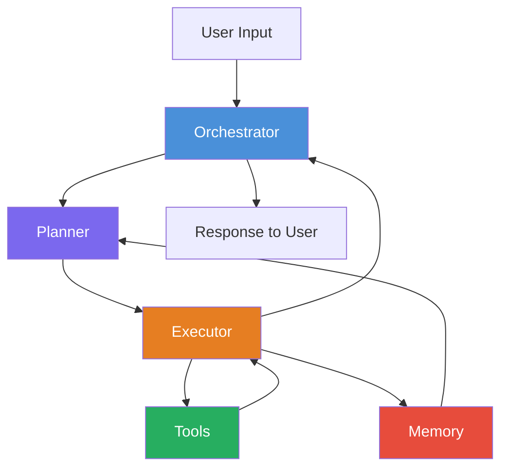
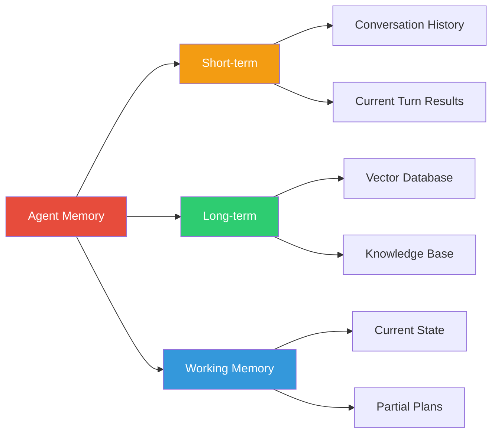
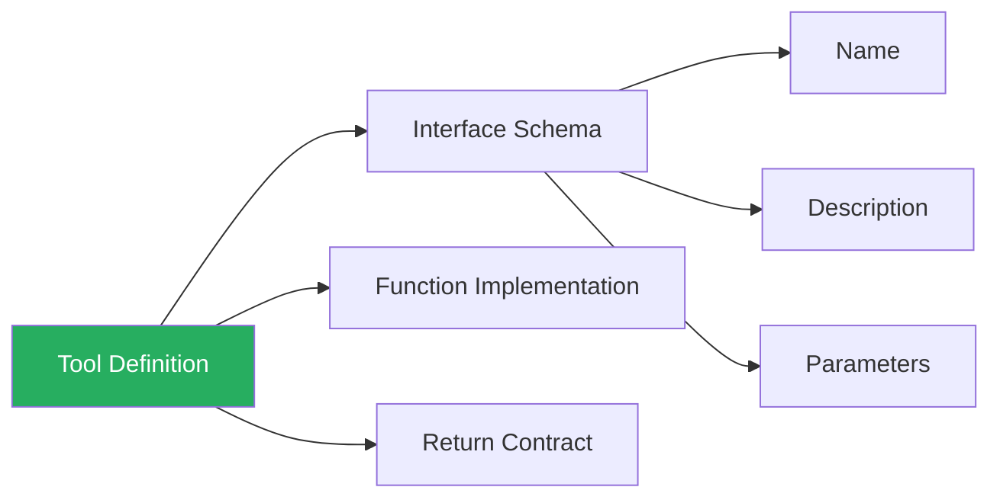
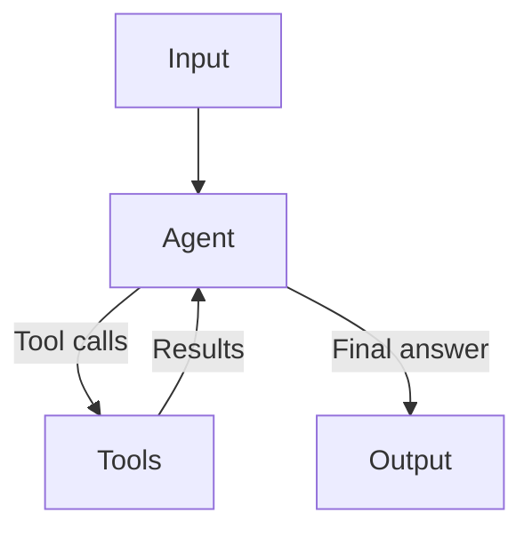
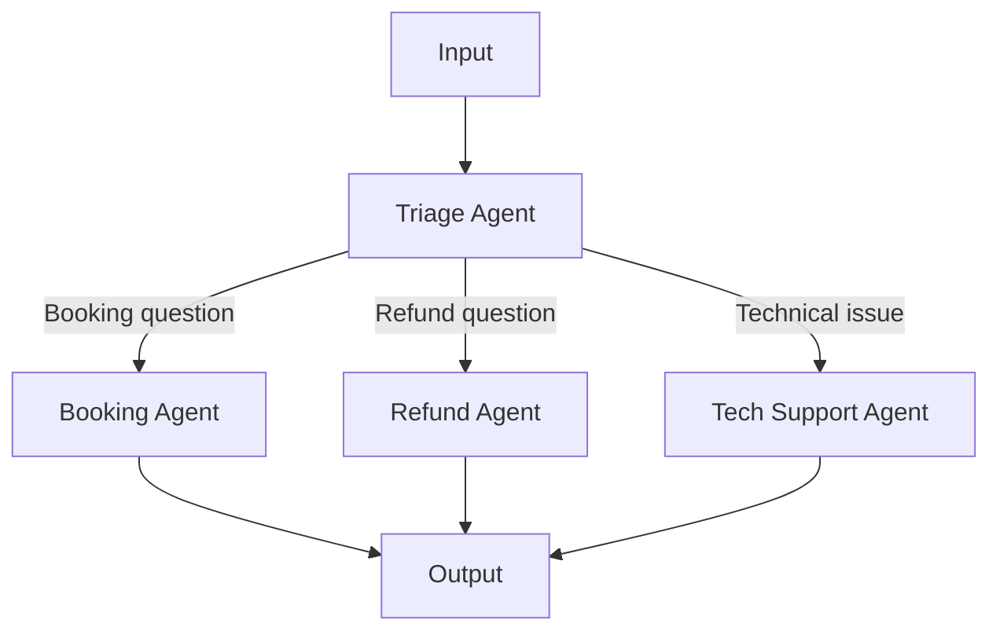
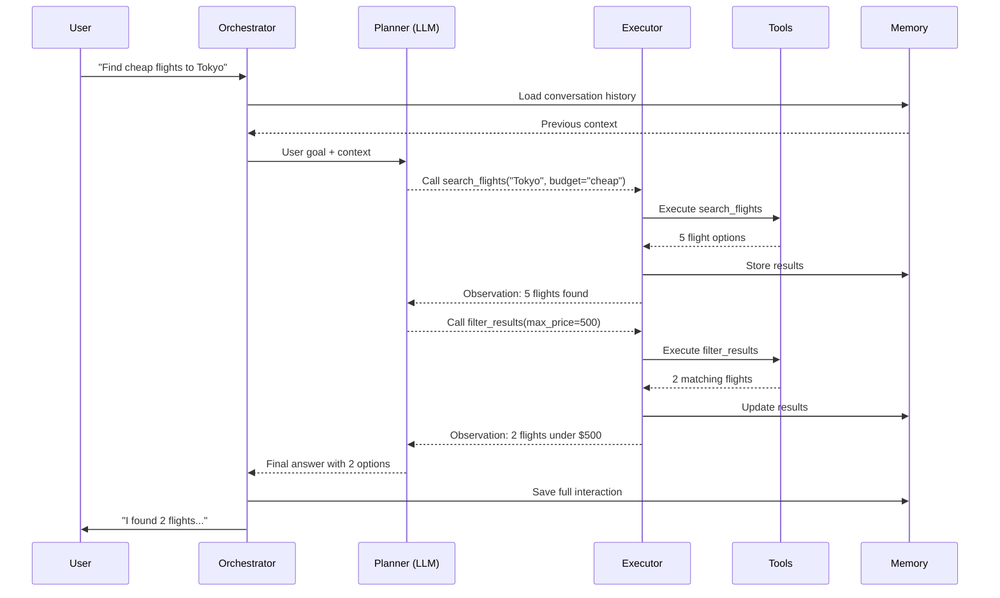

# Core components of agent architecture

## Introduction

Every AI agent — whether a simple ReAct loop or a complex multi-agent system — is built from the same five fundamental components. Understanding these building blocks is like understanding the organs of a living system: each has a specific role, and the agent's capabilities emerge from how they work together.

In this lesson, we examine each component in detail, see how major frameworks implement them, and learn the design principles that make agents reliable in production.

### What we'll cover

- The five core components: planner, memory, tools, executor, and orchestrator
- How each component maps to real framework implementations
- The interaction patterns between components
- Design principles for each building block

### Prerequisites

- Completed [Agent Fundamentals](../01-agent-fundamentals/00-agent-fundamentals.md)
- Understanding of LLM API concepts (system prompts, function calling)
- Basic Python programming

---

## The five building blocks

At the highest level, every agent system contains five components that work together in a cycle. Before we dive into each one, here's how they relate:



Each component has a clear responsibility:

| Component | Responsibility | Analogy |
|-----------|---------------|---------|
| **Orchestrator** | Coordinates the overall execution flow | The conductor of an orchestra |
| **Planner** | Decides *what* to do next | The strategist planning the route |
| **Executor** | Carries out planned actions | The worker performing tasks |
| **Tools** | Provide capabilities beyond language | The instruments and equipment |
| **Memory** | Stores and retrieves contextual information | The notebook and filing system |

> **🤖 AI Context:** Anthropic's research on building effective agents emphasizes that "agents are typically just LLMs using tools based on environmental feedback in a loop." The five components we describe here are the structural breakdown of that loop.

---

## The planner

The planner is the "brain" of the agent — it's the component that decides what action to take next based on the current situation. In most modern agents, the planner *is* the LLM itself, guided by carefully crafted instructions.

### What the planner does

1. **Analyzes the current goal** — Understands what the user wants to achieve
2. **Evaluates available information** — Reviews what's known from memory and prior observations
3. **Selects the next action** — Chooses which tool to call or whether to respond directly
4. **Generates reasoning traces** — Produces "thinking" that explains its decision-making

### Planner in OpenAI Agents SDK

In the OpenAI Agents SDK, the planner is configured through the `Agent` object's instructions and model:

```python
from agents import Agent, ModelSettings

research_agent = Agent(
    name="Research Agent",
    instructions="""You are a research assistant. When given a question:
    1. Break it down into searchable sub-questions
    2. Search for each sub-question
    3. Synthesize findings into a coherent answer
    
    Always verify claims with multiple sources.""",
    model="gpt-4o",
    model_settings=ModelSettings(temperature=0.1),
    tools=[web_search, read_document],
)
```

The LLM's instruction serves as the planner's strategy. The `temperature=0.1` setting makes planning more deterministic and consistent.

### Planner in LangGraph

In LangGraph, the planner is often an explicit node in the graph that decides what happens next:

```python
from typing import Literal
from langgraph.graph import StateGraph, MessagesState, START, END

def planner_node(state: MessagesState) -> dict:
    """The planner decides the next action based on current state."""
    response = llm_with_tools.invoke(
        [SystemMessage(content="Analyze the task and decide the next step.")]
        + state["messages"]
    )
    return {"messages": [response]}

def should_continue(state: MessagesState) -> Literal["tool_node", END]:
    """Routing function: continue with tools or finish."""
    last_message = state["messages"][-1]
    if last_message.tool_calls:
        return "tool_node"
    return END

# The planner drives the loop
builder = StateGraph(MessagesState)
builder.add_node("planner", planner_node)
builder.add_node("tool_node", tool_node)
builder.add_edge(START, "planner")
builder.add_conditional_edges("planner", should_continue)
builder.add_edge("tool_node", "planner")
```

### Planner in Google ADK

Google ADK uses `LlmAgent` as the planner, with instructions guiding its reasoning:

```python
from google.adk.agents import LlmAgent

planner_agent = LlmAgent(
    name="research_planner",
    model="gemini-2.0-flash",
    instruction="""You are a research planner. Break complex questions
    into steps and use the available tools to find answers.
    Always explain your reasoning before taking action.""",
    tools=[search_tool, calculator_tool],
)
```

### Design principles for planners

| Principle | Why it matters |
|-----------|---------------|
| Clear instructions | Ambiguous instructions lead to unpredictable behavior |
| Specific task framing | "You are a research assistant" beats "You are helpful" |
| Step-by-step guidance | Reduces planning errors on complex tasks |
| Low temperature | Makes planning more deterministic and reproducible |

---

## The memory system

Memory gives agents the ability to retain and recall information across the execution cycle. Without memory, an agent would forget what it has already done, repeat actions, or lose track of its goals.

### Types of agent memory



| Memory type | Scope | Duration | Example |
|-------------|-------|----------|---------|
| **Short-term** | Current conversation | Single session | Chat message history |
| **Working** | Current task | Single agent run | Intermediate tool results, partial plans |
| **Long-term** | Across sessions | Persistent | User preferences, past interactions |

### Short-term memory: conversation history

Every framework manages conversation history, but the approaches differ:

**OpenAI Agents SDK — sessions:**

```python
from agents import Agent, Runner, SQLiteSession

agent = Agent(name="Assistant", instructions="Reply concisely.")

# Session automatically stores and retrieves conversation history
session = SQLiteSession("user_123_conversation")

# First turn
result = await Runner.run(agent, "What is Python?", session=session)
print(result.final_output)

# Second turn — agent remembers the first turn
result = await Runner.run(agent, "How does it compare to JavaScript?", session=session)
print(result.final_output)
```

**LangGraph — state-based messages:**

```python
from langgraph.graph import MessagesState
from langgraph.checkpoint.memory import MemorySaver

class AgentState(MessagesState):
    """Messages are automatically accumulated via add_messages reducer."""
    documents: list[str]

# Checkpointer enables persistent memory across runs
checkpointer = MemorySaver()
graph = builder.compile(checkpointer=checkpointer)

# Each invocation with the same thread_id shares memory
config = {"configurable": {"thread_id": "user_123"}}
graph.invoke({"messages": [HumanMessage(content="Hello")]}, config)
```

**Google ADK — session service:**

```python
from google.adk.sessions import InMemorySessionService

session_service = InMemorySessionService()

# Create a session for the user
session = await session_service.create_session(
    app_name="my_agent",
    user_id="user_123"
)
# Session state persists across invocations
session.state["user_name"] = "Alice"
```

### Working memory: current task state

Working memory holds the intermediate results of the current agent run — tool call outputs, partial plans, and accumulated observations. In most frameworks, this is managed through the agent loop's internal state.

```python
# Working memory example — accumulating tool results
class AgentWorkingMemory:
    """Tracks the agent's current task progress."""
    
    def __init__(self):
        self.goal: str = ""
        self.plan: list[str] = []
        self.completed_steps: list[dict] = []
        self.observations: list[str] = []
        self.current_step: int = 0
    
    def add_observation(self, step: str, result: str):
        """Record a tool result as an observation."""
        self.completed_steps.append({"step": step, "result": result})
        self.observations.append(result)
        self.current_step += 1
    
    def get_context_for_planner(self) -> str:
        """Format working memory for the planner's next decision."""
        context = f"Goal: {self.goal}\n"
        context += f"Plan: {self.plan}\n"
        context += f"Completed: {len(self.completed_steps)}/{len(self.plan)}\n"
        for step in self.completed_steps:
            context += f"  - {step['step']}: {step['result']}\n"
        return context
```

**Output:**
```
Goal: Research Python frameworks
Plan: ['Search for top frameworks', 'Compare features', 'Write summary']
Completed: 1/3
  - Search for top frameworks: Found Django, Flask, FastAPI
```

> **Note:** The distinction between short-term and working memory is important. Short-term memory survives across turns in a conversation. Working memory is scoped to a single agent invocation and is discarded when the task completes.

---

## The tool interface

Tools extend an agent beyond what the LLM can do alone. They provide the ability to interact with the outside world — reading files, calling APIs, executing code, searching the web, and more.

### Anatomy of a tool

Every tool, regardless of framework, has three essential parts:



| Part | Purpose | Example |
|------|---------|---------|
| **Name** | How the LLM references the tool | `"search_web"` |
| **Description** | What the tool does (critical for LLM selection) | `"Search the web for current information"` |
| **Parameters** | Input schema with types and constraints | `{"query": str, "max_results": int}` |
| **Return value** | What the tool gives back to the agent | `str` or structured data |

### Tool definitions across frameworks

**OpenAI Agents SDK:**

```python
from agents import function_tool

@function_tool
def search_database(query: str, limit: int = 10) -> str:
    """Search the product database for items matching the query.
    
    Args:
        query: The search query to match against product names
        limit: Maximum number of results to return
    
    Returns:
        A formatted string of matching products
    """
    results = db.search(query, limit=limit)
    return "\n".join(f"- {r.name}: ${r.price}" for r in results)
```

**LangGraph / LangChain:**

```python
from langchain.tools import tool

@tool
def search_database(query: str, limit: int = 10) -> str:
    """Search the product database for items matching the query.
    
    Args:
        query: The search query to match against product names
        limit: Maximum number of results to return
    """
    results = db.search(query, limit=limit)
    return "\n".join(f"- {r.name}: ${r.price}" for r in results)

# Bind tools to the LLM
llm_with_tools = llm.bind_tools([search_database])
```

**Google ADK:**

```python
from google.adk.tools import FunctionTool

def search_database(query: str, limit: int = 10) -> dict:
    """Search the product database for items matching the query."""
    results = db.search(query, limit=limit)
    return {"products": [{"name": r.name, "price": r.price} for r in results]}

search_tool = FunctionTool(func=search_database)
```

### Tool design best practices

Anthropic's research emphasizes that tool design deserves as much attention as prompt engineering. They call this the **Agent-Computer Interface (ACI)**:

| Practice | Why it matters |
|----------|---------------|
| Write detailed descriptions | The LLM selects tools based on descriptions — vague ones cause misuse |
| Use absolute paths, not relative | Avoids errors when the agent's context shifts |
| Include example usage in docstrings | Helps the LLM understand edge cases |
| Return structured data | Easier for the LLM to parse than unstructured text |
| Handle errors gracefully | Return error messages rather than raising exceptions |
| Keep parameters simple | Fewer parameters means fewer opportunities for mistakes |

> **Important:** As Anthropic notes: "We actually spent more time optimizing our tools than the overall prompt" when building their SWE-bench agent. Tool quality directly determines agent quality.

---

## The executor

The executor is the runtime engine that carries out the planner's decisions. It takes a planned action (typically a tool call), runs it, captures the result, and feeds it back into the loop.

### Executor responsibilities

1. **Parse tool calls** — Extract the tool name and arguments from the LLM's output
2. **Validate inputs** — Check that arguments match the tool's expected schema
3. **Execute the tool** — Run the function and capture output or errors
4. **Format results** — Package tool outputs for the planner to interpret
5. **Handle failures** — Catch exceptions and present them as observations

### Executor in OpenAI Agents SDK

The executor is built into the `Runner` class. When the LLM produces tool calls, the runner automatically executes them:

```python
from agents import Agent, Runner, function_tool

@function_tool
def get_weather(city: str) -> str:
    """Returns weather info for the specified city."""
    return f"The weather in {city} is 72°F and sunny"

agent = Agent(
    name="Weather Agent",
    instructions="Help users check weather.",
    tools=[get_weather],
)

# The Runner is the executor — it handles the full loop
result = await Runner.run(agent, "What's the weather in Tokyo?")
print(result.final_output)
```

**Output:**
```
The weather in Tokyo is 72°F and sunny.
```

The `Runner.run()` method internally loops: call LLM → execute tools → call LLM again → until the LLM produces a final text response.

### Executor in Google ADK

Google ADK's executor is the `Runner`, which orchestrates the event loop:

```python
from google.adk.runners import Runner
from google.adk.sessions import InMemorySessionService

runner = Runner(
    agent=my_agent,
    app_name="my_app",
    session_service=InMemorySessionService(),
)

# The runner drives the event loop:
# 1. Send user query
# 2. Agent yields events (tool calls, responses)
# 3. Runner processes events (commits state)
# 4. Agent resumes
async for event in runner.run_async(
    user_id="user_1",
    session_id="session_1",
    new_message="What's the weather?",
):
    if event.content and event.content.parts:
        print(event.content.parts[0].text)
```

### Error handling in the executor

Robust executors handle failures gracefully rather than crashing:

```python
class SafeExecutor:
    """An executor that converts exceptions to observations."""
    
    def __init__(self, tools: dict):
        self.tools = tools
    
    def execute(self, tool_name: str, arguments: dict) -> str:
        """Execute a tool call safely, returning an error message on failure."""
        if tool_name not in self.tools:
            return f"Error: Tool '{tool_name}' not found. Available: {list(self.tools.keys())}"
        
        try:
            result = self.tools[tool_name](**arguments)
            return str(result)
        except TypeError as e:
            return f"Error: Invalid arguments for '{tool_name}': {e}"
        except Exception as e:
            return f"Error executing '{tool_name}': {type(e).__name__}: {e}"
```

**Output:**
```
Error: Tool 'search_web' not found. Available: ['get_weather', 'calculate']
```

> **Tip:** Returning errors as text observations (rather than raising exceptions) lets the LLM self-correct. An agent that sees "Error: Invalid arguments" can often fix its tool call and try again.

---

## The orchestrator

The orchestrator is the top-level coordinator that manages the entire agent execution. It decides which agent to run, when to start and stop, and how to handle handoffs between specialized sub-agents.

### Simple vs. complex orchestration

**Simple orchestration** — a single agent loops until done:



**Complex orchestration** — multiple agents with handoffs:



### Orchestration patterns

Anthropic identifies five key orchestration patterns:

| Pattern | Description | When to use |
|---------|-------------|-------------|
| **Prompt chaining** | Sequential LLM calls, each processing the previous output | Well-defined steps with verification gates |
| **Routing** | Classify input and direct to specialized handlers | Distinct categories needing different treatment |
| **Parallelization** | Run multiple tasks simultaneously | Independent subtasks or multi-perspective evaluation |
| **Orchestrator-workers** | Central agent delegates to worker agents | Complex tasks where subtasks aren't known in advance |
| **Evaluator-optimizer** | One agent generates, another evaluates in a loop | Tasks with clear success criteria requiring iteration |

### Orchestration in OpenAI Agents SDK — handoffs

```python
from agents import Agent

booking_agent = Agent(
    name="Booking Agent",
    instructions="Handle flight booking requests.",
    tools=[search_flights, book_flight],
)

refund_agent = Agent(
    name="Refund Agent",
    instructions="Handle refund requests.",
    tools=[lookup_booking, process_refund],
)

# The triage agent orchestrates by handing off to specialists
triage_agent = Agent(
    name="Triage Agent",
    instructions=(
        "Determine the user's intent. "
        "For booking questions, hand off to the Booking Agent. "
        "For refund questions, hand off to the Refund Agent."
    ),
    handoffs=[booking_agent, refund_agent],
)
```

### Orchestration in LangGraph — graph-based

```python
from langgraph.graph import StateGraph, START, END

# Each agent is a node in the graph
builder = StateGraph(State)
builder.add_node("triage", triage_node)
builder.add_node("booking", booking_node)
builder.add_node("refund", refund_node)

# Edges define the orchestration flow
builder.add_edge(START, "triage")
builder.add_conditional_edges(
    "triage",
    route_by_intent,
    {"booking": "booking", "refund": "refund"},
)
builder.add_edge("booking", END)
builder.add_edge("refund", END)

graph = builder.compile()
```

---

## How components interact

In a real agent execution, the five components work together in a continuous cycle. Here's a complete trace of a typical interaction:



---

## Best practices

| Practice | Why it matters |
|----------|---------------|
| Keep components loosely coupled | Allows swapping implementations without rewriting everything |
| Make the planner's instructions explicit | Ambiguous planning leads to unreliable behavior |
| Design tools for the LLM, not the developer | Clear names and descriptions reduce tool misuse |
| Store observations in memory immediately | Prevents information loss if the agent crashes |
| Set execution limits (max turns) | Prevents infinite loops and runaway costs |
| Log every component interaction | Essential for debugging agent behavior |

---

## Common pitfalls

| ❌ Mistake | ✅ Solution |
|-----------|-------------|
| Vague planner instructions ("Be helpful") | Specific role + step-by-step strategy |
| Tools with ambiguous descriptions | Detailed docstrings with examples and edge cases |
| No memory between loop iterations | Accumulate observations in state/working memory |
| Executor crashes on tool errors | Return errors as text for self-correction |
| No turn limits on the orchestrator | Set `max_turns` to prevent infinite loops |
| Monolithic agent handling everything | Split into specialized agents with orchestration |

---

## Hands-on exercise

### Your task

Build a minimal agent architecture from scratch (no frameworks) that demonstrates all five components working together.

### Requirements

1. Create a `Planner` class that uses an LLM to decide the next action
2. Create a `Memory` class that stores conversation history and observations
3. Create at least two `Tool` functions (e.g., calculator and dictionary lookup)
4. Create an `Executor` that runs tools safely with error handling
5. Create an `Orchestrator` that coordinates the loop with a max of 5 turns

### Expected result

Your agent should be able to:
- Accept a user question
- Plan which tool to use
- Execute the tool
- Remember the result
- Answer the question using tool results

<details>
<summary>💡 Hints (click to expand)</summary>

- The planner can be as simple as an LLM call with a system prompt listing available tools
- Use a Python dictionary to map tool names to functions
- The executor should catch exceptions and return error strings
- The orchestrator loop: `while turns < max_turns: plan → execute → observe`
- Use `json.loads()` to parse structured tool calls from the LLM

</details>

<details>
<summary>✅ Solution (click to expand)</summary>

```python
import json
from openai import OpenAI

client = OpenAI()

# --- Memory ---
class Memory:
    def __init__(self):
        self.messages: list[dict] = []
        self.observations: list[str] = []
    
    def add_message(self, role: str, content: str):
        self.messages.append({"role": role, "content": content})
    
    def add_observation(self, obs: str):
        self.observations.append(obs)
    
    def get_history(self) -> list[dict]:
        return self.messages.copy()

# --- Tools ---
def calculate(expression: str) -> str:
    """Evaluate a math expression safely."""
    try:
        result = eval(expression, {"__builtins__": {}})
        return f"Result: {result}"
    except Exception as e:
        return f"Error: {e}"

def lookup_word(word: str) -> str:
    """Look up a word definition."""
    definitions = {
        "agent": "A system that uses an LLM to decide actions autonomously",
        "llm": "Large Language Model - an AI trained on text data",
    }
    return definitions.get(word.lower(), f"No definition found for '{word}'")

TOOLS = {"calculate": calculate, "lookup_word": lookup_word}

# --- Executor ---
class Executor:
    def __init__(self, tools: dict):
        self.tools = tools
    
    def run(self, tool_name: str, args: dict) -> str:
        if tool_name not in self.tools:
            return f"Error: Unknown tool '{tool_name}'"
        try:
            return self.tools[tool_name](**args)
        except Exception as e:
            return f"Error: {e}"

# --- Planner ---
class Planner:
    def __init__(self, tool_descriptions: str):
        self.system_prompt = f"""You are a helpful agent. 
Available tools: {tool_descriptions}

To use a tool, respond with JSON: {{"tool": "name", "args": {{"key": "value"}}}}
To give a final answer, respond with JSON: {{"answer": "your answer"}}"""
    
    def plan(self, messages: list[dict]) -> dict:
        response = client.chat.completions.create(
            model="gpt-4o-mini",
            messages=[{"role": "system", "content": self.system_prompt}] + messages,
            temperature=0.1,
        )
        return json.loads(response.choices[0].message.content)

# --- Orchestrator ---
class Orchestrator:
    def __init__(self, max_turns: int = 5):
        self.memory = Memory()
        self.executor = Executor(TOOLS)
        self.planner = Planner("calculate(expression), lookup_word(word)")
        self.max_turns = max_turns
    
    def run(self, user_input: str) -> str:
        self.memory.add_message("user", user_input)
        
        for turn in range(self.max_turns):
            plan = self.planner.plan(self.memory.get_history())
            
            if "answer" in plan:
                return plan["answer"]
            
            if "tool" in plan:
                result = self.executor.run(plan["tool"], plan.get("args", {}))
                self.memory.add_observation(result)
                self.memory.add_message("assistant", f"Tool: {plan['tool']} → {result}")
        
        return "Reached maximum turns without finding an answer."

# --- Run ---
agent = Orchestrator(max_turns=5)
answer = agent.run("What is 42 * 17?")
print(answer)
```

</details>

### Bonus challenges

- [ ] Add a third tool (e.g., web search simulation)
- [ ] Implement conversation memory that persists across multiple `run()` calls
- [ ] Add logging that shows each component's actions during execution

---

## Summary

✅ Every agent system is built from five core components: planner, memory, tools, executor, and orchestrator

✅ The **planner** (usually the LLM) decides what to do next based on instructions, goals, and observations

✅ **Memory** comes in three types — short-term (conversation), working (current task), and long-term (persistent)

✅ **Tools** extend the agent's capabilities — their descriptions are critical for correct LLM usage

✅ The **executor** runs tools safely and converts errors into self-correctable observations

✅ The **orchestrator** coordinates the overall flow, including multi-agent handoffs and turn limits

**Next:** [Agent Loop Structure](./02-agent-loop-structure.md)

---

## Further reading

- [Anthropic: Building Effective Agents](https://www.anthropic.com/engineering/building-effective-agents) — Authoritative guide to agent patterns and tool design
- [OpenAI Agents SDK: Agents](https://openai.github.io/openai-agents-python/agents/) — Agent configuration and multi-agent patterns
- [Google ADK: Core Concepts](https://google.github.io/adk-docs/get-started/about/) — ADK component overview
- [LangGraph: Graph API](https://docs.langchain.com/oss/python/langgraph/graph-api) — Nodes, edges, and state management

[Back to Agent Architecture Overview](./00-agent-architecture.md)

<!--
Sources Consulted:
- Anthropic Building Effective Agents: https://www.anthropic.com/engineering/building-effective-agents
- OpenAI Agents SDK - Agents: https://openai.github.io/openai-agents-python/agents/
- OpenAI Agents SDK - Running Agents: https://openai.github.io/openai-agents-python/running_agents/
- OpenAI Agents SDK - Context Management: https://openai.github.io/openai-agents-python/context/
- Google ADK - Core Concepts: https://google.github.io/adk-docs/get-started/about/
- Google ADK - Event Loop: https://google.github.io/adk-docs/runtime/event-loop/
- LangGraph - Graph API: https://docs.langchain.com/oss/python/langgraph/graph-api
- LangGraph - Workflows and Agents: https://docs.langchain.com/oss/python/langgraph/workflows-agents
-->
