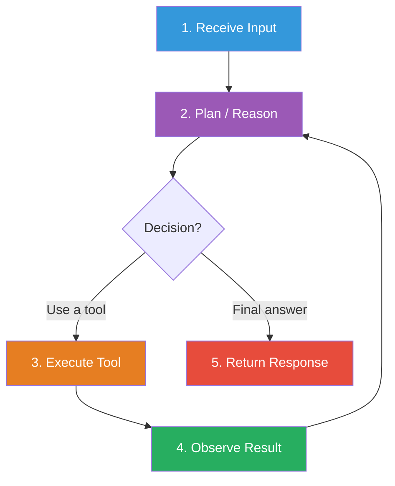
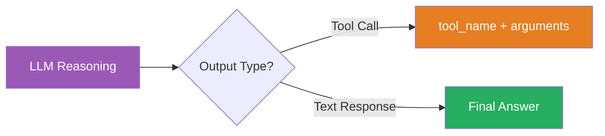
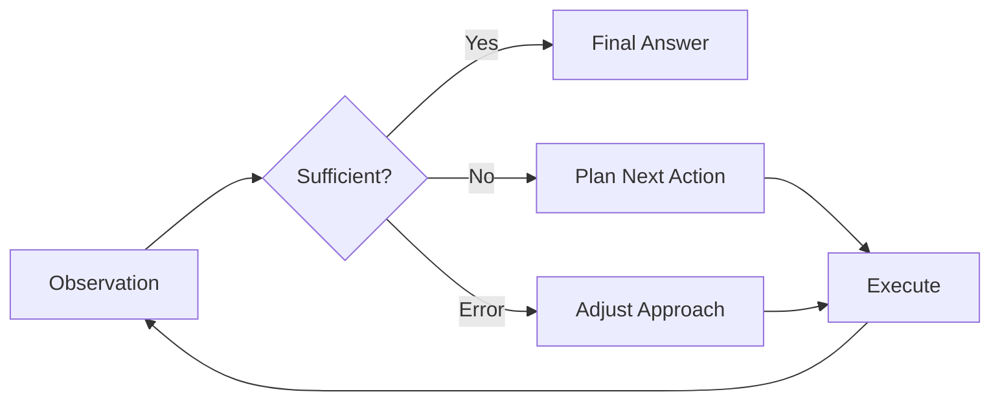

# Agent loop structure

## Introduction

The agent loop is the heartbeat of every AI agent system. It's the recurring cycle where the agent perceives its environment, reasons about what to do next, takes action, and observes the results — then repeats until the task is complete. Understanding this loop is crucial because every architectural decision you make ultimately affects how this cycle runs.

In this lesson, we trace through the complete agent loop, compare how major frameworks implement it, and learn how to control the loop's behavior for production reliability.

### What we'll cover

- The five phases of the agent loop: input → planning → action selection → execution → observation
- How the loop terminates (final output, max turns, errors)
- Framework implementations: OpenAI Agents SDK, LangGraph, and Google ADK
- Loop control patterns: turn limits, guardrails, and streaming

### Prerequisites

- Completed [Core Components](./01-core-components.md)
- Understanding of LLM tool calling
- Familiarity with async/await in Python

---

## The canonical agent loop

Every agent framework implements some variation of the same fundamental loop. We call it the **perception-reasoning-action (PRA) cycle**:



Let's walk through each phase in detail.

---

## Phase 1: input reception

The loop begins when the agent receives input — typically a user message, but it could also be a system event, a scheduled trigger, or an observation from a previous agent.

### What happens during input reception

1. **Raw input arrives** — a string, message object, or structured data
2. **Context is assembled** — conversation history, system prompts, and tool definitions are gathered
3. **Input is formatted** — everything is packaged into the format the LLM expects

### Input reception in OpenAI Agents SDK

```python
from agents import Agent, Runner

agent = Agent(
    name="Assistant",
    instructions="You are a helpful assistant.",
    tools=[search_web, calculate],
)

# Input reception happens inside Runner.run()
# The runner assembles: instructions + tools + user message
result = await Runner.run(agent, "What is the population of Tokyo?")
```

When `Runner.run()` is called, it:
1. Takes the user's string `"What is the population of Tokyo?"`
2. Combines it with the agent's `instructions` and `tools` definitions
3. Sends the complete package to the LLM

### Input reception in Google ADK

Google ADK's runner handles input reception through an explicit event-driven model:

```python
from google.adk.runners import Runner

# The runner receives input and starts the event loop
async for event in runner.run_async(
    user_id="user_1",
    session_id="session_1",
    new_message="What is the population of Tokyo?",
):
    # Events flow out as the agent processes
    pass
```

The ADK runner:
1. Appends the user's message as the first `Event` in the session history
2. Prepares the `InvocationContext` with session state
3. Calls `agent.run_async(context)` to start the planning phase

---

## Phase 2: planning and reasoning

The planning phase is where the LLM analyzes the input, considers the available tools, and decides what to do next. This is the "thinking" part of the loop.

### How the LLM plans

The LLM receives a prompt containing:
- **System instructions** — its role and strategy
- **Conversation history** — what has happened so far
- **Tool definitions** — what capabilities are available
- **Current observations** — results from previous tool calls in this turn

Based on all of this, the LLM produces one of two types of output:
1. **A tool call** — "I need more information, let me use this tool"
2. **A final response** — "I have enough information to answer"



### The ReAct pattern in planning

Most modern agents use the **ReAct** (Reasoning + Acting) pattern, where the LLM explicitly alternates between reasoning and acting:

```
Thought: The user wants to know Tokyo's population. I should search for this.
Action: search_web("Tokyo population 2024")
Observation: Tokyo's population is approximately 13.96 million (2024).
Thought: I now have the answer. Let me respond.
Answer: Tokyo has a population of approximately 13.96 million people as of 2024.
```

In modern API-based agents, this pattern is implicit — the LLM's internal reasoning drives whether it produces a tool call or a text response, without needing explicit "Thought:" and "Action:" labels.

### Planning in LangGraph

LangGraph makes the planning phase explicit as a graph node:

```python
from langgraph.graph import StateGraph, MessagesState, START, END

def agent_node(state: MessagesState):
    """The planning node — the LLM decides what to do."""
    response = llm_with_tools.invoke(state["messages"])
    return {"messages": [response]}

def should_continue(state: MessagesState):
    """Check the LLM's decision: tool call or final answer?"""
    last_message = state["messages"][-1]
    if last_message.tool_calls:
        return "tools"    # Continue the loop
    return END             # Exit the loop

builder = StateGraph(MessagesState)
builder.add_node("agent", agent_node)
builder.add_node("tools", tool_node)

builder.add_edge(START, "agent")
builder.add_conditional_edges("agent", should_continue, ["tools", END])
builder.add_edge("tools", "agent")

agent = builder.compile()
```

**Output (conceptual):**
```
Step 1: agent node → LLM produces tool_call(search_web, "Tokyo population")
Step 2: tools node → Executes search, returns results
Step 3: agent node → LLM produces text response "Tokyo has 13.96 million..."
Step 4: END
```

The `should_continue` function is the critical routing logic — it inspects the LLM's output to determine whether the loop continues or terminates.

---

## Phase 3: action selection

Action selection is the moment where the planner's decision becomes a concrete action. The LLM's output is parsed to determine which tool to call and with what arguments.

### How tool calls are structured

Modern LLM APIs return tool calls as structured data:

```json
{
  "tool_calls": [
    {
      "id": "call_abc123",
      "function": {
        "name": "search_web",
        "arguments": "{\"query\": \"Tokyo population 2024\"}"
      }
    }
  ]
}
```

The key fields are:
| Field | Purpose |
|-------|---------|
| `id` | Unique identifier for this tool call (used to match results) |
| `name` | Which tool function to execute |
| `arguments` | JSON string of parameters to pass |

### Multiple tool calls

Some LLMs can request multiple tool calls in a single response, enabling **parallel execution**:

```json
{
  "tool_calls": [
    {
      "id": "call_1",
      "function": {
        "name": "search_web",
        "arguments": "{\"query\": \"Tokyo population\"}"
      }
    },
    {
      "id": "call_2",
      "function": {
        "name": "search_web",
        "arguments": "{\"query\": \"Tokyo area square km\"}"
      }
    }
  ]
}
```

Both tools run simultaneously, and both results are fed back to the LLM in the next iteration.

### Action selection with OpenAI Agents SDK tool behavior

The OpenAI Agents SDK provides fine-grained control over how tool calls are handled:

```python
from agents import Agent, ModelSettings

# Force the agent to always use a specific tool first
agent = Agent(
    name="Weather Agent",
    instructions="Get weather details.",
    tools=[get_weather],
    model_settings=ModelSettings(tool_choice="get_weather"),
)
```

The `tool_choice` parameter controls action selection:

| Value | Behavior |
|-------|----------|
| `"auto"` | LLM decides whether to use tools (default) |
| `"required"` | LLM must use a tool, but chooses which one |
| `"none"` | LLM cannot use tools — must respond with text |
| `"get_weather"` | LLM must use this specific tool |

> **Note:** The OpenAI Agents SDK automatically resets `tool_choice` to `"auto"` after a tool call to prevent infinite tool-use loops. You can disable this with `reset_tool_choice=False`.

---

## Phase 4: execution

During execution, the selected tool is actually run. This is where the agent interacts with the outside world — making API calls, querying databases, running code, or reading files.

### Execution flow

```mermaid
sequenceDiagram
    participant Loop as Agent Loop
    participant Exec as Executor
    participant Tool as Tool Function
    participant World as External System

    Loop->>Exec: Execute tool_call(name, args)
    Exec->>Exec: Validate arguments
    Exec->>Tool: Call function(args)
    Tool->>World: API request / DB query
    World-->>Tool: Response data
    Tool-->>Exec: Return result
    Exec-->>Loop: Observation string
```

### Execution in Google ADK's event loop

Google ADK has a distinctive execution model based on **yield/pause/resume**:

```python
# Simplified view of ADK's execution flow
# 1. Agent decides to call a tool
# 2. Agent YIELDS an event with the tool call
# 3. Agent PAUSES execution
# 4. Runner processes the event (commits state)
# 5. Agent RESUMES and sees the committed results

async def agent_execution_flow(context):
    # Agent yields a tool call event
    event = Event(
        author="agent",
        content=Content(parts=[Part(function_call=FunctionCall(...))])
    )
    yield event
    # <<< PAUSES HERE >>>
    
    # Runner processes the event, commits state changes
    
    # <<< RESUMES HERE >>>
    # Agent can now see the tool result in committed state
    tool_result = context.session.state.get("last_tool_result")
```

This cooperative yield/pause/resume pattern ensures that state changes are consistently committed before the agent continues. It prevents race conditions and dirty state reads.

### Handling tool execution errors

Every production agent needs robust error handling during execution. Here's how to handle common failure modes:

```python
import asyncio
from typing import Any

async def execute_with_timeout(
    func: callable,
    args: dict,
    timeout: float = 30.0
) -> str:
    """Execute a tool with timeout and error handling."""
    try:
        result = await asyncio.wait_for(
            asyncio.to_thread(func, **args),
            timeout=timeout
        )
        return str(result)
    except asyncio.TimeoutError:
        return f"Error: Tool execution timed out after {timeout}s"
    except TypeError as e:
        return f"Error: Invalid arguments — {e}"
    except ConnectionError:
        return "Error: Network connection failed. Try again."
    except Exception as e:
        return f"Error: {type(e).__name__}: {e}"
```

**Output (on timeout):**
```
Error: Tool execution timed out after 30.0s
```

---

## Phase 5: observation integration

After a tool executes, its result must be fed back into the loop so the LLM can decide what to do next. This is the **observation** phase — the agent "observes" the result of its action.

### How observations are integrated

The tool result is formatted as a message and appended to the conversation history:

```python
# After tool execution, the result is added as a tool response message
messages = [
    {"role": "user", "content": "What's Tokyo's population?"},
    {"role": "assistant", "tool_calls": [
        {"id": "call_1", "function": {"name": "search", "arguments": '{"q": "Tokyo population"}'}}
    ]},
    # This is the observation — the tool's result
    {"role": "tool", "tool_call_id": "call_1", "content": "Tokyo population: 13.96 million (2024)"},
]

# The LLM receives all messages including the observation
# and decides whether to call another tool or give a final answer
```

### The observation-to-planning bridge

The observation feeds directly back to Phase 2 (planning). The LLM now has additional information and can:

1. **Answer directly** — if the observation provides enough information
2. **Call another tool** — if more information is needed
3. **Correct course** — if the observation reveals an error in the approach

This creates a **feedback loop** that is the core of agent intelligence:



---

## Loop termination

Every agent loop must eventually stop. There are four ways a loop can terminate:

| Termination type | Trigger | Example |
|-----------------|---------|---------|
| **Final output** | LLM produces text without tool calls | Agent answers the user's question |
| **Max turns** | Turn counter exceeds limit | `max_turns=10` prevents infinite loops |
| **Error** | Unrecoverable error occurs | API key expired, model unavailable |
| **Guardrail** | Input/output validation fails | Content safety filter triggered |

### Setting turn limits

**OpenAI Agents SDK:**

```python
result = await Runner.run(
    agent,
    "Research this complex topic",
    max_turns=10,  # Stop after 10 LLM calls
)
```

**LangGraph:**

```python
# Recursion limit controls total super-steps
result = graph.invoke(
    {"messages": [HumanMessage(content="Research this")]},
    config={"recursion_limit": 25},
)
```

### Graceful degradation with error handlers

The OpenAI Agents SDK supports custom error handlers for graceful degradation when limits are exceeded:

```python
from agents import Agent, Runner, RunErrorHandlerInput, RunErrorHandlerResult

def on_max_turns(data: RunErrorHandlerInput) -> RunErrorHandlerResult:
    return RunErrorHandlerResult(
        final_output="I couldn't complete the task within the turn limit. "
                     "Here's what I found so far: " + summarize_progress(data),
        include_in_history=False,
    )

result = Runner.run_sync(
    agent,
    "Analyze this complex dataset",
    max_turns=5,
    error_handlers={"max_turns": on_max_turns},
)
```

**Output:**
```
I couldn't complete the task within the turn limit. Here's what I found so far: ...
```

LangGraph offers proactive recursion handling with `RemainingSteps`:

```python
from langgraph.managed import RemainingSteps

class State(TypedDict):
    messages: Annotated[list, add_messages]
    remaining_steps: RemainingSteps

def agent_node(state: State):
    remaining = state["remaining_steps"]
    if remaining <= 2:
        return {"messages": ["Wrapping up — approaching step limit."]}
    # Normal processing
    return {"messages": [llm.invoke(state["messages"])]}
```

---

## Complete loop comparison across frameworks

| Aspect | OpenAI Agents SDK | LangGraph | Google ADK |
|--------|-------------------|-----------|------------|
| **Loop driver** | `Runner.run()` | `graph.invoke()` | `Runner.run_async()` |
| **Planning** | LLM with `instructions` | Node function calling LLM | `LlmAgent` with `instruction` |
| **Routing** | Automatic (tool calls vs text) | `add_conditional_edges()` | Event-driven yield/resume |
| **Execution** | Built into Runner | Explicit `tool_node` | Tool runs inside agent logic |
| **Observation** | Auto-appended by Runner | Node returns state update | Yielded as `FunctionResponse` event |
| **Termination** | `max_turns` + final text | `END` node + recursion limit | Generator exhaustion |
| **State persistence** | `Session` objects | `Checkpointer` | `SessionService` |
| **Streaming** | `Runner.run_streamed()` | `graph.stream()` | `partial=True` events |

---

## Best practices

| Practice | Why it matters |
|----------|---------------|
| Always set a `max_turns` / recursion limit | Prevents infinite loops and runaway API costs |
| Log each loop iteration with turn number | Essential for debugging why an agent took a particular path |
| Stream intermediate results to users | Long-running loops need progress indicators |
| Test with adversarial inputs | Users will ask things that cause unexpected loop behavior |
| Monitor token usage per loop iteration | Costs compound as history grows with each turn |
| Use error handlers for graceful degradation | Better UX than crashing when limits are exceeded |

---

## Common pitfalls

| ❌ Mistake | ✅ Solution |
|-----------|-------------|
| No turn limit (infinite loops) | Set `max_turns` between 5-25 depending on task complexity |
| Growing context without bounds | Trim old messages or use sliding windows |
| Ignoring tool errors (loop stalls) | Return errors as observations for self-correction |
| Blocking on slow tools | Use async execution with timeouts |
| No visibility into loop progress | Log each iteration and stream partial results |
| Testing only the happy path | Test with bad inputs, tool failures, and ambiguous queries |

---

## Hands-on exercise

### Your task

Implement an observable agent loop that logs each phase and tracks metrics.

### Requirements

1. Create a loop that runs for a maximum of 5 turns
2. Log each phase: input → plan → execute → observe
3. Track metrics: total turns, tool calls made, tokens used
4. Handle the case where the loop reaches max turns gracefully
5. Support both single and parallel tool calls

### Expected result

Running the agent should produce output like:
```
[Turn 1] Planning: Deciding action for "What is 15 * 23?"
[Turn 1] Action: calculate(expression="15 * 23")
[Turn 1] Observation: Result: 345
[Turn 2] Planning: Have enough info, generating final answer
[Turn 2] Final: 15 × 23 = 345
--- Metrics ---
Turns: 2 / 5
Tool calls: 1
```

<details>
<summary>💡 Hints (click to expand)</summary>

- Use an `enum` or string constants for loop phases
- A `dataclass` works well for tracking metrics
- Parse the LLM's response to determine if it contains tool calls
- Use a `for` loop with `range(max_turns)` rather than `while True`

</details>

<details>
<summary>✅ Solution (click to expand)</summary>

```python
from dataclasses import dataclass, field

@dataclass
class LoopMetrics:
    total_turns: int = 0
    tool_calls: int = 0
    errors: int = 0

def observable_agent_loop(user_input: str, tools: dict, max_turns: int = 5) -> str:
    """An agent loop with full observability."""
    metrics = LoopMetrics()
    messages = [{"role": "user", "content": user_input}]
    
    for turn in range(1, max_turns + 1):
        metrics.total_turns = turn
        
        # Phase 2: Planning
        print(f"[Turn {turn}] Planning: Analyzing current state...")
        response = call_llm(messages)  # Your LLM call here
        
        # Check if the response contains tool calls
        if hasattr(response, 'tool_calls') and response.tool_calls:
            for tc in response.tool_calls:
                # Phase 3: Action Selection
                tool_name = tc.function.name
                args = json.loads(tc.function.arguments)
                print(f"[Turn {turn}] Action: {tool_name}({args})")
                
                # Phase 4: Execution
                if tool_name in tools:
                    result = tools[tool_name](**args)
                    metrics.tool_calls += 1
                else:
                    result = f"Error: Unknown tool '{tool_name}'"
                    metrics.errors += 1
                
                # Phase 5: Observation
                print(f"[Turn {turn}] Observation: {result}")
                messages.append({"role": "tool", "content": result, 
                                "tool_call_id": tc.id})
        else:
            # Final answer
            answer = response.content
            print(f"[Turn {turn}] Final: {answer}")
            print(f"--- Metrics ---")
            print(f"Turns: {metrics.total_turns} / {max_turns}")
            print(f"Tool calls: {metrics.tool_calls}")
            return answer
    
    print(f"Reached max turns ({max_turns})")
    return "Could not complete the task within the turn limit."
```

</details>

### Bonus challenges

- [ ] Add streaming support that yields partial results after each turn
- [ ] Implement a "thinking budget" that tracks token usage and stops when a limit is reached
- [ ] Add a guardrail check between the planning and execution phases

---

## Summary

✅ The agent loop follows five phases: input reception → planning → action selection → execution → observation

✅ The loop repeats until the LLM produces a final text response, a turn limit is reached, or an error occurs

✅ OpenAI Agents SDK uses `Runner.run()` with automatic tool execution; LangGraph uses explicit graph nodes and edges; Google ADK uses a cooperative yield/pause/resume event loop

✅ Turn limits (`max_turns`, `recursion_limit`) are essential safety mechanisms for production agents

✅ Error handlers and graceful degradation prevent poor user experiences when limits are hit

✅ Observable loops with logging and metrics are critical for debugging agent behavior

**Next:** [Input Processing](./03-input-processing.md)

---

## Further reading

- [OpenAI Agents SDK: Running Agents](https://openai.github.io/openai-agents-python/running_agents/) — The agent loop and conversation management
- [Google ADK: Runtime Event Loop](https://google.github.io/adk-docs/runtime/event-loop/) — Cooperative yield/pause/resume model
- [LangGraph: Workflows and Agents](https://docs.langchain.com/oss/python/langgraph/workflows-agents) — Agent loop patterns with graph API
- [Anthropic: Building Effective Agents](https://www.anthropic.com/engineering/building-effective-agents) — Workflow patterns and when to use agents

[Back to Agent Architecture Overview](./00-agent-architecture.md)

<!--
Sources Consulted:
- OpenAI Agents SDK - Running Agents: https://openai.github.io/openai-agents-python/running_agents/
- OpenAI Agents SDK - Agents: https://openai.github.io/openai-agents-python/agents/
- Google ADK - Event Loop: https://google.github.io/adk-docs/runtime/event-loop/
- LangGraph - Graph API: https://docs.langchain.com/oss/python/langgraph/graph-api
- LangGraph - Workflows and Agents: https://docs.langchain.com/oss/python/langgraph/workflows-agents
- Anthropic Building Effective Agents: https://www.anthropic.com/engineering/building-effective-agents
-->
