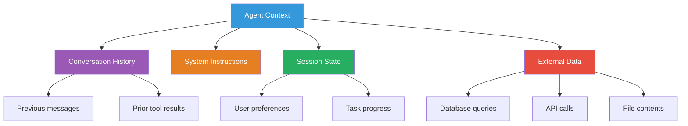
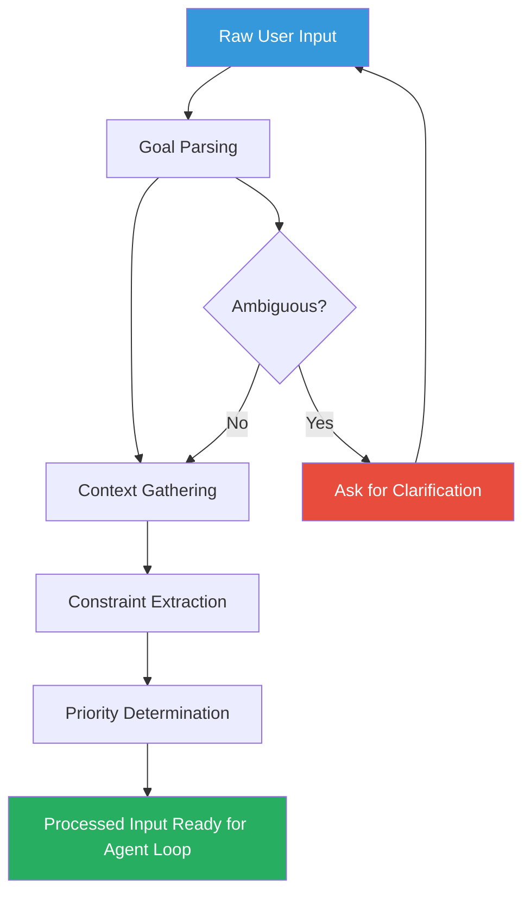

# Input processing

## Introduction

Before an agent can plan or act, it must understand what the user wants. Input processing is the critical first phase where raw user input is transformed into a structured representation the agent can reason about. A well-designed input pipeline extracts the user's goal, gathers relevant context, identifies constraints, and determines priorities — all before the agent takes its first action.

Poor input processing is one of the most common causes of agent failure. An agent that misunderstands the goal will plan incorrectly, waste tool calls, and ultimately produce wrong results. This lesson teaches you how to build robust input processing pipelines.

### What we'll cover

- Goal parsing: extracting what the user actually wants
- Context gathering: assembling relevant information from multiple sources
- Constraint extraction: identifying limitations, requirements, and boundaries
- Priority determination: deciding what matters most when goals conflict

### Prerequisites

- Completed [Agent Loop Structure](./02-agent-loop-structure.md)
- Understanding of LLM system prompts and instructions
- Familiarity with structured outputs (Pydantic models)

---

## Goal parsing

Goal parsing is the process of transforming a user's natural language input into a clear, actionable objective. Users rarely state their goals precisely — they use ambiguous language, implicit context, and incomplete descriptions.

### The challenge of natural language goals

Consider these user inputs and what the agent must infer:

| User says | Actual goal | Implicit context |
|-----------|-------------|------------------|
| "Fix the bug" | Debug and resolve a specific code issue | Which bug? In which file? |
| "Make it faster" | Optimize performance | What metric? How fast is acceptable? |
| "Book me a flight" | Complete a flight reservation | Where to? When? Budget? |
| "Help me with this" | Provide assistance on an unclear task | With what exactly? |

The agent must bridge the gap between what the user *says* and what the user *means*.

### Structured goal extraction

One effective approach is to use the LLM itself to extract a structured goal from unstructured input. We can use Pydantic models to define what a well-formed goal looks like:

```python
from pydantic import BaseModel, Field
from typing import Optional

class ParsedGoal(BaseModel):
    """Structured representation of the user's intent."""
    primary_objective: str = Field(
        description="The main thing the user wants to accomplish"
    )
    sub_tasks: list[str] = Field(
        default_factory=list,
        description="Smaller tasks needed to achieve the objective"
    )
    clarification_needed: Optional[str] = Field(
        default=None,
        description="Questions to ask the user if the goal is ambiguous"
    )
    category: str = Field(
        description="Type of task: research, action, analysis, or creative"
    )
```

### Implementing goal parsing with structured output

```python
from openai import OpenAI

client = OpenAI()

def parse_user_goal(user_input: str, conversation_history: list[dict] = None) -> ParsedGoal:
    """Extract a structured goal from user input."""
    
    system_prompt = """You are a goal parser. Analyze the user's input and extract:
    1. Their primary objective (what they want accomplished)
    2. Sub-tasks needed (break down complex goals)
    3. Whether clarification is needed (if the goal is ambiguous)
    4. The category of task
    
    Consider conversation history for context when available."""
    
    messages = [{"role": "system", "content": system_prompt}]
    if conversation_history:
        messages.extend(conversation_history)
    messages.append({"role": "user", "content": user_input})
    
    response = client.beta.chat.completions.parse(
        model="gpt-4o-mini",
        messages=messages,
        response_format=ParsedGoal,
    )
    
    return response.choices[0].message.parsed

# Example usage
goal = parse_user_goal("Can you analyze our Q3 sales data and find trends?")
print(f"Objective: {goal.primary_objective}")
print(f"Sub-tasks: {goal.sub_tasks}")
print(f"Category: {goal.category}")
```

**Output:**
```
Objective: Analyze Q3 sales data to identify trends and patterns
Sub-tasks: ['Load Q3 sales data', 'Calculate key metrics', 'Identify trends', 'Generate summary report']
Category: analysis
```

### Goal parsing in the OpenAI Agents SDK

In the OpenAI Agents SDK, goal parsing is typically handled through the agent's instructions. The instructions tell the LLM how to interpret goals:

```python
from agents import Agent

analyst_agent = Agent(
    name="Data Analyst",
    instructions="""You are a data analyst agent. When you receive a request:
    
    1. FIRST identify what data the user is asking about
    2. THEN determine what kind of analysis they want
    3. THEN break it into specific analytical steps
    4. Ask for clarification if the request is ambiguous
    
    Before using any tools, state your understanding of the goal.""",
    tools=[load_data, run_query, create_chart],
)
```

> **Tip:** The instruction "state your understanding of the goal" forces the agent to explicitly articulate its interpretation before acting. This makes debugging much easier — you can see whether the agent understood the user correctly.

---

## Context gathering

Context gathering is the process of assembling all relevant information the agent needs to accomplish its goal. Context comes from multiple sources and must be assembled before or during the planning phase.

### Sources of context



### The four context sources

| Source | When it's available | Examples |
|--------|-------------------|----------|
| **System instructions** | Always (static) | Agent's role, capabilities, behavioral rules |
| **Conversation history** | During multi-turn interactions | Previous user messages, prior tool results |
| **Session state** | When sessions are enabled | User preferences, task progress, stored data |
| **External data** | On-demand via tools | Database records, API responses, file contents |

### Static context: instructions and system prompts

The simplest form of context is the agent's system prompt. This is always available and sets the foundation:

```python
from agents import Agent

agent = Agent(
    name="Customer Support",
    instructions="""You are a customer support agent for TechCorp.

    COMPANY CONTEXT:
    - Products: CloudSync (file storage), DevFlow (CI/CD), DataPipe (ETL)
    - Business hours: 9 AM - 6 PM EST
    - Refund policy: 30-day money-back guarantee
    - Escalation: Route billing issues to billing team
    
    BEHAVIORAL RULES:
    - Always verify the customer's account before making changes
    - Never share internal system details
    - Escalate security concerns immediately""",
    tools=[lookup_account, check_subscription, create_ticket],
)
```

### Dynamic context: conversation history

Conversation history provides context that evolves throughout the interaction. The agent needs to track what has already been discussed:

```python
from agents import Agent, Runner, SQLiteSession

agent = Agent(
    name="Support Agent",
    instructions="Help customers with their accounts.",
    tools=[lookup_account],
)

# Session maintains conversation history automatically
session = SQLiteSession("customer_456")

# Turn 1: Customer provides their email
result = await Runner.run(
    agent, "Hi, my email is alice@example.com", session=session
)
# Agent now knows the customer's email

# Turn 2: Customer asks about their subscription
# The agent has context from turn 1 — it knows the email
result = await Runner.run(
    agent, "What plan am I on?", session=session
)
# Agent uses the email from turn 1 to look up the account
```

### Dynamic context injection

In the OpenAI Agents SDK, you can inject context dynamically using the `context` parameter and dynamic instructions:

```python
from dataclasses import dataclass
from agents import Agent, RunContextWrapper

@dataclass
class CustomerContext:
    """Runtime context for the customer support agent."""
    customer_id: str
    customer_name: str
    account_tier: str
    open_tickets: int

def dynamic_instructions(
    context: RunContextWrapper[CustomerContext],
    agent: Agent[CustomerContext],
) -> str:
    """Generate instructions with runtime context."""
    ctx = context.context
    return f"""You are helping {ctx.customer_name} (ID: {ctx.customer_id}).
    Account tier: {ctx.account_tier}
    Open tickets: {ctx.open_tickets}
    
    Adjust your responses based on their account tier:
    - Enterprise: Priority support, direct escalation available
    - Pro: Standard support with 24h response time
    - Free: Self-service resources first"""

agent = Agent[CustomerContext](
    name="Support Agent",
    instructions=dynamic_instructions,
    tools=[lookup_account, create_ticket],
)

# Inject context at runtime
customer = CustomerContext(
    customer_id="C-456",
    customer_name="Alice",
    account_tier="Enterprise",
    open_tickets=2,
)

result = await Runner.run(
    agent,
    "I can't access my dashboard",
    context=customer,
)
```

> **Important:** The `context` object is available to tools and instructions but is never sent to the LLM directly. It's a local dependency injection mechanism. To make context visible to the LLM, include it in the instructions or provide it via tools.

---

## Constraint extraction

Constraints are the boundaries within which the agent must operate. They define what the agent *can't* do, *must* do, or *should prioritize*. Extracting constraints from user input and system rules is essential for reliable agent behavior.

### Types of constraints

| Constraint type | Source | Example |
|----------------|--------|---------|
| **Explicit user constraints** | User's message | "Under $500", "By Friday", "In Python only" |
| **Implicit user constraints** | Inferred from context | User is on free tier → limited features |
| **System constraints** | Agent configuration | Max 10 API calls, no database writes |
| **Safety constraints** | Guardrails | No personal data exposure, content policies |

### Extracting constraints from user input

```python
from pydantic import BaseModel, Field
from typing import Optional

class ExtractedConstraints(BaseModel):
    """Constraints extracted from user input."""
    budget: Optional[str] = Field(
        default=None,
        description="Any budget or cost limitation mentioned"
    )
    deadline: Optional[str] = Field(
        default=None,
        description="Any time constraint or deadline mentioned"
    )
    preferences: list[str] = Field(
        default_factory=list,
        description="User preferences that should guide decisions"
    )
    restrictions: list[str] = Field(
        default_factory=list,
        description="Things the user explicitly wants to avoid"
    )
    must_haves: list[str] = Field(
        default_factory=list,
        description="Non-negotiable requirements"
    )

def extract_constraints(user_input: str) -> ExtractedConstraints:
    """Extract constraints from a user's request."""
    response = client.beta.chat.completions.parse(
        model="gpt-4o-mini",
        messages=[
            {"role": "system", "content": "Extract any constraints, limitations, "
             "preferences, or requirements from the user's message."},
            {"role": "user", "content": user_input},
        ],
        response_format=ExtractedConstraints,
    )
    return response.choices[0].message.parsed

# Example
constraints = extract_constraints(
    "Find me a hotel in Paris for next weekend, under €200/night, "
    "must have WiFi, prefer something near the Eiffel Tower, no hostels"
)
print(f"Budget: {constraints.budget}")
print(f"Must-haves: {constraints.must_haves}")
print(f"Restrictions: {constraints.restrictions}")
```

**Output:**
```
Budget: Under €200 per night
Must-haves: ['WiFi']
Restrictions: ['No hostels']
```

### System-level constraints with guardrails

The OpenAI Agents SDK and LangGraph both support guardrails — automated checks that enforce constraints:

```python
from agents import Agent, InputGuardrail, GuardrailFunctionOutput

async def budget_guardrail(context, agent, input_data) -> GuardrailFunctionOutput:
    """Ensure requests don't exceed spending limits."""
    # Check if the request involves spending
    spending_check = await Runner.run(
        spending_checker_agent,
        input_data,
    )
    
    if spending_check.final_output.exceeds_limit:
        return GuardrailFunctionOutput(
            output_info={"reason": "Budget limit exceeded"},
            tripwire_triggered=True,
        )
    
    return GuardrailFunctionOutput(
        output_info={"reason": "Within budget"},
        tripwire_triggered=False,
    )

agent = Agent(
    name="Purchasing Agent",
    instructions="Help users purchase items.",
    input_guardrails=[
        InputGuardrail(guardrail_function=budget_guardrail),
    ],
)
```

---

## Priority determination

When an agent receives a complex request with multiple goals, it must determine which goals to pursue first. Priority determination is especially important when goals conflict or resources are limited.

### Priority signals

Priority comes from several signals that the agent must weigh:

| Signal | Weight | Example |
|--------|--------|---------|
| **Explicit urgency** | Highest | "This is critical", "ASAP" |
| **Dependencies** | High | Task B requires Task A to complete first |
| **User preference** | Medium | "Start with the budget analysis" |
| **System defaults** | Low | Process safety checks before actions |

### Implementing priority ordering

```python
from pydantic import BaseModel, Field
from enum import Enum

class Priority(str, Enum):
    CRITICAL = "critical"
    HIGH = "high"
    MEDIUM = "medium"
    LOW = "low"

class PrioritizedTask(BaseModel):
    """A task with assigned priority and ordering."""
    task: str = Field(description="The task description")
    priority: Priority = Field(description="Priority level")
    order: int = Field(description="Execution order (1 = first)")
    depends_on: list[int] = Field(
        default_factory=list,
        description="Task numbers this task depends on"
    )
    reasoning: str = Field(description="Why this priority was assigned")

class TaskPlan(BaseModel):
    """Ordered list of tasks with priorities."""
    tasks: list[PrioritizedTask]

def prioritize_tasks(user_input: str, context: str = "") -> TaskPlan:
    """Break down a request into prioritized tasks."""
    response = client.beta.chat.completions.parse(
        model="gpt-4o",
        messages=[
            {"role": "system", "content": """Break the user's request into 
            prioritized tasks. Consider:
            1. Explicit urgency markers
            2. Logical dependencies (what must happen first)
            3. User preferences for ordering
            4. Safety checks before risky actions"""},
            {"role": "user", "content": f"Context: {context}\nRequest: {user_input}"},
        ],
        response_format=TaskPlan,
    )
    return response.choices[0].message.parsed

# Example
plan = prioritize_tasks(
    "Deploy the new feature to production, but first run the tests "
    "and make sure the database migration is complete"
)
for task in plan.tasks:
    print(f"[{task.order}] ({task.priority}) {task.task}")
    if task.depends_on:
        print(f"    Depends on: tasks {task.depends_on}")
```

**Output:**
```
[1] (critical) Run database migration
    Depends on: tasks []
[2] (high) Run test suite
    Depends on: tasks [1]
[3] (high) Deploy feature to production
    Depends on: tasks [1, 2]
```

### Priority in multi-agent systems

In multi-agent architectures, the orchestrator or triage agent determines which specialist agent should handle the request based on priority and category:

```python
from agents import Agent

# The triage agent prioritizes and routes
triage_agent = Agent(
    name="Triage Agent",
    instructions="""Analyze the user's request and determine:
    1. Is this urgent? (system down, data loss, security issue)
    2. What category? (billing, technical, account, general)
    3. Route to the appropriate specialist agent
    
    PRIORITY RULES:
    - Security issues → ALWAYS escalate immediately
    - System outages → Route to technical with HIGH priority
    - Billing disputes → Route to billing with MEDIUM priority
    - General questions → Route to general with NORMAL priority""",
    handoffs=[security_agent, technical_agent, billing_agent, general_agent],
)
```

---

## Complete input processing pipeline

Bringing it all together, here's a complete input processing pipeline that runs before the agent begins its main loop:



```python
async def process_input(
    user_input: str,
    session: Session,
    customer_context: CustomerContext,
) -> ProcessedInput:
    """Complete input processing pipeline."""
    
    # Step 1: Parse the goal
    goal = parse_user_goal(user_input, session.history)
    
    # Step 2: Check if clarification is needed
    if goal.clarification_needed:
        return ProcessedInput(
            needs_clarification=True,
            clarification_question=goal.clarification_needed,
        )
    
    # Step 3: Gather context
    context = await gather_context(
        session=session,
        customer=customer_context,
        goal=goal,
    )
    
    # Step 4: Extract constraints
    constraints = extract_constraints(user_input)
    
    # Step 5: Determine priorities
    plan = prioritize_tasks(user_input, context=str(context))
    
    return ProcessedInput(
        goal=goal,
        context=context,
        constraints=constraints,
        task_plan=plan,
        needs_clarification=False,
    )
```

---

## Best practices

| Practice | Why it matters |
|----------|---------------|
| Always confirm your understanding of ambiguous goals | Prevents wasted work on misunderstood requests |
| Extract constraints before planning | Avoids plans that violate user requirements |
| Use structured output for goal parsing | Ensures consistent, machine-readable goal representations |
| Inject runtime context via instructions | Makes relevant context visible to the LLM's planning |
| Log parsed goals and constraints | Critical for debugging why an agent misunderstood a request |
| Validate constraints are satisfiable | "Find a $10 flight to Tokyo" may need constraint relaxation |

---

## Common pitfalls

| ❌ Mistake | ✅ Solution |
|-----------|-------------|
| Assuming the user's goal is obvious | Parse and confirm before acting |
| Ignoring conversation history context | Always include prior turns when parsing goals |
| Treating all tasks as equal priority | Extract dependencies and urgency markers |
| Hardcoding constraints in instructions | Extract from user input dynamically |
| Not asking for clarification on ambiguous input | Add a clarification step to the pipeline |
| Overloading the system prompt with context | Use dynamic instructions and tools for on-demand context |

---

## Hands-on exercise

### Your task

Build an input processing pipeline that takes a complex user request and produces a structured, prioritized task plan.

### Requirements

1. Create a `ParsedGoal` model that captures the user's objective
2. Create an `ExtractedConstraints` model that captures limitations
3. Implement a `parse_input()` function that returns both
4. Handle ambiguous input by flagging when clarification is needed
5. Produce a prioritized task list with dependency ordering

### Expected result

```
Input: "Refactor the authentication module to use OAuth2, 
        but don't break the existing API. Need it done by Friday."

Goal: Refactor authentication module to OAuth2
Constraints:
  - Deadline: Friday
  - Restriction: Don't break existing API
Tasks:
  [1] (critical) Audit current authentication API surface
  [2] (high) Implement OAuth2 provider integration
      Depends on: [1]
  [3] (high) Update existing endpoints for backward compatibility
      Depends on: [1, 2]
  [4] (medium) Run integration tests
      Depends on: [3]
```

<details>
<summary>💡 Hints (click to expand)</summary>

- Use Pydantic `BaseModel` with `Field` descriptions for structured output
- The `client.beta.chat.completions.parse()` method works with Pydantic models
- Check if `clarification_needed` is set to determine if input is ambiguous
- Sort tasks by their `order` field and display `depends_on` relationships

</details>

<details>
<summary>✅ Solution (click to expand)</summary>

```python
from pydantic import BaseModel, Field
from openai import OpenAI

client = OpenAI()

class ParsedGoal(BaseModel):
    primary_objective: str
    sub_tasks: list[str] = []
    clarification_needed: str | None = None
    category: str

class ExtractedConstraints(BaseModel):
    deadline: str | None = None
    preferences: list[str] = []
    restrictions: list[str] = []
    must_haves: list[str] = []

class PrioritizedTask(BaseModel):
    task: str
    priority: str  # critical, high, medium, low
    order: int
    depends_on: list[int] = []

class ProcessedInput(BaseModel):
    goal: ParsedGoal
    constraints: ExtractedConstraints
    tasks: list[PrioritizedTask]
    needs_clarification: bool

def parse_input(user_input: str) -> ProcessedInput:
    """Complete input processing pipeline."""
    
    # Step 1: Parse goal
    goal = client.beta.chat.completions.parse(
        model="gpt-4o-mini",
        messages=[
            {"role": "system", "content": "Extract the user's goal."},
            {"role": "user", "content": user_input},
        ],
        response_format=ParsedGoal,
    ).choices[0].message.parsed
    
    # Step 2: Extract constraints
    constraints = client.beta.chat.completions.parse(
        model="gpt-4o-mini",
        messages=[
            {"role": "system", "content": "Extract constraints and limitations."},
            {"role": "user", "content": user_input},
        ],
        response_format=ExtractedConstraints,
    ).choices[0].message.parsed
    
    # Step 3: Prioritize tasks
    task_response = client.beta.chat.completions.parse(
        model="gpt-4o",
        messages=[
            {"role": "system", "content": "Break into prioritized tasks with dependencies."},
            {"role": "user", "content": f"Goal: {goal.primary_objective}\n"
             f"Constraints: {constraints}\nRequest: {user_input}"},
        ],
        response_format=list[PrioritizedTask],
    ).choices[0].message.parsed
    
    return ProcessedInput(
        goal=goal,
        constraints=constraints,
        tasks=sorted(task_response, key=lambda t: t.order),
        needs_clarification=goal.clarification_needed is not None,
    )
```

</details>

### Bonus challenges

- [ ] Add a context gathering step that pulls relevant data from a mock database
- [ ] Implement constraint validation (detect impossible constraints)
- [ ] Add a confidence score to the goal parsing (how certain is the interpretation)

---

## Summary

✅ **Goal parsing** transforms ambiguous natural language into structured, actionable objectives

✅ **Context gathering** assembles information from four sources: instructions, history, state, and external data

✅ **Constraint extraction** identifies user limitations, system boundaries, and safety requirements

✅ **Priority determination** orders tasks by urgency, dependencies, and user preference

✅ Dynamic instructions and context injection make runtime information available to the LLM

✅ Always confirm understanding of ambiguous goals before proceeding with the agent loop

**Next:** [Output Generation](./04-output-generation.md)

---

## Further reading

- [OpenAI Agents SDK: Context Management](https://openai.github.io/openai-agents-python/context/) — Local and LLM context patterns
- [OpenAI Agents SDK: Guardrails](https://openai.github.io/openai-agents-python/guardrails/) — Input validation and constraint enforcement
- [LangGraph: Graph API — State](https://docs.langchain.com/oss/python/langgraph/graph-api) — State schema and reducers
- [Google ADK: Context](https://google.github.io/adk-docs/context/) — Context management in ADK agents

[Back to Agent Architecture Overview](./00-agent-architecture.md)

<!--
Sources Consulted:
- OpenAI Agents SDK - Context Management: https://openai.github.io/openai-agents-python/context/
- OpenAI Agents SDK - Agents: https://openai.github.io/openai-agents-python/agents/
- OpenAI Agents SDK - Guardrails: https://openai.github.io/openai-agents-python/guardrails/
- Google ADK - Core Concepts: https://google.github.io/adk-docs/get-started/about/
- LangGraph - Graph API: https://docs.langchain.com/oss/python/langgraph/graph-api
- Anthropic Building Effective Agents: https://www.anthropic.com/engineering/building-effective-agents
-->
