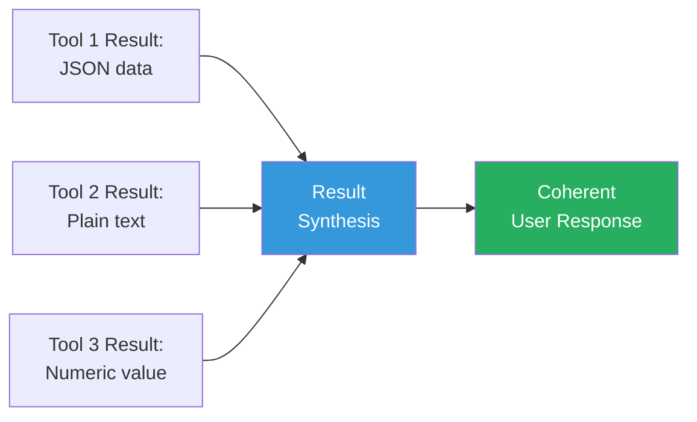

# Output generation

## Introduction

Output generation is the final phase of the agent loop — the moment where all the agent's reasoning, planning, and tool use converges into a response the user can understand and act on. A powerful agent that produces confusing or incomplete output fails at the last mile. This lesson covers how agents synthesize results, report actions taken, communicate with users, and generate summaries.

The difference between a good agent and a great one often comes down to output quality. Users don't see the internal reasoning chain or the tool calls — they only see the final output.

### What we'll cover

- Result synthesis: combining tool outputs into coherent responses
- Action reporting: communicating what the agent did and why
- User communication: adapting output to the audience
- Structured output: producing machine-readable responses for downstream systems

### Prerequisites

- Completed [Input Processing](./03-input-processing.md)
- Familiarity with Pydantic models and structured output
- Understanding of the agent loop from [Agent Loop Structure](./02-agent-loop-structure.md)

---

## Result synthesis

After an agent calls one or more tools, it receives raw results that must be synthesized into a coherent response. Result synthesis is the process of combining, filtering, and formatting multiple data sources into a single, meaningful answer.

### The synthesis challenge

A single user request often requires multiple tool calls. Each tool returns data in its own format. The agent must combine all of these into a unified response:



### How synthesis works in the agent loop

In the OpenAI Agents SDK, the LLM automatically synthesizes tool results. When the agent calls tools, the results are appended to the conversation as tool response messages, and the LLM generates a natural language synthesis:

```python
from agents import Agent, function_tool

@function_tool
def get_weather(city: str) -> str:
    """Get current weather for a city."""
    # Simulated response
    return f"Weather in {city}: 22°C, partly cloudy, 45% humidity"

@function_tool
def get_air_quality(city: str) -> str:
    """Get air quality index for a city."""
    return f"Air quality in {city}: AQI 42 (Good)"

@function_tool
def get_uv_index(city: str) -> str:
    """Get UV index for a city."""
    return f"UV Index in {city}: 6 (High - sunscreen recommended)"

agent = Agent(
    name="Weather Agent",
    instructions="""Provide comprehensive weather reports. When asked about 
    conditions in a city, gather weather, air quality, and UV data, then 
    synthesize into a clear summary with practical recommendations.""",
    tools=[get_weather, get_air_quality, get_uv_index],
)
```

When the user asks "What's it like outside in Paris?", the agent:
1. Calls all three tools (potentially in parallel)
2. Receives three separate results
3. Synthesizes them into one response:

**Output:**
```
Here's the current conditions in Paris:

🌤️ Weather: 22°C with partly cloudy skies and 45% humidity
🌬️ Air Quality: Good (AQI 42) — safe for outdoor activities
☀️ UV Index: 6 (High) — sunscreen is recommended if you'll be outdoors

Overall: Great weather for being outside! Just remember to apply sunscreen.
```

### Controlling synthesis quality

The quality of synthesis depends heavily on the agent's instructions. You can guide synthesis with explicit formatting directives:

```python
agent = Agent(
    name="Research Agent",
    instructions="""When presenting research results:
    
    SYNTHESIS RULES:
    1. Lead with the key finding (most important answer first)
    2. Support with specific data points from tool results
    3. Note any conflicting information between sources
    4. End with confidence level (high/medium/low) based on source agreement
    
    FORMAT:
    - Use bullet points for multiple data points
    - Include specific numbers, not vague qualifiers
    - Cite which tool/source provided each data point""",
    tools=[search_web, query_database, analyze_data],
)
```

---

## Action reporting

Action reporting tells the user what the agent did, what it changed, and what effects those actions had. This is critical for transparency and trust — users need to understand and verify agent actions.

### Levels of action reporting

| Level | When to use | Example |
|-------|-------------|---------|
| **Summary** | Simple, low-risk actions | "I've updated your profile." |
| **Detailed** | Moderate-risk, user wants transparency | "I updated your email from old@test.com to new@test.com." |
| **Full audit** | High-risk, irreversible actions | "I deleted 3 records: IDs 101, 102, 103. Created backup at /backups/2025-01-15." |

### Implementing action reporting with structured output

You can use the `output_type` parameter in the OpenAI Agents SDK to enforce structured action reports:

```python
from pydantic import BaseModel, Field

class ActionReport(BaseModel):
    """Structured report of all actions taken by the agent."""
    summary: str = Field(
        description="One-sentence summary of what was accomplished"
    )
    actions_taken: list[str] = Field(
        description="List of specific actions performed, in order"
    )
    changes_made: list[str] = Field(
        description="List of changes to data or systems"
    )
    warnings: list[str] = Field(
        default_factory=list,
        description="Any warnings or issues encountered"
    )
    rollback_info: str | None = Field(
        default=None,
        description="How to undo the changes if needed"
    )

agent = Agent(
    name="Database Admin Agent",
    instructions="""Perform database operations as requested. 
    Always report every action taken with full details.""",
    output_type=ActionReport,
    tools=[run_query, create_backup, modify_table],
)
```

When the agent completes its work, the `result.final_output` is a structured `ActionReport`:

```python
result = await Runner.run(agent, "Clean up duplicate entries in the users table")

report = result.final_output  # This is an ActionReport object
print(f"Summary: {report.summary}")
print(f"Actions: {report.actions_taken}")
print(f"Changes: {report.changes_made}")
if report.rollback_info:
    print(f"Rollback: {report.rollback_info}")
```

**Output:**
```
Summary: Removed 12 duplicate user entries from the users table
Actions: ['Identified duplicates by email address', 'Created backup of users table', 
         'Deleted 12 duplicate rows keeping earliest entry']
Changes: ['Removed user IDs: 234, 267, 289, 301, 305, 312, 318, 340, 356, 371, 385, 390',
         'Table row count reduced from 1,247 to 1,235']
Rollback: Restore from backup at /backups/users_2025-01-15_14-30.sql
```

### Action confirmation pattern

For high-risk actions, agents should confirm before executing. This is a common pattern where the agent's first output is a plan, and the user must approve it:

```python
class ActionPlan(BaseModel):
    """Plan for the agent to execute, pending user approval."""
    description: str
    steps: list[str]
    risk_level: str  # low, medium, high
    reversible: bool
    estimated_impact: str

class ApprovalRequest(BaseModel):
    """Request for user to approve the action plan."""
    plan: ActionPlan
    question: str = "Do you want me to proceed with this plan?"

# Phase 1: Planning agent generates a plan
planning_agent = Agent(
    name="Planner",
    instructions="Analyze the request and create a plan. Do NOT execute anything.",
    output_type=ApprovalRequest,
)

# Phase 2: Execution agent carries out the approved plan
execution_agent = Agent(
    name="Executor",
    instructions="Execute the approved plan and report all actions.",
    output_type=ActionReport,
    tools=[run_query, modify_table, create_backup],
)
```

> **🤖 AI Context:** The plan-then-execute pattern is one of Anthropic's recommended orchestration patterns. It's essentially a two-step prompt chain where the user acts as the gate between planning and execution.

---

## User communication

How an agent communicates its output matters as much as what it communicates. The same information can be clear or confusing depending on how it's presented.

### Adapting to the audience

Agents should adjust their communication style based on who they're talking to:

```python
agent = Agent(
    name="Explainer Agent",
    instructions="""Adapt your communication style:
    
    For TECHNICAL users (developers, engineers):
    - Include code snippets and technical details
    - Use precise terminology
    - Reference specific APIs, methods, or configurations
    
    For BUSINESS users (managers, stakeholders):
    - Focus on impact, costs, and timelines
    - Avoid technical jargon
    - Use analogies for complex concepts
    
    For END USERS (general public):
    - Use simple, clear language
    - Provide step-by-step instructions with screenshots
    - Anticipate confusion and address it proactively
    
    Determine the audience from context clues in the conversation.""",
)
```

### Progressive disclosure

Good agent output uses progressive disclosure — start with the essential information, then offer details on demand:

```python
agent = Agent(
    name="Diagnostics Agent",
    instructions="""When reporting diagnostic results, use progressive disclosure:
    
    LEVEL 1 (always show):
    - Status: Is everything OK? Yes/No
    - One-sentence summary of the issue (if any)
    
    LEVEL 2 (show if issue found):
    - What specifically is wrong
    - Recommended action
    - Urgency level
    
    LEVEL 3 (show only if asked):
    - Technical details and raw data
    - Full stack traces
    - Historical comparison data
    
    Example:
    "✅ All systems healthy. 3 minor warnings detected."
    Then let the user ask for details if they want them.""",
)
```

### Streaming output

For long-running tasks, streaming output keeps the user informed in real time. The Google ADK's event-driven architecture is designed for this:

```python
# Google ADK streaming pattern
async for event in runner.run_async(session=session, new_message=content):
    if event.partial:
        # Streaming token — display immediately
        print(event.content.parts[0].text, end="", flush=True)
    elif event.actions:
        # Agent is taking an action — inform the user
        for action in event.actions:
            print(f"\n🔧 Using tool: {action.tool_name}...")
    elif event.is_final_response():
        # Final synthesized response
        print(f"\n\n{event.content.parts[0].text}")
```

In the OpenAI Agents SDK, streaming uses a callback pattern:

```python
from agents import Runner

result = Runner.run_streamed(agent, "Analyze the log files")

async for event in result.stream_events():
    if event.type == "raw_response_event":
        # LLM is generating text
        if hasattr(event.data, "delta"):
            print(event.data.delta, end="", flush=True)
    elif event.type == "tool_start":
        print(f"\n🔧 Calling: {event.data.tool_name}")
    elif event.type == "tool_end":
        print(f"   ✅ Done")
```

**Output (streamed):**
```
Analyzing log files...

🔧 Calling: read_log_file
   ✅ Done
🔧 Calling: parse_errors
   ✅ Done

Found 3 critical errors in the last 24 hours:
1. Database connection timeout at 03:42 AM (resolved after retry)
2. Memory spike to 95% at 11:15 AM (auto-scaled)
3. API rate limit hit at 2:30 PM (429 responses for 12 minutes)

Recommendation: Increase connection pool size and review API rate limiting.
```

---

## Structured output for downstream systems

Not all agent output is for human consumption. Agents often produce structured output that feeds into other systems, APIs, or other agents.

### Using `output_type` for structured output

The OpenAI Agents SDK's `output_type` parameter ensures the agent produces a specific structured format:

```python
from pydantic import BaseModel, Field

class AnalysisResult(BaseModel):
    """Structured output for the analysis pipeline."""
    dataset: str
    record_count: int
    key_findings: list[str]
    metrics: dict[str, float]
    anomalies: list[dict]
    confidence: float = Field(ge=0.0, le=1.0)
    recommended_actions: list[str]

analysis_agent = Agent(
    name="Data Analyst",
    instructions="Analyze datasets and produce structured reports.",
    output_type=AnalysisResult,
    tools=[load_dataset, compute_statistics, detect_anomalies],
)

# The result is always an AnalysisResult object
result = await Runner.run(analysis_agent, "Analyze the user engagement data")
analysis = result.final_output  # AnalysisResult

# Feed into downstream systems
if analysis.confidence > 0.8:
    await dashboard_api.update_metrics(analysis.metrics)
    if analysis.anomalies:
        await alert_system.send(analysis.anomalies)
```

### LangGraph structured output

In LangGraph, structured output is achieved through the state schema. The final state of the graph is the output:

```python
from typing import TypedDict, Annotated
from langgraph.graph import StateGraph, START, END

class AnalysisState(TypedDict):
    input: str
    data: list[dict]
    findings: Annotated[list[str], lambda a, b: a + b]
    final_report: str

def generate_report(state: AnalysisState) -> dict:
    """Final node: produce the output report."""
    return {
        "final_report": f"Analysis complete. {len(state['findings'])} findings."
    }

graph = StateGraph(AnalysisState)
graph.add_node("load", load_data)
graph.add_node("analyze", analyze_data)
graph.add_node("report", generate_report)

graph.add_edge(START, "load")
graph.add_edge("load", "analyze")
graph.add_edge("analyze", "report")
graph.add_edge("report", END)

app = graph.compile()
result = await app.ainvoke({"input": "user engagement Q3"})
print(result["final_report"])
```

**Output:**
```
Analysis complete. 5 findings.
```

---

## Best practices

| Practice | Why it matters |
|----------|---------------|
| Lead with the answer, then explain | Users want the key information first |
| Report all actions taken for transparency | Builds trust, enables debugging |
| Use structured output for agent-to-agent communication | Prevents parsing errors downstream |
| Stream output for long-running tasks | Keeps users informed, reduces perceived wait time |
| Include rollback information for destructive actions | Enables recovery when things go wrong |
| Match communication style to the audience | Technical users want details; business users want impact |

---

## Common pitfalls

| ❌ Mistake | ✅ Solution |
|-----------|-------------|
| Dumping raw tool output to the user | Synthesize tool results into natural language |
| No action reporting for state-changing operations | Always report what was changed and how to undo it |
| Same communication style for all audiences | Adapt based on context clues about the user |
| Blocking UI during long operations with no feedback | Stream partial results or show progress updates |
| Unstructured output for downstream systems | Use `output_type` with Pydantic models |
| Including internal reasoning in user-facing output | Keep chain-of-thought separate from the final response |

---

## Hands-on exercise

### Your task

Build an agent that performs a multi-step research task and produces both a user-friendly summary and a structured report for downstream systems.

### Requirements

1. Create a research agent with at least 3 mock tools
2. Define a structured `ResearchReport` output type
3. Implement an `ActionReport` that logs all tool calls
4. The agent should synthesize multiple tool results into one coherent response
5. Include a streaming-ready output pattern

### Expected result

```
User: "Research the top 3 competitors for our product"

🔧 Searching market data...
🔧 Analyzing competitor websites...
🔧 Pulling pricing data...

Research Report:
1. CompetitorA - Market share: 35%, Price: $49/mo, Strength: Brand recognition
2. CompetitorB - Market share: 22%, Price: $39/mo, Strength: Feature depth
3. CompetitorC - Market share: 15%, Price: $29/mo, Strength: Price point

Key Insight: Price is the primary differentiator in this market.
Confidence: 0.82
```

<details>
<summary>💡 Hints (click to expand)</summary>

- Define your `ResearchReport` Pydantic model first with all required fields
- Use `output_type=ResearchReport` in the agent configuration
- For streaming, use `Runner.run_streamed()` and iterate `stream_events()`
- Mock tools can return hardcoded data — focus on the synthesis pattern

</details>

<details>
<summary>✅ Solution (click to expand)</summary>

```python
from pydantic import BaseModel, Field
from agents import Agent, Runner, function_tool

# Mock tools
@function_tool
def search_market_data(industry: str) -> str:
    return """Market data for SaaS project management:
    Total market: $8.2B. Growth: 12% YoY.
    Top players: CompetitorA (35%), CompetitorB (22%), CompetitorC (15%), Others (28%)"""

@function_tool
def analyze_competitor(name: str) -> str:
    data = {
        "CompetitorA": "Founded 2015. 500 employees. Enterprise-focused. Key feature: AI scheduling.",
        "CompetitorB": "Founded 2018. 200 employees. Mid-market. Key feature: Integrations.",
        "CompetitorC": "Founded 2020. 80 employees. SMB-focused. Key feature: Simplicity.",
    }
    return data.get(name, "Unknown competitor")

@function_tool
def get_pricing(name: str) -> str:
    prices = {"CompetitorA": "$49/mo", "CompetitorB": "$39/mo", "CompetitorC": "$29/mo"}
    return f"{name} pricing: {prices.get(name, 'Unknown')}"

# Structured output
class CompetitorProfile(BaseModel):
    name: str
    market_share: float
    price: str
    key_strength: str

class ResearchReport(BaseModel):
    competitors: list[CompetitorProfile]
    key_insight: str
    confidence: float = Field(ge=0, le=1)
    actions_taken: list[str]

# Agent
agent = Agent(
    name="Market Researcher",
    instructions="""Research competitors thoroughly. 
    Use all available tools to gather data.
    Synthesize into a clear competitive analysis.""",
    output_type=ResearchReport,
    tools=[search_market_data, analyze_competitor, get_pricing],
)

result = await Runner.run(agent, "Research top 3 competitors")
report = result.final_output
for c in report.competitors:
    print(f"- {c.name}: {c.market_share}% share, {c.price}, Strength: {c.key_strength}")
print(f"\nInsight: {report.key_insight}")
print(f"Confidence: {report.confidence}")
```

</details>

### Bonus challenges

- [ ] Add an action confirmation step before executing any state-changing tools
- [ ] Implement progressive disclosure with a `verbose` flag
- [ ] Create a streaming version that shows tool calls in real time

---

## Summary

✅ **Result synthesis** combines multiple tool outputs into coherent, unified responses

✅ **Action reporting** provides transparency by documenting what the agent did and how to undo it

✅ **User communication** adapts style and detail level based on the audience

✅ **Streaming output** keeps users informed during long-running agent tasks

✅ **Structured output** with `output_type` produces machine-readable responses for downstream systems

✅ The plan-then-execute pattern adds a human approval gate before irreversible actions

**Next:** [State Management](./05-state-management.md)

---

## Further reading

- [OpenAI Agents SDK: Results](https://openai.github.io/openai-agents-python/results/) — How to access and interpret agent results
- [OpenAI Agents SDK: Streaming](https://openai.github.io/openai-agents-python/streaming/) — Real-time streaming patterns
- [LangGraph: Streaming](https://docs.langchain.com/oss/python/langgraph/streaming) — LangGraph streaming modes
- [Google ADK: Events](https://google.github.io/adk-docs/runtime/events/) — Event-driven output in ADK

[Back to Agent Architecture Overview](./00-agent-architecture.md)

<!--
Sources Consulted:
- OpenAI Agents SDK - Agents (output_type): https://openai.github.io/openai-agents-python/agents/
- OpenAI Agents SDK - Running Agents: https://openai.github.io/openai-agents-python/running_agents/
- Google ADK - Event Loop: https://google.github.io/adk-docs/runtime/event-loop/
- LangGraph - Graph API: https://docs.langchain.com/oss/python/langgraph/graph-api
- Anthropic Building Effective Agents: https://www.anthropic.com/engineering/building-effective-agents
-->
