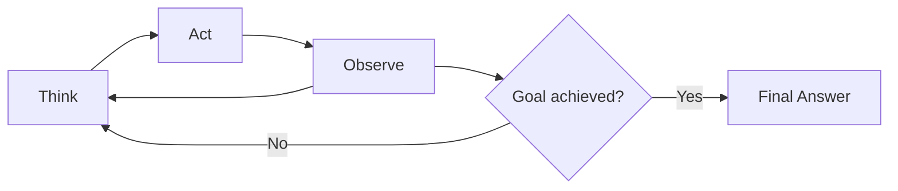

# The ReAct pattern

## Introduction

In 2022, researchers at Princeton and Google published a paper that changed how we think about AI agents: "ReAct: Synergizing Reasoning and Acting in Language Models." The core insight was deceptively simple — instead of having an LLM reason *or* act, let it do both in an interleaved loop. Think, then act, then observe, then think again.

Before ReAct, the AI community treated reasoning and action as separate capabilities. Chain-of-thought prompting produced impressive reasoning traces but couldn't interact with the outside world. Action-generation approaches could call tools but made decisions without explicit reasoning, leading to errors that were impossible to diagnose. ReAct unified these approaches into a single, elegant pattern that is now the foundation of virtually every production agent framework.

### What we'll cover

- The Think-Act-Observe cycle and how it works
- Reasoning trace generation and why it matters
- Action selection strategies
- Implementation patterns across OpenAI Agents SDK, LangGraph, and Google ADK
- When ReAct works well and when to consider alternatives

### Prerequisites

- Understanding of [agent fundamentals](../01-agent-fundamentals/00-agent-fundamentals.md) — what agents are and how they differ from chatbots
- Familiarity with the [agent loop structure](../02-agent-architecture/02-agent-loop-structure.md)
- Basic Python knowledge

---

## The Think-Act-Observe cycle

The ReAct pattern structures agent execution into a repeating cycle of three phases:

1. **Think** — The agent reasons about the current situation, what it knows, and what it should do next
2. **Act** — The agent selects and executes an action (typically a tool call)
3. **Observe** — The agent receives the result of its action and incorporates it into its understanding

This cycle repeats until the agent determines it has enough information to produce a final answer or has completed the task.



### Think: reasoning about the situation

In the Think phase, the agent produces a **reasoning trace** — a natural language explanation of its current understanding and next planned action. This trace is not shown to the user but serves several critical purposes:

- Forces the LLM to articulate its strategy before acting
- Creates an auditable record of decision-making
- Reduces hallucination by requiring explicit justification
- Enables debugging when the agent makes mistakes

Here is a simplified example of what a reasoning trace looks like:

```
Thought: The user asks for the weather in Paris tomorrow. I don't have real-time
weather data in my training, so I need to use the weather API tool. I'll call
get_weather with city="Paris" and date="tomorrow".
```

### Act: selecting and executing an action

Based on its reasoning, the agent selects an action. In modern agent frameworks, actions are tool calls — structured function invocations with specific parameters. The key distinction from simple function calling is that the agent explicitly *reasons* about which tool to use and why before making the call.

```python
# The agent decides to call a tool based on its reasoning
Action: get_weather
Action Input: {"city": "Paris", "date": "2025-01-16"}
```

### Observe: processing results

After the action executes, the agent receives an observation — the tool's return value. This observation becomes part of the agent's context for the next Think step.

```
Observation: {"temperature": 7, "condition": "cloudy", "wind_speed": 15,
"precipitation_chance": 40}
```

The agent then returns to the Think phase, now armed with new information:

```
Thought: I received the weather data for Paris. The temperature is 7°C with
cloudy conditions and a 40% chance of precipitation. I have all the information
needed to answer the user's question. I'll formulate a helpful response.
```

### A complete ReAct trajectory

We can see how these phases work together in a multi-step example. Suppose a user asks: "What's the population difference between the capitals of France and Germany?"

```
Thought: I need to find the populations of Paris (capital of France) and Berlin
(capital of Germany). I'll start by looking up the population of Paris.

Action: search
Action Input: {"query": "population of Paris 2024"}

Observation: Paris has a population of approximately 2.1 million in the city
proper and 12.2 million in the metropolitan area.

Thought: I now know Paris has about 2.1 million people (city proper). Next I
need the population of Berlin.

Action: search
Action Input: {"query": "population of Berlin 2024"}

Observation: Berlin has a population of approximately 3.7 million.

Thought: Now I can calculate the difference. Berlin (3.7M) minus Paris (2.1M)
equals 1.6 million. Berlin is larger. I have enough information to give a
complete answer.

Final Answer: Berlin (capital of Germany) has a larger city-proper population
than Paris (capital of France) — approximately 3.7 million vs 2.1 million,
a difference of about 1.6 million people.
```

> **🔑 Key concept:** The power of ReAct is not in any single phase, but in the *interleaving*. The agent reasons about what it learned from each action before deciding what to do next, creating a self-correcting loop.

---

## Reasoning trace generation

The reasoning trace is what makes the ReAct pattern fundamentally different from basic tool calling. Without it, an LLM might call tools in a technically correct sequence but produce wrong answers because it never paused to evaluate intermediate results.

### Why reasoning traces matter

Consider what happens without reasoning traces. The agent receives a question, immediately calls a tool, gets a result, and either answers or calls another tool. If the first tool returns unexpected data, the agent has no mechanism to reconsider its approach. It plows forward, potentially chaining errors.

With reasoning traces, the agent explicitly evaluates each observation:

```
Thought: The search returned information about the Paris metropolitan area, but
the user might mean city proper vs metro area. I should clarify by looking up
both cities' city-proper populations specifically, to make an apples-to-apples
comparison.
```

This self-reflection step catches errors that pure tool-calling misses.

### Structured vs unstructured traces

Reasoning traces can be **unstructured** (free-form text) or **structured** (following a specific format). Production frameworks increasingly favor structured approaches:

| Format | Example | Used By |
|--------|---------|---------|
| Free-form text | "I think I should search for..." | Basic prompting |
| `Thought/Action/Observation` | Labeled sections | Original ReAct, LangChain |
| `/*PLANNING*/ /*ACTION*/ /*REASONING*/` | Delimited blocks | Google ADK `PlanReActPlanner` |
| Implicit (model thinking) | Hidden reasoning tokens | `BuiltInPlanner`, extended thinking |

Google ADK's `PlanReActPlanner` demonstrates the structured approach clearly:

```python
from google.adk import Agent
from google.adk.planners import PlanReActPlanner

agent = Agent(
    model="gemini-2.5-flash",
    name="research_agent",
    instruction="You are a research assistant. Use search tools to find answers.",
    planner=PlanReActPlanner(),
    tools=[search_tool],
)
```

The agent's response follows a structured format:

```
/*PLANNING*/
1. Search for the population of Paris city proper.
2. Search for the population of Berlin city proper.
3. Calculate the difference and present the answer.

/*ACTION*/
search(query="Paris city proper population 2024")

/*REASONING*/
The search confirmed Paris has approximately 2.1 million residents in the city
proper. I now need Berlin's population to complete the comparison.

/*ACTION*/
search(query="Berlin city proper population 2024")

/*REASONING*/
Berlin has approximately 3.7 million residents. I can now calculate the
difference: 3.7M - 2.1M = 1.6M.

/*FINAL_ANSWER*/
Berlin is larger than Paris by approximately 1.6 million people (3.7M vs 2.1M).
```

### Built-in thinking vs explicit traces

Modern LLMs like Gemini and Claude offer **built-in thinking** capabilities — the model generates internal reasoning tokens that are not part of the visible output but guide its responses. This is an alternative to explicit ReAct-style traces:

```python
from google.adk import Agent
from google.adk.planners import BuiltInPlanner
from google.genai import types

agent = Agent(
    model="gemini-2.5-flash",
    planner=BuiltInPlanner(
        thinking_config=types.ThinkingConfig(
            include_thoughts=True,     # Expose thinking for debugging
            thinking_budget=1024,      # Limit reasoning token cost
        )
    ),
    tools=[search_tool],
)
```

> **💡 Tip:** Use `include_thoughts=True` during development to inspect the model's reasoning. Set it to `False` in production to reduce response size and cost.

| Approach | Pros | Cons |
|----------|------|------|
| Explicit ReAct traces | Fully auditable, works with any model | Consumes output tokens, verbose |
| Built-in thinking | Lower latency, model-optimized | Less control, model-specific |
| Hybrid | Best of both worlds | More complex to implement |

---

## Action selection

The Act phase requires the agent to choose the right action from its available tools. This decision is the most consequential part of the loop — a wrong tool choice wastes time, tokens, and can lead the agent down an unrecoverable path.

### How agents choose actions

The LLM selects actions based on several factors:

1. **Tool descriptions** — The name, docstring, and parameter schema of each tool
2. **Instructions** — System-level guidance about when to use which tool
3. **Context** — The conversation history and current reasoning trace
4. **Previous observations** — Results from earlier actions in the same loop

The quality of tool descriptions is critical. Anthropic's research on building effective agents emphasizes this:

> "We actually spent more time optimizing our tools than the overall prompt. For example, we found that the model would make mistakes with tools using relative filepaths after the agent had moved out of the root directory. To fix this, we changed the tool to always require absolute filepaths—and we found that the model used this method flawlessly." — Anthropic, "Building Effective Agents"

### Implementing clear tool descriptions

Compare these two tool definitions:

```python
# ❌ Poor: vague description, ambiguous parameters
def search(q: str) -> str:
    """Search for stuff."""
    ...

# ✅ Good: specific description, clear parameters, usage guidance
def search_knowledge_base(
    query: str,
    max_results: int = 5,
    category: str | None = None,
) -> list[dict]:
    """Search the internal knowledge base for relevant documents.

    Use this tool when the user asks about company policies, product
    specifications, or internal procedures. Do NOT use this for
    general knowledge questions — use web_search instead.

    Args:
        query: A natural language search query. Be specific.
        max_results: Maximum documents to return (1-20).
        category: Optional filter: "policy", "product", or "procedure".

    Returns:
        List of matching documents with title, snippet, and relevance score.
    """
    ...
```

### Controlling tool selection

Frameworks provide mechanisms to control when and how agents choose tools:

```python
from agents import Agent, ModelSettings

# Force the agent to always use a specific tool
agent = Agent(
    name="weather_agent",
    instructions="Always check the weather before responding.",
    tools=[get_weather],
    model_settings=ModelSettings(tool_choice="get_weather"),
)

# Let the agent decide (default behavior)
agent = Agent(
    name="assistant",
    tools=[get_weather, search_web, calculate],
    model_settings=ModelSettings(tool_choice="auto"),
)
```

> **Warning:** Forcing tool choice (`tool_choice="required"`) can create infinite loops if not handled carefully. The OpenAI Agents SDK resets `tool_choice` to `"auto"` after each tool call by default to prevent this. You can disable this behavior with `reset_tool_choice=False`, but do so with caution.

---

## Implementation patterns

Let's see how the ReAct pattern manifests in the three major agent frameworks.

### OpenAI Agents SDK

The OpenAI Agents SDK implements the ReAct pattern implicitly through its agent loop. The LLM reasons internally, decides to call tools, and processes results automatically:

```python
from agents import Agent, Runner, function_tool

@function_tool
def get_weather(city: str) -> str:
    """Get the current weather for a city.

    Use this when the user asks about weather conditions, temperature,
    or forecasts for a specific location.
    """
    # In production, call a real weather API
    return f"The weather in {city} is 22°C and sunny."

@function_tool
def get_news(topic: str, count: int = 3) -> str:
    """Get recent news articles on a topic.

    Use this when the user asks about current events, recent
    developments, or news about a specific subject.
    """
    return f"Top {count} news articles about {topic}: [headlines here]"

agent = Agent(
    name="research_assistant",
    instructions="""You are a helpful research assistant.
    Think step by step about what information you need.
    Use tools to gather facts before answering.
    Always cite your sources.""",
    tools=[get_weather, get_news],
)

# The agent loop handles Think-Act-Observe automatically
result = await Runner.run(agent, "What's the weather like in Tokyo?")
print(result.final_output)
```

**Output:**
```
The current weather in Tokyo is 22°C and sunny — great conditions for being
outdoors!
```

### LangGraph

LangGraph gives you explicit control over the ReAct loop through its graph-based architecture. You define the Think, Act, and Observe phases as nodes:

```python
from langgraph.graph import StateGraph, MessagesState, START, END
from langgraph.prebuilt import ToolNode
from langchain_openai import ChatOpenAI

# Define tools
def search(query: str) -> str:
    """Search the web for information."""
    return f"Results for '{query}': [relevant information here]"

tools = [search]
model = ChatOpenAI(model="gpt-4o").bind_tools(tools)

# The "think" node — LLM reasons and decides next action
def reasoning_node(state: MessagesState):
    response = model.invoke(state["messages"])
    return {"messages": [response]}

# The "act" node — executes the selected tool
tool_node = ToolNode(tools)

# The "observe" decision — check if we need more reasoning
def should_continue(state: MessagesState):
    last_message = state["messages"][-1]
    if last_message.tool_calls:
        return "tools"       # Act phase: execute tools
    return END               # Done: return final answer

# Build the ReAct graph
graph = StateGraph(MessagesState)
graph.add_node("reason", reasoning_node)
graph.add_node("tools", tool_node)
graph.add_edge(START, "reason")
graph.add_conditional_edges("reason", should_continue)
graph.add_edge("tools", "reason")  # After acting, think again

react_agent = graph.compile()
```

> **🤖 AI Context:** LangGraph's explicit graph structure makes the ReAct pattern visible and customizable. You can add nodes for logging, human approval, or custom observation processing between the standard Think-Act-Observe phases.

### Google ADK

Google ADK provides the ReAct pattern through its `PlanReActPlanner`, which explicitly structures the agent's output into planning, action, and reasoning sections:

```python
from google.adk import Agent
from google.adk.planners import PlanReActPlanner
from google.adk.runners import Runner
from google.adk.sessions import InMemorySessionService
from google.genai import types

def search_web(query: str) -> dict:
    """Search the web for current information.

    Args:
        query: The search query string.

    Returns:
        dict: Search results with status and content.
    """
    return {
        "status": "success",
        "results": f"Top results for '{query}': [information here]"
    }

# Agent with explicit ReAct planning
agent = Agent(
    model="gemini-2.5-flash",
    name="react_researcher",
    instruction="""You are a research agent. When asked a question:
    1. Plan your research approach
    2. Execute searches to gather information
    3. Reason about what you've found
    4. Provide a well-supported answer""",
    planner=PlanReActPlanner(),
    tools=[search_web],
)

# Run the agent
session_service = InMemorySessionService()
session = session_service.create_session(
    app_name="research", user_id="user1"
)
runner = Runner(
    agent=agent,
    app_name="research",
    session_service=session_service,
)

content = types.Content(
    role="user",
    parts=[types.Part(text="What are the latest advances in quantum computing?")]
)
events = runner.run(
    user_id="user1",
    session_id=session.id,
    new_message=content,
)
```

---

## When ReAct works and when it doesn't

The ReAct pattern is not universally optimal. Understanding its strengths and limitations helps you choose the right approach.

### ReAct excels at

| Scenario | Why ReAct Works |
|----------|-----------------|
| Multi-step research | Each search result informs the next query |
| Fact verification | Reasoning catches contradictions between sources |
| Complex calculations | Step-by-step reasoning prevents arithmetic errors |
| Debugging/troubleshooting | Systematic hypothesis testing with tool feedback |

### Consider alternatives when

| Scenario | Better Approach |
|----------|-----------------|
| Simple, single-tool tasks | Direct tool calling without reasoning overhead |
| Highly parallel tasks | Parallelization workflow (run tools simultaneously) |
| Predictable multi-step flows | Prompt chaining or sequential workflows |
| Tasks requiring human oversight | Evaluator-optimizer with human-in-the-loop |

> **🤖 AI Context:** Anthropic's research found that "the most successful implementations weren't using complex frameworks or specialized libraries. Instead, they were building with simple, composable patterns." Start with the simplest approach that works, and add ReAct reasoning only when simpler methods fail.

---

## Best practices

| Practice | Why it matters |
|----------|----------------|
| Write detailed tool descriptions | The LLM selects tools based on descriptions — ambiguity causes errors |
| Limit available tools per agent | Too many tools confuse the model — prefer focused agents with 3-7 tools |
| Set maximum iterations | Prevent infinite loops with a hard limit (e.g., 10 iterations) |
| Log reasoning traces | Essential for debugging — you can't fix what you can't see |
| Use structured output for actions | Reduces parsing errors and makes the loop more reliable |

---

## Common pitfalls

| ❌ Mistake | ✅ Solution |
|-----------|-------------|
| No iteration limit | Set `max_iterations` or `max_turns` to prevent runaway agents |
| Vague tool descriptions | Write descriptions as if onboarding a new team member |
| Ignoring observation quality | Validate tool outputs before feeding them back to the LLM |
| Skipping the reasoning step | Without explicit reasoning, agents hallucinate more and recover less |
| Forcing tool use every turn | Use `tool_choice="auto"` so the agent can finish when it has enough info |

---

## Hands-on exercise

### Your task

Build a simple ReAct agent that can answer multi-step research questions by combining information from multiple tool calls.

### Requirements

1. Create two tools: `search_facts(topic: str)` and `calculate(expression: str)`
2. Build an agent that uses the ReAct pattern to answer: "What is the combined population of the three largest cities in Japan?"
3. The agent should search for each city's population separately, then calculate the sum
4. Log each Think-Act-Observe step to the console

### Expected result

The agent should produce a trajectory showing multiple search calls followed by a calculation, with reasoning traces between each step.

<details>
<summary>💡 Hints (click to expand)</summary>

- Use the OpenAI Agents SDK `@function_tool` decorator for easy tool creation
- The agent's instructions should emphasize step-by-step reasoning
- You can inspect the `RunResult` to see the full message history including tool calls
- The three largest cities in Japan are Tokyo, Yokohama, and Osaka

</details>

<details>
<summary>✅ Solution (click to expand)</summary>

```python
import asyncio
from agents import Agent, Runner, function_tool

@function_tool
def search_facts(topic: str) -> str:
    """Search for factual information about a topic.

    Use this to look up specific facts like population, area,
    dates, or other verifiable data points.

    Args:
        topic: What to search for. Be specific.
    """
    # Simulated search results
    data = {
        "tokyo population": "Tokyo has a population of approximately 13.96 million (city proper).",
        "yokohama population": "Yokohama has a population of approximately 3.75 million.",
        "osaka population": "Osaka has a population of approximately 2.75 million.",
        "largest cities japan": "The three largest cities in Japan by population are: 1. Tokyo, 2. Yokohama, 3. Osaka.",
    }
    key = topic.lower()
    for k, v in data.items():
        if k in key or key in k:
            return v
    return f"No specific data found for '{topic}'."

@function_tool
def calculate(expression: str) -> str:
    """Evaluate a mathematical expression and return the result.

    Args:
        expression: A Python math expression (e.g., '13.96 + 3.75 + 2.75').
    """
    try:
        result = eval(expression)
        return f"Result: {result}"
    except Exception as e:
        return f"Error: {e}"

agent = Agent(
    name="population_researcher",
    instructions="""You are a research agent that answers questions
    step by step.

    For each step:
    1. Think about what information you still need
    2. Use the appropriate tool to get that information
    3. Reason about the result before proceeding

    Always search for specific facts rather than guessing.
    Use the calculate tool for any arithmetic.""",
    tools=[search_facts, calculate],
)

async def main():
    result = await Runner.run(
        agent,
        "What is the combined population of the three largest cities in Japan?"
    )
    print("Final answer:", result.final_output)

asyncio.run(main())
```

**Expected output:**
```
Final answer: The combined population of the three largest cities in Japan
(Tokyo, Yokohama, and Osaka) is approximately 20.46 million people
(13.96M + 3.75M + 2.75M = 20.46M).
```

</details>

### Bonus challenges

- [ ] Add a `verify_fact(claim: str)` tool and modify the agent to cross-check its findings
- [ ] Implement explicit reasoning trace logging using the agent's lifecycle hooks
- [ ] Compare the agent's behavior with `tool_choice="auto"` vs `tool_choice="required"`

---

## Summary

✅ The ReAct pattern interleaves **reasoning** (Think) with **action** (Act) and **observation** (Observe) in a repeating cycle

✅ Reasoning traces force the LLM to justify decisions before acting, reducing hallucination and enabling debugging

✅ Tool descriptions are as important as system prompts — invest time in clear, specific descriptions with usage guidance

✅ All major frameworks implement ReAct: OpenAI Agents SDK (implicitly), LangGraph (explicit graph nodes), Google ADK (`PlanReActPlanner`)

✅ Start simple — add ReAct reasoning only when basic tool calling isn't producing reliable results

**Next:** [Chain-of-Thought in Agents](./02-chain-of-thought-in-agents.md)

---

## Further reading

- [ReAct: Synergizing Reasoning and Acting in Language Models](https://arxiv.org/abs/2210.03629) — The original 2022 paper by Yao et al.
- [Anthropic: Building Effective Agents](https://www.anthropic.com/engineering/building-effective-agents) — Practical patterns for production agents
- [Google ADK: Planners](https://google.github.io/adk-docs/agents/llm-agents/#planner) — PlanReActPlanner and BuiltInPlanner
- [OpenAI Agents SDK: Tools](https://openai.github.io/openai-agents-python/tools/) — Tool definitions and forced tool use

*[Back to Reasoning & Planning Overview](./00-reasoning-planning.md)*

<!--
Sources Consulted:
- ReAct paper and website: https://react-lm.github.io/ and https://arxiv.org/abs/2210.03629
- Anthropic Building Effective Agents: https://www.anthropic.com/engineering/building-effective-agents
- Google ADK LLM Agents (PlanReActPlanner, BuiltInPlanner): https://google.github.io/adk-docs/agents/llm-agents/
- OpenAI Agents SDK (Agents, tools, tool_choice): https://openai.github.io/openai-agents-python/agents/
-->
