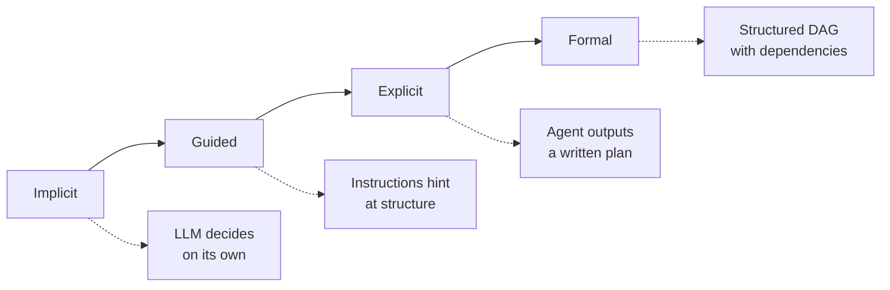
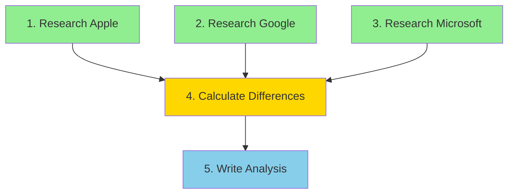

# Task decomposition

## Introduction

When a user asks an agent to "plan a product launch," the agent can't do that in a single step. It needs to break the task into smaller pieces: identify the target audience, draft messaging, coordinate timelines, allocate budget. This process — taking a complex goal and splitting it into manageable, actionable subtasks — is **task decomposition**.

Task decomposition is where reasoning becomes planning. While [chain-of-thought](./02-chain-of-thought-in-agents.md) helps an agent think through a problem, task decomposition helps it organize that thinking into a structured work plan. It answers the question: "What are all the things I need to do, and in what order?"

This is one of the hardest problems in agent design. Decompose too coarsely and the subtasks are still too complex to execute reliably. Decompose too finely and the agent drowns in coordination overhead. Getting the granularity right is both an art and an engineering discipline.

### What we'll cover

- Breaking complex tasks into subtasks
- Subtask identification strategies
- Dependency mapping between subtasks
- Identifying parallel execution opportunities
- Implementation patterns across frameworks

### Prerequisites

- Familiarity with [chain-of-thought reasoning](./02-chain-of-thought-in-agents.md) and problem decomposition basics
- Understanding of the [agent loop](../02-agent-architecture/02-agent-loop-structure.md)
- Basic Python and async programming knowledge

---

## Breaking complex tasks

Not all tasks need decomposition. A simple question like "What's the weather in Paris?" is a single tool call — no decomposition required. But most real-world agent tasks involve multiple steps, dependencies, and decisions.

### When to decompose

| Task characteristic | Decomposition needed? | Example |
|----|----|----|
| Single fact lookup | ❌ No | "What's the capital of France?" |
| Multi-fact synthesis | ✅ Yes | "Compare GDP growth of G7 nations" |
| Sequential dependencies | ✅ Yes | "Book a flight, then a hotel near the airport" |
| Multiple tool categories | ✅ Yes | "Research a topic, analyze data, write a report" |
| Conditional branching | ✅ Yes | "If the stock is up, buy; if down, wait" |

### The decomposition spectrum

Decomposition exists on a spectrum from implicit to explicit:



**Implicit decomposition** relies entirely on the LLM's natural ability to break down tasks. This works for simple multi-step tasks but fails on complex ones.

**Guided decomposition** uses system instructions to steer the agent toward decomposition without mandating a specific format.

**Explicit decomposition** requires the agent to output a structured plan before executing any subtasks.

**Formal decomposition** represents subtasks as a directed acyclic graph (DAG) with explicit dependencies, enabling parallel execution and failure isolation.

> **🤖 AI Context:** Anthropic's research identifies the orchestrator-workers pattern as a key architecture for task decomposition: "a central LLM dynamically breaks down tasks, delegates them to worker LLMs, and synthesizes their results." This pattern is ideal when you can't predict the subtasks in advance.

---

## Subtask identification

The first step in decomposition is identifying what the subtasks actually are. This is where the agent's reasoning capabilities are critical — it must understand the goal well enough to break it into pieces that are each small enough to execute reliably.

### Strategies for identifying subtasks

#### Goal-backward decomposition

Start from the desired output and work backward to identify what's needed:

```
Goal: "Generate a competitive analysis report"

What does the report need?
├── Executive summary ← needs all sections complete
├── Market overview ← needs market data
├── Competitor profiles ← needs competitor data
│   ├── Company A profile ← needs revenue, products, strategy
│   ├── Company B profile ← needs revenue, products, strategy
│   └── Company C profile ← needs revenue, products, strategy
├── SWOT analysis ← needs all competitor data
└── Recommendations ← needs SWOT analysis
```

#### Process-forward decomposition

Follow the natural process flow from input to output:

```
Input: "Migrate database from PostgreSQL to MongoDB"

Process flow:
1. Analyze existing PostgreSQL schema
2. Design MongoDB document models
3. Write migration scripts
4. Test migration on staging data
5. Execute production migration
6. Validate data integrity
7. Update application connection strings
```

#### Capability-based decomposition

Split by which tool or capability handles each part:

```
Task: "Create a blog post with SEO optimization"

By capability:
├── [research_tool] Research the topic
├── [writing_tool] Draft the content
├── [seo_tool] Analyze keyword density
├── [writing_tool] Revise based on SEO feedback
└── [image_tool] Generate featured image
```

### Implementing subtask identification

Here's an agent that explicitly identifies subtasks before executing them:

```python
from pydantic import BaseModel
from agents import Agent, Runner, function_tool

class Subtask(BaseModel):
    """A single subtask identified by the decomposition agent."""
    id: int
    description: str
    depends_on: list[int]      # IDs of subtasks this depends on
    tool_needed: str            # Which tool to use
    estimated_complexity: str   # "low", "medium", "high"

class TaskPlan(BaseModel):
    """A complete decomposition of a complex task."""
    goal: str
    subtasks: list[Subtask]
    execution_order: list[int]  # Suggested order of execution

# First agent: decompose the task
planner = Agent(
    name="task_planner",
    instructions="""You are a task planning agent. Your ONLY job is to
    decompose complex tasks into subtasks.

    For each subtask, identify:
    - A clear, specific description
    - Which tool it requires
    - Which other subtasks it depends on
    - Its complexity (low/medium/high)

    Output a structured plan. Do NOT execute any subtasks.

    Available tools for execution:
    - research: Look up information
    - analyze: Process and analyze data
    - write: Generate text content
    - calculate: Perform calculations""",
    output_type=TaskPlan,
)

async def decompose_task(task: str) -> TaskPlan:
    result = await Runner.run(planner, task)
    return result.final_output
```

**Output:**
```json
{
  "goal": "Compare Q3 earnings of Apple, Google, and Microsoft",
  "subtasks": [
    {"id": 1, "description": "Look up Apple Q3 earnings", "depends_on": [], "tool_needed": "research", "estimated_complexity": "low"},
    {"id": 2, "description": "Look up Google Q3 earnings", "depends_on": [], "tool_needed": "research", "estimated_complexity": "low"},
    {"id": 3, "description": "Look up Microsoft Q3 earnings", "depends_on": [], "tool_needed": "research", "estimated_complexity": "low"},
    {"id": 4, "description": "Calculate percentage differences", "depends_on": [1, 2, 3], "tool_needed": "calculate", "estimated_complexity": "low"},
    {"id": 5, "description": "Write comparative analysis", "depends_on": [4], "tool_needed": "write", "estimated_complexity": "medium"}
  ],
  "execution_order": [1, 2, 3, 4, 5]
}
```

---

## Dependency mapping

Once subtasks are identified, the next step is mapping dependencies between them. Dependencies determine execution order and reveal opportunities for parallelism.

### Types of dependencies

| Dependency type | Description | Example |
|------|------|------|
| **Data dependency** | Subtask B needs data produced by subtask A | "Calculate total" needs all individual values |
| **Order dependency** | Subtask B must happen after A regardless of data | "Deploy" must happen after "test" |
| **Resource dependency** | Subtasks compete for the same limited resource | Two subtasks need the same API with rate limits |
| **Conditional dependency** | Subtask B only runs if subtask A produces a specific result | "Escalate to human" only if "validate" fails |

### Visualizing dependencies as a DAG

Dependencies form a directed acyclic graph (DAG). Visualizing this graph reveals the critical path — the longest sequence of dependent subtasks that determines the minimum total execution time.



In this graph, subtasks 1, 2, and 3 have no dependencies on each other (green) — they can run in parallel. Subtask 4 (yellow) depends on all three research tasks. Subtask 5 (blue) depends on the calculation.

### Implementing dependency tracking

```python
from dataclasses import dataclass, field

@dataclass
class SubtaskNode:
    """A node in the task dependency graph."""
    id: int
    description: str
    depends_on: list[int] = field(default_factory=list)
    status: str = "pending"   # pending, running, completed, failed
    result: str | None = None

class TaskGraph:
    """Manages subtask dependencies and execution order."""

    def __init__(self):
        self.nodes: dict[int, SubtaskNode] = {}

    def add_subtask(self, subtask: SubtaskNode):
        self.nodes[subtask.id] = subtask

    def get_ready_subtasks(self) -> list[SubtaskNode]:
        """Return subtasks whose dependencies are all completed."""
        ready = []
        for node in self.nodes.values():
            if node.status != "pending":
                continue
            deps_met = all(
                self.nodes[dep_id].status == "completed"
                for dep_id in node.depends_on
            )
            if deps_met:
                ready.append(node)
        return ready

    def mark_completed(self, subtask_id: int, result: str):
        self.nodes[subtask_id].status = "completed"
        self.nodes[subtask_id].result = result

    def mark_failed(self, subtask_id: int, error: str):
        self.nodes[subtask_id].status = "failed"
        self.nodes[subtask_id].result = f"ERROR: {error}"

    def is_complete(self) -> bool:
        return all(
            node.status in ("completed", "failed")
            for node in self.nodes.values()
        )

    def get_critical_path(self) -> list[int]:
        """Find the longest path through the dependency graph."""
        # Topological sort with longest path calculation
        distances: dict[int, int] = {}
        for node_id in self._topological_sort():
            node = self.nodes[node_id]
            if not node.depends_on:
                distances[node_id] = 1
            else:
                distances[node_id] = 1 + max(
                    distances[dep] for dep in node.depends_on
                )
        # Trace back from the node with maximum distance
        max_id = max(distances, key=lambda k: distances[k])
        path = [max_id]
        current = max_id
        while self.nodes[current].depends_on:
            prev = max(
                self.nodes[current].depends_on,
                key=lambda d: distances[d],
            )
            path.append(prev)
            current = prev
        return list(reversed(path))

    def _topological_sort(self) -> list[int]:
        """Return node IDs in topological order."""
        visited = set()
        order = []

        def visit(node_id):
            if node_id in visited:
                return
            visited.add(node_id)
            for dep in self.nodes[node_id].depends_on:
                visit(dep)
            order.append(node_id)

        for node_id in self.nodes:
            visit(node_id)
        return order

# Usage
graph = TaskGraph()
graph.add_subtask(SubtaskNode(1, "Research Apple"))
graph.add_subtask(SubtaskNode(2, "Research Google"))
graph.add_subtask(SubtaskNode(3, "Research Microsoft"))
graph.add_subtask(SubtaskNode(4, "Calculate differences", depends_on=[1, 2, 3]))
graph.add_subtask(SubtaskNode(5, "Write analysis", depends_on=[4]))

# Find what can run now
ready = graph.get_ready_subtasks()
print(f"Ready to execute: {[s.description for s in ready]}")
# Output: Ready to execute: ['Research Apple', 'Research Google', 'Research Microsoft']

# After completing the first batch
for s in ready:
    graph.mark_completed(s.id, f"Results for {s.description}")

ready = graph.get_ready_subtasks()
print(f"Now ready: {[s.description for s in ready]}")
# Output: Now ready: ['Calculate differences']
```

**Output:**
```
Ready to execute: ['Research Apple', 'Research Google', 'Research Microsoft']
Now ready: ['Calculate differences']
```

---

## Parallel execution opportunities

When subtasks have no dependencies on each other, they can run concurrently. Identifying and exploiting these opportunities dramatically reduces agent execution time.

### Identifying parallelism

The `get_ready_subtasks()` method above automatically identifies parallel opportunities. Any subtasks returned together have no mutual dependencies and can execute simultaneously.

### Implementing parallel execution

#### With Python asyncio

```python
import asyncio
from agents import Agent, Runner, function_tool

@function_tool
def research_company(company: str) -> str:
    """Research financial data for a company."""
    return f"Financial data for {company}: revenue $X, growth Y%"

worker = Agent(
    name="research_worker",
    instructions="Research the given company and return key financial data.",
    tools=[research_company],
)

async def execute_parallel_subtasks(subtasks: list[SubtaskNode]) -> dict:
    """Execute independent subtasks concurrently."""
    async def run_one(subtask: SubtaskNode) -> tuple[int, str]:
        result = await Runner.run(worker, subtask.description)
        return subtask.id, result.final_output

    # Run all independent subtasks concurrently
    results = await asyncio.gather(
        *[run_one(s) for s in subtasks]
    )
    return dict(results)

async def execute_task_graph(graph: TaskGraph):
    """Execute all subtasks respecting dependencies."""
    while not graph.is_complete():
        ready = graph.get_ready_subtasks()
        if not ready:
            print("ERROR: No subtasks ready but graph not complete — cycle detected!")
            break

        print(f"Executing in parallel: {[s.description for s in ready]}")
        results = await execute_parallel_subtasks(ready)

        for subtask_id, result in results.items():
            graph.mark_completed(subtask_id, result)
            print(f"  ✅ Completed: {graph.nodes[subtask_id].description}")
```

**Output:**
```
Executing in parallel: ['Research Apple', 'Research Google', 'Research Microsoft']
  ✅ Completed: Research Apple
  ✅ Completed: Research Google
  ✅ Completed: Research Microsoft
Executing in parallel: ['Calculate differences']
  ✅ Completed: Calculate differences
Executing in parallel: ['Write analysis']
  ✅ Completed: Write analysis
```

#### With LangGraph's Send API

LangGraph provides a native mechanism for parallel execution through its `Send` API:

```python
from langgraph.graph import StateGraph, START, END
from langgraph.types import Send
from typing import TypedDict, Annotated
import operator

class ResearchState(TypedDict):
    companies: list[str]
    results: Annotated[list[str], operator.add]
    final_report: str

def plan_research(state: ResearchState):
    """Fan out: create parallel research tasks."""
    return [
        Send("research_company", {"company": company})
        for company in state["companies"]
    ]

def research_company(state: dict):
    """Research a single company (runs in parallel)."""
    company = state["company"]
    # In production, call actual research tools
    return {"results": [f"{company}: revenue data gathered"]}

def synthesize(state: ResearchState):
    """Combine all research results into a report."""
    combined = "\n".join(state["results"])
    return {"final_report": f"Comparative Analysis:\n{combined}"}

graph = StateGraph(ResearchState)
graph.add_node("research_company", research_company)
graph.add_node("synthesize", synthesize)
graph.add_conditional_edges(START, plan_research)
graph.add_edge("research_company", "synthesize")
graph.add_edge("synthesize", END)

agent = graph.compile()
result = agent.invoke({
    "companies": ["Apple", "Google", "Microsoft"],
    "results": [],
})
```

> **💡 Tip:** When using parallel execution, ensure your tools are idempotent — calling them twice with the same input should produce the same result. This is important because retry logic may re-execute a subtask after a partial failure.

---

## Best practices

| Practice | Why it matters |
|----------|----------------|
| Decompose before executing | Prevents wasted work on subtasks that turn out to be unnecessary |
| Use structured output for plans | Machine-parseable plans enable automated execution and monitoring |
| Track dependencies explicitly | Enables parallel execution and correct ordering |
| Limit decomposition depth | 2-3 levels deep is usually sufficient; deeper creates overhead |
| Make subtasks independently testable | Each subtask should be verifiable on its own |
| Include a synthesis step | Raw subtask results must be combined into a coherent answer |

---

## Common pitfalls

| ❌ Mistake | ✅ Solution |
|-----------|-------------|
| Subtasks too vague ("do research") | Make each subtask specific enough to be a single tool call |
| Missing dependencies | Always check: "Does this subtask need anything from another?" |
| No failure handling | Plan for what happens when a subtask fails — skip, retry, or abort? |
| Over-decomposing simple tasks | Not every task needs formal decomposition — use judgment |
| Ignoring parallel opportunities | Check for independent subtasks and run them concurrently |

---

## Hands-on exercise

### Your task

Build a task decomposition system that takes a complex goal, breaks it into subtasks with dependencies, identifies parallel execution opportunities, and executes them efficiently.

### Requirements

1. Create a `TaskGraph` class (or use the one from this lesson)
2. Decompose the task: "Prepare a market entry analysis for launching a SaaS product in Japan"
3. Identify at least 6 subtasks with proper dependencies
4. Execute independent subtasks in parallel using `asyncio.gather`
5. Print the execution timeline showing which subtasks ran in parallel

### Expected result

A timeline showing 3-4 parallel batches with the final synthesis step at the end.

<details>
<summary>💡 Hints (click to expand)</summary>

- Market entry analysis typically involves: market size research, competitor analysis, regulatory requirements, pricing strategy, localization needs, and go-to-market plan
- Market size and competitor analysis can run in parallel
- Pricing strategy depends on both market size and competitor data
- The go-to-market plan depends on everything else
- Use `time.time()` to track actual execution time savings from parallelism

</details>

<details>
<summary>✅ Solution (click to expand)</summary>

```python
import asyncio
import time

async def mock_research(subtask: str, duration: float = 0.5) -> str:
    """Simulate a research task with configurable duration."""
    await asyncio.sleep(duration)
    return f"Completed: {subtask}"

async def main():
    # Define the task graph
    graph = TaskGraph()
    graph.add_subtask(SubtaskNode(1, "Research Japan SaaS market size"))
    graph.add_subtask(SubtaskNode(2, "Analyze competitors in Japan SaaS"))
    graph.add_subtask(SubtaskNode(3, "Research regulatory requirements"))
    graph.add_subtask(SubtaskNode(4, "Study localization needs"))
    graph.add_subtask(SubtaskNode(
        5, "Develop pricing strategy",
        depends_on=[1, 2]  # Needs market + competitor data
    ))
    graph.add_subtask(SubtaskNode(
        6, "Draft go-to-market plan",
        depends_on=[1, 2, 3, 4, 5]  # Needs everything
    ))

    print("Critical path:", graph.get_critical_path())
    print()

    batch_num = 0
    start = time.time()

    while not graph.is_complete():
        batch_num += 1
        ready = graph.get_ready_subtasks()
        names = [s.description for s in ready]
        print(f"Batch {batch_num} (parallel): {names}")

        results = await asyncio.gather(
            *[mock_research(s.description) for s in ready]
        )

        for subtask, result in zip(ready, results):
            graph.mark_completed(subtask.id, result)

    elapsed = time.time() - start
    print(f"\nTotal time: {elapsed:.1f}s (sequential would be ~{len(graph.nodes) * 0.5:.1f}s)")

asyncio.run(main())
```

**Expected output:**
```
Critical path: [1, 5, 6]

Batch 1 (parallel): ['Research Japan SaaS market size', 'Analyze competitors in Japan SaaS', 'Research regulatory requirements', 'Study localization needs']
Batch 2 (parallel): ['Develop pricing strategy']
Batch 3 (parallel): ['Draft go-to-market plan']

Total time: 1.5s (sequential would be ~3.0s)
```

</details>

### Bonus challenges

- [ ] Add estimated duration to each subtask and calculate the theoretical speedup from parallelization
- [ ] Implement conditional subtasks that only execute based on previous results (e.g., "If regulatory barriers are high, add a legal review subtask")
- [ ] Visualize the task graph using Mermaid syntax generated by your code

---

## Summary

✅ Task decomposition transforms complex goals into manageable, executable subtasks — it's where reasoning becomes planning

✅ Use **goal-backward**, **process-forward**, or **capability-based** strategies depending on the task type

✅ **Dependency mapping** reveals execution order and parallel opportunities — represent dependencies as a directed acyclic graph (DAG)

✅ **Parallel execution** of independent subtasks dramatically reduces total execution time — use `asyncio.gather` or LangGraph's `Send` API

✅ Keep subtasks specific enough to be a single tool call or agent action — decomposition is about *right-sizing*, not just splitting

**Next:** [Plan Generation](./04-plan-generation.md)

---

## Further reading

- [Anthropic: Orchestrator-Workers Pattern](https://www.anthropic.com/engineering/building-effective-agents) — Dynamic task decomposition with worker agents
- [LangGraph: Send API](https://docs.langchain.com/oss/python/langgraph/graph-api) — Parallel fan-out execution
- [Google ADK: Workflow Agents](https://google.github.io/adk-docs/agents/workflow-agents/) — SequentialAgent, ParallelAgent, and LoopAgent
- [OpenAI: A Practical Guide to Building Agents](https://cdn.openai.com/business-guides-and-resources/a-practical-guide-to-building-agents.pdf) — Multi-agent design patterns

*[Back to Reasoning & Planning Overview](./00-reasoning-planning.md)*

<!--
Sources Consulted:
- Anthropic Building Effective Agents (orchestrator-workers, parallelization): https://www.anthropic.com/engineering/building-effective-agents
- Google ADK Workflow Agents (SequentialAgent, ParallelAgent): https://google.github.io/adk-docs/agents/workflow-agents/
- LangGraph Overview (state management, graph compilation): https://docs.langchain.com/oss/python/langgraph/overview
- OpenAI Agents SDK (structured output, output_type): https://openai.github.io/openai-agents-python/agents/
-->
