```mermaid
flowchart TD
    A[Start Validation] --> B{Circular\ndependencies?}
    B -->|Yes| FAIL[❌ Plan Invalid]
    B -->|No| C{Invalid\nreferences?}
    C -->|Yes| FAIL
    C -->|No| D{Orphaned\nsteps?}
    D -->|Yes| WARN[⚠️ Warning]
    D -->|No| E{Unreachable\nsteps?}
    E -->|Yes| FAIL
    E -->|No| PASS[✅ Structure Valid]
    WARN --> E
```

# Plan validation

## Introduction

Generating a plan is only half the battle. Before an agent commits resources to executing a multi-step plan, it should validate that the plan is actually feasible. Plan validation is the systematic process of checking whether a plan can succeed — are the required tools available? Do the dependencies make sense? Are there enough resources? What could go wrong?

Without validation, agents waste time and tokens executing plans that were doomed from the start. A plan that references a tool the agent doesn't have, creates a circular dependency, or requires more API calls than the budget allows will fail mid-execution, potentially leaving the system in an inconsistent state. Validation catches these issues before the first step runs.

### What we'll cover

- Feasibility checking for plan steps
- Constraint verification (structural and resource)
- Resource availability assessment
- Risk assessment and contingency planning
- Implementation patterns for plan validators

### Prerequisites

- Understanding of [plan generation](./04-plan-generation.md) — structured plans with steps, dependencies, and resources
- Familiarity with [task decomposition](./03-task-decomposition.md) — dependency graphs and parallel execution
- Basic Python knowledge

---

## Feasibility checking

Feasibility checking answers the fundamental question: "Can each step in this plan actually be executed?" A step is feasible if the agent has the tools, data, and capabilities to carry it out.

### Step-level feasibility

Each step must pass three feasibility checks:

1. **Tool availability** — Does the specified tool exist and is it accessible?
2. **Input availability** — Are the required inputs available (from prior steps or the initial context)?
3. **Output capability** — Can the tool produce the expected output format?

```python
from dataclasses import dataclass, field

@dataclass
class FeasibilityResult:
    """Result of a feasibility check on a single step."""
    step_number: int
    is_feasible: bool
    issues: list[str] = field(default_factory=list)
    warnings: list[str] = field(default_factory=list)

def check_step_feasibility(
    step: "PlanStep",
    available_tools: set[str],
    completed_step_outputs: dict[int, str],
    initial_context: dict,
) -> FeasibilityResult:
    """Check if a single plan step is feasible."""
    issues = []
    warnings = []

    # Check 1: Tool exists
    if step.tool not in available_tools:
        issues.append(
            f"Tool '{step.tool}' is not available. "
            f"Available: {available_tools}"
        )

    # Check 2: Inputs are available
    for input_key, input_source in step.input_sources.items():
        if input_source.startswith("step_"):
            # Input comes from a previous step
            source_step = int(input_source.split("_")[1].split(".")[0])
            if source_step not in completed_step_outputs:
                if source_step not in [s for s in step.depends_on]:
                    issues.append(
                        f"Input '{input_key}' requires step {source_step}, "
                        f"but it's not in dependencies"
                    )
        elif input_source.startswith("context."):
            # Input comes from initial context
            context_key = input_source.split(".", 1)[1]
            if context_key not in initial_context:
                issues.append(
                    f"Input '{input_key}' requires context key "
                    f"'{context_key}', which is not provided"
                )

    # Check 3: Fallback exists for critical steps
    if step.fallback is None and step.estimated_seconds > 30:
        warnings.append(
            f"Step {step.step_number} has no fallback strategy "
            f"but takes {step.estimated_seconds}s — consider adding one"
        )

    return FeasibilityResult(
        step_number=step.step_number,
        is_feasible=len(issues) == 0,
        issues=issues,
        warnings=warnings,
    )
```

### Plan-level feasibility

Beyond individual steps, the plan as a whole must be feasible:

```python
@dataclass
class PlanFeasibility:
    """Overall feasibility assessment for an execution plan."""
    is_feasible: bool
    step_results: list[FeasibilityResult]
    structural_issues: list[str]
    resource_issues: list[str]
    risk_level: str  # "low", "medium", "high"

def validate_plan(
    plan: "ExecutionPlan",
    available_tools: set[str],
    resource_budget: "ResourceBudget",
    initial_context: dict,
) -> PlanFeasibility:
    """Validate an entire execution plan."""
    step_results = []
    structural_issues = []
    resource_issues = []

    # Check each step
    for step in plan.steps:
        result = check_step_feasibility(
            step, available_tools, {}, initial_context
        )
        step_results.append(result)

    # Check structural integrity
    structural_issues.extend(
        check_dependency_structure(plan)
    )

    # Check resource constraints
    resource_issues.extend(
        check_resource_budget(plan, resource_budget)
    )

    all_feasible = (
        all(r.is_feasible for r in step_results)
        and len(structural_issues) == 0
        and len(resource_issues) == 0
    )

    risk_level = assess_risk_level(
        step_results, structural_issues, resource_issues
    )

    return PlanFeasibility(
        is_feasible=all_feasible,
        step_results=step_results,
        structural_issues=structural_issues,
        resource_issues=resource_issues,
        risk_level=risk_level,
    )
```

**Output:**
```
Plan Validation Report
══════════════════════
Overall: ✅ FEASIBLE (risk: medium)

Step Results:
  Step 1: ✅ Feasible
  Step 2: ✅ Feasible
  Step 3: ✅ Feasible (⚠️ 1 warning: no fallback strategy)
  Step 4: ✅ Feasible
  Step 5: ✅ Feasible

Structural: No issues
Resources: No issues
Warnings: 1 total
```

---

## Constraint verification

Constraint verification checks that the plan's structure is internally consistent — dependencies don't form cycles, step numbers are valid, and the execution order is logically sound.

### Structural constraints

#### Circular dependency detection

A plan with circular dependencies can never complete. Step A depends on Step B, which depends on Step A — neither can start.

```python
def check_circular_dependencies(plan: "ExecutionPlan") -> list[str]:
    """Detect circular dependencies in a plan."""
    issues = []
    step_deps = {
        step.step_number: set(step.depends_on)
        for step in plan.steps
    }

    def has_cycle(node: int, visited: set, stack: set) -> bool:
        visited.add(node)
        stack.add(node)
        for dep in step_deps.get(node, set()):
            if dep not in visited:
                if has_cycle(dep, visited, stack):
                    return True
            elif dep in stack:
                return True
        stack.remove(node)
        return False

    visited = set()
    for step_num in step_deps:
        if step_num not in visited:
            if has_cycle(step_num, visited, set()):
                issues.append(
                    f"Circular dependency detected involving step {step_num}"
                )

    return issues
```

#### Invalid reference detection

Steps that depend on non-existent steps will fail at runtime:

```python
def check_invalid_references(plan: "ExecutionPlan") -> list[str]:
    """Check for references to non-existent steps."""
    issues = []
    valid_steps = {step.step_number for step in plan.steps}

    for step in plan.steps:
        for dep in step.depends_on:
            if dep not in valid_steps:
                issues.append(
                    f"Step {step.step_number} depends on step {dep}, "
                    f"which doesn't exist"
                )
            if dep == step.step_number:
                issues.append(
                    f"Step {step.step_number} depends on itself"
                )
            if dep > step.step_number:
                issues.append(
                    f"Step {step.step_number} depends on later step {dep} "
                    f"— forward dependencies suggest a planning error"
                )

    return issues
```

### Complete structural validation

Combining all structural checks:

```python
def check_dependency_structure(plan: "ExecutionPlan") -> list[str]:
    """Run all structural validation checks on a plan."""
    issues = []

    # Check for circular dependencies
    issues.extend(check_circular_dependencies(plan))

    # Check for invalid references
    issues.extend(check_invalid_references(plan))

    # Check for orphaned steps (no path to final output)
    all_deps = set()
    for step in plan.steps:
        all_deps.update(step.depends_on)
    terminal_steps = [
        step.step_number for step in plan.steps
        if step.step_number not in all_deps
    ]
    if len(terminal_steps) > 1:
        issues.append(
            f"Multiple terminal steps detected: {terminal_steps}. "
            f"Plan may produce multiple unconnected outputs."
        )

    # Check for unreachable steps
    reachable = set()
    no_dep_steps = [
        s.step_number for s in plan.steps if not s.depends_on
    ]
    queue = list(no_dep_steps)
    while queue:
        current = queue.pop(0)
        reachable.add(current)
        for step in plan.steps:
            if current in step.depends_on and step.step_number not in reachable:
                if all(d in reachable for d in step.depends_on):
                    queue.append(step.step_number)

    unreachable = {
        s.step_number for s in plan.steps
    } - reachable
    if unreachable:
        issues.append(
            f"Unreachable steps detected: {unreachable}. "
            f"These steps have unsatisfiable dependencies."
        )

    return issues
```



---

## Resource availability

Resource validation ensures the plan won't exhaust available resources mid-execution. This is particularly important for production systems where API calls have costs, rate limits apply, and compute time is budgeted.

### Resource budget validation

```python
def check_resource_budget(
    plan: "ExecutionPlan",
    budget: "ResourceBudget",
) -> list[str]:
    """Validate plan against available resources."""
    issues = []

    # Check total tool calls
    total_calls = len(plan.steps)
    retry_calls = sum(
        step.max_retries for step in plan.steps
        if hasattr(step, 'max_retries')
    )
    worst_case_calls = total_calls + retry_calls

    if total_calls > budget.max_tool_calls:
        issues.append(
            f"Plan requires {total_calls} tool calls, "
            f"but budget allows only {budget.max_tool_calls}"
        )
    elif worst_case_calls > budget.max_tool_calls:
        issues.append(
            f"Plan may require up to {worst_case_calls} calls "
            f"(with retries), exceeding budget of {budget.max_tool_calls}"
        )

    # Check execution time
    if plan.total_estimated_seconds > budget.max_execution_seconds:
        issues.append(
            f"Plan estimated at {plan.total_estimated_seconds}s, "
            f"exceeding budget of {budget.max_execution_seconds}s"
        )

    # Check tool availability
    if budget.available_tools:
        required_tools = {step.tool for step in plan.steps}
        missing = required_tools - set(budget.available_tools)
        if missing:
            issues.append(
                f"Plan requires tools not in budget: {missing}"
            )

    return issues
```

### Rate limit awareness

When multiple steps use the same API, rate limits become a constraint:

```python
from collections import Counter

def check_rate_limits(
    plan: "ExecutionPlan",
    rate_limits: dict[str, int],  # tool -> max calls per minute
) -> list[str]:
    """Check if the plan respects API rate limits."""
    issues = []

    # Count tool usage
    tool_usage = Counter(step.tool for step in plan.steps)

    # Check parallel waves for burst usage
    waves = _compute_waves(plan)
    for wave_num, wave in enumerate(waves, 1):
        wave_tools = Counter(
            next(s.tool for s in plan.steps if s.step_number == step_id)
            for step_id in wave
        )
        for tool, count in wave_tools.items():
            if tool in rate_limits and count > rate_limits[tool]:
                issues.append(
                    f"Wave {wave_num}: {count} parallel calls to '{tool}' "
                    f"exceeds rate limit of {rate_limits[tool]}/min"
                )

    return issues
```

> **💡 Tip:** When rate limits are tight, the validator can suggest splitting parallel steps into sequential batches. This trades speed for reliability — better to run slower than to hit rate limits and fail.

---

## Risk assessment

Not all plan failures are equal. Risk assessment evaluates the probability and impact of potential failures, helping the agent and developer make informed decisions about whether to proceed.

### Risk factors

| Risk factor | Low risk | Medium risk | High risk |
|-------------|----------|-------------|-----------|
| Tool reliability | Well-tested, stable API | Occasionally slow | Experimental or unreliable |
| Data freshness | Static data | Data changes weekly | Real-time data required |
| Step count | 1-3 steps | 4-7 steps | 8+ steps |
| Sequential depth | 1-2 levels | 3-4 levels | 5+ levels |
| Fallback coverage | All steps have fallbacks | Most critical steps covered | Few or no fallbacks |
| Resource margin | 50%+ budget remaining | 20-50% margin | Less than 20% margin |

### Implementing risk assessment

```python
def assess_risk_level(
    step_results: list[FeasibilityResult],
    structural_issues: list[str],
    resource_issues: list[str],
) -> str:
    """Assess the overall risk level of a plan."""
    risk_score = 0

    # Structural issues are highest risk
    risk_score += len(structural_issues) * 10

    # Resource issues are high risk
    risk_score += len(resource_issues) * 7

    # Step-level issues
    for result in step_results:
        if not result.is_feasible:
            risk_score += 5
        risk_score += len(result.warnings) * 2

    # Total step count factor
    total_steps = len(step_results)
    if total_steps > 10:
        risk_score += 5
    elif total_steps > 7:
        risk_score += 3

    if risk_score == 0:
        return "low"
    elif risk_score < 10:
        return "medium"
    else:
        return "high"

def generate_risk_report(
    plan: "ExecutionPlan",
    feasibility: "PlanFeasibility",
) -> str:
    """Generate a human-readable risk assessment report."""
    lines = [
        "╔══════════════════════════════════╗",
        "║      Plan Validation Report      ║",
        "╚══════════════════════════════════╝",
        "",
        f"Goal: {plan.goal}",
        f"Steps: {len(plan.steps)}",
        f"Estimated time: {plan.total_estimated_seconds}s",
        f"Risk level: {feasibility.risk_level.upper()}",
        f"Feasible: {'✅ Yes' if feasibility.is_feasible else '❌ No'}",
        "",
    ]

    if feasibility.structural_issues:
        lines.append("Structural Issues:")
        for issue in feasibility.structural_issues:
            lines.append(f"  ❌ {issue}")
        lines.append("")

    if feasibility.resource_issues:
        lines.append("Resource Issues:")
        for issue in feasibility.resource_issues:
            lines.append(f"  ❌ {issue}")
        lines.append("")

    for result in feasibility.step_results:
        status = "✅" if result.is_feasible else "❌"
        lines.append(f"  Step {result.step_number}: {status}")
        for issue in result.issues:
            lines.append(f"    ❌ {issue}")
        for warning in result.warnings:
            lines.append(f"    ⚠️ {warning}")

    return "\n".join(lines)
```

**Output:**
```
╔══════════════════════════════════╗
║      Plan Validation Report      ║
╚══════════════════════════════════╝

Goal: Compare Python web frameworks
Steps: 8
Estimated time: 95s
Risk level: LOW
Feasible: ✅ Yes

  Step 1: ✅
  Step 2: ✅
  Step 3: ✅
  Step 4: ✅
  Step 5: ✅
    ⚠️ Step 5 has no fallback strategy but takes 35s — consider adding one
  Step 6: ✅
  Step 7: ✅
  Step 8: ✅
```

### Using validation to gate execution

In production, validation should be a gate — the agent only proceeds if validation passes:

```python
async def validated_execution(
    plan: "ExecutionPlan",
    available_tools: set[str],
    budget: "ResourceBudget",
) -> str:
    """Execute a plan only if validation passes."""
    # Validate first
    feasibility = validate_plan(plan, available_tools, budget, {})

    if not feasibility.is_feasible:
        report = generate_risk_report(plan, feasibility)
        return f"Plan validation FAILED. Cannot proceed.\n\n{report}"

    if feasibility.risk_level == "high":
        report = generate_risk_report(plan, feasibility)
        return (
            f"Plan validation passed but risk is HIGH. "
            f"Human approval recommended.\n\n{report}"
        )

    # Proceed with execution
    return await execute_plan(plan)
```

> **🤖 AI Context:** Plan validation is where the "evaluator-optimizer" pattern from Anthropic's research applies directly. One LLM generates the plan, another evaluates it. The evaluator can catch issues the planner missed, like unrealistic time estimates or missing edge cases. This separation of concerns improves both plan quality and system reliability.

---

## Best practices

| Practice | Why it matters |
|----------|----------------|
| Validate before executing | Catches fatal errors before wasting resources |
| Check structural integrity first | Circular deps and invalid refs are showstoppers |
| Include resource margin | Plans at 100% budget usage have no room for retries |
| Generate human-readable reports | Developers need to understand *why* validation failed |
| Gate on risk level | High-risk plans should require human approval |
| Validate incrementally | Re-validate after each plan revision, not just once |

---

## Common pitfalls

| ❌ Mistake | ✅ Solution |
|-----------|-------------|
| Skipping validation entirely | Always validate — even simple plans can have structural issues |
| Only checking tools, not inputs | Verify that data flows between steps correctly |
| No risk assessment | Rate every plan's risk level before execution |
| Treating warnings as errors | Warnings are informational — fix them if possible, but don't block |
| Validating only the initial plan | Re-validate after every plan revision |

---

## Hands-on exercise

### Your task

Build a plan validator that checks an execution plan for structural integrity, resource availability, and risk level.

### Requirements

1. Implement `check_circular_dependencies()`, `check_invalid_references()`, and `check_resource_budget()`
2. Create a plan with an intentional issue (e.g., a circular dependency or missing tool)
3. Run the validator and produce a formatted risk report
4. Fix the issues and re-validate to show the plan passing

### Expected result

A risk report showing the detected issues, followed by a clean report after fixes.

<details>
<summary>💡 Hints (click to expand)</summary>

- Create a plan where step 3 depends on step 5 and step 5 depends on step 3
- Use a `ResourceBudget` that's slightly too small for the plan
- The `check_circular_dependencies` function can use depth-first search
- Format the report with clear ✅/❌ markers for readability

</details>

<details>
<summary>✅ Solution (click to expand)</summary>

```python
# Create a deliberately flawed plan
from pydantic import BaseModel

class PlanStep(BaseModel):
    step_number: int
    action: str
    tool: str
    depends_on: list[int] = []
    estimated_seconds: int = 15
    max_retries: int = 1
    fallback: str | None = None

class ExecutionPlan(BaseModel):
    goal: str
    steps: list[PlanStep]
    total_estimated_seconds: int
    success_criteria: str

class ResourceBudget(BaseModel):
    max_tool_calls: int = 10
    max_execution_seconds: int = 120
    available_tools: list[str] = ["research", "analyze", "write"]

# Plan with issues
bad_plan = ExecutionPlan(
    goal="Analyze market trends",
    steps=[
        PlanStep(step_number=1, action="Research market", tool="research"),
        PlanStep(step_number=2, action="Analyze data", tool="analyze", depends_on=[1]),
        PlanStep(step_number=3, action="Generate insights", tool="ai_insights", depends_on=[5]),  # Invalid tool + circular
        PlanStep(step_number=4, action="Validate findings", tool="analyze", depends_on=[3]),
        PlanStep(step_number=5, action="Create report", tool="write", depends_on=[3]),  # Circular with step 3
    ],
    total_estimated_seconds=75,
    success_criteria="Complete market analysis report",
)

budget = ResourceBudget(max_tool_calls=4)  # Too few!

# Run validation
issues = check_circular_dependencies(bad_plan)
issues += check_invalid_references(bad_plan)
resource_issues = check_resource_budget(bad_plan, budget)

print("=== Validation: Bad Plan ===")
for issue in issues:
    print(f"  ❌ {issue}")
for issue in resource_issues:
    print(f"  ❌ {issue}")

# Fix the plan
good_plan = ExecutionPlan(
    goal="Analyze market trends",
    steps=[
        PlanStep(step_number=1, action="Research market", tool="research"),
        PlanStep(step_number=2, action="Analyze data", tool="analyze", depends_on=[1]),
        PlanStep(step_number=3, action="Generate insights", tool="analyze", depends_on=[2]),
        PlanStep(step_number=4, action="Create report", tool="write", depends_on=[3]),
    ],
    total_estimated_seconds=60,
    success_criteria="Complete market analysis report",
)

budget_ok = ResourceBudget(max_tool_calls=10)
issues = check_circular_dependencies(good_plan)
issues += check_invalid_references(good_plan)
resource_issues = check_resource_budget(good_plan, budget_ok)

print("\n=== Validation: Fixed Plan ===")
if not issues and not resource_issues:
    print("  ✅ All checks passed!")
```

**Expected output:**
```
=== Validation: Bad Plan ===
  ❌ Circular dependency detected involving step 3
  ❌ Tool 'ai_insights' is not available. Available: {'research', 'analyze', 'write'}
  ❌ Plan requires 5 tool calls, but budget allows only 4

=== Validation: Fixed Plan ===
  ✅ All checks passed!
```

</details>

### Bonus challenges

- [ ] Add a `check_data_flow()` function that verifies inputs from prior steps are actually produced
- [ ] Implement a risk scoring system that weights different types of issues differently
- [ ] Create a `PlanValidator` class that runs all checks and produces a comprehensive report with recommendations

---

## Summary

✅ **Feasibility checking** verifies each step has the required tools, inputs, and capabilities before execution starts

✅ **Structural validation** catches circular dependencies, invalid references, and orphaned steps that would cause runtime failures

✅ **Resource validation** ensures the plan fits within budget constraints — tool call limits, time budgets, and rate limits

✅ **Risk assessment** quantifies the probability and impact of failure, enabling informed go/no-go decisions

✅ Validation should be a **gate** — production agents should not execute plans that fail validation or have high risk without human approval

**Next:** [Plan Revision](./06-plan-revision.md)

---

## Further reading

- [Anthropic: Building Effective Agents](https://www.anthropic.com/engineering/building-effective-agents) — Evaluator-optimizer pattern for plan validation
- [LangGraph: Human-in-the-Loop](https://docs.langchain.com/oss/python/langgraph/interrupts) — Pausing execution for human validation
- [Google ADK: Callbacks](https://google.github.io/adk-docs/callbacks/) — Before/after model and tool callbacks for validation gates
- [OpenAI Agents SDK: Guardrails](https://openai.github.io/openai-agents-python/guardrails/) — Input and output validation

*[Back to Reasoning & Planning Overview](./00-reasoning-planning.md)*

<!--
Sources Consulted:
- Anthropic Building Effective Agents (evaluator-optimizer, guardrails): https://www.anthropic.com/engineering/building-effective-agents
- Google ADK Callbacks (before/after model, before/after tool): https://google.github.io/adk-docs/callbacks/
- OpenAI Agents SDK Guardrails: https://openai.github.io/openai-agents-python/guardrails/
- LangGraph Human-in-the-loop (interrupts, approval gates): https://docs.langchain.com/oss/python/langgraph/interrupts
-->
