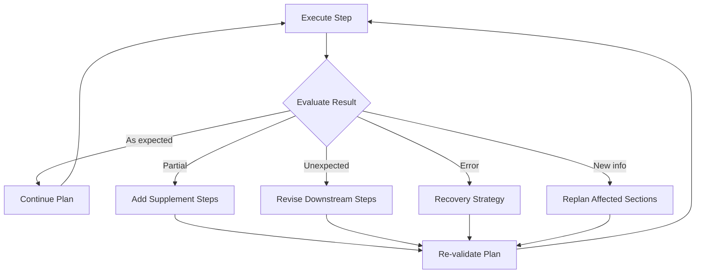
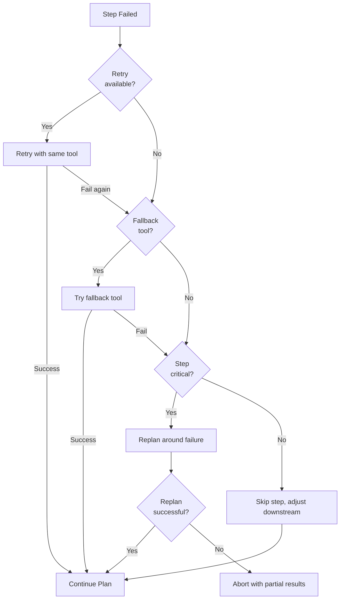

# Plan revision

## Introduction

No plan survives first contact with reality. Tools return unexpected data, APIs time out, intermediate results reveal the original approach was wrong, and new information changes what's possible. Plan revision is the agent's ability to adapt — modifying its plan mid-execution based on what it has learned, rather than blindly following the original steps.

This is what separates truly capable agents from rigid automation scripts. A script that encounters an error stops or retries forever. An agent that can revise its plan recognizes the error, updates its approach, and finds an alternative path to the goal. This adaptive quality is central to Anthropic's definition of agents as "systems where LLMs dynamically direct their own processes and tool usage, maintaining control over how they accomplish tasks."

### What we'll cover

- Feedback integration from tool results and observations
- Dynamic replanning when conditions change
- Failure recovery strategies
- Optimization updates to improve plan efficiency
- Implementation patterns for adaptive agents

### Prerequisites

- Understanding of [plan validation](./05-plan-validation.md) — checking plan feasibility before and during execution
- Familiarity with [plan generation](./04-plan-generation.md) — creating structured execution plans
- Understanding of the [ReAct pattern](./01-react-pattern.md) — how agents interleave reasoning with action
- Basic Python and async programming knowledge

---

## Feedback integration

Feedback integration is the process of incorporating new information into an existing plan. After each step executes, the agent evaluates the result and decides: continue as planned, modify the next steps, or replant entirely.

### Types of feedback

| Feedback type | Source | Agent response |
|------|------|------|
| **Successful result** | Tool returns expected data | Continue to next step |
| **Partial result** | Tool returns incomplete data | Add supplementary steps |
| **Unexpected result** | Data contradicts assumptions | Revise affected downstream steps |
| **Error** | Tool fails | Retry, use fallback, or restructure |
| **New information** | Result reveals something unknown | Add new steps or remove unnecessary ones |

### The feedback loop



### Implementing feedback integration

Here's a pattern for evaluating step results and updating the plan:

```python
from dataclasses import dataclass
from enum import Enum

class FeedbackType(Enum):
    SUCCESS = "success"
    PARTIAL = "partial"
    UNEXPECTED = "unexpected"
    ERROR = "error"
    NEW_INFO = "new_info"

@dataclass
class StepFeedback:
    """Evaluation of a step's execution result."""
    step_number: int
    feedback_type: FeedbackType
    result: str
    assessment: str          # Agent's analysis of the result
    plan_impact: str         # How this affects the remaining plan
    suggested_changes: list[str]  # Specific modifications needed

def evaluate_step_result(
    step: "PlanStep",
    result: str,
    expected: str,
) -> StepFeedback:
    """Evaluate a step's result against expectations."""

    # Simple heuristic evaluation
    if "error" in result.lower() or "failed" in result.lower():
        return StepFeedback(
            step_number=step.step_number,
            feedback_type=FeedbackType.ERROR,
            result=result,
            assessment="Step execution failed",
            plan_impact="Must use fallback or restructure",
            suggested_changes=[
                f"Retry step {step.step_number} with fallback tool",
                "If fallback fails, remove dependent steps",
            ],
        )

    if "no data" in result.lower() or "not found" in result.lower():
        return StepFeedback(
            step_number=step.step_number,
            feedback_type=FeedbackType.PARTIAL,
            result=result,
            assessment="Step returned incomplete data",
            plan_impact="Downstream steps may need adjusted inputs",
            suggested_changes=[
                f"Add supplementary search for missing data",
                "Adjust downstream steps to handle partial data",
            ],
        )

    return StepFeedback(
        step_number=step.step_number,
        feedback_type=FeedbackType.SUCCESS,
        result=result,
        assessment="Step completed successfully",
        plan_impact="No changes needed",
        suggested_changes=[],
    )
```

### Using an LLM for sophisticated feedback evaluation

Simple rule-based evaluation works for clear success/failure. But sophisticated feedback — like recognizing that a search result contradicts a prior assumption — requires LLM reasoning:

```python
from agents import Agent, Runner
from pydantic import BaseModel, Field

class FeedbackAnalysis(BaseModel):
    """LLM's analysis of a step result."""
    result_quality: str = Field(description="'good', 'partial', or 'problematic'")
    key_findings: list[str] = Field(description="Important facts from the result")
    contradictions: list[str] = Field(description="Any contradictions with prior information")
    new_questions: list[str] = Field(description="New questions raised by this result")
    plan_modifications: list[str] = Field(description="Suggested changes to the remaining plan")

feedback_evaluator = Agent(
    name="feedback_evaluator",
    instructions="""You evaluate the results of plan steps.

    Given:
    - The original plan and goal
    - The step that just executed
    - The result of that step
    - Results from prior steps

    Analyze:
    1. Did the step produce the expected output?
    2. Does the result contradict anything from prior steps?
    3. Does the result reveal new information that changes the plan?
    4. Should downstream steps be modified?

    Be specific about any plan modifications needed.""",
    output_type=FeedbackAnalysis,
)
```

---

## Dynamic replanning

When feedback indicates significant changes are needed, the agent must revise its plan. Dynamic replanning ranges from minor adjustments (tweak a parameter) to major restructuring (replace half the remaining steps).

### Replanning triggers

| Trigger | Severity | Response |
|---------|----------|----------|
| Step produces better-than-expected data | Low | Skip redundant validation steps |
| Step produces partial data | Medium | Add supplementary data-gathering steps |
| Assumption proven wrong | Medium | Revise all steps that depended on the assumption |
| Tool unavailable mid-execution | High | Replace all steps using that tool with alternatives |
| Goal changes mid-execution | Critical | Regenerate plan from scratch |

### Implementing dynamic replanning

```python
from agents import Agent, Runner

class PlanRevision:
    """Manages plan revisions during execution."""

    def __init__(self, original_plan: "ExecutionPlan"):
        self.current_plan = original_plan
        self.revision_history: list[dict] = []
        self.completed_steps: dict[int, str] = {}

    def apply_revision(
        self,
        changes: list[str],
        reason: str,
    ) -> "ExecutionPlan":
        """Apply changes to the current plan."""
        # Record the revision
        self.revision_history.append({
            "revision_number": len(self.revision_history) + 1,
            "reason": reason,
            "changes": changes,
            "steps_completed_at_revision": len(self.completed_steps),
        })
        return self.current_plan

    def add_step(
        self,
        after_step: int,
        new_step: "PlanStep",
    ):
        """Insert a new step into the plan."""
        # Renumber subsequent steps
        for step in self.current_plan.steps:
            if step.step_number > after_step:
                step.step_number += 1
                step.depends_on = [
                    d + 1 if d > after_step else d
                    for d in step.depends_on
                ]
        self.current_plan.steps.append(new_step)
        self.current_plan.steps.sort(key=lambda s: s.step_number)

    def remove_step(self, step_number: int):
        """Remove a step and update dependencies."""
        self.current_plan.steps = [
            s for s in self.current_plan.steps
            if s.step_number != step_number
        ]
        # Remove from dependencies
        for step in self.current_plan.steps:
            step.depends_on = [
                d for d in step.depends_on
                if d != step_number
            ]

    def replace_tool(self, old_tool: str, new_tool: str):
        """Replace all uses of a tool with an alternative."""
        for step in self.current_plan.steps:
            if step.tool == old_tool:
                step.tool = new_tool

    def get_remaining_steps(self) -> list["PlanStep"]:
        """Return only steps that haven't been completed."""
        return [
            s for s in self.current_plan.steps
            if s.step_number not in self.completed_steps
        ]
```

### LLM-driven replanning

For complex revisions, use an LLM to regenerate the remaining plan:

```python
replanner = Agent(
    name="replanner",
    instructions="""You are a plan revision agent. Given:
    - The original goal
    - Steps completed so far and their results
    - The current remaining plan
    - The reason for replanning

    Generate a REVISED plan for the remaining work. You may:
    - Add new steps
    - Remove steps that are no longer needed
    - Reorder steps
    - Change tools or parameters
    - Adjust time estimates

    The revised plan must:
    - Build on completed work (don't redo successful steps)
    - Address the reason for replanning
    - Still achieve the original goal
    - Include updated dependencies""",
    output_type="ExecutionPlan",
)

async def replan(
    revision: PlanRevision,
    reason: str,
) -> "ExecutionPlan":
    """Use an LLM to generate a revised plan."""
    context = (
        f"Original goal: {revision.current_plan.goal}\n"
        f"Completed steps: {revision.completed_steps}\n"
        f"Remaining steps: {[s.step_number for s in revision.get_remaining_steps()]}\n"
        f"Reason for replanning: {reason}"
    )
    result = await Runner.run(replanner, context)
    new_plan = result.final_output
    revision.apply_revision(
        changes=[f"Regenerated remaining plan: {len(new_plan.steps)} steps"],
        reason=reason,
    )
    revision.current_plan = new_plan
    return new_plan
```

> **🔑 Key concept:** The key to effective replanning is preserving completed work. Never redo steps that succeeded unless the results are invalidated. This means the replanner must understand what has already been accomplished and build on it.

---

## Failure recovery

Failure recovery is the most critical form of plan revision. When a step fails, the agent must decide how to respond without losing progress or entering an infinite loop.

### Recovery strategies



### Implementing recovery

```python
from enum import Enum

class RecoveryAction(Enum):
    RETRY = "retry"
    FALLBACK = "fallback"
    SKIP = "skip"
    REPLAN = "replan"
    ABORT = "abort"

class FailureRecovery:
    """Handles step failures with progressive recovery strategies."""

    def __init__(self, max_retries: int = 2, max_replans: int = 3):
        self.max_retries = max_retries
        self.max_replans = max_replans
        self.retry_counts: dict[int, int] = {}
        self.replan_count = 0

    def determine_action(
        self,
        step: "PlanStep",
        error: str,
    ) -> RecoveryAction:
        """Determine the appropriate recovery action for a failed step."""
        step_retries = self.retry_counts.get(step.step_number, 0)

        # Strategy 1: Retry (if retries remain)
        if step_retries < self.max_retries:
            self.retry_counts[step.step_number] = step_retries + 1
            return RecoveryAction.RETRY

        # Strategy 2: Fallback tool (if available)
        if step.fallback is not None:
            return RecoveryAction.FALLBACK

        # Strategy 3: Skip (if step is not critical)
        if not self._is_critical(step):
            return RecoveryAction.SKIP

        # Strategy 4: Replan (if replans remain)
        if self.replan_count < self.max_replans:
            self.replan_count += 1
            return RecoveryAction.REPLAN

        # Strategy 5: Abort
        return RecoveryAction.ABORT

    def _is_critical(self, step: "PlanStep") -> bool:
        """Determine if a step is critical to the plan."""
        # A step is critical if other steps depend on it
        # This is simplified — production systems would check
        # the full dependency chain
        return len(getattr(step, '_dependents', [])) > 0

async def execute_with_recovery(
    step: "PlanStep",
    recovery: FailureRecovery,
    revision: PlanRevision,
) -> str:
    """Execute a step with progressive recovery."""
    while True:
        try:
            result = await execute_step(step)
            return result
        except Exception as e:
            action = recovery.determine_action(step, str(e))

            if action == RecoveryAction.RETRY:
                print(f"  ⟳ Retrying step {step.step_number}...")
                continue

            elif action == RecoveryAction.FALLBACK:
                print(f"  ↪ Trying fallback for step {step.step_number}...")
                step.tool = step.fallback
                continue

            elif action == RecoveryAction.SKIP:
                print(f"  ⏭ Skipping non-critical step {step.step_number}")
                return f"SKIPPED: {e}"

            elif action == RecoveryAction.REPLAN:
                print(f"  🔄 Replanning around failed step {step.step_number}")
                await replan(revision, f"Step {step.step_number} failed: {e}")
                return f"REPLANNED: {e}"

            elif action == RecoveryAction.ABORT:
                print(f"  ⛔ Aborting: step {step.step_number} unrecoverable")
                raise RuntimeError(
                    f"Plan aborted at step {step.step_number}: {e}"
                )
```

**Output:**
```
Executing step 1: Research Apple financials
  ✅ Step 1 completed
Executing step 2: Research Google financials
  ❌ Step 2 failed: API timeout
  ⟳ Retrying step 2...
  ❌ Step 2 failed: API timeout
  ⟳ Retrying step 2...
  ❌ Step 2 failed: API timeout
  ↪ Trying fallback for step 2...
  ✅ Step 2 completed (via fallback)
Executing step 3: Research Microsoft financials
  ✅ Step 3 completed
```

### Graceful degradation

When recovery can't fully succeed, the agent should produce the best possible result with what it has:

```python
async def execute_plan_with_degradation(
    plan: "ExecutionPlan",
) -> dict:
    """Execute a plan with graceful degradation on failures."""
    results = {}
    skipped = []
    failed = []

    revision = PlanRevision(plan)
    recovery = FailureRecovery()

    for step in plan.steps:
        try:
            result = await execute_with_recovery(step, recovery, revision)
            if result.startswith("SKIPPED"):
                skipped.append(step.step_number)
            else:
                results[step.step_number] = result
        except RuntimeError:
            failed.append(step.step_number)
            break

    return {
        "completed": results,
        "skipped": skipped,
        "failed": failed,
        "completeness": len(results) / len(plan.steps) * 100,
        "degraded": len(skipped) > 0,
    }
```

> **🤖 AI Context:** Graceful degradation is essential for production agents. An agent that completes 80% of a task and clearly reports what it couldn't do is far more useful than one that fails completely or silently produces incomplete results.

---

## Optimization updates

Not all plan revisions are about fixing failures. Sometimes the agent discovers opportunities to improve the plan — skip unnecessary steps, merge similar operations, or take advantage of unexpected shortcuts.

### Optimization triggers

| Trigger | Optimization | Example |
|---------|-------------|---------|
| Early step returns comprehensive data | Skip redundant research steps | "Search for Company X" returns all needed metrics — skip individual metric lookups |
| Two steps query similar data | Merge into one step | "Get Q3 revenue" and "Get Q3 profit" can be one "Get Q3 financials" call |
| Intermediate result matches final goal | Short-circuit to completion | Research reveals a pre-existing comparison — skip analysis steps |
| Tool response includes bonus data | Eliminate later lookup | Weather API returns forecast too — skip separate forecast step |

### Implementing plan optimization

```python
class PlanOptimizer:
    """Identifies and applies optimization opportunities mid-execution."""

    def check_skip_opportunities(
        self,
        completed: dict[int, str],
        remaining: list["PlanStep"],
    ) -> list[int]:
        """Identify remaining steps that can be skipped."""
        skippable = []
        for step in remaining:
            # Check if a completed step already produced this step's expected output
            for completed_result in completed.values():
                if self._result_satisfies_step(completed_result, step):
                    skippable.append(step.step_number)
                    break
        return skippable

    def check_merge_opportunities(
        self,
        remaining: list["PlanStep"],
    ) -> list[tuple[int, int]]:
        """Identify pairs of steps that could be merged."""
        mergeable = []
        for i, step_a in enumerate(remaining):
            for step_b in remaining[i + 1:]:
                if (
                    step_a.tool == step_b.tool
                    and not self._has_dependency(step_a, step_b)
                ):
                    mergeable.append(
                        (step_a.step_number, step_b.step_number)
                    )
        return mergeable

    def _result_satisfies_step(self, result: str, step: "PlanStep") -> bool:
        """Check if a result already contains what a step would produce."""
        # Simplified check — production would use LLM evaluation
        keywords = step.action.lower().split()
        return all(kw in result.lower() for kw in keywords[:3])

    def _has_dependency(self, a: "PlanStep", b: "PlanStep") -> bool:
        """Check if either step depends on the other."""
        return (
            a.step_number in b.depends_on
            or b.step_number in a.depends_on
        )
```

### The revision history

Tracking all revisions creates a valuable audit trail:

```python
def print_revision_history(revision: PlanRevision):
    """Display the complete history of plan revisions."""
    print(f"\nPlan Revision History for: {revision.current_plan.goal}")
    print("=" * 60)

    if not revision.revision_history:
        print("  No revisions — plan executed as originally generated.")
        return

    for rev in revision.revision_history:
        print(f"\n  Revision #{rev['revision_number']}")
        print(f"  Reason: {rev['reason']}")
        print(f"  Steps completed at time: {rev['steps_completed_at_revision']}")
        for change in rev['changes']:
            print(f"    → {change}")
```

**Output:**
```
Plan Revision History for: Compare Python web frameworks
============================================================

  Revision #1
  Reason: FastAPI API returned 429 (rate limited)
  Steps completed at time: 2
    → Switched step 3 from 'api_lookup' to 'web_search'
    → Added 5s delay before step 4

  Revision #2
  Reason: Step 4 returned comprehensive comparison data
  Steps completed at time: 4
    → Skipped steps 5-6 (individual feature comparisons)
    → Moved directly to step 7 (synthesis)
```

---

## Best practices

| Practice | Why it matters |
|----------|----------------|
| Evaluate every step result before proceeding | Catching issues early prevents cascading failures |
| Use progressive recovery (retry → fallback → skip → replan → abort) | Exhausts cheaper options before expensive ones |
| Preserve completed work during replanning | Don't waste resources redoing successful steps |
| Track revision history | Creates audit trail and enables learning from patterns |
| Set limits on retries and replans | Prevents infinite loops and runaway costs |
| Design for graceful degradation | Partial results with clear reporting beat complete failure |

---

## Common pitfalls

| ❌ Mistake | ✅ Solution |
|-----------|-------------|
| Infinite retry loops | Set `max_retries` per step and `max_replans` per execution |
| Replanning without context | Always pass completed results to the replanner |
| Silent degradation | Explicitly report skipped steps and incomplete results |
| Replanning on every minor issue | Only replan for significant deviations — use thresholds |
| No revision history | Log every change for debugging and improvement |
| Redoing completed work | Build on successful results, don't restart from scratch |

---

## Hands-on exercise

### Your task

Build an adaptive agent execution engine that handles failures with progressive recovery and tracks all plan revisions.

### Requirements

1. Create a `FailureRecovery` class with retry → fallback → skip → replan → abort strategy
2. Build a mock execution function where some steps randomly fail
3. Execute a 6-step plan where at least 2 steps will fail
4. Track and display the revision history
5. Report the final completeness percentage

### Expected result

An execution log showing retry attempts, fallback usage, and the final completion report with revision history.

<details>
<summary>💡 Hints (click to expand)</summary>

- Use `random.random() < 0.4` to simulate 40% failure rate
- Create steps with and without fallback tools to test different recovery paths
- Track the recovery action taken for each failure
- The `FailureRecovery` class should maintain state across steps (retry counts, replan count)
- Print a clear timeline of events at the end

</details>

<details>
<summary>✅ Solution (click to expand)</summary>

```python
import asyncio
import random

class PlanStep:
    def __init__(self, step_number, action, tool, fallback=None, depends_on=None):
        self.step_number = step_number
        self.action = action
        self.tool = tool
        self.fallback = fallback
        self.depends_on = depends_on or []
        self.max_retries = 2

# Create a plan with some steps having fallbacks
plan_steps = [
    PlanStep(1, "Research market size", "api_lookup", fallback="web_search"),
    PlanStep(2, "Research competitors", "api_lookup", fallback="web_search"),
    PlanStep(3, "Analyze pricing data", "data_analyzer", depends_on=[1, 2]),
    PlanStep(4, "Survey user preferences", "survey_tool"),  # No fallback!
    PlanStep(5, "Generate insights", "ai_analyzer", depends_on=[3, 4]),
    PlanStep(6, "Write report", "text_generator", depends_on=[5]),
]

async def mock_execute(step, attempt):
    """Simulate step execution with random failures."""
    await asyncio.sleep(0.1)
    if random.random() < 0.4:
        raise Exception(f"Simulated failure in {step.tool}")
    return f"Result for: {step.action}"

async def run_with_recovery():
    recovery = FailureRecovery(max_retries=2, max_replans=2)
    timeline = []
    results = {}

    for step in plan_steps:
        attempt = 0
        while True:
            attempt += 1
            try:
                result = await mock_execute(step, attempt)
                results[step.step_number] = result
                timeline.append(f"✅ Step {step.step_number}: {step.action}")
                break
            except Exception as e:
                action = recovery.determine_action(step, str(e))
                timeline.append(
                    f"❌ Step {step.step_number} failed (attempt {attempt}): {action.value}"
                )
                if action == RecoveryAction.RETRY:
                    continue
                elif action == RecoveryAction.FALLBACK:
                    step.tool = step.fallback
                    continue
                elif action == RecoveryAction.SKIP:
                    timeline.append(f"⏭ Skipped step {step.step_number}")
                    break
                elif action == RecoveryAction.ABORT:
                    timeline.append(f"⛔ Aborted at step {step.step_number}")
                    break

    print("\n=== Execution Timeline ===")
    for event in timeline:
        print(f"  {event}")

    completeness = len(results) / len(plan_steps) * 100
    print(f"\nCompleteness: {completeness:.0f}%")
    print(f"Completed: {list(results.keys())}")

asyncio.run(run_with_recovery())
```

**Expected output (varies due to randomness):**
```
=== Execution Timeline ===
  ✅ Step 1: Research market size
  ❌ Step 2 failed (attempt 1): retry
  ❌ Step 2 failed (attempt 2): retry
  ❌ Step 2 failed (attempt 3): fallback
  ✅ Step 2: Research competitors
  ✅ Step 3: Analyze pricing data
  ❌ Step 4 failed (attempt 1): retry
  ✅ Step 4: Survey user preferences
  ✅ Step 5: Generate insights
  ✅ Step 6: Write report

Completeness: 100%
Completed: [1, 2, 3, 4, 5, 6]
```

</details>

### Bonus challenges

- [ ] Add a cost tracker that records the total API calls used (including retries) and compare against the original plan estimate
- [ ] Implement an LLM-based replanner that generates new steps when a critical step fails permanently
- [ ] Create a "circuit breaker" pattern that aborts early if more than 50% of steps fail

---

## Summary

✅ **Feedback integration** evaluates every step result and determines whether to continue, adjust, or replan — preventing cascading failures

✅ **Dynamic replanning** modifies the remaining plan based on new information while preserving completed work

✅ **Failure recovery** uses progressive strategies (retry → fallback → skip → replan → abort) to exhaust cheaper options before expensive ones

✅ **Optimization updates** improve efficiency mid-execution by skipping redundant steps, merging similar operations, and taking shortcuts

✅ **Revision history** creates an audit trail that enables debugging, compliance, and systematic improvement of agent planning

**Next:** [Agent Memory Systems](../04-agent-memory-systems/00-agent-memory-systems.md)

---

## Further reading

- [Anthropic: Building Effective Agents](https://www.anthropic.com/engineering/building-effective-agents) — Evaluator-optimizer and recovery patterns
- [LangGraph: Durable Execution](https://docs.langchain.com/oss/python/langgraph/durable-execution) — Persisting through failures and resuming execution
- [Google ADK: Callbacks and Lifecycle](https://google.github.io/adk-docs/callbacks/) — Intercepting execution for recovery
- [OpenAI Agents SDK: Running Agents](https://openai.github.io/openai-agents-python/running_agents/) — Agent execution and error handling

*[Back to Reasoning & Planning Overview](./00-reasoning-planning.md)*

<!--
Sources Consulted:
- Anthropic Building Effective Agents (evaluator-optimizer, composable patterns): https://www.anthropic.com/engineering/building-effective-agents
- Google ADK Callbacks (before/after model and tool callbacks): https://google.github.io/adk-docs/callbacks/
- LangGraph overview (durable execution, checkpointing): https://docs.langchain.com/oss/python/langgraph/overview
- OpenAI Agents SDK (running agents, error handling): https://openai.github.io/openai-agents-python/running_agents/
-->
