# Long-term memory

## Introduction

Short-term memory lets an agent remember what happened in this conversation. But what about the next conversation? If a user tells the agent their preferred language is French on Monday, the agent should still know that on Tuesday — even in a completely new session. Long-term memory is the mechanism for persisting information across sessions, users, and application restarts.

Long-term memory transforms agents from stateless tools into adaptive systems that learn and improve over time. A customer support agent that remembers a user's product preferences, a coding assistant that knows your codebase conventions, a personal assistant that learns your scheduling habits — all of these require persistent, cross-session memory.

### What we'll cover

- Cross-session persistence and why it matters
- Knowledge accumulation over time
- User preferences and personalization
- Historical patterns and trend awareness
- Framework implementations: LangGraph Store, OpenAI server-managed conversations, ADK scoped state

### Prerequisites

- Understanding of [short-term memory](./01-short-term-memory.md) — session-scoped conversation state
- Basic understanding of key-value stores and namespaces
- Familiarity with embeddings concepts (helpful for semantic search)

---

## Cross-session persistence

The fundamental challenge of long-term memory is bridging the gap between sessions. When a thread ends, short-term memory disappears (or at least becomes inaccessible). Long-term memory exists *outside* any single thread, accessible from any session.

```mermaid
flowchart LR
    subgraph Session1[Session 1 — Monday]
        A[User: I prefer dark mode] --> B[Agent: Got it!]
        B --> C[Save to long-term memory]
    end
    subgraph LTM[Long-term Memory Store]
        D["user:theme = dark"]
    end
    subgraph Session2[Session 2 — Tuesday]
        E[User: Show me the dashboard] --> F[Load from long-term memory]
        F --> G[Agent: Here's your dashboard in dark mode]
    end
    C --> D
    D --> F
```



### LangGraph: The Store

LangGraph separates short-term memory (checkpointer, thread-scoped) from long-term memory (Store, namespace-scoped). The Store saves JSON documents organized by custom namespaces:

```python
from langgraph.store.memory import InMemoryStore
import uuid

# Create a store (use a database-backed store in production)
store = InMemoryStore()

# Namespaces organize memories — like folders
user_id = "user_alice"
namespace = (user_id, "preferences")

# Save a memory
memory_id = str(uuid.uuid4())
store.put(
    namespace,
    memory_id,
    {"preference": "Prefers dark mode", "source": "direct_statement"},
)

# Save another memory in the same namespace
store.put(
    namespace,
    str(uuid.uuid4()),
    {"preference": "Likes concise responses", "source": "inferred"},
)

# Retrieve all memories for this user's preferences
memories = store.search(namespace)
for mem in memories:
    print(f"  {mem.value['preference']} (source: {mem.value['source']})")
```

**Output:**
```
  Prefers dark mode (source: direct_statement)
  Likes concise responses (source: inferred)
```

> **🔑 Key concept:** The Store is independent of threads. A memory saved in thread 1 can be retrieved in thread 100 — as long as the namespace matches. This is what makes it "long-term."

### Using Store within a LangGraph graph

The Store integrates directly with LangGraph nodes. Any node can read from and write to the store:

```python
from langgraph.graph import StateGraph, START, END
from langgraph.checkpoint.memory import InMemorySaver
from langgraph.store.memory import InMemoryStore
from langgraph.store.base import BaseStore
from langchain_core.runnables import RunnableConfig
from typing import TypedDict, Annotated
from operator import add

class State(TypedDict):
    messages: Annotated[list, add]

def call_model(state: State, config: RunnableConfig, *, store: BaseStore):
    """Node that uses long-term memories to personalize responses."""
    user_id = config["configurable"]["user_id"]
    namespace = (user_id, "preferences")

    # Retrieve memories for this user
    memories = store.search(namespace)
    preferences = "\n".join(
        [f"- {m.value['preference']}" for m in memories]
    )

    system_msg = f"User preferences:\n{preferences}\n\nUse these to personalize."
    # ... pass system_msg + state["messages"] to LLM
    return {"messages": [{"role": "assistant", "content": "..."}]}

def save_memory(state: State, config: RunnableConfig, *, store: BaseStore):
    """Node that extracts and saves memories from the conversation."""
    user_id = config["configurable"]["user_id"]
    namespace = (user_id, "preferences")

    # Analyze conversation for new preferences
    # In production, use an LLM to extract these
    import uuid
    store.put(
        namespace,
        str(uuid.uuid4()),
        {"preference": "extracted from conversation", "source": "inferred"},
    )
    return {"messages": []}

# Compile with BOTH checkpointer and store
checkpointer = InMemorySaver()
in_memory_store = InMemoryStore()

graph = StateGraph(State)
graph.add_node("call_model", call_model)
graph.add_node("save_memory", save_memory)
graph.add_edge(START, "call_model")
graph.add_edge("call_model", "save_memory")
graph.add_edge("save_memory", END)

app = graph.compile(checkpointer=checkpointer, store=in_memory_store)

# Thread 1: first conversation
config_1 = {"configurable": {"thread_id": "thread_1", "user_id": "alice"}}
app.invoke({"messages": [{"role": "user", "content": "I like Python"}]}, config_1)

# Thread 2: new conversation, same user — memories carry over!
config_2 = {"configurable": {"thread_id": "thread_2", "user_id": "alice"}}
app.invoke({"messages": [{"role": "user", "content": "Help me code"}]}, config_2)
```

### OpenAI: Server-managed conversations

OpenAI provides server-side conversation storage through the Conversations API. The history lives on OpenAI's servers — no local database needed:

```python
from agents import Agent, Runner
from openai import AsyncOpenAI

client = AsyncOpenAI()

agent = Agent(name="Assistant", instructions="Reply very concisely.")

# Create a server-managed conversation
conversation = await client.conversations.create()
conv_id = conversation.id

# Turn 1
result = await Runner.run(agent, "I'm Alice", conversation_id=conv_id)
print(result.final_output)

# Turn 2 — same conversation, server remembers
result = await Runner.run(agent, "What's my name?", conversation_id=conv_id)
print(result.final_output)
```

**Output:**
```
Hi Alice! How can I help you?
Your name is Alice!
```

An alternative is **response chaining** with `previous_response_id`, which links each response to the prior one:

```python
result = await Runner.run(
    agent,
    "Tell me about Python",
    previous_response_id=None,
    auto_previous_response_id=True,
)
prev_id = result.last_response_id

# Chain the next response
result = await Runner.run(
    agent,
    "What about its type system?",
    previous_response_id=prev_id,
)
```

### Google ADK: Scoped state with prefixes

ADK uses key prefixes to create different persistence scopes. The `user:` and `app:` prefixes enable long-term memory:

```python
from google.adk.agents import LlmAgent
from google.adk.sessions import DatabaseSessionService

# Agent that tracks user preferences across sessions
agent = LlmAgent(
    name="PersonalAssistant",
    model="gemini-2.0-flash",
    instruction="""You are a personal assistant.
    The user's preferred language is: {user:preferred_language?}
    The user's name is: {user:name?}
    Personalize your responses using this information.""",
)

# DatabaseSessionService persists user: and app: prefixes
session_service = DatabaseSessionService(db_url="sqlite:///agent.db")
```

The prefix scoping is clean and intuitive:

| Prefix | What persists | Accessible from |
|--------|--------------|-----------------|
| `user:preferred_language` | User's language choice | All sessions for this user |
| `user:name` | User's name | All sessions for this user |
| `app:default_model` | App-wide setting | All users, all sessions |
| `current_task` | Current task status | This session only |
| `temp:raw_response` | Intermediate data | This invocation only |

---

## Knowledge accumulation

Long-term memory isn't just about storing facts — it's about building knowledge over time. Each interaction potentially teaches the agent something new:

```python
from datetime import datetime
from dataclasses import dataclass, field

@dataclass
class KnowledgeEntry:
    """A piece of accumulated knowledge."""
    fact: str
    source: str           # "user_stated", "inferred", "tool_result"
    confidence: float     # 0.0 to 1.0
    first_seen: datetime = field(default_factory=datetime.now)
    last_confirmed: datetime = field(default_factory=datetime.now)
    confirmation_count: int = 1

@dataclass
class KnowledgeBase:
    """Accumulates knowledge about a user or topic."""
    entries: dict[str, KnowledgeEntry] = field(default_factory=dict)

    def add_or_update(self, key: str, fact: str, source: str, confidence: float = 0.8):
        if key in self.entries:
            entry = self.entries[key]
            entry.fact = fact  # Update with latest
            entry.last_confirmed = datetime.now()
            entry.confirmation_count += 1
            entry.confidence = min(1.0, entry.confidence + 0.05)
        else:
            self.entries[key] = KnowledgeEntry(
                fact=fact, source=source, confidence=confidence,
            )

    def get_high_confidence(self, threshold: float = 0.7) -> list[KnowledgeEntry]:
        return [e for e in self.entries.values() if e.confidence >= threshold]

# Build knowledge across conversations
kb = KnowledgeBase()
kb.add_or_update("language", "User prefers Python", "user_stated", 0.95)
kb.add_or_update("experience", "Senior developer, 10+ years", "user_stated", 0.90)
kb.add_or_update("preference", "Prefers concise explanations", "inferred", 0.60)

# In a later conversation, the inference gets confirmed
kb.add_or_update("preference", "Prefers concise explanations", "user_stated", 0.90)

for key, entry in kb.entries.items():
    print(f"  {key}: {entry.fact} (confidence: {entry.confidence:.2f}, confirmed: {entry.confirmation_count}x)")
```

**Output:**
```
  language: User prefers Python (confidence: 0.95, confirmed: 1x)
  experience: Senior developer, 10+ years (confidence: 0.90, confirmed: 1x)
  preference: Prefers concise explanations (confidence: 0.90, confirmed: 2x)
```

---

## User preferences and personalization

The most impactful use of long-term memory is personalization. Here's a complete pattern using LangGraph's Store:

```python
from agents import Agent, Runner, function_tool

@function_tool
def save_preference(category: str, value: str) -> str:
    """Save a user preference for future interactions.

    Args:
        category: The preference category (e.g., 'communication_style', 'language')
        value: The preference value
    """
    # In production, this would write to a persistent store
    return f"Saved preference: {category} = {value}"

@function_tool
def get_preferences() -> str:
    """Retrieve all saved user preferences."""
    # In production, this would read from a persistent store
    return "communication_style: concise, language: Python, format: code-first"

personalized_agent = Agent(
    name="PersonalizedAssistant",
    instructions="""You are a personalized assistant that remembers user preferences.
    
    At the start of each conversation:
    1. Retrieve existing preferences using get_preferences
    2. Apply them to your responses
    
    When the user expresses a preference:
    1. Acknowledge it
    2. Save it using save_preference
    3. Apply it immediately""",
    tools=[save_preference, get_preferences],
)
```

---

## Historical patterns

Beyond individual facts, long-term memory can capture patterns over time — what types of questions the user asks, when they're most active, what topics recur:

```python
from collections import Counter
from datetime import datetime

class PatternTracker:
    """Tracks usage patterns across sessions."""

    def __init__(self):
        self.topic_counts: Counter = Counter()
        self.tool_usage: Counter = Counter()
        self.session_times: list[datetime] = []
        self.error_patterns: list[dict] = []

    def record_interaction(self, topic: str, tools_used: list[str]):
        self.topic_counts[topic] += 1
        for tool in tools_used:
            self.tool_usage[tool] += 1
        self.session_times.append(datetime.now())

    def get_top_topics(self, n: int = 5) -> list[tuple[str, int]]:
        return self.topic_counts.most_common(n)

    def get_insights(self) -> dict:
        return {
            "most_asked_topics": self.get_top_topics(3),
            "most_used_tools": self.tool_usage.most_common(3),
            "total_sessions": len(self.session_times),
        }

tracker = PatternTracker()
tracker.record_interaction("python_debugging", ["code_search", "run_code"])
tracker.record_interaction("python_debugging", ["code_search"])
tracker.record_interaction("api_design", ["web_search"])

insights = tracker.get_insights()
print(f"Top topics: {insights['most_asked_topics']}")
print(f"Most used tools: {insights['most_used_tools']}")
```

**Output:**
```
Top topics: [('python_debugging', 2), ('api_design', 1)]
Most used tools: [('code_search', 2), ('run_code', 1), ('web_search', 1)]
```

> **🤖 AI Context:** Historical patterns enable proactive agent behavior. If the agent notices a user frequently asks about Python debugging, it can proactively suggest debugging tools or offer relevant tips without being asked.

---

## Best practices

| Practice | Why it matters |
|----------|----------------|
| Namespace memories by user, application, and type | Prevents data leakage between users and keeps memories organized |
| Use confidence scores for inferred knowledge | Distinguishes between what users explicitly said vs. what was inferred |
| Set memory expiration for time-sensitive data | A user's project from 2 years ago may no longer be relevant |
| Write memories in the background when possible | Avoids adding latency to the main agent response path |
| Test memory retrieval with realistic data volumes | 10 memories work fine; 10,000 may need indexing and filtering |

---

## Common pitfalls

| ❌ Mistake | ✅ Solution |
|-----------|-------------|
| Storing raw conversation history as "long-term memory" | Extract and structure key facts — don't store full transcripts |
| No namespace isolation between users | Always include user ID in the namespace/key to prevent data leakage |
| Over-inserting memories without deduplication | Check for existing similar entries before adding new ones |
| Using `InMemoryStore` in production | Use database-backed stores (PostgreSQL, Vertex AI) for persistence |
| Never deleting or expiring memories | Implement TTL or periodic cleanup for stale information |

---

## Hands-on exercise

### Your task

Build a simple knowledge base that accumulates user preferences across multiple simulated "sessions" and uses them to personalize responses.

### Requirements

1. Create a `UserKnowledge` class that stores preferences with metadata (source, confidence, timestamp)
2. Simulate 3 sessions where the user mentions different preferences
3. Show that preferences from session 1 are available in session 3
4. Demonstrate knowledge accumulation — repeated preferences get higher confidence

### Expected result

A log showing preferences being accumulated and applied across sessions.

<details>
<summary>💡 Hints (click to expand)</summary>

- Use a dictionary keyed by preference category
- Track `confirmation_count` to increase confidence on repeated mentions
- Print the full knowledge base state after each session
- A simple JSON file can serve as the persistence layer for this exercise

</details>

<details>
<summary>✅ Solution (click to expand)</summary>

```python
import json
from datetime import datetime

class UserKnowledge:
    def __init__(self, user_id: str, db_path: str = "knowledge.json"):
        self.user_id = user_id
        self.db_path = db_path
        self.knowledge = self._load()

    def _load(self) -> dict:
        try:
            with open(self.db_path, "r") as f:
                all_data = json.load(f)
                return all_data.get(self.user_id, {})
        except (FileNotFoundError, json.JSONDecodeError):
            return {}

    def _save(self):
        try:
            with open(self.db_path, "r") as f:
                all_data = json.load(f)
        except (FileNotFoundError, json.JSONDecodeError):
            all_data = {}
        all_data[self.user_id] = self.knowledge
        with open(self.db_path, "w") as f:
            json.dump(all_data, f, indent=2, default=str)

    def remember(self, key: str, value: str, source: str = "stated"):
        if key in self.knowledge:
            entry = self.knowledge[key]
            entry["value"] = value
            entry["confirmations"] += 1
            entry["confidence"] = min(1.0, entry["confidence"] + 0.1)
            entry["last_seen"] = str(datetime.now())
        else:
            self.knowledge[key] = {
                "value": value,
                "source": source,
                "confidence": 0.7 if source == "stated" else 0.5,
                "confirmations": 1,
                "first_seen": str(datetime.now()),
                "last_seen": str(datetime.now()),
            }
        self._save()

    def recall(self) -> dict:
        return {k: v["value"] for k, v in self.knowledge.items()}

    def display(self):
        print(f"\n  Knowledge for {self.user_id}:")
        for key, entry in self.knowledge.items():
            print(f"    {key}: {entry['value']} "
                  f"(confidence: {entry['confidence']:.1f}, "
                  f"confirmed: {entry['confirmations']}x)")

# Simulate 3 sessions
print("=== Session 1 ===")
kb = UserKnowledge("alice")
kb.remember("language", "Python")
kb.remember("style", "concise")
kb.display()

print("\n=== Session 2 ===")
kb = UserKnowledge("alice")  # Fresh load — simulates new session
kb.remember("language", "Python")  # Confirmation!
kb.remember("editor", "VS Code")
kb.display()

print("\n=== Session 3 ===")
kb = UserKnowledge("alice")  # Fresh load again
prefs = kb.recall()
print(f"  Loaded preferences: {prefs}")
kb.remember("language", "Python")  # Third confirmation
kb.display()
```

**Output:**
```
=== Session 1 ===
  Knowledge for alice:
    language: Python (confidence: 0.7, confirmed: 1x)
    style: concise (confidence: 0.7, confirmed: 1x)

=== Session 2 ===
  Knowledge for alice:
    language: Python (confidence: 0.8, confirmed: 2x)
    style: concise (confidence: 0.7, confirmed: 1x)
    editor: VS Code (confidence: 0.7, confirmed: 1x)

=== Session 3 ===
  Loaded preferences: {'language': 'Python', 'style': 'concise', 'editor': 'VS Code'}
  Knowledge for alice:
    language: Python (confidence: 0.9, confirmed: 3x)
    style: concise (confidence: 0.7, confirmed: 1x)
    editor: VS Code (confidence: 0.7, confirmed: 1x)
```

</details>

### Bonus challenges

- [ ] Add a `forget()` method that removes low-confidence memories older than N days
- [ ] Implement semantic similarity checking so "I like Python" and "Python is my favorite" update the same entry
- [ ] Add namespace support so different types of knowledge (preferences, facts, patterns) are stored separately

---

## Summary

✅ **Long-term memory** persists information across sessions, enabling agents to learn and personalize over time

✅ **LangGraph Store** provides namespace-based storage with semantic search, independent of thread checkpoints

✅ **OpenAI server-managed conversations** and **response chaining** keep history on OpenAI's servers without local databases

✅ **ADK scoped state** (`user:`, `app:`) automatically persists data across sessions through `DatabaseSessionService`

✅ **Knowledge accumulation** with confidence scores distinguishes between stated facts and inferred preferences

**Next:** [Working Memory](./03-working-memory.md)

---

## Further reading

- [LangGraph Store (Persistence)](https://docs.langchain.com/oss/python/langgraph/persistence#memory-store) — Namespace-based long-term storage
- [LangGraph Memory Overview](https://docs.langchain.com/oss/python/langgraph/memory) — Semantic, episodic, and procedural memory types
- [Google ADK Session State](https://google.github.io/adk-docs/sessions/state/) — Scoped state with prefixes
- [CoALA Paper](https://arxiv.org/pdf/2309.02427) — Cognitive architectures for language agents

*[Back to Agent Memory Systems Overview](./00-agent-memory-systems.md)*

<!--
Sources Consulted:
- LangGraph Memory overview (short-term vs long-term, Store): https://docs.langchain.com/oss/python/langgraph/memory
- LangGraph Persistence (Store, namespaces, semantic search): https://docs.langchain.com/oss/python/langgraph/persistence
- OpenAI Agents SDK Running Agents (conversation_id, previous_response_id): https://openai.github.io/openai-agents-python/running_agents/
- Google ADK Session State (user:, app:, temp: prefixes): https://google.github.io/adk-docs/sessions/state/
- Anthropic Building Effective Agents (augmented LLM with memory): https://www.anthropic.com/engineering/building-effective-agents
-->
