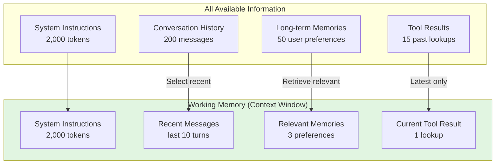
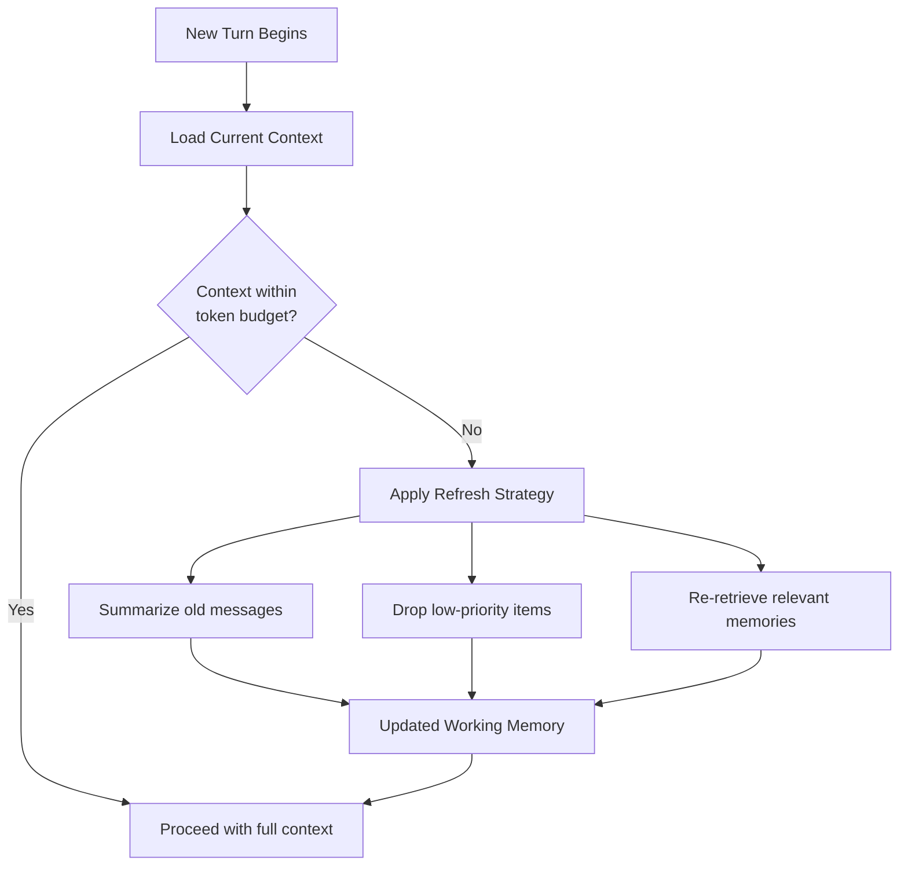

# Working memory

## Introduction

Human working memory is the mental workspace where we hold and manipulate information we're actively using — the numbers in a math problem, the steps of a recipe we're following, the context of a conversation we're in. It's limited (famously, about 7±2 items) and requires active refreshing to maintain.

For AI agents, working memory is the analogous concept: the subset of available information that's actively loaded into the LLM's context window for the current step. This is distinct from short-term memory (everything in the session) and long-term memory (everything ever stored). Working memory is about what the agent is *paying attention to right now* — and managing this attention is critical because context windows, while growing, are still finite and expensive.

### What we'll cover

- Active information management in the context window
- Attention focus and information prioritization
- Capacity limits and their practical implications
- Refresh mechanisms to keep context relevant
- Framework tools: compaction, trimming filters, and context management

### Prerequisites

- Understanding of [short-term memory](./01-short-term-memory.md) — session-scoped conversation state
- Understanding of [long-term memory](./02-long-term-memory.md) — cross-session persistence
- Familiarity with LLM context windows and token limits

---

## Active information management

Not everything in memory needs to be in the context window. A conversation might have 200 messages, but the LLM only needs the most relevant ones to respond well. Working memory is the art of selecting *what to include* in the current prompt.



### The context window budget

Every piece of information in the context window costs tokens. Managing working memory means managing a budget:

```python
from dataclasses import dataclass

@dataclass
class ContextBudget:
    """Manages token allocation across different memory types."""
    total_limit: int = 128_000     # Model's context window
    output_reserve: int = 4_000    # Reserved for the model's response
    system_prompt: int = 2_000     # System instructions
    tools_schema: int = 3_000      # Tool definitions

    @property
    def available_for_memory(self) -> int:
        """Tokens available for conversation history and memories."""
        return (
            self.total_limit
            - self.output_reserve
            - self.system_prompt
            - self.tools_schema
        )

    def allocate(self) -> dict[str, int]:
        """Suggest token allocation for different memory types."""
        available = self.available_for_memory
        return {
            "recent_messages": int(available * 0.60),   # 60% for conversation
            "long_term_memories": int(available * 0.15), # 15% for user context
            "tool_results": int(available * 0.15),       # 15% for tool data
            "buffer": int(available * 0.10),             # 10% safety margin
        }

budget = ContextBudget(total_limit=128_000)
allocation = budget.allocate()
print(f"Available for memory: {budget.available_for_memory:,} tokens")
for category, tokens in allocation.items():
    print(f"  {category}: {tokens:,} tokens")
```

**Output:**
```
Available for memory: 119,000 tokens
  recent_messages: 71,400 tokens
  long_term_memories: 17,850 tokens
  tool_results: 17,850 tokens
  buffer: 11,900 tokens
```

---

## Attention focus

Not all information is equally important. Working memory requires prioritizing what enters the context window based on relevance to the current task.

### Information prioritization

```python
from dataclasses import dataclass
from enum import IntEnum

class Priority(IntEnum):
    CRITICAL = 4    # Must include (system prompt, current user message)
    HIGH = 3        # Should include (recent messages, active goal)
    MEDIUM = 2      # Include if space (relevant memories, older messages)
    LOW = 1         # Include only with spare capacity (background context)

@dataclass
class ContextItem:
    """An item that could be included in the context window."""
    content: str
    priority: Priority
    token_count: int
    category: str

def build_context(items: list[ContextItem], max_tokens: int) -> list[ContextItem]:
    """Select items for the context window by priority, within token budget."""
    # Sort by priority (highest first)
    sorted_items = sorted(items, key=lambda x: x.priority, reverse=True)

    selected = []
    tokens_used = 0
    for item in sorted_items:
        if tokens_used + item.token_count <= max_tokens:
            selected.append(item)
            tokens_used += item.token_count

    return selected

# Example
items = [
    ContextItem("System prompt...", Priority.CRITICAL, 500, "system"),
    ContextItem("User's latest message", Priority.CRITICAL, 100, "message"),
    ContextItem("Previous 3 messages", Priority.HIGH, 800, "history"),
    ContextItem("User preference: likes Python", Priority.MEDIUM, 50, "memory"),
    ContextItem("User preference: dark mode", Priority.MEDIUM, 50, "memory"),
    ContextItem("15 older messages", Priority.LOW, 3000, "history"),
    ContextItem("5 old tool results", Priority.LOW, 2000, "tools"),
]

selected = build_context(items, max_tokens=2000)
print("Selected for context window:")
for item in selected:
    print(f"  [{item.priority.name}] {item.category}: {item.content[:50]}... ({item.token_count} tokens)")
```

**Output:**
```
Selected for context window:
  [CRITICAL] system: System prompt... (500 tokens)
  [CRITICAL] message: User's latest message (100 tokens)
  [HIGH] history: Previous 3 messages (800 tokens)
  [MEDIUM] memory: User preference: likes Python (50 tokens)
  [MEDIUM] memory: User preference: dark mode (50 tokens)
```

> **🔑 Key concept:** Working memory management is essentially a priority queue. Critical items always enter the context; low-priority items only get included when there's spare capacity.

---

## Capacity limits

Context windows have hard limits. When conversation history exceeds the window, something must be dropped. Different strategies handle this differently.

### Strategy 1: Sliding window (drop oldest)

The simplest approach — keep the most recent N messages and drop everything older:

```python
def sliding_window(messages: list[dict], max_messages: int = 20) -> list[dict]:
    """Keep only the most recent messages."""
    if len(messages) <= max_messages:
        return messages
    # Always keep the system message if present
    system_msgs = [m for m in messages if m.get("role") == "system"]
    other_msgs = [m for m in messages if m.get("role") != "system"]
    return system_msgs + other_msgs[-max_messages:]

# 50 messages → keep last 20
messages = [{"role": "user", "content": f"Message {i}"} for i in range(50)]
trimmed = sliding_window(messages, max_messages=20)
print(f"Original: {len(messages)} messages")
print(f"After trimming: {len(trimmed)} messages")
print(f"Oldest kept: {trimmed[0]['content']}")
```

**Output:**
```
Original: 50 messages
After trimming: 20 messages
Oldest kept: Message 30
```

### Strategy 2: Token-based trimming

More precise than message counting — trim based on actual token usage:

```python
def trim_by_tokens(messages: list[dict], max_tokens: int = 8000) -> list[dict]:
    """Keep messages from the end until we hit the token budget."""
    # Approximate token count (4 chars ≈ 1 token)
    def estimate_tokens(msg: dict) -> int:
        return len(msg.get("content", "")) // 4

    result = []
    tokens_used = 0

    # Walk backwards from newest to oldest
    for msg in reversed(messages):
        msg_tokens = estimate_tokens(msg)
        if tokens_used + msg_tokens > max_tokens:
            break
        result.insert(0, msg)
        tokens_used += msg_tokens

    return result
```

### OpenAI SDK: `call_model_input_filter`

The OpenAI Agents SDK provides a hook to modify the model input right before each LLM call — perfect for managing working memory:

```python
from agents import Agent, Runner, RunConfig
from agents.run import CallModelData, ModelInputData

def trim_old_messages(data: CallModelData[None]) -> ModelInputData:
    """Keep only the last 5 items to manage context window."""
    trimmed = data.model_data.input[-5:]
    return ModelInputData(
        input=trimmed,
        instructions=data.model_data.instructions,
    )

agent = Agent(name="Assistant", instructions="Answer concisely.")
result = Runner.run_sync(
    agent,
    "Explain quines",
    run_config=RunConfig(call_model_input_filter=trim_old_messages),
)
```

> **💡 Tip:** The `call_model_input_filter` runs before *every* LLM call within a run — including mid-run calls during tool use loops. This ensures working memory stays managed even during complex multi-step operations.

---

## Refresh mechanisms

Working memory needs active maintenance. As conversations progress, some information becomes stale while new information becomes critical. Refresh mechanisms keep the context window relevant.

### The refresh cycle



### Implementing a refresh mechanism

```python
from dataclasses import dataclass

@dataclass
class WorkingMemoryManager:
    """Manages the agent's working memory across turns."""
    max_tokens: int = 100_000
    current_tokens: int = 0
    messages: list[dict] = None
    summary: str = ""

    def __post_init__(self):
        if self.messages is None:
            self.messages = []

    def add_turn(self, user_msg: str, assistant_msg: str):
        """Add a conversation turn, refreshing if needed."""
        self.messages.append({"role": "user", "content": user_msg})
        self.messages.append({"role": "assistant", "content": assistant_msg})
        self._estimate_tokens()

        if self.current_tokens > self.max_tokens * 0.8:
            self._refresh()

    def _estimate_tokens(self):
        self.current_tokens = sum(
            len(m["content"]) // 4 for m in self.messages
        )

    def _refresh(self):
        """Compress older messages into a summary."""
        # Keep the last 10 messages intact
        recent = self.messages[-10:]
        older = self.messages[:-10]

        if older:
            # In production, use an LLM to summarize
            older_text = " | ".join(m["content"][:50] for m in older)
            self.summary = f"Previous conversation summary: {older_text[:500]}"

        self.messages = recent
        self._estimate_tokens()
        print(f"  ♻ Refreshed: compressed {len(older)} messages into summary")

    def get_context(self) -> list[dict]:
        """Get the current working memory for the LLM."""
        context = []
        if self.summary:
            context.append({"role": "system", "content": self.summary})
        context.extend(self.messages)
        return context

manager = WorkingMemoryManager(max_tokens=100)
for i in range(20):
    manager.add_turn(f"Question {i}", f"Answer {i}")

print(f"Messages in working memory: {len(manager.messages)}")
print(f"Summary exists: {bool(manager.summary)}")
```

**Output:**
```
  ♻ Refreshed: compressed 10 messages into summary
  ♻ Refreshed: compressed 20 messages into summary
Messages in working memory: 10
Summary exists: True
```

### OpenAI: Responses compaction

The OpenAI SDK provides built-in compaction through `OpenAIResponsesCompactionSession`:

```python
from agents import Agent, Runner, SQLiteSession
from agents.memory import OpenAIResponsesCompactionSession

underlying = SQLiteSession("conversation_123")
session = OpenAIResponsesCompactionSession(
    session_id="conversation_123",
    underlying_session=underlying,
)

agent = Agent(name="Assistant")

# Compaction runs automatically after each turn when threshold is reached
result = await Runner.run(agent, "Hello", session=session)
```

The compaction session automatically:
1. Monitors conversation length after each turn
2. When the candidate threshold is reached, compacts older messages
3. Replaces verbose history with a condensed version
4. Preserves key information while reducing token count

> **Warning:** Auto-compaction can add latency, especially in streaming mode. For low-latency requirements, disable auto-compaction and run it manually during idle time:

```python
session = OpenAIResponsesCompactionSession(
    session_id="conversation_123",
    underlying_session=underlying,
    should_trigger_compaction=lambda _: False,  # Disable auto
)

# Manually compact during idle time
await session.run_compaction({"force": True})
```

---

## Best practices

| Practice | Why it matters |
|----------|----------------|
| Reserve 10-15% of context window as buffer | Prevents hard failures when tool results are unexpectedly large |
| Prioritize recent messages over old ones | Recency correlates strongly with relevance in conversations |
| Keep system prompt and current user message as non-negotiable | These are always the highest priority items |
| Summarize rather than drop old context | Summarization preserves information at lower token cost |
| Monitor token usage per turn | Helps identify when conversations need compaction |

---

## Common pitfalls

| ❌ Mistake | ✅ Solution |
|-----------|-------------|
| Sending the entire conversation history every turn | Implement token-based trimming or compaction |
| Dropping context abruptly without summarization | Summarize old messages before removing them |
| Not accounting for tool schemas in the token budget | Include tool definitions in your token budget calculations |
| Using message count as the only trim metric | Use token estimation — one message could be 10 tokens or 10,000 |
| Ignoring working memory until context overflow errors | Proactively manage at 80% capacity, not 100% |

---

## Hands-on exercise

### Your task

Build a working memory manager that keeps conversations within a token budget using a sliding window with summarization.

### Requirements

1. Create a `WorkingMemoryManager` class with a configurable token limit
2. Implement `add_message()` that adds messages and triggers refresh when nearing capacity
3. Implement `_refresh()` that summarizes older messages (use string truncation as a mock)
4. Implement `get_context()` that returns the current working memory (summary + recent messages)
5. Simulate a 30-turn conversation and show the refresh happening

### Expected result

A log showing the manager refreshing working memory multiple times while keeping recent messages accessible.

<details>
<summary>💡 Hints (click to expand)</summary>

- Set a low token limit (e.g., 200 tokens) so refreshes happen quickly during testing
- Trigger refresh at 80% capacity for safety margin
- Keep the last 5 messages intact and summarize everything older
- Count tokens as `len(content) // 4` for approximate estimation

</details>

<details>
<summary>✅ Solution (click to expand)</summary>

```python
class WorkingMemory:
    def __init__(self, max_tokens: int = 200, keep_recent: int = 6):
        self.max_tokens = max_tokens
        self.keep_recent = keep_recent
        self.messages: list[dict] = []
        self.summary: str = ""
        self.refresh_count = 0

    def _count_tokens(self) -> int:
        total = len(self.summary) // 4
        total += sum(len(m["content"]) // 4 for m in self.messages)
        return total

    def add_message(self, role: str, content: str):
        self.messages.append({"role": role, "content": content})
        if self._count_tokens() > self.max_tokens * 0.8:
            self._refresh()

    def _refresh(self):
        self.refresh_count += 1
        recent = self.messages[-self.keep_recent:]
        older = self.messages[:-self.keep_recent]

        if older:
            key_points = [m["content"][:30] for m in older]
            self.summary = f"Summary of {len(older)} earlier messages: " + "; ".join(key_points)
            self.summary = self.summary[:200]  # Limit summary size

        self.messages = recent
        print(f"  ♻ Refresh #{self.refresh_count}: "
              f"compressed {len(older)} messages, "
              f"keeping {len(self.messages)} recent")

    def get_context(self) -> list[dict]:
        ctx = []
        if self.summary:
            ctx.append({"role": "system", "content": self.summary})
        ctx.extend(self.messages)
        return ctx

# Simulate 30-turn conversation
wm = WorkingMemory(max_tokens=200, keep_recent=6)
for i in range(30):
    wm.add_message("user", f"This is user message number {i} with some content")
    wm.add_message("assistant", f"This is the response to message {i}")

print(f"\nFinal state:")
print(f"  Messages in memory: {len(wm.messages)}")
print(f"  Total refreshes: {wm.refresh_count}")
print(f"  Tokens used: {wm._count_tokens()}")
print(f"  Summary: {wm.summary[:80]}...")
```

**Expected output:**
```
  ♻ Refresh #1: compressed 10 messages, keeping 6 recent
  ♻ Refresh #2: compressed 12 messages, keeping 6 recent
  ♻ Refresh #3: compressed 12 messages, keeping 6 recent
  ...

Final state:
  Messages in memory: 6
  Total refreshes: 8
  Tokens used: ~150
  Summary: Summary of 12 earlier messages: This is user message number...
```

</details>

### Bonus challenges

- [ ] Use an actual tokenizer (like `tiktoken`) instead of the `len // 4` approximation
- [ ] Implement a priority-based system where important messages (containing questions or decisions) are kept longer
- [ ] Add a `retrieve_from_summary()` method that searches the summary for specific facts when the full message is no longer available

---

## Summary

✅ **Working memory** is the subset of information actively loaded into the LLM's context window — not everything stored, just what's relevant now

✅ **Context budgeting** allocates tokens across system prompts, messages, memories, and tool results to stay within limits

✅ **Priority-based selection** ensures critical items (system prompt, current message) always enter the context while low-priority items fill remaining space

✅ **Refresh mechanisms** proactively summarize and trim context before hitting hard limits, preventing context overflow errors

✅ **Framework tools** like OpenAI's `call_model_input_filter` and `OpenAIResponsesCompactionSession` provide built-in working memory management

**Next:** [Memory Retrieval Strategies](./04-memory-retrieval-strategies.md)

---

## Further reading

- [OpenAI SDK: Call Model Input Filter](https://openai.github.io/openai-agents-python/running_agents/#call-model-input-filter) — Trimming context before model calls
- [OpenAI Responses Compaction](https://openai.github.io/openai-agents-python/sessions/#openai-responses-compaction-sessions) — Auto-compaction of session history
- [LangGraph: Managing Short-term Memory](https://docs.langchain.com/oss/python/langgraph/memory#manage-short-term-memory) — Filtering and summarization techniques
- [Google ADK: Context Compression](https://google.github.io/adk-docs/context/compaction/) — ADK's built-in context management

*[Back to Agent Memory Systems Overview](./00-agent-memory-systems.md)*

<!--
Sources Consulted:
- OpenAI Agents SDK Running Agents (call_model_input_filter): https://openai.github.io/openai-agents-python/running_agents/
- OpenAI Agents SDK Sessions (OpenAIResponsesCompactionSession): https://openai.github.io/openai-agents-python/sessions/
- LangGraph Memory overview (managing short-term memory, filtering): https://docs.langchain.com/oss/python/langgraph/memory
- Google ADK Context Compression: https://google.github.io/adk-docs/context/compaction/
-->
