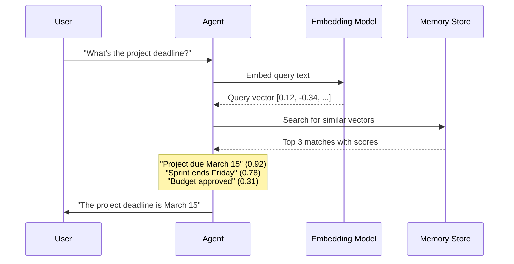

# Memory retrieval strategies

## Introduction

An agent can store thousands of memories, but what matters is retrieving the *right* memories at the *right* time. A customer support agent needs to recall that this specific user had a billing issue last week — not every billing issue ever recorded. Retrieval is what makes memory useful rather than just archived.

Memory retrieval strategies determine how agents search, filter, rank, and select stored information when building their context window. The quality of retrieval directly impacts response quality: perfect memories stored badly are worse than imperfect memories retrieved well.

### What we'll cover

- Relevance-based retrieval using semantic similarity
- Recency-based retrieval with time decay
- Importance scoring for memory prioritization
- Hybrid retrieval combining multiple signals
- Framework implementations: LangGraph Store, vector search

### Prerequisites

- Understanding of [short-term memory](./01-short-term-memory.md) and [long-term memory](./02-long-term-memory.md)
- Familiarity with [working memory](./03-working-memory.md) context budgets
- Basic understanding of embeddings (vector representations of text)

---

## Relevance-based retrieval

The most powerful retrieval approach: find memories whose *meaning* matches the current query, regardless of exact wording. This uses embeddings — numerical vector representations of text where similar meanings produce similar vectors.

### How semantic search works



### Implementing semantic search

```python
import numpy as np

def cosine_similarity(vec_a: list[float], vec_b: list[float]) -> float:
    """Calculate cosine similarity between two vectors."""
    a = np.array(vec_a)
    b = np.array(vec_b)
    return float(np.dot(a, b) / (np.linalg.norm(a) * np.linalg.norm(b)))


class SemanticMemoryStore:
    """A simple semantic memory store using cosine similarity."""

    def __init__(self):
        self.memories: list[dict] = []

    def add(self, content: str, embedding: list[float], metadata: dict = None):
        self.memories.append({
            "content": content,
            "embedding": embedding,
            "metadata": metadata or {},
        })

    def search(self, query_embedding: list[float], top_k: int = 3) -> list[dict]:
        """Find the most semantically similar memories."""
        scored = []
        for memory in self.memories:
            score = cosine_similarity(query_embedding, memory["embedding"])
            scored.append({**memory, "similarity": score})

        scored.sort(key=lambda x: x["similarity"], reverse=True)
        return scored[:top_k]

# Demo with mock embeddings (in production, use an embedding model)
store = SemanticMemoryStore()
store.add("Project deadline is March 15", [0.9, 0.1, 0.2])
store.add("Sprint ends on Friday", [0.7, 0.3, 0.2])
store.add("Budget was approved", [0.1, 0.8, 0.3])
store.add("Team meeting every Monday", [0.2, 0.2, 0.9])

# Query: "When is the project due?"
query_vec = [0.85, 0.15, 0.2]
results = store.search(query_vec, top_k=3)

print("Query: 'When is the project due?'")
print("Results:")
for r in results:
    print(f"  [{r['similarity']:.3f}] {r['content']}")
```

**Output:**
```
Query: 'When is the project due?'
Results:
  [0.998] Project deadline is March 15
  [0.961] Sprint ends on Friday
  [0.584] Team meeting every Monday
```

### LangGraph Store: semantic search

LangGraph's Store supports semantic search out of the box when configured with an embedding model:

```python
from langgraph.store.memory import InMemoryStore

store = InMemoryStore(
    index={
        "embed": my_embedding_model,  # Embedding function
        "dims": 1536,                  # Embedding dimensions
        "fields": ["content"],         # Which fields to embed
    }
)

# Store memories in namespaced locations
store.put(
    namespace=("user", "alice", "preferences"),
    key="lang_pref",
    value={"content": "Prefers Python over JavaScript"},
)
store.put(
    namespace=("user", "alice", "preferences"),
    key="style_pref",
    value={"content": "Likes detailed explanations with examples"},
)

# Search by semantic similarity
results = store.search(
    namespace=("user", "alice", "preferences"),
    query="What programming language does Alice like?",
    limit=3,
)
for item in results:
    print(f"  [{item.score:.3f}] {item.value['content']}")
```

> **🤖 AI Context:** The `fields` parameter controls which parts of the stored value get embedded. If your memories have both `content` and `metadata` keys, setting `fields=["content"]` means only the content text is used for similarity matching — metadata is stored but not searched.

---

## Recency-based retrieval

Recent memories are often more relevant than old ones. A recency strategy weights memories by how recently they were created or accessed.

### Time decay functions

```python
import math
from datetime import datetime, timedelta

def exponential_decay(
    hours_ago: float,
    half_life: float = 24.0
) -> float:
    """Score that halves every `half_life` hours."""
    return math.exp(-0.693 * hours_ago / half_life)

def linear_decay(
    hours_ago: float,
    max_hours: float = 168.0  # 1 week
) -> float:
    """Score that decreases linearly to zero over max_hours."""
    return max(0.0, 1.0 - (hours_ago / max_hours))

# Compare decay functions
print(f"{'Hours Ago':>10} {'Exponential':>12} {'Linear':>10}")
print("-" * 35)
for hours in [0, 1, 6, 24, 48, 72, 168]:
    exp = exponential_decay(hours, half_life=24)
    lin = linear_decay(hours, max_hours=168)
    print(f"{hours:>10} {exp:>12.3f} {lin:>10.3f}")
```

**Output:**
```
  Hours Ago  Exponential     Linear
-----------------------------------
         0        1.000      1.000
         1        0.972      0.994
         6        0.841      0.964
        24        0.500      0.857
        48        0.250      0.714
        72        0.125      0.571
       168        0.008      0.000
```

### Applying recency to retrieval

```python
from dataclasses import dataclass
from datetime import datetime, timedelta

@dataclass
class TimedMemory:
    content: str
    created_at: datetime
    last_accessed: datetime = None

    def __post_init__(self):
        if self.last_accessed is None:
            self.last_accessed = self.created_at

    def recency_score(self, now: datetime = None) -> float:
        """Score based on how recently this memory was accessed."""
        now = now or datetime.now()
        hours_ago = (now - self.last_accessed).total_seconds() / 3600
        return exponential_decay(hours_ago, half_life=48)


def recency_search(
    memories: list[TimedMemory],
    top_k: int = 5,
    now: datetime = None,
) -> list[tuple[TimedMemory, float]]:
    """Retrieve memories ranked by recency."""
    now = now or datetime.now()
    scored = [(m, m.recency_score(now)) for m in memories]
    scored.sort(key=lambda x: x[1], reverse=True)
    return scored[:top_k]

# Example
now = datetime.now()
memories = [
    TimedMemory("User asked about Python", now - timedelta(hours=1)),
    TimedMemory("User prefers dark mode", now - timedelta(days=7)),
    TimedMemory("Discussed project deadline", now - timedelta(hours=4)),
    TimedMemory("User had billing issue", now - timedelta(days=3)),
]

results = recency_search(memories, top_k=3, now=now)
print("Most recent memories:")
for mem, score in results:
    print(f"  [{score:.3f}] {mem.content}")
```

**Output:**
```
Most recent memories:
  [0.986] User asked about Python
  [0.944] Discussed project deadline
  [0.646] User had billing issue
```

---

## Importance scoring

Some memories matter more than others regardless of when they were created. A user's name is always important; a casual comment about the weather is not.

### Assigning importance

```python
from dataclasses import dataclass, field

@dataclass
class ScoredMemory:
    content: str
    importance: float       # 0.0 to 1.0, set at creation
    access_count: int = 0   # How often this memory is retrieved

    def boost_importance(self, amount: float = 0.1):
        """Increase importance when memory proves useful."""
        self.access_count += 1
        self.importance = min(1.0, self.importance + amount)

# Heuristics for automatic importance scoring
def auto_importance(content: str) -> float:
    """Estimate importance based on content characteristics."""
    score = 0.3  # Base score

    # Higher importance indicators
    high_signals = ["deadline", "password", "name", "preference",
                    "error", "bug", "critical", "always", "never"]
    for signal in high_signals:
        if signal in content.lower():
            score += 0.2

    # Lower importance indicators
    low_signals = ["maybe", "not sure", "weather", "anyway"]
    for signal in low_signals:
        if signal in content.lower():
            score -= 0.1

    return max(0.0, min(1.0, score))

# Test
test_contents = [
    "User's name is Alice",
    "Project deadline is March 15",
    "The weather is nice today",
    "Maybe we could try that later",
    "Critical bug in payment system",
]

for content in test_contents:
    score = auto_importance(content)
    print(f"  [{score:.1f}] {content}")
```

**Output:**
```
  [0.5] User's name is Alice
  [0.5] Project deadline is March 15
  [0.2] The weather is nice today
  [0.2] Maybe we could try that later
  [0.7] Critical bug in payment system
```

---

## Hybrid retrieval

Real-world systems combine multiple signals — relevance, recency, and importance — into a single ranking score. This hybrid approach produces the best results because no single signal is sufficient on its own.

### Combined scoring

```python
from dataclasses import dataclass
from datetime import datetime, timedelta

@dataclass
class HybridMemory:
    content: str
    embedding: list[float]
    importance: float
    created_at: datetime

def hybrid_search(
    memories: list[HybridMemory],
    query_embedding: list[float],
    now: datetime,
    top_k: int = 5,
    weights: dict = None,
) -> list[tuple[HybridMemory, float, dict]]:
    """Search memories using a weighted combination of signals."""
    weights = weights or {
        "relevance": 0.5,   # Semantic similarity
        "recency": 0.3,     # Time decay
        "importance": 0.2,  # Pre-assigned importance
    }

    results = []
    for memory in memories:
        # Relevance score (cosine similarity)
        relevance = cosine_similarity(query_embedding, memory.embedding)

        # Recency score (exponential decay)
        hours_ago = (now - memory.created_at).total_seconds() / 3600
        recency = exponential_decay(hours_ago, half_life=48)

        # Combined score
        combined = (
            weights["relevance"] * relevance
            + weights["recency"] * recency
            + weights["importance"] * memory.importance
        )
        scores = {
            "relevance": relevance,
            "recency": recency,
            "importance": memory.importance,
        }
        results.append((memory, combined, scores))

    results.sort(key=lambda x: x[1], reverse=True)
    return results[:top_k]

# Example
now = datetime.now()
memories = [
    HybridMemory("Project deadline March 15", [0.9, 0.1], 0.8,
                 now - timedelta(hours=2)),
    HybridMemory("User prefers Python", [0.3, 0.7], 0.6,
                 now - timedelta(days=5)),
    HybridMemory("Weather is nice", [0.1, 0.1], 0.1,
                 now - timedelta(minutes=30)),
    HybridMemory("Critical bug in auth", [0.7, 0.3], 0.9,
                 now - timedelta(hours=12)),
]

query = [0.85, 0.15]  # Similar to "project deadline"
results = hybrid_search(memories, query, now, top_k=3)

print("Hybrid search results:")
print(f"{'Content':<30} {'Combined':>9} {'Rel':>6} {'Rec':>6} {'Imp':>6}")
print("-" * 63)
for memory, combined, scores in results:
    print(f"{memory.content:<30} {combined:>9.3f} "
          f"{scores['relevance']:>6.3f} {scores['recency']:>6.3f} "
          f"{scores['importance']:>6.3f}")
```

**Output:**
```
Hybrid search results:
Content                        Combined    Rel    Rec    Imp
---------------------------------------------------------------
Project deadline March 15         0.726  0.998  0.972  0.800
Critical bug in auth              0.641  0.917  0.866  0.900
Weather is nice                   0.194  0.260  0.993  0.100
```

> **🔑 Key concept:** Weights should be tunable per use case. A task management agent might weight importance at 0.4 and recency at 0.4, while a conversational agent might weight relevance at 0.6 and recency at 0.3.

### Tuning weights by context

```python
# Different weight profiles for different scenarios
WEIGHT_PROFILES = {
    "conversation": {
        "relevance": 0.4,
        "recency": 0.4,
        "importance": 0.2,
    },
    "research": {
        "relevance": 0.7,
        "recency": 0.1,
        "importance": 0.2,
    },
    "support": {
        "relevance": 0.3,
        "recency": 0.3,
        "importance": 0.4,
    },
}
```

---

## LangGraph Store: filtered retrieval

Beyond semantic search, LangGraph Store supports filtering by namespace and metadata — useful for scoping retrieval to specific users, sessions, or topics:

```python
from langgraph.store.memory import InMemoryStore

store = InMemoryStore(
    index={"embed": embed_fn, "dims": 1536, "fields": ["content"]}
)

# Store memories in different namespaces
store.put(("user", "alice", "facts"), "name",
          {"content": "Alice is a backend developer"})
store.put(("user", "alice", "facts"), "lang",
          {"content": "Alice prefers Python and Go"})
store.put(("user", "bob", "facts"), "name",
          {"content": "Bob is a frontend developer"})

# Namespace filtering: only search Alice's memories
alice_results = store.search(
    namespace=("user", "alice", "facts"),
    query="What programming languages?",
    limit=5,
)

# Using retrieval in a LangGraph node
from langgraph.graph import StateGraph
from langgraph.store.base import BaseStore

def respond(state, *, store: BaseStore):
    """Graph node that retrieves relevant memories before responding."""
    user_id = state["user_id"]

    # Retrieve memories scoped to this user
    memories = store.search(
        namespace=("user", user_id, "preferences"),
        query=state["messages"][-1].content,
        limit=5,
    )

    # Format memories for the prompt
    memory_text = "\n".join(
        f"- {m.value['content']}" for m in memories
    )

    # Use memories in the prompt
    prompt = f"""User memories:\n{memory_text}\n\nRespond to the user."""
    # ... call LLM with prompt
```

> **💡 Tip:** Namespace-based filtering is extremely fast (no embedding comparison needed) and should be your first filter before semantic search. Use namespaces for hard boundaries (per-user, per-session) and semantic search for finding the best matches within those boundaries.

---

## Best practices

| Practice | Why it matters |
|----------|----------------|
| Combine relevance, recency, and importance signals | No single signal is sufficient for all retrieval scenarios |
| Use namespace filtering before semantic search | Reduces the search space and prevents cross-user data leakage |
| Limit retrieval results (top 3-5) | More results add tokens but often decrease signal-to-noise ratio |
| Tune weights per use case | A conversation agent needs different weights than a research agent |
| Re-rank results after initial retrieval | Two-stage retrieval (fast recall + precise re-ranking) scales better |

---

## Common pitfalls

| ❌ Mistake | ✅ Solution |
|-----------|-------------|
| Retrieving too many memories and overwhelming the context | Set strict `top_k` limits and filter by relevance threshold |
| Using only keyword matching instead of semantic search | Embeddings catch synonyms and paraphrases that keywords miss |
| Ignoring recency for time-sensitive information | Apply time decay so stale memories rank lower automatically |
| Hard-coding retrieval weights | Make weights configurable and test different profiles |
| Not filtering by user/namespace before searching | Always scope searches to the relevant user to prevent data mixing |

---

## Hands-on exercise

### Your task

Build a hybrid memory retrieval system that combines semantic similarity, recency, and importance scoring with configurable weights.

### Requirements

1. Create a `MemoryItem` dataclass with content, embedding, importance, and timestamp
2. Implement `cosine_similarity()` for relevance scoring
3. Implement `time_decay()` for recency scoring
4. Create a `HybridRetriever` class with configurable weights
5. Add 10+ sample memories and test with 3 different queries
6. Compare results using different weight profiles ("conversation" vs "research")

### Expected result

Output showing how the same query produces different rankings when weight profiles change.

<details>
<summary>💡 Hints (click to expand)</summary>

- Use mock embeddings (3-5 dimensional vectors) for testing
- Create memories spanning different time periods (minutes to weeks)
- Set importance based on content (deadlines = high, chitchat = low)
- Normalize all scores to 0-1 range before combining

</details>

<details>
<summary>✅ Solution (click to expand)</summary>

```python
import math
import numpy as np
from dataclasses import dataclass
from datetime import datetime, timedelta

@dataclass
class MemoryItem:
    content: str
    embedding: list[float]
    importance: float
    created_at: datetime

def cosine_sim(a: list[float], b: list[float]) -> float:
    a, b = np.array(a), np.array(b)
    return float(np.dot(a, b) / (np.linalg.norm(a) * np.linalg.norm(b)))

def time_decay(hours_ago: float, half_life: float = 48.0) -> float:
    return math.exp(-0.693 * hours_ago / half_life)

class HybridRetriever:
    def __init__(self, memories: list[MemoryItem], weights: dict):
        self.memories = memories
        self.weights = weights

    def search(self, query_embedding: list[float], top_k: int = 5) -> list:
        now = datetime.now()
        results = []
        for mem in self.memories:
            rel = cosine_sim(query_embedding, mem.embedding)
            hours = (now - mem.created_at).total_seconds() / 3600
            rec = time_decay(hours)
            combined = (
                self.weights["relevance"] * rel
                + self.weights["recency"] * rec
                + self.weights["importance"] * mem.importance
            )
            results.append((mem, combined, rel, rec))
        results.sort(key=lambda x: x[1], reverse=True)
        return results[:top_k]

# Create sample memories
now = datetime.now()
memories = [
    MemoryItem("Project deadline March 15", [0.9, 0.1, 0.1], 0.9,
               now - timedelta(hours=2)),
    MemoryItem("User prefers Python", [0.2, 0.8, 0.1], 0.6,
               now - timedelta(days=5)),
    MemoryItem("Discussed API design patterns", [0.7, 0.5, 0.3], 0.5,
               now - timedelta(hours=6)),
    MemoryItem("Weather is sunny today", [0.1, 0.1, 0.9], 0.1,
               now - timedelta(minutes=10)),
    MemoryItem("Critical security vulnerability found", [0.8, 0.2, 0.1], 0.95,
               now - timedelta(days=1)),
]

query = [0.85, 0.15, 0.1]  # Project-related query

# Compare profiles
for profile_name, weights in {
    "conversation": {"relevance": 0.4, "recency": 0.4, "importance": 0.2},
    "research": {"relevance": 0.7, "recency": 0.1, "importance": 0.2},
}.items():
    retriever = HybridRetriever(memories, weights)
    results = retriever.search(query, top_k=3)
    print(f"\n{profile_name.upper()} profile {weights}:")
    for mem, score, rel, rec in results:
        print(f"  [{score:.3f}] {mem.content}")
```

**Expected output:**
```
CONVERSATION profile {'relevance': 0.4, 'recency': 0.4, 'importance': 0.2}:
  [0.768] Project deadline March 15
  [0.612] Critical security vulnerability found
  [0.502] Discussed API design patterns

RESEARCH profile {'relevance': 0.7, 'recency': 0.1, 'importance': 0.2}:
  [0.878] Project deadline March 15
  [0.759] Critical security vulnerability found
  [0.561] Discussed API design patterns
```

</details>

### Bonus challenges

- [ ] Add a relevance threshold — only return results with a combined score above 0.3
- [ ] Implement a `boost_on_access()` method that increases importance each time a memory is retrieved
- [ ] Add namespace filtering so you can search within specific categories (e.g., "project" vs "personal")

---

## Summary

✅ **Semantic search** uses embedding vectors to find memories by meaning, not keywords — catching synonyms and paraphrases

✅ **Recency weighting** with time decay functions ensures recent memories rank higher, which is critical for conversational agents

✅ **Importance scoring** can be assigned manually or estimated from content signals like "deadline" or "critical"

✅ **Hybrid retrieval** combines relevance, recency, and importance with tunable weights — the most effective real-world approach

✅ **Namespace filtering** in LangGraph Store provides fast scope-based filtering before semantic search, preventing cross-user data leakage

**Next:** [Memory Summarization](./05-memory-summarization.md)

---

## Further reading

- [LangGraph Store: Semantic Search](https://langchain-ai.github.io/langgraph/concepts/persistence/#memory-store) — Built-in semantic search with embeddings
- [OpenAI Embeddings Guide](https://platform.openai.com/docs/guides/embeddings) — Creating and using embedding vectors
- [Retrieval-Augmented Generation](../../09-rag-retrieval-augmented-generation/_complete-unit.md) — RAG techniques applicable to memory retrieval
- [Pinecone: Similarity Search](https://docs.pinecone.io/guides/get-started/overview) — Production-grade vector search

*[Back to Agent Memory Systems Overview](./00-agent-memory-systems.md)*

<!--
Sources Consulted:
- LangGraph Memory Store (semantic search, namespaces, fields): https://langchain-ai.github.io/langgraph/concepts/persistence/
- OpenAI Embeddings documentation: https://platform.openai.com/docs/guides/embeddings
- LangGraph Memory overview (retrieval patterns): https://docs.langchain.com/oss/python/langgraph/memory
-->
