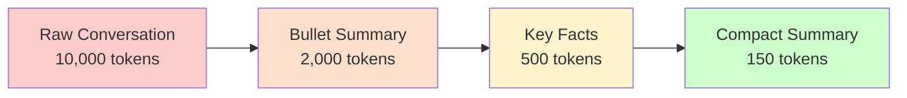
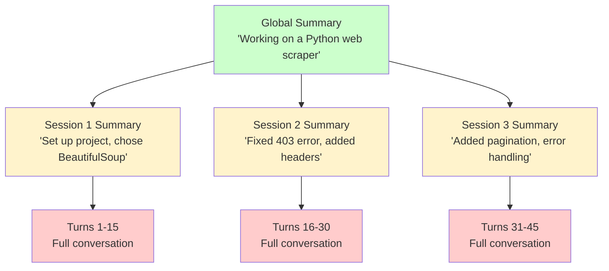

# Memory summarization

## Introduction

Conversations grow. After 50 turns, a conversation might consume 30,000 tokens — and much of that is redundant, repetitive, or no longer relevant. Memory summarization is the process of compressing verbose memory into concise representations that preserve essential information while dramatically reducing token cost.

Think of it like note-taking. When you attend a two-hour meeting, you don't transcribe every word — you write down the key decisions, action items, and important context. Memory summarization does the same for agents.

### What we'll cover

- Progressive summarization techniques for growing conversations
- Key point extraction from verbose history
- Hierarchical summaries for multi-level compression
- Trade-offs between compression and information loss
- Framework approaches: profile merging vs collection management

### Prerequisites

- Understanding of [working memory](./03-working-memory.md) and context budgets
- Familiarity with [memory retrieval](./04-memory-retrieval-strategies.md) strategies
- Basic understanding of LLM prompting for summarization tasks

---

## Progressive summarization

Instead of summarizing everything at once, progressive summarization compresses in stages: raw conversation → bullet points → key facts → compact summary. Each stage is smaller but retains the most important information.

### The compression pipeline



### Implementing progressive summarization

```python
class ProgressiveSummarizer:
    """Summarizes conversation history in progressive stages."""

    def __init__(self, llm_call=None):
        # In production, llm_call would be an actual LLM function
        self.llm_call = llm_call or self._mock_summarize

    def _mock_summarize(self, prompt: str, text: str) -> str:
        """Mock LLM summarization for demonstration."""
        # Extract first sentence of each message as a simple approximation
        lines = text.strip().split("\n")
        key_lines = [l.strip()[:80] for l in lines if l.strip() and ":" in l]
        return "\n".join(f"- {l}" for l in key_lines[:5])

    def stage_1_bullets(self, messages: list[dict]) -> str:
        """Stage 1: Convert conversation to bullet points."""
        conversation = "\n".join(
            f"{m['role']}: {m['content']}" for m in messages
        )
        prompt = (
            "Summarize this conversation as concise bullet points. "
            "Focus on: decisions made, questions asked, information shared."
        )
        return self.llm_call(prompt, conversation)

    def stage_2_key_facts(self, bullet_summary: str) -> str:
        """Stage 2: Extract key facts from bullets."""
        prompt = (
            "Extract only the essential facts from these notes. "
            "Remove redundancy. Keep names, dates, decisions, and preferences."
        )
        return self.llm_call(prompt, bullet_summary)

    def stage_3_compact(self, key_facts: str) -> str:
        """Stage 3: Create a compact summary."""
        prompt = (
            "Compress these facts into a single brief paragraph. "
            "Maximum 3 sentences."
        )
        return self.llm_call(prompt, key_facts)

    def summarize(self, messages: list[dict], target_stage: int = 2) -> str:
        """Run summarization up to the target stage."""
        result = self.stage_1_bullets(messages)
        if target_stage >= 2:
            result = self.stage_2_key_facts(result)
        if target_stage >= 3:
            result = self.stage_3_compact(result)
        return result

# Demo
messages = [
    {"role": "user", "content": "Hi, I need help with my Python project"},
    {"role": "assistant", "content": "Sure! What kind of project?"},
    {"role": "user", "content": "A web scraper using BeautifulSoup"},
    {"role": "assistant", "content": "I can help with that. What site?"},
    {"role": "user", "content": "I want to scrape news headlines from CNN"},
    {"role": "assistant", "content": "Here's a basic approach using requests..."},
    {"role": "user", "content": "Great, but I'm getting a 403 error"},
    {"role": "assistant", "content": "You need to add User-Agent headers..."},
]

summarizer = ProgressiveSummarizer()
summary = summarizer.stage_1_bullets(messages)
print("Stage 1 - Bullet Summary:")
print(summary)
print(f"\nOriginal: {sum(len(m['content']) for m in messages)} chars")
print(f"Summary: {len(summary)} chars")
```

**Output:**
```
Stage 1 - Bullet Summary:
- user: Hi, I need help with my Python project
- assistant: Sure! What kind of project?
- user: A web scraper using BeautifulSoup
- user: I want to scrape news headlines from CNN
- user: Great, but I'm getting a 403 error

Original: 342 chars
Summary: 213 chars
```

---

## Key point extraction

Rather than summarizing the entire conversation, key point extraction identifies and preserves only the information that might be needed later.

### What to extract

```python
from dataclasses import dataclass, field
from enum import Enum

class FactType(Enum):
    DECISION = "decision"          # Choices made
    PREFERENCE = "preference"      # User likes/dislikes
    FACT = "fact"                   # Stated information
    ACTION_ITEM = "action_item"    # Things to do
    PROBLEM = "problem"            # Issues encountered
    SOLUTION = "solution"          # Fixes applied

@dataclass
class ExtractedFact:
    content: str
    fact_type: FactType
    confidence: float = 1.0
    source_turn: int = 0

@dataclass
class KeyPointExtractor:
    """Extracts structured facts from conversation history."""
    facts: list[ExtractedFact] = field(default_factory=list)

    def extract_from_messages(self, messages: list[dict]) -> list[ExtractedFact]:
        """Extract key points from messages using pattern matching."""
        new_facts = []
        for i, msg in enumerate(messages):
            content = msg["content"].lower()

            # Detect preferences
            if any(w in content for w in ["prefer", "like", "want", "love"]):
                new_facts.append(ExtractedFact(
                    content=msg["content"],
                    fact_type=FactType.PREFERENCE,
                    source_turn=i,
                ))

            # Detect problems
            if any(w in content for w in ["error", "bug", "issue", "broken", "failing"]):
                new_facts.append(ExtractedFact(
                    content=msg["content"],
                    fact_type=FactType.PROBLEM,
                    source_turn=i,
                ))

            # Detect decisions
            if any(w in content for w in ["decided", "let's go with", "we'll use"]):
                new_facts.append(ExtractedFact(
                    content=msg["content"],
                    fact_type=FactType.DECISION,
                    source_turn=i,
                ))

        self.facts.extend(new_facts)
        return new_facts

    def get_summary(self) -> str:
        """Get a structured summary of all extracted facts."""
        by_type: dict[FactType, list[ExtractedFact]] = {}
        for fact in self.facts:
            by_type.setdefault(fact.fact_type, []).append(fact)

        lines = []
        for fact_type, facts in by_type.items():
            lines.append(f"\n{fact_type.value.upper()}:")
            for f in facts:
                lines.append(f"  - {f.content[:80]}")
        return "\n".join(lines)

# Example
extractor = KeyPointExtractor()
messages = [
    {"role": "user", "content": "I prefer using async/await over callbacks"},
    {"role": "user", "content": "I'm getting a 403 error on the scraper"},
    {"role": "assistant", "content": "Let's go with adding User-Agent headers"},
    {"role": "user", "content": "I like the BeautifulSoup approach"},
]

facts = extractor.extract_from_messages(messages)
print(f"Extracted {len(facts)} key points:")
print(extractor.get_summary())
```

**Output:**
```
Extracted 4 key points:

PREFERENCE:
  - I prefer using async/await over callbacks
  - I like the BeautifulSoup approach

PROBLEM:
  - I'm getting a 403 error on the scraper

DECISION:
  - Let's go with adding User-Agent headers
```

> **🤖 AI Context:** In production, key point extraction uses an LLM rather than keyword matching. The LLM is prompted with the conversation and asked to extract structured facts in a specific schema. This catches nuanced information that patterns miss.

---

## Hierarchical summaries

When a conversation spans hundreds of messages over days, a single flat summary becomes too lossy. Hierarchical summaries maintain detail at multiple levels of granularity.

### The hierarchy



### Implementing hierarchical summaries

```python
from dataclasses import dataclass, field

@dataclass
class SummaryNode:
    """A node in the summary hierarchy."""
    level: str               # "global", "session", "segment"
    summary: str
    children: list = field(default_factory=list)
    message_range: tuple = (0, 0)

@dataclass
class HierarchicalSummarizer:
    """Maintains summaries at multiple levels of detail."""
    segment_size: int = 10        # Messages per segment
    global_summary: str = ""
    session_summaries: list[str] = field(default_factory=list)
    segment_summaries: list[str] = field(default_factory=list)
    current_segment: list[dict] = field(default_factory=list)

    def add_message(self, message: dict):
        """Add a message, auto-summarizing when segments fill up."""
        self.current_segment.append(message)

        if len(self.current_segment) >= self.segment_size:
            self._summarize_segment()

    def _summarize_segment(self):
        """Summarize the current segment and fold into hierarchy."""
        # Create segment summary (mock)
        contents = [m["content"][:40] for m in self.current_segment]
        segment_summary = f"Discussed: {'; '.join(contents[:3])}"
        self.segment_summaries.append(segment_summary)

        # Update session summary every 3 segments
        if len(self.segment_summaries) % 3 == 0:
            self._update_session_summary()

        self.current_segment = []

    def _update_session_summary(self):
        """Roll up recent segments into a session summary."""
        recent = self.segment_summaries[-3:]
        session_summary = " | ".join(recent)[:200]
        self.session_summaries.append(session_summary)

        # Update global summary
        self.global_summary = (
            f"Overall: {len(self.session_summaries)} sessions, "
            f"{len(self.segment_summaries)} segments processed"
        )

    def get_context(self, detail_level: str = "session") -> str:
        """Get context at the requested detail level."""
        if detail_level == "global":
            return self.global_summary
        elif detail_level == "session":
            return "\n".join(self.session_summaries[-3:])
        else:  # "full"
            return "\n".join(self.segment_summaries[-5:])

# Simulate a long conversation
summarizer = HierarchicalSummarizer(segment_size=5)
for i in range(35):
    summarizer.add_message({
        "role": "user" if i % 2 == 0 else "assistant",
        "content": f"Message {i}: discussing topic {i // 5}"
    })

print("Global:", summarizer.global_summary)
print(f"\nSession summaries: {len(summarizer.session_summaries)}")
print(f"Segment summaries: {len(summarizer.segment_summaries)}")
print(f"Unprocessed messages: {len(summarizer.current_segment)}")
```

**Output:**
```
Global: Overall: 2 sessions, 6 segments processed
Session summaries: 2
Segment summaries: 7
Unprocessed messages: 0
```

---

## Profile vs collection approaches

LangGraph distinguishes two memory management approaches that directly affect how summarization works:

### Profile memory (single document)

A profile is a single, continuously updated document. Each new piece of information merges into the existing profile rather than being stored separately.

```python
# Profile approach: merge new info into one document
class ProfileMemory:
    """Maintains a single, continuously updated user profile."""

    def __init__(self):
        self.profile: dict = {}

    def update(self, key: str, value: str, confidence: float = 1.0):
        """Merge new information into the profile."""
        existing = self.profile.get(key)
        if existing:
            # Keep the higher confidence value or the newer one
            if confidence >= existing.get("confidence", 0):
                self.profile[key] = {
                    "value": value,
                    "confidence": confidence,
                    "updated_count": existing.get("updated_count", 0) + 1,
                }
        else:
            self.profile[key] = {
                "value": value,
                "confidence": confidence,
                "updated_count": 1,
            }

    def get_summary(self) -> str:
        """Get the current profile as a summary string."""
        lines = []
        for key, data in self.profile.items():
            lines.append(f"- {key}: {data['value']} "
                         f"(confidence: {data['confidence']:.0%})")
        return "\n".join(lines)

profile = ProfileMemory()
profile.update("name", "Alice", 1.0)
profile.update("language", "Python", 0.8)
profile.update("language", "Python and Go", 0.9)  # Updated!
profile.update("role", "Backend developer", 0.7)

print("User Profile:")
print(profile.get_summary())
```

**Output:**
```
User Profile:
- name: Alice (confidence: 100%)
- language: Python and Go (confidence: 90%)
- role: Backend developer (confidence: 70%)
```

### Collection memory (multiple documents)

A collection stores individual memory items. Summarization selects or compresses items rather than merging them.

```python
from dataclasses import dataclass
from datetime import datetime

@dataclass
class CollectionItem:
    content: str
    timestamp: datetime
    category: str

class CollectionMemory:
    """Stores individual memory items in categorized collections."""

    def __init__(self, max_per_category: int = 10):
        self.items: list[CollectionItem] = []
        self.max_per_category = max_per_category

    def add(self, content: str, category: str):
        self.items.append(CollectionItem(
            content=content,
            timestamp=datetime.now(),
            category=category,
        ))
        self._prune(category)

    def _prune(self, category: str):
        """Keep only the most recent items per category."""
        cat_items = [i for i in self.items if i.category == category]
        if len(cat_items) > self.max_per_category:
            # Remove oldest in this category
            oldest = sorted(cat_items, key=lambda x: x.timestamp)[0]
            self.items.remove(oldest)

    def get_by_category(self, category: str) -> list[str]:
        cat_items = [i for i in self.items if i.category == category]
        return [i.content for i in sorted(cat_items, key=lambda x: x.timestamp)]

# Example
collection = CollectionMemory(max_per_category=3)
collection.add("Prefers dark mode", "preferences")
collection.add("Uses VS Code", "preferences")
collection.add("Asked about async Python", "topics")
collection.add("Had issue with CORS", "problems")
collection.add("Likes detailed explanations", "preferences")

print("Preferences:", collection.get_by_category("preferences"))
print("Topics:", collection.get_by_category("topics"))
print("Problems:", collection.get_by_category("problems"))
```

**Output:**
```
Preferences: ['Prefers dark mode', 'Uses VS Code', 'Likes detailed explanations']
Topics: ['Asked about async Python']
Problems: ['Had issue with CORS']
```

### When to use each

| Approach | Best for | Summarization strategy |
|----------|----------|----------------------|
| **Profile** | User preferences, settings, facts about a person | Merge and overwrite — latest wins |
| **Collection** | Interaction history, topic discussions, experiences | Prune and compress — keep most relevant |
| **Hybrid** | Most real applications | Profile for stable facts, collection for events |

> **🔑 Key concept:** The choice between profile and collection determines your summarization strategy. Profiles *merge* (new info replaces old), while collections *prune* (old items are compressed or removed).

---

## Compression trade-offs

Every summarization step loses information. Understanding these trade-offs helps you choose the right level of compression.

```python
# Demonstrating information loss at each compression stage
stages = [
    {
        "name": "Full Conversation",
        "tokens": 10000,
        "info_retained": 1.0,
        "example": "User: I tried fetch() but got a CORS error on localhost:3000 "
                   "when calling api.example.com/v2/users..."
    },
    {
        "name": "Bullet Summary",
        "tokens": 2000,
        "info_retained": 0.8,
        "example": "- User encountered CORS error with fetch() to external API"
    },
    {
        "name": "Key Facts",
        "tokens": 500,
        "info_retained": 0.5,
        "example": "CORS error, fetch API, external API call"
    },
    {
        "name": "Compact Summary",
        "tokens": 100,
        "info_retained": 0.3,
        "example": "Working on API integration issues"
    },
]

print(f"{'Stage':<22} {'Tokens':>8} {'Info %':>8} {'Compression':>12}")
print("-" * 55)
for s in stages:
    compression = f"{s['tokens']/10000:.0%}"
    print(f"{s['name']:<22} {s['tokens']:>8,} {s['info_retained']:>7.0%} "
          f"{compression:>12}")
```

**Output:**
```
Stage                    Tokens   Info %  Compression
-------------------------------------------------------
Full Conversation        10,000    100%          100%
Bullet Summary            2,000     80%           20%
Key Facts                   500     50%            5%
Compact Summary             100     30%            1%
```

> **Warning:** At the "Compact Summary" stage, specific details like port numbers, API endpoints, and error codes are lost. If the user refers back to these specifics, the agent won't have them. Always keep recent messages in full detail and only summarize older portions.

---

## Best practices

| Practice | Why it matters |
|----------|----------------|
| Summarize in stages, not all at once | Progressive compression lets you choose the right detail level |
| Keep the last 5-10 messages in full detail | Recent context is almost always referenced |
| Extract structured facts before compressing | Structured data (names, dates, decisions) survives compression better |
| Use profiles for stable facts, collections for events | Different data types need different summarization strategies |
| Preserve uncertainty markers | "User might prefer X" is different from "User prefers X" |

---

## Common pitfalls

| ❌ Mistake | ✅ Solution |
|-----------|-------------|
| Summarizing too aggressively too early | Wait until context reaches 80% capacity before compressing |
| Losing specific details (names, numbers, codes) | Extract key facts into structured storage before summarizing prose |
| Treating all information as equally compressible | Protect high-importance facts from summarization |
| Not testing what the agent "remembers" after summarization | Periodically verify recall of key facts from summarized context |
| Running summarization synchronously on every turn | Batch summarization during idle periods or at session boundaries |

---

## Hands-on exercise

### Your task

Build a memory system that uses progressive summarization with key point extraction to manage a growing conversation.

### Requirements

1. Create a `SmartSummarizer` that maintains full messages and a running summary
2. When messages exceed a threshold (e.g., 15), summarize older messages into key points
3. Extract facts by type (decisions, preferences, problems) before compressing
4. Build `get_context()` that returns: summary + extracted facts + recent messages
5. Simulate a 40-message conversation and show the summarization happening

### Expected result

Output showing the summarizer compressing old messages while preserving key facts and keeping recent messages in full.

<details>
<summary>💡 Hints (click to expand)</summary>

- Use `KeyPointExtractor` from earlier in this lesson
- Set a low threshold (e.g., 10 messages) for testing
- Keep the last 5 messages in full
- Show token savings at each summarization step

</details>

<details>
<summary>✅ Solution (click to expand)</summary>

```python
from dataclasses import dataclass, field

@dataclass
class SmartSummarizer:
    max_full_messages: int = 10
    keep_recent: int = 5
    messages: list[dict] = field(default_factory=list)
    summaries: list[str] = field(default_factory=list)
    key_facts: list[str] = field(default_factory=list)
    compression_count: int = 0

    def add_message(self, role: str, content: str):
        self.messages.append({"role": role, "content": content})
        if len(self.messages) > self.max_full_messages:
            self._compress()

    def _compress(self):
        self.compression_count += 1
        older = self.messages[:-self.keep_recent]
        recent = self.messages[-self.keep_recent:]

        # Extract key points from older messages
        for msg in older:
            content = msg["content"].lower()
            if any(w in content for w in ["prefer", "decided", "error",
                                           "want", "need", "important"]):
                self.key_facts.append(msg["content"][:100])

        # Create summary of older messages
        summary = f"[Batch {self.compression_count}] Compressed {len(older)} messages"
        self.summaries.append(summary)

        self.messages = recent
        print(f"  📦 Compression #{self.compression_count}: "
              f"{len(older)} msgs → summary + {len(self.key_facts)} facts")

    def get_context(self) -> dict:
        return {
            "summary": " | ".join(self.summaries[-3:]),
            "key_facts": self.key_facts[-10:],
            "recent_messages": self.messages,
        }

# Simulate conversation
summarizer = SmartSummarizer(max_full_messages=10, keep_recent=5)
topics = [
    "I need help with Python", "I prefer async/await",
    "Let's use FastAPI", "Getting a CORS error",
    "Want to add authentication", "Decided on JWT tokens",
    "Database should be PostgreSQL", "Need error handling",
    "Important: deadline is Friday", "Let's add rate limiting",
]

for i in range(30):
    topic = topics[i % len(topics)]
    role = "user" if i % 2 == 0 else "assistant"
    summarizer.add_message(role, f"{topic} (turn {i})")

ctx = summarizer.get_context()
print(f"\n--- Final Context ---")
print(f"Summaries: {len(summarizer.summaries)}")
print(f"Key facts: {len(ctx['key_facts'])}")
print(f"Recent messages: {len(ctx['recent_messages'])}")
print(f"\nKey facts preserved:")
for fact in ctx["key_facts"][:5]:
    print(f"  ✅ {fact}")
```

**Expected output:**
```
  📦 Compression #1: 5 msgs → summary + 2 facts
  📦 Compression #2: 5 msgs → summary + 5 facts
  📦 Compression #3: 5 msgs → summary + 7 facts
  📦 Compression #4: 5 msgs → summary + 10 facts

--- Final Context ---
Summaries: 4
Key facts: 10
Recent messages: 5

Key facts preserved:
  ✅ I prefer async/await (turn 1)
  ✅ Decided on JWT tokens (turn 5)
  ✅ Important: deadline is Friday (turn 8)
  ✅ I need help with Python (turn 10)
  ✅ I prefer async/await (turn 11)
```

</details>

### Bonus challenges

- [ ] Deduplicate key facts that appear multiple times across compression batches
- [ ] Add a `recall(query)` method that searches both summaries and key facts
- [ ] Implement a "pinned facts" feature where certain facts are never compressed away

---

## Summary

✅ **Progressive summarization** compresses in stages (bullets → facts → compact), letting you choose the right detail level for available token budget

✅ **Key point extraction** identifies decisions, preferences, and problems before they're compressed away into lossy summaries

✅ **Hierarchical summaries** maintain detail at multiple levels — global overview, session summaries, and recent full messages

✅ **Profile vs collection** determines summarization strategy: profiles merge and overwrite, collections prune and compress

✅ **Compression trade-offs** are real — every stage loses information, so keep recent messages in full detail and only summarize older context

**Next:** [Episodic vs Semantic Memory](./06-episodic-vs-semantic-memory.md)

---

## Further reading

- [LangGraph Memory: Profile vs Collection](https://langchain-ai.github.io/langgraph/concepts/memory/) — Two approaches to long-term memory management
- [OpenAI Responses Compaction](https://openai.github.io/openai-agents-python/sessions/#openai-responses-compaction-sessions) — Automatic conversation compaction
- [Anthropic: Building Effective Agents](https://docs.anthropic.com/en/docs/build-with-claude/agents) — Memory patterns in the augmented LLM architecture
- [Progressive Summarization (Tiago Forte)](https://fortelabs.com/blog/progressive-summarization-a-practical-technique-for-designing-discoverable-notes/) — The note-taking technique that inspired this approach

*[Back to Agent Memory Systems Overview](./00-agent-memory-systems.md)*

<!--
Sources Consulted:
- LangGraph Memory overview (profile vs collection, memory management): https://docs.langchain.com/oss/python/langgraph/memory
- LangGraph Persistence (Store, namespaces): https://langchain-ai.github.io/langgraph/concepts/persistence/
- OpenAI Agents SDK Sessions (compaction sessions): https://openai.github.io/openai-agents-python/sessions/
- Anthropic Building Effective Agents: https://docs.anthropic.com/en/docs/build-with-claude/agents
-->
