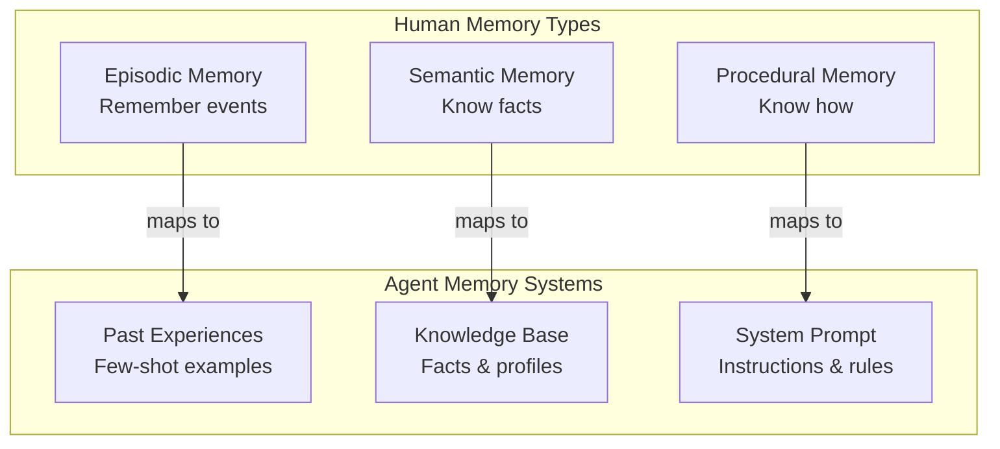
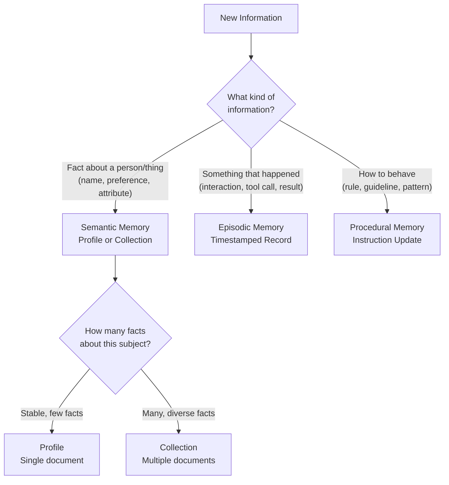

# Episodic vs semantic memory

## Introduction

When you remember *what* happened at last Tuesday's meeting (the arguments, the decisions, who said what), that's episodic memory — memory tied to a specific event. When you know *that* Paris is the capital of France — a fact without a specific "when I learned it" context — that's semantic memory. A third type, procedural memory, is how you know *how to* ride a bicycle without consciously thinking through each step.

AI agents benefit from all three types. The CoALA (Cognitive Architectures for Language Agents) framework maps these human memory types to agent systems, creating a powerful taxonomy for designing memory architectures. Understanding which type to use — and when — is key to building agents that learn effectively.

### What we'll cover

- Episodic memory: experience-based learning and few-shot examples
- Semantic memory: fact-based knowledge profiles and collections
- Procedural memory: self-refining instructions and prompt evolution
- The CoALA framework mapping human memory to agent systems
- Integration patterns combining all three memory types

### Prerequisites

- Understanding of all previous memory lessons in this unit
- Familiarity with [retrieval strategies](./04-memory-retrieval-strategies.md) and [summarization](./05-memory-summarization.md)
- Basic understanding of few-shot prompting and system instructions

---

## Episodic memory: learning from experience

Episodic memory stores *specific experiences* — what happened, when, and what the outcome was. For agents, these are records of past interactions that can serve as examples for future behavior.

### Structure of an episode

```python
from dataclasses import dataclass, field
from datetime import datetime

@dataclass
class Episode:
    """A recorded experience from a past interaction."""
    situation: str           # What was the context
    action: str              # What the agent did
    outcome: str             # What happened as a result
    success: bool            # Was it a good outcome
    timestamp: datetime = field(default_factory=datetime.now)
    tags: list[str] = field(default_factory=list)

    def as_few_shot(self) -> str:
        """Format as a few-shot example for prompting."""
        label = "✅ Good" if self.success else "❌ Bad"
        return (
            f"Situation: {self.situation}\n"
            f"Action taken: {self.action}\n"
            f"Result: {self.outcome} ({label})"
        )

# Examples
episodes = [
    Episode(
        situation="User asked to summarize a 50-page PDF",
        action="Processed all pages at once and generated summary",
        outcome="Hit context limit, output was truncated",
        success=False,
        tags=["summarization", "context-limit"],
    ),
    Episode(
        situation="User asked to summarize a 50-page PDF",
        action="Split into 10-page chunks, summarized each, then combined",
        outcome="Complete, accurate summary delivered",
        success=True,
        tags=["summarization", "chunking"],
    ),
]

print("Past experiences for 'summarization':")
for ep in episodes:
    print(f"\n{ep.as_few_shot()}")
```

**Output:**
```
Past experiences for 'summarization':

Situation: User asked to summarize a 50-page PDF
Action taken: Processed all pages at once and generated summary
Result: Hit context limit, output was truncated (❌ Bad)

Situation: User asked to summarize a 50-page PDF
Action taken: Split into 10-page chunks, summarized each, then combined
Result: Complete, accurate summary delivered (✅ Good)
```

### Using episodes as few-shot examples

The most powerful application of episodic memory is injecting past experiences as few-shot examples into the agent's prompt:

```python
class EpisodicMemory:
    """Stores and retrieves past experiences for few-shot learning."""

    def __init__(self):
        self.episodes: list[Episode] = []

    def record(self, episode: Episode):
        self.episodes.append(episode)

    def find_relevant(
        self,
        situation: str,
        tags: list[str] = None,
        top_k: int = 3,
        prefer_successful: bool = True,
    ) -> list[Episode]:
        """Find episodes relevant to the current situation."""
        candidates = self.episodes

        # Filter by tags if provided
        if tags:
            candidates = [
                ep for ep in candidates
                if any(t in ep.tags for t in tags)
            ]

        # Sort: successful first (if preferred), then most recent
        candidates.sort(
            key=lambda ep: (
                ep.success if prefer_successful else True,
                ep.timestamp,
            ),
            reverse=True,
        )
        return candidates[:top_k]

    def build_prompt_section(
        self,
        situation: str,
        tags: list[str] = None,
    ) -> str:
        """Build a prompt section with relevant past experiences."""
        relevant = self.find_relevant(situation, tags)
        if not relevant:
            return ""

        lines = ["## Relevant Past Experiences\n"]
        for ep in relevant:
            lines.append(ep.as_few_shot())
            lines.append("")
        lines.append("Use these experiences to guide your approach.\n")
        return "\n".join(lines)

# Usage
memory = EpisodicMemory()
memory.record(Episode(
    situation="User wanted data from an API with pagination",
    action="Used a while loop to fetch all pages, combined results",
    outcome="Successfully retrieved all 500 records",
    success=True,
    tags=["api", "pagination"],
))
memory.record(Episode(
    situation="User wanted data from a rate-limited API",
    action="Added exponential backoff on 429 errors",
    outcome="All requests completed without being blocked",
    success=True,
    tags=["api", "rate-limiting"],
))

prompt_section = memory.build_prompt_section(
    "User wants to fetch data from an API",
    tags=["api"],
)
print(prompt_section)
```

**Output:**
```
## Relevant Past Experiences

Situation: User wanted data from a rate-limited API
Action taken: Added exponential backoff on 429 errors
Result: All requests completed without being blocked (✅ Good)

Situation: User wanted data from an API with pagination
Action taken: Used a while loop to fetch all pages, combined results
Result: Successfully retrieved all 500 records (✅ Good)

Use these experiences to guide your approach.
```

> **🤖 AI Context:** LangGraph's documentation calls these "few-shot examples" in the episodic memory category. The agent's past tool calls, reasoning steps, and their outcomes become training data for future similar tasks — without any actual fine-tuning.

---

## Semantic memory: facts and knowledge

Semantic memory stores *facts* — decontextualized knowledge without a specific "when I learned it" anchor. For agents, this means user profiles, domain knowledge, and accumulated facts.

### Profile-based semantic memory

A profile maintains a single, evolving document of facts about a subject:

```python
from dataclasses import dataclass, field

@dataclass
class SemanticProfile:
    """A continuously updated profile of facts about a subject."""
    subject: str
    facts: dict[str, str] = field(default_factory=dict)
    confidence: dict[str, float] = field(default_factory=dict)

    def learn(self, key: str, value: str, confidence: float = 0.8):
        """Add or update a fact about this subject."""
        existing_conf = self.confidence.get(key, 0)
        if confidence >= existing_conf:
            self.facts[key] = value
            self.confidence[key] = confidence

    def forget(self, key: str):
        """Remove a fact (for corrections)."""
        self.facts.pop(key, None)
        self.confidence.pop(key, None)

    def query(self, key: str) -> tuple[str, float] | None:
        """Look up a specific fact."""
        if key in self.facts:
            return self.facts[key], self.confidence[key]
        return None

    def to_prompt(self) -> str:
        """Format profile for inclusion in agent's prompt."""
        lines = [f"## Known Facts About {self.subject}\n"]
        for key, value in self.facts.items():
            conf = self.confidence[key]
            certainty = "certain" if conf > 0.9 else "likely" if conf > 0.6 else "uncertain"
            lines.append(f"- {key}: {value} ({certainty})")
        return "\n".join(lines)

# Build a user profile over time
profile = SemanticProfile(subject="Alice")
profile.learn("name", "Alice Chen", 1.0)
profile.learn("role", "Backend Developer", 0.9)
profile.learn("language", "Python", 0.7)
profile.learn("language", "Python and Rust", 0.9)  # Updated with higher confidence
profile.learn("timezone", "PST", 0.6)

print(profile.to_prompt())
```

**Output:**
```
## Known Facts About Alice

- name: Alice Chen (certain)
- role: Backend Developer (certain)
- language: Python and Rust (likely)
- timezone: PST (uncertain)
```

### Collection-based semantic memory

When facts are too diverse to fit in one profile, collections store individual knowledge items:

```python
from dataclasses import dataclass, field
from datetime import datetime

@dataclass
class KnowledgeItem:
    fact: str
    category: str
    source: str            # Where this was learned
    learned_at: datetime = field(default_factory=datetime.now)

class SemanticCollection:
    """A searchable collection of factual knowledge items."""

    def __init__(self):
        self.items: list[KnowledgeItem] = []

    def add(self, fact: str, category: str, source: str = "conversation"):
        self.items.append(KnowledgeItem(fact, category, source))

    def query_by_category(self, category: str) -> list[str]:
        return [
            item.fact for item in self.items
            if item.category == category
        ]

    def to_prompt(self, categories: list[str] = None) -> str:
        if categories:
            items = [i for i in self.items if i.category in categories]
        else:
            items = self.items

        lines = []
        current_cat = ""
        for item in sorted(items, key=lambda x: x.category):
            if item.category != current_cat:
                current_cat = item.category
                lines.append(f"\n### {current_cat.title()}")
            lines.append(f"- {item.fact}")
        return "\n".join(lines)

# Domain knowledge collection
knowledge = SemanticCollection()
knowledge.add("FastAPI uses Pydantic for validation", "frameworks", "docs")
knowledge.add("SQLAlchemy 2.0 uses select() instead of query()", "frameworks", "docs")
knowledge.add("Python 3.12 removed distutils", "python", "release-notes")
knowledge.add("UV is faster than pip for package installation", "tools", "benchmarks")

print("Domain Knowledge:")
print(knowledge.to_prompt())
```

**Output:**
```
Domain Knowledge:

### Frameworks
- FastAPI uses Pydantic for validation
- SQLAlchemy 2.0 uses select() instead of query()

### Python
- Python 3.12 removed distutils

### Tools
- UV is faster than pip for package installation
```

---

## Procedural memory: self-refining instructions

Procedural memory stores *how to do things* — the agent's own instructions and behavioral patterns. The most powerful aspect: agents can refine their own procedural memory based on feedback.

### The system prompt as procedural memory

```python
class ProceduralMemory:
    """Manages the agent's behavioral instructions (system prompt)."""

    def __init__(self, base_instructions: str):
        self.base_instructions = base_instructions
        self.learned_rules: list[str] = []
        self.deprecated_rules: list[str] = []

    def add_rule(self, rule: str, reason: str = ""):
        """Learn a new behavioral rule from experience."""
        entry = f"{rule}"
        if reason:
            entry += f" (learned because: {reason})"
        self.learned_rules.append(entry)

    def deprecate_rule(self, rule_index: int, reason: str):
        """Mark a learned rule as no longer applicable."""
        if 0 <= rule_index < len(self.learned_rules):
            rule = self.learned_rules.pop(rule_index)
            self.deprecated_rules.append(f"{rule} → deprecated: {reason}")

    def build_prompt(self) -> str:
        """Build the complete system prompt with learned rules."""
        sections = [self.base_instructions]

        if self.learned_rules:
            sections.append("\n## Learned Guidelines")
            for rule in self.learned_rules:
                sections.append(f"- {rule}")

        return "\n".join(sections)

# Example: agent learns from user feedback
proc_memory = ProceduralMemory(
    base_instructions="You are a helpful coding assistant."
)

# Agent learns from interactions
proc_memory.add_rule(
    "Always show imports at the top of code examples",
    "User complained about missing imports twice",
)
proc_memory.add_rule(
    "Include type hints in Python code",
    "User explicitly requested type annotations",
)
proc_memory.add_rule(
    "Explain trade-offs when suggesting solutions",
    "User said 'don't just give me one option'",
)

print(proc_memory.build_prompt())
```

**Output:**
```
You are a helpful coding assistant.

## Learned Guidelines
- Always show imports at the top of code examples (learned because: User complained about missing imports twice)
- Include type hints in Python code (learned because: User explicitly requested type annotations)
- Explain trade-offs when suggesting solutions (learned because: User said 'don't just give me one option')
```

### Self-refinement through reflection

The most advanced use of procedural memory: the agent evaluates its own performance and updates its instructions:

```python
from dataclasses import dataclass

@dataclass
class ReflectionResult:
    """Result of an agent's self-reflection on its performance."""
    task: str
    performance_score: float   # 0.0 to 1.0
    what_went_well: str
    what_to_improve: str
    new_rule: str | None = None

def self_reflect(
    task: str,
    outcome: str,
    user_feedback: str,
) -> ReflectionResult:
    """Agent reflects on its performance (mock implementation)."""
    # In production, this would be an LLM call
    feedback_lower = user_feedback.lower()

    if "good" in feedback_lower or "great" in feedback_lower:
        score = 0.9
        well = "User was satisfied with the result"
        improve = "None identified"
        rule = None
    elif "too long" in feedback_lower:
        score = 0.5
        well = "Content was accurate"
        improve = "Response was too verbose"
        rule = "Keep responses concise — aim for 3-5 paragraphs max"
    elif "wrong" in feedback_lower or "incorrect" in feedback_lower:
        score = 0.2
        well = "Attempted to answer"
        improve = "Answer was incorrect"
        rule = "Double-check facts before responding"
    else:
        score = 0.6
        well = "Attempted the task"
        improve = "Could be better"
        rule = None

    return ReflectionResult(
        task=task,
        performance_score=score,
        what_went_well=well,
        what_to_improve=improve,
        new_rule=rule,
    )

# Agent self-reflects after receiving feedback
reflection = self_reflect(
    task="Explain async/await in Python",
    outcome="Wrote a 2000-word explanation with examples",
    user_feedback="Good explanation but too long, I wanted a quick summary",
)

print(f"Task: {reflection.task}")
print(f"Score: {reflection.performance_score}")
print(f"Well: {reflection.what_went_well}")
print(f"Improve: {reflection.what_to_improve}")
if reflection.new_rule:
    print(f"New rule: {reflection.new_rule}")
```

**Output:**
```
Task: Explain async/await in Python
Score: 0.5
Well: Content was accurate
Improve: Response was too verbose
New rule: Keep responses concise — aim for 3-5 paragraphs max
```

> **🔑 Key concept:** Procedural memory creates a feedback loop. The agent's instructions evolve based on real-world performance, making it more aligned with user expectations over time — without any model fine-tuning.

---

## The CoALA framework

The Cognitive Architectures for Language Agents (CoALA) framework formalizes the mapping between human cognitive memory types and agent systems:



### The mapping in detail

| Memory Type | Human Example | Agent Implementation | Storage |
|-------------|--------------|---------------------|---------|
| **Episodic** | "Last Tuesday's meeting was heated" | Past tool calls, reasoning traces, user interactions with outcomes | LangGraph Store collections, timestamped records |
| **Semantic** | "Paris is the capital of France" | User profiles, domain facts, preferences | LangGraph Store profiles, key-value pairs |
| **Procedural** | How to ride a bicycle | System prompt, learned rules, behavioral patterns | System instructions, prompt templates |

### LangGraph's memory type implementations

```python
# LangGraph maps CoALA types to Store operations

from langgraph.store.memory import InMemoryStore

store = InMemoryStore(
    index={"embed": embed_fn, "dims": 1536, "fields": ["content"]}
)

# === SEMANTIC MEMORY (Profile approach) ===
# Single evolving document about a user
store.put(
    namespace=("user", "alice", "profile"),
    key="main",
    value={
        "content": "Alice is a backend developer who prefers Python "
                   "and uses VS Code. She works on APIs."
    },
)

# === EPISODIC MEMORY (Collection approach) ===
# Individual past experiences
store.put(
    namespace=("user", "alice", "episodes"),
    key="ep_001",
    value={
        "content": "Successfully helped Alice debug a CORS issue "
                   "by adding proper headers to FastAPI middleware.",
        "outcome": "positive",
        "tags": ["cors", "fastapi", "debugging"],
    },
)

# === PROCEDURAL MEMORY (Instructions) ===
# Agent-level behavioral rules learned over time
store.put(
    namespace=("agent", "assistant", "rules"),
    key="rule_001",
    value={
        "content": "Always include import statements in Python examples",
        "source": "user_feedback",
        "confidence": 0.9,
    },
)
```

---

## Integration: combining all three types

The most effective agents use all three memory types together. Here's a complete integration pattern:

```python
from dataclasses import dataclass, field
from datetime import datetime

@dataclass
class IntegratedMemory:
    """Combines episodic, semantic, and procedural memory."""

    # Semantic: facts about users and the world
    profiles: dict[str, dict] = field(default_factory=dict)

    # Episodic: past experiences with outcomes
    episodes: list[dict] = field(default_factory=list)

    # Procedural: behavioral rules and instructions
    base_instructions: str = "You are a helpful assistant."
    learned_rules: list[str] = field(default_factory=list)

    def learn_fact(self, subject: str, key: str, value: str):
        """Semantic: learn a fact about a subject."""
        if subject not in self.profiles:
            self.profiles[subject] = {}
        self.profiles[subject][key] = value

    def record_experience(
        self,
        situation: str,
        action: str,
        outcome: str,
        success: bool,
    ):
        """Episodic: record a past experience."""
        self.episodes.append({
            "situation": situation,
            "action": action,
            "outcome": outcome,
            "success": success,
            "timestamp": datetime.now().isoformat(),
        })

    def add_rule(self, rule: str):
        """Procedural: learn a new behavioral rule."""
        if rule not in self.learned_rules:
            self.learned_rules.append(rule)

    def build_context(
        self,
        user_id: str,
        current_situation: str,
        max_episodes: int = 3,
    ) -> str:
        """Build a complete context using all memory types."""
        sections = []

        # Procedural: instructions + learned rules
        sections.append(self.base_instructions)
        if self.learned_rules:
            rules = "\n".join(f"- {r}" for r in self.learned_rules)
            sections.append(f"\n## Guidelines\n{rules}")

        # Semantic: user profile
        if user_id in self.profiles:
            facts = "\n".join(
                f"- {k}: {v}"
                for k, v in self.profiles[user_id].items()
            )
            sections.append(f"\n## About This User\n{facts}")

        # Episodic: relevant past experiences
        relevant = [
            ep for ep in self.episodes
            if ep["success"]  # Prefer successful experiences
        ][-max_episodes:]
        if relevant:
            examples = []
            for ep in relevant:
                examples.append(
                    f"- Situation: {ep['situation']}\n"
                    f"  Action: {ep['action']}\n"
                    f"  Result: {ep['outcome']}"
                )
            sections.append(
                f"\n## Relevant Past Experiences\n"
                + "\n".join(examples)
            )

        return "\n".join(sections)

# Build integrated memory over time
memory = IntegratedMemory(
    base_instructions="You are a Python coding assistant."
)

# Semantic learning
memory.learn_fact("alice", "role", "Backend developer")
memory.learn_fact("alice", "preferred_language", "Python")
memory.learn_fact("alice", "experience_level", "Senior")

# Episodic learning
memory.record_experience(
    "User needed to parse CSV files",
    "Used pandas.read_csv() with error handling",
    "Successfully parsed 10k rows without issues",
    success=True,
)
memory.record_experience(
    "User asked about async database queries",
    "Recommended SQLAlchemy with asyncio",
    "User found the solution helpful",
    success=True,
)

# Procedural learning (from feedback)
memory.add_rule("Always include error handling in code examples")
memory.add_rule("Show both sync and async alternatives when relevant")

# Build context for a new interaction
context = memory.build_context(
    user_id="alice",
    current_situation="User wants to process a large JSON file",
)
print(context)
```

**Output:**
```
You are a Python coding assistant.

## Guidelines
- Always include error handling in code examples
- Show both sync and async alternatives when relevant

## About This User
- role: Backend developer
- preferred_language: Python
- experience_level: Senior

## Relevant Past Experiences
- Situation: User needed to parse CSV files
  Action: Used pandas.read_csv() with error handling
  Result: Successfully parsed 10k rows without issues
- Situation: User asked about async database queries
  Action: Recommended SQLAlchemy with asyncio
  Result: User found the solution helpful
```

---

## Memory type selection guide

Choosing the right memory type depends on the information characteristics:



| Question | If yes → | If no → |
|----------|----------|---------|
| Is this a fact about someone/something? | Semantic memory | → |
| Is this a record of something that happened? | Episodic memory | → |
| Is this a behavioral rule or pattern? | Procedural memory | → |
| Should the agent remember this across sessions? | Long-term storage | Short-term/working only |
| Does this update existing knowledge? | Merge into profile | Add to collection |

---

## Best practices

| Practice | Why it matters |
|----------|----------------|
| Use semantic memory for stable user attributes | Facts like "name" and "role" don't change often and should be profiles |
| Use episodic memory for task-specific learning | Past experiences provide natural few-shot examples |
| Let procedural memory evolve through reflection | Agent behavior improves without model retraining |
| Limit few-shot examples to 2-5 per query | Too many examples consume tokens and can confuse the model |
| Tag episodes by task type for better retrieval | Tags enable fast filtering before semantic search |

---

## Common pitfalls

| ❌ Mistake | ✅ Solution |
|-----------|-------------|
| Storing everything as semantic facts | Events with outcomes belong in episodic memory — they preserve the context |
| Never updating procedural memory | Agents that don't learn from feedback make the same mistakes repeatedly |
| Loading all memory types into every prompt | Selectively load based on the current task — use the decision flowchart |
| Storing negative episodes without positive alternatives | Always pair "what went wrong" with "what works instead" |
| Mixing memory types in a single storage namespace | Keep episodic, semantic, and procedural in separate namespaces for clean retrieval |

---

## Hands-on exercise

### Your task

Build an integrated memory system that uses all three memory types (episodic, semantic, procedural) and demonstrates how they work together to improve agent responses over time.

### Requirements

1. Create `SemanticStore`, `EpisodicStore`, and `ProceduralStore` classes
2. Populate each with sample data simulating multiple interactions
3. Create an `IntegratedAgent` class with a `build_context()` method that:
   - Loads the user's semantic profile
   - Finds relevant past episodes
   - Includes learned behavioral rules
4. Simulate 3 interactions showing how the agent's context evolves
5. After each interaction, add new memories and show the updated context

### Expected result

Three iterations showing progressively richer context as the agent accumulates memories of all three types.

<details>
<summary>💡 Hints (click to expand)</summary>

- Start with minimal semantic profile and grow it
- Add an episode after each "interaction" showing what worked
- Add a procedural rule when simulating user feedback
- Show the full context at each step to visualize the accumulation

</details>

<details>
<summary>✅ Solution (click to expand)</summary>

```python
from dataclasses import dataclass, field
from datetime import datetime

@dataclass
class SemanticStore:
    profiles: dict[str, dict[str, str]] = field(default_factory=dict)

    def learn(self, subject: str, key: str, value: str):
        self.profiles.setdefault(subject, {})[key] = value

    def get_profile(self, subject: str) -> dict:
        return self.profiles.get(subject, {})

@dataclass
class EpisodicStore:
    episodes: list[dict] = field(default_factory=list)

    def record(self, situation: str, action: str, outcome: str, success: bool):
        self.episodes.append({
            "situation": situation,
            "action": action,
            "outcome": outcome,
            "success": success,
            "time": datetime.now().isoformat(),
        })

    def get_relevant(self, tags: list[str] = None, top_k: int = 3) -> list[dict]:
        successful = [e for e in self.episodes if e["success"]]
        return successful[-top_k:]

@dataclass
class ProceduralStore:
    rules: list[str] = field(default_factory=list)

    def add_rule(self, rule: str):
        if rule not in self.rules:
            self.rules.append(rule)

class IntegratedAgent:
    def __init__(self):
        self.semantic = SemanticStore()
        self.episodic = EpisodicStore()
        self.procedural = ProceduralStore()

    def build_context(self, user_id: str) -> str:
        parts = ["You are a helpful coding assistant.\n"]

        # Procedural
        if self.procedural.rules:
            parts.append("## Behavioral Rules")
            for r in self.procedural.rules:
                parts.append(f"- {r}")

        # Semantic
        profile = self.semantic.get_profile(user_id)
        if profile:
            parts.append("\n## User Profile")
            for k, v in profile.items():
                parts.append(f"- {k}: {v}")

        # Episodic
        episodes = self.episodic.get_relevant(top_k=2)
        if episodes:
            parts.append("\n## Past Experiences")
            for ep in episodes:
                parts.append(f"- When: {ep['situation']}")
                parts.append(f"  Did: {ep['action']} → {ep['outcome']}")

        return "\n".join(parts)

# Simulate 3 interactions
agent = IntegratedAgent()

# Interaction 1
print("=" * 50)
print("INTERACTION 1:")
agent.semantic.learn("user1", "name", "Alice")
print(agent.build_context("user1"))

# Interaction 2 — learned more
print("\n" + "=" * 50)
print("INTERACTION 2:")
agent.semantic.learn("user1", "language", "Python")
agent.episodic.record(
    "Alice asked about web scraping",
    "Used BeautifulSoup with requests",
    "Successfully scraped the target site",
    success=True,
)
agent.procedural.add_rule("Include error handling in examples")
print(agent.build_context("user1"))

# Interaction 3 — even richer
print("\n" + "=" * 50)
print("INTERACTION 3:")
agent.semantic.learn("user1", "experience", "Senior developer")
agent.episodic.record(
    "Alice needed async API calls",
    "Used aiohttp with asyncio.gather()",
    "Parallel requests reduced time by 5x",
    success=True,
)
agent.procedural.add_rule("Show async alternatives for I/O tasks")
print(agent.build_context("user1"))
```

**Expected output:**
```
==================================================
INTERACTION 1:
You are a helpful coding assistant.

## User Profile
- name: Alice

==================================================
INTERACTION 2:
You are a helpful coding assistant.

## Behavioral Rules
- Include error handling in examples

## User Profile
- name: Alice
- language: Python

## Past Experiences
- When: Alice asked about web scraping
  Did: Used BeautifulSoup with requests → Successfully scraped the target site

==================================================
INTERACTION 3:
You are a helpful coding assistant.

## Behavioral Rules
- Include error handling in examples
- Show async alternatives for I/O tasks

## User Profile
- name: Alice
- language: Python
- experience: Senior developer

## Past Experiences
- When: Alice asked about web scraping
  Did: Used BeautifulSoup with requests → Successfully scraped the target site
- When: Alice needed async API calls
  Did: Used aiohttp with asyncio.gather() → Parallel requests reduced time by 5x
```

</details>

### Bonus challenges

- [ ] Add a `reflect()` method that evaluates the last interaction and generates a new procedural rule
- [ ] Implement confidence scoring in semantic memory — uncertain facts get dropped from context first
- [ ] Add episode similarity scoring so only the *most relevant* past experiences are included, not just the most recent

---

## Summary

✅ **Episodic memory** stores past experiences with outcomes, providing natural few-shot examples that improve future performance on similar tasks

✅ **Semantic memory** stores decontextualized facts as profiles (single documents) or collections (multiple items), providing stable user knowledge

✅ **Procedural memory** encodes behavioral rules in the system prompt, enabling agents to refine their own instructions through feedback and reflection

✅ **The CoALA framework** maps human cognitive memory types to agent systems: episodic → experiences, semantic → facts, procedural → instructions

✅ **Integration** of all three types creates the richest context — the agent knows *who* it's talking to (semantic), *what worked before* (episodic), and *how to behave* (procedural)

**Next:** [Tool Integration](../05-tool-integration/00-tool-integration.md)

---

## Further reading

- [CoALA: Cognitive Architectures for Language Agents](https://arxiv.org/abs/2309.02427) — The foundational paper mapping cognitive science to agent design
- [LangGraph Memory Types](https://langchain-ai.github.io/langgraph/concepts/memory/) — Semantic, episodic, and procedural memory in LangGraph
- [Few-Shot Prompting](https://www.promptingguide.ai/techniques/fewshot) — Using examples to guide LLM behavior
- [Reflexion: Language Agents with Verbal Reinforcement Learning](https://arxiv.org/abs/2303.11366) — Self-reflection for agent improvement

*[Back to Agent Memory Systems Overview](./00-agent-memory-systems.md)*

<!--
Sources Consulted:
- LangGraph Memory overview (semantic, episodic, procedural memory types): https://docs.langchain.com/oss/python/langgraph/memory
- LangGraph Persistence (Store, profiles, collections): https://langchain-ai.github.io/langgraph/concepts/persistence/
- CoALA paper (cognitive architecture mapping): https://arxiv.org/abs/2309.02427
- Reflexion paper (self-reflection for agents): https://arxiv.org/abs/2303.11366
-->
