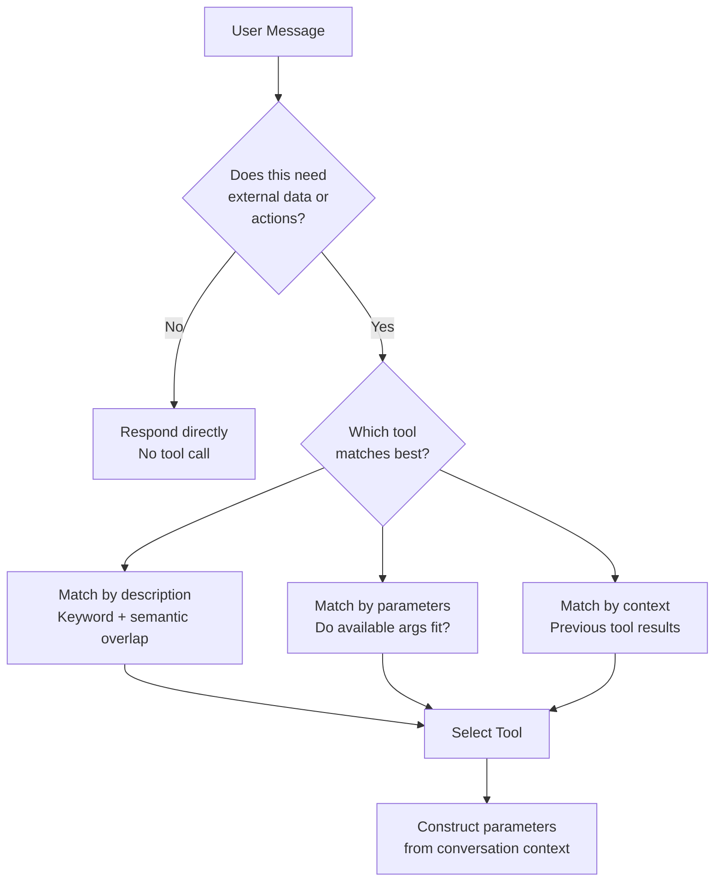

# Tool discovery and selection

## Introduction

Before an agent can use a tool, it needs to know the tool exists, what it does, and when to use it. This is tool discovery and selection — the process by which an LLM understands its available capabilities and chooses the right tool for each step of a task.

Think of it like a craftsperson's workshop. A master carpenter doesn't randomly grab tools — they assess the task ("I need to join these two boards"), scan their available tools (glue, screws, dowels, biscuit joiner), evaluate trade-offs (strength, speed, aesthetics), and select the best option. AI agents do the same, but their "workshop" is defined by tool schemas that describe each tool's name, purpose, and parameters.

### What we'll cover

- How tool schemas define capabilities for the LLM
- Framework-specific tool definition patterns (OpenAI, LangGraph, Anthropic)
- Tool selection criteria and how LLMs choose tools
- Context-aware tool selection with dynamic filtering

### Prerequisites

- Understanding of [agent architecture](../02-agent-architecture/00-agent-architecture.md) and the ReAct loop
- Basic familiarity with function calling concepts (Unit 10)
- Python proficiency with type hints and decorators

---

## Tool schemas: defining capabilities

Every tool is presented to the LLM as a structured schema containing a name, description, and parameter definitions. The quality of this schema directly determines how well the LLM selects and uses the tool.

### Anatomy of a tool schema

```python
# The core structure every framework uses (conceptually)
tool_schema = {
    "name": "get_weather",                    # Unique identifier
    "description": (                          # What it does and WHEN to use it
        "Get the current weather for a city. "
        "Use this when the user asks about weather, "
        "temperature, or outdoor conditions."
    ),
    "parameters": {                           # JSON Schema for inputs
        "type": "object",
        "properties": {
            "location": {
                "type": "string",
                "description": "City and state, e.g. 'San Francisco, CA'"
            },
            "units": {
                "type": "string",
                "enum": ["celsius", "fahrenheit"],
                "description": "Temperature units"
            }
        },
        "required": ["location"]
    }
}

print(f"Tool: {tool_schema['name']}")
print(f"Required params: {tool_schema['parameters']['required']}")
print(f"Optional params: ['units']")
```

**Output:**
```
Tool: get_weather
Required params: ['location']
Optional params: ['units']
```

> **🔑 Key concept:** The tool description is the most important field. It tells the LLM *when* to use the tool, not just *what* it does. A description like "Get weather" is far less effective than "Get the current weather for a city. Use when the user asks about weather, temperature, or outdoor conditions."

---

## Framework tool definitions

Each framework provides different syntactic sugar for creating tools, but they all produce the same underlying concept: a name, description, and typed parameters.

### OpenAI Agents SDK: `@function_tool`

The OpenAI SDK automatically extracts tool schemas from Python function signatures and docstrings:

```python
from agents import Agent, function_tool
from typing_extensions import TypedDict

class Location(TypedDict):
    lat: float
    long: float

@function_tool
async def fetch_weather(location: Location) -> str:
    """Fetch the current weather for a given location.

    Args:
        location: The geographic coordinates to check weather for.
    """
    # In production, call a weather API
    return f"Sunny, 72°F at ({location['lat']}, {location['long']})"

agent = Agent(
    name="Weather Assistant",
    tools=[fetch_weather],
)
```

**What the SDK extracts automatically:**
```
Name: fetch_weather (from function name)
Description: "Fetch the current weather for a given location." (from docstring)
Parameters: {"location": {"lat": float, "long": float}} (from type hints)
Arg descriptions: "The geographic coordinates..." (from Args: docstring)
```

> **💡 Tip:** The OpenAI SDK uses the `griffe` library to parse docstrings in Google, Sphinx, or NumPy format. Google format (shown above) is the most common and recommended.

### Custom function tools

When you need more control, create tools manually with `FunctionTool`:

```python
from agents import FunctionTool
from pydantic import BaseModel

class SearchArgs(BaseModel):
    query: str
    max_results: int = 5

async def run_search(ctx, args_json: str) -> str:
    parsed = SearchArgs.model_validate_json(args_json)
    return f"Found {parsed.max_results} results for '{parsed.query}'"

search_tool = FunctionTool(
    name="web_search",
    description="Search the web for current information. Use when the user asks about recent events or needs up-to-date data.",
    params_json_schema=SearchArgs.model_json_schema(),
    on_invoke_tool=run_search,
)
```

### LangGraph / LangChain: `@tool` decorator

LangChain uses a similar decorator pattern:

```python
from langchain.tools import tool

@tool
def multiply(a: int, b: int) -> int:
    """Multiply two numbers together.

    Args:
        a: First number to multiply.
        b: Second number to multiply.
    """
    return a * b

# Bind tools to the LLM
tools = [multiply]
llm_with_tools = llm.bind_tools(tools)

# The LLM now knows about this tool
msg = llm_with_tools.invoke("What is 7 times 8?")
print(msg.tool_calls)
```

**Output:**
```
[{'name': 'multiply', 'args': {'a': 7, 'b': 8}, 'id': 'call_abc123'}]
```

### Anthropic API: manual tool definitions

Anthropic uses explicit JSON schemas passed in the API request:

```python
import anthropic

client = anthropic.Anthropic()

tools = [
    {
        "name": "get_stock_price",
        "description": "Get the current stock price for a ticker symbol. Use when the user asks about stock prices, market data, or investment values.",
        "input_schema": {
            "type": "object",
            "properties": {
                "ticker": {
                    "type": "string",
                    "description": "Stock ticker symbol, e.g. 'AAPL', 'GOOGL'"
                }
            },
            "required": ["ticker"]
        }
    }
]

response = client.messages.create(
    model="claude-sonnet-4-20250514",
    max_tokens=1024,
    tools=tools,
    messages=[{"role": "user", "content": "What's Apple's stock price?"}]
)
```

### Framework comparison

| Feature | OpenAI Agents SDK | LangChain/LangGraph | Anthropic API |
|---------|-------------------|---------------------|---------------|
| Tool definition | `@function_tool` decorator | `@tool` decorator | JSON schema in request |
| Schema extraction | Auto from type hints | Auto from type hints | Manual JSON |
| Description source | Docstring | Docstring | `description` field |
| Param descriptions | Docstring `Args:` section | Docstring `Args:` section | `properties.*.description` |
| Hosted tools | `WebSearchTool`, `FileSearchTool`, `CodeInterpreterTool` | LangChain community tools | `web_search`, `web_fetch` (server tools) |

---

## How LLMs select tools

When an LLM receives a prompt along with tool schemas, it evaluates whether any tool would help answer the query. The selection process depends on several factors.

### Selection criteria



### The `tool_choice` parameter

All major APIs let you control tool selection behavior:

```python
from agents import Agent
from agents.model_settings import ModelSettings

# Let the model decide (default)
agent_auto = Agent(
    name="Assistant",
    tools=[fetch_weather],
    model_settings=ModelSettings(tool_choice="auto"),
)

# Force the model to use a tool
agent_required = Agent(
    name="Assistant",
    tools=[fetch_weather],
    model_settings=ModelSettings(tool_choice="required"),
)
```

| `tool_choice` value | Behavior |
|---------------------|----------|
| `"auto"` | Model decides whether to use a tool (default) |
| `"required"` | Model *must* call at least one tool |
| `"none"` | Model cannot call any tools |
| `{"type": "function", "name": "..."}` | Model must call a specific tool |

> **🤖 AI Context:** Setting `tool_choice="required"` is useful for the first step of agent loops where you want to guarantee the agent takes an action rather than immediately responding. After the first tool call, switch back to `"auto"` so the agent can decide when to stop.

---

## Writing effective tool descriptions

The tool description is your primary lever for improving tool selection accuracy. Here are patterns that work:

### Good vs bad descriptions

```python
# ❌ BAD: Too vague
bad_tool = {
    "name": "search",
    "description": "Search for things",
}

# ✅ GOOD: Specific, with usage guidance
good_tool = {
    "name": "search_knowledge_base",
    "description": (
        "Search the internal knowledge base for company policies, "
        "procedures, and documentation. Use this when the user asks "
        "about company rules, HR policies, or internal processes. "
        "Do NOT use for general web searches."
    ),
}

# ✅ GOOD: With examples
great_tool = {
    "name": "calculate_shipping",
    "description": (
        "Calculate shipping cost and delivery time for a package. "
        "Use when the user asks about shipping rates, delivery dates, "
        "or shipping options. Requires weight in kg and destination. "
        "Example queries: 'How much to ship to NYC?', "
        "'When will my package arrive?'"
    ),
}
```

### Description writing checklist

| Element | Example |
|---------|---------|
| **What** it does | "Calculate shipping cost and delivery time" |
| **When** to use it | "Use when the user asks about shipping rates" |
| **When NOT** to use it | "Do NOT use for tracking existing shipments" |
| **Required context** | "Requires weight in kg and destination" |
| **Example triggers** | "Example queries: 'How much to ship?'" |

---

## Context-aware tool selection

Sometimes the same set of tools shouldn't all be available in every situation. Context-aware selection dynamically filters tools based on the current state.

### OpenAI SDK: conditional tool enabling

```python
from agents import Agent, AgentBase, RunContextWrapper
from pydantic import BaseModel

class UserContext(BaseModel):
    role: str = "viewer"
    is_admin: bool = False

def admin_only(ctx: RunContextWrapper[UserContext], agent: AgentBase) -> bool:
    """Only enable this tool for admin users."""
    return ctx.context.is_admin

agent = Agent(
    name="Dashboard",
    tools=[
        view_data,  # Always available
        admin_agent.as_tool(
            tool_name="admin_actions",
            tool_description="Perform admin actions like deleting users.",
            is_enabled=admin_only,  # Only for admins
        ),
    ],
)
```

### MCP: dynamic tool filtering

When using MCP servers, you can filter which tools are exposed:

```python
from agents.mcp import MCPServerStdio, create_static_tool_filter

# Only expose safe read operations
server = MCPServerStdio(
    params={"command": "npx", "args": ["-y", "@modelcontextprotocol/server-filesystem", "/data"]},
    tool_filter=create_static_tool_filter(
        allowed_tool_names=["read_file", "list_directory"],
    ),
)
```

For more complex filtering based on runtime context:

```python
from agents.mcp import ToolFilterContext

async def role_based_filter(context: ToolFilterContext, tool) -> bool:
    """Filter tools based on the agent's role."""
    if context.agent.name == "Reader" and tool.name.startswith("write_"):
        return False  # Readers can't write
    return True

server = MCPServerStdio(
    params={"command": "npx", "args": ["-y", "@modelcontextprotocol/server-filesystem", "/data"]},
    tool_filter=role_based_filter,
)
```

---

## Best practices

| Practice | Why it matters |
|----------|----------------|
| Write descriptive tool descriptions with usage guidance | The description is the primary signal the LLM uses to select tools |
| Include "when to use" and "when NOT to use" in descriptions | Reduces false positive tool selections significantly |
| Use specific parameter descriptions with examples | Helps the LLM construct correct arguments on the first try |
| Limit active tools to 10-15 per agent | Too many tools confuse the model and increase token cost |
| Use `tool_choice="required"` sparingly | Useful for the first step, but let the agent decide when to stop |

---

## Common pitfalls

| ❌ Mistake | ✅ Solution |
|-----------|-------------|
| Vague tool descriptions like "search stuff" | Be specific: "Search the product catalog by name, category, or SKU" |
| Exposing 50+ tools to a single agent | Split into specialized agents with 5-10 tools each, use handoffs |
| Not including parameter descriptions | Always describe what each parameter expects with format examples |
| Using identical descriptions for similar tools | Differentiate clearly: "internal knowledge base" vs "public web search" |
| Ignoring the `required` field in parameter schemas | Mark truly required fields to prevent the LLM from omitting them |

---

## Hands-on exercise

### Your task

Build a tool registry that dynamically selects tools based on the user's query and context.

### Requirements

1. Create 5 tools with proper schemas (name, description, parameter schema)
2. Create a `ToolRegistry` class with a `select_tools()` method
3. Implement keyword-based matching to filter relevant tools for a query
4. Add role-based filtering (some tools are admin-only)
5. Test with 3 different queries showing different tool selections

### Expected result

Output showing different tools selected based on query content and user role.

<details>
<summary>💡 Hints (click to expand)</summary>

- Store tools in a list with metadata including keywords and required roles
- Match tools by checking if any tool keyword appears in the query
- Filter by role after keyword matching
- Return at most 3 tools per query to keep the context manageable

</details>

<details>
<summary>✅ Solution (click to expand)</summary>

```python
from dataclasses import dataclass, field

@dataclass
class ToolDef:
    name: str
    description: str
    keywords: list[str]
    required_role: str = "viewer"  # viewer, editor, admin

@dataclass
class ToolRegistry:
    tools: list[ToolDef] = field(default_factory=list)

    def register(self, tool: ToolDef):
        self.tools.append(tool)

    def select_tools(
        self,
        query: str,
        user_role: str = "viewer",
        max_tools: int = 3,
    ) -> list[ToolDef]:
        """Select relevant tools based on query and user role."""
        role_hierarchy = {"viewer": 0, "editor": 1, "admin": 2}
        user_level = role_hierarchy.get(user_role, 0)

        # Filter by role
        available = [
            t for t in self.tools
            if role_hierarchy.get(t.required_role, 0) <= user_level
        ]

        # Score by keyword matches
        query_lower = query.lower()
        scored = []
        for tool in available:
            score = sum(1 for kw in tool.keywords if kw in query_lower)
            if score > 0:
                scored.append((tool, score))

        scored.sort(key=lambda x: x[1], reverse=True)
        return [t for t, _ in scored[:max_tools]]

# Register tools
registry = ToolRegistry()
registry.register(ToolDef("search_products", "Search the product catalog", ["product", "search", "find", "catalog"], "viewer"))
registry.register(ToolDef("get_order", "Look up an order by ID", ["order", "tracking", "shipment"], "viewer"))
registry.register(ToolDef("update_product", "Update product details", ["update", "edit", "product", "change"], "editor"))
registry.register(ToolDef("delete_user", "Delete a user account", ["delete", "remove", "user"], "admin"))
registry.register(ToolDef("get_analytics", "View sales analytics", ["analytics", "sales", "revenue", "metrics"], "editor"))

# Test queries
tests = [
    ("Find me a product in the catalog", "viewer"),
    ("Update the product price and check analytics", "editor"),
    ("Delete user account and search products", "viewer"),  # Can't delete as viewer
]

for query, role in tests:
    tools = registry.select_tools(query, user_role=role)
    tool_names = [t.name for t in tools]
    print(f"Query: '{query}' (role: {role})")
    print(f"  Selected: {tool_names}\n")
```

**Expected output:**
```
Query: 'Find me a product in the catalog' (role: viewer)
  Selected: ['search_products']

Query: 'Update the product price and check analytics' (role: editor)
  Selected: ['update_product', 'get_analytics']

Query: 'Delete user account and search products' (role: viewer)
  Selected: ['search_products']
```

</details>

### Bonus challenges

- [ ] Add semantic matching using embeddings instead of keyword matching
- [ ] Implement tool grouping — select all tools from a matching group, not individual tools
- [ ] Add a `confidence_threshold` parameter that requires a minimum match score

---

## Summary

✅ **Tool schemas** define capabilities through names, descriptions, and typed parameters — the description is the most critical field for accurate selection

✅ **Framework patterns** vary syntactically (`@function_tool`, `@tool`, JSON schema) but all produce the same underlying structure for the LLM

✅ **LLM selection** is driven by description matching, parameter compatibility, and conversational context — controlled via `tool_choice`

✅ **Effective descriptions** include what the tool does, when to use it, when NOT to use it, and example triggers

✅ **Context-aware filtering** with `is_enabled` callbacks and MCP `tool_filter` dynamically controls which tools are available based on user role, agent type, or runtime state

**Next:** [Tool Invocation in Agent Loops](./02-tool-invocation-in-agent-loops.md)

---

## Further reading

- [OpenAI Agents SDK: Tools](https://openai.github.io/openai-agents-python/tools/) — Function tools, hosted tools, agents as tools
- [Anthropic: Tool Use Overview](https://docs.anthropic.com/en/docs/build-with-claude/tool-use/overview) — Tool definition and usage patterns
- [LangChain: Tools](https://docs.langchain.com/oss/python/langchain/tools) — Tool decorator and binding
- [OpenAI: Function Calling Guide](https://platform.openai.com/docs/guides/function-calling) — Best practices for tool schemas

*[Back to Tool Integration Overview](./00-tool-integration.md)*

<!--
Sources Consulted:
- OpenAI Agents SDK Tools: https://openai.github.io/openai-agents-python/tools/
- OpenAI Agents SDK MCP: https://openai.github.io/openai-agents-python/mcp/
- Anthropic Tool Use Overview: https://platform.claude.com/docs/en/docs/build-with-claude/tool-use/overview
- LangGraph Workflows and Agents: https://docs.langchain.com/oss/python/langgraph/workflows-agents
-->
