# Tool invocation in agent loops

## Introduction

Once an agent selects a tool, it needs to actually call it — constructing the right parameters, executing the function, and feeding the result back into the conversation. This is tool invocation, the mechanical heart of every agent loop.

The invocation step is where theory meets reality. The LLM generates a tool call request (a structured JSON object), the runtime executes the actual function, and the result flows back to the LLM for interpretation. Understanding this loop is essential because every framework implements it differently — from OpenAI's fully automatic runner to LangGraph's explicit graph nodes to Anthropic's manual request-response cycle.

### What we'll cover

- The universal tool invocation cycle
- OpenAI's automatic agent loop with `Runner.run()`
- LangGraph's explicit graph-based tool node pattern
- Anthropic's manual tool_use / tool_result cycle
- Controlling loop behavior with `max_turns` and exit conditions

### Prerequisites

- [Tool Discovery and Selection](./01-tool-discovery-and-selection.md) — tool schemas and definitions
- Understanding of the [ReAct loop](../03-reasoning-and-planning/00-reasoning-and-planning.md)
- Basic async Python (`async`/`await`)

---

## The universal invocation cycle

Regardless of the framework, every tool invocation follows the same four-step cycle:

```mermaid
sequenceDiagram
    participant User
    participant LLM
    participant Runtime
    participant Tool

    User->>LLM: "What's the weather in Tokyo?"
    LLM->>Runtime: tool_call: get_weather(location="Tokyo")
    Runtime->>Tool: Execute get_weather("Tokyo")
    Tool-->>Runtime: "Sunny, 24°C"
    Runtime->>LLM: tool_result: "Sunny, 24°C"
    LLM->>User: "The weather in Tokyo is sunny at 24°C"
```



### The four steps

| Step | What happens | Who does it |
|------|-------------|-------------|
| **1. Tool call generation** | LLM outputs a structured tool call instead of text | The LLM |
| **2. Call extraction** | Runtime parses the tool name and arguments from the response | The framework |
| **3. Tool execution** | The actual function runs with the extracted arguments | Your code |
| **4. Result injection** | The tool's output is added to the message history | The framework |

After step 4, the loop repeats — the LLM sees the tool result and decides whether to call another tool or respond to the user.

---

## OpenAI Agents SDK: automatic execution

The OpenAI Agents SDK provides the most automated approach. The `Runner` class handles the entire loop internally — you define tools and the agent, then call `Runner.run()`:

```python
from agents import Agent, Runner, function_tool

@function_tool
def get_weather(city: str) -> str:
    """Get the current weather for a city.

    Args:
        city: The name of the city to check weather for.
    """
    # Simulated API call
    weather_data = {
        "Tokyo": "Sunny, 24°C",
        "London": "Rainy, 12°C",
        "New York": "Cloudy, 18°C",
    }
    return weather_data.get(city, f"Weather data not available for {city}")

@function_tool
def get_population(city: str) -> str:
    """Get the population of a city.

    Args:
        city: The name of the city.
    """
    populations = {
        "Tokyo": "13.96 million",
        "London": "8.98 million",
        "New York": "8.34 million",
    }
    return populations.get(city, "Population data not available")

agent = Agent(
    name="City Info Agent",
    instructions="You provide information about cities. Use the available tools to answer questions.",
    tools=[get_weather, get_population],
)

# The Runner handles the ENTIRE loop automatically
result = await Runner.run(agent, "What's the weather and population of Tokyo?")
print(result.final_output)
```

**Output:**
```
Tokyo is currently sunny at 24°C and has a population of 13.96 million.
```

### What `Runner.run()` does internally


### Controlling the loop

```python
# Limit the number of tool-call rounds
result = await Runner.run(
    agent,
    "Research Tokyo comprehensively",
    max_turns=5,  # Stop after 5 LLM calls (including tool calls)
)

print(f"Turns used: {len(result.raw_responses)}")
```

> **Warning:** Without `max_turns`, an agent with recursive logic could loop indefinitely. Always set a reasonable limit in production — typically 5-15 turns depending on task complexity.

### Streaming tool calls

For real-time feedback, use `Runner.run_streamed()`:

```python
result = Runner.run_streamed(agent, "Tell me about London")

async for event in result.stream_events():
    if event.type == "raw_response_event":
        # Stream LLM tokens as they arrive
        pass
    elif event.type == "tool_call_event":
        print(f"Calling tool: {event.tool_name}({event.arguments})")
    elif event.type == "tool_result_event":
        print(f"Tool returned: {event.result[:100]}...")
```

**Output:**
```
Calling tool: get_weather({"city": "London"})
Tool returned: Rainy, 12°C...
Calling tool: get_population({"city": "London"})
Tool returned: 8.98 million...
```

---

## LangGraph: explicit graph-based invocation

LangGraph gives you full control by making the tool invocation loop an explicit graph with nodes and edges:

```python
from langgraph.graph import StateGraph, MessagesState, START, END
from langchain_openai import ChatOpenAI
from langchain.tools import tool
from langchain_core.messages import ToolMessage
import json

@tool
def search_database(query: str) -> str:
    """Search the product database for items matching the query.

    Args:
        query: Search terms to find products.
    """
    products = {
        "laptop": {"name": "ProBook X1", "price": 999},
        "phone": {"name": "SmartPhone Pro", "price": 699},
    }
    for key, val in products.items():
        if key in query.lower():
            return json.dumps(val)
    return "No products found"

@tool
def check_inventory(product_name: str) -> str:
    """Check if a product is in stock.

    Args:
        product_name: The exact product name to check.
    """
    inventory = {"ProBook X1": 15, "SmartPhone Pro": 0}
    count = inventory.get(product_name, -1)
    if count < 0:
        return f"Product '{product_name}' not found"
    return f"{product_name}: {count} in stock"

# Build the graph
tools = [search_database, check_inventory]
tools_by_name = {t.name: t for t in tools}
llm = ChatOpenAI(model="gpt-4o").bind_tools(tools)

def llm_node(state: MessagesState):
    """Call the LLM with current messages."""
    return {"messages": [llm.invoke(state["messages"])]}

def tool_node(state: MessagesState):
    """Execute all tool calls from the last LLM message."""
    outputs = []
    for tool_call in state["messages"][-1].tool_calls:
        tool_result = tools_by_name[tool_call["name"]].invoke(tool_call["args"])
        outputs.append(
            ToolMessage(
                content=tool_result,
                name=tool_call["name"],
                tool_call_id=tool_call["id"],
            )
        )
    return {"messages": outputs}

def should_continue(state: MessagesState):
    """Check if the LLM wants to call more tools."""
    last_message = state["messages"][-1]
    if last_message.tool_calls:
        return "tools"
    return END

# Assemble the graph
graph = StateGraph(MessagesState)
graph.add_node("llm", llm_node)
graph.add_node("tools", tool_node)
graph.add_edge(START, "llm")
graph.add_conditional_edges("llm", should_continue, ["tools", END])
graph.add_edge("tools", "llm")

app = graph.compile()
```

### The LangGraph loop visualized


### Key difference from OpenAI

| Aspect | OpenAI Agents SDK | LangGraph |
|--------|-------------------|-----------|
| Loop control | Automatic (`Runner.run()`) | Manual (graph edges) |
| Tool execution | Built into runner | Explicit `tool_node` function |
| Exit condition | Auto-detects final output | `should_continue` function |
| Customization | Hooks and callbacks | Full graph control |
| Message format | Internal | `MessagesState` with `ToolMessage` |

> **🤖 AI Context:** LangGraph's explicit approach is preferred when you need custom logic between tool calls — like validation, approval gates, or conditional routing based on tool results.

---

## Anthropic API: manual invocation cycle

The Anthropic API requires you to manage the tool loop manually by inspecting `stop_reason` and constructing follow-up messages:

```python
import anthropic

client = anthropic.Anthropic()

tools = [
    {
        "name": "get_exchange_rate",
        "description": "Get the current exchange rate between two currencies.",
        "input_schema": {
            "type": "object",
            "properties": {
                "from_currency": {
                    "type": "string",
                    "description": "Source currency code (e.g. 'USD')"
                },
                "to_currency": {
                    "type": "string",
                    "description": "Target currency code (e.g. 'EUR')"
                }
            },
            "required": ["from_currency", "to_currency"]
        }
    }
]

def execute_tool(name: str, input_data: dict) -> str:
    """Execute a tool and return the result."""
    if name == "get_exchange_rate":
        rates = {("USD", "EUR"): 0.92, ("USD", "JPY"): 149.50}
        pair = (input_data["from_currency"], input_data["to_currency"])
        rate = rates.get(pair, "Rate not available")
        return f"1 {pair[0]} = {rate} {pair[1]}"
    return "Unknown tool"

# Step 1: Initial request
messages = [{"role": "user", "content": "What's the USD to EUR exchange rate?"}]

response = client.messages.create(
    model="claude-sonnet-4-20250514",
    max_tokens=1024,
    tools=tools,
    messages=messages,
)

# Step 2: Check if Claude wants to use a tool
if response.stop_reason == "tool_use":
    # Extract the tool call
    tool_block = next(b for b in response.content if b.type == "tool_use")
    print(f"Claude wants to call: {tool_block.name}({tool_block.input})")

    # Step 3: Execute the tool
    result = execute_tool(tool_block.name, tool_block.input)
    print(f"Tool returned: {result}")

    # Step 4: Send the result back to Claude
    messages.append({"role": "assistant", "content": response.content})
    messages.append({
        "role": "user",
        "content": [
            {
                "type": "tool_result",
                "tool_use_id": tool_block.id,
                "content": result,
            }
        ],
    })

    # Step 5: Get Claude's final response
    final_response = client.messages.create(
        model="claude-sonnet-4-20250514",
        max_tokens=1024,
        tools=tools,
        messages=messages,
    )
    print(f"\nClaude's answer: {final_response.content[0].text}")
```

**Output:**
```
Claude wants to call: get_exchange_rate({"from_currency": "USD", "to_currency": "EUR"})
Tool returned: 1 USD = 0.92 EUR

Claude's answer: The current exchange rate is 1 USD = 0.92 EUR.
```

### Building a reusable loop

In production, wrap the manual cycle in a loop:

```python
async def run_agent_loop(
    client: anthropic.Anthropic,
    tools: list,
    messages: list,
    max_iterations: int = 10,
) -> str:
    """Run the Anthropic tool-use loop until completion."""
    for i in range(max_iterations):
        response = client.messages.create(
            model="claude-sonnet-4-20250514",
            max_tokens=4096,
            tools=tools,
            messages=messages,
        )

        # If no tool use, we're done
        if response.stop_reason == "end_turn":
            text_blocks = [b.text for b in response.content if hasattr(b, "text")]
            return "\n".join(text_blocks)

        # Process all tool calls in this response
        messages.append({"role": "assistant", "content": response.content})

        tool_results = []
        for block in response.content:
            if block.type == "tool_use":
                result = execute_tool(block.name, block.input)
                tool_results.append({
                    "type": "tool_result",
                    "tool_use_id": block.id,
                    "content": result,
                })

        messages.append({"role": "user", "content": tool_results})

    return "Max iterations reached"
```

---

## Comparing invocation patterns

| Aspect | OpenAI Agents SDK | LangGraph | Anthropic API |
|--------|-------------------|-----------|---------------|
| Loop management | Fully automatic | Graph-defined | Manual |
| Code complexity | Low (~10 lines) | Medium (~40 lines) | High (~50+ lines) |
| Customization | Hooks/callbacks | Full control | Full control |
| Parallel tool calls | Automatic | Explicit in `tool_node` | Manual extraction |
| Streaming | `run_streamed()` | Stream events | Manual SSE |
| Best for | Rapid prototyping, production | Complex workflows | Direct API control |

---

## Best practices

| Practice | Why it matters |
|----------|----------------|
| Always set `max_turns` / `max_iterations` | Prevents infinite loops and runaway API costs |
| Log every tool call and result | Essential for debugging agent behavior and auditing |
| Validate tool arguments before execution | LLMs sometimes generate malformed or out-of-range parameters |
| Handle tool execution errors gracefully | Return error messages to the LLM rather than crashing the loop |
| Use streaming for long-running agents | Provides real-time feedback and prevents timeout issues |

---

## Common pitfalls

| ❌ Mistake | ✅ Solution |
|-----------|-------------|
| No `max_turns` limit — agent loops forever | Always set a maximum: `max_turns=10` or `max_iterations=10` |
| Crashing on tool execution error | Catch exceptions and return error messages to the LLM |
| Not matching `tool_call_id` in results | Each `tool_result` must reference the exact `tool_use_id` from the call |
| Ignoring parallel tool calls | The LLM may request multiple tools at once — process all of them |
| Blocking the event loop with sync tool code | Use `async` tool functions or run sync code in a thread executor |

---

## Hands-on exercise

### Your task

Build a complete agent loop from scratch (without using a framework's automatic runner) that handles multiple tool calls across multiple iterations.

### Requirements

1. Define 3 tools: `search_web`, `calculate`, and `get_time`
2. Implement a manual agent loop that:
   - Sends messages to an LLM (simulate with predetermined responses)
   - Detects tool call requests in the response
   - Executes the appropriate tool
   - Feeds results back and continues the loop
3. Handle the case where the LLM calls 2 tools in one response
4. Add a `max_iterations` guard
5. Print each step of the loop for visibility

### Expected result

A step-by-step trace showing the agent loop processing a multi-tool query.

<details>
<summary>💡 Hints (click to expand)</summary>

- Simulate LLM responses with a list of predetermined outputs
- Each "response" should be either a tool call or a final text answer
- Use a dictionary to map tool names to functions
- Process tool calls in a batch when multiple are requested

</details>

<details>
<summary>✅ Solution (click to expand)</summary>

```python
import json
from datetime import datetime
from dataclasses import dataclass

@dataclass
class ToolCall:
    id: str
    name: str
    arguments: dict

@dataclass
class LLMResponse:
    tool_calls: list[ToolCall] | None = None
    text: str | None = None

# Define tools
def search_web(query: str) -> str:
    results = {"Python async": "Python's asyncio enables concurrent I/O operations."}
    return results.get(query, f"No results for '{query}'")

def calculate(expression: str) -> str:
    try:
        result = eval(expression)  # Safe in simulation only!
        return str(result)
    except Exception as e:
        return f"Error: {e}"

def get_time(timezone: str = "UTC") -> str:
    return f"Current time ({timezone}): {datetime.now().strftime('%H:%M:%S')}"

tools_map = {
    "search_web": search_web,
    "calculate": calculate,
    "get_time": get_time,
}

# Simulate LLM responses
simulated_responses = [
    # Turn 1: LLM calls two tools at once
    LLMResponse(tool_calls=[
        ToolCall("call_1", "search_web", {"query": "Python async"}),
        ToolCall("call_2", "get_time", {"timezone": "UTC"}),
    ]),
    # Turn 2: LLM calls one more tool
    LLMResponse(tool_calls=[
        ToolCall("call_3", "calculate", {"expression": "365 * 24"}),
    ]),
    # Turn 3: LLM gives final answer
    LLMResponse(text="Here's what I found: Python's asyncio enables concurrent I/O. The current time is noted. There are 8,760 hours in a year."),
]

def run_agent_loop(query: str, max_iterations: int = 10):
    """Run a manual agent loop with simulated LLM."""
    messages = [{"role": "user", "content": query}]
    response_idx = 0

    print(f"User: {query}\n")

    for i in range(max_iterations):
        print(f"--- Iteration {i + 1} ---")

        # Simulate LLM call
        if response_idx >= len(simulated_responses):
            print("No more simulated responses")
            break

        response = simulated_responses[response_idx]
        response_idx += 1

        # Check if it's a final text response
        if response.text:
            print(f"Agent: {response.text}")
            return response.text

        # Process tool calls
        if response.tool_calls:
            print(f"Tool calls requested: {len(response.tool_calls)}")

            for tc in response.tool_calls:
                print(f"  Calling: {tc.name}({json.dumps(tc.arguments)})")
                tool_fn = tools_map[tc.name]
                result = tool_fn(**tc.arguments)
                print(f"  Result: {result}")
                messages.append({
                    "role": "tool",
                    "tool_call_id": tc.id,
                    "content": result,
                })

        print()

    return "Max iterations reached"

# Run it
final = run_agent_loop("Tell me about Python async, the current time, and hours in a year")
```

**Expected output:**
```
User: Tell me about Python async, the current time, and hours in a year

--- Iteration 1 ---
Tool calls requested: 2
  Calling: search_web({"query": "Python async"})
  Result: Python's asyncio enables concurrent I/O operations.
  Calling: get_time({"timezone": "UTC"})
  Result: Current time (UTC): 14:32:07

--- Iteration 2 ---
Tool calls requested: 1
  Calling: calculate({"expression": "365 * 24"})
  Result: 8760

--- Iteration 3 ---
Agent: Here's what I found: Python's asyncio enables concurrent I/O. The current time is noted. There are 8,760 hours in a year.
```

</details>

### Bonus challenges

- [ ] Add error handling — what happens when a tool raises an exception?
- [ ] Add a token/cost counter that tracks cumulative usage across iterations
- [ ] Implement a "tool call budget" that limits total tool calls (not just iterations)

---

## Summary

✅ **Every tool invocation** follows the same cycle: LLM generates a call → runtime extracts it → tool executes → result feeds back to LLM

✅ **OpenAI's `Runner.run()`** handles the entire loop automatically — ideal for rapid development and production agents with standard patterns

✅ **LangGraph's explicit graph** gives full control with `llm_node` → `should_continue` → `tool_node` edges — best for complex workflows needing custom logic between tool calls

✅ **Anthropic's manual cycle** checks `stop_reason == "tool_use"`, executes tools, and sends `tool_result` back — maximum flexibility with more code

✅ **Always set iteration limits** (`max_turns`, `max_iterations`) and log every tool call for debugging and cost control

**Next:** [Result Interpretation](./03-result-interpretation.md)

---

## Further reading

- [OpenAI Agents SDK: Running Agents](https://openai.github.io/openai-agents-python/running_agents/) — Runner, streaming, turn limits
- [LangGraph: Tool Calling](https://langchain-ai.github.io/langgraph/how-tos/tool-calling/) — Graph-based tool execution patterns
- [Anthropic: Tool Use](https://docs.anthropic.com/en/docs/build-with-claude/tool-use/overview) — Manual invocation cycle
- [OpenAI: Function Calling](https://platform.openai.com/docs/guides/function-calling) — Tool call format and best practices

*[Back to Tool Integration Overview](./00-tool-integration.md)*

<!--
Sources Consulted:
- OpenAI Agents SDK Tools: https://openai.github.io/openai-agents-python/tools/
- OpenAI Agents SDK MCP: https://openai.github.io/openai-agents-python/mcp/
- Anthropic Tool Use: https://docs.anthropic.com/en/docs/build-with-claude/tool-use/overview
- LangGraph Workflows and Agents: https://langchain-ai.github.io/langgraph/concepts/agentic_concepts/
-->
