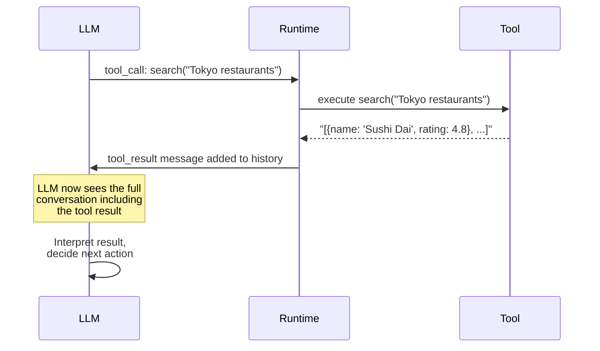
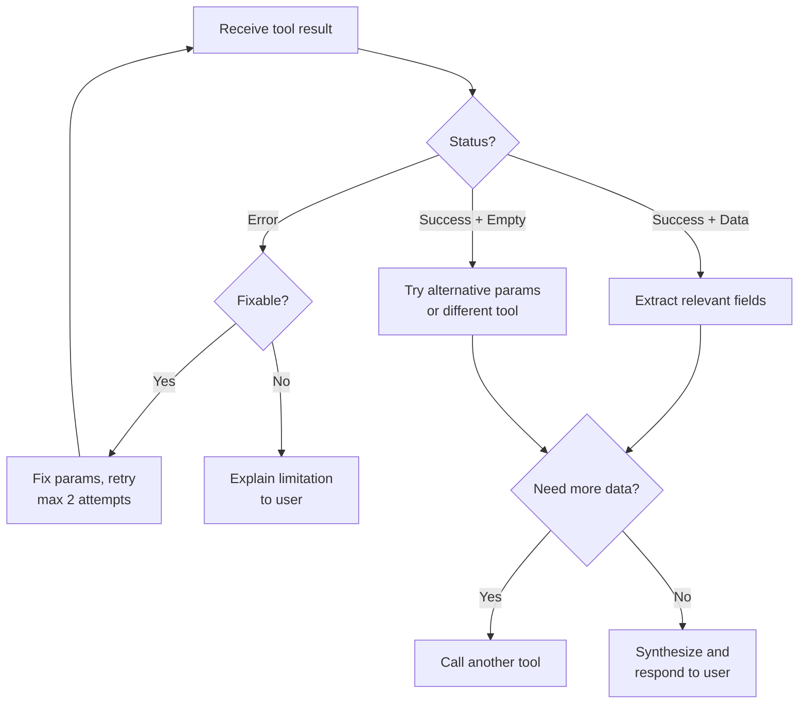

# Result interpretation

## Introduction

After a tool executes, the agent receives raw output — a string, a JSON object, an image, or even an error message. The agent must interpret this result, decide if it's useful, and determine what to do next. This step separates effective agents from brittle ones.

Result interpretation is where the LLM's reasoning ability shines. A well-designed agent doesn't just pass tool output directly to the user — it validates the result, extracts relevant information, combines it with context from other tools, and formulates a coherent response. When results are unexpected or incomplete, the agent must decide whether to retry, try a different tool, or ask the user for clarification.

### What we'll cover

- How tool results flow back into the conversation
- Parsing structured vs unstructured outputs
- Rich return types (images, files, structured data)
- Success and failure detection patterns
- LLM-driven result analysis and decision making

### Prerequisites

- [Tool Invocation in Agent Loops](./02-tool-invocation-in-agent-loops.md) — the invocation cycle
- Familiarity with JSON parsing and Python data structures
- Understanding of how LLMs process context in conversation history

---

## How results flow into conversation

When a tool returns a value, it becomes part of the message history that the LLM sees on its next turn. The format varies by framework, but the principle is the same: the result is injected as a special message type between the assistant's tool call and the assistant's next response.



### Message history structure

After a tool call, the conversation history looks like this:

```python
messages = [
    # 1. User's original question
    {"role": "user", "content": "Find top-rated restaurants in Tokyo"},

    # 2. LLM's tool call (assistant message)
    {
        "role": "assistant",
        "content": None,
        "tool_calls": [{
            "id": "call_abc123",
            "function": {
                "name": "search_restaurants",
                "arguments": '{"city": "Tokyo", "sort_by": "rating"}'
            }
        }]
    },

    # 3. Tool result (injected by runtime)
    {
        "role": "tool",
        "tool_call_id": "call_abc123",
        "content": '[{"name": "Sushi Dai", "rating": 4.8, "cuisine": "Sushi"}, {"name": "Ramen Nagi", "rating": 4.7, "cuisine": "Ramen"}]'
    },

    # 4. LLM's interpretation (next response)
    # The LLM generates this based on everything above
]

# The tool result is ALWAYS a string
# The LLM parses structured data from the string content
print(f"Tool result type: {type(messages[2]['content'])}")
print(f"Content: {messages[2]['content'][:80]}...")
```

**Output:**
```
Tool result type: <class 'str'>
Content: [{"name": "Sushi Dai", "rating": 4.8, "cuisine": "Sushi"}, {"name": "Ramen Na...
```

> **🔑 Key concept:** Tool results are always serialized as strings in the message history. Even if your tool returns a Python dict or a Pydantic model, the framework converts it to a string before the LLM sees it. This means the format of your tool's output directly affects how well the LLM can interpret it.

---

## Structured vs unstructured output

The format of your tool's return value significantly affects how well the LLM can work with the results.

### Unstructured output (plain text)

```python
from agents import function_tool

@function_tool
def search_basic(query: str) -> str:
    """Search for information.

    Args:
        query: What to search for.
    """
    # Returns plain text — harder for LLM to parse precisely
    return "Found 3 results: Sushi Dai is rated 4.8 stars and serves sushi. Ramen Nagi is rated 4.7 and serves ramen. Tempura Kondo is rated 4.6 and serves tempura."
```

### Structured output (JSON)

```python
import json

@function_tool
def search_structured(query: str) -> str:
    """Search for restaurants with structured results.

    Args:
        query: What to search for.
    """
    # Returns structured JSON — easy for LLM to parse and reference
    results = [
        {"name": "Sushi Dai", "rating": 4.8, "cuisine": "Sushi", "price": "$$$$"},
        {"name": "Ramen Nagi", "rating": 4.7, "cuisine": "Ramen", "price": "$$"},
        {"name": "Tempura Kondo", "rating": 4.6, "cuisine": "Tempura", "price": "$$$"},
    ]
    return json.dumps(results, indent=2)
```

### Comparison

| Aspect | Unstructured (text) | Structured (JSON) |
|--------|--------------------|--------------------|
| LLM parsing | Requires inference from natural language | Direct field access |
| Accuracy | May miss or misinterpret values | Precise extraction |
| Filtering | LLM must re-read entire text | LLM can reference specific fields |
| Token cost | Often verbose | Compact and dense |
| Best for | Simple, single-value results | Multi-field records, lists |

> **💡 Tip:** Always return structured data (JSON) when your tool produces multiple fields or records. Reserve plain text for simple results like "Success" or single values.

---

## Rich return types

Modern frameworks support returning more than just text. The OpenAI Agents SDK provides typed wrappers for images, files, and composite outputs.

### Returning images

```python
import base64
from agents import function_tool
from agents.tool import ToolOutputImage

@function_tool
def generate_chart(data_type: str) -> list:
    """Generate a data visualization chart.

    Args:
        data_type: Type of chart to generate (bar, line, pie).
    """
    # In production, generate actual chart with matplotlib
    # For demonstration, return a placeholder
    image_bytes = create_chart(data_type)  # Your chart generation code
    image_b64 = base64.b64encode(image_bytes).decode("utf-8")

    return [
        ToolOutputText(text=f"Generated a {data_type} chart"),
        ToolOutputImage(
            image_data=image_b64,
            media_type="image/png",
        ),
    ]
```

### Returning files

```python
from agents.tool import ToolOutputFileContent, ToolOutputText

@function_tool
def export_csv(table_name: str) -> list:
    """Export a database table as a CSV file.

    Args:
        table_name: Name of the table to export.
    """
    csv_content = "name,rating,price\nSushi Dai,4.8,$$$$\nRamen Nagi,4.7,$$"

    return [
        ToolOutputText(text=f"Exported {table_name} with 2 rows"),
        ToolOutputFileContent(
            content=csv_content,
            filename=f"{table_name}.csv",
            media_type="text/csv",
        ),
    ]
```

### Return type reference

| Type | Import | Use case |
|------|--------|----------|
| `str` | Built-in | Simple text results, JSON strings |
| `ToolOutputText` | `agents.tool` | Text part of a composite return |
| `ToolOutputImage` | `agents.tool` | Charts, screenshots, generated images |
| `ToolOutputFileContent` | `agents.tool` | CSV exports, generated documents |
| `list` of above | — | Composite results (text + image + file) |

---

## Success and failure detection

The LLM needs clear signals to know whether a tool call succeeded or failed. Explicit status indicators prevent the agent from treating error messages as valid data.

### Pattern: explicit status in returns

```python
import json

@function_tool
def query_database(sql: str) -> str:
    """Run a read-only SQL query against the database.

    Args:
        sql: The SQL SELECT query to execute.
    """
    try:
        # Validate it's a SELECT query
        if not sql.strip().upper().startswith("SELECT"):
            return json.dumps({
                "status": "error",
                "error": "Only SELECT queries are allowed",
                "suggestion": "Rewrite your query as a SELECT statement"
            })

        results = execute_query(sql)  # Your DB logic

        return json.dumps({
            "status": "success",
            "row_count": len(results),
            "data": results
        })

    except Exception as e:
        return json.dumps({
            "status": "error",
            "error": str(e),
            "suggestion": "Check the table name and column names"
        })

# Example outputs the LLM would see:

# Success case:
success_output = {
    "status": "success",
    "row_count": 3,
    "data": [{"id": 1, "name": "Tokyo"}, {"id": 2, "name": "Osaka"}]
}

# Error case:
error_output = {
    "status": "error",
    "error": "Table 'citeis' does not exist",
    "suggestion": "Check the table name and column names"
}

print("Success:", json.dumps(success_output, indent=2))
print()
print("Error:", json.dumps(error_output, indent=2))
```

**Output:**
```
Success: {
  "status": "success",
  "row_count": 3,
  "data": [
    {"id": 1, "name": "Tokyo"},
    {"id": 2, "name": "Osaka"}
  ]
}

Error: {
  "status": "error",
  "error": "Table 'citeis' does not exist",
  "suggestion": "Check the table name and column names"
}
```

> **🤖 AI Context:** Including a `suggestion` field in error returns gives the LLM actionable guidance for self-correction. Without it, the agent might retry with the exact same parameters or give up entirely. With it, the LLM can fix the typo ("citeis" → "cities") and retry.

### Pattern: empty result handling

```python
@function_tool
def search_products(query: str, category: str = "all") -> str:
    """Search the product catalog.

    Args:
        query: Search terms.
        category: Product category to filter by.
    """
    results = do_search(query, category)

    if not results:
        return json.dumps({
            "status": "success",  # Not an error — the search worked
            "row_count": 0,
            "data": [],
            "message": f"No products found matching '{query}' in category '{category}'",
            "suggestions": [
                "Try broader search terms",
                "Remove the category filter",
                f"Available categories: electronics, clothing, books"
            ]
        })

    return json.dumps({
        "status": "success",
        "row_count": len(results),
        "data": results
    })
```

---

## Custom output extraction

When using agents as tools (an agent delegated to handle part of a task), you can customize how the parent agent receives the sub-agent's output:

```python
from agents import Agent

def extract_summary(run_result) -> str:
    """Extract just the key findings from a research agent's output."""
    full_output = run_result.final_output

    # Custom extraction logic
    # Instead of returning the entire research report,
    # return only the summary section
    if "## Summary" in full_output:
        summary_start = full_output.index("## Summary")
        return full_output[summary_start:]

    # Fallback: return first 500 characters
    return full_output[:500] + "..." if len(full_output) > 500 else full_output

research_agent = Agent(
    name="Research Agent",
    instructions="You are a thorough researcher. Write detailed reports.",
    tools=[web_search, document_reader],
)

main_agent = Agent(
    name="Main Agent",
    instructions="You coordinate research tasks and present findings concisely.",
    tools=[
        research_agent.as_tool(
            tool_name="deep_research",
            tool_description="Perform deep research on a topic.",
            custom_output_extractor=extract_summary,
        ),
    ],
)
```

---

## LLM-driven result analysis

The most powerful aspect of tool result interpretation is that the LLM itself analyzes the results using its reasoning capabilities. You can guide this analysis through agent instructions:

```python
agent = Agent(
    name="Data Analyst",
    instructions="""You are a data analyst. When you receive tool results:

    1. VALIDATE: Check if the result contains the expected data format
    2. ANALYZE: Look for patterns, outliers, and key insights
    3. SYNTHESIZE: Combine results from multiple tools into a coherent narrative
    4. DECIDE: Determine if you need more data (call another tool) or can answer

    If a tool returns an error:
    - Read the error message and suggestion carefully
    - Try to fix the issue and retry (up to 2 attempts)
    - If you can't fix it, explain the limitation to the user

    If a tool returns empty results:
    - Try alternative search terms or parameters
    - Broaden the search criteria
    - Inform the user about what you tried
    """,
    tools=[query_database, search_products, generate_chart],
)
```

### Result interpretation flow



---

## Best practices

| Practice | Why it matters |
|----------|----------------|
| Return structured JSON with a `status` field | Clear success/failure signal prevents misinterpretation |
| Include `suggestion` in error returns | Guides the LLM toward self-correction instead of giving up |
| Keep return values under 4,000 tokens | Large returns consume context window and may be truncated |
| Distinguish "empty result" from "error" | An empty search is not a failure — it's valid information |
| Use `custom_output_extractor` for verbose sub-agents | Prevents context window bloat from long intermediate outputs |

---

## Common pitfalls

| ❌ Mistake | ✅ Solution |
|-----------|-------------|
| Returning raw exceptions as tool output | Wrap errors with `{"status": "error", "error": "...", "suggestion": "..."}` |
| Returning 50KB+ results from database queries | Paginate or limit results: `LIMIT 20`, include `total_count` |
| No status field — LLM can't tell success from failure | Always include `"status": "success"` or `"status": "error"` |
| Plain text errors like "Something went wrong" | Be specific: "Table 'users' not found. Available tables: customers, orders" |
| Returning binary data as raw bytes | Use `ToolOutputImage` or `ToolOutputFileContent` wrappers, encode as base64 |

---

## Hands-on exercise

### Your task

Build a tool that returns structured results with proper success/failure handling, and a result interpreter that processes those results.

### Requirements

1. Create a `search_movies` tool that returns structured JSON with a `status` field
2. Handle three cases: successful results, empty results, and errors
3. Build a `ResultInterpreter` class that:
   - Parses the JSON result
   - Detects the status and extracts data or error info
   - Returns a formatted summary for the user
4. Test with all three cases

### Expected result

Formatted output showing how each case is handled differently.

<details>
<summary>💡 Hints (click to expand)</summary>

- Use `json.dumps()` in the tool and `json.loads()` in the interpreter
- For the empty case, suggest alternative search terms
- For the error case, include both the error message and a suggestion
- The interpreter should produce human-readable output, not raw JSON

</details>

<details>
<summary>✅ Solution (click to expand)</summary>

```python
import json

# Simulated movie database
MOVIES_DB = [
    {"title": "Inception", "year": 2010, "rating": 8.8, "genre": "Sci-Fi"},
    {"title": "The Matrix", "year": 1999, "rating": 8.7, "genre": "Sci-Fi"},
    {"title": "Parasite", "year": 2019, "rating": 8.5, "genre": "Thriller"},
]

def search_movies(query: str, year: int | None = None) -> str:
    """Search the movie database."""
    try:
        if not query or len(query) < 2:
            return json.dumps({
                "status": "error",
                "error": "Query too short (minimum 2 characters)",
                "suggestion": "Provide a more specific search term",
            })

        results = [
            m for m in MOVIES_DB
            if query.lower() in m["title"].lower()
            and (year is None or m["year"] == year)
        ]

        if not results:
            return json.dumps({
                "status": "success",
                "row_count": 0,
                "data": [],
                "message": f"No movies found for '{query}'",
                "suggestions": [
                    "Try a broader search term",
                    f"Available genres: {', '.join(set(m['genre'] for m in MOVIES_DB))}",
                ],
            })

        return json.dumps({
            "status": "success",
            "row_count": len(results),
            "data": results,
        })

    except Exception as e:
        return json.dumps({
            "status": "error",
            "error": str(e),
            "suggestion": "Check parameter types and try again",
        })


class ResultInterpreter:
    def interpret(self, raw_result: str) -> str:
        """Parse tool output and produce a user-friendly summary."""
        parsed = json.loads(raw_result)

        if parsed["status"] == "error":
            return self._handle_error(parsed)
        elif parsed.get("row_count", 0) == 0:
            return self._handle_empty(parsed)
        else:
            return self._handle_success(parsed)

    def _handle_success(self, data: dict) -> str:
        movies = data["data"]
        lines = [f"Found {data['row_count']} movie(s):\n"]
        for m in movies:
            lines.append(f"  🎬 {m['title']} ({m['year']}) — ⭐ {m['rating']} [{m['genre']}]")
        return "\n".join(lines)

    def _handle_empty(self, data: dict) -> str:
        lines = [f"⚠️ {data.get('message', 'No results found')}"]
        if suggestions := data.get("suggestions"):
            lines.append("  Suggestions:")
            for s in suggestions:
                lines.append(f"    - {s}")
        return "\n".join(lines)

    def _handle_error(self, data: dict) -> str:
        lines = [f"❌ Error: {data['error']}"]
        if suggestion := data.get("suggestion"):
            lines.append(f"  💡 {suggestion}")
        return "\n".join(lines)


# Test all three cases
interpreter = ResultInterpreter()

print("=== Case 1: Successful search ===")
result = search_movies("Matrix")
print(interpreter.interpret(result))

print("\n=== Case 2: Empty results ===")
result = search_movies("Avengers")
print(interpreter.interpret(result))

print("\n=== Case 3: Error ===")
result = search_movies("X")
print(interpreter.interpret(result))
```

**Expected output:**
```
=== Case 1: Successful search ===
Found 1 movie(s):

  🎬 The Matrix (1999) — ⭐ 8.7 [Sci-Fi]

=== Case 2: Empty results ===
⚠️ No movies found for 'Avengers'
  Suggestions:
    - Try a broader search term
    - Available genres: Sci-Fi, Thriller

=== Case 3: Error ===
❌ Error: Query too short (minimum 2 characters)
  💡 Provide a more specific search term
```

</details>

### Bonus challenges

- [ ] Add a `confidence_score` to each result based on match quality
- [ ] Implement result caching to avoid duplicate tool calls for the same query
- [ ] Add a `combine_results()` method that merges results from multiple tool calls

---

## Summary

✅ **Tool results flow** into conversation history as string messages — the LLM parses and interprets them on its next turn

✅ **Structured JSON** with explicit `status` fields is far more reliable than unstructured text for tool returns

✅ **Rich return types** (`ToolOutputImage`, `ToolOutputFileContent`) let tools produce images, files, and composite outputs beyond plain text

✅ **Empty results vs errors** must be clearly distinguished — an empty search is valid information, not a failure

✅ **Agent instructions** guide LLM-driven result analysis, including retry strategies, alternative approaches, and when to give up

**Next:** [Multi-Tool Coordination](./04-multi-tool-coordination.md)

---

## Further reading

- [OpenAI Agents SDK: Tools](https://openai.github.io/openai-agents-python/tools/) — Rich return types, function tools
- [Anthropic: Tool Use Results](https://docs.anthropic.com/en/docs/build-with-claude/tool-use/overview) — Tool result format
- [LangChain: Tool Messages](https://python.langchain.com/docs/concepts/tool_calling/) — ToolMessage handling
- [JSON Schema](https://json-schema.org/) — Schema definitions for structured returns

*[Back to Tool Integration Overview](./00-tool-integration.md)*

<!--
Sources Consulted:
- OpenAI Agents SDK Tools: https://openai.github.io/openai-agents-python/tools/
- Anthropic Tool Use: https://docs.anthropic.com/en/docs/build-with-claude/tool-use/overview
- LangGraph tool calling: https://langchain-ai.github.io/langgraph/concepts/agentic_concepts/
-->
