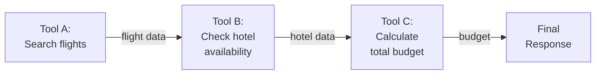
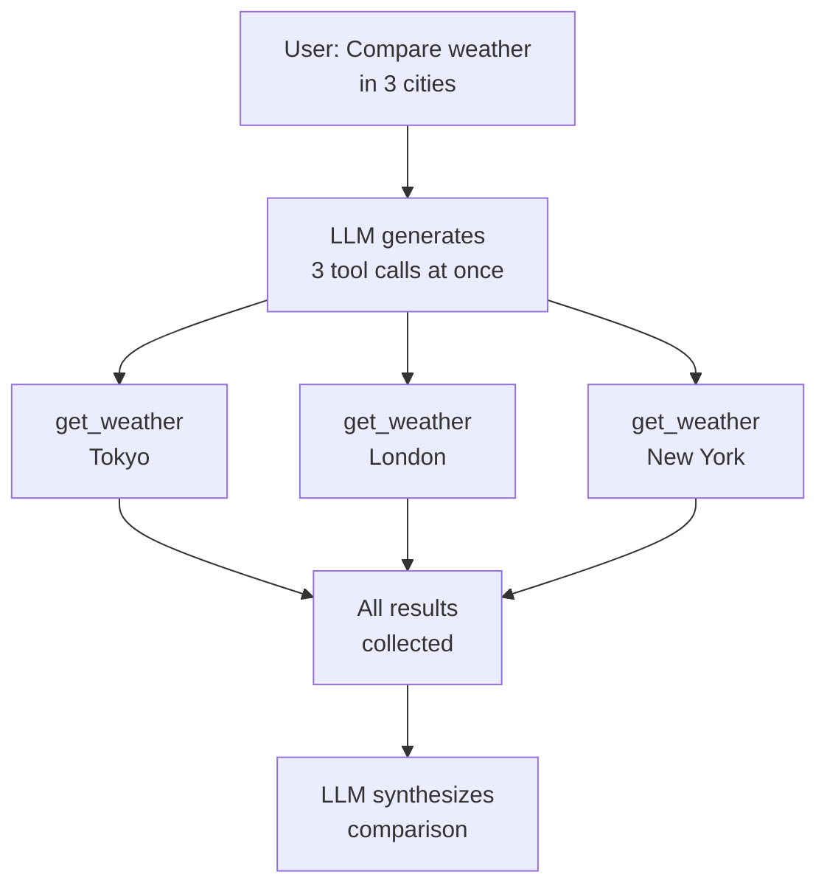
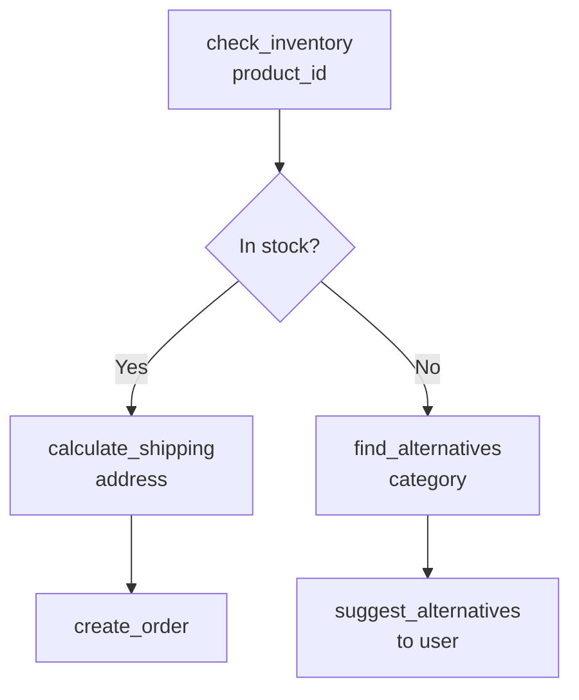

# Multi-tool coordination

## Introduction

Real-world agent tasks rarely require just one tool. When a user asks "Find flights from NYC to Tokyo, compare hotel prices, and create a travel budget," the agent must coordinate three or more tools, passing data between them and sometimes running them in parallel. This is multi-tool coordination — the orchestration of multiple tools within a single agent task.

Multi-tool coordination introduces challenges that single-tool usage doesn't have: tools may need output from previous tools as input, some tools can run simultaneously while others must be sequential, and the agent must maintain a coherent plan across all tool interactions. Mastering these patterns is what separates a simple chatbot from a capable AI assistant.

### What we'll cover

- Sequential tool chaining — passing output from one tool to the next
- Parallel tool execution — calling multiple tools simultaneously
- Data flow patterns between tools
- Orchestrating complex multi-step workflows
- Agents as tools for hierarchical coordination

### Prerequisites

- [Result Interpretation](./03-result-interpretation.md) — understanding tool outputs
- [Tool Invocation in Agent Loops](./02-tool-invocation-in-agent-loops.md) — the basic invocation cycle
- Understanding of async Python patterns (Unit 2, Lesson 9)

---

## Sequential tool chaining

The simplest multi-tool pattern is sequential chaining: tool B needs output from tool A, and tool C needs output from tool B. The LLM naturally handles this by calling tools one at a time and using previous results to construct the next call.



### How the LLM chains tools

```python
from agents import Agent, Runner, function_tool
import json

@function_tool
def search_flights(origin: str, destination: str) -> str:
    """Search for available flights between two cities.

    Args:
        origin: Departure city code (e.g., 'NYC').
        destination: Arrival city code (e.g., 'TYO').
    """
    flights = [
        {"airline": "ANA", "price": 1200, "duration": "14h", "flight": "NH109"},
        {"airline": "JAL", "price": 1350, "duration": "13h30m", "flight": "JL005"},
    ]
    return json.dumps({"status": "success", "flights": flights})

@function_tool
def search_hotels(city: str, checkin: str, checkout: str) -> str:
    """Search for available hotels in a city.

    Args:
        city: City to search hotels in.
        checkin: Check-in date (YYYY-MM-DD).
        checkout: Check-out date (YYYY-MM-DD).
    """
    hotels = [
        {"name": "Park Hyatt Tokyo", "price_per_night": 450, "rating": 4.9},
        {"name": "Shinjuku Granbell", "price_per_night": 120, "rating": 4.3},
    ]
    return json.dumps({"status": "success", "hotels": hotels})

@function_tool
def calculate_budget(items: str) -> str:
    """Calculate total budget from a list of cost items.

    Args:
        items: JSON string of items with 'name' and 'cost' fields.
    """
    parsed = json.loads(items)
    total = sum(item["cost"] for item in parsed)
    return json.dumps({
        "status": "success",
        "items": parsed,
        "total": total,
        "formatted": f"${total:,.2f}"
    })

agent = Agent(
    name="Travel Planner",
    instructions="""You help plan trips. When asked to plan a trip:
    1. First search for flights
    2. Then search for hotels at the destination
    3. Finally, calculate the total budget using the cheapest options
    Always show the user the full breakdown.""",
    tools=[search_flights, search_hotels, calculate_budget],
)

# The agent will chain: search_flights → search_hotels → calculate_budget
result = await Runner.run(agent, "Plan a trip from NYC to Tokyo, Dec 1-7")
print(result.final_output)
```

**Output:**
```
Here's your NYC to Tokyo trip plan (Dec 1-7):

✈️ Flight: ANA NH109 — $1,200 (14h)
🏨 Hotel: Shinjuku Granbell — $120/night × 6 nights = $720

💰 Total Budget: $1,920.00

Would you like me to look at premium options or find activities?
```

> **🔑 Key concept:** The LLM decides the chaining order based on data dependencies. It calls `search_flights` first because it needs flight prices before budgeting, and `search_hotels` next because hotel costs also feed into the budget. You guide this through agent instructions, but the LLM handles the actual sequencing.

---

## Parallel tool execution

When tools don't depend on each other's output, they can run simultaneously. Most LLMs can generate multiple tool calls in a single response, and frameworks execute them in parallel.

### How parallel calls work



### Anthropic: parallel tool calls

```python
import anthropic
import json

client = anthropic.Anthropic()

tools = [
    {
        "name": "get_weather",
        "description": "Get current weather for a city.",
        "input_schema": {
            "type": "object",
            "properties": {
                "city": {"type": "string", "description": "City name"}
            },
            "required": ["city"]
        }
    }
]

def get_weather_data(city: str) -> str:
    weather = {
        "Tokyo": "Sunny, 24°C",
        "London": "Rainy, 12°C",
        "New York": "Cloudy, 18°C",
    }
    return weather.get(city, "Unknown")

response = client.messages.create(
    model="claude-sonnet-4-20250514",
    max_tokens=1024,
    tools=tools,
    messages=[{"role": "user", "content": "Compare the weather in Tokyo, London, and New York"}],
)

# Claude returns MULTIPLE tool_use blocks in one response
tool_blocks = [b for b in response.content if b.type == "tool_use"]
print(f"Parallel tool calls: {len(tool_blocks)}")
for block in tool_blocks:
    print(f"  {block.name}({block.input})")
```

**Output:**
```
Parallel tool calls: 3
  get_weather({"city": "Tokyo"})
  get_weather({"city": "London"})
  get_weather({"city": "New York"})
```

### Processing parallel results

```python
# Execute all tool calls and collect results
tool_results = []
for block in tool_blocks:
    result = get_weather_data(block.input["city"])
    tool_results.append({
        "type": "tool_result",
        "tool_use_id": block.id,
        "content": result,
    })

# Send ALL results back in one message
messages = [
    {"role": "user", "content": "Compare the weather in Tokyo, London, and New York"},
    {"role": "assistant", "content": response.content},
    {"role": "user", "content": tool_results},
]

final = client.messages.create(
    model="claude-sonnet-4-20250514",
    max_tokens=1024,
    tools=tools,
    messages=messages,
)
print(final.content[0].text)
```

**Output:**
```
Here's the weather comparison:
| City | Weather | Temperature |
|------|---------|-------------|
| Tokyo | ☀️ Sunny | 24°C |
| London | 🌧️ Rainy | 12°C |
| New York | ☁️ Cloudy | 18°C |

Tokyo is the warmest at 24°C, while London is the coolest at 12°C.
```

### LangGraph: parallel execution in tool node

LangGraph's `tool_node` function naturally handles parallel calls by iterating all `tool_calls` from the LLM's response:

```python
def tool_node(state: MessagesState):
    """Execute ALL tool calls from the LLM — runs in parallel by default."""
    outputs = []
    for tool_call in state["messages"][-1].tool_calls:
        # Each tool call is executed
        tool_result = tools_by_name[tool_call["name"]].invoke(tool_call["args"])
        outputs.append(
            ToolMessage(
                content=tool_result,
                name=tool_call["name"],
                tool_call_id=tool_call["id"],
            )
        )
    return {"messages": outputs}
```

> **💡 Tip:** For truly concurrent execution (e.g., when tools make network calls), use `asyncio.gather()` inside the tool node:

```python
import asyncio

async def async_tool_node(state: MessagesState):
    """Execute all tool calls concurrently."""
    async def run_tool(tool_call):
        result = await tools_by_name[tool_call["name"]].ainvoke(tool_call["args"])
        return ToolMessage(
            content=result,
            name=tool_call["name"],
            tool_call_id=tool_call["id"],
        )

    tasks = [run_tool(tc) for tc in state["messages"][-1].tool_calls]
    outputs = await asyncio.gather(*tasks)
    return {"messages": list(outputs)}
```

---

## Data flow patterns

Understanding how data moves between tools is critical for designing effective multi-tool agents.

### Pattern 1: pipeline (A → B → C)

Each tool's output feeds directly into the next tool's input.

```python
# The LLM extracts relevant data from each result
# and passes it as arguments to the next tool

# Step 1: search_flights("NYC", "TYO") → flight_data
# Step 2: search_hotels("Tokyo", ...) → hotel_data  
# Step 3: calculate_budget([flight_cost, hotel_cost]) → total
```

### Pattern 2: fan-out / fan-in

Multiple tools run in parallel, then results are combined.

```python
# Fan-out: 3 parallel calls
# get_weather("Tokyo") → weather_1
# get_weather("London") → weather_2
# get_weather("NYC") → weather_3

# Fan-in: LLM combines all results into comparison
```

### Pattern 3: conditional branching

Tool selection depends on the result of a previous tool.



```python
agent = Agent(
    name="Order Agent",
    instructions="""When processing an order:
    1. First check inventory for the requested product
    2. If in stock: calculate shipping, then create the order
    3. If out of stock: find alternative products and suggest them
    Never create an order for out-of-stock items.""",
    tools=[check_inventory, calculate_shipping, create_order, find_alternatives],
)
```

### Pattern 4: iterative refinement

The same tool is called multiple times with adjusted parameters.

```python
agent = Agent(
    name="Search Refiner",
    instructions="""When searching for information:
    1. Start with a broad search
    2. If results are too general, refine with more specific terms
    3. If results are empty, broaden the search
    4. Stop after finding 3+ relevant results or 3 search attempts""",
    tools=[search_knowledge_base],
)
```

### Pattern comparison

| Pattern | When to use | Example |
|---------|-------------|---------|
| **Pipeline** | Each step needs the previous step's data | Flight → Hotel → Budget |
| **Fan-out/Fan-in** | Independent data collection | Weather in 3 cities |
| **Conditional** | Next step depends on a result | In stock? → Ship or Suggest |
| **Iterative** | Refining a search or analysis | Broad → Narrow → Done |

---

## Agents as tools for hierarchical coordination

For complex multi-tool workflows, the OpenAI Agents SDK lets you use entire agents as tools. This creates a hierarchical coordination pattern where a manager agent delegates to specialist agents:

```python
from agents import Agent

# Specialist agents with focused toolsets
flight_agent = Agent(
    name="Flight Specialist",
    instructions="You find the best flights. Compare prices and duration.",
    tools=[search_flights, compare_airlines, check_seat_availability],
)

hotel_agent = Agent(
    name="Hotel Specialist",
    instructions="You find the best hotels. Consider location, price, and ratings.",
    tools=[search_hotels, check_reviews, verify_availability],
)

budget_agent = Agent(
    name="Budget Analyst",
    instructions="You create detailed travel budgets with breakdowns.",
    tools=[calculate_budget, convert_currency, estimate_meals],
)

# Manager agent coordinates specialists
travel_planner = Agent(
    name="Travel Planner",
    instructions="""You coordinate travel planning by delegating to specialists.
    1. Use the flight specialist to find flights
    2. Use the hotel specialist to find accommodation
    3. Use the budget analyst to create a complete budget
    Present a unified travel plan to the user.""",
    tools=[
        flight_agent.as_tool(
            tool_name="find_flights",
            tool_description="Find and compare flights between cities.",
        ),
        hotel_agent.as_tool(
            tool_name="find_hotels",
            tool_description="Find and compare hotels in a destination city.",
        ),
        budget_agent.as_tool(
            tool_name="create_budget",
            tool_description="Create a detailed travel budget breakdown.",
        ),
    ],
)
```

### When to use agents as tools vs direct tools

| Approach | Use when | Example |
|----------|----------|---------|
| **Direct tools** | Simple, single-step operations | `get_weather()`, `calculate()` |
| **Agents as tools** | Complex sub-tasks requiring multiple tool calls and reasoning | "Research and compare flight options" |
| **Handoffs** | User-facing delegation where the conversation continues with the new agent | "Transfer to billing support" |

> **🤖 AI Context:** The agents-as-tools pattern is particularly powerful for RAG pipelines. A "research agent" with retrieval and summarization tools can be used as a single tool by a coordinator agent, keeping the coordination logic clean and the research logic encapsulated.

---

## LangGraph: orchestrator-worker pattern

LangGraph implements hierarchical coordination with the `Send()` API for dynamic worker creation:

```python
from langgraph.graph import StateGraph, START, END
from langgraph.types import Send
from typing import Annotated
from operator import add

class OrchestratorState(TypedDict):
    query: str
    tasks: list[str]
    results: Annotated[list[str], add]  # Results accumulate

class WorkerState(TypedDict):
    task: str
    result: str

def orchestrator(state: OrchestratorState):
    """Break the query into sub-tasks."""
    # In production, use an LLM to decompose the query
    tasks = [
        "Research flights NYC to Tokyo",
        "Research hotels in Tokyo",
        "Research activities in Tokyo",
    ]
    return {"tasks": tasks}

def assign_workers(state: OrchestratorState):
    """Dynamically create a worker for each task."""
    return [Send("worker", {"task": t}) for t in state["tasks"]]

def worker(state: WorkerState):
    """Process a single sub-task."""
    # Each worker runs independently
    result = f"Completed: {state['task']}"
    return {"result": result}

def synthesize(state: OrchestratorState):
    """Combine all worker results."""
    combined = "\n".join(state["results"])
    return {"results": [f"=== Travel Plan ===\n{combined}"]}

graph = StateGraph(OrchestratorState)
graph.add_node("orchestrator", orchestrator)
graph.add_node("worker", worker)
graph.add_node("synthesize", synthesize)

graph.add_edge(START, "orchestrator")
graph.add_conditional_edges("orchestrator", assign_workers, ["worker"])
graph.add_edge("worker", "synthesize")
graph.add_edge("synthesize", END)

app = graph.compile()
```

---

## Best practices

| Practice | Why it matters |
|----------|----------------|
| Let the LLM decide tool order via instructions, not hard-coded sequences | Agents handle novel combinations better when they reason about ordering |
| Use structured output from tools to enable clean data passing | The LLM needs parseable output to extract values for the next tool |
| Limit parallel tools to 5 per batch | More than 5 parallel calls increases error rates and complicates debugging |
| Use agents as tools for sub-tasks requiring 3+ tool calls | Encapsulates complex logic and keeps the coordinator agent simple |
| Document data dependencies in tool descriptions | "Requires output from search_flights" helps the LLM sequence correctly |

---

## Common pitfalls

| ❌ Mistake | ✅ Solution |
|-----------|-------------|
| Hard-coding tool call order in application code | Use agent instructions to guide ordering; let the LLM reason about dependencies |
| Assuming tools always run in parallel | Some queries need sequential data — trust the LLM to identify dependencies |
| Passing entire tool outputs as input to next tool | Return only relevant fields; use structured JSON with specific keys |
| No timeout on parallel tool execution | Set per-tool timeouts and handle partial results gracefully |
| Using handoffs when agents-as-tools would work | Handoffs transfer the conversation; use `as_tool()` when the coordinator should synthesize results |

---

## Hands-on exercise

### Your task

Build a multi-tool agent that coordinates three tools to process a research request, using both sequential and parallel patterns.

### Requirements

1. Create three tools:
   - `search_papers` — search for research papers by topic
   - `get_citations` — get citation count for a paper
   - `summarize_findings` — create a summary from multiple paper results
2. Process the query: "Find papers about transformer architectures"
3. Implement the flow:
   - First: `search_papers` (returns 3 papers)
   - Then: `get_citations` for each paper (parallel — 3 calls)
   - Finally: `summarize_findings` with all data (sequential)
4. Show the execution trace with timing

### Expected result

A trace showing search → 3 parallel citation lookups → summary.

<details>
<summary>💡 Hints (click to expand)</summary>

- Use `asyncio.gather()` for the parallel citation lookups
- Track timing with `time.time()` to show parallel vs sequential difference
- Pass paper IDs from the search result to the citation tool
- The summarize tool should receive both paper data and citation counts

</details>

<details>
<summary>✅ Solution (click to expand)</summary>

```python
import asyncio
import json
import time

# Simulated tools
async def search_papers(topic: str) -> str:
    await asyncio.sleep(0.5)  # Simulate API latency
    papers = [
        {"id": "P001", "title": "Attention Is All You Need", "year": 2017},
        {"id": "P002", "title": "BERT: Pre-training of Deep Bidirectional Transformers", "year": 2018},
        {"id": "P003", "title": "GPT-3: Language Models are Few-Shot Learners", "year": 2020},
    ]
    return json.dumps({"status": "success", "papers": papers})

async def get_citations(paper_id: str) -> str:
    await asyncio.sleep(0.8)  # Simulate API latency
    citations = {"P001": 120000, "P002": 95000, "P003": 45000}
    count = citations.get(paper_id, 0)
    return json.dumps({"paper_id": paper_id, "citations": count})

async def summarize_findings(data: str) -> str:
    await asyncio.sleep(0.3)
    parsed = json.loads(data)
    total_citations = sum(p["citations"] for p in parsed)
    return json.dumps({
        "summary": f"Found {len(parsed)} papers with {total_citations:,} total citations",
        "top_paper": max(parsed, key=lambda p: p["citations"])["title"],
    })

async def run_research(topic: str):
    print(f"🔍 Researching: {topic}\n")

    # Step 1: Sequential — search for papers
    t0 = time.time()
    print("Step 1: Searching papers...")
    search_result = await search_papers(topic)
    papers = json.loads(search_result)["papers"]
    print(f"  Found {len(papers)} papers ({time.time() - t0:.1f}s)\n")

    # Step 2: Parallel — get citations for all papers
    t1 = time.time()
    print("Step 2: Getting citations (parallel)...")
    citation_tasks = [get_citations(p["id"]) for p in papers]
    citation_results = await asyncio.gather(*citation_tasks)
    citations = [json.loads(r) for r in citation_results]
    print(f"  Got {len(citations)} citation counts ({time.time() - t1:.1f}s)\n")

    # Merge data
    enriched = []
    for paper, citation in zip(papers, citations):
        enriched.append({**paper, "citations": citation["citations"]})

    # Step 3: Sequential — summarize
    t2 = time.time()
    print("Step 3: Summarizing findings...")
    summary_result = await summarize_findings(json.dumps(enriched))
    summary = json.loads(summary_result)
    print(f"  {summary['summary']} ({time.time() - t2:.1f}s)\n")

    print(f"📊 Top paper: {summary['top_paper']}")
    print(f"⏱️  Total time: {time.time() - t0:.1f}s")
    print(f"   (Sequential would be: ~{0.5 + 0.8*3 + 0.3:.1f}s)")

asyncio.run(run_research("transformer architectures"))
```

**Expected output:**
```
🔍 Researching: transformer architectures

Step 1: Searching papers...
  Found 3 papers (0.5s)

Step 2: Getting citations (parallel)...
  Got 3 citation counts (0.8s)

Step 3: Summarizing findings...
  Found 3 papers with 260,000 total citations (0.3s)

📊 Top paper: Attention Is All You Need
⏱️  Total time: 1.6s
   (Sequential would be: ~3.2s)
```

</details>

### Bonus challenges

- [ ] Add error handling — what if one citation lookup fails? Complete the others anyway
- [ ] Implement a "research depth" parameter: shallow (top 3), medium (top 10), deep (top 25)
- [ ] Add a fourth tool `find_related_papers` that chains off the citation results

---

## Summary

✅ **Sequential chaining** passes data from one tool to the next — the LLM naturally handles data dependencies through conversation context

✅ **Parallel execution** runs independent tools simultaneously — LLMs can generate multiple tool calls in one response, saving significant time

✅ **Data flow patterns** (pipeline, fan-out/fan-in, conditional, iterative) cover the main coordination strategies agents use

✅ **Agents as tools** create hierarchical coordination — a manager agent delegates complex sub-tasks to specialist agents with their own toolsets

✅ **LangGraph's `Send()` API** enables dynamic worker creation for orchestrator-worker patterns with parallel sub-task processing

**Next:** [Tool Error Handling](./05-tool-error-handling.md)

---

## Further reading

- [OpenAI Agents SDK: Agents as Tools](https://openai.github.io/openai-agents-python/tools/#agents-as-tools) — Hierarchical coordination patterns
- [LangGraph: Orchestrator-Worker](https://langchain-ai.github.io/langgraph/concepts/agentic_concepts/#orchestrator-worker) — Dynamic worker creation with Send()
- [Anthropic: Parallel Tool Use](https://docs.anthropic.com/en/docs/build-with-claude/tool-use/overview) — Multiple tool calls in one response
- [AsyncIO: gather()](https://docs.python.org/3/library/asyncio-task.html#asyncio.gather) — Concurrent execution in Python

*[Back to Tool Integration Overview](./00-tool-integration.md)*

<!--
Sources Consulted:
- OpenAI Agents SDK Tools: https://openai.github.io/openai-agents-python/tools/
- LangGraph Workflows: https://langchain-ai.github.io/langgraph/concepts/agentic_concepts/
- Anthropic Tool Use: https://docs.anthropic.com/en/docs/build-with-claude/tool-use/overview
-->
