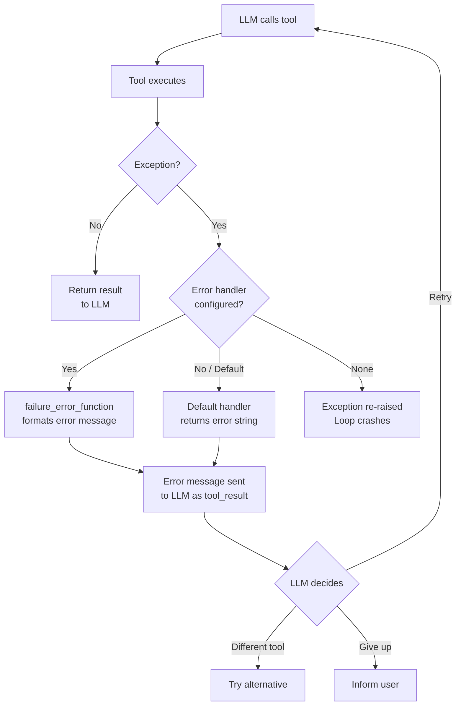
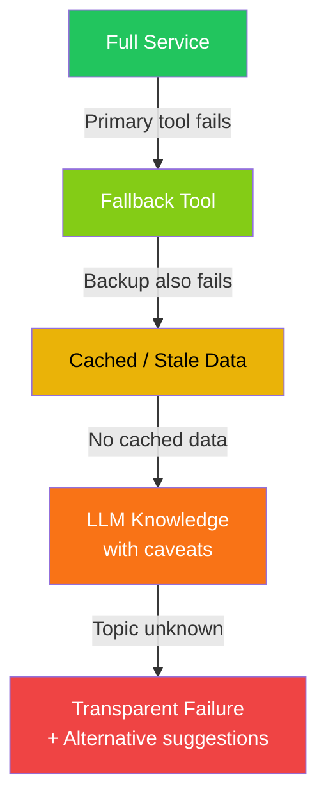

# Tool error handling

## Introduction

Tools fail. APIs time out, databases go down, inputs are malformed, and rate limits get hit. An agent that can't handle tool errors is an agent that breaks in production. Tool error handling is the difference between an agent that tells the user "Something went wrong" and one that retries intelligently, falls back to alternatives, and degrades gracefully.

Error handling in agent systems is more nuanced than traditional programming. When a tool fails, the LLM itself becomes part of the recovery strategy — it can re-interpret the error, adjust parameters, try alternative tools, or inform the user with context. This lesson covers the patterns and framework features that make agents resilient.

### What we'll cover

- How tool errors propagate through the agent loop
- The `failure_error_function` pattern in OpenAI Agents SDK
- Retry strategies with parameter adjustment
- Fallback tools and graceful degradation
- Framework-specific error handling approaches

### Prerequisites

- [Multi-Tool Coordination](./04-multi-tool-coordination.md) — working with multiple tools
- [Result Interpretation](./03-result-interpretation.md) — parsing tool output
- Understanding of Python exception handling (`try`/`except`)

---

## How tool errors propagate

When a tool raises an exception, what happens depends on the framework. In most cases, the error message is converted to a tool result and sent back to the LLM, which then decides how to handle it.



### Default behavior across frameworks

| Framework | Default on tool error | Error visible to LLM? |
|-----------|----------------------|----------------------|
| OpenAI Agents SDK | `failure_error_function` returns error string | ✅ Yes |
| LangGraph | Exception propagates unless caught in tool node | ❌ Crashes unless handled |
| Anthropic API | You must catch errors manually | Depends on your code |

---

## OpenAI Agents SDK: `failure_error_function`

The OpenAI SDK provides a built-in error handling mechanism through `failure_error_function`. When a `@function_tool` raises an exception, this function formats the error before sending it to the LLM.

### Default error handling

By default, the SDK catches tool exceptions and sends a generic error message to the LLM:

```python
from agents import Agent, function_tool, Runner

@function_tool
def divide(a: float, b: float) -> str:
    """Divide two numbers.

    Args:
        a: The dividend.
        b: The divisor.
    """
    if b == 0:
        raise ValueError("Cannot divide by zero")
    return str(a / b)

agent = Agent(
    name="Calculator",
    tools=[divide],
)

# When the LLM calls divide(10, 0), the default handler catches the error
# and sends something like "An error occurred while running the tool" to the LLM
result = await Runner.run(agent, "What is 10 divided by 0?")
print(result.final_output)
```

**Output:**
```
I tried to divide 10 by 0, but that's mathematically undefined. Division by zero is not possible. Would you like to try a different calculation?
```

### Custom error handlers

You can provide a custom `failure_error_function` that gives the LLM more actionable error details:

```python
from agents import FunctionTool
import json

async def handle_db_error(ctx, error: Exception) -> str:
    """Custom error handler that gives the LLM actionable guidance."""
    error_type = type(error).__name__
    error_msg = str(error)

    if "timeout" in error_msg.lower():
        return json.dumps({
            "error": "Database query timed out",
            "suggestion": "Simplify the query or add filters to reduce data size",
            "retry_recommended": True,
        })
    elif "permission" in error_msg.lower():
        return json.dumps({
            "error": "Insufficient permissions for this query",
            "suggestion": "Try querying a different table or ask the user for access",
            "retry_recommended": False,
        })
    else:
        return json.dumps({
            "error": f"{error_type}: {error_msg}",
            "suggestion": "Check the query syntax and parameter values",
            "retry_recommended": True,
        })

query_tool = FunctionTool(
    name="query_database",
    description="Run a SQL query against the database.",
    params_json_schema={
        "type": "object",
        "properties": {
            "sql": {"type": "string", "description": "SQL SELECT query"}
        },
        "required": ["sql"]
    },
    on_invoke_tool=run_query,
    failure_error_function=handle_db_error,
)
```

### Disabling error handling

Setting `failure_error_function=None` re-raises exceptions, crashing the agent loop. Use this only in development to catch bugs:

```python
# ⚠️ Development only — exceptions will crash the loop
debug_tool = FunctionTool(
    name="debug_tool",
    description="A tool for debugging.",
    params_json_schema={...},
    on_invoke_tool=run_debug,
    failure_error_function=None,  # Exceptions propagate
)
```

---

## Retry strategies

When a tool fails with a recoverable error, the agent should retry — but intelligently, not blindly.

### Pattern: LLM-driven retry

The simplest retry strategy leverages the LLM itself. When the error message is sent back as a tool result, the LLM can decide to call the tool again with adjusted parameters:

```python
agent = Agent(
    name="Smart Searcher",
    instructions="""When a tool returns an error:
    1. Read the error message carefully
    2. If retry_recommended is true, adjust your parameters and try again
    3. Maximum 2 retries per tool
    4. If the error persists, explain the issue to the user

    Common adjustments:
    - Timeout errors: simplify the query, add LIMIT clause
    - Not found: check spelling, try broader search terms
    - Rate limited: wait and inform the user about the delay""",
    tools=[query_tool, search_tool],
)
```

### Pattern: programmatic retry with backoff

For infrastructure-level retries (network timeouts, rate limits), implement retry logic inside the tool itself:

```python
import asyncio
import json

@function_tool
async def call_api(endpoint: str, params: str) -> str:
    """Call an external API with automatic retry on transient errors.

    Args:
        endpoint: API endpoint path.
        params: JSON string of query parameters.
    """
    max_retries = 3
    base_delay = 1.0  # seconds

    for attempt in range(max_retries):
        try:
            result = await make_api_request(endpoint, json.loads(params))
            return json.dumps({"status": "success", "data": result})

        except RateLimitError:
            if attempt < max_retries - 1:
                delay = base_delay * (2 ** attempt)  # Exponential backoff
                await asyncio.sleep(delay)
                continue
            return json.dumps({
                "status": "error",
                "error": "Rate limited after 3 retries",
                "suggestion": "Try again in a few minutes or use a different endpoint",
            })

        except TimeoutError:
            if attempt < max_retries - 1:
                continue
            return json.dumps({
                "status": "error",
                "error": "Request timed out after 3 attempts",
                "suggestion": "The service may be experiencing high load",
            })

        except Exception as e:
            return json.dumps({
                "status": "error",
                "error": str(e),
                "suggestion": "Unexpected error — check the endpoint and parameters",
            })
```

### Retry strategy comparison

| Strategy | Who retries | Best for | Risk |
|----------|-------------|----------|------|
| **LLM-driven** | The LLM adjusts params and re-calls | Logical errors (bad params, wrong table) | LLM may not adjust meaningfully |
| **Programmatic** | Code inside the tool | Transient errors (network, rate limits) | Hidden retries increase latency |
| **Hybrid** | Code handles transient; LLM handles logical | Production systems | More complex implementation |

---

## Fallback tools

When a primary tool fails permanently, the agent should fall back to an alternative tool that can accomplish a similar goal:

```python
@function_tool
def search_primary_db(query: str) -> str:
    """Search the primary database for records.

    Args:
        query: Search query string.
    """
    try:
        results = primary_db.search(query)
        return json.dumps({"status": "success", "source": "primary", "data": results})
    except ConnectionError:
        return json.dumps({
            "status": "error",
            "error": "Primary database is unavailable",
            "suggestion": "Use search_backup_db instead",
        })

@function_tool
def search_backup_db(query: str) -> str:
    """Search the backup/cached database. Use when primary database is unavailable.

    Args:
        query: Search query string.
    """
    results = backup_db.search(query)
    return json.dumps({
        "status": "success",
        "source": "backup",
        "data": results,
        "note": "Results may be up to 24 hours old"
    })

agent = Agent(
    name="Resilient Searcher",
    instructions="""You search for information.
    - Start with search_primary_db for the freshest data
    - If it fails, use search_backup_db (cached data, may be 24h old)
    - Always tell the user which source provided the data""",
    tools=[search_primary_db, search_backup_db],
)
```

> **🤖 AI Context:** Fallback patterns are critical for production AI agents. A customer-facing agent that goes silent because an API is down creates a terrible experience. Always provide at least one fallback path — even if it's just "I can't access live data right now, but here's what I know from my training."

---

## Graceful degradation

When tools fail and no fallback exists, the agent should degrade gracefully — providing partial results rather than nothing:

```python
agent = Agent(
    name="Travel Assistant",
    instructions="""You help plan trips using available tools.

    Graceful degradation rules:
    - If flight search fails: provide general price ranges from your knowledge
    - If hotel search fails: suggest the user check booking sites directly
    - If both fail: provide a general travel guide based on your knowledge
    - ALWAYS be transparent about what data is live vs. estimated

    Example responses when tools fail:
    ✅ "I couldn't access live flight data, but NYC-Tokyo flights typically range from $800-$1,500"
    ❌ "I can't help with that" (never say this)
    ❌ Silently make up specific prices (never fabricate exact numbers)""",
    tools=[search_flights, search_hotels, get_activities],
)
```

### Degradation levels



| Level | Data quality | User experience |
|-------|-------------|-----------------|
| **Full service** | Live, accurate | "Your flight costs $1,247" |
| **Fallback tool** | Live, alternative source | "Based on our partner site, flights are ~$1,200" |
| **Cached data** | Stale but structured | "As of yesterday, flights were around $1,200" |
| **LLM knowledge** | General, unverified | "NYC-Tokyo flights typically range $800-$1,500" |
| **Transparent failure** | None | "I can't access flight data. Try kayak.com directly" |

---

## LangGraph: error handling in tool nodes

In LangGraph, you must explicitly handle errors in your tool node:

```python
from langchain_core.messages import ToolMessage

def safe_tool_node(state: MessagesState):
    """Execute tools with comprehensive error handling."""
    outputs = []

    for tool_call in state["messages"][-1].tool_calls:
        tool_name = tool_call["name"]
        tool_args = tool_call["args"]
        call_id = tool_call["id"]

        try:
            if tool_name not in tools_by_name:
                raise ValueError(f"Unknown tool: {tool_name}")

            result = tools_by_name[tool_name].invoke(tool_args)
            outputs.append(ToolMessage(
                content=result,
                name=tool_name,
                tool_call_id=call_id,
            ))

        except Exception as e:
            error_response = json.dumps({
                "status": "error",
                "error": f"{type(e).__name__}: {str(e)}",
                "suggestion": "Check the tool name and arguments",
            })
            outputs.append(ToolMessage(
                content=error_response,
                name=tool_name,
                tool_call_id=call_id,
            ))

    return {"messages": outputs}
```

> **Warning:** If you don't catch exceptions in the LangGraph tool node, the entire graph execution fails. Always wrap tool invocations in `try`/`except` blocks within the tool node.

---

## Anthropic: manual error handling

With the Anthropic API, error handling is entirely your responsibility:

```python
import anthropic

def safe_execute_tool(name: str, input_data: dict) -> dict:
    """Execute a tool with error handling, returning a tool_result block."""
    try:
        result = execute_tool(name, input_data)
        return {
            "type": "tool_result",
            "tool_use_id": input_data.get("_tool_use_id"),
            "content": result,
        }
    except Exception as e:
        return {
            "type": "tool_result",
            "tool_use_id": input_data.get("_tool_use_id"),
            "content": json.dumps({
                "error": str(e),
                "suggestion": "Try different parameters",
            }),
            "is_error": True,  # Signals to Claude that the tool failed
        }
```

> **💡 Tip:** Anthropic's API supports an `is_error` field in tool results. When set to `True`, Claude knows the tool failed and adjusts its behavior accordingly — it's more likely to retry or explain the issue rather than treating the error message as valid data.

---

## Best practices

| Practice | Why it matters |
|----------|----------------|
| Catch all exceptions inside tools and return structured errors | Prevents the agent loop from crashing on any tool failure |
| Include `suggestion` and `retry_recommended` in error returns | Gives the LLM actionable guidance for recovery |
| Implement exponential backoff for transient errors | Prevents overwhelming failing services and respects rate limits |
| Define fallback tools for critical functionality | Ensures the agent can always provide some value to the user |
| Be transparent about data quality when degraded | Users trust agents that are honest about limitations |

---

## Common pitfalls

| ❌ Mistake | ✅ Solution |
|-----------|-------------|
| Letting exceptions crash the agent loop | Always catch exceptions and return error messages as tool results |
| Retrying infinitely on persistent errors | Cap retries at 2-3 with exponential backoff, then fail gracefully |
| Generic error messages: "Tool failed" | Include the error type, message, and specific suggestions |
| Returning error text that looks like valid data | Use `{"status": "error", ...}` format and Anthropic's `is_error: true` |
| No fallback for critical tools (payments, auth) | Always have a fallback path, even if it's "contact support at..." |

---

## Hands-on exercise

### Your task

Build a resilient tool system with error handling, retries, fallbacks, and graceful degradation.

### Requirements

1. Create a primary tool `fetch_stock_price` that simulates random failures (50% chance)
2. Create a fallback tool `fetch_cached_price` that always works but returns stale data
3. Build an `execute_with_resilience()` function that:
   - Tries the primary tool up to 3 times with exponential backoff
   - Falls back to the cached tool on persistent failure
   - Returns structured results indicating data freshness
4. Test with 5 different stock tickers

### Expected result

Output showing a mix of fresh data (from primary) and stale data (from fallback).

<details>
<summary>💡 Hints (click to expand)</summary>

- Use `random.random() < 0.5` to simulate 50% failure rate
- Track the attempt number and delay between retries
- Tag results with `"source": "live"` or `"source": "cached"`
- Show the total time taken for each ticker

</details>

<details>
<summary>✅ Solution (click to expand)</summary>

```python
import asyncio
import json
import random
import time

random.seed(42)  # For reproducible output

class StockAPIError(Exception):
    pass

async def fetch_stock_price(ticker: str) -> dict:
    """Primary stock API — 50% failure rate for demonstration."""
    await asyncio.sleep(0.2)
    if random.random() < 0.5:
        raise StockAPIError(f"API timeout for {ticker}")
    prices = {"AAPL": 189.50, "GOOGL": 141.80, "MSFT": 378.90, "AMZN": 178.25, "TSLA": 248.50}
    return {"ticker": ticker, "price": prices.get(ticker, 100.00), "source": "live"}

async def fetch_cached_price(ticker: str) -> dict:
    """Backup cached data — always available, 24h old."""
    await asyncio.sleep(0.05)
    prices = {"AAPL": 188.00, "GOOGL": 140.50, "MSFT": 377.20, "AMZN": 177.00, "TSLA": 245.00}
    return {"ticker": ticker, "price": prices.get(ticker, 99.00), "source": "cached", "age": "24h old"}

async def execute_with_resilience(ticker: str, max_retries: int = 3) -> dict:
    """Try primary with retries, fall back to cache on failure."""
    base_delay = 0.1

    for attempt in range(max_retries):
        try:
            result = await fetch_stock_price(ticker)
            return {**result, "attempts": attempt + 1, "status": "success"}
        except StockAPIError as e:
            if attempt < max_retries - 1:
                delay = base_delay * (2 ** attempt)
                await asyncio.sleep(delay)

    # All retries exhausted — fall back to cache
    result = await fetch_cached_price(ticker)
    return {
        **result,
        "attempts": max_retries,
        "status": "degraded",
        "note": f"Live data unavailable after {max_retries} attempts. Using cached data.",
    }

async def main():
    tickers = ["AAPL", "GOOGL", "MSFT", "AMZN", "TSLA"]
    print("📈 Fetching stock prices with resilient error handling\n")

    for ticker in tickers:
        t0 = time.time()
        result = execute_with_resilience(ticker)
        data = await result
        elapsed = time.time() - t0

        source_icon = "🟢" if data["source"] == "live" else "🟡"
        age_info = f" ({data.get('age', 'real-time')})" if "age" in data else ""
        print(f"  {source_icon} {data['ticker']}: ${data['price']:.2f}{age_info}")
        print(f"     Attempts: {data['attempts']} | Time: {elapsed:.2f}s | Status: {data['status']}")
        if "note" in data:
            print(f"     ⚠️  {data['note']}")
        print()

asyncio.run(main())
```

**Expected output:**
```
📈 Fetching stock prices with resilient error handling

  🟢 AAPL: $189.50
     Attempts: 2 | Time: 0.32s | Status: success

  🟡 GOOGL: $140.50 (24h old)
     Attempts: 3 | Time: 0.95s | Status: degraded
     ⚠️  Live data unavailable after 3 attempts. Using cached data.

  🟢 MSFT: $378.90
     Attempts: 1 | Time: 0.20s | Status: success

  🟡 AMZN: $177.00 (24h old)
     Attempts: 3 | Time: 0.95s | Status: degraded
     ⚠️  Live data unavailable after 3 attempts. Using cached data.

  🟢 TSLA: $248.50
     Attempts: 1 | Time: 0.20s | Status: success
```

</details>

### Bonus challenges

- [ ] Add a circuit breaker that skips the primary tool after 3 consecutive failures
- [ ] Implement health checking — periodically test the primary tool in the background
- [ ] Add metrics tracking: success rate, average latency, fallback percentage

---

## Summary

✅ **Tool errors should be caught** and returned as structured messages — never let exceptions crash the agent loop

✅ **`failure_error_function`** in the OpenAI SDK provides a clean hook for custom error formatting, giving the LLM actionable recovery guidance

✅ **Retry strategies** combine programmatic retries (transient errors) with LLM-driven retries (logical errors) for comprehensive recovery

✅ **Fallback tools** ensure the agent can always provide value — even if the primary data source is unavailable

✅ **Graceful degradation** through multiple levels (live → fallback → cached → LLM knowledge → transparent failure) maintains user trust

**Next:** [Dynamic Tool Loading](./06-dynamic-tool-loading.md)

---

## Further reading

- [OpenAI Agents SDK: Error Handling](https://openai.github.io/openai-agents-python/tools/#error-handling) — failure_error_function and tool errors
- [Anthropic: Tool Use Errors](https://docs.anthropic.com/en/docs/build-with-claude/tool-use/overview) — is_error field in tool results
- [Python: Exception Handling](https://docs.python.org/3/tutorial/errors.html) — try/except patterns
- [Resilience Patterns](https://learn.microsoft.com/en-us/azure/architecture/patterns/retry) — Retry and circuit breaker patterns

*[Back to Tool Integration Overview](./00-tool-integration.md)*

<!--
Sources Consulted:
- OpenAI Agents SDK Tools: https://openai.github.io/openai-agents-python/tools/
- Anthropic Tool Use: https://docs.anthropic.com/en/docs/build-with-claude/tool-use/overview
- Microsoft Resilience Patterns: https://learn.microsoft.com/en-us/azure/architecture/patterns/retry
-->
