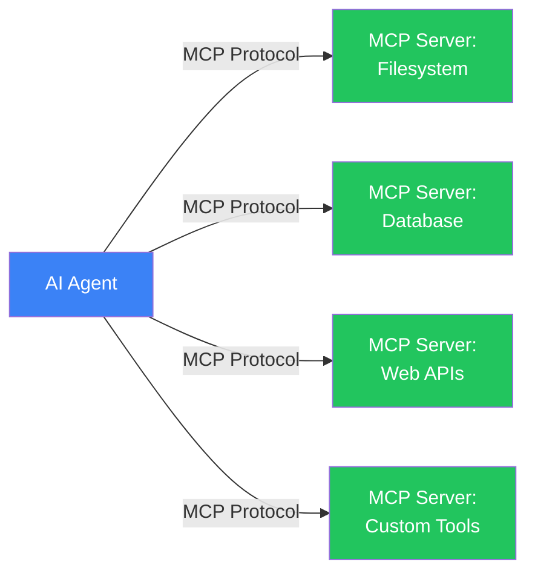
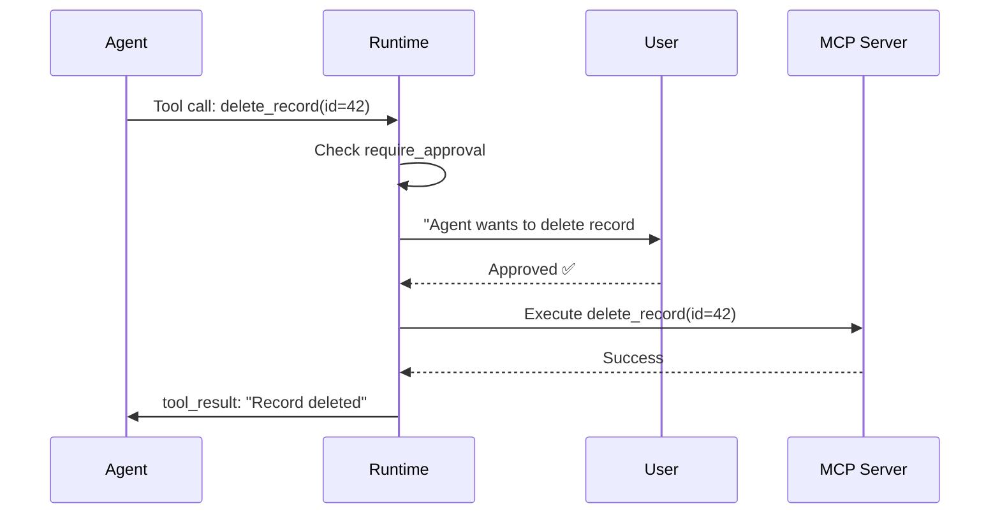

# Dynamic tool loading

## Introduction

Static tool sets — tools defined at agent creation time — work for simple agents, but production systems need more flexibility. An agent helping users interact with their connected services can't hardcode every possible tool. It needs to discover and load tools at runtime from external sources.

The **Model Context Protocol (MCP)** solves this problem by providing a universal standard for connecting AI agents to external tool providers. Instead of building custom integrations for every service, agents connect to MCP servers that expose tools, resources, and prompts through a consistent protocol. This is the difference between building a tool for each API and plugging into a universal adapter.

### What we'll cover

- MCP architecture and the client-server model
- Transport options: hosted, HTTP, SSE, and stdio
- Managing multiple MCP servers with `MCPServerManager`
- Tool filtering, caching, and approval flows
- Building a runtime-extensible agent

### Prerequisites

- [Tool Error Handling](./05-tool-error-handling.md) — handling tool failures
- [Tool Discovery and Selection](./01-tool-discovery-and-selection.md) — tool schemas
- Understanding of client-server architecture and HTTP protocols

---

## The Model Context Protocol (MCP)

MCP is an open standard created by Anthropic that defines how AI agents communicate with external tool providers. Think of it like USB for AI tools — a universal connector that lets any agent talk to any tool server.



### What MCP provides

| Capability | Description |
|-----------|-------------|
| **Tools** | Functions the agent can call (like `read_file`, `query_db`) |
| **Resources** | Data the agent can read (like file contents, database schemas) |
| **Prompts** | Pre-built prompt templates the server offers |
| **Sampling** | Server can request LLM completions from the client |

### Why MCP matters for agents

Without MCP, connecting an agent to a new service requires:
1. Reading the service's API documentation
2. Writing custom tool functions
3. Handling authentication, errors, and edge cases
4. Maintaining the integration as APIs change

With MCP, you just connect to the service's MCP server:

```python
from agents import Agent
from agents.mcp import MCPServerStdio

# Connect to a filesystem MCP server — instant access to file tools
server = MCPServerStdio(
    params={
        "command": "npx",
        "args": ["-y", "@modelcontextprotocol/server-filesystem", "/data"]
    }
)

agent = Agent(
    name="File Assistant",
    instructions="You help users manage files.",
    mcp_servers=[server],  # Tools are discovered automatically!
)
```

> **🔑 Key concept:** The agent doesn't need to know what tools the MCP server provides in advance. It discovers them at runtime through the protocol. If the server adds new tools, the agent gets them automatically.

---

## Transport options

MCP supports multiple transport protocols, each suited to different deployment scenarios.

### 1. Hosted MCP (cloud-managed)

OpenAI hosts MCP tool servers that you can use without running any infrastructure:

```python
from agents import Agent
from agents.mcp import MCPServerStdio

# HostedMCPTool — runs on OpenAI's infrastructure
agent = Agent(
    name="Research Agent",
    instructions="You help with research tasks.",
    tools=[
        # These are OpenAI-hosted MCP tools
        # Available as built-in hosted tools
    ],
    mcp_servers=[
        # Or connect to custom hosted MCP servers
    ],
)
```

### 2. Streamable HTTP (recommended for remote servers)

For remote MCP servers accessible over the network:

```python
from agents.mcp import MCPServerStreamableHttp

server = MCPServerStreamableHttp(
    params={
        "url": "https://mcp.example.com/api",
        "headers": {
            "Authorization": "Bearer your-api-key",
        },
        "timeout": 30,
    },
    cache_tools_list=True,  # Cache tool schemas for performance
    max_retry_attempts=3,   # Retry failed connections
)

agent = Agent(
    name="Remote Tools Agent",
    mcp_servers=[server],
)
```

### 3. Server-Sent Events (SSE) — deprecated

```python
from agents.mcp import MCPServerSse

# ⚠️ SSE transport is deprecated — use Streamable HTTP instead
server = MCPServerSse(
    params={
        "url": "https://mcp.example.com/sse",
        "headers": {"Authorization": "Bearer key"},
    }
)
```

> **Warning:** SSE transport is deprecated in favor of Streamable HTTP. Use `MCPServerStreamableHttp` for all new remote connections.

### 4. Stdio (local subprocess)

For MCP servers running as local processes:

```python
from agents.mcp import MCPServerStdio

# Run a local MCP server as a subprocess
filesystem_server = MCPServerStdio(
    params={
        "command": "npx",
        "args": ["-y", "@modelcontextprotocol/server-filesystem", "/home/user/documents"],
    }
)

# Python-based MCP server
custom_server = MCPServerStdio(
    params={
        "command": "python",
        "args": ["-m", "my_mcp_server"],
        "env": {"DATABASE_URL": "postgresql://localhost/mydb"},
    }
)
```

### Transport comparison

| Transport | Use case | Latency | Setup |
|-----------|----------|---------|-------|
| **Hosted** | Cloud-managed, no infra | Low | None |
| **Streamable HTTP** | Remote servers | Medium | URL + auth |
| **SSE** | ⚠️ Deprecated | Medium | URL + auth |
| **Stdio** | Local development, CLI tools | Very low | Command + args |

---

## Managing multiple MCP servers

Production agents often connect to multiple MCP servers simultaneously. The `MCPServerManager` handles lifecycle management:

```python
from agents.mcp import MCPServerStdio, MCPServerStreamableHttp

# Define multiple servers
servers = [
    MCPServerStdio(
        params={
            "command": "npx",
            "args": ["-y", "@modelcontextprotocol/server-filesystem", "/data"],
        },
        name="filesystem",
    ),
    MCPServerStreamableHttp(
        params={"url": "https://db-mcp.example.com/api"},
        name="database",
    ),
    MCPServerStreamableHttp(
        params={"url": "https://search-mcp.example.com/api"},
        name="web_search",
    ),
]

agent = Agent(
    name="Multi-Source Agent",
    instructions="""You have access to:
    - Filesystem tools for reading/writing local files
    - Database tools for querying data
    - Web search tools for finding current information

    Choose the appropriate tool source based on the user's request.""",
    mcp_servers=servers,
)
```

### Handling server failures

When an MCP server becomes unavailable, the agent should continue working with the remaining servers:

```python
# Agent-level MCP configuration
agent = Agent(
    name="Resilient Agent",
    mcp_servers=servers,
    mcp_config={
        "convert_schemas_to_strict": True,  # Enforce strict JSON schemas
    },
)

# The MCPServerManager tracks active and failed servers
# If a server fails to connect, its tools are excluded
# but the agent continues with tools from healthy servers
```

> **💡 Tip:** Use the `name` parameter on MCP servers to make debugging easier. When tool calls fail, you'll see which server was involved in the error logs.

---

## Tool filtering

Not all tools from an MCP server should be available to every agent. Tool filtering controls which tools are exposed.

### Static filtering: allowed and blocked lists

```python
from agents.mcp import MCPServerStdio, create_static_tool_filter

# Only allow specific safe operations
read_only_server = MCPServerStdio(
    params={
        "command": "npx",
        "args": ["-y", "@modelcontextprotocol/server-filesystem", "/data"],
    },
    tool_filter=create_static_tool_filter(
        allowed_tool_names=["read_file", "list_directory", "search_files"],
    ),
)

# Block dangerous operations
safe_server = MCPServerStdio(
    params={
        "command": "npx",
        "args": ["-y", "@modelcontextprotocol/server-filesystem", "/data"],
    },
    tool_filter=create_static_tool_filter(
        blocked_tool_names=["delete_file", "write_file", "move_file"],
    ),
)
```

### Dynamic filtering: context-aware

For runtime decisions based on the agent or user context:

```python
from agents.mcp import ToolFilterContext

async def context_aware_filter(context: ToolFilterContext, tool) -> bool:
    """Filter tools based on agent identity and runtime context."""

    # Restrict write operations to the editor agent
    if context.agent.name == "Reader" and "write" in tool.name:
        return False

    # Block database mutation tools in production
    if context.server_name == "database":
        dangerous_tools = {"drop_table", "delete_records", "truncate"}
        if tool.name in dangerous_tools:
            return False

    return True

server = MCPServerStdio(
    params={"command": "npx", "args": ["-y", "my-mcp-server"]},
    tool_filter=context_aware_filter,
)
```

---

## Tool caching

MCP tool discovery requires a round-trip to the server. Caching avoids repeated schema fetches:

```python
server = MCPServerStreamableHttp(
    params={"url": "https://mcp.example.com/api"},
    cache_tools_list=True,  # Cache tool schemas after first fetch
)

# Later, if the server adds new tools, invalidate the cache:
await server.invalidate_tools_cache()
```

### When to cache vs not cache

| Scenario | Cache? | Why |
|----------|--------|-----|
| Static tool servers | ✅ Yes | Tools don't change during a session |
| Dynamic plugin systems | ❌ No | New tools may be added at any time |
| Development/testing | ❌ No | You're iterating on tool definitions |
| Production with versioned servers | ✅ Yes | Cache per version, invalidate on deploy |

---

## Approval flows

Some tools perform sensitive operations (payments, deletions, emails). MCP supports approval workflows that require user confirmation before execution:

```python
from agents.mcp import MCPServerStreamableHttp

# Require approval for all tools from this server
strict_server = MCPServerStreamableHttp(
    params={"url": "https://payments-mcp.example.com/api"},
    require_approval="always",
)

# Never require approval (trusted server)
trusted_server = MCPServerStreamableHttp(
    params={"url": "https://readonly-mcp.example.com/api"},
    require_approval="never",
)

# Per-tool approval decisions
selective_server = MCPServerStreamableHttp(
    params={"url": "https://admin-mcp.example.com/api"},
    require_approval={
        "read_data": "never",
        "update_record": "always",
        "delete_record": "always",
        "list_tables": "never",
    },
)
```

### Approval flow diagram



---

## Building a runtime-extensible agent

Combining all the patterns, here's how to build an agent that can load tools dynamically:

```python
from agents import Agent, Runner
from agents.mcp import (
    MCPServerStdio,
    MCPServerStreamableHttp,
    create_static_tool_filter,
)

class ExtensibleAgent:
    """An agent that can load and unload tool servers at runtime."""

    def __init__(self, name: str, instructions: str):
        self.name = name
        self.instructions = instructions
        self.servers: list = []

    def add_server(self, server, description: str = ""):
        """Add an MCP server at runtime."""
        self.servers.append(server)
        print(f"Added server: {description or server.name}")

    def remove_server(self, name: str):
        """Remove an MCP server by name."""
        self.servers = [s for s in self.servers if getattr(s, 'name', '') != name]
        print(f"Removed server: {name}")

    def build_agent(self) -> Agent:
        """Build an agent with current server configuration."""
        return Agent(
            name=self.name,
            instructions=self.instructions,
            mcp_servers=self.servers,
        )

    async def run(self, message: str) -> str:
        """Run the agent with current tool configuration."""
        agent = self.build_agent()
        result = await Runner.run(agent, message)
        return result.final_output

# Usage
assistant = ExtensibleAgent(
    name="Dynamic Assistant",
    instructions="You help users with various tasks using available tools.",
)

# Start with basic file tools
assistant.add_server(
    MCPServerStdio(
        params={"command": "npx", "args": ["-y", "@modelcontextprotocol/server-filesystem", "/data"]},
        name="filesystem",
        tool_filter=create_static_tool_filter(
            allowed_tool_names=["read_file", "list_directory"],
        ),
    ),
    description="Read-only filesystem",
)

# User connects their database — add tools dynamically
assistant.add_server(
    MCPServerStreamableHttp(
        params={"url": "https://db-mcp.example.com/api"},
        name="database",
        cache_tools_list=True,
        require_approval={"delete_records": "always"},
    ),
    description="Database tools",
)

# Run with both servers' tools available
response = await assistant.run("List files in /data and check the user count in the database")
print(response)
```

---

## MCP prompts and resources

Beyond tools, MCP servers can expose prompts (pre-built templates) and resources (data access):

```python
# Accessing MCP prompts
async with server:
    # List available prompt templates
    prompts = await server.list_prompts()
    for prompt in prompts:
        print(f"Prompt: {prompt.name} — {prompt.description}")

    # Get a specific prompt with arguments
    prompt_result = await server.get_prompt(
        name="summarize_document",
        arguments={"document_url": "https://example.com/doc.pdf"},
    )
```

---

## Best practices

| Practice | Why it matters |
|----------|----------------|
| Use Streamable HTTP for remote servers, stdio for local | Matches the deployment model and minimizes latency |
| Enable `cache_tools_list` for production MCP connections | Reduces startup time and avoids redundant schema fetches |
| Apply `tool_filter` to limit exposed tools per agent | Principle of least privilege — agents only see tools they need |
| Set `require_approval` for destructive operations | Prevents agents from performing irreversible actions without user consent |
| Name your MCP servers for debugging | Error logs with server names are much easier to diagnose |

---

## Common pitfalls

| ❌ Mistake | ✅ Solution |
|-----------|-------------|
| Exposing all MCP server tools without filtering | Use `create_static_tool_filter` with an allowed list for each agent |
| Using SSE transport for new connections | SSE is deprecated — use `MCPServerStreamableHttp` instead |
| No approval flow for destructive tools | Set `require_approval="always"` for any tool that modifies data |
| Caching tools on a development server | Disable caching during development: `cache_tools_list=False` |
| Hardcoding MCP server URLs | Use environment variables or configuration files for server URLs |

---

## Hands-on exercise

### Your task

Build a plugin system that dynamically loads MCP-style tool providers and makes them available to an agent.

### Requirements

1. Create a `ToolProvider` class that simulates an MCP server (name, tools list, connect/disconnect)
2. Create a `PluginManager` that manages multiple providers
3. Implement:
   - `register_provider()` — add a provider
   - `unregister_provider()` — remove a provider
   - `get_available_tools()` — list all tools across providers
   - `execute_tool()` — find and run a tool by name
4. Add a tool filter that blocks tools with "delete" or "drop" in the name
5. Test with 3 providers (filesystem, database, web search)

### Expected result

Output showing tools registered, filtered, and executed across multiple providers.

<details>
<summary>💡 Hints (click to expand)</summary>

- Each provider has a `name` and a list of tool definitions (name + description)
- The plugin manager stores providers in a dictionary by name
- `get_available_tools()` flattens tools from all providers
- Apply the filter in `get_available_tools()` before returning

</details>

<details>
<summary>✅ Solution (click to expand)</summary>

```python
from dataclasses import dataclass, field
from typing import Callable

@dataclass
class Tool:
    name: str
    description: str
    provider: str
    execute: Callable = None  # Simulated execution

@dataclass
class ToolProvider:
    name: str
    tools: list[Tool] = field(default_factory=list)
    connected: bool = False

    def connect(self):
        self.connected = True
        print(f"  ✅ Connected: {self.name} ({len(self.tools)} tools)")

    def disconnect(self):
        self.connected = False
        print(f"  ❌ Disconnected: {self.name}")

class PluginManager:
    def __init__(self, tool_filter: Callable | None = None):
        self.providers: dict[str, ToolProvider] = {}
        self.tool_filter = tool_filter

    def register_provider(self, provider: ToolProvider):
        provider.connect()
        self.providers[provider.name] = provider

    def unregister_provider(self, name: str):
        if name in self.providers:
            self.providers[name].disconnect()
            del self.providers[name]

    def get_available_tools(self) -> list[Tool]:
        all_tools = []
        for provider in self.providers.values():
            if provider.connected:
                all_tools.extend(provider.tools)

        if self.tool_filter:
            all_tools = [t for t in all_tools if self.tool_filter(t)]

        return all_tools

    def execute_tool(self, tool_name: str, **kwargs) -> str:
        for tool in self.get_available_tools():
            if tool.name == tool_name:
                if tool.execute:
                    return tool.execute(**kwargs)
                return f"Executed {tool_name} from {tool.provider}"
        return f"Tool '{tool_name}' not found"

# Safety filter
def safety_filter(tool: Tool) -> bool:
    blocked = ["delete", "drop", "truncate", "destroy"]
    return not any(word in tool.name.lower() for word in blocked)

# Create providers
fs_provider = ToolProvider("filesystem", [
    Tool("read_file", "Read a file's contents", "filesystem"),
    Tool("write_file", "Write content to a file", "filesystem"),
    Tool("list_dir", "List directory contents", "filesystem"),
    Tool("delete_file", "Delete a file permanently", "filesystem"),
])

db_provider = ToolProvider("database", [
    Tool("query", "Run a SELECT query", "database"),
    Tool("insert_record", "Insert a new record", "database"),
    Tool("drop_table", "Drop an entire table", "database"),
])

web_provider = ToolProvider("web_search", [
    Tool("search", "Search the web", "web_search"),
    Tool("fetch_page", "Fetch a webpage", "web_search"),
])

# Set up plugin manager
manager = PluginManager(tool_filter=safety_filter)

print("=== Registering Providers ===")
manager.register_provider(fs_provider)
manager.register_provider(db_provider)
manager.register_provider(web_provider)

print(f"\n=== Available Tools (after safety filter) ===")
for tool in manager.get_available_tools():
    print(f"  🔧 {tool.name} [{tool.provider}] — {tool.description}")

print(f"\n=== Executing Tools ===")
print(f"  {manager.execute_tool('read_file')}")
print(f"  {manager.execute_tool('query')}")
print(f"  {manager.execute_tool('delete_file')}")  # Should be blocked

print(f"\n=== Removing Provider ===")
manager.unregister_provider("database")
print(f"  Remaining tools: {len(manager.get_available_tools())}")
```

**Expected output:**
```
=== Registering Providers ===
  ✅ Connected: filesystem (4 tools)
  ✅ Connected: database (3 tools)
  ✅ Connected: web_search (2 tools)

=== Available Tools (after safety filter) ===
  🔧 read_file [filesystem] — Read a file's contents
  🔧 write_file [filesystem] — Write content to a file
  🔧 list_dir [filesystem] — List directory contents
  🔧 query [database] — Run a SELECT query
  🔧 insert_record [database] — Insert a new record
  🔧 search [web_search] — Search the web
  🔧 fetch_page [web_search] — Fetch a webpage

=== Executing Tools ===
  Executed read_file from filesystem
  Executed query from database
  Tool 'delete_file' not found

=== Removing Provider ===
  ❌ Disconnected: database
  Remaining tools: 5
```

</details>

### Bonus challenges

- [ ] Add provider health checking — periodic connection tests
- [ ] Implement tool versioning — support multiple versions of the same tool
- [ ] Add an event system that notifies when providers are added/removed

---

## Summary

✅ **MCP provides a universal protocol** for connecting agents to external tool providers — discover tools at runtime instead of hardcoding them

✅ **Four transport options** (Hosted, Streamable HTTP, SSE, Stdio) cover cloud, remote, and local deployment scenarios

✅ **Tool filtering** with `create_static_tool_filter` and dynamic `ToolFilterContext` enforces least-privilege access per agent

✅ **Caching** (`cache_tools_list`) improves performance, while `invalidate_tools_cache()` handles server updates

✅ **Approval flows** (`require_approval`) add human-in-the-loop safety for destructive operations, with per-tool granularity

**Next:** [Execution Loop Patterns](../06-execution-loop-patterns/00-execution-loop-patterns.md)

---

## Further reading

- [OpenAI Agents SDK: MCP](https://openai.github.io/openai-agents-python/mcp/) — MCP integration, transports, filtering
- [Model Context Protocol Specification](https://modelcontextprotocol.io/) — The official MCP specification
- [Anthropic: MCP Introduction](https://docs.anthropic.com/en/docs/agents-and-tools/mcp) — MCP overview and architecture
- [MCP Server Registry](https://github.com/modelcontextprotocol/servers) — Community MCP server implementations

*[Back to Tool Integration Overview](./00-tool-integration.md)*

<!--
Sources Consulted:
- OpenAI Agents SDK MCP: https://openai.github.io/openai-agents-python/mcp/
- OpenAI Agents SDK Tools: https://openai.github.io/openai-agents-python/tools/
- Model Context Protocol: https://modelcontextprotocol.io/
- Anthropic MCP docs: https://docs.anthropic.com/en/docs/agents-and-tools/mcp
-->
