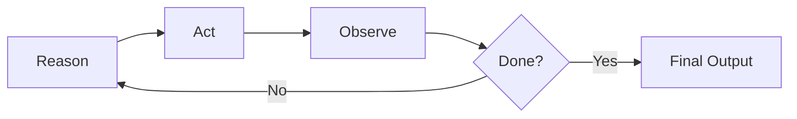
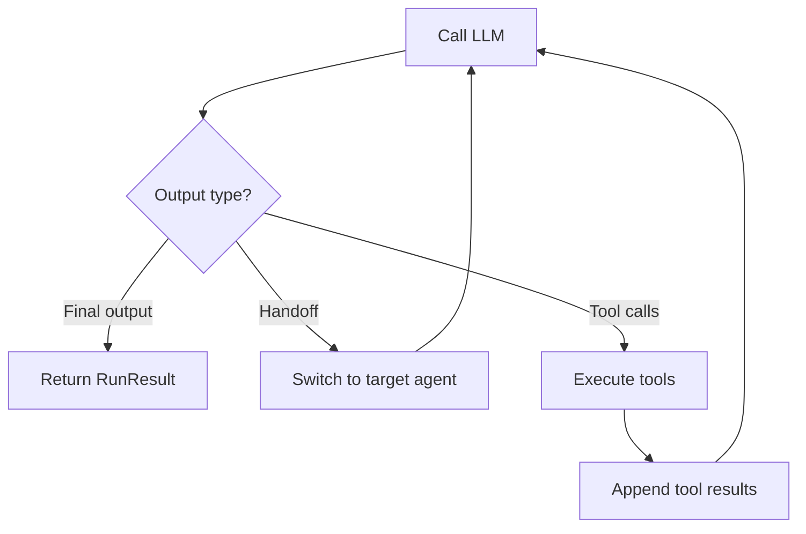
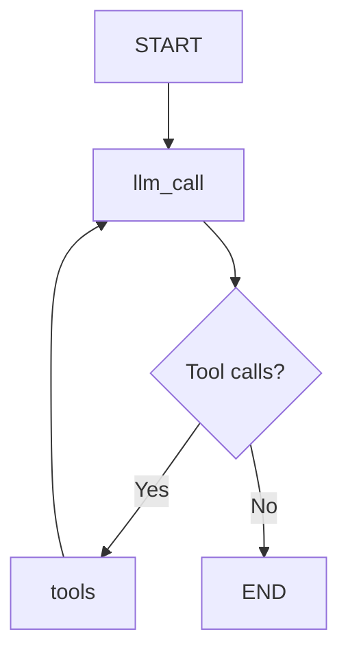

# Simple loop (reason → act → observe)

## Introduction

Every AI agent, no matter how sophisticated, is built on the same fundamental pattern: **reason** about what to do, **act** on that reasoning, then **observe** the result. This cycle — often called the ReAct loop — repeats until the agent decides it has enough information to produce a final answer.

Understanding this loop deeply matters because it is the core execution engine of all agent frameworks. OpenAI's Agents SDK, LangGraph, LangChain, and every other agent toolkit implement some variation of this cycle. When you grasp the pattern, you can debug agent behavior, optimize performance, and build custom execution logic with confidence.

### What we'll cover

- The three-phase execution cycle: reason → act → observe
- How the loop works internally in OpenAI Agents SDK and LangGraph
- Building a simple agent loop from scratch in Python
- Framework-specific implementations with working code
- How tool results flow back into the reasoning context

### Prerequisites

- [Reasoning and Planning](../03-reasoning-and-planning/00-reasoning-and-planning.md) — ReAct and chain-of-thought patterns
- [Tool Integration](../05-tool-integration/00-tool-integration.md) — tool definition and invocation
- [Agent Architecture](../02-agent-architecture/00-agent-architecture.md) — agent components
- Python async/await fundamentals

---

## The ReAct execution cycle

The ReAct loop (Reason + Act) has three distinct phases that repeat:



### Phase 1: Reason

The LLM receives the full conversation context — system prompt, user message, and any previous tool results — and decides what to do next. This decision takes one of three forms:

1. **Call a tool** — the agent needs more information or must perform an action
2. **Produce a final answer** — the agent has enough information to respond
3. **Hand off to another agent** — the task belongs to a different specialist (in multi-agent systems)

### Phase 2: Act

If the LLM decided to call a tool, the framework executes that tool with the arguments the model provided. This is automatic — the framework parses the model's tool call request, invokes the function, and captures the result.

### Phase 3: Observe

The tool's return value is added to the conversation as a tool result message. The full conversation — now including the tool output — goes back to the LLM for another reasoning step. The loop continues.

> **🔑 Key concept:** The agent doesn't "remember" calling the tool. It sees the tool result as a new message in the conversation. Each iteration of the loop is a fresh LLM call with an ever-growing context window.

---

## Building a simple loop from scratch

Before using any framework, we will build the core loop manually. This reveals what frameworks do under the hood.

### Step 1: Define tools

```python
import json
import httpx
from datetime import datetime

# Tool implementations
def get_weather(city: str) -> str:
    """Get current weather for a city."""
    # Simulated weather data
    weather_data = {
        "london": {"temp": 12, "condition": "Cloudy"},
        "tokyo": {"temp": 24, "condition": "Sunny"},
        "new york": {"temp": 18, "condition": "Partly cloudy"},
    }
    data = weather_data.get(city.lower(), {"temp": 20, "condition": "Unknown"})
    return json.dumps({"city": city, **data})

def get_current_time(timezone: str) -> str:
    """Get the current time in a timezone."""
    return json.dumps({"timezone": timezone, "time": datetime.now().isoformat()})

# Tool registry maps names to functions
TOOLS = {
    "get_weather": get_weather,
    "get_current_time": get_current_time,
}
```

### Step 2: Define tool schemas for the LLM

```python
TOOL_SCHEMAS = [
    {
        "type": "function",
        "function": {
            "name": "get_weather",
            "description": "Get current weather for a city",
            "parameters": {
                "type": "object",
                "properties": {
                    "city": {"type": "string", "description": "City name"}
                },
                "required": ["city"],
            },
        },
    },
    {
        "type": "function",
        "function": {
            "name": "get_current_time",
            "description": "Get the current time in a timezone",
            "parameters": {
                "type": "object",
                "properties": {
                    "timezone": {"type": "string", "description": "Timezone name"}
                },
                "required": ["timezone"],
            },
        },
    },
]
```

### Step 3: Implement the loop

```python
from openai import OpenAI

client = OpenAI()

def run_agent_loop(user_message: str, max_turns: int = 10) -> str:
    """Run a simple agent loop until the LLM produces a final answer."""
    messages = [
        {"role": "system", "content": "You are a helpful assistant. Use tools to answer questions."},
        {"role": "user", "content": user_message},
    ]

    for turn in range(max_turns):
        # Phase 1: REASON — LLM decides what to do
        response = client.chat.completions.create(
            model="gpt-4o-mini",
            messages=messages,
            tools=TOOL_SCHEMAS,
        )
        choice = response.choices[0]

        # Check: Did the LLM produce a final answer?
        if choice.finish_reason == "stop":
            return choice.message.content  # Done!

        # Phase 2: ACT — Execute each tool call
        assistant_message = choice.message
        messages.append(assistant_message)  # Add assistant's tool call to history

        for tool_call in assistant_message.tool_calls:
            func_name = tool_call.function.name
            func_args = json.loads(tool_call.function.arguments)

            print(f"  [Turn {turn + 1}] Calling {func_name}({func_args})")

            # Execute the tool
            result = TOOLS[func_name](**func_args)

            # Phase 3: OBSERVE — Add tool result to conversation
            messages.append({
                "role": "tool",
                "tool_call_id": tool_call.id,
                "content": result,
            })

    return "Max turns reached without a final answer."

# Run it
answer = run_agent_loop("What's the weather in London and Tokyo?")
print(answer)
```

**Output:**
```
  [Turn 1] Calling get_weather({"city": "London"})
  [Turn 1] Calling get_weather({"city": "Tokyo"})
The weather in London is 12°C and Cloudy. In Tokyo, it's 24°C and Sunny.
```

> **Note:** The LLM called both tools in a single turn. This is **parallel tool calling** — the model issued two tool calls simultaneously. We will explore this pattern in detail in [Parallel Execution](./03-parallel-execution.md). The loop itself still follows the same reason → act → observe cycle.

---

## How the loop works in OpenAI Agents SDK

The OpenAI Agents SDK implements this exact loop inside `Runner.run()`. Understanding the SDK's internals helps you predict agent behavior and debug issues.

### The three-step internal loop

When you call `Runner.run()`, the SDK repeats these steps:

1. **Call the LLM** with the agent's system prompt, tools, and conversation history
2. **Check the output type:**
   - **Final output** (text with the agent's `output_type`) → loop ends, result returned
   - **Handoff** → switch to the target agent, continue the loop
   - **Tool calls** → execute each tool, append results, go to step 1
3. **Repeat** until a final output is produced or `max_turns` is reached



### Basic usage

```python
from agents import Agent, Runner

agent = Agent(
    name="Weather Agent",
    instructions="You help users check the weather.",
    tools=[get_weather_tool],  # Tool objects defined elsewhere
)

# Run the loop — the SDK handles everything
result = await Runner.run(agent, input="What's the weather in London?")
print(result.final_output)
```

**Output:**
```
The weather in London is 12°C and Cloudy.
```

### What happens internally

Each iteration through the loop is called a **turn**. A turn consists of one LLM call and any resulting tool executions. You control the maximum number of turns with `max_turns`:

```python
# Limit the agent to 5 turns
result = await Runner.run(
    agent,
    input="Research this topic thoroughly.",
    max_turns=5,
)
```

If the agent exceeds `max_turns`, the SDK raises a `MaxTurnsExceeded` exception. We cover this in detail in [Maximum Iteration Limits](./06-maximum-iteration-limits.md).

### Three ways to run the loop

| Method | Behavior | Use case |
|--------|----------|----------|
| `Runner.run()` | Async, returns full `RunResult` | Standard async workflows |
| `Runner.run_sync()` | Synchronous wrapper | Scripts, simple applications |
| `Runner.run_streamed()` | Async streaming with events | Real-time UI updates, chat |

```python
# Synchronous — simplest option
result = Runner.run_sync(agent, input="Hello!")

# Streaming — get events as they happen
result = Runner.run_streamed(agent, input="Hello!")
async for event in result.stream_events():
    print(event)
```

---

## How the loop works in LangGraph

LangGraph implements the agent loop as a **state graph** with conditional edges. Instead of an implicit loop, LangGraph makes the flow explicit through nodes and edges.

### Graph structure

```python
from langgraph.graph import StateGraph, START, END
from langgraph.graph import MessagesState

def llm_call(state: MessagesState):
    """Reason: Call the LLM with current messages."""
    response = model.invoke(
        [{"role": "system", "content": "You are a helpful assistant."}]
        + state["messages"]
    )
    return {"messages": [response]}

def should_continue(state: MessagesState):
    """Decide: Does the LLM want to call tools?"""
    last_message = state["messages"][-1]
    if last_message.tool_calls:
        return "tools"
    return END

def tool_node(state: MessagesState):
    """Act + Observe: Execute tools and return results."""
    outputs = []
    for tool_call in state["messages"][-1].tool_calls:
        result = tool_functions[tool_call["name"]].invoke(tool_call["args"])
        outputs.append(
            ToolMessage(content=str(result), tool_call_id=tool_call["id"])
        )
    return {"messages": outputs}

# Build the graph
builder = StateGraph(MessagesState)
builder.add_node("llm_call", llm_call)
builder.add_node("tools", tool_node)

builder.add_edge(START, "llm_call")
builder.add_conditional_edges("llm_call", should_continue, ["tools", END])
builder.add_edge("tools", "llm_call")  # Loop back after tool execution

graph = builder.compile()
```



### Running the graph

```python
result = graph.invoke({
    "messages": [{"role": "user", "content": "What's the weather in London?"}]
})
print(result["messages"][-1].content)
```

**Output:**
```
The weather in London is 12°C and Cloudy.
```

> **🤖 AI Context:** LangGraph's explicit graph structure gives you full control over the loop. You can add nodes for logging, guardrails, or state transformations at any point in the cycle — something that's harder to do with an implicit loop like OpenAI's SDK.

---

## Conversation context growth

Each iteration of the loop adds messages to the conversation. Understanding this growth pattern is critical for managing token usage and staying within context window limits.

### Message accumulation

```
Turn 1:
  [system]     "You are a helpful assistant."
  [user]       "What's the weather in London and Tokyo?"
  [assistant]  tool_call: get_weather("London"), get_weather("Tokyo")
  [tool]       {"city": "London", "temp": 12, ...}
  [tool]       {"city": "Tokyo", "temp": 24, ...}

Turn 2:
  [system]     "You are a helpful assistant."
  [user]       "What's the weather in London and Tokyo?"
  [assistant]  tool_call: get_weather("London"), get_weather("Tokyo")  ← still here
  [tool]       {"city": "London", "temp": 12, ...}                    ← still here
  [tool]       {"city": "Tokyo", "temp": 24, ...}                    ← still here
  [assistant]  "London is 12°C and Cloudy. Tokyo is 24°C and Sunny." ← NEW
```

Each turn adds the assistant's response and any tool results. For long-running agents, this can fill the context window quickly.

### Token management strategies

| Strategy | How it works | Trade-off |
|----------|-------------|-----------|
| **Truncate old messages** | Drop early turns from history | Loses context from early reasoning |
| **Summarize history** | Replace old messages with a summary | Adds latency for the summarization call |
| **Sliding window** | Keep only the last N turns | Simple but loses important early context |
| **Selective retention** | Keep system prompt + last K turns + key results | Good balance of context and tokens |

```python
def trim_conversation(messages: list, max_messages: int = 20) -> list:
    """Keep system prompt and most recent messages."""
    if len(messages) <= max_messages:
        return messages

    # Always keep the system prompt
    system_messages = [m for m in messages if m["role"] == "system"]
    recent_messages = messages[-max_messages + len(system_messages):]

    return system_messages + recent_messages
```

> **Warning:** Never truncate a tool result message without also removing the corresponding assistant tool call message. The API requires tool calls and their results to stay paired.

---

## Best practices

| Practice | Why it matters |
|----------|----------------|
| Log every turn | Debugging agent loops requires seeing each reason/act/observe step |
| Set `max_turns` early | Prevents runaway loops and unexpected API costs |
| Validate tool results before appending | Malformed results can confuse the LLM's next reasoning step |
| Keep tool outputs concise | Large tool outputs eat context window space quickly |
| Use structured output for final answers | Prevents the agent from returning tool calls as the "answer" |

---

## Common pitfalls

| ❌ Mistake | ✅ Solution |
|-----------|-------------|
| No `max_turns` limit | Always set a maximum — start with 10, adjust based on task complexity |
| Ignoring tool errors | Wrap tool execution in try/except and return error messages to the LLM |
| Passing raw API responses as tool results | Parse and summarize API data before returning it to the agent |
| Not logging intermediate steps | Add logging at each phase to trace the agent's reasoning |
| Removing tool results without removing tool calls | Always keep tool call messages and their results paired |

---

## Hands-on exercise

### Your task

Build a simple agent loop that uses two tools — a calculator and a unit converter — to answer multi-step math questions like "What is 42 kilometers in miles, and how long would it take to drive that distance at 60 mph?"

### Requirements

1. Define a `calculate` tool that evaluates arithmetic expressions
2. Define a `convert_units` tool that converts between common units
3. Implement the reason → act → observe loop manually (no framework)
4. Log each turn showing which tool was called and what it returned
5. Set a `max_turns` limit of 8

### Expected result

```
[Turn 1] Calling convert_units({"value": 42, "from": "km", "to": "miles"})
         Result: {"result": 26.1, "from": "km", "to": "miles"}
[Turn 1] Calling calculate({"expression": "26.1 / 60"})
         Result: {"result": 0.435}
[Turn 2] Final answer: 42 kilometers is approximately 26.1 miles.
         At 60 mph, it would take about 26.1 minutes (0.435 hours).
```

<details>
<summary>💡 Hints (click to expand)</summary>

- Use `eval()` cautiously for the calculator (or use `ast.literal_eval` for safety)
- Common conversion factors: 1 km = 0.621371 miles, 1 kg = 2.20462 lbs
- The loop structure is identical to the `run_agent_loop` function shown earlier
- The LLM might call both tools in a single turn — handle multiple tool calls per iteration

</details>

<details>
<summary>✅ Solution (click to expand)</summary>

```python
import json
from openai import OpenAI

client = OpenAI()

# Tool implementations
def calculate(expression: str) -> str:
    """Evaluate a mathematical expression."""
    try:
        result = eval(expression)  # Use ast.literal_eval in production
        return json.dumps({"expression": expression, "result": round(result, 4)})
    except Exception as e:
        return json.dumps({"error": str(e)})

CONVERSIONS = {
    ("km", "miles"): 0.621371,
    ("miles", "km"): 1.60934,
    ("kg", "lbs"): 2.20462,
    ("lbs", "kg"): 0.453592,
    ("celsius", "fahrenheit"): lambda v: v * 9/5 + 32,
    ("fahrenheit", "celsius"): lambda v: (v - 32) * 5/9,
}

def convert_units(value: float, from_unit: str, to_unit: str) -> str:
    """Convert a value between units."""
    key = (from_unit.lower(), to_unit.lower())
    factor = CONVERSIONS.get(key)
    if factor is None:
        return json.dumps({"error": f"Unknown conversion: {from_unit} → {to_unit}"})
    result = factor(value) if callable(factor) else value * factor
    return json.dumps({"value": value, "from": from_unit, "to": to_unit, "result": round(result, 4)})

TOOLS = {"calculate": calculate, "convert_units": convert_units}

TOOL_SCHEMAS = [
    {
        "type": "function",
        "function": {
            "name": "calculate",
            "description": "Evaluate a math expression",
            "parameters": {
                "type": "object",
                "properties": {"expression": {"type": "string"}},
                "required": ["expression"],
            },
        },
    },
    {
        "type": "function",
        "function": {
            "name": "convert_units",
            "description": "Convert a value between units",
            "parameters": {
                "type": "object",
                "properties": {
                    "value": {"type": "number"},
                    "from_unit": {"type": "string"},
                    "to_unit": {"type": "string"},
                },
                "required": ["value", "from_unit", "to_unit"],
            },
        },
    },
]

def run_math_agent(question: str, max_turns: int = 8) -> str:
    messages = [
        {"role": "system", "content": "You are a math assistant. Use tools to compute answers."},
        {"role": "user", "content": question},
    ]

    for turn in range(max_turns):
        response = client.chat.completions.create(
            model="gpt-4o-mini",
            messages=messages,
            tools=TOOL_SCHEMAS,
        )
        choice = response.choices[0]

        if choice.finish_reason == "stop":
            print(f"[Turn {turn + 1}] Final answer:")
            return choice.message.content

        messages.append(choice.message)
        for tc in choice.message.tool_calls:
            args = json.loads(tc.function.arguments)
            print(f"[Turn {turn + 1}] Calling {tc.function.name}({args})")
            result = TOOLS[tc.function.name](**args)
            print(f"         Result: {result}")
            messages.append({"role": "tool", "tool_call_id": tc.id, "content": result})

    return "Max turns reached."

answer = run_math_agent(
    "What is 42 kilometers in miles, and how long to drive that at 60 mph?"
)
print(answer)
```

</details>

### Bonus challenges

- [ ] Add error handling so that if a tool throws an exception, the error message is sent back to the LLM instead of crashing the loop
- [ ] Implement a `conversation_log` list that captures each turn's reasoning and tool calls for later inspection
- [ ] Add token counting to track how the conversation context grows with each turn

---

## Summary

✅ The ReAct loop is a three-phase cycle: **reason** (LLM decides), **act** (execute tool), **observe** (add result to context)

✅ OpenAI Agents SDK implements this loop in `Runner.run()` with a 3-step check: final output, handoff, or tool calls

✅ LangGraph makes the loop explicit as a state graph with `llm_call → should_continue → tools → llm_call` edges

✅ Conversation context grows with every turn — manage it with truncation, summarization, or sliding windows

✅ Always set `max_turns` and log every step to maintain control over agent execution

**Next:** [Iterative Refinement Loops](./02-iterative-refinement-loops.md)

---

## Further reading

- [OpenAI Agents SDK — Running Agents](https://openai.github.io/openai-agents-python/running_agents/) — official loop implementation details
- [LangGraph — Agent Architecture](https://langchain-ai.github.io/langgraph/concepts/agentic_concepts/) — graph-based agent patterns
- [Anthropic — Building Effective Agents](https://www.anthropic.com/engineering/building-effective-agents) — foundational agent loop design
- [ReAct: Synergizing Reasoning and Acting in Language Models](https://arxiv.org/abs/2210.03629) — the original ReAct paper

*[Back to Execution Loop Patterns](./00-execution-loop-patterns.md)*

<!--
Sources Consulted:
- OpenAI Agents SDK Running Agents: https://openai.github.io/openai-agents-python/running_agents/
- LangGraph Workflows and Agents: https://docs.langchain.com/oss/python/langgraph/workflows-agents
- Anthropic Building Effective Agents: https://www.anthropic.com/engineering/building-effective-agents
-->
