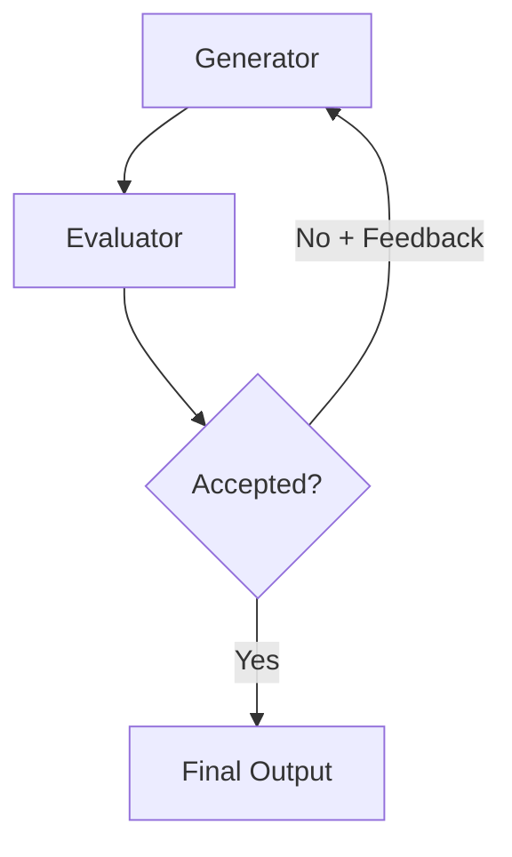
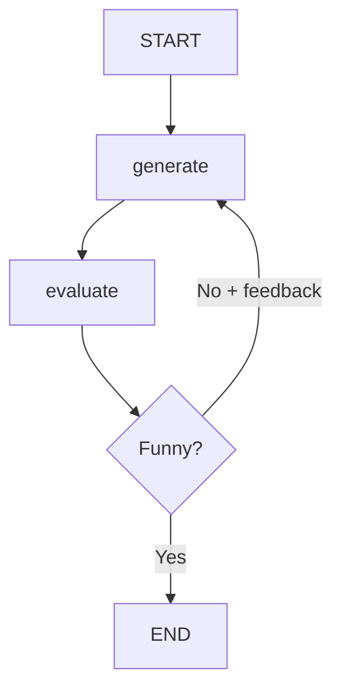

# Iterative Refinement Loops

## Introduction

Not every task produces a good result on the first try. Writing, code generation, translation, and search tasks often require multiple passes — where one LLM generates output and another evaluates it, feeding back corrections until quality thresholds are met. This is the **evaluator-optimizer** pattern, and it turns a single-shot LLM call into an iterative improvement cycle.

This pattern is powerful because it separates *generation* from *evaluation*. The generator focuses on producing content, while the evaluator focuses on judging quality. This separation mirrors how human creative processes work: draft, review, revise, repeat.

### What we'll cover

- The evaluator-optimizer architecture and when to use it
- Implementing feedback loops with structured evaluation
- Convergence detection — knowing when output is "good enough"
- Framework implementations in LangGraph and plain Python
- Multi-pass refinement with quality tracking

### Prerequisites

- [Simple Loop](./01-simple-loop.md) — the basic ReAct cycle
- [Reasoning and Planning](../03-reasoning-and-planning/00-reasoning-and-planning.md) — chain-of-thought evaluation
- Understanding of structured outputs (Pydantic models, JSON schema)

---

## The evaluator-optimizer pattern

The evaluator-optimizer pattern pairs two LLM calls in a loop:

1. **Generator** — produces or improves output based on the current context and any feedback
2. **Evaluator** — judges the output against defined criteria, returns pass/fail plus feedback
3. **Router** — if the evaluator accepts, the loop ends; if rejected, the feedback goes back to the generator



> **🤖 AI Context:** Anthropic identifies this as a key workflow pattern: "One LLM call generates a response while another provides evaluation and feedback in a loop." It works best when you have clear evaluation criteria and when iterative refinement provides measurable value.

### When to use this pattern

| ✅ Good fit | ❌ Poor fit |
|------------|-----------|
| Creative writing with quality standards | Simple factual lookups |
| Code generation with test validation | One-shot classification tasks |
| Translation requiring cultural nuance | Quick Q&A responses |
| Complex search with relevance scoring | Time-critical responses |
| Data extraction with accuracy requirements | Tasks without clear quality criteria |

---

## Building a feedback loop from scratch

We will build a joke-writing agent that generates jokes and evaluates them until the evaluator finds one funny. This is a simplified example, but the pattern applies to any quality-gated generation task.

### Step 1: Define the state

```python
from dataclasses import dataclass, field

@dataclass
class RefinementState:
    """Tracks the current output, feedback history, and iteration count."""
    topic: str
    current_output: str = ""
    feedback: str = ""
    is_accepted: bool = False
    iteration: int = 0
    max_iterations: int = 5
    history: list = field(default_factory=list)
```

### Step 2: Implement the generator

```python
from openai import OpenAI

client = OpenAI()

def generate(state: RefinementState) -> RefinementState:
    """Generate or improve output based on feedback."""
    if state.iteration == 0:
        # First attempt — generate from scratch
        prompt = f"Write a short, clever joke about {state.topic}."
    else:
        # Subsequent attempts — incorporate feedback
        prompt = (
            f"Your previous joke about {state.topic} was:\n"
            f'"{state.current_output}"\n\n'
            f"Feedback: {state.feedback}\n\n"
            f"Write an improved joke that addresses the feedback."
        )

    response = client.chat.completions.create(
        model="gpt-4o-mini",
        messages=[
            {"role": "system", "content": "You are a comedy writer. Write short, clever jokes."},
            {"role": "user", "content": prompt},
        ],
    )

    state.current_output = response.choices[0].message.content
    state.iteration += 1
    state.history.append({
        "iteration": state.iteration,
        "output": state.current_output,
        "feedback": state.feedback,
    })

    print(f"  [Iteration {state.iteration}] Generated: {state.current_output[:80]}...")
    return state
```

### Step 3: Implement the evaluator

```python
import json

def evaluate(state: RefinementState) -> RefinementState:
    """Evaluate the current output and provide structured feedback."""
    response = client.chat.completions.create(
        model="gpt-4o-mini",
        messages=[
            {
                "role": "system",
                "content": (
                    "You are a comedy critic. Evaluate jokes on cleverness, "
                    "surprise factor, and clarity. Respond in JSON format with:\n"
                    '{"grade": "funny" or "not funny", "feedback": "specific improvement suggestions"}'
                ),
            },
            {"role": "user", "content": f"Evaluate this joke:\n{state.current_output}"},
        ],
        response_format={"type": "json_object"},
    )

    result = json.loads(response.choices[0].message.content)
    state.is_accepted = result["grade"] == "funny"
    state.feedback = result["feedback"]

    status = "✅ Accepted" if state.is_accepted else "❌ Rejected"
    print(f"  [Evaluation] {status} — {state.feedback[:60]}...")
    return state
```

### Step 4: Run the loop

```python
def run_refinement_loop(topic: str, max_iterations: int = 5) -> RefinementState:
    """Run the evaluator-optimizer loop until accepted or max iterations."""
    state = RefinementState(topic=topic, max_iterations=max_iterations)

    for _ in range(max_iterations):
        state = generate(state)
        state = evaluate(state)

        if state.is_accepted:
            print(f"\n  Final output (after {state.iteration} iterations):")
            print(f"  {state.current_output}")
            return state

    print(f"\n  Max iterations ({max_iterations}) reached. Best attempt:")
    print(f"  {state.current_output}")
    return state

result = run_refinement_loop("programming")
```

**Output:**
```
  [Iteration 1] Generated: Why do programmers prefer dark mode? Because light at...
  [Evaluation] ❌ Rejected — The dark mode joke is overused. Try a more original angle...
  [Iteration 2] Generated: A programmer's spouse asked them to go to the store: "Get...
  [Evaluation] ✅ Accepted — Good use of the classic instruction-misinterpretation format...

  Final output (after 2 iterations):
  A programmer's spouse asked them to go to the store: "Get a gallon of milk.
  If they have eggs, get a dozen." They came home with 12 gallons of milk.
```

---

## Structured evaluation with Pydantic

For production systems, use structured outputs to ensure consistent evaluation:

```python
from pydantic import BaseModel, Field
from typing import Literal

class EvaluationResult(BaseModel):
    """Structured evaluation of generated content."""
    grade: Literal["pass", "fail"] = Field(
        description="Whether the output meets quality standards"
    )
    score: float = Field(
        ge=0, le=1, description="Quality score from 0 to 1"
    )
    feedback: str = Field(
        description="Specific, actionable improvement suggestions"
    )
    criteria_met: dict[str, bool] = Field(
        description="Individual criteria pass/fail status"
    )

# Example evaluation result
evaluation = EvaluationResult(
    grade="fail",
    score=0.6,
    feedback="The joke structure is good but the punchline is predictable.",
    criteria_met={
        "original": True,
        "clever": False,
        "clear": True,
        "surprising": False,
    },
)
```

**Output:**
```json
{
    "grade": "fail",
    "score": 0.6,
    "feedback": "The joke structure is good but the punchline is predictable.",
    "criteria_met": {
        "original": true,
        "clever": false,
        "clear": true,
        "surprising": false
    }
}
```

> **💡 Tip:** Structured evaluation lets you track *which* criteria are failing across iterations. You can then adjust the generator's prompt to focus on the weak areas — "focus on making the punchline more surprising" instead of generic "try again."

---

## LangGraph implementation

LangGraph makes the evaluator-optimizer pattern explicit with its graph structure. This implementation follows the pattern from the LangGraph documentation.

```python
from langgraph.graph import StateGraph, START, END
from typing import TypedDict, Literal
from pydantic import BaseModel, Field

# State definition
class JokeState(TypedDict):
    topic: str
    joke: str
    feedback: str
    grade: str
    iteration: int

# Structured feedback model
class Feedback(BaseModel):
    grade: Literal["funny", "not funny"] = Field(
        description="Whether the joke is funny"
    )
    feedback: str = Field(
        description="How to improve the joke"
    )

# Generator node
def generate_joke(state: JokeState) -> JokeState:
    if state.get("feedback"):
        prompt = (
            f"Topic: {state['topic']}\n"
            f"Previous joke: {state['joke']}\n"
            f"Feedback: {state['feedback']}\n"
            f"Write an improved joke."
        )
    else:
        prompt = f"Write a short joke about {state['topic']}."

    response = model.invoke([{"role": "user", "content": prompt}])
    return {
        "joke": response.content,
        "iteration": state.get("iteration", 0) + 1,
    }

# Evaluator node
def evaluate_joke(state: JokeState) -> JokeState:
    result = model.with_structured_output(Feedback).invoke(
        [{"role": "user", "content": f"Evaluate this joke:\n{state['joke']}"}]
    )
    return {
        "grade": result.grade,
        "feedback": result.feedback,
    }

# Router function
def route_evaluation(state: JokeState) -> str:
    if state["grade"] == "funny":
        return END
    if state.get("iteration", 0) >= 5:
        return END  # Stop after 5 attempts
    return "generate"

# Build the graph
builder = StateGraph(JokeState)
builder.add_node("generate", generate_joke)
builder.add_node("evaluate", evaluate_joke)

builder.add_edge(START, "generate")
builder.add_edge("generate", "evaluate")
builder.add_conditional_edges("evaluate", route_evaluation, ["generate", END])

graph = builder.compile()

# Run it
result = graph.invoke({"topic": "programming", "iteration": 0})
print(f"Final joke: {result['joke']}")
print(f"Iterations: {result['iteration']}")
```

**Output:**
```
Final joke: Why do Java developers wear glasses? Because they can't C#.
Iterations: 2
```



---

## Convergence detection

A naive refinement loop stops only when the evaluator says "pass" or the iteration limit is reached. Smarter convergence detection identifies when the loop is no longer making progress.

### Detecting stagnation

```python
def has_converged(history: list[dict], window: int = 3) -> bool:
    """Check if recent scores show no improvement."""
    if len(history) < window:
        return False

    recent_scores = [h["score"] for h in history[-window:]]
    improvement = max(recent_scores) - min(recent_scores)

    # If scores haven't changed by more than 5% in the last 3 iterations
    if improvement < 0.05:
        print(f"  Convergence detected: scores {recent_scores} (Δ={improvement:.3f})")
        return True

    return False
```

### Detecting oscillation

Sometimes the generator alternates between two approaches without settling:

```python
def is_oscillating(history: list[dict], window: int = 4) -> bool:
    """Check if evaluations are alternating pass/fail without converging."""
    if len(history) < window:
        return False

    recent_grades = [h["grade"] for h in history[-window:]]
    # Check for pass/fail/pass/fail pattern
    alternating = all(
        recent_grades[i] != recent_grades[i + 1]
        for i in range(len(recent_grades) - 1)
    )

    if alternating:
        print(f"  Oscillation detected: grades {recent_grades}")

    return alternating
```

### Enhanced loop with convergence

```python
def run_smart_refinement(topic: str, max_iterations: int = 8) -> RefinementState:
    """Refinement loop with convergence detection."""
    state = RefinementState(topic=topic, max_iterations=max_iterations)

    for _ in range(max_iterations):
        state = generate(state)
        state = evaluate(state)

        # Check termination conditions
        if state.is_accepted:
            print(f"  ✅ Accepted after {state.iteration} iterations")
            return state

        if has_converged(state.history):
            print(f"  ⚠️ Converged without acceptance — returning best attempt")
            return state

        if is_oscillating(state.history):
            print(f"  ⚠️ Oscillating — returning highest-scored attempt")
            best = max(state.history, key=lambda h: h.get("score", 0))
            state.current_output = best["output"]
            return state

    return state
```

---

## Multi-criteria refinement

Real tasks often have multiple quality dimensions. A translation might be accurate but awkward, or a code snippet might work but be poorly structured. Multi-criteria refinement evaluates each dimension separately.

```python
CRITERIA = {
    "accuracy": "Is the content factually correct?",
    "clarity": "Is the content easy to understand?",
    "completeness": "Does it cover all required aspects?",
    "style": "Does it match the requested tone and format?",
}

def multi_criteria_evaluate(content: str, criteria: dict) -> dict:
    """Evaluate content against multiple criteria independently."""
    results = {}
    for criterion, description in criteria.items():
        response = client.chat.completions.create(
            model="gpt-4o-mini",
            messages=[
                {
                    "role": "system",
                    "content": f"Evaluate the following content on: {description}\n"
                    f"Respond with JSON: {{\"score\": 0-1, \"feedback\": \"...\"}}",
                },
                {"role": "user", "content": content},
            ],
            response_format={"type": "json_object"},
        )
        results[criterion] = json.loads(response.choices[0].message.content)

    return results

# Usage
scores = multi_criteria_evaluate(
    "Python's GIL prevents true parallelism for CPU-bound tasks.",
    CRITERIA,
)
for criterion, result in scores.items():
    print(f"  {criterion}: {result['score']}/1 — {result['feedback']}")
```

**Output:**
```
  accuracy: 0.9/1 — Correct, though could mention multiprocessing as an alternative
  clarity: 0.8/1 — Clear and concise
  completeness: 0.5/1 — Missing context about I/O-bound tasks and threading
  style: 0.7/1 — Technical but accessible
```

> **Warning:** Multi-criteria evaluation multiplies LLM calls. Evaluating 4 criteria per iteration across 5 iterations means 20 evaluation calls alone. Use it when quality justifies the cost.

---

## Best practices

| Practice | Why it matters |
|----------|----------------|
| Start with clear evaluation criteria | Vague criteria produce inconsistent evaluations |
| Track scores across iterations | Enables convergence detection and progress monitoring |
| Set a hard iteration cap | Prevents infinite loops when quality is subjective |
| Use different models for generation and evaluation | Reduces self-reinforcing biases |
| Keep feedback specific and actionable | "Make it funnier" is worse than "The punchline is predictable — try a subverted expectation" |

---

## Common pitfalls

| ❌ Mistake | ✅ Solution |
|-----------|-------------|
| Using the same model and prompt for generator and evaluator | Use different system prompts, or different models entirely |
| No convergence detection — loop runs until max | Track scores and detect stagnation after 3+ iterations |
| Vague evaluation criteria like "is it good?" | Define specific rubrics: accuracy, clarity, relevance, completeness |
| Not capping iterations | Always set `max_iterations` — quality improvements plateau quickly |
| Discarding intermediate outputs | Keep the full history — the best output isn't always the last one |

---

## Hands-on exercise

### Your task

Build an evaluator-optimizer loop that generates and refines a Python docstring for a given function. The generator writes the docstring, and the evaluator checks it against Google-style docstring standards.

### Requirements

1. Accept a function signature and body as input
2. Generate an initial docstring with description, args, returns, and raises sections
3. Evaluate the docstring against four criteria: completeness, accuracy, formatting, and conciseness
4. Loop until all four criteria score above 0.7 or max 4 iterations
5. Return the final docstring plus the evaluation scores at each iteration

### Expected result

```
[Iteration 1] Generated docstring (4 sections)
[Evaluation] completeness: 0.8, accuracy: 0.9, formatting: 0.5, conciseness: 0.7
[Iteration 2] Improved docstring (formatting fixed)
[Evaluation] completeness: 0.8, accuracy: 0.9, formatting: 0.8, conciseness: 0.8
✅ All criteria above 0.7 after 2 iterations
```

<details>
<summary>💡 Hints (click to expand)</summary>

- Use a Pydantic model with four float fields (0-1) for the evaluation result
- The generator prompt should include the function signature, body, AND any feedback
- For formatting evaluation, reference Google Python Style Guide docstring conventions
- Check `all(score >= 0.7 for score in scores.values())` as the acceptance condition

</details>

<details>
<summary>✅ Solution (click to expand)</summary>

```python
import json
from openai import OpenAI
from pydantic import BaseModel, Field

client = OpenAI()

class DocstringEvaluation(BaseModel):
    completeness: float = Field(ge=0, le=1, description="Has description, args, returns, raises")
    accuracy: float = Field(ge=0, le=1, description="Accurately describes the function behavior")
    formatting: float = Field(ge=0, le=1, description="Follows Google-style docstring format")
    conciseness: float = Field(ge=0, le=1, description="Not overly verbose")
    feedback: str = Field(description="Specific improvements needed")

def generate_docstring(func_code: str, feedback: str = "") -> str:
    prompt = f"Write a Google-style Python docstring for this function:\n```python\n{func_code}\n```"
    if feedback:
        prompt += f"\n\nPrevious feedback to address:\n{feedback}"

    response = client.chat.completions.create(
        model="gpt-4o-mini",
        messages=[
            {"role": "system", "content": "Write clear, Google-style Python docstrings."},
            {"role": "user", "content": prompt},
        ],
    )
    return response.choices[0].message.content

def evaluate_docstring(func_code: str, docstring: str) -> DocstringEvaluation:
    response = client.chat.completions.create(
        model="gpt-4o-mini",
        messages=[
            {
                "role": "system",
                "content": "Evaluate this docstring against Google Python Style Guide standards.",
            },
            {
                "role": "user",
                "content": f"Function:\n{func_code}\n\nDocstring:\n{docstring}",
            },
        ],
        response_format={"type": "json_object"},
    )
    data = json.loads(response.choices[0].message.content)
    return DocstringEvaluation(**data)

def refine_docstring(func_code: str, max_iterations: int = 4) -> str:
    feedback = ""
    for i in range(max_iterations):
        docstring = generate_docstring(func_code, feedback)
        print(f"[Iteration {i + 1}] Generated docstring")

        evaluation = evaluate_docstring(func_code, docstring)
        scores = {
            "completeness": evaluation.completeness,
            "accuracy": evaluation.accuracy,
            "formatting": evaluation.formatting,
            "conciseness": evaluation.conciseness,
        }
        print(f"[Evaluation] {scores}")

        if all(s >= 0.7 for s in scores.values()):
            print(f"✅ All criteria above 0.7 after {i + 1} iterations")
            return docstring

        feedback = evaluation.feedback

    print(f"Max iterations reached. Returning best attempt.")
    return docstring

# Example usage
func_code = '''def retry(func, max_attempts=3, delay=1.0):
    for attempt in range(max_attempts):
        try:
            return func()
        except Exception as e:
            if attempt == max_attempts - 1:
                raise
            time.sleep(delay * (2 ** attempt))'''

result = refine_docstring(func_code)
print(result)
```

</details>

### Bonus challenges

- [ ] Add convergence detection that stops the loop if scores haven't improved in the last 2 iterations
- [ ] Track the full history and return the highest-scoring docstring (not necessarily the last one)
- [ ] Use different models for generation (gpt-4o-mini) and evaluation (gpt-4o) to reduce bias

---

## Summary

✅ The evaluator-optimizer pattern pairs a **generator** and **evaluator** in a feedback loop for iterative quality improvement

✅ Use **structured evaluation** (Pydantic models, JSON schema) to ensure consistent, measurable feedback

✅ Implement **convergence detection** to stop when scores plateau or oscillate — don't rely only on max iterations

✅ **Multi-criteria evaluation** enables targeted improvement but multiplies LLM costs

✅ The best output isn't always the last — **track history** and return the highest-scoring result

**Next:** [Parallel Execution](./03-parallel-execution.md)

---

## Further reading

- [LangGraph — Evaluator-Optimizer Pattern](https://docs.langchain.com/oss/python/langgraph/workflows-agents) — official LangGraph workflow patterns
- [Anthropic — Building Effective Agents](https://www.anthropic.com/engineering/building-effective-agents) — evaluator-optimizer in the context of agentic workflows
- [Google Python Style Guide — Docstrings](https://google.github.io/styleguide/pyguide.html#38-comments-and-docstrings) — the evaluation standard used in the exercise

*[Back to Execution Loop Patterns](./00-execution-loop-patterns.md)*

<!--
Sources Consulted:
- LangGraph Workflows and Agents: https://docs.langchain.com/oss/python/langgraph/workflows-agents
- Anthropic Building Effective Agents: https://www.anthropic.com/engineering/building-effective-agents
- Google Python Style Guide: https://google.github.io/styleguide/pyguide.html
-->
