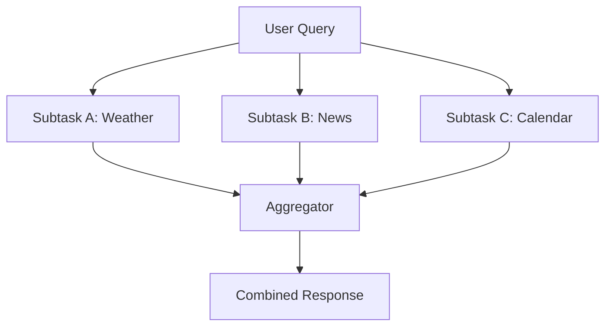
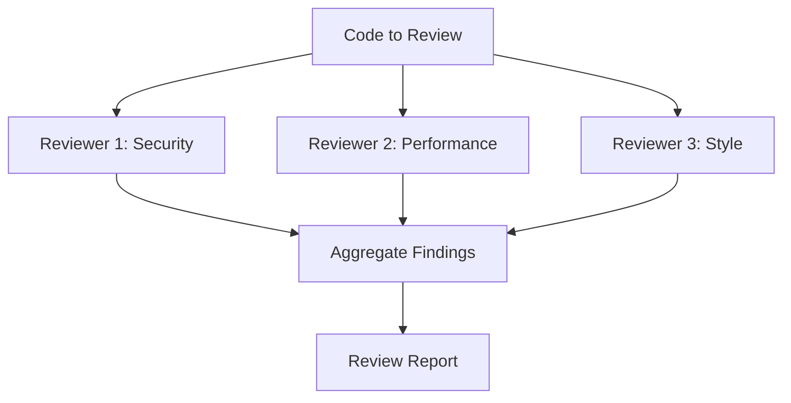
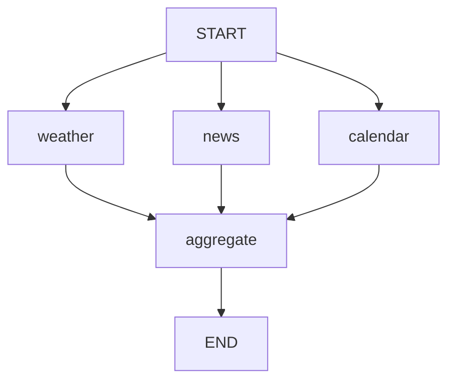

# Parallel Execution

## Introduction

When an agent needs to check the weather in three cities, analyze a document for multiple criteria, or run guardrails alongside content generation, executing these tasks one at a time wastes time. **Parallel execution** lets an agent run multiple independent operations simultaneously, dramatically reducing total latency.

This pattern appears everywhere in production agents: content moderation running alongside generation, multiple search queries fired at once, or several specialized sub-agents each tackling a different subtask. Mastering parallel execution is essential for building responsive, efficient agent systems.

### What we'll cover

- Two forms of parallelism: **sectioning** (different subtasks) and **voting** (same task, multiple attempts)
- Fan-out/fan-in patterns for distributing and collecting work
- Parallel tool calls within a single agent turn
- LangGraph's parallel edge and `Send()` API patterns
- Result aggregation and synchronization strategies

### Prerequisites

- [Simple Loop](./01-simple-loop.md) — the basic agent execution cycle
- [Tool Integration](../05-tool-integration/00-tool-integration.md) — tool invocation patterns
- Python `asyncio` fundamentals (`asyncio.gather`, `async`/`await`)

---

## Two forms of parallelism

Anthropic's framework identifies two distinct sub-patterns within parallelization:

### Sectioning — Different subtasks in parallel

Each parallel branch handles a **different** piece of work. The results are combined at the end.



**Examples:**
- Generating different sections of a report simultaneously
- Running a content moderation check alongside content generation
- Fetching data from multiple APIs to build a dashboard

### Voting — Same task, multiple attempts

Multiple LLMs (or the same LLM with different prompts) perform the **same** task. The results are compared to increase confidence.



**Examples:**
- Multiple prompts evaluating the same content for different quality dimensions
- Running the same question through multiple models and comparing answers
- Code review with separate prompts checking security, performance, and style

> **🤖 AI Context:** Voting is particularly useful for LLM-as-judge scenarios. When one LLM evaluates output, it might miss issues. Running three evaluators and requiring majority agreement significantly reduces false positives.

---

## Parallel tool calls in a single turn

The simplest form of parallelism happens automatically: modern LLMs can issue **multiple tool calls in a single turn**. The agent loop executes all of them before sending results back.

### How it works

```python
import asyncio
import json
from openai import AsyncOpenAI

client = AsyncOpenAI()

async def get_weather(city: str) -> str:
    """Simulate weather API call with async delay."""
    await asyncio.sleep(0.5)  # Simulate network latency
    data = {"london": 12, "tokyo": 24, "paris": 15}
    temp = data.get(city.lower(), 20)
    return json.dumps({"city": city, "temp_c": temp})

async def run_parallel_tools(tool_calls: list) -> list:
    """Execute multiple tool calls concurrently."""
    tasks = []
    for tc in tool_calls:
        args = json.loads(tc.function.arguments)
        # Create async task for each tool call
        tasks.append(get_weather(**args))

    # Run all tools simultaneously
    results = await asyncio.gather(*tasks)
    return results
```

### Timing comparison

```python
import time

async def sequential_execution():
    """Execute tools one at a time."""
    start = time.time()
    result1 = await get_weather("London")
    result2 = await get_weather("Tokyo")
    result3 = await get_weather("Paris")
    elapsed = time.time() - start
    print(f"Sequential: {elapsed:.2f}s")
    return [result1, result2, result3]

async def parallel_execution():
    """Execute tools simultaneously."""
    start = time.time()
    results = await asyncio.gather(
        get_weather("London"),
        get_weather("Tokyo"),
        get_weather("Paris"),
    )
    elapsed = time.time() - start
    print(f"Parallel: {elapsed:.2f}s")
    return results

await sequential_execution()
await parallel_execution()
```

**Output:**
```
Sequential: 1.52s
Parallel: 0.51s
```

> **Note:** Parallel tool execution reduces wall-clock time from the sum of all tool durations to the duration of the *slowest* tool. With three 0.5-second tools, sequential takes ~1.5s while parallel takes ~0.5s.

---

## Fan-out/fan-in pattern

The fan-out/fan-in pattern is the structural blueprint for parallel execution in agent graphs:

1. **Fan-out:** A single node distributes work to multiple parallel nodes
2. **Process:** Each parallel node executes independently
3. **Fan-in:** Results from all parallel nodes converge at an aggregator

### LangGraph static fan-out

When you know the parallel branches at design time, use static edges:

```python
from langgraph.graph import StateGraph, START, END
from typing import TypedDict

class ParallelState(TypedDict):
    query: str
    weather_result: str
    news_result: str
    calendar_result: str
    final_response: str

def fetch_weather(state: ParallelState) -> dict:
    """Fetch weather data."""
    # Simulate API call
    return {"weather_result": f"Weather for query: {state['query']} — 18°C, Sunny"}

def fetch_news(state: ParallelState) -> dict:
    """Fetch relevant news."""
    return {"news_result": f"News for query: {state['query']} — 3 articles found"}

def fetch_calendar(state: ParallelState) -> dict:
    """Check calendar events."""
    return {"calendar_result": f"Calendar for query: {state['query']} — 2 events today"}

def aggregate_results(state: ParallelState) -> dict:
    """Combine all parallel results into a final response."""
    response = (
        f"Here's your briefing:\n"
        f"🌤 {state['weather_result']}\n"
        f"📰 {state['news_result']}\n"
        f"📅 {state['calendar_result']}"
    )
    return {"final_response": response}

# Build graph with parallel edges
builder = StateGraph(ParallelState)
builder.add_node("weather", fetch_weather)
builder.add_node("news", fetch_news)
builder.add_node("calendar", fetch_calendar)
builder.add_node("aggregate", aggregate_results)

# Fan-out: START → three parallel nodes
builder.add_edge(START, "weather")
builder.add_edge(START, "news")
builder.add_edge(START, "calendar")

# Fan-in: all three → aggregate
builder.add_edge("weather", "aggregate")
builder.add_edge("news", "aggregate")
builder.add_edge("calendar", "aggregate")

builder.add_edge("aggregate", END)

graph = builder.compile()
result = graph.invoke({"query": "morning briefing"})
print(result["final_response"])
```

**Output:**
```
Here's your briefing:
🌤 Weather for query: morning briefing — 18°C, Sunny
📰 News for query: morning briefing — 3 articles found
📅 Calendar for query: morning briefing — 2 events today
```



### LangGraph dynamic fan-out with Send()

When the number of parallel tasks is determined at runtime, use LangGraph's `Send()` API. This is the **orchestrator-worker** pattern:

```python
from langgraph.graph import StateGraph, START, END, Send
from typing import TypedDict, Annotated
import operator

class OrchestratorState(TypedDict):
    topic: str
    sections: list[str]
    results: Annotated[list[str], operator.add]  # Append results from workers
    final_report: str

class WorkerState(TypedDict):
    section: str

def plan_sections(state: OrchestratorState) -> dict:
    """Orchestrator: Break topic into sections."""
    # In production, an LLM would decide these sections
    sections = [
        f"Introduction to {state['topic']}",
        f"Core concepts of {state['topic']}",
        f"Practical applications of {state['topic']}",
    ]
    return {"sections": sections}

def assign_workers(state: OrchestratorState) -> list:
    """Dynamically create a worker for each section using Send()."""
    return [
        Send("write_section", {"section": section})
        for section in state["sections"]
    ]

def write_section(state: WorkerState) -> dict:
    """Worker: Write a single section."""
    content = f"## {state['section']}\nContent about {state['section']}..."
    return {"results": [content]}

def synthesize(state: OrchestratorState) -> dict:
    """Combine all section results into final report."""
    report = f"# Report: {state['topic']}\n\n" + "\n\n".join(state["results"])
    return {"final_report": report}

# Build graph
builder = StateGraph(OrchestratorState)
builder.add_node("plan", plan_sections)
builder.add_node("write_section", write_section)
builder.add_node("synthesize", synthesize)

builder.add_edge(START, "plan")
builder.add_conditional_edges("plan", assign_workers, ["write_section"])
builder.add_edge("write_section", "synthesize")
builder.add_edge("synthesize", END)

graph = builder.compile()
result = graph.invoke({"topic": "AI Agents"})
print(result["final_report"])
```

**Output:**
```
# Report: AI Agents

## Introduction to AI Agents
Content about Introduction to AI Agents...

## Core concepts of AI Agents
Content about Core concepts of AI Agents...

## Practical applications of AI Agents
Content about Practical applications of AI Agents...
```

> **🔑 Key concept:** `Send()` creates a separate graph execution for each item, all running in parallel. This is fundamentally different from static edges — the number of parallel branches is determined by the orchestrator's output, not hardcoded into the graph.

---

## Result aggregation strategies

How you combine parallel results depends on the task:

| Strategy | How it works | Use case |
|----------|-------------|----------|
| **Concatenate** | Join all results in order | Report sections, multi-part responses |
| **Majority vote** | Pick the most common result | Classification, yes/no decisions |
| **Best score** | Select the highest-scoring result | Content generation with quality evaluation |
| **Merge** | Combine unique information from all results | Data collection from multiple sources |
| **LLM synthesis** | Pass all results to an LLM for intelligent combination | Complex summaries requiring coherence |

### Implementing aggregation

```python
from collections import Counter

def aggregate_by_vote(results: list[str]) -> str:
    """Return the most common result (majority vote)."""
    counts = Counter(results)
    winner, count = counts.most_common(1)[0]
    confidence = count / len(results)
    return f"{winner} (confidence: {confidence:.0%})"

def aggregate_by_score(results: list[dict]) -> dict:
    """Return the result with the highest quality score."""
    return max(results, key=lambda r: r.get("score", 0))

def aggregate_by_synthesis(results: list[str], query: str) -> str:
    """Use an LLM to intelligently combine results."""
    combined = "\n---\n".join(results)
    response = client.chat.completions.create(
        model="gpt-4o-mini",
        messages=[
            {
                "role": "system",
                "content": "Synthesize the following results into a coherent response.",
            },
            {
                "role": "user",
                "content": f"Query: {query}\n\nResults:\n{combined}",
            },
        ],
    )
    return response.choices[0].message.content

# Voting example
classifications = ["positive", "positive", "negative", "positive", "positive"]
print(aggregate_by_vote(classifications))
```

**Output:**
```
positive (confidence: 80%)
```

---

## Error handling in parallel execution

When one parallel branch fails, you need a strategy. Should the entire operation fail, or should the successful results still be used?

```python
async def safe_parallel_execute(tasks: list, fail_fast: bool = False) -> list:
    """Execute tasks in parallel with error handling."""
    if fail_fast:
        # All-or-nothing — if one fails, cancel the rest
        results = await asyncio.gather(*tasks)
        return results
    else:
        # Best-effort — collect whatever succeeds
        results = await asyncio.gather(*tasks, return_exceptions=True)

        successes = []
        failures = []
        for i, result in enumerate(results):
            if isinstance(result, Exception):
                failures.append({"task": i, "error": str(result)})
                print(f"  ⚠️ Task {i} failed: {result}")
            else:
                successes.append(result)

        if failures:
            print(f"  {len(failures)}/{len(results)} tasks failed")

        return successes

# Example: 3 tasks, one fails
async def failing_task():
    raise ValueError("API timeout")

results = await safe_parallel_execute([
    get_weather("London"),
    failing_task(),
    get_weather("Tokyo"),
], fail_fast=False)

print(f"Got {len(results)} successful results")
```

**Output:**
```
  ⚠️ Task 1 failed: API timeout
  1/3 tasks failed
Got 2 successful results
```

> **💡 Tip:** Use `fail_fast=True` when all results are required (e.g., generating a complete report). Use `fail_fast=False` when partial results are useful (e.g., fetching data from multiple sources where some may be unavailable).

---

## Best practices

| Practice | Why it matters |
|----------|----------------|
| Only parallelize **independent** tasks | Dependent tasks need sequential execution — parallelizing them causes race conditions |
| Set timeouts on each parallel branch | One slow task shouldn't block the entire operation |
| Use `return_exceptions=True` when partial results are acceptable | Prevents one failure from losing all completed work |
| Limit concurrency for external APIs | Most APIs have rate limits — use semaphores to cap concurrent requests |
| Aggregate intentionally | Choose the right aggregation strategy for your use case, don't just concatenate |

---

## Common pitfalls

| ❌ Mistake | ✅ Solution |
|-----------|-------------|
| Parallelizing tasks that depend on each other | Map dependencies first — only parallelize truly independent tasks |
| No timeout on parallel branches | Use `asyncio.wait_for(task, timeout=30)` to cap execution time |
| Ignoring partial failures | Decide upfront: fail-fast or best-effort, and handle accordingly |
| Unbounded parallelism against rate-limited APIs | Use `asyncio.Semaphore` to limit concurrent requests |
| Aggregating results without considering order | If order matters, track the original index and sort after collection |

---

## Hands-on exercise

### Your task

Build a parallel code review agent that analyzes a Python code snippet across three dimensions simultaneously: security, performance, and style. Each dimension should be evaluated by a separate LLM call running in parallel, and the results should be aggregated into a unified review report.

### Requirements

1. Define three async review functions: `review_security`, `review_performance`, `review_style`
2. Each function should call the LLM with a dimension-specific prompt and return structured results
3. Execute all three reviews in parallel using `asyncio.gather`
4. Aggregate results into a single report with per-dimension scores and findings
5. Handle the case where one review fails without losing the others

### Expected result

```
Running 3 parallel reviews...
  ✅ Security review complete (0.4s)
  ✅ Performance review complete (0.5s)
  ✅ Style review complete (0.3s)
Total time: 0.52s (vs ~1.2s sequential)

Code Review Report:
  🔒 Security: 7/10 — No SQL injection risk, but input is not validated
  ⏱️ Performance: 8/10 — Efficient algorithm, consider caching for repeated calls
  🎨 Style: 6/10 — Missing type hints, inconsistent naming conventions
```

<details>
<summary>💡 Hints (click to expand)</summary>

- Use `asyncio.gather(*tasks, return_exceptions=True)` for fault tolerance
- Each review function should return a dict with `dimension`, `score`, `findings`
- Time the parallel execution with `time.time()` to show the speedup
- The system prompt for each reviewer should focus narrowly on one dimension

</details>

<details>
<summary>✅ Solution (click to expand)</summary>

```python
import asyncio
import json
import time
from openai import AsyncOpenAI

client = AsyncOpenAI()

async def review_dimension(code: str, dimension: str, focus: str) -> dict:
    """Review code for a specific quality dimension."""
    start = time.time()
    response = await client.chat.completions.create(
        model="gpt-4o-mini",
        messages=[
            {
                "role": "system",
                "content": (
                    f"You are a code reviewer focused exclusively on {dimension}. "
                    f"Focus: {focus}\n"
                    f"Respond in JSON: {{\"score\": 1-10, \"findings\": [\"...\"], \"summary\": \"...\"}}"
                ),
            },
            {"role": "user", "content": f"Review this code:\n```python\n{code}\n```"},
        ],
        response_format={"type": "json_object"},
    )
    result = json.loads(response.choices[0].message.content)
    elapsed = time.time() - start
    print(f"  ✅ {dimension} review complete ({elapsed:.1f}s)")
    return {"dimension": dimension, **result}

async def parallel_code_review(code: str) -> dict:
    """Run three code reviews in parallel."""
    print("Running 3 parallel reviews...")
    start = time.time()

    tasks = [
        review_dimension(code, "Security", "Input validation, injection, secrets, auth"),
        review_dimension(code, "Performance", "Algorithm efficiency, caching, memory usage"),
        review_dimension(code, "Style", "PEP 8, type hints, naming, documentation"),
    ]

    results = await asyncio.gather(*tasks, return_exceptions=True)
    elapsed = time.time() - start
    print(f"Total time: {elapsed:.2f}s\n")

    # Aggregate
    report = {"reviews": [], "errors": []}
    icons = {"Security": "🔒", "Performance": "⏱️", "Style": "🎨"}

    for r in results:
        if isinstance(r, Exception):
            report["errors"].append(str(r))
        else:
            report["reviews"].append(r)
            icon = icons.get(r["dimension"], "📝")
            print(f"  {icon} {r['dimension']}: {r['score']}/10 — {r['summary']}")

    return report

# Run it
code = '''
def process_data(data):
    result = []
    for item in data:
        if item > 0:
            result.append(item * 2)
    return result
'''

report = await parallel_code_review(code)
```

</details>

### Bonus challenges

- [ ] Add a fourth parallel reviewer for "documentation" quality
- [ ] Implement a `Semaphore` that limits concurrent LLM calls to 2 at a time
- [ ] Add timing to show the actual speedup compared to sequential execution

---

## Summary

✅ **Sectioning** runs different subtasks in parallel; **voting** runs the same task multiple times for confidence

✅ LangGraph supports **static fan-out** (design-time edges) and **dynamic fan-out** (`Send()` for runtime-determined branches)

✅ Modern LLMs issue **multiple tool calls per turn**, enabling automatic parallelism within the agent loop

✅ Choose an **aggregation strategy** based on your use case: concatenation, voting, scoring, merging, or LLM synthesis

✅ Handle **partial failures** gracefully with `return_exceptions=True` and decide between fail-fast and best-effort

**Next:** [Conditional Branching](./04-conditional-branching.md)

---

## Further reading

- [Anthropic — Building Effective Agents: Parallelization](https://www.anthropic.com/engineering/building-effective-agents) — sectioning and voting patterns
- [LangGraph — Parallelization](https://docs.langchain.com/oss/python/langgraph/workflows-agents) — fan-out/fan-in and Send() API
- [Python asyncio.gather](https://docs.python.org/3/library/asyncio-task.html#asyncio.gather) — concurrent task execution

*[Back to Execution Loop Patterns](./00-execution-loop-patterns.md)*

<!--
Sources Consulted:
- Anthropic Building Effective Agents: https://www.anthropic.com/engineering/building-effective-agents
- LangGraph Workflows and Agents: https://docs.langchain.com/oss/python/langgraph/workflows-agents
- Python asyncio docs: https://docs.python.org/3/library/asyncio-task.html
-->
