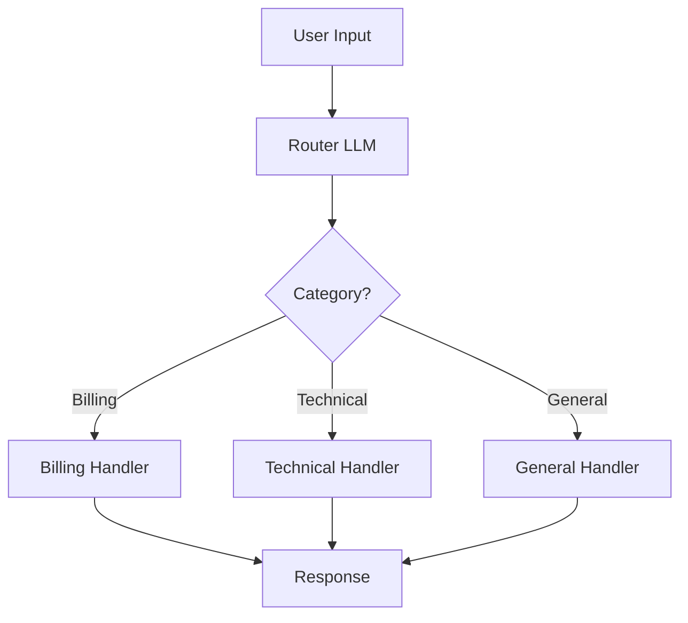
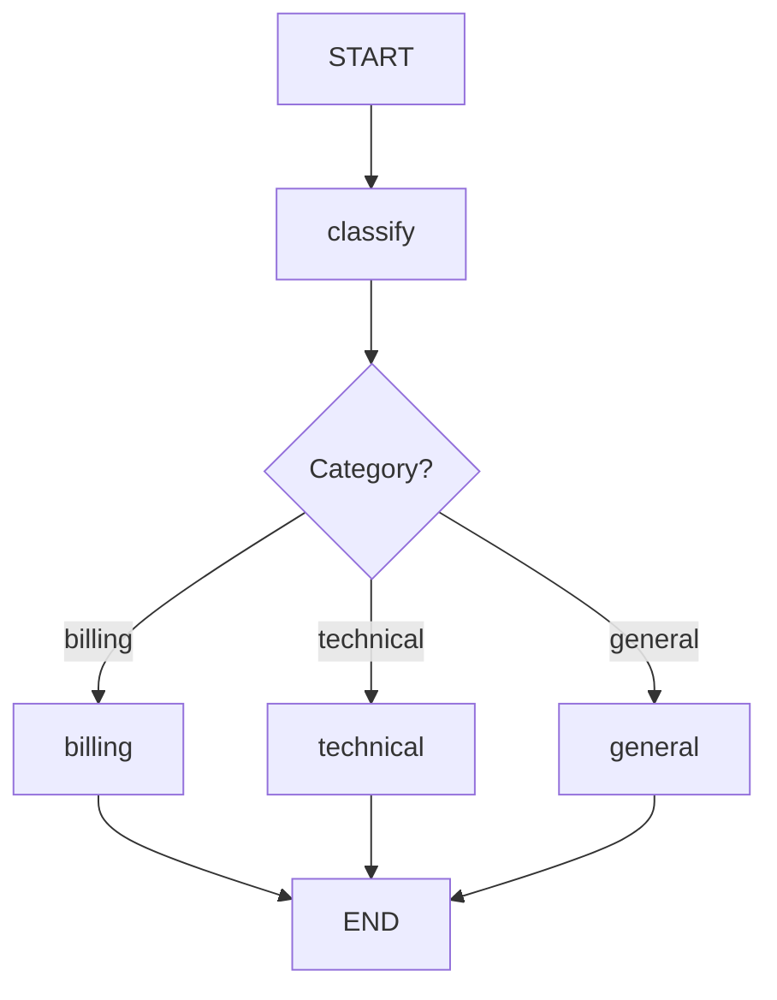
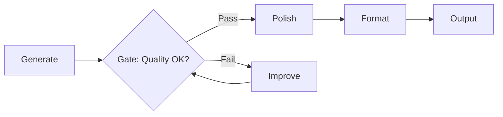
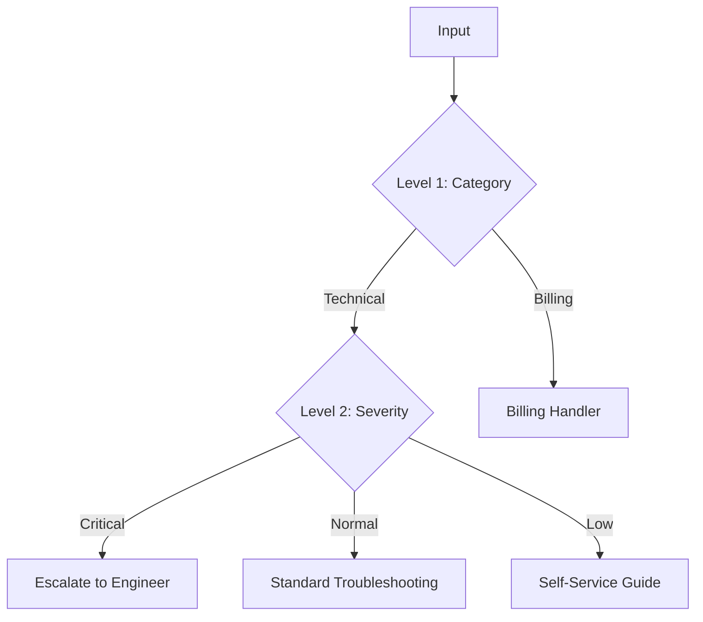

# Conditional Branching

## Introduction

Not every agent task follows a single path. A customer support agent needs to route billing questions to one workflow and technical issues to another. A content generator needs to produce different formats — poems, stories, or code — based on the request type. **Conditional branching** gives agents the ability to classify inputs and direct execution down different specialized paths.

This pattern is the agent equivalent of an `if/elif/else` statement, but the "condition" is evaluated by an LLM using natural language understanding rather than hardcoded rules. The result is a system that can route dynamic, unpredictable inputs to the right handler without brittle keyword matching.

### What we'll cover

- The routing pattern: classify input, direct to specialized handler
- Implementing routers with structured output (Pydantic models)
- LangGraph conditional edges and route functions
- Prompt chaining with quality gates (pass/fail checkpoints)
- Merge strategies for reuniting branched paths
- Nested routing for multi-level decision trees

### Prerequisites

- [Simple Loop](./01-simple-loop.md) — basic agent execution cycle
- [Parallel Execution](./03-parallel-execution.md) — fan-out/fan-in patterns
- Familiarity with Pydantic models and `Literal` types

---

## The routing pattern

Routing is the simplest conditional branching pattern. An LLM classifies the input and directs it to a specialized followup:



> **🤖 AI Context:** Anthropic describes routing as separating concerns: "Routing classifies an input and directs it to a specialized followup task." Each downstream handler can use a different prompt, different tools, or even a different model — a cheap, fast model for simple queries and a powerful model for complex ones.

### Why routing matters

| Approach | Limitation |
|----------|-----------|
| Single prompt handles all cases | Prompt becomes bloated, quality drops on edge cases |
| Keyword matching (`if "billing" in query`) | Brittle — misses paraphrases, synonyms, context |
| LLM-based routing | Understands intent, handles ambiguity, adapts to phrasing |

---

## Implementing a router with structured output

The key to reliable routing is **structured output**. Instead of parsing free-text classification, we force the LLM to return a predefined category using a Pydantic model.

### Step 1: Define the route model

```python
from pydantic import BaseModel, Field
from typing import Literal

class Route(BaseModel):
    """Classification result for routing user queries."""
    category: Literal["billing", "technical", "general"] = Field(
        description="The category of the user's query"
    )
    confidence: float = Field(
        ge=0, le=1,
        description="How confident the classification is"
    )
    reasoning: str = Field(
        description="Brief explanation of why this category was chosen"
    )
```

### Step 2: Implement the router

```python
from openai import OpenAI
import json

client = OpenAI()

def route_query(query: str) -> Route:
    """Classify a user query into a routing category."""
    response = client.chat.completions.create(
        model="gpt-4o-mini",
        messages=[
            {
                "role": "system",
                "content": (
                    "Classify the user's query into one of these categories:\n"
                    "- billing: Payment, invoices, subscriptions, pricing, refunds\n"
                    "- technical: Bugs, errors, API issues, integration help\n"
                    "- general: Product info, feature requests, greetings, other\n\n"
                    "Respond in JSON matching the Route schema."
                ),
            },
            {"role": "user", "content": query},
        ],
        response_format={"type": "json_object"},
    )

    data = json.loads(response.choices[0].message.content)
    return Route(**data)

# Test routing
queries = [
    "Why was I charged twice this month?",
    "The API returns a 500 error when I send POST requests",
    "What features are coming in the next release?",
]

for q in queries:
    route = route_query(q)
    print(f"  '{q[:50]}...' → {route.category} ({route.confidence:.0%})")
```

**Output:**
```
  'Why was I charged twice this month?...' → billing (95%)
  'The API returns a 500 error when I send POST reque...' → technical (92%)
  'What features are coming in the next release?...' → general (88%)
```

### Step 3: Route to specialized handlers

```python
def handle_billing(query: str) -> str:
    """Specialized handler with billing-specific context and tools."""
    response = client.chat.completions.create(
        model="gpt-4o-mini",
        messages=[
            {
                "role": "system",
                "content": (
                    "You are a billing specialist. You have access to invoice records "
                    "and can process refunds. Be empathetic and solution-oriented."
                ),
            },
            {"role": "user", "content": query},
        ],
    )
    return response.choices[0].message.content

def handle_technical(query: str) -> str:
    """Specialized handler with technical context and debugging tools."""
    response = client.chat.completions.create(
        model="gpt-4o",  # Use a more capable model for technical issues
        messages=[
            {
                "role": "system",
                "content": (
                    "You are a technical support engineer. You can access API logs "
                    "and documentation. Provide step-by-step troubleshooting."
                ),
            },
            {"role": "user", "content": query},
        ],
    )
    return response.choices[0].message.content

def handle_general(query: str) -> str:
    """General handler for non-specialized queries."""
    response = client.chat.completions.create(
        model="gpt-4o-mini",
        messages=[
            {"role": "system", "content": "You are a friendly product assistant."},
            {"role": "user", "content": query},
        ],
    )
    return response.choices[0].message.content

# Dispatch map
HANDLERS = {
    "billing": handle_billing,
    "technical": handle_technical,
    "general": handle_general,
}

def process_query(query: str) -> str:
    """Route a query to the appropriate handler."""
    route = route_query(query)
    print(f"  Routed to: {route.category} (confidence: {route.confidence:.0%})")

    handler = HANDLERS[route.category]
    return handler(query)

# Example
response = process_query("Why was I charged twice this month?")
print(response)
```

**Output:**
```
  Routed to: billing (confidence: 95%)
I'm sorry to hear about the double charge. Let me look into your account...
```

---

## LangGraph conditional edges

LangGraph implements routing through `add_conditional_edges`, which connects a node's output to different downstream nodes based on a routing function.

```python
from langgraph.graph import StateGraph, START, END
from typing import TypedDict, Literal

class SupportState(TypedDict):
    query: str
    category: str
    response: str

def classify_query(state: SupportState) -> dict:
    """Router node: classify the query."""
    # In production, this calls an LLM with structured output
    route = route_query(state["query"])
    return {"category": route.category}

def billing_node(state: SupportState) -> dict:
    return {"response": handle_billing(state["query"])}

def technical_node(state: SupportState) -> dict:
    return {"response": handle_technical(state["query"])}

def general_node(state: SupportState) -> dict:
    return {"response": handle_general(state["query"])}

def route_decision(state: SupportState) -> str:
    """Return the node name to route to."""
    return state["category"]

# Build graph
builder = StateGraph(SupportState)
builder.add_node("classify", classify_query)
builder.add_node("billing", billing_node)
builder.add_node("technical", technical_node)
builder.add_node("general", general_node)

builder.add_edge(START, "classify")

# Conditional edges: route based on classification
builder.add_conditional_edges(
    "classify",
    route_decision,
    {
        "billing": "billing",
        "technical": "technical",
        "general": "general",
    },
)

# All handlers converge at END
builder.add_edge("billing", END)
builder.add_edge("technical", END)
builder.add_edge("general", END)

graph = builder.compile()

result = graph.invoke({"query": "The API returns a 500 error"})
print(result["response"])
```



---

## Prompt chaining with quality gates

Prompt chaining is a linear sequence of LLM calls where each step processes the previous output. **Quality gates** add conditional checkpoints that decide whether to continue, retry, or take an alternative path.



### Implementation

```python
from typing import TypedDict

class ChainState(TypedDict):
    topic: str
    draft: str
    improved: str
    quality: str
    final: str
    attempts: int

def generate_draft(state: ChainState) -> dict:
    """Step 1: Generate initial draft."""
    response = client.chat.completions.create(
        model="gpt-4o-mini",
        messages=[
            {"role": "system", "content": "Write a concise technical explanation."},
            {"role": "user", "content": f"Explain: {state['topic']}"},
        ],
    )
    return {"draft": response.choices[0].message.content}

def check_quality(state: ChainState) -> dict:
    """Gate: Evaluate draft quality."""
    response = client.chat.completions.create(
        model="gpt-4o-mini",
        messages=[
            {
                "role": "system",
                "content": "Evaluate if this explanation is accurate, clear, and complete. Respond 'Pass' or 'Fail'.",
            },
            {"role": "user", "content": state["draft"]},
        ],
    )
    quality = response.choices[0].message.content.strip()
    return {"quality": quality, "attempts": state.get("attempts", 0) + 1}

def improve_draft(state: ChainState) -> dict:
    """If quality check failed, improve the draft."""
    response = client.chat.completions.create(
        model="gpt-4o-mini",
        messages=[
            {"role": "system", "content": "Improve this technical explanation. Make it clearer and more accurate."},
            {"role": "user", "content": state["draft"]},
        ],
    )
    return {"draft": response.choices[0].message.content}

def route_quality(state: ChainState) -> str:
    """Route based on quality check result."""
    if "Pass" in state["quality"]:
        return "polish"
    if state.get("attempts", 0) >= 3:
        return "polish"  # Give up after 3 attempts
    return "improve"

def polish_output(state: ChainState) -> dict:
    """Final step: Polish and format the approved draft."""
    response = client.chat.completions.create(
        model="gpt-4o-mini",
        messages=[
            {"role": "system", "content": "Polish this text: fix grammar, improve flow, add formatting."},
            {"role": "user", "content": state["draft"]},
        ],
    )
    return {"final": response.choices[0].message.content}

# Build the chain with quality gate
builder = StateGraph(ChainState)
builder.add_node("generate", generate_draft)
builder.add_node("check", check_quality)
builder.add_node("improve", improve_draft)
builder.add_node("polish", polish_output)

builder.add_edge(START, "generate")
builder.add_edge("generate", "check")
builder.add_conditional_edges("check", route_quality, ["improve", "polish"])
builder.add_edge("improve", "check")  # Loop back through the gate
builder.add_edge("polish", END)

graph = builder.compile()
```

---

## Merge strategies

When branched paths need to reunite, you need a merge strategy. This is especially important when different branches produce different types of outputs.

### Simple merge — All paths to one node

The simplest merge: all branches converge at a single downstream node.

```python
# All handler edges point to the same node
builder.add_edge("billing", "format_response")
builder.add_edge("technical", "format_response")
builder.add_edge("general", "format_response")
```

### Conditional merge — Different post-processing per branch

Sometimes each branch needs different post-processing before merging:

```python
def post_process(state: dict) -> dict:
    """Apply branch-specific post-processing."""
    category = state["category"]

    if category == "billing":
        # Add refund policy link
        state["response"] += "\n\nRefund policy: https://example.com/refunds"
    elif category == "technical":
        # Add ticket creation
        state["response"] += f"\n\nTicket created: TECH-{hash(state['query']) % 10000}"

    return state
```

### State-based merge with annotations

LangGraph uses `Annotated` types with reducers to handle merging from parallel branches:

```python
from typing import Annotated
import operator

class MergeState(TypedDict):
    query: str
    # Results from parallel branches are appended, not overwritten
    results: Annotated[list[str], operator.add]
    final: str
```

> **💡 Tip:** The `operator.add` reducer means each branch can return `{"results": ["my result"]}` and all results get concatenated into a single list. Without this annotation, the last branch to complete would overwrite previous results.

---

## Nested routing (multi-level decisions)

Complex systems often need multiple levels of routing. A first-level router classifies the broad category, and a second-level router within that category handles finer-grained decisions.



```python
class TechRoute(BaseModel):
    severity: Literal["critical", "normal", "low"] = Field(
        description="Severity level of the technical issue"
    )

def route_technical_severity(query: str) -> str:
    """Second-level router for technical issues."""
    response = client.chat.completions.create(
        model="gpt-4o-mini",
        messages=[
            {
                "role": "system",
                "content": (
                    "Classify this technical issue's severity:\n"
                    "- critical: System down, data loss, security breach\n"
                    "- normal: Feature broken, performance issues\n"
                    "- low: Cosmetic issues, feature questions"
                ),
            },
            {"role": "user", "content": query},
        ],
        response_format={"type": "json_object"},
    )
    result = json.loads(response.choices[0].message.content)
    return TechRoute(**result).severity
```

> **Warning:** Each routing level adds an LLM call. A three-level routing tree means three sequential LLM calls before any actual work begins. Keep routing hierarchies shallow — two levels is usually sufficient.

---

## Best practices

| Practice | Why it matters |
|----------|----------------|
| Use structured output for routing | Free-text classification is unreliable — `Literal` types guarantee valid categories |
| Include a confidence score | Low-confidence routes can fall back to a default handler or ask for clarification |
| Keep route categories distinct | Overlapping categories cause inconsistent routing |
| Route to the right model, not just the right prompt | Use cheap models for simple routes, powerful models for complex ones |
| Log routing decisions | Essential for debugging why a query was handled incorrectly |

---

## Common pitfalls

| ❌ Mistake | ✅ Solution |
|-----------|-------------|
| Too many route categories (10+) | Consolidate to 3-5 top-level categories, use sub-routing for granularity |
| No fallback for unrecognized inputs | Always include a "general" or "other" category as a catch-all |
| Routing based on keywords instead of intent | Use LLM classification — "I'm charged up about your product!" isn't a billing query |
| No confidence threshold | Route low-confidence classifications to a human or ask for clarification |
| Hardcoding routes in application logic | Use a configuration-driven route map for easy updates |

---

## Hands-on exercise

### Your task

Build a content generation router that takes a user's request and routes it to one of three specialized generators: a **technical writer** (for documentation), a **creative writer** (for stories/poems), or a **data analyst** (for data interpretation). Include a confidence threshold — if confidence is below 70%, ask the user to clarify.

### Requirements

1. Define a `ContentRoute` Pydantic model with `category`, `confidence`, and `reasoning` fields
2. Implement three specialized generators, each with a different system prompt
3. Implement a `clarify` handler that asks the user to be more specific
4. Route based on classification with confidence gating
5. Build the full workflow in LangGraph with conditional edges

### Expected result

```
Query: "Write API documentation for a REST endpoint"
  Route: technical (confidence: 94%)
  → Technical Writer: "# GET /api/users\n\n## Description\nRetrieves..."

Query: "Tell me something interesting about the number 42"
  Route: creative (confidence: 62%)
  → Clarification: "I'd like to help! Could you clarify — are you looking for
    a creative story about 42, or a data analysis of why 42 appears frequently?"
```

<details>
<summary>💡 Hints (click to expand)</summary>

- The `Literal` type should be: `Literal["technical", "creative", "data", "unclear"]`
- The confidence gate goes in the `route_decision` function: `if state["confidence"] < 0.7: return "clarify"`
- Each generator only needs a different system prompt — the LLM call structure is the same
- The clarification handler should reference the `reasoning` field to make its question relevant

</details>

<details>
<summary>✅ Solution (click to expand)</summary>

```python
from langgraph.graph import StateGraph, START, END
from pydantic import BaseModel, Field
from typing import Literal, TypedDict
import json
from openai import OpenAI

client = OpenAI()

class ContentRoute(BaseModel):
    category: Literal["technical", "creative", "data", "unclear"] = Field(
        description="Type of content requested"
    )
    confidence: float = Field(ge=0, le=1)
    reasoning: str = Field(description="Why this category was chosen")

class ContentState(TypedDict):
    query: str
    category: str
    confidence: float
    reasoning: str
    response: str

def classify_content(state: ContentState) -> dict:
    response = client.chat.completions.create(
        model="gpt-4o-mini",
        messages=[
            {
                "role": "system",
                "content": (
                    "Classify the content request:\n"
                    "- technical: Documentation, API guides, tutorials, how-to guides\n"
                    "- creative: Stories, poems, narratives, creative writing\n"
                    "- data: Data analysis, statistics, charts, number interpretation\n"
                    "- unclear: Ambiguous or doesn't fit other categories\n"
                    "Respond as JSON with category, confidence (0-1), reasoning."
                ),
            },
            {"role": "user", "content": state["query"]},
        ],
        response_format={"type": "json_object"},
    )
    route = ContentRoute(**json.loads(response.choices[0].message.content))
    return {
        "category": route.category,
        "confidence": route.confidence,
        "reasoning": route.reasoning,
    }

def route_decision(state: ContentState) -> str:
    if state["confidence"] < 0.7 or state["category"] == "unclear":
        return "clarify"
    return state["category"]

def technical_writer(state: ContentState) -> dict:
    response = client.chat.completions.create(
        model="gpt-4o-mini",
        messages=[
            {"role": "system", "content": "You are a technical documentation writer."},
            {"role": "user", "content": state["query"]},
        ],
    )
    return {"response": response.choices[0].message.content}

def creative_writer(state: ContentState) -> dict:
    response = client.chat.completions.create(
        model="gpt-4o-mini",
        messages=[
            {"role": "system", "content": "You are a creative writer who crafts engaging narratives."},
            {"role": "user", "content": state["query"]},
        ],
    )
    return {"response": response.choices[0].message.content}

def data_analyst(state: ContentState) -> dict:
    response = client.chat.completions.create(
        model="gpt-4o-mini",
        messages=[
            {"role": "system", "content": "You are a data analyst who explains numbers and trends."},
            {"role": "user", "content": state["query"]},
        ],
    )
    return {"response": response.choices[0].message.content}

def clarify(state: ContentState) -> dict:
    return {
        "response": (
            f"I'd like to help! Could you clarify your request?\n"
            f"I interpreted it as possibly {state['category']} "
            f"({state['confidence']:.0%} confident), because: {state['reasoning']}\n\n"
            f"Are you looking for technical documentation, creative content, "
            f"or data analysis?"
        )
    }

# Build graph
builder = StateGraph(ContentState)
builder.add_node("classify", classify_content)
builder.add_node("technical", technical_writer)
builder.add_node("creative", creative_writer)
builder.add_node("data", data_analyst)
builder.add_node("clarify", clarify)

builder.add_edge(START, "classify")
builder.add_conditional_edges(
    "classify", route_decision,
    {"technical": "technical", "creative": "creative", "data": "data", "clarify": "clarify"},
)
builder.add_edge("technical", END)
builder.add_edge("creative", END)
builder.add_edge("data", END)
builder.add_edge("clarify", END)

graph = builder.compile()

result = graph.invoke({"query": "Write API documentation for a REST endpoint"})
print(result["response"])
```

</details>

### Bonus challenges

- [ ] Add a second-level router: if the query is classified as "technical," sub-route between "API docs," "tutorial," and "reference guide"
- [ ] Implement model routing: use `gpt-4o-mini` for creative tasks and `gpt-4o` for technical tasks
- [ ] Add a feedback loop: after generating content, ask the user if the routing was correct and log the result

---

## Summary

✅ **Routing** classifies input and directs it to specialized handlers — each with its own prompt, tools, or model

✅ **Structured output** with `Literal` types ensures routing decisions are valid and parseable

✅ **Quality gates** add conditional checkpoints in prompt chains that retry or redirect on failure

✅ LangGraph's `add_conditional_edges` maps routing functions to graph paths declaratively

✅ Keep routing hierarchies **shallow** (1-2 levels) and always include a **fallback category**

**Next:** [Loop Termination Conditions](./05-loop-termination-conditions.md)

---

## Further reading

- [Anthropic — Building Effective Agents: Routing](https://www.anthropic.com/engineering/building-effective-agents) — routing pattern with model selection
- [LangGraph — Routing Pattern](https://docs.langchain.com/oss/python/langgraph/workflows-agents) — conditional edges and structured routing
- [OpenAI — Structured Outputs](https://platform.openai.com/docs/guides/structured-outputs) — enforcing output schemas for reliable routing

*[Back to Execution Loop Patterns](./00-execution-loop-patterns.md)*

<!--
Sources Consulted:
- Anthropic Building Effective Agents: https://www.anthropic.com/engineering/building-effective-agents
- LangGraph Workflows and Agents: https://docs.langchain.com/oss/python/langgraph/workflows-agents
- OpenAI Structured Outputs: https://platform.openai.com/docs/guides/structured-outputs
-->
