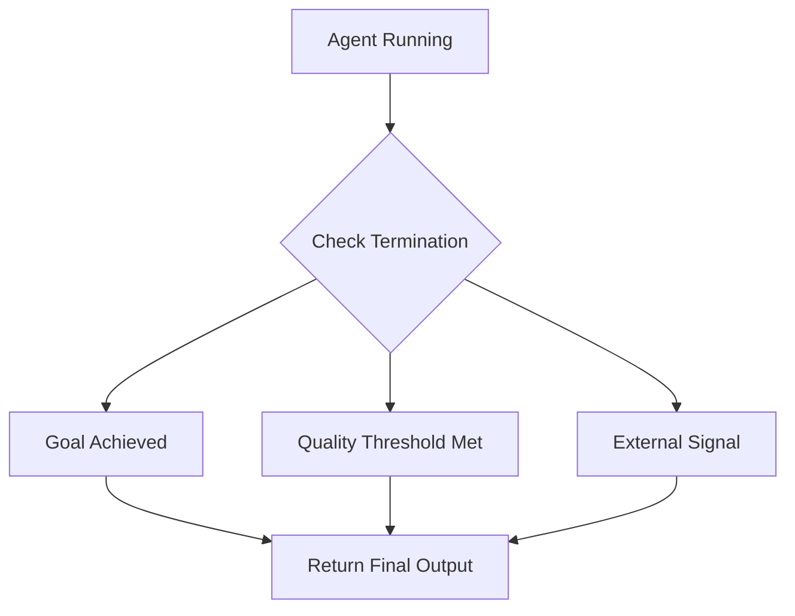

# Loop Termination Conditions

## Introduction

An agent loop that never stops is worse than one that never starts. Knowing **when to stop** is as important as knowing what to do next. Loop termination conditions define the criteria that signal an agent has completed its task — or that further iteration would be wasteful.

Without clear termination conditions, agents waste tokens, hallucinate unnecessary tool calls, or cycle endlessly without making progress. Good termination design balances thoroughness (keeping the agent working until the task is truly done) with efficiency (stopping as soon as meaningful work is complete).

### What we'll cover

- The three classes of termination: goal achievement, quality thresholds, and external signals
- How OpenAI Agents SDK detects "final output"
- LangGraph's `should_continue` pattern and conditional routing to `END`
- Implementing custom termination logic with structured output
- Combining multiple termination conditions for robust stopping
- Graceful termination vs. hard termination

### Prerequisites

- [Simple Loop](./01-simple-loop.md) — the basic ReAct execution cycle
- [Iterative Refinement Loops](./02-iterative-refinement-loops.md) — convergence detection basics
- [Conditional Branching](./04-conditional-branching.md) — conditional edges in LangGraph

---

## Three classes of termination

Every termination condition falls into one of three categories:



| Class | What it detects | Example |
|-------|----------------|---------|
| **Goal achievement** | The agent completed its task | "I found the answer" — agent produces a final response |
| **Quality threshold** | Output meets a minimum standard | Evaluator scores content above 0.8 |
| **External signal** | Something outside the loop triggers a stop | Timeout, user cancellation, max iterations, cost limit |

> **🔑 Key concept:** Production agents combine all three classes. A research agent might stop when it finds the answer (goal), when its summary scores well enough (quality), or when it hits 20 iterations (external). The first condition to trigger wins.

---

## Goal achievement detection

The most natural termination: the agent decides it has enough information to answer the user's question.

### How OpenAI Agents SDK detects completion

In the OpenAI Agents SDK, the loop ends when the LLM produces a **final output** — a text response that matches the agent's `output_type` and includes no tool calls:

```python
from agents import Agent, Runner
from pydantic import BaseModel

class ResearchResult(BaseModel):
    """Structured final output — the agent is done when it returns this."""
    answer: str
    confidence: float
    sources: list[str]

agent = Agent(
    name="Researcher",
    instructions="Research the topic and provide a confident answer with sources.",
    tools=[search_tool, read_url_tool],
    output_type=ResearchResult,  # Loop ends when this type is produced
)

result = await Runner.run(agent, input="What is the population of Tokyo?")
print(result.final_output)
# ResearchResult(answer="13.96 million", confidence=0.95, sources=["https://..."])
```

The SDK's internal logic:

1. LLM response includes tool calls → **continue** (execute tools, loop again)
2. LLM response is text matching `output_type` → **stop** (return `RunResult`)
3. LLM response is a handoff → **switch agent** (continue loop with new agent)

> **Note:** If no `output_type` is set, any text response (without tool calls) is treated as the final output. Setting `output_type` to a Pydantic model forces the agent to produce structured data before the loop ends, which prevents premature stops with incomplete answers.

### LangGraph's should_continue pattern

In LangGraph, goal detection is explicit. A routing function checks the last message and returns `END` or the next node:

```python
from langgraph.graph import END

def should_continue(state: MessagesState) -> str:
    """Check if the agent should continue or stop."""
    last_message = state["messages"][-1]

    # If the LLM made tool calls, keep going
    if last_message.tool_calls:
        return "tools"

    # No tool calls → the agent is done
    return END
```

### Custom goal detection

For complex tasks, the LLM's decision to stop producing tool calls isn't enough. You might need explicit "I'm done" signaling:

```python
from pydantic import BaseModel, Field
from typing import Literal

class AgentDecision(BaseModel):
    """Structured decision at each step."""
    action: Literal["continue", "done"] = Field(
        description="Whether to keep working or finalize"
    )
    reasoning: str = Field(
        description="Why the agent chose this action"
    )
    next_step: str | None = Field(
        default=None,
        description="What to do next if continuing"
    )
    final_answer: str | None = Field(
        default=None,
        description="The answer if done"
    )

def check_goal(state: dict) -> str:
    """Ask the LLM if the task is complete."""
    response = client.chat.completions.create(
        model="gpt-4o-mini",
        messages=[
            {
                "role": "system",
                "content": (
                    "You are evaluating whether a research task is complete.\n"
                    "The task is done when you have a confident, well-sourced answer.\n"
                    "Respond with JSON: {action, reasoning, next_step, final_answer}"
                ),
            },
            {
                "role": "user",
                "content": f"Task: {state['task']}\nProgress so far: {state['findings']}",
            },
        ],
        response_format={"type": "json_object"},
    )

    decision = AgentDecision(**json.loads(response.choices[0].message.content))

    if decision.action == "done":
        print(f"  ✅ Goal achieved: {decision.reasoning}")
        return "done"
    else:
        print(f"  ➡️ Continuing: {decision.next_step}")
        return "continue"
```

---

## Quality threshold termination

Quality thresholds stop the loop when the output is "good enough," even if the agent hasn't explicitly decided to stop. This is central to the evaluator-optimizer pattern covered in [Iterative Refinement Loops](./02-iterative-refinement-loops.md).

### Score-based thresholds

```python
def check_quality_threshold(
    content: str,
    criteria: dict[str, float],
    min_score: float = 0.7,
) -> tuple[bool, dict]:
    """Check if content meets minimum quality standards.

    Args:
        content: The generated content to evaluate.
        criteria: Dict mapping criterion name to its weight.
        min_score: Minimum score to pass (0 to 1).

    Returns:
        Tuple of (passes_threshold, individual_scores).
    """
    scores = {}
    for criterion, weight in criteria.items():
        response = client.chat.completions.create(
            model="gpt-4o-mini",
            messages=[
                {
                    "role": "system",
                    "content": f"Score this content on {criterion} from 0 to 1. Respond with just the number.",
                },
                {"role": "user", "content": content},
            ],
        )
        scores[criterion] = float(response.choices[0].message.content.strip())

    # Weighted average
    weighted_sum = sum(scores[c] * criteria[c] for c in criteria)
    total_weight = sum(criteria.values())
    overall = weighted_sum / total_weight

    passes = overall >= min_score
    print(f"  Quality: {overall:.2f} ({'✅ Pass' if passes else '❌ Fail'})")
    for c, s in scores.items():
        print(f"    {c}: {s:.2f}")

    return passes, scores

# Usage
passes, scores = check_quality_threshold(
    content="Python's GIL prevents true parallelism for CPU tasks.",
    criteria={"accuracy": 0.4, "clarity": 0.3, "completeness": 0.3},
    min_score=0.75,
)
```

**Output:**
```
  Quality: 0.73 (❌ Fail)
    accuracy: 0.90
    clarity: 0.85
    completeness: 0.45
```

### Diminishing returns detection

Sometimes quality plateaus. Detecting this prevents wasting iterations on marginal improvements:

```python
def detect_diminishing_returns(
    score_history: list[float],
    window: int = 3,
    threshold: float = 0.02,
) -> bool:
    """Stop if recent improvement is below the threshold.

    Args:
        score_history: List of scores from each iteration.
        window: Number of recent scores to compare.
        threshold: Minimum improvement to justify continuing.

    Returns:
        True if improvement has stalled.
    """
    if len(score_history) < window:
        return False

    recent = score_history[-window:]
    improvement = recent[-1] - recent[0]

    if improvement < threshold:
        print(f"  ⚠️ Diminishing returns: improvement={improvement:.3f} < {threshold}")
        return True

    return False

# Example: scores improving rapidly, then plateauing
history = [0.45, 0.62, 0.71, 0.78, 0.79, 0.80, 0.80]
for i in range(3, len(history)):
    if detect_diminishing_returns(history[:i + 1]):
        print(f"  Stop at iteration {i}")
        break
```

**Output:**
```
  ⚠️ Diminishing returns: improvement=0.010 < 0.02
  Stop at iteration 5
```

---

## External signal termination

External signals come from outside the agent's reasoning process. They are safety nets that prevent runaway execution.

### Timeout-based termination

```python
import asyncio
import time

async def run_with_timeout(
    agent_loop,
    timeout_seconds: float = 30.0,
) -> dict:
    """Run an agent loop with a hard timeout.

    Args:
        agent_loop: The async agent coroutine.
        timeout_seconds: Maximum execution time.

    Returns:
        Agent result or timeout message.
    """
    try:
        result = await asyncio.wait_for(agent_loop, timeout=timeout_seconds)
        return {"status": "completed", "result": result}
    except asyncio.TimeoutError:
        return {
            "status": "timeout",
            "message": f"Agent did not complete within {timeout_seconds}s",
        }

# Usage
result = await run_with_timeout(
    agent_loop=run_agent("complex research question"),
    timeout_seconds=60.0,
)

if result["status"] == "timeout":
    print(f"⚠️ {result['message']}")
```

### Cost-based termination

Track API costs and stop before exceeding a budget:

```python
class CostTracker:
    """Track LLM API costs across iterations."""

    # Approximate costs per 1K tokens (as of 2025)
    PRICING = {
        "gpt-4o": {"input": 0.0025, "output": 0.01},
        "gpt-4o-mini": {"input": 0.00015, "output": 0.0006},
    }

    def __init__(self, budget: float):
        self.budget = budget
        self.total_cost = 0.0
        self.calls = 0

    def track(self, model: str, input_tokens: int, output_tokens: int) -> bool:
        """Record a call and return True if within budget."""
        pricing = self.PRICING.get(model, {"input": 0.01, "output": 0.03})
        cost = (
            (input_tokens / 1000) * pricing["input"]
            + (output_tokens / 1000) * pricing["output"]
        )
        self.total_cost += cost
        self.calls += 1

        if self.total_cost > self.budget:
            print(f"  💰 Budget exceeded: ${self.total_cost:.4f} > ${self.budget:.4f}")
            return False

        remaining = self.budget - self.total_cost
        print(f"  💰 Cost: ${cost:.4f} (total: ${self.total_cost:.4f}, remaining: ${remaining:.4f})")
        return True

# Usage in an agent loop
tracker = CostTracker(budget=0.50)  # $0.50 max

for turn in range(20):
    response = client.chat.completions.create(model="gpt-4o-mini", messages=messages)

    within_budget = tracker.track(
        model="gpt-4o-mini",
        input_tokens=response.usage.prompt_tokens,
        output_tokens=response.usage.completion_tokens,
    )

    if not within_budget:
        print("Stopping: budget exceeded")
        break
```

### User cancellation

In interactive applications, users should be able to cancel a running agent:

```python
import asyncio

class CancellableAgent:
    """Agent that can be cancelled by the user."""

    def __init__(self):
        self._cancelled = False

    def cancel(self):
        """Signal the agent to stop at the next checkpoint."""
        self._cancelled = True
        print("  🛑 Cancellation requested")

    async def run(self, task: str, max_turns: int = 10) -> str:
        messages = [{"role": "user", "content": task}]

        for turn in range(max_turns):
            # Check cancellation before each LLM call
            if self._cancelled:
                return f"Cancelled after {turn} turns. Partial result: {messages[-1].get('content', 'N/A')}"

            response = await client.chat.completions.create(
                model="gpt-4o-mini",
                messages=messages,
            )

            # ... process response, execute tools ...

        return messages[-1]["content"]
```

---

## Combining termination conditions

Production agents use multiple conditions simultaneously. The first one triggered stops the loop:

```python
class TerminationManager:
    """Manages multiple termination conditions for an agent loop."""

    def __init__(
        self,
        max_turns: int = 10,
        timeout_seconds: float = 60.0,
        budget: float = 1.0,
        min_quality: float = 0.8,
    ):
        self.max_turns = max_turns
        self.timeout_seconds = timeout_seconds
        self.cost_tracker = CostTracker(budget=budget)
        self.min_quality = min_quality
        self.start_time = time.time()

    def should_stop(self, turn: int, quality_score: float | None = None) -> tuple[bool, str]:
        """Check all termination conditions.

        Returns:
            Tuple of (should_stop, reason).
        """
        # Check iteration limit
        if turn >= self.max_turns:
            return True, f"max_turns ({self.max_turns})"

        # Check timeout
        elapsed = time.time() - self.start_time
        if elapsed > self.timeout_seconds:
            return True, f"timeout ({elapsed:.1f}s > {self.timeout_seconds}s)"

        # Check budget
        if self.cost_tracker.total_cost > self.cost_tracker.budget:
            return True, f"budget (${self.cost_tracker.total_cost:.4f})"

        # Check quality
        if quality_score is not None and quality_score >= self.min_quality:
            return True, f"quality_threshold ({quality_score:.2f} >= {self.min_quality})"

        return False, ""

# Usage
terminator = TerminationManager(max_turns=10, timeout_seconds=30, budget=0.50)

for turn in range(20):
    # ... agent logic ...

    should_stop, reason = terminator.should_stop(turn, quality_score=0.75)
    if should_stop:
        print(f"  Stopping: {reason}")
        break
```

**Output:**
```
  Stopping: quality_threshold (0.82 >= 0.8)
```

---

## Graceful vs. hard termination

| Type | Behavior | Use case |
|------|----------|----------|
| **Graceful** | Agent produces a summary of partial progress | Max iterations, budget exceeded, timeout |
| **Hard** | Execution stops immediately, no cleanup | System error, security violation, emergency |

### Implementing graceful termination

```python
async def graceful_terminate(agent_state: dict, reason: str) -> str:
    """Ask the LLM to summarize whatever progress was made."""
    response = await client.chat.completions.create(
        model="gpt-4o-mini",
        messages=[
            {
                "role": "system",
                "content": (
                    f"The agent loop is being terminated ({reason}). "
                    f"Summarize what was accomplished and what remains incomplete."
                ),
            },
            {
                "role": "user",
                "content": f"Task: {agent_state['task']}\nFindings so far: {agent_state['findings']}",
            },
        ],
    )
    return response.choices[0].message.content
```

> **💡 Tip:** Graceful termination is almost always better than hard termination. Even a partial answer with "I ran out of time but here's what I found so far" is more useful than silence.

---

## Best practices

| Practice | Why it matters |
|----------|----------------|
| Combine multiple termination conditions | No single condition handles all failure modes |
| Prefer graceful termination | Partial results are better than no results |
| Log the termination reason | Essential for debugging and optimization |
| Set conservative defaults, then tune | Start with `max_turns=10`, `timeout=30s`, adjust based on actual usage |
| Use structured output for goal detection | Prevents the LLM from "deciding" it's done prematurely |

---

## Common pitfalls

| ❌ Mistake | ✅ Solution |
|-----------|-------------|
| Only using `max_turns` as a termination condition | Combine with timeout, budget, and quality checks |
| Agent loops that only stop when the LLM "decides" to | Always add external safety limits as backup |
| No graceful handling of termination | Summarize partial progress instead of returning nothing |
| Setting quality thresholds too high | 0.9+ thresholds often cause unnecessary iterations — 0.7-0.8 is usually sufficient |
| Ignoring cost tracking | API calls add up fast — track costs per agent run |

---

## Hands-on exercise

### Your task

Build a `TerminationManager` class that combines four termination conditions: max iterations, timeout, cost budget, and quality threshold. Integrate it into a simple agent loop that searches for information and terminates when any condition is met.

### Requirements

1. The manager should check conditions in priority order: timeout → budget → quality → max_turns
2. Each condition check should return the reason if triggered
3. On any termination, produce a graceful summary of partial progress
4. Track and log which condition triggered the stop
5. Test with a deliberately slow task to trigger the timeout condition

### Expected result

```
[Turn 1] Searching for "population of Tokyo"...
  💰 Cost: $0.0012 (remaining: $0.4988)
[Turn 2] Searching for "Tokyo metropolitan area definition"...
  💰 Cost: $0.0015 (remaining: $0.4973)
[Turn 3] Quality check: 0.82 >= 0.80
  ✅ Stopping: quality_threshold
  Summary: Tokyo's population is approximately 13.96 million (city proper)
  or 37.4 million (greater metropolitan area).
```

<details>
<summary>💡 Hints (click to expand)</summary>

- Use `time.time()` at the start and check elapsed time each iteration
- Track tokens from `response.usage.prompt_tokens` and `response.usage.completion_tokens`
- The quality check can use a simple LLM call: "Rate this answer's completeness from 0 to 1"
- Priority order means: check timeout first, then budget, then quality, then max_turns

</details>

<details>
<summary>✅ Solution (click to expand)</summary>

```python
import time
import json
from openai import OpenAI

client = OpenAI()

class TerminationManager:
    def __init__(self, max_turns=10, timeout=30.0, budget=0.50, min_quality=0.8):
        self.max_turns = max_turns
        self.timeout = timeout
        self.budget = budget
        self.min_quality = min_quality
        self.start_time = time.time()
        self.total_cost = 0.0
        self.log = []

    def track_cost(self, model, input_tokens, output_tokens):
        rates = {"gpt-4o-mini": (0.00015, 0.0006), "gpt-4o": (0.0025, 0.01)}
        inp_rate, out_rate = rates.get(model, (0.01, 0.03))
        cost = (input_tokens / 1000) * inp_rate + (output_tokens / 1000) * out_rate
        self.total_cost += cost
        remaining = self.budget - self.total_cost
        print(f"  💰 Cost: ${cost:.4f} (remaining: ${remaining:.4f})")

    def check(self, turn, quality_score=None):
        elapsed = time.time() - self.start_time
        if elapsed > self.timeout:
            reason = f"timeout ({elapsed:.1f}s)"
            self.log.append(reason)
            return True, reason
        if self.total_cost > self.budget:
            reason = f"budget (${self.total_cost:.4f})"
            self.log.append(reason)
            return True, reason
        if quality_score is not None and quality_score >= self.min_quality:
            reason = f"quality_threshold ({quality_score:.2f})"
            self.log.append(reason)
            return True, reason
        if turn >= self.max_turns:
            reason = f"max_turns ({self.max_turns})"
            self.log.append(reason)
            return True, reason
        return False, ""

def run_research_agent(query, max_turns=10, timeout=30.0, budget=0.50):
    tm = TerminationManager(max_turns=max_turns, timeout=timeout, budget=budget)
    messages = [
        {"role": "system", "content": "Research the topic. When confident, produce a final answer."},
        {"role": "user", "content": query},
    ]
    findings = ""

    for turn in range(max_turns):
        response = client.chat.completions.create(
            model="gpt-4o-mini", messages=messages
        )
        msg = response.choices[0].message
        findings = msg.content
        messages.append({"role": "assistant", "content": findings})

        tm.track_cost("gpt-4o-mini", response.usage.prompt_tokens, response.usage.completion_tokens)

        # Check quality
        q_resp = client.chat.completions.create(
            model="gpt-4o-mini",
            messages=[
                {"role": "system", "content": "Rate answer completeness 0-1. Respond with just the number."},
                {"role": "user", "content": f"Query: {query}\nAnswer: {findings}"},
            ],
        )
        tm.track_cost("gpt-4o-mini", q_resp.usage.prompt_tokens, q_resp.usage.completion_tokens)
        score = float(q_resp.choices[0].message.content.strip())
        print(f"[Turn {turn + 1}] Quality: {score:.2f}")

        stop, reason = tm.check(turn, quality_score=score)
        if stop:
            print(f"  ✅ Stopping: {reason}")
            print(f"  Summary: {findings[:200]}")
            return findings

    return findings

result = run_research_agent("What is the population of Tokyo?")
```

</details>

### Bonus challenges

- [ ] Add a "stuck detection" condition that triggers if the agent's output hasn't changed meaningfully in 3 consecutive turns
- [ ] Implement a `remaining_budget_pct()` method that shows how much budget remains as a percentage
- [ ] Add user cancellation support with `asyncio.Event` that can be set from an external signal

---

## Summary

✅ Termination conditions fall into three classes: **goal achievement**, **quality thresholds**, and **external signals** (timeout, budget, max turns)

✅ OpenAI Agents SDK stops when the LLM produces a response matching `output_type` with no tool calls

✅ LangGraph uses `should_continue` routing functions that return `END` when the task is complete

✅ **Combine multiple conditions** — no single condition catches all failure modes

✅ **Graceful termination** with partial progress summaries is almost always better than hard stops

**Next:** [Maximum Iteration Limits](./06-maximum-iteration-limits.md)

---

## Further reading

- [OpenAI Agents SDK — Running Agents](https://openai.github.io/openai-agents-python/running_agents/) — final output detection and `output_type`
- [Anthropic — Building Effective Agents](https://www.anthropic.com/engineering/building-effective-agents) — stopping conditions and human checkpoints
- [LangGraph — Conditional Edges](https://docs.langchain.com/oss/python/langgraph/workflows-agents) — routing to END

*[Back to Execution Loop Patterns](./00-execution-loop-patterns.md)*

<!--
Sources Consulted:
- OpenAI Agents SDK Running Agents: https://openai.github.io/openai-agents-python/running_agents/
- Anthropic Building Effective Agents: https://www.anthropic.com/engineering/building-effective-agents
- LangGraph Workflows and Agents: https://docs.langchain.com/oss/python/langgraph/workflows-agents
-->
