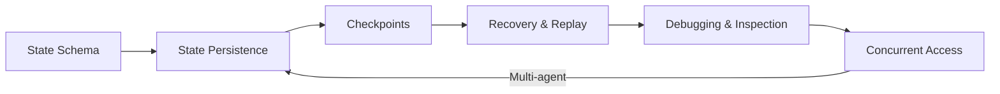

# State Management

## Overview

State management is the backbone of reliable AI agents. While a single-turn LLM call is stateless — you send a prompt, get a response — agents operate over multiple steps, decisions, and interactions. They need to remember what they've done, what they're working on, and what happens if something goes wrong. Without disciplined state management, agents lose context, repeat work, corrupt data, and become impossible to debug.

This lesson covers the full lifecycle of agent state: how to design it, how to persist it, how to checkpoint for fault tolerance, how to debug it when things go wrong, and how to handle concurrent access safely.

### What we'll cover

| # | Topic | Description |
|---|-------|-------------|
| 1 | [Agent State Representation](./01-agent-state-representation.md) | State schema design with TypedDict, Pydantic, and reducers |
| 2 | [State Persistence](./02-state-persistence.md) | Database storage, session management, and cross-session memory |
| 3 | [Checkpointing for Recovery](./03-checkpointing-for-recovery.md) | Automatic checkpoints, time travel, and fault tolerance |
| 4 | [State Debugging](./04-state-debugging.md) | State inspection, history, diff visualization, and assertions |
| 5 | [Concurrent State Access](./05-concurrent-state-access.md) | Race condition prevention, reducers, and state isolation |

### Prerequisites

- Understanding of [Agent Fundamentals](../01-agent-fundamentals/00-agent-fundamentals.md)
- Familiarity with [Agent Memory Systems](../04-agent-memory-systems/00-agent-memory-systems.md)
- Basic knowledge of [Execution Loop Patterns](../06-execution-loop-patterns/00-execution-loop-patterns.md)
- Python experience with dataclasses and type hints

### Learning objectives

After completing this lesson, you will be able to:

- ✅ Design typed state schemas that capture agent progress and intermediate results
- ✅ Persist agent state across sessions using checkpointers and session backends
- ✅ Implement checkpointing strategies with time travel and replay capabilities
- ✅ Debug state issues using inspection tools, history, and diff analysis
- ✅ Handle concurrent state access with reducers, thread isolation, and locking

---

## Key concepts

**State** is the shared data structure that represents the current snapshot of your agent's execution. It includes everything from conversation messages and intermediate results to task progress and error history. Frameworks like LangGraph and OpenAI Agents SDK provide structured approaches to managing this state automatically.

### Framework landscape

| Framework | State Approach | Persistence | Checkpointing |
|-----------|---------------|-------------|---------------|
| **LangGraph** | TypedDict with reducers | Checkpointers (SQLite, Postgres) | Every super-step, automatic |
| **OpenAI Agents SDK** | Sessions (SQLite, SQLAlchemy) | Session backends | Conversation-level |
| **Custom agents** | Dataclass / Pydantic models | Manual implementation | Application-defined |

---

**Next:** [Agent State Representation](./01-agent-state-representation.md)

---

*[Back to AI Agents Overview](../00-overview.md)*
